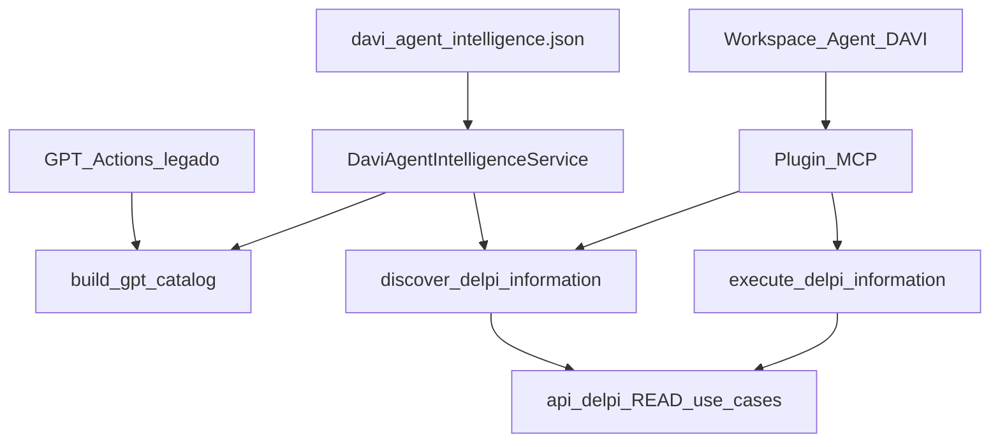

# Plano: DAVI herda TÉO/VISTA — inteligência viva (READ-only)

## Decisão do usuário (travada)

```text
Escopo A = inteligência viva / agent_directives / pastes estáveis
+ MCP / Workspace Agent (canônico)
+ catalog GPT legado (gpt_get_catalog)
SEM writes / commit_now / GovernedWriteOrchestrator / PREPARE-ACT
```

Espelha o **método** do [plano TÉO](file:///home/analistaptd/.cursor/plans/téo_herda_vista_2f2c6d79.plan.md) (E*.S*, hygiene, PASS_IMPLEMENTACAO vs PASS_GOLIVE), **não** o pacote de mutação.

---

## Protocolo de execução

Antes de **cada** `E*.S*`:

```text
plan-execution.mdc
→ revalidar regra/código/contrato/working tree
→ READY_TO_EXECUTE
→ menor escopo
→ positive + sibling + negative quando aplicável
→ prova de integração (entrada → canônico → consumidor → saída)
→ COMPLETE_GATE + higiene (cutover → cleanup → residual)
→ só então desbloquear dependentes
```

Drift → `EXECUTION_DRIFT` / STOP-THE-LINE no subgrafo.

Commit/push: **autorizados neste plano** só em E5.S9–S10 após E5.S8 `READY_TO_COMMIT`.

---

## Ledger RQ

| ID | Requisito | Estado |
|---|---|---|
| RQ-01 | Inteligência mutável em JSON deployável (`davi_agent_intelligence.json`) | ATENDIDO_NO_PLANO |
| RQ-02 | Pastes estáveis (Agent Studio + MCP branding); mutável só no JSON | ATENDIDO_NO_PLANO |
| RQ-03 | Persona/identidade DAVI permanece no paste; conduta tipável no catálogo | ATENDIDO_NO_PLANO |
| RQ-04 | `gpt_get_catalog` expõe `capability_surface.agent_directives` | ATENDIDO_NO_PLANO |
| RQ-05 | MCP `discover_delpi_information` expõe as **mesmas** directives (mesmo producer) | ATENDIDO_NO_PLANO |
| RQ-06 | Sem nova MCP tool; manter 3 tools estáveis | ATENDIDO_NO_PLANO |
| RQ-07 | Sem writes externos; allowlist/READ guard inalterados semanticamente | ATENDIDO_NO_PLANO |
| RQ-08 | Não enumerar inventário dinâmico (17 ops) no paste Agent | ATENDIDO_NO_PLANO |
| RQ-09 | Anti-padrões READ: inventar dados, alegar indisponível sem tentar tool, fingir gravação | ATENDIDO_NO_PLANO |
| RQ-10 | AuthZ backend-first; persona ≠ AuthZ | HERDADO |
| RQ-11 | GPT Actions permanece `LEGACY_TRANSITIONAL` (não expandir ops) | ATENDIDO_NO_PLANO |
| RQ-12 | Budgets: directives compactas; execute/discover budgets existentes respeitados | ATENDIDO_NO_PLANO |
| RQ-13 | IDs EN; PT em UI/docs/commit | HERDADO |
| RQ-14 | Testes + commit/push + deploy local-first + go-live Agent/MCP | ATENDIDO_NO_PLANO |

**Fora de escopo (justificado):** `commit_now`; Orchestrator; nova Action GPT; 4ª tool MCP; enumerar allowlist no prompt; Ajuda MFE; Chat AI interno; DÉLIA; promoção de writes PREPARE (cost simulation continua DEFER).

---

## Evidência baseline (`CONFIRMADO_NO_CODIGO`)

| Fato | Path |
|---|---|
| Consumer canônico = Workspace Agent → Plugin/MCP | [openai-workspace-agent-davi.md](api-delpi/docs/integrations/openai-workspace-agent-davi.md) |
| MCP 3 tools READ | `search_products`, `discover_delpi_information`, `execute_delpi_information` |
| GPT Actions = `LEGACY_TRANSITIONAL`, 2 ops | [constants.py](api-delpi/app/application/gpt_actions/constants.py), OpenAPI ~5.3 KiB |
| Catalog GPT sem `capability_surface` | [catalog_service.py](api-delpi/app/application/external_capabilities/catalog_service.py) |
| Sem `davi_agent_intelligence*` / `agent_directives` | grep zero |
| Instructions canônicas + gate “não enumerar inventory” | [test_davi_agent_instructions_contract.py](api-delpi/tests/test_davi_agent_instructions_contract.py) |
| Branding MCP estático | [branding.py](api-delpi/app/interface/mcp/branding.py) |
| Execute budget 64 KiB | `davi_dynamic_read_budgets.json` |
| Allowlist v9 = 17 eligible READ | `davi_external_read_allowlist.json` |

---

## Hipóteses / anti-cópia

| ID | Hipótese | Status | Ação |
|---|---|---|---|
| H1 | Persona no paste basta para conduta tipável | PARCIAL — muda exige re-sync Studio | E1 JSON + inject |
| H2 | Copiar `commit_now` do TÉO | REJEITADA (READ-only) | FORA |
| H3 | Nova tool `get_catalog` MCP | REJEITADA (RQ-06) | directives em `discover` + GPT catalog |
| H4 | Expandir GPT Actions para paridade tool-a-tool | REJEITADA (LEGACY) | só inject no catalog existente |
| H5 | Directives incham discover além do budget | HIPÓTESE_A_VALIDAR | E0.S2 + E3 compact |

---

## Delta antes → depois

| Caso | Antes | Depois |
|---|---|---|
| Conduta mutável (try tool, linguagem, anti-padrões) | Só paste Agent/MCP | `agent_directives` no deploy |
| `gpt_get_catalog` | lista estática LEGACY | + `capability_surface.agent_directives` |
| `discover_delpi_information` | candidates only | + mesmas directives (compact) |
| Persona masculina/cordial | Agent Instructions | Inalterada no paste estável |
| Pedido de gravação | paste “somente leitura” | JSON `not_exposed.writes` + paste; **sem** ACT |
| Inventário 17 ops | runtime allowlist | Continua runtime; **não** no paste |

Invariantes: AuthZ; 3 MCP tools; 2 GPT ops; allowlist/eligibility; `read_only_intent_guard`; GPT `LEGACY_TRANSITIONAL`.

---

## Arquitetura-alvo



**Producer único:** `DaviAgentIntelligenceService.agent_directives()` (compact projection).  
**Consumidores:** `build_gpt_catalog` + envelope de `discover_delpi_information`.  
**Não** duplicar JSON em branding/paste.

---

## Decisões travadas

1. Owner: `api-delpi` only.
2. Escopo A only — zero write path externo.
3. Sem 4ª MCP tool; directives via `discover` + `gpt_get_catalog`.
4. GPT Actions: inject only; status LEGACY; sem novas ops.
5. Persona/identidade = Agent Instructions + branding display; conduta tipável = JSON.
6. Compact projection no service (espelho TÉO `_compact_for_actions`); não truncar candidates silenciosamente.
7. Gate anti-leak: chaves mutáveis do JSON **não** no bloco Agent Instructions nem em `DAVI_MCP_INSTRUCTIONS` longas.
8. Deploy local-first; go-live = re-sync Agent Studio (manual) + smoke MCP.
9. Hygiene: cutover → cleanup → residual; sem dual autoridade paste vs JSON.
10. Working tree: só artefatos deste plano no commit.

---

## Higienização (lista fechada)

| Legado | Onde | Após |
|---|---|---|
| Heurísticas mutáveis longas no paste Agent | `openai-workspace-agent-davi.md` bloco canônico | E1.S3 |
| Branding MCP sem ponte `agent_directives` | `branding.py` | E1.S4 |
| Catalog GPT sem surface | `catalog_service.py` | E1.S2 |
| Docs que dizem “só Instructions mudam conduta” | integrations docs | E4/E5 |
| Asserts que exigem ausência total de “agent_directives” no paste | tests | E1.S3 — paste **deve** mencionar a ponte, não o conteúdo mutável |

**Não apagar:** allowlist; budgets; eligibility; tests de “não enumerar inventory”; LEGACY status GPT.

Busca residual (antes E5.S8):

```bash
rg -n 'agent_directives|davi_agent_intelligence' api-delpi
rg -n 'commit_now|GovernedWrite|Confirma\?' api-delpi/app api-delpi/docs/integrations  # deve permanecer zero no caminho DAVI
rg -n 'get_product_stock|eligible_read' api-delpi/docs/integrations/openai-workspace-agent-davi.md  # continua proibido no bloco canônico
```

---

## Matriz transversal

| Superfície | Impacto | Prova |
|---|---|---|
| Workspace Agent | Instructions enxutas + sync Studio | E1.S3, E5.S6 |
| MCP Plugin | branding + discover directives | E1.S4, E2, E5.S7 |
| GPT Actions legado | catalog + OpenAPI sync se shape mudar | E1.S2, E5.S4 |
| Allowlist / execute | inalterado semanticamente | E0/E5 regression |
| Knowledge / Chat AI | fora | FORA |

---

## Dependências

```text
E0
 → E1.S1–S2 (JSON + service + inject)
 → E1.S3–S5 ∥ E2 (parity surfaces) ∥ E3 (compact/budgets)
 → E4 (flows READ rich)
 → E5 gates + PASS
```

Ordem: **E0 → E1.S1–S2 → E2.S1 → E1.S3–S5 ∥ E3 → E4 → E5**.

---

## E0 — Baseline

### E0.S1 — Inventário wiring (read-only)
- Confirmar paths: `catalog_service.build_gpt_catalog`, `discover_service.discover_delpi_information`, `branding.py`, Agent doc, allowlist, budgets.
- Pós-condição: zero mutação; paths no plano/PR.
- RQ-07, RQ-11.

### E0.S2 — Medir budgets
- Bytes OpenAPI GPT; sample tamanho `discover` (com/sem directives mock); `execute_max_response_bytes`.
- Registrar números HEAD; se directives mock > margem segura → priorizar E3 compact.
- RQ-12.

---

## E1 — Inteligência viva + pastes

### E1.S1 — Scaffold `davi_agent_intelligence.json`
- Criar [api-delpi/app/content/davi_agent_intelligence.json](api-delpi/app/content/davi_agent_intelligence.json).
- Skeleton: `version`, `owner=api-delpi`, `read_only=true`, `actions_runtime`, `discovery`, `execution_posture`, `modes`, `language`, `persona_bridge` (ponte, não copy de persona), `anti_patterns`, `not_exposed`, `surface_parity`, `flows` (vazio tipado → E4).
- **Proibido** no JSON: `write_flow`, `commit_now`, PREPARE/ACT pipelines.
- Teste: parse + `read_only` true.
- RQ-01, RQ-07.

### E1.S2 — `DaviAgentIntelligenceService` + inject
- Novo service (espelho [teo_agent_intelligence_service.py](transformometro-api/tm_app/application/gpt_actions/teo_agent_intelligence_service.py)): load + `_compact_for_actions` + `agent_directives()`.
- Wire:
  - `build_gpt_catalog()` → `capability_surface: { agent_directives }`
  - `discover_delpi_information` return → mesmo bloco (campo top-level ou sob `capability_surface`)
- Teste: catalog + discover unit contêm directives idênticas (mesmo hash/version).
- RQ-04, RQ-05.

### E1.S3 — Enxugar Agent Instructions (+ cleanup)
- Em [openai-workspace-agent-davi.md](api-delpi/docs/integrations/openai-workspace-agent-davi.md): bloco canônico ≤ budget estável; manter persona; adicionar “no início de tarefas tipáveis: discover (ou gpt_get_catalog) → obedecer `agent_directives`”; remover heurísticas mutáveis que migrarem ao JSON.
- Atualizar [test_davi_agent_instructions_contract.py](api-delpi/tests/test_davi_agent_instructions_contract.py): exige ponte `agent_directives`; continua proibindo inventário dinâmico.
- RQ-02, RQ-03, RQ-08.

### E1.S4 — Enxugar `DAVI_MCP_INSTRUCTIONS`
- [branding.py](api-delpi/app/interface/mcp/branding.py): ponte “obey agent_directives from discover”; READ-only; sem pipelines longos.
- Teste: contém `agent_directives`; não contém lista de operationIds de produto.
- RQ-02, RQ-05.

### E1.S5 — Gate anti-vazamento
- Teste: chaves mutáveis do JSON (`anti_patterns` detalhados, `flows.*`, princípios longos) **não** aparecem no bloco Agent nem no branding.
- Espelho espírito Vista `test_vista_builder_instructions_budget.py`.
- RQ-02.
- Pós-condição E1: producer+consumers; pastes estáveis; gates verdes.

---

## E2 — Paridade de superfícies (substitui commit_now do TÉO)

### E2.S1 — Contrato de envelope único
- Documentar + tipar no código o shape mínimo:

```text
capability_surface.agent_directives.version
capability_surface.agent_directives.read_only = true
(+ seções compactadas)
```

- GPT e MCP usam o **mesmo** método do service (sem segunda cópia).
- Teste: `build_gpt_catalog()["capability_surface"]["agent_directives"]` == discover payload directives (versão + chaves top-level).
- RQ-04, RQ-05.

### E2.S2 — Negative: write intent
- Pedido/query com intenção de escrita → `read_only_intent_guard` continua zerando candidates; directives ainda presentes (informam postura) sem habilitar write.
- Teste sibling do guard existente + assert directives presentes.
- RQ-07, RQ-09.

### E2.S3 — GPT OpenAPI / schema (se necessário)
- Se o envelope catalog documentado no OpenAPI legado listar `data` livre, manter; **não** inventar nova op. Sync artifact só se builder mudar.
- RQ-11.
- Pós-condição E2: parity GPT↔MCP sem tool nova.

---

## E3 — Budgets / compact

### E3.S1 — Compact projection no service
- Drop summaries/examples longos na projeção Actions/MCP (padrão TÉO `_DROP_DIRECTIVE_KEYS` / caps de listas).
- Teste: directives serializadas ≤ limite interno (definir em E0.S2; default sugerido 8–16 KiB).
- RQ-12.

### E3.S2 — Discover ainda cabe no budget
- Sample discover com top_k max + directives ≤ política existente (não romper `execute_max` — directives só no discover).
- RQ-12.

### E3.S3 — OpenAPI GPT
- Confirmar permanece ≪ 100 KiB (baseline ~5 KiB). Sem trabalho de corte estilo TÉO salvo regressão.
- RQ-11, RQ-12.

---

## E4 — Flows READ no JSON (P0→P2)

### E4.S1 — P0 conteúdo operacional
- Preencher JSON:
  - `actions_runtime` (TRY tool before claim unavailable)
  - `discovery` (discover → execute; search_products fast path)
  - `execution_posture` (candidate_token; nunca inventar campos)
  - `language` (pt-BR user-facing; IDs EN)
  - `anti_patterns` (inventar estoque/preço; fingir gravação; enumerar catalog no chat)
  - `not_exposed` (writes, SQL arbitrário, generic proxy)
- RQ-09, RQ-01.

### E4.S2 — P0 modes
- Ex.: `quick_lookup` | `multi_source_reconcile` | `explain_gap` — só READ.
- RQ-01.

### E4.S3 — P1 flows tipados
- `flows.product_master_search`, `flows.stock_and_supply`, `flows.structure_bom`, etc. apontando tools MCP (`discover`/`execute`/`search_products`) — **dual-ID se GPT legado aplicar** (`gpt_search_products` só onde LEGACY cobre).
- Não inventar ops GPT novas.
- RQ-05, RQ-11.

### E4.S4 — P2 docs cleanup
- Atualizar [openai-plugin-mcp.md](api-delpi/docs/integrations/openai-plugin-mcp.md) / matrix se existir: directives = SoT mutável.
- RQ-02.

### E4.S5 — Teste de conteúdo
- version bump; seções P0 obrigatórias presentes; `read_only` true; ausência de `commit_now`/`write_flow`.
- RQ-07.

---

## E5 — Gates + PASS

### E5.S1 — Wiring
- Catalog GPT e discover MCP leem o service (não JSON direto duplicado).
- RQ-04, RQ-05.

### E5.S2 — Paridade
- Mesma `version` nas duas superfícies no mesmo processo.
- RQ-05.

### E5.S3 — Leak gate + instructions contract
- Suite E1.S3/S5 verde.
- RQ-02, RQ-08.

### E5.S4 — Sync artifacts
- `openapi-gpt-actions.json` se builder tocado; sem expandir ops.
- RQ-11.

### E5.S5 — Deploy local-first
- Deploy api-delpi por git após push (quando E5.S10 feito).
- RQ-14.

### E5.S6 — PASS_GOLIVE Agent Studio
- Operador: recolar bloco canônico atualizado; smoke discover+execute com directives observadas.
- Se não executado → `PENDENTE` (não PASS falso).
- RQ-14.

### E5.S7 — PASS_GOLIVE MCP
- Smoke Plugin/MCP: discover retorna `agent_directives`; execute elegível ok; write intent negado.
- RQ-14.

### E5.S8 — PASS_IMPLEMENTACAO
- Completar checklist: RQ ledger; residual hygiene; tríades; objetivo original (inteligência viva READ nas 3 camadas pedidas).
- Adversarial: “directives no catalog mas Agent antigo sem ponte” → mitigado por E1.S3 + E5.S6 PENDENTE explícito.

### E5.S9–S10 — Commit + push
- Mensagem focada no why; sem artefatos alheios; push `origin`.

---

## Rastreabilidade RQ → etapa → teste

| RQ | Subetapas | Aceite |
|---|---|---|
| RQ-01, RQ-09 | E1.S1, E4 | JSON P0 + testes conteúdo |
| RQ-02, RQ-03, RQ-08 | E1.S3–S5 | contract + leak gates |
| RQ-04 | E1.S2, E2.S1, E5.S1 | gpt_get_catalog directives |
| RQ-05, RQ-06 | E1.S2, E2, E5.S2 | discover same producer; 3 tools |
| RQ-07, RQ-11 | E0, E2.S2, E4.S5, E5 | no write; LEGACY intact |
| RQ-12 | E0.S2, E3 | compact + budgets |
| RQ-10, RQ-13 | HERDADO | AuthZ/IDs |
| RQ-14 | E5.S5–S10 | PASS_IMPLEMENTACAO + GOLIVE/PENDENTE |

---

## Critério canônico de implementado

Igual TÉO: arquivo ≠ entregue; precisa producer→consumer→saída; positive/sibling/negative; hygiene; `COMPLETE_GATE` por subetapa.

`PASS_IMPLEMENTACAO` ≠ `PASS_GOLIVE`. Go-live Agent Studio é evidência de operador.

---

## Regras Cursor

| Camada | Regra |
|---|---|
| Constituição | development-standards-index, evidence-driven, centralized-rules-first, clean-code, english-ids |
| Plano/exec | plan-construction, plan-execution, test-and-commit |
| Especialista | `openai-workspace-agent-integration`, `openai-plugin-mcp-integration`, `custom-gpt-actions-integration` (LEGACY inject only) |
| Plataforma | architecture, security, contracts, quality, delivery (`local-first-deploy`), reliability, `ai-external-tools-security` |

Não owner: Chat OpenAPI-first routing; DÉLIA.

---

## verify-final (pedido original)

```text
OBJETIVO: mesmo plano-método do TÉO aplicado ao DAVI
ESCOPO: A + MCP/Agent + catalog GPT
SEM: writes/commit_now
ENTREGÁVEL: davi_agent_intelligence → agent_directives em discover + gpt_get_catalog;
            pastes estáveis; hygiene; PASS_IMPLEMENTACAO; PASS_GOLIVE ou PENDENTE
```
