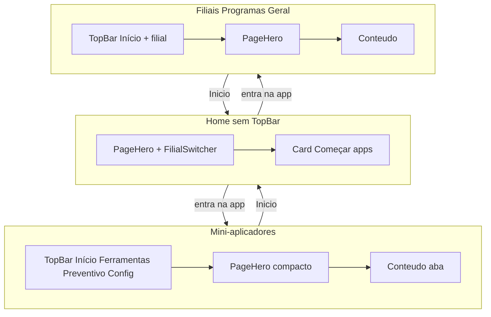
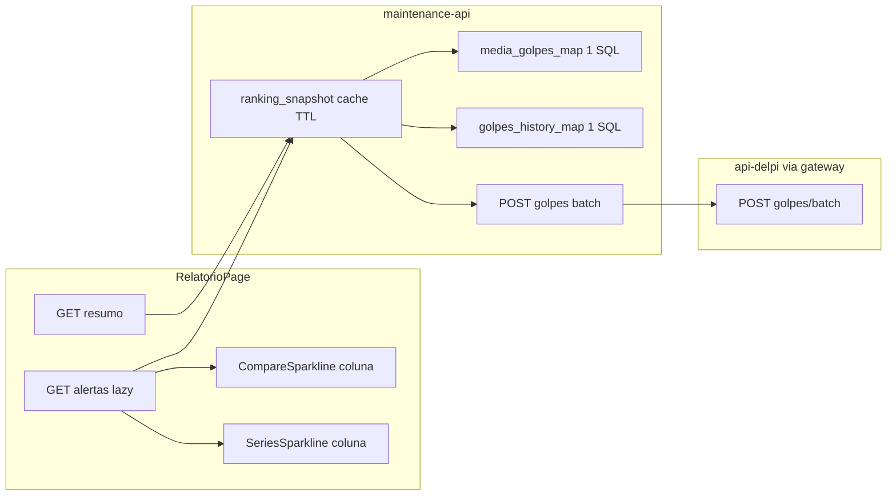
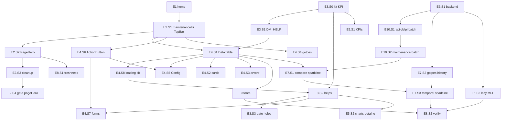

# Portal Manutenção — UI + Relatório Preventivo (plano único)

**Documento canônico:** [`manutenção_ui_excelência_8ce1554c.plan.md`](/home/analistaptd/.cursor/plans/manutenção_ui_excelência_8ce1554c.plan.md) — **único plano ativo** para este escopo. Novas melhorias entram como etapas `E9+` com receita `E*.S*` (não reabrir decisões travadas sem pedido explícito). Planos paralelos foram absorvidos e excluídos.

## Diretrizes Cursor (obrigatório)

Índice: [`development-standards-index.mdc`](.cursor/rules/development-standards-index.mdc). Este plano **não** contradiz:

| Regra | Aplicação neste plano |
|-------|------------------------|
| [`development-standards-index.mdc`](.cursor/rules/development-standards-index.mdc) | Índice transversal — consultar antes de cada subetapa |
| [`plan-construction.mdc`](.cursor/rules/plan-construction.mdc) | Receita `E*.S*` + matriz de fluxos + protocolo commit/push |
| [`test-and-commit.mdc`](.cursor/rules/test-and-commit.mdc) | Teste/build **antes** de cada commit |
| [`plugins-reusable-components.mdc`](.cursor/rules/plugins-reusable-components.mdc) | Kit-first; zero CSS `.delpi-ui-*` no MFE |
| [`plugins-visual-design-system.mdc`](.cursor/rules/plugins-visual-design-system.mdc) | Tokens `--dm-*`; layout de página só |
| [`plugins-overlay-positioning.mdc`](.cursor/rules/plugins-overlay-positioning.mdc) | Overlays via portal do kit |
| [`plugin-mfe-page-excellence.mdc`](.cursor/rules/plugin-mfe-page-excellence.mdc) | Helps hover no rótulo |
| [`centralized-rules-first.mdc`](.cursor/rules/centralized-rules-first.mdc) | Uma fonte canônica por regra; sem patch local |
| [`root-cause-generalized-fix.mdc`](.cursor/rules/root-cause-generalized-fix.mdc) | Causa raiz + generalização (ex.: ActionButton em todo MFE, não só Config) |
| [`english-code-identifiers.mdc`](.cursor/rules/english-code-identifiers.mdc) | Paths/arquivos EN; PT só UI/content |
| [`application-bounded-context-decoupling.mdc`](.cursor/rules/application-bounded-context-decoupling.mdc) | Batch/regra no **maintenance-api** |
| [`mfe-own-api-no-direct-api-delpi.mdc`](.cursor/rules/mfe-own-api-no-direct-api-delpi.mdc) | MFE → maintenance-api only |
| [`sql-query-development.mdc`](.cursor/rules/sql-query-development.mdc) | Medir SQL/cache antes do merge (E6) |
| [`infra-sequential-container-startup.mdc`](.cursor/rules/infra-sequential-container-startup.mdc) | Rebuild Docker via scripts sequenciais |
| [`plugins-documentation.mdc`](.cursor/rules/plugins-documentation.mdc) | README + status-atual após E8.S2 |
| [`new-api-route-checklist.mdc`](.cursor/rules/new-api-route-checklist.mdc) | E10.S1 — rota batch golpes api-delpi (OpenAPI + gates) |
| [`api-delpi-openapi-route-standards.mdc`](.cursor/rules/api-delpi-openapi-route-standards.mdc) | Path/operationId EN; locale bilíngue; `x-delpi` (E10.S1) |
| [`mf-federation-patch-safety.mdc`](.cursor/rules/mf-federation-patch-safety.mdc) | Se alterar plugin-ui (E3.S0, E7.S3): build remote antes do MFE |

## Inventário (estado atual)

| Área | Situação | Canônico |
|------|----------|----------|
| Home | [`.dm-home`](plugins/maintenance/src/index.css) `max-width: 1120px` **sem** `margin: 0 auto` | Centralizar com auto-margin |
| Shell | [`MaintenancePluginShell.tsx`](plugins/maintenance/src/components/MaintenancePluginShell.tsx) — TopBar **sempre** com nav módulo (Início, Filiais, …) | **Hub sem TopBar**; **apps** com TopBar **contextual** via [`maintenanceShellChrome.ts`](plugins/maintenance/src/app/maintenanceShellChrome.ts) |
| Headers | Locais [`PageHeader`](plugins/maintenance/src/components/PageHeader.tsx) / [`MiniAplicadoresPageHeader`](plugins/maintenance/src/components/MiniAplicadoresPageHeader.tsx) — ícone + brand-bar + nav empilhados (**screenshot Relatório**) | **`MaintenancePageHero`** (`createDashboardPageHero`, `density="compact"`) abaixo da TopBar — padrão [`CommercialPageHero`](plugins/commercial/src/app/commercialUi.ts) |
| Helps | Parcial: [`configTooltips.ts`](plugins/maintenance/src/content/configTooltips.ts); **modo `?`** em [`DataTableSection`](plugins/maintenance/src/components/data/DataTableSection.tsx) L167, [`FerramentaRevisaoProgramadaSection`](plugins/maintenance/src/components/FerramentaRevisaoProgramadaSection.tsx) L352; forms com `<span>` sem hint em [`MiniAplicadoresPage`](plugins/maintenance/src/ui/pages/MiniAplicadoresPage.tsx) | **`DM_HELP` + hover no rótulo** (`FieldLabel` / `SectionHintLabel` / `titleHint` kit com `wrap`) — **proibido ícone `?`** |
| Tabelas | Fork local [`DataTableSection.tsx`](plugins/maintenance/src/components/data/DataTableSection.tsx) (sort + Colunas; **sem** Tabela/Cards) + tabela HTML em revisão | `createDashboardDataTableKit` do kit (padrão commercial) |
| Filtros | [`FilterBar`](plugins/maintenance/src/components/data/FilterBar.tsx) já via `createFilterBarShell` | Manter; organizar rótulos + help |
| **Relatório preventivo** | [`RelatorioPage.tsx`](plugins/maintenance/src/ui/pages/RelatorioPage.tsx): **5 GET paralelos no mount**; ranking sort default `percentual` | Lazy por aba + backend otimizado |
| **Backend ranking** | [`preventiva_service.py`](maintenance-api/maint_app/application/services/preventiva_service.py): N× `media_golpes` + N× HTTP `obter_golpes`; `resumo` duplica cálculo | Batch SQL + golpes paralelos + snapshot cache |
| **Gráfico golpes** | [`ReposicoesGolpesChart.tsx`](plugins/maintenance/src/components/ReposicoesGolpesChart.tsx) — só `LineChart` fixo 300px; espaço vazio abaixo | `ChartViewShell` + `MultiTypeSeriesChart` + export kit; preencher grid |
| **Componentes e estoque** | [`MiniAplicadoresPage.tsx`](plugins/maintenance/src/ui/pages/MiniAplicadoresPage.tsx) L1298 — só tabela paginada; indent por `nivel` na coluna Código | Toggle **Tabela \| Árvore**; árvore com `TreeGuideRails` + expand/collapse |
| **Minigráficos ranking** | Colunas numéricas soltas (`golpes_atuais`, `media`, `% uso`) | `CompareSparkline` do kit (padrão [`PortfolioBillingRankingTable`](plugins/commercial/src/features/customers/components/PortfolioBillingRankingTable.tsx)) |
| **Forms Configuração** | [`ConfiguracaoPage.tsx`](plugins/maintenance/src/ui/pages/ConfiguracaoPage.tsx): botão Adicionar estica no grid; `dm-primary-btn` vs inputs kit; checkboxes com `HelpTooltip` | `FilterBar` + `dm-filter-bar__actions` + `MaintenanceActionButton` + `MaintenanceFilterCheckboxField`; colunas `--config-*` em [`DataTable.css`](plugins/maintenance/src/components/data/DataTable.css) |
| **Botões locais** | `dm-primary-btn` / `dm-ghost-btn` espalhados (Filiais, Programas, Relatório, Mini-aplicadores, busca peças, Config) | `MaintenanceActionButton` em todo o MFE (E4.S6) |
| **Forms labels cruas** | `<label className="dm-field"><span>…</span>` + `NativeTextControl` solto (Filiais, Programas, Relatório filtros, busca ferramentas, form reposição) | `DmNative*` + `hint` / `FieldLabel` (E4.S7) |
| **KPIs Relatório** | `FilterKpiButton` local em [`RelatorioPage.tsx`](plugins/maintenance/src/ui/pages/RelatorioPage.tsx) L124 | `SimpleKpiCard` / padrão kit clicável + `titleHint` (E5.S1) |
| **Detalhe preventivo charts** | [`PreventivaDetailPanel.tsx`](plugins/maintenance/src/components/PreventivaDetailPanel.tsx) — Recharts solto (`LineChart`/`BarChart`) | `ChartViewShell` + `MultiTypeSeriesChart` ou export kit (E5.S2) |
| **Revisão batch backend** | [`revisao_programada_service.py`](maintenance-api/maint_app/application/services/revisao_programada_service.py) L378–389: loop `obter_ferramenta` por código | Batch descrições (mapa único ou endpoint batch) — E6.S3 |
| **Freshness hero** | Sem «Atualizado às…» nas ações de página | Timestamp no slot `actions` do PageHero (padrão [`CustomersPage`](plugins/commercial/src/features/customers/pages/CustomersPage.tsx)) |
| **Loading / carregamento** | `StateBox` com «Carregando…», `<p className="dm-home-banner">`, `dm-chart-empty`, texto no botão Atualizar | **`MaintenanceLoadingCard`** (`createDashboardLoadingActivityCard`) em seções/tabelas/gráficos; **`MaintenanceScreenLoading`** (`createDashboardScreenLoading`, `variant="embedded"`) em carga inicial de página; **proibido** usar `StateBox` para loading |
| **Fonte tabela** | Sem controle de densidade tipográfica | `useTableFontSize` + `MaintenanceTableFontSizeControls` em ranking + listas densas (E9) |
| **Gates CI** | Zero testes estruturais no MFE maintenance | `pageHero.structural.test.mjs` + `helpCoverage.structural.test.mjs` (E2.S4 / E3.S3) |

Referência TopBar commercial: [`commercialUi.ts`](plugins/commercial/src/app/commercialUi.ts) (`CommercialTopBar = createDashboardTopBar({ prefix: "cm" })`) + [`PluginShell.tsx`](plugins/commercial/src/app/PluginShell.tsx).

## Decisões travadas

| Tema | Decisão |
|------|---------|
| Home | `.dm-home { margin: 0 auto; }` — centralizado | **Sem TopBar**; filial no slot `actions` do PageHero; card «Começar» = seletor de aplicações |
| TopBar | `MaintenanceTopBar = createDashboardTopBar({ prefix: "dm" })` | **`items` contextuais** por rota — resolver único em `maintenanceShellChrome.ts` |
| **Hub (home)** | — | **Zero TopBar** — navegação = cards de submódulos |
| **Mini-aplicadores (app)** | Tabs no hero (`MiniAplicadoresNav`) — **obsoleto** | TopBar: **Início** + **Ferramentas** + **Relatório preventivo** + **Configuração**; filial em `actions` |
| **Demais apps** (Filiais, Programas, Manutenção geral) | Nav módulo completa na TopBar — **obsoleto** | TopBar mínima: **Início** (volta ao hub) + filial em `actions` |
| Actions TopBar | `FilialSwitcher` (quando 2+ filiais) | Idem nas **apps**; na **home** filial vai no **hero** |
| Tabs Mini-aplicadores | ~~Permanecem na página (`MiniAplicadoresNav` no hero)~~ | **Na TopBar** quando dentro do mini-aplicadores; hero **sem** nav embutida |
| PageHero | `MaintenancePageHero = createDashboardPageHero({ prefix: "dm" })` com **default `density="compact"`** (kit já suporta — ver plano hero comercial concluído) |
| Page stack | Cada página envolve conteúdo em `<section className="dm-page-stack">` após o hero (espelho `cm-page-stack`) |
| Eyebrow | Breadcrumb curto em texto: `DELPI • Manutenção` · `DELPI • Manutenção • Mini-aplicadores` · etc. — **sem** ícone Lucide grande nem brand-bar colorida |
| Badge filial | `MaintenanceStatusBadge` (variant `info`) no slot `badge` do hero — substitui `FilialBadge` solto no topo |
| Tabs mini-aplicadores | ~~`MiniAplicadoresNav` no slot `children` (body) do PageHero~~ | **Removido do hero (E-Nav.S3)** — sub-abas só na TopBar |
| Ações de página | `MaintenanceActionButton variant="ghost"` no slot `actions` do hero (Atualizar) — alinhado à direita do título |
| Título com help | `MaintenanceSectionHintLabel` no slot `title` (E3) |
| Deprecar | `PageHeader.tsx`, `MiniAplicadoresPageHeader.tsx`, `PageHeader.css`, blocos `.dm-home-header*` / `.dm-page-header*` após migração |
| Helps | Catálogo [`helpTooltips.ts`](plugins/maintenance/src/content/helpTooltips.ts) (`DM_HELP`); migrar `CONFIG_TOOLTIPS`; **regra UX:** balão só no **hover do texto do rótulo** — ver tabela abaixo |
| **Padrão help (obrigatório)** | — | **Proibido** `HelpTooltip` sem `wrap` (ícone `?`). **Usar:** `FieldLabel` (campos), `SectionHintLabel` (seções/filtros/gráficos), `TitleWithHelp` (PageHeader), `titleHint`/`headerHint` no kit DataTable (já usa `wrap`), `DmNative*Field` com prop `hint` |
| **Exceção estreita** | Botão só-ícone sem label | `HintAction` (wrap no controle) — nunca `?` solto ao lado de título |
| **Kit KPI** | [`SimpleKpiCard`](plugins/plugin-ui/src/components/layout/SimpleKpiCard.tsx) `titleHint` hoje sem `wrap` | Corrigir no kit: `HelpTooltip wrap` no título (1 linha) — alinha commercial + manutenção |
| Tabelas | Substituir fork local por `createDashboardDataTableKit({ prefix: "dm", … })`; consumidores passam a `MaintenanceDataTableSection` |
| Features tabela | sort (`sortable`), `columnPreferencesKey`, busca da Section, `viewLayoutPreferencesKey` + `renderCard` em **listas operacionais**; rankings densos: sort+colunas+busca, card só se houver `renderCard` útil |
| Tabela nativa revisão | Migrar histórico de revisão para o mesmo `DataTableSection` do kit |
| CSS | Remover/podar chrome de tabela em [`DataTable.css`](plugins/maintenance/src/components/data/DataTable.css) que espelha kit; manter só layout de página |
| **Backend ranking P0** | `media_golpes_map(filial)` — 1 SQL batch; golpes TOTVS via `ThreadPoolExecutor` (max 8) em **E6.S1** — substituído por **POST batch api-delpi** em **E10** |
| **Batch golpes TOTVS** | Hoje: N× `GET …/ferramentas/{codigo}/golpes` | **E10.S1:** `POST /engineering/mini-applicators/ferramentas/golpes/batch` — body `{ filial, data_inicial, data_final, codigos_ferramenta[] }`; resposta `{ items: [{ codigo_ferramenta, total_golpes }] }`; SQL `GROUP BY H4_CODIGO` (1 round-trip TOTVS) |
| **Snapshot cache** | TTL 300 s por `(filial)` em `PreventivaService`; invalidar em POST/PUT/DELETE de [`operational_routes.py`](maintenance-api/maint_app/interface/http/routes/operational_routes.py) reposição; `resumo_alertas` e `listar_alertas` compartilham o mesmo snapshot |
| **MFE Relatório** | Fetch **lazy por aba** (só `/resumo` + aba ativa no mount; demais abas ao primeiro acesso); `loadReport()` mantém refresh explícito |
| **Minigráfico ranking — comparativo** | Coluna **«Uso visual»** | **E7.S1:** `MaintenanceCompareSparkline` (`prior=media_golpes`, `current=golpes_atuais`) |
| **Minigráfico ranking — temporal** | Só colunas numéricas hoje | **E7.S2–S3:** campo `golpes_history: number[]` no item de `/alertas` (batch SQL Postgres); coluna **«Histórico visual»** com `SeriesSparkline` kit (linha temporal por reposição) |
| **Componentes e estoque — layout** | Toggle **Tabela \| Árvore** (não cards); preferência `maintenance:componentes-estoque:layout:v1` em localStorage |
| **Gráfico «Golpes por reposição»** | Tipos **Colunas \| Linha \| Área** via `ChartTypeSegmentToggle` (`TIME_MULTI_SERIES_TYPES`); preferência `maintenance:reposicoes-golpes:chart:v1` |
| **Export gráfico** | `MaintenanceTabularExportButtons` + `runTabularExport` → **CSV, Excel (xlsx), PDF** (payload tabular: data/hora + coluna por peça) |
| **Layout gráfico** | `.dm-ferramenta-analytics` grid: gráfico **stretch** vertical/horizontal (`flex:1`, `min-height:0`, `StableResponsiveContainer` height 100%) — alinhar altura ao card Indicadores |
| **Árvore de componentes** | Dados flat com `nivel` (ordenados por PATH no TOTVS); [`estruturaComponentes`](plugins/maintenance/src/ui/pages/MiniAplicadoresPage.tsx) já carrega lista completa | `buildComponentesTreeFromFlat()` + `ComponentesEstoqueTree` com `TreeGuideRails` (padrão [`ProductStructureTree`](plugins/commercial/src/components/ProductStructureTree.tsx)); exibir código, descrição, Un., Estoque 01/99 |
| **Fetch árvore** | Modo árvore usa lista **completa** (`page_size` alto, sort `nivel asc`); reutilizar `estruturaComponentes` quando já carregado — evitar 2º request |
| **Detalhe preventivo** | P1: `GET /preventiva/detalhe` no maintenance-api (historico + ferramenta + peca + estoque) — 1 round-trip MFE; remover `fetchPecas` redundante (pecas = filtro 3019 de componentes) |
| **Forms Config create** | `FilterBar embedded` + campos soltos no grid; submit ocupa coluna `1fr` | Checkbox + submit em `dm-filter-bar__actions`; grid scoped `--motivo-create` / `--status-create` |
| **Forms Config inline** | `EditableCell` 100% width; `dm-ghost-btn` nas ações | Colunas dimensionadas; `MaintenanceActionButton variant="ghost"` |
| **Filiais form create** | Mesmo anti-padrão do botão no grid | Corrigir em E4.S2 + E4.S7 |
| **Botões MFE** | `dm-primary-btn` / `dm-ghost-btn` locais | **100%** `MaintenanceActionButton` — grep zero após E4.S6 |
| **Forms globais** | Labels cruas + `NativeTextControl` | `DmNative*` ou `FieldLabel` + hint em todos os FilterBar/forms P0 |
| **KPIs relatório** | `FilterKpiButton` custom | Kit `SimpleKpiCard` clicável com `titleHint`; tom via tokens existentes |
| **Charts detalhe preventivo** | Recharts inline | `ChartViewShell` + export opcional; helps nos títulos |
| **Freshness** | — | `lastUpdatedAt` no hero actions (Relatório, listas com refresh manual) |
| **Table font size** | — | Preferência `maintenance:*:table-font-size:v1` em ranking preventivo + mini-aplicadores lista |
| **Loading UI** | Ad hoc por tela | `MaintenanceLoadingCard` (panel/compact) + `MaintenanceScreenLoading` (page embedded); labels em `loadingLabels.ts`; DataTable kit injeta `LoadingActivityCard` |
| **Docs helps** | Só `configTooltips.ts` | `HELP-COVERAGE.md` + README § Helps (espelho commercial) |
| **Execução** | — | Cada **`E*.S*`** = implementar → testar → **commit + push** (protocolo abaixo) |

## Matriz de fluxos transversais

| Fluxo | Superfície | Caminho | Prioridade |
|-------|------------|---------|------------|
| Home centralizada | HomePage | `.dm-home` + **sem TopBar** + filial no hero | P0 |
| Nav hub | HomePage | Card «Começar» = entrada nas apps | P0 |
| Nav mini-aplicadores | Ferramentas / Relatório / Config | **TopBar** sub-abas + Início (E-Nav) | P0 |
| Nav demais apps | Filiais, Programas, Geral | TopBar mínima Início + filial (E-Nav) | P0 |
| Page hero | **Todas** as páginas não-embed | PageHero compact → conteúdo (**sem** nav no body) | P0 |
| Filial | Home (hero actions) + apps (TopBar actions) | FilialSwitcher contextual | P0 |
| Embed Manutenção geral | Google embed | Shell `variant=embed` — TopBar **fora** do embed | P0 |
| Helps página/seção/campo/coluna/KPI/gráfico | **100%** superfícies abaixo | `DM_HELP` + hover-on-label | P0 |
| Lista + sort/colunas/cards | Filiais, ferramentas, programas, config, relatório, onde-usado, peças | kit DataTableSection | P0 |
| Filtros de página | Mini-aplicadores, relatório, peças | FilterBarShell + SectionHintLabel | P0 |
| Ranking preventivo load | RelatorioPage mount | Lazy aba + snapshot cache backend | P0 |
| Ranking cálculo | PreventivaService | batch media + golpes paralelos | P0 |
| Minigráfico ranking | Coluna tabela alertas | CompareSparkline kit (E7.S1) | P0 |
| Sparkline temporal ranking | Coluna tabela alertas | SeriesSparkline + `golpes_history[]` (E7.S2–S3) | P1 |
| Batch golpes TOTVS | PreventivaService snapshot | POST batch api-delpi (E10) | P1 |
| Componentes estoque Tabela/Árvore | Detalhe ferramenta | SegmentToggle + TreeGuideRails | P0 |
| Gráfico golpes (tipos + export + fill) | Detalhe ferramenta | ChartViewShell + MultiTypeSeriesChart | P0 |
| Config create motivo/status | Config toolbar | FilterBar + actions slot | P0 |
| Config edit inline | Tabela motivos/status | EditableCell + ActionButton | P0 |
| Botões ActionButton | Todo o MFE | Substituir dm-primary-btn/dm-ghost-btn | P0 |
| Forms DmNative* | Reposição + filtros páginas | FieldLabel + hint | P0 |
| KPIs relatório kit | RelatorioPage chips | SimpleKpiCard clicável | P0 |
| Charts detalhe preventivo | PreventivaDetailPanel | ChartViewShell | P0 |
| Freshness hero | Páginas com refresh | lastUpdatedAt no actions | P0 |
| Fonte tabela | Ranking + listas | TableFontSizeControls | P1 |
| Loading centralizado | Todo o MFE Manutenção | LoadingActivityCard + ScreenLoading kit (E4.S8) | P0 |
| Gates estruturais | CI local | pageHero + helpCoverage tests | P0 |
| Revisão batch desc | RevisaoProgramadaService | batch obter_ferramenta | P1 |
| Detalhe linha ranking | Tab detalhe | 4 GET → 1 GET detalhe (E6.S2) | P1 |
| Favoritos / command palette / portfolio | — | — | **fora** |

Satélites: dark/light; mobile ≤768; rebuild `plugin-ui` remote só se kit mudar; `npm run build` maintenance + `pytest maintenance-api/tests/test_preventiva*.py`.





## Wireframes (resumo)

**Home (após E-Nav — sem TopBar)**

```
┌─────────────────────────────────────────────┐
│ DELPI • MANUTENÇÃO          [SC] [ES]     │  ← FilialSwitcher no hero.actions
│ 🔧 Manutenção                               │
│ Escolha a filial e um submódulo…            │
└─────────────────────────────────────────────┘
┌ Começar (max 1120 centered) ────────────────┐
│ Filiais          Administração            > │
│ Mini-aplicadores Santa Catarina           > │
│ …                                           │
└─────────────────────────────────────────────┘
```

**Mini-aplicadores (TopBar com sub-abas — após E-Nav)**

```
┌ Início │ Ferramentas │ Relatório preventivo │ Configuração ──── [SC][ES] ┐
└──────────────────────────────────────────────────────────────────────────┘
┌─ PageHero compact ──────────────────────────────────────────────────────────┐
│ DELPI • MANUTENÇÃO • MINI-APLICADORES                                       │
│ Ferramentas / Relatório preventivo              [Santa Catarina] [↻ Atualizar] │
│ Subtítulo da aba…                                                           │
└─────────────────────────────────────────────────────────────────────────────┘
KPIs / filtros / tabelas (fora do card hero)
```

**Componentes e estoque (detalhe ferramenta)**

```
[SectionHintLabel: Componentes e estoque]     [Tabela | Árvore]
┌─ Tabela: DataTableSection paginada (sort, Colunas)
└─ Árvore: TreeGuideRails + expand
     ├─ 30194028  MINI APLICADOR…     Un. PC   Est.01  Est.99
     └─ ▼ 30194166  BIGORNA…          Un. PC   12      0
```

**Gráfico Golpes por reposição (detalhe ferramenta)**

```
┌─ ChartViewShell ─────────────────────────────────────────────┐
│ [SectionHintLabel: Golpes por reposição]  [Tipo▾] [CSV|XLS|PDF] [Expandir] │
│ ┌──────────────────────────────────────────────────────────┐ │
│ │  MultiTypeSeriesChart (coluna | linha | área) — fill 100% │ │
│ └──────────────────────────────────────────────────────────┘ │
└──────────────────────────────────────────────────────────────┘
  ↔ grid 2fr | 1fr com Indicadores (mesma altura de linha)
```

**Ranking preventivo (após E6/E7)**

```
KPIs (resumo) — cache backend
Filtros + tabs
Ranking preventivo
  | Status | Ferramenta | Peça | Última | Golpes | Média | [██ uso: média×atual] | [~~~ histórico reposições] | % uso |
  E7.S1 «Uso visual»: CompareSparkline (prior=média, current=golpes atuais)
  E7.S3 «Histórico visual»: SeriesSparkline (pontos = golpes por reposição, ordem cronológica)
```

**Configuração — toolbar create (E4.S5)**

```
Motivos:   [Novo motivo ·········]  │ [☐ Não conta no preventivo] [Adicionar]
Status:    [Novo status] [Operador▾] [Percentual]            [Adicionar]
           grid motivo: minmax(12rem,1fr) auto  ·  status: repeat(3,1fr) auto  ·  align-items: end
```

## Inventário helps — 100% cobertura (hover no rótulo)

Gate final: `rg 'HelpTooltip' plugins/maintenance` → **zero** ocorrências sem prop `wrap`; zero `title=`/`aria-label` usados como único help de negócio.

| Superfície | Arquivo | Labels / títulos a cobrir | Componente |
|------------|---------|---------------------------|------------|
| **Home** | `HomePage.tsx` | Título página, seção «Começar», cada atalho | `TitleWithHelp`, `SectionHintLabel` |
| **Page headers** | `PageHeader.tsx`, `MiniAplicadoresPageHeader.tsx`, todas as `*Page.tsx` | Título + eyebrow + badge filial + ações | `MaintenancePageHero` + `MaintenanceSectionHintLabel` |
| **Filiais** | `FiliaisPage.tsx` | Form cadastro + colunas tabela | `FieldLabel`, `headerHint` |
| **Lista ferramentas** | `MiniAplicadoresPage.tsx` | Filtros lista; colunas tabela | `FilterBar` + `SectionHintLabel`; `headerHint` |
| **Form reposição** | `MiniAplicadoresPage.tsx` L1029+ | Peça, Data reposição, Data última, Golpes, Sugerir golpes, Motivo, Observação | `DmNative*Field hint=` / `FieldLabel` |
| **Histórico reposições** | `MiniAplicadoresPage.tsx` | Filtros peça/motivo/datas; título seção | `FieldLabel`, `titleHint` |
| **Indicadores KPI** | `FerramentaReposicaoIndicadores.tsx` | Total, Peças distintas, Média golpes, Última reposição, Quantidade por motivo | `KpiCard titleHint` (após fix kit) |
| **Gráfico golpes** | `ReposicoesGolpesChart.tsx` | Título + tipo visual + export | `SectionHintLabel` / `ChartViewShell`; `DM_HELP.miniAplicadores.chartGolpes` |
| **Componentes/estoque** | `MiniAplicadoresPage.tsx` | Título seção + colunas (tabela) + labels árvore | `SectionHintLabel`, `headerHint` |
| **Busca peças** | `FerramentasPorPecaSearchCard.tsx` | Código peça, Descrição, títulos tabelas | `FieldLabel`, `titleHint` |
| **Onde usado** | `FerramentaOndeUsadoSection.tsx` | Título seção + colunas | `SectionHintLabel`, `headerHint` |
| **Auditoria** | `FerramentaAuditoriaSection.tsx` | Título + colunas | `titleHint`, `headerHint` |
| **Revisão programada** | `FerramentaRevisaoProgramadaSection.tsx` | Título, «Últimas revisões», Intervalo, Referência, Observação, Data feito | Trocar `HelpTooltip ?` → `SectionHintLabel` / `FieldLabel` |
| **Config motivos/status** | `ConfiguracaoPage.tsx` | Seções + campos inline + colunas | `titleHint`, `FieldLabel`, `headerHint`; checkbox via `FieldLabel` no label |
| **Relatório preventivo** | `RelatorioPage.tsx` | KPI chips, filtros, 4 tabs/tabelas, colunas ranking (+ uso visual + histórico visual) | `SectionHintLabel`, `headerHint`, `titleHint` |
| **Detalhe preventivo** | `PreventivaDetailPanel.tsx` | Gráficos linha/barra, métricas | `SectionHintLabel` nos títulos de chart |
| **Programas máquina** | `ProgramasMaquinasPage.tsx` | Ranking + cadastro + campos busca | `titleHint`, `FieldLabel` |
| **Manutenção geral** | `ManutencaoGeralPage.tsx` | Título + barra Google embed | `TitleWithHelp` |
| **Tabelas (todas)** | pages + sections | Todo `header` de coluna operacional | `headerHint` em `DataTableColumn` |
| **Gráficos (todos)** | chart sections | Todo `<h3>` de chart card | `ChartSection.titleHint` (novo prop local) |

**Anti-padrões a remover (estado atual):**

- [`DataTableSection.tsx`](plugins/maintenance/src/components/data/DataTableSection.tsx) L167: `HelpTooltip` **sem** `wrap` ao lado do título → vira `?`
- [`FerramentaRevisaoProgramadaSection.tsx`](plugins/maintenance/src/components/FerramentaRevisaoProgramadaSection.tsx) L352/L419: idem
- Labels cruas `<span>Peça</span>`, `<span>Golpes</span>` no form reposição
- `title=` nativo em botões de ação como substituto de help de negócio (OK só para ação: «Editar», «Excluir»)

## Diagnóstico backend (causa raiz)

Gargalo dominante em [`preventiva_service.py`](maintenance-api/maint_app/application/services/preventiva_service.py):

```78:80:maintenance-api/maint_app/application/services/preventiva_service.py
        sort_key = (query.sort_by or "percentual").strip().lower()
        use_memory_path = len(normalized_statuses) > 0 or sort_key not in sql_sort_keys
```

Sort default **`percentual`** → sempre caminho in-memory → até 10k pares × (`media_golpes` + `obter_golpes` HTTP).

```194:205:maintenance-api/maint_app/application/services/preventiva_service.py
        for row in rows:
            media = self._reposicao_repo.media_golpes(...)
            golpes_atuais = self._obter_golpes_atuais(...)
```

`resumo_alertas` repete `_build_alertas` inteiro — duplicado com `/alertas` no mount do MFE.

## Ordem lógica de execução (34 subetapas)

**Regra:** uma subetapa por commit + push. Não agrupar. Respeitar dependências.

**Próximo bloco (executar agora):** **E-Nav.S1 → S4** — hub sem TopBar + sub-abas na TopBar.

| # | Subetapa | Pacote | Depende de |
|---|----------|--------|------------|
| 1 | E1.S1 Home centralizada | MFE CSS | — |
| 2 | E2.S1 TopBar + `maintenanceUi` + shell | MFE | — |
| 3 | E2.S2 PageHero todas as páginas | MFE | E2.S1 |
| 4 | E2.S3 Remover headers legados | MFE | E2.S2 |
| 5 | E2.S4 Gate pageHero | MFE test | E2.S3 |
| 6 | E3.S0 Kit `SimpleKpiCard` hint wrap | plugin-ui | — |
| 7 | E3.S1 Catálogo `DM_HELP` | MFE content | — |
| 8 | E4.S1 DataTable kit | MFE | E2.S1 |
| 9 | E4.S8 Loading centralizado | MFE | E2.S1, E4.S1, E2.S2 |
| 10 | E3.S2 Helps hover-on-label | MFE | E3.S1, E3.S0, E4.S1 |
| 11 | E3.S3 Gate helpCoverage | MFE test | E3.S2 |
| 12 | **E-Nav.S1** Resolver chrome shell | MFE | E2.S1 |
| 13 | **E-Nav.S2** Hub sem TopBar + filial no hero | MFE | E-Nav.S1 |
| 14 | **E-Nav.S3** Sub-abas mini-aplicadores na TopBar | MFE | E-Nav.S1 |
| 15 | **E-Nav.S4** TopBar mínima demais apps + poda CSS | MFE | E-Nav.S1, E-Nav.S3 |
| 16 | E4.S6 ActionButton global | MFE | E2.S1 |
| 17 | E4.S7 Forms DmNative* | MFE | E3.S2, E4.S6 |
| 18 | E4.S5 Config forms | MFE | E4.S6, E4.S1, E3.S2 |
| 19 | E4.S2 Cards/filtros/revisão | MFE | E4.S1, E3.S2 |
| 20 | E4.S3 Árvore componentes | MFE | E4.S1 |
| 21 | E4.S4 Gráfico golpes | MFE | E2.S1, E3.S2 |
| 22 | E5.S1 KPIs relatório | MFE | E3.S0, E3.S2 |
| 23 | E5.S2 Charts detalhe preventivo | MFE | E3.S2 |
| 24 | E6.S1 Backend preventiva batch | maintenance-api | — |
| 25 | E6.S2 Lazy tabs + detalhe API | MFE + API | E6.S1 |
| 26 | E6.S3 Revisão batch desc | maintenance-api | — |
| 27 | E10.S1 POST batch golpes | api-delpi | — |
| 28 | E10.S2 Gateway + PreventivaService batch | maintenance-api | E10.S1, E6.S1 |
| 29 | E7.S1 CompareSparkline | MFE | E4.S1 |
| 30 | E7.S2 golpes_history no /alertas | maintenance-api | E6.S1 |
| 31 | E7.S3 SeriesSparkline coluna | plugin-ui + MFE | E7.S2, E4.S1, E3.S2 |
| 32 | E9.S1 Fonte tabela | MFE | E4.S1 |
| 33 | E8.S1 Freshness hero | MFE | E2.S2 |
| 34 | E8.S2 Verify + docs | MFE + API | todas anteriores |



Satélites transversais (todas as subetapas UI): dark/light · mobile ≤768 · `variant=embed` sem TopBar · rebuild `plugin-ui` remote após E3.S0.

## Etapas

### E1 — Home centralizada + shell layout

#### E1.S1 — Centralizar home
- **Objetivo:** Home centralizada horizontalmente na área útil.
- **Fazer:** Em [`index.css`](plugins/maintenance/src/index.css), `.dm-home`: `margin: 0 auto; width: 100%;` (manter `max-width: 1120px`).
- **Não fazer:** Centralizar com `text-align`/`flex` improvisado no header; alterar TopBar nesta subetapa.
- **Teste:** `cd plugins/maintenance && npm run build`
- **Pronto quando:** Em viewport larga, bloco home fica no meio (não colado à sidebar).
- **Commit:** `Centraliza a home do portal Manutenção na área útil.`
- **Push:** `git push` na branch de trabalho.

### E2 — TopBar + PageHero (padrão commercial)

#### E2.S1 — Factory TopBar + wiring no shell
- **Objetivo:** Shell com TopBar do kit como o commercial.
- **Fazer:**
  1. Criar [`plugins/maintenance/src/app/maintenanceUi.ts`](plugins/maintenance/src/app/maintenanceUi.ts) com:
     - `MaintenanceTopBar = createDashboardTopBar({ prefix: "dm" })`
     - `MaintenancePageHeroBase = createDashboardPageHero({ prefix: "dm" })` + wrapper `MaintenancePageHero` default `density="compact"` (espelho [`CommercialPageHero`](plugins/commercial/src/app/commercialUi.ts) L206–211)
     - `MaintenanceActionButton`, `MaintenanceStatusBadge`, reexports help (`SectionHintLabel`, …)
     - **`MaintenanceLoadingCard`** = `createDashboardLoadingActivityCard({ prefix: "dm", labels })` — espelho [`CommercialLoadingCard`](plugins/commercial/src/app/commercialUi.ts) L406–409
     - **`MaintenanceScreenLoading`** = `createDashboardScreenLoading({ prefix: "dm", tone: "brand" })` — carga inicial de página (`variant="embedded"`)
     - Labels PT em [`content/loadingLabels.ts`](plugins/maintenance/src/content/loadingLabels.ts) (títulos por contexto: filiais, ferramentas, relatório, detalhe, gráfico)
  2. Criar `content/shellNav.ts` + `content/topBarCollapseConfig.ts` (espelho enxuto do commercial).
  3. Estender [`MaintenanceShell.tsx`](plugins/maintenance/src/components/MaintenanceShell.tsx): TopBar + wrapper `.dm-shell-chrome` (flex column, gap 8px); skip TopBar em `variant=embed`.
  4. Ligar em [`App.tsx`](plugins/maintenance/src/App.tsx) / páginas que usam o shell.
- **Não fazer:** Copiar CSS `.delpi-ui-topbar*`; inventar `PluginTopbar` local; favorites/command palette.
- **Teste:** `npm run build` em `plugins/maintenance`
- **Pronto quando:** TopBar sticky com itens de módulo; navegação funciona; embed sem TopBar.
- **Commit:** `Adiciona TopBar do kit no shell do portal Manutenção.`

#### E2.S2 — PageHero abaixo da TopBar (todas as páginas)

- **Objetivo:** Substituir `PageHeader` / `MiniAplicadoresPageHeader` pelo card hero do kit, como no Portal Comercial.
- **Fazer:**
  1. Helper fino [`MaintenanceMiniAplicadoresHero.tsx`](plugins/maintenance/src/components/MaintenanceMiniAplicadoresHero.tsx) — DRY para mini-aplicadores (eyebrow fixo, `badge` filial, `MiniAplicadoresNav` em `children`, props `title`/`description`/`actions`).
  2. Migrar **todas** as páginas para `<section className="dm-page-stack">` + `MaintenancePageHero`:
     - [`HomePage.tsx`](plugins/maintenance/src/ui/pages/HomePage.tsx)
     - [`FiliaisPage.tsx`](plugins/maintenance/src/ui/pages/FiliaisPage.tsx)
     - [`ProgramasMaquinasPage.tsx`](plugins/maintenance/src/ui/pages/ProgramasMaquinasPage.tsx)
     - [`ManutencaoGeralPage.tsx`](plugins/maintenance/src/ui/pages/ManutencaoGeralPage.tsx)
     - [`PlaceholderPage.tsx`](plugins/maintenance/src/ui/pages/PlaceholderPage.tsx)
     - [`MiniAplicadoresPage.tsx`](plugins/maintenance/src/ui/pages/MiniAplicadoresPage.tsx) — via helper
     - [`RelatorioPage.tsx`](plugins/maintenance/src/ui/pages/RelatorioPage.tsx) — via helper (**caso do screenshot**)
     - [`ConfiguracaoPage.tsx`](plugins/maintenance/src/ui/pages/ConfiguracaoPage.tsx) — via helper
  3. Mapeamento de slots:
     - `eyebrow` → trilha DELPI (substitui `<p className="dm-eyebrow">`)
     - `title` → `MaintenanceSectionHintLabel` + hint `DM_HELP` (E3)
     - `description` → subtítulo atual
     - `badge` → filial (`MaintenanceStatusBadge`)
     - `actions` → Atualizar / CTAs (`MaintenanceActionButton variant="ghost"`)
     - `children` → `MiniAplicadoresNav` (só submódulo mini-aplicadores)
  4. [`index.css`](plugins/maintenance/src/index.css): `.dm-shell-chrome`, `.dm-page-stack` (gap entre hero e conteúdo); regra leve `.dm-page-hero .dm-page-hero__title` inline-flex (espelho commercial L442–448).
  5. KPIs do Relatório (`dm-kpi-grid--report`) e filtros **permanecem abaixo** do hero — não dentro do card (padrão commercial pós hero-density).
  6. Teste estrutural `pageHero.structural.test.mjs`: zero import de `PageHeader` / `MiniAplicadoresPageHeader` nas pages.
- **Não fazer:** Recriar ícone Lucide 28px + brand-bar colorida; empilhar KPIs dentro do PageHero; CSS `.delpi-ui-page-hero*` no MFE; manter `FilialSwitcher` no hero quando TopBar já exibe filial (Programas → actions só se 1 filial).
- **Teste:** `cd plugins/maintenance && npm run build`; smoke visual home + relatório + config + detalhe ferramenta (claro/escuro)
- **Pronto quando:** Todas as páginas listadas usam PageHero compact abaixo da TopBar; tabs mini-aplicadores no body do hero; Atualizar alinhado à direita do título; layout visual alinhado ao commercial.
- **Commit:** `Substitui headers legados por PageHero do kit em todo o Manutenção.`

#### E2.S3 — Remover headers legados + nav duplicada

- **Objetivo:** Eliminar componentes/CSS obsoletos após E2.S2; TopBar = única nav de módulo.
- **Fazer:**
  1. Deletar ou esvaziar [`PageHeader.tsx`](plugins/maintenance/src/components/PageHeader.tsx), [`MiniAplicadoresPageHeader.tsx`](plugins/maintenance/src/components/MiniAplicadoresPageHeader.tsx), [`PageHeader.css`](plugins/maintenance/src/components/PageHeader.css).
  2. Remover `MaintenanceNav` dos headers (já substituído pela TopBar); manter só `MiniAplicadoresNav` no hero body.
  3. Podar CSS morto: `.dm-home-header*`, `.dm-page-header*`, `.dm-header__icon` — grep zero referências.
  4. Atualizar README do plugin § Layout (TopBar + PageHero).
- **Não fazer:** Remover `MiniAplicadoresNav`; quebrar embed `variant=embed`.
- **Teste:** build + grep `PageHeader|MiniAplicadoresPageHeader|dm-home-header` → zero
- **Pronto quando:** Nenhum consumidor dos headers legados; CSS podado; uma nav de módulo (TopBar).
- **Commit:** `Remove headers legados do Manutenção após migração ao PageHero.`

#### E2.S4 — Gates estruturais de layout (pageHero)

- **Objetivo:** Impedir regressão de headers legados e layout fora do padrão TopBar + PageHero.
- **Fazer:**
  1. Criar [`plugins/maintenance/src/layout/pageHero.structural.test.mjs`](plugins/maintenance/src/layout/pageHero.structural.test.mjs): assert zero import de `PageHeader` / `MiniAplicadoresPageHeader` em `src/ui/pages/**`; assert presença de `MaintenancePageHero` ou `MaintenanceMiniAplicadoresHero` nas pages P0.
  2. Assert zero `.dm-home-header` / `.dm-page-header` em JSX após E2.S3.
  3. Documentar execução no README § Testes estruturais.
- **Não fazer:** Gate frágil por string «Manutenção» em título.
- **Teste:** `node plugins/maintenance/src/layout/pageHero.structural.test.mjs`
- **Pronto quando:** Gate verde após E2.S2/S3; falha se reintroduzir PageHeader.
- **Commit:** `Adiciona gate estrutural de PageHero no Manutenção.`

### E-Nav — Hub sem TopBar + sub-abas nas apps (**executar agora**)

> **Supersed E2 (parcial):** revisa decisões «TopBar com nav módulo em todas as views» e «MiniAplicadoresNav no hero». Plano paralelo `shell_nav_hub_vs_app` absorvido aqui.

#### E-Nav.S1 — Resolver de chrome do shell

- **Objetivo:** Uma fonte de verdade decide se há TopBar e quais `items`/`activeId` usar.
- **Fazer:**
  1. Criar [`plugins/maintenance/src/app/maintenanceShellChrome.ts`](plugins/maintenance/src/app/maintenanceShellChrome.ts):
     - `MaintenanceShellChromeMode`: `'none' | 'mini-aplicadores' | 'submodule-back'`
     - `resolveMaintenanceShellChrome({ view, pathname, showConfiguration })` → `{ showTopBar, items, activeId, ariaLabel }`
     - Reaproveitar lógica de [`MiniAplicadoresNav.tsx`](plugins/maintenance/src/components/MiniAplicadoresNav.tsx) (`isActive`, `isToolDetailPath`, `RESERVED_MINI_SEGMENTS`)
     - Links declarativos em [`plugins/maintenance/src/content/miniAplicadoresNav.ts`](plugins/maintenance/src/content/miniAplicadoresNav.ts)
  2. Estender [`MaintenancePluginShell.tsx`](plugins/maintenance/src/components/MaintenancePluginShell.tsx): props `pathname`, `routeView`; passar `items`/`activeId` resolvidos à `MaintenanceTopBar`
  3. [`App.tsx`](plugins/maintenance/src/App.tsx): repassar `pathname` e `route.view`
- **Não fazer:** `if path` nas páginas; manter nav no hero.
- **Teste:** `node --test plugins/maintenance/src/app/maintenanceShellChrome.test.mjs`
- **Pronto quando:** `view === 'home'` → `showTopBar: false`; mini-aplicadores → 3 sub-abas + Início.
- **Commit:** `Manutenção: centraliza chrome do shell entre hub e apps`

#### E-Nav.S2 — Home: filial no hero, sem TopBar

- **Objetivo:** Hub = hero + filial + card «Começar» — zero barra superior.
- **Fazer:**
  1. [`HomePage.tsx`](plugins/maintenance/src/ui/pages/HomePage.tsx): `FilialSwitcher` em `MaintenancePageHero` `actions` quando `filiais.length > 1`; `onChange` → `setActiveFilial` + `setStoredFilial`
  2. Confirmar shell sem TopBar na home (E-Nav.S1)
  3. CSS leve em [`index.css`](plugins/maintenance/src/index.css) se necessário (`.dm-filial-switcher--compact` no hero)
- **Não fazer:** TopBar parcial na home; duplicar apps fora do card «Começar».
- **Teste:** `npx vite build`; smoke home desktop/mobile
- **Pronto quando:** Screenshot home sem barra de nav superior; filial trocável no hero.
- **Commit:** `Manutenção: hub sem TopBar com filial no hero`

#### E-Nav.S3 — Sub-abas Mini-aplicadores na TopBar + hero limpo

- **Objetivo:** Ferramentas / Relatório preventivo / Configuração na TopBar; corrige bug «FerramentasFerramentas» (labels duplicados no hero).
- **Fazer:**
  1. [`MaintenanceMiniAplicadoresHero.tsx`](plugins/maintenance/src/components/MaintenanceMiniAplicadoresHero.tsx): remover `MiniAplicadoresNav` e props de nav (`moduleHomePath`, `currentPath`, `showConfiguration`, `onNavigate`)
  2. Atualizar [`MiniAplicadoresPage.tsx`](plugins/maintenance/src/ui/pages/MiniAplicadoresPage.tsx), [`RelatorioPage.tsx`](plugins/maintenance/src/ui/pages/RelatorioPage.tsx), [`ConfiguracaoPage.tsx`](plugins/maintenance/src/ui/pages/ConfiguracaoPage.tsx)
  3. Shell: `items` mini-aplicadores com ícones opcionais; item `home` → hub
  4. Remover [`MiniAplicadoresNav.tsx`](plugins/maintenance/src/components/MiniAplicadoresNav.tsx) se grep zero
- **Não fazer:** Sub-abas no PageHero; texto PT fora de content declarativo.
- **Teste:** `pageHero.structural.test.mjs`; navegar 3 rotas + detalhe ferramenta
- **Pronto quando:** Sub-abas só na TopBar; hero compacto sem nav.
- **Commit:** `Manutenção: move sub-abas do mini-aplicadores para a TopBar`

#### E-Nav.S4 — TopBar mínima nas demais apps + poda CSS

- **Objetivo:** Filiais, Programas e Manutenção geral: Início (hub) + filial — sem nav módulo completa.
- **Fazer:**
  1. Modo `submodule-back`: `items = [{ id: 'home', label: 'Início', icon: Home }]`
  2. Podar CSS `.dm-nav*`, `.dm-nav__link*` em [`index.css`](plugins/maintenance/src/index.css) se grep zero
  3. Atualizar [`pageHero.structural.test.mjs`](plugins/maintenance/src/layout/pageHero.structural.test.mjs): hero sem `children` nav
  4. README § Layout (hub vs app chrome)
- **Não fazer:** Reintroduzir `SHELL_NAV_ITEMS` fora do hub.
- **Teste:** `npm run audit:helps && npm test`; `npx vite build`; grep zero `MiniAplicadoresNav`
- **Pronto quando:** hub → Filiais → Início → hub; filial persiste.
- **Commit:** `Manutenção: TopBar mínima nas apps e limpeza de nav legada`

### E3 — Helps em 100% das superfícies (hover no label, sem `?`)

#### E3.S0 — Kit: `SimpleKpiCard` titleHint com wrap

- **Objetivo:** KPIs do kit suportam help hover-on-label (pré-requisito E5.S1 e helps em indicadores).
- **Fazer:** Em [`SimpleKpiCard.tsx`](plugins/plugin-ui/src/components/layout/SimpleKpiCard.tsx): `titleHint` renderiza `HelpTooltip` com `wrap` no texto do título (1 linha — espelho fix hero commercial).
- **Não fazer:** Ícone `?` ao lado do título; alterar API pública do componente além de `wrap`.
- **Teste:** `cd plugins/plugin-ui && npx vite build`; teste unitário existente do SimpleKpiCard se houver
- **Pronto quando:** KPI com `titleHint` abre balão no hover do rótulo.
- **Commit:** `Corrige help hover-on-label no título do SimpleKpiCard.`
- **Push:** sim. **Rebuild remote:** `./infra/scripts/up-dev-sequential.sh --fase remote --build plugin-ui` antes de E5.S1.

#### E3.S1 — Catálogo `DM_HELP` completo
- **Objetivo:** Uma fonte de textos para forms, tabelas, gráficos, KPIs e filtros.
- **Fazer:** Criar [`helpTooltips.ts`](plugins/maintenance/src/content/helpTooltips.ts) com seções: `shell`, `home`, `filiais`, `miniAplicadores` (lista, reposicaoForm, historico, indicadores, chartGolpes, componentes), `relatorio`, `configuracao`, `programas`, `manutencaoGeral`, `revisao`, `preventivaDetalhe`; migrar todas as chaves de [`configTooltips.ts`](plugins/maintenance/src/content/configTooltips.ts); incluir helps novos para campos hoje sem texto (Peça, Golpes, Sugerir golpes, KPIs, gráficos). Criar [`docs/12-roadmap-e-evolucao/maintenance/HELP-COVERAGE.md`](docs/12-roadmap-e-evolucao/maintenance/HELP-COVERAGE.md) (inventário + isenções, espelho commercial).
- **Não fazer:** Strings PT soltas em JSX; códigos Protheus/`operationId`/paths de API no help.
- **Teste:** build; grep `CONFIG_TOOLTIPS` → zero consumidores
- **Pronto quando:** Todo label da tabela inventário tem chave `DM_HELP.*`.
- **Commit:** `Centraliza catálogo de helps do Manutenção em helpTooltips.`
- **Push:** sim.

> **Execução:** após E3.S1, executar **E4.S1** antes de E3.S2 (DataTable kit com `titleHint` wrap).

#### E3.S2 — Aplicar hover-on-label em forms, tabelas, gráficos e KPIs
- **Objetivo:** Help aparece ao passar o mouse **sobre o texto do rótulo** — nunca ícone `?`.
- **Fazer:**
  1. [`maintenanceUi.ts`](plugins/maintenance/src/app/maintenanceUi.ts): reexport `SectionHintLabel`, `FieldLabel`, `TitleWithHelp`, `HintAction` via factories kit (`createDashboardTitleWithHelp`).
  2. **Forms:** substituir `<span>Label</span>` / labels cruas por `FieldLabel` ou `DmNativeTextField`/`DmNativeSelectField`/`DmNativeTextAreaField` com prop `hint={DM_HELP…}` — prioritário form **Editar reposição** ([`MiniAplicadoresPage.tsx`](plugins/maintenance/src/ui/pages/MiniAplicadoresPage.tsx)).
  3. **Seções:** títulos de card/tabela/gráfico via `SectionHintLabel` ou `titleHint` (kit Section usa `wrap` internamente).
  4. **Tabelas:** `headerHint` em **todas** as colunas operacionais; remover `HelpTooltip` sem `wrap` do fork local (ou eliminar fork na E4).
  5. **Gráficos/KPIs:** `titleHint` em KPIs (E3.S0) e `SectionHintLabel` / `ChartSection.titleHint`.
  6. Percorrer inventário da seção «Inventário helps» — marcar cada arquivo.
- **Não fazer:** `HelpTooltip` standalone (modo `?`); `HelpTooltip wrap` em checkbox sem label textual (usar `FieldLabel` no texto do checkbox); duplicar help em subtítulo **e** label quando o subtítulo já explica (preferir label com hint).
- **Teste:** `cd plugins/maintenance && npm run build`; smoke hover em form reposição + revisão programada + ranking
- **Pronto quando:** Nenhum `?` de help visível nas telas do inventário; hover no rótulo abre balão.
- **Commit:** `Padroniza helps do Manutenção no hover do rótulo, sem ícone ?.`

#### E3.S3 — Gate de auditoria helps
- **Objetivo:** Impedir regressão do modo `?`.
- **Fazer:** Teste estrutural `plugins/maintenance/src/content/helpCoverage.structural.test.mjs` (ou `.ts`): assert zero `HelpTooltip` sem `wrap` no src; opcional snapshot de arquivos do inventário com `DM_HELP`; documentar padrão no README do plugin.
- **Não fazer:** Gate frágil por contagem de `?` em strings.
- **Teste:** `node plugins/maintenance/src/content/helpCoverage.structural.test.mjs`
- **Pronto quando:** Gate verde no CI local; README § Helps descreve hover-on-label.
- **Commit:** `Adiciona gate de helps hover-on-label no Manutenção.`

### E4 — Tabelas, forms e features no kit

**Ordem interna (obrigatória na execução):** na sequência global, **E4.S1 roda antes de E3.S2**; **E4.S8 logo após E4.S1**; dentro de E4: S1 → **S8** → S6 → S7 → S5 → S2 → S3 → S4.

#### E4.S1 — Migrar para `createDashboardDataTableKit`
- **Objetivo:** Uma Section canônica do kit no MFE.
- **Fazer:** Em `maintenanceUi.ts` / `dataTableUi.ts`, `createDashboardDataTableKit({ prefix: "dm", labels, LoadingActivityCard: MaintenanceLoadingCard, … })`; trocar imports de [`components/data/DataTableSection.tsx`](plugins/maintenance/src/components/data/DataTableSection.tsx) local → export do kit; alinhar props (`rowKey` vs `getRowKey` se necessário via adapter fino); podar CSS espelho em `DataTable.css`.
- **Não fazer:** Novo fork local; spinner/texto «Carregando…» custom na tabela; CSS `.delpi-ui-table*`.
- **Teste:** build; smoke Filiais + Peças amarradas (Colunas + sort + skeleton loading kit)
- **Pronto quando:** Zero fork local de Section; loading da tabela usa `MaintenanceLoadingCard`.
- **Commit:** `Unifica tabelas do Manutenção no DataTableSection do kit.`
- **Push:** sim.

#### E4.S8 — Loading centralizado (plugin-ui em todo o Manutenção)

- **Objetivo:** Uma superfície de carregamento do kit em **todo** o plugin Manutenção (mini-aplicadores + filiais + programas + home) — zero padrões ad hoc.
- **Diagnóstico (anti-padrões atuais):**
  - [`StateBox`](plugins/maintenance/src/components/data/StateBox.tsx) usado como loading (`FiliaisPage`, `PreventivaDetailPanel`, `FerramentaRevisaoProgramadaSection`, `ManutencaoGeralPage`)
  - [`dm-home-banner`](plugins/maintenance/src/index.css) «Carregando…» (`HomePage`, `ProgramasMaquinasPage`)
  - [`dm-chart-empty`](plugins/maintenance/src/components/ReposicoesGolpesChart.tsx) «Carregando histórico…»
  - Texto «Carregando…» em botões Atualizar (`RelatorioPage`, `FiliaisPage`, `MiniAplicadoresPage`)
- **Fazer:**
  1. Consumir factories de E2.S1: `MaintenanceLoadingCard`, `MaintenanceScreenLoading`.
  2. Helper fino [`MaintenanceLoadingState.tsx`](plugins/maintenance/src/components/MaintenanceLoadingState.tsx): props `title?`, `variant: "panel"|"compact"|"page"`, `progressPercent?` — delega para Card ou ScreenLoading.
  3. **Migrar superfícies P0 mini-aplicadores:**
     - [`MiniAplicadoresPage.tsx`](plugins/maintenance/src/ui/pages/MiniAplicadoresPage.tsx) — lista ferramentas, detalhe ferramenta, histórico reposições, indicadores
     - [`RelatorioPage.tsx`](plugins/maintenance/src/ui/pages/RelatorioPage.tsx) — resumo/KPIs, abas ranking/últimas/revisões, painel detalhe
     - [`ConfiguracaoPage.tsx`](plugins/maintenance/src/ui/pages/ConfiguracaoPage.tsx) — load inicial tabelas motivo/status
     - [`PreventivaDetailPanel.tsx`](plugins/maintenance/src/components/PreventivaDetailPanel.tsx)
     - [`FerramentaRevisaoProgramadaSection.tsx`](plugins/maintenance/src/components/FerramentaRevisaoProgramadaSection.tsx)
     - [`FerramentaAuditoriaSection.tsx`](plugins/maintenance/src/components/FerramentaAuditoriaSection.tsx)
     - [`ReposicoesGolpesChart.tsx`](plugins/maintenance/src/components/ReposicoesGolpesChart.tsx) / [`FerramentaReposicaoIndicadores.tsx`](plugins/maintenance/src/components/FerramentaReposicaoIndicadores.tsx)
  4. **Migrar superfícies irmãs do portal:** [`HomePage.tsx`](plugins/maintenance/src/ui/pages/HomePage.tsx), [`FiliaisPage.tsx`](plugins/maintenance/src/ui/pages/FiliaisPage.tsx), [`ProgramasMaquinasPage.tsx`](plugins/maintenance/src/ui/pages/ProgramasMaquinasPage.tsx), [`ManutencaoGeralPage.tsx`](plugins/maintenance/src/ui/pages/ManutencaoGeralPage.tsx).
  5. Botões Atualizar: manter label fixo «Atualizar» + `disabled` durante fetch — **não** trocar texto para «Carregando…»; feedback visual via `MaintenanceLoadingCard` na área de conteúdo ou `aria-busy` no botão.
  6. Podar CSS morto: `.dm-home-banner` usado só para loading (manter variant `--error` se ainda usado para erro).
  7. Gate: `rg 'StateBox>Carregando|Carregando…|Carregando escopo|dm-home-banner'>Carregando' plugins/maintenance/src` → zero (exceto `loadingLabels.ts` e testes).
- **Não fazer:** Spinner CSS local; `StateBox` para loading (reservar para vazio/erro/sucesso); duplicar CSS `.delpi-ui-loading-activity*` / `.delpi-ui-screen-loading*` no MFE.
- **Teste:** `cd plugins/maintenance && npm run build`; smoke: abrir Relatório + detalhe ferramenta + Config com throttle 3G — loading kit visível claro/escuro
- **Pronto quando:** Todas as superfícies P0 exibem `MaintenanceLoadingCard` ou `MaintenanceScreenLoading`; grep gate verde; `StateBox` só em empty/error/success.
- **Commit:** `Centraliza estados de carregamento do Manutenção no plugin-ui.`
- **Push:** sim.

#### E4.S6 — ActionButton em todo o MFE

- **Objetivo:** Eliminar botões locais `dm-primary-btn` / `dm-ghost-btn` — uma superfície de ação via kit (**antes** de E4.S5/E4.S7).
- **Fazer:**
  1. Grep `dm-primary-btn|dm-ghost-btn` em `plugins/maintenance/src` — migrar para `MaintenanceActionButton`.
  2. Arquivos P0: Filiais, Programas, Relatório, Mini-aplicadores, FerramentasPorPecaSearchCard, FerramentaRevisaoProgramadaSection, row-actions Config.
  3. Podar CSS órfão em `index.css` **após** grep zero em TSX.
  4. Gate inline: `rg 'dm-primary-btn|dm-ghost-btn' plugins/maintenance/src --glob '*.{tsx,ts}'` → zero.
- **Não fazer:** Duplicar CSS `.delpi-ui-action-btn*`; escopo E4.S5/E4.S7 nesta subetapa.
- **Teste:** `cd plugins/maintenance && npm run build`
- **Pronto quando:** Grep zero; botões visuais OK claro/escuro.
- **Commit:** `Unifica botões do Manutenção no ActionButton do kit.`
- **Push:** sim.

#### E4.S7 — Forms restantes (DmNative* + FieldLabel)

- **Objetivo:** Zero labels cruas + `NativeTextControl` solto nos forms/filtros P0.
- **Fazer:** Form reposição, Filiais create, Programas filtros, Relatório filtros, busca ferramentas/peças → `DmNative*` + `hint`; checkbox bloqueadas → `MaintenanceFilterCheckboxField`.
- **Não fazer:** E4.S5 Config; reimplementar BrDate/BrDatetime.
- **Teste:** build; smoke hover form reposição + filtros relatório
- **Pronto quando:** Grep zero labels cruas do inventário helps.
- **Commit:** `Padroniza forms e filtros do Manutenção com campos nativos do kit.`
- **Push:** sim.

#### E4.S5 — Formulários Configuração (plugin-ui + tamanhos)

**Dependências:** E4.S6, E4.S1, E3.S2.

**Diagnóstico** — [`ConfiguracaoPage.tsx`](plugins/maintenance/src/ui/pages/ConfiguracaoPage.tsx): botão Adicionar estica no grid sem `dm-filter-bar__actions`; inputs desalinhados; checkboxes com `HelpTooltip` em vez de `FieldLabel`.

**Manter:** `DmNativeTextField` / `DmNativeSelectField`; `EditableCell` do kit.

- **Objetivo:** Forms «Novo motivo» / «Novo status» alinhados; botão compacto; tabela inline dimensionada.
- **Fazer:**
  1. `MaintenanceFilterCheckboxField` em [`maintenanceUi.ts`](plugins/maintenance/src/app/maintenanceUi.ts).
  2. Toolbars Motivos/Status: `DmNative*` + `<div className="dm-filter-bar__actions">` + `MaintenanceActionButton type="submit"`.
  3. Grids scoped `--motivo-create` / `--status-create` em [`index.css`](plugins/maintenance/src/index.css).
  4. Colunas `--config-*` em [`DataTable.css`](plugins/maintenance/src/components/data/DataTable.css).
  5. Ações linha: `MaintenanceActionButton variant="ghost"`; checkboxes inline com `label` + `hint`.
- **Não fazer:** CSS `.delpi-ui-*`; submit solto no grid; FiliaisPage.
- **Teste:** build; smoke Config create + edição inline + mobile ≤768
- **Pronto quando:** «Adicionar» largura conteúdo; zero `?`; colunas operador/pct não esticam.
- **Commit:** `Padroniza formulários de Configuração do Manutenção no plugin-ui.`
- **Push:** sim.

#### E4.S2 — Cards + filtros organizados + histórico revisão

- **Objetivo:** Toggle Tabela/Cards nas listas operacionais; filtros com help; sem tabela HTML solta.
- **Fazer:**
  1. `viewLayoutPreferencesKey` + `renderCard` em Filiais, lista Mini-aplicadores, Programas, Config, Peças amarradas, Onde usado, históricos de reposição.
  2. `SectionHintLabel` nos FilterBar existentes.
  3. Migrar `dm-revisao-historico-table` em [`FerramentaRevisaoProgramadaSection.tsx`](plugins/maintenance/src/components/FerramentaRevisaoProgramadaSection.tsx) para DataTableSection.
  4. Corrigir Filiais form create (actions slot) se pendente de E4.S7.
- **Não fazer:** Card sem conteúdo útil em ranking ultra-denso.
- **Teste:** build + smoke toggle Tabela/Cards em Filiais e Mini-aplicadores
- **Pronto quando:** Listas P0 têm toggle; histórico revisão no kit; filtros com help.
- **Commit:** `Ativa tabela/cards e migra histórico de revisão para o kit.`
- **Push:** sim.

#### E4.S3 — Componentes e estoque: Tabela | Árvore
- **Objetivo:** Dois visuais na seção «Componentes e estoque» — tabela paginada (atual) e árvore hierárquica expandível.
- **Fazer:**
  1. Extrair [`ComponentesEstoqueSection.tsx`](plugins/maintenance/src/components/ComponentesEstoqueSection.tsx) substituindo bloco inline em [`MiniAplicadoresPage.tsx`](plugins/maintenance/src/ui/pages/MiniAplicadoresPage.tsx) L1298–1316.
  2. Toggle `SegmentToggle` **Tabela | Árvore** na toolbar (padrão [`OpenOrdersTable`](plugins/commercial/src/features/open-orders/components/OpenOrdersTable.tsx) — 3 layouts custom, não `viewLayoutPreferencesKey` cards).
  3. Persistir em `maintenance:componentes-estoque:layout:v1`.
  4. **Modo tabela:** `MaintenanceDataTableSection` server-side (sort/colunas atuais); remover indent hack na coluna Código (indent só na árvore).
  5. **Modo árvore:** util [`buildComponentesTreeFromFlat.ts`](plugins/maintenance/src/utils/buildComponentesTreeFromFlat.ts) — pai = último item com `nivel - 1` na lista ordenada; componente [`ComponentesEstoqueTree.tsx`](plugins/maintenance/src/components/ComponentesEstoqueTree.tsx) com `TreeGuideRails`, chevron expand/collapse, colunas estoque 01/99 à direita (layout página scoped `.dm-componentes-tree`).
  6. Dados árvore: reutilizar `estruturaComponentes` do `loadDetalheBase`; fallback fetch `page_size=10000&sort_by=nivel&sort_dir=asc`.
  7. `DM_HELP.miniAplicadores.componentesEstoque` + hints colunas estoque 01/99.
- **Não fazer:** Terceiro modo cards nesta seção; árvore paginada; copiar CSS `.cm-product-structure-tree` — adaptar layout domínio com tokens; inventar componente genérico no kit nesta entrega.
- **Teste:** `cd plugins/maintenance && npm run build`; teste unitário `buildComponentesTreeFromFlat.test.ts` (nível 1/2/3); smoke toggle tabela↔árvore em ferramenta com BOM multinível
- **Pronto quando:** Toggle visível; árvore mostra guias + expand; tabela mantém paginação/sort/colunas; preferência persiste F5.
- **Commit:** `Adiciona modo árvore em Componentes e estoque do mini-aplicador.`

#### E4.S4 — Gráfico «Golpes por reposição»: fill + tipos + export
- **Objetivo:** Gráfico ocupa todo o espaço do card; usuário alterna coluna/linha/área; exporta CSV, Excel e PDF.
- **Fazer:**
  1. Refatorar [`ReposicoesGolpesChart.tsx`](plugins/maintenance/src/components/ReposicoesGolpesChart.tsx): substituir `LineChart` manual por padrão commercial ([`AnalyticsRolSeriesChart.tsx`](plugins/commercial/src/features/analytics/components/AnalyticsRolSeriesChart.tsx)):
     - `ChartViewShell` + `ChartTypeSegmentToggle` (`family="time_multi_series"`, tipos `column` | `line` | `area`)
     - `MultiTypeSeriesChart` com `categoryKey="label"` e `series` por peça
     - `usePersistedChartPreferences` → `maintenance:reposicoes-golpes:chart:v1`
  2. Export: `MaintenanceTabularExportButtons` + `runTabularExport` via [`maintenanceUi.ts`](plugins/maintenance/src/app/maintenanceUi.ts); builder [`buildReposicoesGolpesExportPayload.ts`](plugins/maintenance/src/utils/buildReposicoesGolpesExportPayload.ts) (linhas = reposições, colunas = data + golpes por peça).
  3. Layout fill: em [`index.css`](plugins/maintenance/src/index.css) — `.dm-ferramenta-analytics .dm-chart-section` flex column `flex:1`; `.dm-chart-wrap` `flex:1 min-height:0 height:100%`; remover `inlineChartHeight={300}` fixo; modal expandir mantém `ChartExpandModal` ou height maior no shell.
  4. `DM_HELP.miniAplicadores.chartGolpes` + hint no toggle de tipo (hover label).
  5. Manter cores por peça (`PECA_LINE_COLORS` → `MultiTypeSeriesSpec.fill`).
- **Não fazer:** Recharts solto fora do kit; export só client-side sem `runTabularExport`; pie/radar nesta entrega; CSS `.delpi-ui-chart*` no MFE.
- **Teste:** `cd plugins/maintenance && npm run build`; teste `buildReposicoesGolpesExportPayload.test.ts`; smoke toggle linha/área/colunas + download CSV
- **Pronto quando:** Gráfico preenche card ao lado dos Indicadores; 3 tipos persistem F5; export CSV/XLSX/PDF gera arquivo com dados do histórico visível.
- **Commit:** `Evolui gráfico de golpes com tipos, export e layout responsivo.`
- **Push:** sim.

### E5 — Gráficos e KPIs no kit (Relatório + detalhe)

#### E5.S1 — KPIs do Relatório (FilterKpi → SimpleKpiCard)

- **Objetivo:** Substituir `FilterKpiButton` local por KPIs do kit, clicáveis como filtros de status.
- **Fazer:**
  1. Extrair [`RelatorioKpiStrip.tsx`](plugins/maintenance/src/components/RelatorioKpiStrip.tsx) usando `MaintenanceSimpleKpiCard` / factory kit (`createSimpleKpiCard` ou `createMetricKpiCard` conforme API).
  2. Props: `active`, `onClick`, `titleHint`, tom (`danger`|`warning`|`success`), valor do resumo.
  3. Remover `FilterKpiButton` e classes `.dm-filter-kpi` de [`RelatorioPage.tsx`](plugins/maintenance/src/ui/pages/RelatorioPage.tsx).
  4. `DM_HELP.relatorio.kpiCritico|kpiAtencao|kpiOk|kpiRevisao…`
- **Não fazer:** KPIs dentro do PageHero body — permanecem abaixo do hero (E2.S2).
- **Teste:** build; smoke toggle filtro CRÍTICO/ATENÇÃO/OK claro/escuro
- **Pronto quando:** KPIs visuais alinhados ao kit; clique filtra tabela como hoje.
- **Commit:** `Migra KPIs do Relatório Preventivo para o kit.`

#### E5.S2 — PreventivaDetailPanel → ChartViewShell

- **Objetivo:** Gráficos do detalhe preventivo no pipeline kit (como E4.S4 golpes).
- **Fazer:**
  1. Refatorar [`PreventivaDetailPanel.tsx`](plugins/maintenance/src/components/PreventivaDetailPanel.tsx): substituir `LineChart`/`BarChart` Recharts soltos por `ChartViewShell` + `MultiTypeSeriesChart` (histórico golpes) e chart de barras via kit onde couber.
  2. `SectionHintLabel` / `titleHint` nos títulos de chart; `DM_HELP.preventivaDetalhe.*`
  3. Layout sidebar vs page: manter `layout` prop; fill responsivo no modo page.
- **Não fazer:** Duplicar lógica de E4.S4 (golpes por reposição no detalhe ferramenta — rota diferente).
- **Teste:** build; smoke abrir detalhe linha ranking → gráficos renderizam
- **Pronto quando:** Zero import direto de `LineChart`/`BarChart` no panel; helps nos títulos.
- **Commit:** `Alinha gráficos do detalhe preventivo ao ChartViewShell do kit.`

### E6 — Otimização backend Relatório Preventivo

#### E6.S1 — Batch media + golpes paralelos + snapshot cache
- **Objetivo:** Eliminar N+1 SQL/HTTP no ranking; resumo e lista compartilham cálculo.
- **Fazer:**
  1. Em [`operational_repositories.py`](maintenance-api/maint_app/infrastructure/persistence/repositories/operational_repositories.py): `media_golpes_map(filial) -> dict[tuple[str,str], float]` com 1 query `GROUP BY codigo_ferramenta, codigo_peca` em `vw_reposicoes_preventiva`.
  2. Em [`preventiva_service.py`](maintenance-api/maint_app/application/services/preventiva_service.py): refatorar `_build_alertas` para usar o mapa; `_obter_golpes_batch` com `concurrent.futures.ThreadPoolExecutor(max_workers=8)` sobre pares únicos.
  3. Extrair `_ranking_snapshot(filial)` (alertas enriquecidos) com cache TTL 300 s; `resumo_alertas` agrega do snapshot; `listar_alertas` filtra/ordena/pagina do snapshot.
  4. Invalidar cache em writes de reposição ([`ReposicaoService`](maintenance-api/maint_app/application/services/reposicao_service.py) / rotas).
  5. Testes em [`test_preventiva_service.py`](maintenance-api/tests/test_preventiva_service.py): mock gateway; assert 1 chamada `media_golpes_map`; resumo == agregação da lista.
- **Não fazer:** Lógica de ranking no MFE; chamada direta api-delpi no browser; sort `percentual` no SQL nesta subetapa. **ThreadPool golpes é interim** — removido em E10.S2.
- **Teste:** `cd maintenance-api && pytest tests/test_preventiva_service.py tests/test_preventiva_routes.py -q`
- **Pronto quando:** Ranking 10 pares faz 1 SQL media + ≤8 golpes HTTP concorrentes (não N sequenciais); segundo request dentro do TTL não recalcula TOTVS.
- **Commit:** `Elimina N+1 do ranking preventivo com batch SQL e snapshot cache.`

#### E6.S2 — MFE lazy por aba + detalhe consolidado (P1)
- **Objetivo:** Reduzir over-fetch no mount; menos round-trips no detalhe.
- **Fazer:**
  1. [`RelatorioPage.tsx`](plugins/maintenance/src/ui/pages/RelatorioPage.tsx): mount carrega só `resumo` + dados da aba ativa (`alertas` default); demais abas no primeiro `handleTabChange`; `loadReport()` refresca tudo.
  2. Novo `GET /maintenance/preventiva/detalhe` em [`preventiva_routes.py`](maintenance-api/maint_app/interface/http/routes/preventiva_routes.py) retornando `{ historico, ferramenta, peca_descricao, estoque_local_01 }`.
  3. `fetchPreventivaDetalhe` em [`maintenanceApi.ts`](plugins/maintenance/src/data/api/maintenanceApi.ts); `loadDetail` usa 1 request.
  4. Doc contrato em [`maintenance-api/docs/integration-contracts.md`](maintenance-api/docs/integration-contracts.md).
- **Não fazer:** 5 effects independentes no mount após esta subetapa; manter 4 GETs no detalhe.
- **Teste:** build MFE + pytest rota detalhe
- **Pronto quando:** Network tab mostra 2 requests no mount (resumo + alertas); clique linha = 1 request detalhe.
- **Commit:** `Carrega Relatório Preventivo por aba e consolida endpoint de detalhe.`

#### E6.S3 — Batch descrições ferramenta (Revisão programada)

- **Objetivo:** Eliminar loop N× HTTP `obter_ferramenta` ao enriquecer alertas de revisão.
- **Fazer:**
  1. Em [`revisao_programada_service.py`](maintenance-api/maint_app/application/services/revisao_programada_service.py) L378–389: substituir loop sequencial por `_obter_descricoes_batch(codigos)` — `ThreadPoolExecutor` (max 8) ou método batch no gateway se existir.
  2. Cache TTL curto (300 s) por `(filial, frota_codigos_hash)` opcional — compartilhar padrão E6.S1 snapshot.
  3. Teste em [`test_revisao_programada_service.py`](maintenance-api/tests/test_revisao_programada_service.py): mock gateway; assert ≤8 calls paralelas para N ferramentas.
- **Não fazer:** Lógica no MFE; alterar contrato de resposta dos alertas.
- **Teste:** `pytest maintenance-api/tests/test_revisao_programada*.py -q`
- **Pronto quando:** Listagem revisão com 20 ferramentas não faz 20 HTTP sequenciais.
- **Commit:** `Elimina N+1 de descrições na revisão programada.`

### E10 — Batch golpes TOTVS (api-delpi + maintenance-api)

**Contexto:** [`get_mini_applicators_golpes`](api-delpi/app/interface/http/routes/engineering/engineering_router.py) hoje é 1 GET por ferramenta. E6.S1 usa `ThreadPoolExecutor` como paliativo — E10 substitui por 1 POST batch.

#### E10.S1 — api-delpi: POST batch multi-código

- **Objetivo:** Uma rota TOTVS pura que retorna golpes de N ferramentas no mesmo período — checklist [`new-api-route-checklist.mdc`](.cursor/rules/new-api-route-checklist.mdc).
- **Fazer:**
  1. **Path:** `POST /engineering/mini-applicators/ferramentas/golpes/batch` · **operationId:** `post_mini_applicators_golpes_batch` · **entity:** `mini_applicators_golpes_batch` · **shape:** `scalar` (mapa) ou `paged_list` conforme envelope.
  2. **Body:** `{ filial, data_inicial, data_final, codigos_ferramenta: string[] }` — cap `maxCodes` (ex.: 200) em JSON/loader; validação 422 se vazio ou acima do cap.
  3. **Repository:** [`mini_applicators_repository.py`](api-delpi/app/infrastructure/persistence/totvs/engineering_repositories/mini_applicators_repository.py) — `get_golpes_batch(filial, codigos[], data_ini, data_fim)` reutilizando CTE/WHERE de `get_golpes` com `SH4.H4_CODIGO IN (…)` + `GROUP BY H4_CODIGO`; medir plano SQL ([`sql-query-development.mdc`](.cursor/rules/sql-query-development.mdc)).
  4. **Contrato:** `route_contract_registry.py`, permissão em `api_delpi_permissions.py`, locale EN+pt-BR, `x-delpi`, smoke + `audit_route_test_coverage.py --check-complete`.
  5. **Registry chat (opcional nesta subetapa):** entrada em `operational_route_registry.json` só se o chat consumir direto — maintenance-api consome via gateway HTTP.
- **Não fazer:** Regra de negócio preventiva na api-delpi; MFE chamando api-delpi; batch de peças (só ferramenta).
- **Teste:** `cd api-delpi && pytest tests/ -q -k "golpes_batch or mini_applicators_golpes"`; gates OpenAPI `--check`
- **Pronto quando:** POST com 10 códigos retorna 10 `total_golpes` em 1 request; meta.operationId estável.
- **Commit:** `Adiciona endpoint batch de golpes para mini-aplicadores na api-delpi.`
- **Push:** sim.

#### E10.S2 — maintenance-api: gateway + PreventivaService

- **Objetivo:** Substituir N× GET / ThreadPool por 1 POST batch na api-delpi.
- **Fazer:**
  1. Port [`mini_applicators_totvs_port.py`](maintenance-api/maint_app/domain/ports/mini_applicators_totvs_port.py): `obter_golpes_batch(filial, codigos[], data_inicial, data_final) -> dict[str, int]`.
  2. Gateway [`delpi_mini_applicators_gateway.py`](maintenance-api/maint_app/infrastructure/gateways/delpi_mini_applicators_gateway.py): HTTP POST batch.
  3. [`preventiva_service.py`](maintenance-api/maint_app/application/services/preventiva_service.py): `_obter_golpes_batch` no snapshot; **remover** `ThreadPoolExecutor` de E6.S1; fallback unitário só se batch falhar parcial (log + métrica).
  4. Doc [`integration-contracts.md`](maintenance-api/docs/integration-contracts.md) § batch golpes.
  5. Testes: mock gateway — assert **1** call batch para N pares no snapshot.
- **Não fazer:** Lógica no MFE; duplicar SQL TOTVS no maintenance-api.
- **Teste:** `cd maintenance-api && pytest tests/test_preventiva_service.py tests/test_preventiva_routes.py -q`
- **Pronto quando:** Ranking 50 ferramentas = 1 SQL media + 1 POST batch golpes (zero ThreadPool).
- **Commit:** `Consome batch de golpes TOTVS no ranking preventivo.`
- **Push:** sim.

### E7 — Minigráficos no ranking preventivo

#### E7.S1 — CompareSparkline na coluna «Uso visual»
- **Objetivo:** Visual comparativo média × golpes atuais na tabela ranking (como commercial).
- **Fazer:**
  1. Em [`maintenanceUi.ts`](plugins/maintenance/src/app/maintenanceUi.ts): `MaintenanceCompareSparkline = createDashboardCompareSparkline({ prefix: "dm" })` (espelho [`commercialUi.ts`](plugins/commercial/src/app/commercialUi.ts) L156–157).
  2. Em [`RelatorioPage.tsx`](plugins/maintenance/src/ui/pages/RelatorioPage.tsx) `alertasColumns`: nova coluna `uso_visual` com render `<MaintenanceCompareSparkline prior={row.media_golpes} current={row.golpes_atuais} tone={…} aria-label={…} />`; `sortable: false`; `headerHint` em `DM_HELP.relatorio.rankingUsoVisual`.
  3. Help explicando: barra esquerda = média histórica; direita = golpes desde última reposição.
- **Não fazer:** Recharts por célula; CSS local `.delpi-ui-compare-sparkline*`.
- **Teste:** `cd plugins/maintenance && npm run build`; smoke visual ranking claro/escuro
- **Pronto quando:** Coluna mini-gráfico comparativo visível; sort/colunas existentes intactos.
- **Commit:** `Adiciona minigráfico comparativo de uso no ranking preventivo.`
- **Push:** sim.

#### E7.S2 — Backend: `golpes_history` batch no payload `/alertas`

- **Objetivo:** Cada item do ranking traz série temporal de golpes por reposição — sem N requests no MFE.
- **Fazer:**
  1. Em [`operational_repositories.py`](maintenance-api/maint_app/infrastructure/persistence/repositories/operational_repositories.py): `golpes_history_map(filial, pairs: list[tuple[str,str]]) -> dict[tuple, list[int]]` — 1 SQL em `vw_reposicoes_preventiva` com `(codigo_ferramenta, codigo_peca) IN (…)` + `ORDER BY data_reposicao`; agrupar em Python ou `array_agg` ordenado.
  2. [`preventiva_service.py`](maintenance-api/maint_app/application/services/preventiva_service.py): enriquecer snapshot com `golpes_history` por linha (últimos N pontos — cap ex.: 12 — via JSON config se necessário).
  3. Contrato OpenAPI maintenance-api: campo opcional `golpes_history: number[]` no schema de alerta; doc integration-contracts.
  4. Teste: fixture 3 reposições → `[100, 150, 200]` ordenado ASC.
- **Não fazer:** Fetch `/historico` por linha no MFE; incluir datas na série nesta subetapa (só valores — eixo temporal implícito).
- **Teste:** `pytest maintenance-api/tests/test_preventiva_service.py -q -k history`
- **Pronto quando:** GET `/alertas` inclui `golpes_history` não vazio para pares com reposições.
- **Commit:** `Enriquece ranking preventivo com histórico de golpes por reposição.`
- **Push:** sim.

#### E7.S3 — Kit `SeriesSparkline` + coluna «Histórico visual»

- **Objetivo:** Linha temporal compacta por célula — evolução de golpes entre reposições.
- **Fazer:**
  1. **Kit:** novo [`SeriesSparkline.tsx`](plugins/plugin-ui/src/components/data/SeriesSparkline.tsx) — extrair SVG de [`DelpiKpiCard.tsx`](plugins/plugin-ui/src/components/layout/DelpiKpiCard.tsx) `KpiSparklineSvg`; props `points: number[]`, `tone?`, `aria-label`; export `createDashboardSeriesSparkline` em `data/index.ts`.
  2. [`maintenanceUi.ts`](plugins/maintenance/src/app/maintenanceUi.ts): `MaintenanceSeriesSparkline = createDashboardSeriesSparkline({ prefix: "dm" })`.
  3. [`RelatorioPage.tsx`](plugins/maintenance/src/ui/pages/RelatorioPage.tsx): coluna `historico_visual` com `<MaintenanceSeriesSparkline points={row.golpes_history} aria-label={…} />`; `sortable: false`; `headerHint` `DM_HELP.relatorio.rankingHistoricoVisual`.
  4. Manter coluna E7.S1 «Uso visual» — as duas colunas coexistem (comparativo × temporal).
  5. Rebuild remote plugin-ui antes do smoke MFE.
- **Não fazer:** Recharts por célula; request extra por linha; CSS `.delpi-ui-*` no MFE.
- **Teste:** `cd plugins/plugin-ui && npx vite build`; `cd plugins/maintenance && npm run build`; smoke ranking com linha com 1 vs 3+ reposições
- **Pronto quando:** Coluna mostra linha quando `golpes_history.length >= 2`; célula vazia/placeholder quando < 2 pontos.
- **Commit:** `Adiciona sparkline temporal de histórico no ranking preventivo.`
- **Push:** sim. **Rebuild remote:** `./infra/scripts/up-dev-sequential.sh --fase remote --build plugin-ui`

### E8 — Freshness + verify-final + documentação

#### E8.S1 — Freshness «Atualizado às…» no PageHero

- **Objetivo:** Timestamp de última atualização no slot `actions` do hero (padrão commercial).
- **Fazer:**
  1. Em [`RelatorioPage.tsx`](plugins/maintenance/src/ui/pages/RelatorioPage.tsx), [`MiniAplicadoresPage.tsx`](plugins/maintenance/src/ui/pages/MiniAplicadoresPage.tsx), [`FiliaisPage.tsx`](plugins/maintenance/src/ui/pages/FiliaisPage.tsx): state `lastUpdatedAt`; atualizar após cada fetch/refresh bem-sucedido.
  2. Renderizar «Atualizado às HH:mm» ao lado de `MaintenanceActionButton` Atualizar no slot `actions` do PageHero.
  3. `DM_HELP` opcional para o rótulo freshness se houver ambiguidade de fuso.
- **Não fazer:** Freshness dentro do corpo da página; lógica de cache backend aqui.
- **Teste:** build; smoke clicar Atualizar → timestamp muda
- **Pronto quando:** Texto visível após refresh manual nas 3 páginas P0.
- **Commit:** `Exibe freshness de última atualização no hero do Manutenção.`
- **Push:** sim.

#### E8.S2 — Verify-final + gates + docs

- **Objetivo:** Confirmar regressões visuais, nav, latência e documentação — **última subetapa**.
- **Fazer:**
  1. `npm run build` maintenance; `pytest maintenance-api/tests/test_preventiva*.py tests/test_revisao_programada*.py -q`.
  2. Gates: `node plugins/maintenance/src/layout/pageHero.structural.test.mjs` + `node plugins/maintenance/src/content/helpCoverage.structural.test.mjs`.
  3. Checklist live pass/fail: home centro, TopBar, PageHero, helps, tabelas, ranking CompareSparkline + SeriesSparkline, batch golpes latência, dark/light, mobile ≤768, embed sem TopBar.
  4. Atualizar [`plugins/maintenance/README.md`](plugins/maintenance/README.md) (§ Loading — padrão kit); [`maintenance-api/docs/ARCHITECTURE.md`](maintenance-api/docs/ARCHITECTURE.md); [`docs/12-roadmap-e-evolucao/maintenance/status-atual.md`](docs/12-roadmap-e-evolucao/maintenance/status-atual.md); [`HELP-COVERAGE.md`](docs/12-roadmap-e-evolucao/maintenance/HELP-COVERAGE.md).
- **Não fazer:** Commit se verify verde sem fix; agrupar fixes de regressão de subetapas anteriores sem isolá-los.
- **Teste:** build + pytest + gates + smoke manual
- **Pronto quando:** Tabela pass/fail verde; docs atualizados.
- **Commit:** **somente se** houver fix de regressão encontrado no verify.
- **Push:** sim (se commit).

### E9 — Densidade tipográfica de tabelas

#### E9.S1 — TableFontSizeControls (paridade commercial)

- **Objetivo:** Usuário ajusta tamanho da fonte em tabelas densas (ranking preventivo, lista ferramentas).
- **Fazer:**
  1. Em [`maintenanceUi.ts`](plugins/maintenance/src/app/maintenanceUi.ts): `MaintenanceTableFontSizeControls = createDashboardTableFontSizeControls({ prefix: "dm" })`.
  2. `useTableFontSize` com keys: `maintenance:relatorio:alertas:table-font-size:v1`, `maintenance:mini-aplicadores:lista:table-font-size:v1`.
  3. Toolbar do `DataTableSection` (após E4.S1 kit) — ao lado de Colunas.
  4. CSS scoped: classe de densidade no wrapper `.dm-datatable` (tokens existentes do kit).
- **Não fazer:** Font size por célula; controle em tabelas mobile card-layout.
- **Teste:** build; smoke alterar fonte → persiste F5
- **Pronto quando:** Controles visíveis no ranking e lista ferramentas; preferência persiste.
- **Commit:** `Adiciona controle de fonte nas tabelas densas do Manutenção.`

## Critérios de pronto

- Home centralizada; **hub sem TopBar**; filial no hero; card «Começar» = apps
- **Apps:** TopBar contextual — mini-aplicadores com sub-abas (Ferramentas / Preventivo / Config); demais com Início + filial
- **PageHero compact** em todas as páginas — **zero** nav embutida no hero (E-Nav)
- `DM_HELP` cobre **100%** do inventário helps; **zero** `HelpTooltip` sem `wrap` no MFE
- Hover no texto do label abre balão em forms, seções, colunas, KPIs e gráficos
- Tabelas operacionais via kit Section com sort + Colunas; listas P0 com Tabela/Cards
- **Componentes e estoque:** toggle Tabela | Árvore funcional com persistência
- **Gráfico golpes:** preenche card; tipos coluna/linha/área; export CSV/XLSX/PDF
- Ranking preventivo: batch backend + lazy tabs + CompareSparkline (E7.S1) + SeriesSparkline temporal (E7.S2–S3)
- **Batch golpes TOTVS:** POST api-delpi + gateway maintenance-api (E10) — zero ThreadPool após E10.S2
- **Configuração:** forms toolbar alinhados + tabela inline dimensionada (E4.S5)
- **Botões:** zero `dm-primary-btn` / `dm-ghost-btn` em TSX (E4.S6)
- **Forms:** zero labels cruas nos filtros/forms P0 (E4.S7)
- **KPIs relatório + charts detalhe:** kit (E5)
- **Freshness** «Atualizado às…» nas páginas com refresh manual (E8.S1)
- **Verify + docs** checklist e gates (E8.S2 — por último)
- **Gates estruturais** pageHero + helpCoverage verdes
- **Revisão programada:** batch descrições ferramenta (E6.S3)
- **Fonte tabela** ajustável em ranking + lista (E9)
- **Loading centralizado:** zero `StateBox`/banner/chart-empty para carregamento; `MaintenanceLoadingCard` + `MaintenanceScreenLoading` (E4.S8)
- `npm run build` + pytest preventiva verdes

## Fora do escopo

- Favoritos, command palette, badges realtime (commercial-only)
- Redesign visual completo do home (cards em grid) — só centralização neste plano
- Alterar Module Federation / patch React
- Datas explícitas no tooltip da sparkline temporal (fase futura — neste plano só valores ordenados)

## Protocolo de execução (commit + push por subetapa)

**Gatilho:** quando o usuário pedir para **executar o plano**, cada **`E*.S*`** segue este ciclo — alinhado a [`plan-construction.mdc`](.cursor/rules/plan-construction.mdc) e [`test-and-commit.mdc`](.cursor/rules/test-and-commit.mdc):

```
1. Marcar todo E*.S* como in_progress
2. Implementar SOMENTE o escopo da subetapa
3. Testar/build do pacote alterado (comandos na receita)
4. git add (arquivos da subetapa)
5. git commit -m "…"  (mensagem PT, foco no porquê)
6. git push
7. Marcar todo completed; próxima subetapa
```

**Regras:**

| Regra | Detalhe |
|-------|---------|
| Um commit por subetapa | **Proibido** agrupar E4.S6 + E4.S7 no mesmo commit |
| Ordem | Tabela «Ordem lógica de execução» (30 subetapas) |
| Exceção E8.S2 | Commit **só se** fix de regressão no verify-final |
| Branch | Trabalhar em branch dedicada; push após cada subetapa |
| Hooks | Nunca `--no-verify`; se hook modificar arquivos → novo commit |
| plugin-ui | Após E3.S0 ou E7.S3: rebuild remote antes do smoke MFE |

**Comandos de teste por pacote:**

| Pacote | Comando |
|--------|---------|
| MFE maintenance | `cd plugins/maintenance && npm run build` |
| plugin-ui | `cd plugins/plugin-ui && npx vite build` |
| maintenance-api | `cd maintenance-api && pytest tests/test_preventiva*.py tests/test_revisao_programada*.py -q` |
| Gates estruturais | `node plugins/maintenance/src/layout/pageHero.structural.test.mjs` · `node plugins/maintenance/src/content/helpCoverage.structural.test.mjs` |

**Rebuild Docker** (smoke live, não bloqueante a cada commit):

- MFE: `./infra/scripts/up-dev-sequential.sh --fase mfe --build maintenance`
- API: `./infra/scripts/up-dev-sequential.sh --build maintenance-api` (após E6)
- Remote: `./infra/scripts/up-dev-sequential.sh --fase remote --build plugin-ui` (após E3.S0)

**Ordem canônica:** E1 → E2 (S1→S4) → E3.S0 → E3.S1 → **E4.S1 → E4.S8** → E3 (S2→S3) → **E-Nav (S1→S4) — AGORA** → E4 (S6→S7→S5→S2→S3→S4) → E5 → E6 → **E10 (S1→S2)** → **E7 (S1→S3)** → E9 → E8 (S1→S2).

| Fase | Escopo |
|------|--------|
| E1–E3 | Shell, hero, helps, gates, fix kit KPI |
| **E-Nav** | **Hub sem TopBar; sub-abas na TopBar (mini-aplicadores); TopBar mínima demais apps** |
| E4 | DataTable kit, loading, botões, forms, Config, cards, árvore, gráfico |
| E5 | KPIs + charts detalhe preventivo |
| E6 | Backend preventiva (media batch, cache, lazy, revisão) |
| **E10** | **POST batch golpes api-delpi + gateway maintenance-api** |
| **E7** | **CompareSparkline + sparkline temporal ranking** |
| E9 | Fonte tabela (após E4.S1) |
| E8 | Freshness (S1) + verify final (S2 — sempre por último) |
