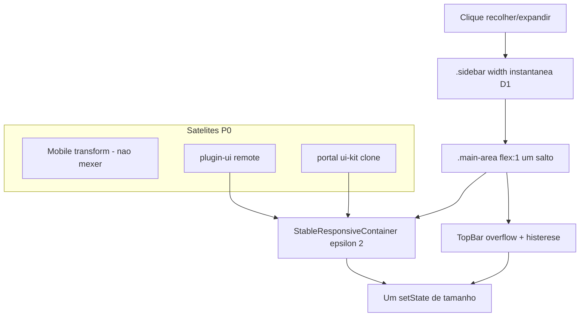

# Plano — sidebar collapse React #185

## Overview

Recolher a sidebar do portal deixa de interpolar `width` no flex do `.main-area` e o kit passa a rejeitar jitter de 1px e oscilação hamburger/nav da TopBar. A ficha do cliente (e irmãos com gráfico) deixa de cair em tela branca (React #185 / `notifyNestedSubs`).

## Leitura do pedido

| | |
|---|---|
| **Objetivo** | Recolher/expandir a sidebar em `/apps/commercial/customers/:codigo/:loja` **sem tela branca**. |
| **Subobjetivos** | Cortar o gatilho (animação de `width`); endurecer o detector de tamanho do gráfico; histerese na TopBar overflow; cobrir o Comercial que ainda usa `ResponsiveContainer` cru. |
| **Restrições** | Sem patch em `ConversationFileDropLayer`; sem `if` na página do cliente; identificadores em inglês; Ajuda só se a UX mudar de conceito (aqui não). |
| **Dependências** | Portal (CSS sidebar) + `plugin-ui` (remote) + rebuild do MFE comercial (e maintenance, que já usa TopBar overflow). |
| **Aceite** | Clique no `‹` na ficha **não** gera #185; F5 com sidebar já colapsada continua ok; expandir e recolher de novo continua ok. |

## Evidências e hipóteses

| Estado | Fato |
|---|---|
| **CONFIRMADO_NO_CODIGO** | `.sidebar { transition: all 0.35s ease }` em [`portal/src/layout/Sidebar.css`](portal/src/layout/Sidebar.css) anima `width` 300→0; `.main-area` é `flex: 1` em [`portal/src/index.css`](portal/src/index.css). |
| **CONFIRMADO_NO_CODIGO** | Clique em recolher: [`setCollapsed(true)`](portal/src/layout/Sidebar.tsx) no `.collapse-btn`. |
| **CONFIRMADO_NO_CODIGO** | React #185 + `notifyNestedSubs` = loop Recharts já documentado em [`StableResponsiveContainer.tsx`](plugins/plugin-ui/src/components/charts/StableResponsiveContainer.tsx) e [`stableChartSize.ts`](plugins/plugin-ui/src/components/charts/stableChartSize.ts). |
| **CONFIRMADO_NO_CODIGO** | Ficha monta gráfico ([`CustomerPurchaseEvolutionChart`](plugins/commercial/src/features/customers/components/CustomerPurchaseEvolutionChart.tsx) → `MultiTypeSeriesChart`) **e** sala ([`InteractionRoomPanel`](plugins/commercial/src/features/interaction-rooms/InteractionRoomPanel.tsx) → `ConversationFileDropLayer`). O drop **não** observa resize. |
| **CONFIRMADO_NO_CODIGO** | `shouldAcceptMeasuredSize` com epsilon **1** aceita delta de 1px (`>=`); o teste só rejeita 1px com epsilon **2**. |
| **CONFIRMADO_NO_CODIGO** | [`useTopBarOverflowCollapsed`](plugins/plugin-ui/src/hooks/useTopBarOverflowCollapsed.ts) faz `setCollapsed` a cada RO, **sem** histerese (a ribbon já tem em [`resolveCollapsedRibbonGroupIds.ts`](plugins/plugin-ui/src/components/ribbon/resolveCollapsedRibbonGroupIds.ts)). |
| **CONFIRMADO_NO_CODIGO** | Clone em [`portal/src/ui-kit/charts/StableResponsiveContainer.tsx`](portal/src/ui-kit/charts/StableResponsiveContainer.tsx) (mesmo default 1). |
| **CONFIRMADO_NO_CODIGO** | Portal **não** tem Vitest; testes estruturais do portal usam `node:test` (ex.: [`notificationCatalog.test.ts`](portal/src/utils/notificationCatalog.test.ts)). |
| **CONFIRMADO_EM_DOCUMENTACAO_CANONICA** | Mobile da sidebar já usa `transform`, não empurra `.main-area`. |
| **INFERENCIA** | O chunk `ConversationFileDrop_*.js` no stack é o bundle da sala + kit, não a origem do loop. |
| **HIPOTESE_A_VALIDAR** (E5 live) | Com width instantânea + epsilon 2, o #185 some na ficha; se restar, o inner `ResponsiveContainer` do Recharts 3 ainda despacha no store. |

## Decisões travadas

| # | Decisão |
|---|---|
| D1 | **Não animar propriedades de layout da sidebar desktop** (`width`, `min-width`, `max-width`, `padding`, `border`). Recolher/expandir é **instantâneo** no flex. Não usar `transform` no desktop (isso é drawer overlay; no mobile já existe). |
| D2 | Trocar `transition: all` da regra `.sidebar` por lista explícita só de cor/sombra do chrome interno, **sem** `width`. O `transition: all` do `.collapse-btn` (hover) permanece — não mexe no flex. |
| D3 | **Não** alterar `ConversationFileDropLayer`. |
| D4 | Epsilon canônico **2px** (`STABLE_CHART_SIZE_EPSILON_PX`) em `plugin-ui` **e** no clone do portal ui-kit. Unificar os dois pacotes fica **fora**. |
| D5 | Histerese da TopBar overflow no hook canônico (`useTopBarOverflowCollapsed`), constante própria `TOPBAR_OVERFLOW_EXPAND_HYSTERESIS_PX = 24` (não reusar a da ribbon). Vale para Comercial e Maintenance via remote. |
| D6 | Irmãos no **mesmo** MFE do crash: [`AnalyticsOtdInsightBarChart.tsx`](plugins/commercial/src/features/analytics/components/AnalyticsOtdInsightBarChart.tsx) e [`OpenOrdersProductionDetailContent.tsx`](plugins/commercial/src/components/OpenOrdersProductionDetailContent.tsx) passam a `StableResponsiveContainer`. |
| D7 | Migração em massa dos outros dashboards (`dashboard-*`, chat, etc.) **fora deste plano**. |
| D8 | Ajuda in-app: **não sincronizar**. Bugfix que restaura o recolhimento já documentado (`feature-help-sync`: fix que restaura comportamento já descrito). |
| D9 | Rebuild: script sequencial; `plugin-ui` (fase `remote`) **antes** dos MFEs. Portal não tem Vitest — E1 usa `node:test` + `.structural.test.mjs`. |
| D10 | Commit **somente** se o usuário pedir na execução; sem push a menos que peça. |

## Pesquisa de mercado

| Referência | O que aproveitamos | O que não copiamos |
|---|---|---|
| Recharts #172 / #3615 (#185 em `ResponsiveContainer`) | Medir host com epsilon; passar width/height **numéricos**; `overflow: hidden` | Fork do Recharts |
| VS Code / GitHub / Linear | Sidebar muda largura **sem** tween no flex do conteúdo | Micro-animação de overlay no desktop |
| `transition: all` (anti-pattern CSS) | Animar só cor/sombra | Qualquer tween de `width` em irmão flex |
| Ribbon Delpi (`stabilizeCollapsedRibbonGroupIds`) | Histerese 24px no overflow | Reusar `RIBBON_COLLAPSE_EXPAND_HYSTERESIS_PX` na TopBar |

## Matriz de fluxos transversais

| Fluxo | Superfície | Caminho | P0 / herança / fora |
|---|---|---|---|
| Recolher sidebar desktop (clique `‹`) | Portal + qualquer MFE | `Sidebar.tsx` → CSS width → `.main-area` | **P0** |
| Expandir (hotspot / chevron) | Portal | `openSidebarFromEdge` | **P0** |
| F5 com `sidebar-collapsed=true` | Portal | `localStorage` + width já 0 | **herança** |
| Drawer mobile ≤1024 (`transform`) | Portal | `Sidebar.css` media | **herança** |
| Swipe mobile | Portal | `useSidebarMobileSwipeOpen` | **herança** |
| Ficha cliente + gráfico + sala | Comercial | `CustomerOverviewSection` | **P0** (caso original) |
| Analytics OTD / detalhe OP | Comercial | `ResponsiveContainer` cru | **P0** (irmão D6) |
| TopBar hamburger overflow | Comercial + Maintenance | `useTopBarOverflowCollapsed` | **P0** |
| Gráficos kit (`MultiTypeSeriesChart`) | plugin-ui remote | `StableResponsiveContainer` | **P0** (epsilon) |
| Área chart do portal | portal ui-kit | clone `StableResponsiveContainer` | **P0** (alinhar epsilon) |
| Tour “expanda a sidebar” | Portal tour | texto existente | **herança** |
| Ajuda / Manual Comercial | `userManualContent.ts` | — | **fora** (D8) |
| Demais dashboards com RC cru | vários MFEs | `from "recharts"` | **fora** (D7) |
| 401 `/me/notifications` | core-api | — | **fora** |



## Wireframe (comportamento)

Antes (quebra):

```text
[==== sidebar 300px animando → 0 ====][ main crescendo ~60 frames ]
                                      [ Recharts setState x N ] → #185
```

Depois:

```text
[sidebar 300][        main         ]
     clique
[0][            main imediato      ]
   gráfico aceita Δ≥2px uma vez
```

O botão `‹`, hotspot e drawer mobile **não mudam de lugar nem de significado**.

## Anti-padrões (proibido)

- Patch em `ConversationFileDropLayer` / CSS da sala “porque o stack citou o chunk”.
- `if` na `CustomerDetailPage` / `CustomerOverviewSection`.
- `overflow: clip` / padding-fantasma no `.main-area` (`plugins-overlay-positioning`).
- `transform` na sidebar desktop (vira overlay; o mobile já é drawer).
- Subir o epsilon default para 16px (engole resize real de split/janela).
- Migrar todos os dashboards neste plano.
- `docker compose up --build` em lote — usar script sequencial (D9).

---

## E1 — Cortar o gatilho (portal sidebar)

### E1.S1 — Transição da sidebar sem layout

**Objetivo:** Recolher/expandir no desktop altera `width` **sem** interpolação CSS.

**Fazer:**
1. Em [`portal/src/layout/Sidebar.css`](portal/src/layout/Sidebar.css), na regra `.sidebar` (hoje `transition: all 0.35s ease`), restringir a propriedades que **não** alteram o flex de `.main-area` (ex.: `background-color`, `box-shadow`, `color`). **Proibido** `all`, `width`, `min-width`, `max-width`, `padding`, `border`.
2. Não alterar o bloco `@media (max-width: 1024px)` (`transform` / drawer).
3. Criar [`portal/src/layout/sidebarTransition.structural.test.mjs`](portal/src/layout/sidebarTransition.structural.test.mjs): ler o CSS; a regra base `.sidebar` (antes do media mobile) **não** contém `transition: all` nem `width` na transição.

**Não fazer:** `transform` no desktop; animar `--portal-sidebar-width`; patch em MFE; mexer em `.collapse-btn { transition: all }` (é o botão, não o flex). Não adicionar Vitest no portal.

**Evidência:** clique deixa de gerar dezenas de `clientWidth` intermediários; F5 vs clique ficam equivalentes em layout.

**Teste:**
```bash
cd portal && node --test src/layout/sidebarTransition.structural.test.mjs
```
- Positivo: regra desktop sem `all`/`width` na transição.
- Negativo: o media mobile ainda pode ter `transform`.
- Irmão: `.collapse-btn` pode continuar com `transition: all`.

**Pronto quando:** grep na regra base `.sidebar` sem `transition: all`; teste verde.

**Commit:** `fix(portal): não animar largura da sidebar para evitar loop de resize nos MFEs`

---

## E2 — Detector de tamanho canônico (kit + clone)

### E2.S1 — Epsilon 2px e rejeição de jitter 1px

**Objetivo:** `shouldAcceptMeasuredSize` rejeita ruído de 1px **por default**.

**Fazer:**
1. [`plugins/plugin-ui/src/components/charts/stableChartSize.ts`](plugins/plugin-ui/src/components/charts/stableChartSize.ts) — exportar `STABLE_CHART_SIZE_EPSILON_PX = 2`; default do 3º argumento = essa constante.
2. [`StableResponsiveContainer.tsx`](plugins/plugin-ui/src/components/charts/StableResponsiveContainer.tsx) (plugin-ui) — `sizeEpsilonPx = STABLE_CHART_SIZE_EPSILON_PX`.
3. Espelhar **os mesmos números** em [`portal/src/ui-kit/charts/stableChartSize.ts`](portal/src/ui-kit/charts/stableChartSize.ts) e [`portal/src/ui-kit/charts/StableResponsiveContainer.tsx`](portal/src/ui-kit/charts/StableResponsiveContainer.tsx) (clone; não unificar pacote neste plano).
4. Atualizar [`stableChartSize.test.ts`](plugins/plugin-ui/src/components/charts/stableChartSize.test.ts): caso 1px **sem** passar epsilon 2 no 3º argumento; manter caso ±300px da sidebar; caso scrollbar 15px continua exigindo epsilon explícito maior (não subir o default para 16).

**Não fazer:** `if` por path; mexer em `ConversationFileDropLayer`; migrar dashboards (D7).

**Evidência:** teste atual já declara a intenção (“rejeita ruído 1px”) mas só passava com epsilon 2 passado na mão.

**Teste:**
```bash
cd plugins/plugin-ui && npm test -- src/components/charts/stableChartSize.test.ts src/components/charts/StableResponsiveContainer.test.tsx
```
- Positivo: 800→801 rejeitado no default.
- Negativo: 800→800.4 rejeitado.
- Irmão: 800→1100 aceito.

**Pronto quando:** default 2 nos dois clones; testes verdes.

**Commit:** `fix(plugin-ui): rejeitar jitter de 1px na medição de gráfico ao redimensionar o portal`

---

## E3 — Histerese da TopBar overflow

### E3.S1 — Estabilizar `useTopBarOverflowCollapsed`

**Objetivo:** Na fronteira de largura, a TopBar não alterna hamburger ↔ nav no mesmo resize.

**Fazer:**
1. [`plugins/plugin-ui/src/hooks/useTopBarOverflowCollapsed.ts`](plugins/plugin-ui/src/hooks/useTopBarOverflowCollapsed.ts) — constante `TOPBAR_OVERFLOW_EXPAND_HYSTERESIS_PX = 24`; só **reexpandir** se `needed <= available - hysteresis`; colapsar quando `needed > available + tolerancePx` (como hoje).
2. Testes em [`useTopBarOverflowCollapsed.test.ts`](plugins/plugin-ui/src/hooks/useTopBarOverflowCollapsed.test.ts): (a) colapsa quando estoura; (b) **não** reexpande com folga &lt; 24px; (c) reexpande com folga ≥ 24px.
3. Não mudar `TOP_BAR_COLLAPSE_TRIGGER` nos MFEs (já é `overflow` em Comercial e Maintenance).

**Não fazer:** copiar `RIBBON_COLLAPSE_EXPAND_HYSTERESIS_PX`; CSS paliativo na TopBar; lógica só no Comercial.

**Evidência:** ribbon já documenta o #185 por colapsar↔medir↔expandir; TopBar é o mesmo contrato de overflow. Consumidores: [`PluginShell.tsx`](plugins/commercial/src/app/PluginShell.tsx), [`MaintenancePluginShell.tsx`](plugins/maintenance/src/components/MaintenancePluginShell.tsx).

**Teste:**
```bash
cd plugins/plugin-ui && npm test -- src/hooks/useTopBarOverflowCollapsed.test.ts src/components/layout/TopBar.test.tsx
```

**Pronto quando:** os três casos acima passam; Comercial/Maintenance herdam via remote.

**Commit:** `fix(plugin-ui): histerese na TopBar overflow para não oscilar ao recolher a sidebar`

---

## E4 — Irmãos Comercial ainda no Recharts cru

### E4.S1 — Trocar `ResponsiveContainer` solto no Comercial

**Objetivo:** As duas superfícies do mesmo MFE que ainda usam RC percentual passam pelo wrapper estável.

**Fazer:**
1. [`AnalyticsOtdInsightBarChart.tsx`](plugins/commercial/src/features/analytics/components/AnalyticsOtdInsightBarChart.tsx) — `StableResponsiveContainer` de `@delpi/plugin-ui/index` no lugar dos `<ResponsiveContainer>` (incluindo o sem dimensões).
2. [`OpenOrdersProductionDetailContent.tsx`](plugins/commercial/src/components/OpenOrdersProductionDetailContent.tsx) — idem.
3. Teste estrutural novo (padrão do plugin: `*.structural.test.ts` / `.mjs`): os dois arquivos **não** importam `ResponsiveContainer` de `recharts`.

**Não fazer:** migrar `dashboard-*`; criar wrapper local no Comercial.

**Evidência:** RC sem width/height é o anti-padrão clássico do #185; são irmãos da ficha.

**Teste:**
```bash
cd plugins/commercial && npm test
```
(ou o arquivo estrutural isolado + `npx tsc -b --pretty false`)

**Pronto quando:** grep zero de `ResponsiveContainer` nesses dois arquivos; testes/tsc verdes.

**Commit:** `fix(commercial): gráficos OTD e OP usam o container estável do kit`

---

## E5 — Verify-final

### E5.S1 — Rebuild sequencial + fluxo live

**Objetivo:** Provar o objetivo original no browser, não só o teste unitário.

**Fazer:**
1. Rebuild a partir da raiz do repo (não `docker compose up --build` em lote):
   ```bash
   ./infra/scripts/up-dev-sequential.sh --fase remote --build plugin-ui
   ./infra/scripts/up-dev-sequential.sh --fase mfe --build commercial maintenance
   ```
   (portal: rebuild do serviço do portal se o CSS da sidebar não for volume-mounted.)
2. Live em `/apps/commercial/customers/000001/01`: recolher → página permanece; expandir → recolher de novo; F5 colapsado. DevTools **sem** #185.
3. Irmão: uma tela Comercial com gráfico OTD.
4. Negativo: viewport ≤1024, drawer da sidebar ainda overlay (não empurrar conteúdo com `width`).
5. Tabela pass/fail no comentário de execução. Commit **só** se houver fix de regressão.

**Não fazer:** declarar pronto só com vitest.

**Teste:** checklist live (caso original + irmão + mobile drawer).

**Pronto quando:** os três passam; nenhum #185.

**Commit:** somente hotfix de regressão, se houver.

---

## Critérios de pronto

- [ ] Clique no minimizar da sidebar **não** produz React #185 / tela branca na ficha do cliente.
- [ ] `.sidebar` desktop sem `transition: all` nem tween de `width`.
- [ ] Epsilon default 2 no kit e no clone do portal; testes de jitter verdes.
- [ ] TopBar overflow com histerese; testes positivo / negativo / irmão.
- [ ] Comercial: zero `ResponsiveContainer` cru nos dois irmãos.
- [ ] Ajuda: sem sync (D8).
- [ ] Rebuild remote → MFE feito no E5.

## Fora do escopo

- Migrar todos os `from "recharts"` dos dashboards (D7).
- Unificar clone `portal/src/ui-kit/charts` com `plugin-ui`.
- 401 de notificações.
- Mudar `ConversationFileDropLayer` / CSS da sala.
- Animação alternativa da sidebar (fade do conteúdo interno).
- Manual/FAQ (não é feature nova — D8).

## Protocolo de execução

Cada **E\*.S\*** = implementar só o escopo → teste do pacote → evidência. **Commit só se o usuário pedir.** Sem push a menos que peça. Não agrupar E1+E2 no mesmo commit. E5 só commita se houver regressão.

```yaml
todos:
  - id: e1-s1-sidebar-no-width-transition
    content: "E1.S1 Portal: sidebar desktop sem transition all/width + teste estrutural"
  - id: e2-s1-chart-epsilon-2
    content: "E2.S1 plugin-ui + clone portal: epsilon 2px e testes de jitter"
  - id: e3-s1-topbar-hysteresis
    content: "E3.S1 useTopBarOverflowCollapsed com histerese 24px + testes"
  - id: e4-s1-commercial-stable-rc
    content: "E4.S1 Comercial: OTD e OP usam StableResponsiveContainer"
  - id: e5-s1-verify-live
    content: "E5.S1 Rebuild sequencial + live ficha cliente / OTD / mobile drawer"
```
