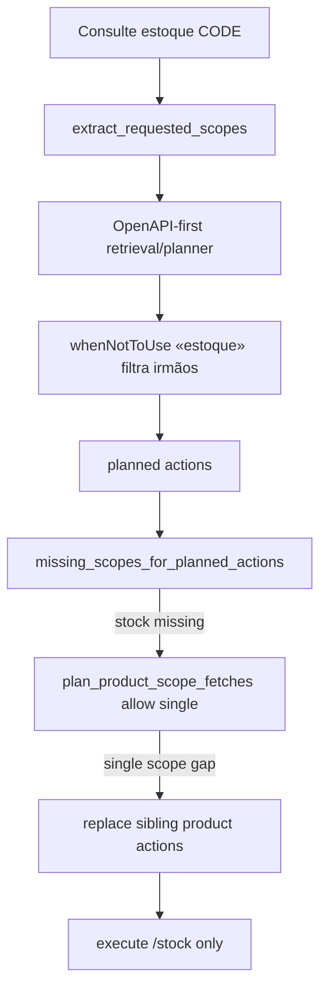

# Plano — Estoque sem inspeção (OpenAPI-first)

> Estado de execução (não autoridade arquitetural). Código/contratos/regras atuais prevalecem.
> Protocolo **após aprovação**: cada `E*.S*` = testar + commit + push. **Este plano não implementa.**

## Overview

Pedido de estoque/saldo de um código materializa **somente** a action de stock. Negação («não inspeção») não cria scope de inspeção. Irmãos (summary / internal-movements / inspection) saem do ranking via `whenNotToUse` com frases entre `«»`. Enrich corrige plano OpenAPI incompleto também com **um** escopo pedido.

## Ledger de requisitos

| ID | Requisito | Estado no plano |
|---|---|---|
| RQ-01 | «Consulte o estoque do produto 10080001» → só `/stock` | ATENDIDO_NO_PLANO |
| RQ-02 | Sibling «saldo / disponível / posições de estoque» → stock | ATENDIDO_NO_PLANO |
| RQ-03 | Negativo «inspeção do produto …» → inspection (sem stock forçado) | ATENDIDO_NO_PLANO |
| RQ-04 | «(não inspeção)» → stock **sem** chamar inspection | ATENDIDO_NO_PLANO |
| RQ-05 | Sem `if path/operationId` no core; sem forçar intentBinding sobre OpenAPI | ATENDIDO_NO_PLANO |
| RQ-06 | Identifiers EN; copy PT só em locale/content | ATENDIDO_NO_PLANO |
| RQ-07 | Positive + sibling + negative + metamórfico + smoke live | ATENDIDO_NO_PLANO |
| RQ-08 | Ajuda alinhada (estoque ≠ inspeção) | ATENDIDO_NO_PLANO |
| RQ-09 | Reimport Action Catalog após contrato | ATENDIDO_NO_PLANO |

## Evidências (CONFIRMADO)

| Achado | Evidência |
|---|---|
| Intent `stock` e scopes `("stock",)` corretos na frase P0 | `product_query_intent` + `extract_requested_scopes` |
| OpenAPI-first planeja antes do registry `intentBinding` | [`chat_external_action_orchestration_service.py`](minha-delpi-ai-api/app/application/services/chat_external_action_orchestration_service.py) `plan_actions` |
| `whenNotToUse` de summary **sem** `«estoque»` → filtro lexical **não** age | [`tv_route_audience.json`](api-delpi/app/content/tv_route_audience.json) `get_product_summary`; [`openapi_when_not_to_use_guidance_service.py`](minha-delpi-ai-api/app/domain/services/openapi_when_not_to_use_guidance_service.py) `_QUOTE_RE` |
| Inspection/movements sem `whenNotToUse` útil vs estoque | mesmo locale (`get_product_inspection`, `get_product_internal_movements`) |
| `plan_product_scope_fetches` retorna `[]` se `len(scopes) < 2` | [`chat_product_multi_scope_planning_service.py`](minha-delpi-ai-api/app/domain/services/chat_product_multi_scope_planning_service.py) L409–410 |
| Enrich detecta `missing` stock mas não injeta no escopo único | `_enrich_openapi_plan_with_product_scopes` → `_plan_scopes()` |
| Substring «inspeção» em «não inspeção» adiciona scope `inspection` | `extract_requested_scopes` L116–125 |
| Merge do enrich **mantém** action errada e só acrescenta | mesmo enrich (merge por path) |

## Causa raiz

```text
"Consulte o estoque do produto CODE"
  → scopes=("stock",) OK
  → OpenAPI-first rankeia irmãos (summary/movements/…) — whenNotToUse sem «frases»
  → plano pode ser inspection/summary/movements
  → missing=("stock",) mas plan_product_scope_fetches([]) porque len<2
  → usuário vê inspeção (ou outro irmão), sem saldo

"… (não inspeção)"
  → substring adiciona inspection → scopes len>=2 → enrich injeta /stock
  → stock aparece por acidente (e inspection pode continuar no plano)
```

## Antes × depois

| Caso | Antes | Depois |
|---|---|---|
| P0 estoque do código | irmão / sem stock | só `/products/{code}/stock` |
| Sibling saldo/disponível | varia | stock |
| Negativo inspeção | inspection | inspection (inalterado) |
| Metamórfico «não inspeção» | stock+inspection | só stock |
| Multi «estoque e descrição» | HERANÇA multi | continua multi (stock+profile/summary) |
| Pedido não-produto | inalterado | inalterado |

## Decisões travadas

| Tema | Decisão |
|---|---|
| Owner ranking | Contrato OpenAPI locale em [`tv_route_audience.json`](api-delpi/app/content/tv_route_audience.json) (EN + pt-BR); espelhar cláusulas com `«»` em [`openapi_agent_metadata.py`](api-delpi/app/interface/http/openapi_agent_metadata.py) description quando for a cláusula consumida no import |
| Frases obrigatórias | Stock `whenToUse`: `«estoque»`, `«saldo»`, `«disponível»`. Summary, internal-movements, inspection `whenNotToUse`: mesmas frases entre `«»` + preferir `/stock` |
| Core genérico | Sem `if path`; sem bypass intentBinding como autoridade do turno OpenAPI-first |
| Negação de scope | Em `extract_requested_scopes`, não adicionar `inspection` se o termo aparecer sob negação (`não`/`nao`/`sem` + inspe…) |
| Enrich single-scope | Remover o early-return `len(scopes) < 2` em `plan_product_scope_fetches` (único caller produtivo é o enrich) |
| Conflito irmão | Se `requested` tem exatamente 1 scope e esse scope está em `missing`, **substituir** actions de produto no plano que não cobrem o scope (não só append) — espelha o branch clarify→replace já existente |
| Sync | Após locale: `scripts/sync_api_delpi_openapi.py` (reimport + catálogo) |
| Ajuda | Em [`capabilities.json`](minha-delpi-ai-api/app/content/pt-BR/assistant/capabilities.json): exemplo «Consulte o estoque do produto …» = saldo/posições, distinto de inspeção de qualidade |
| Smoke | Remover workaround «(não inspeção)» em [`smoke_presentation_composer_conversation_live.py`](minha-delpi-ai-api/scripts/smoke_presentation_composer_conversation_live.py); assert path stock e ausência de inspection no T1 |
| Protocolo | Cada `E*.S*` = teste + commit + push |



## Matriz transversal

| Fluxo | Escopo |
|---|---|
| Send / Stream planning | P0 |
| OpenAPI retrieval whenNotToUse | P0 |
| Product multi-scope / enrich | P0 |
| Catalog reimport | P0 delivery |
| Ajuda capabilities | satélite |
| Smoke conversation live | evidência |
| Evals R6/R7/R9/R10 routing | verify |

## Receitas E*.S*

### E0.S1 — Baseline vermelho
- Testes que falham hoje: P0 estoque→stock only; «não inspeção» não adiciona inspection; enrich single missing stock.
- Arquivos: [`test_chat_product_multi_scope_planning_service.py`](minha-delpi-ai-api/tests/unit/domain/services/test_chat_product_multi_scope_planning_service.py) + teste de whenNotToUse / orchestration enrich.
- Commit: `test(ai): baseline vermelho estoque vs inspeção no routing.`

### E1.S1 — Contrato OpenAPI locale
- Atualizar `get_product_stock`, `get_product_summary`, `get_product_inspection`, `get_product_internal_movements` em [`tv_route_audience.json`](api-delpi/app/content/tv_route_audience.json) (EN+pt-BR) com `«estoque»`/`«saldo»`/`«disponível»`.
- Alinhar descriptions em [`openapi_agent_metadata.py`](api-delpi/app/interface/http/openapi_agent_metadata.py) para as mesmas cláusulas quoted.
- Teste api-delpi de locale (padrão `whenNotToUse` com aspas) se já houver padrão próximo.
- Commit: `fix(api): whenNotToUse quoted para estoque vs irmãos.`

### E1.S2 — Sync Action Catalog
- Rodar sync/reimport; evidência de actions atualizadas.
- Commit: `chore(ai): reimport OpenAPI após whenNotToUse de estoque.`

### E2.S1 — Negação de scopes
- `extract_requested_scopes`: inspection só se termo positivo (não sob `não`/`nao`/`sem`).
- Testes: «não inspeção», «sem inspeção», negativo «inspeção do produto».
- Commit: `fix(ai): negação não cria scope de inspeção.`

### E2.S2 — Enrich single-scope + replace
- Remover `if len(scopes) < 2: return []` em `plan_product_scope_fetches`.
- Em `_enrich_openapi_plan_with_product_scopes`: se um único scope pedido está missing, substituir plano de produto conflitante pelo scope planejado (não merge cego).
- Testes: plano OpenAPI = inspection + mensagem estoque → resultado só stock; multi estoque+estrutura continua merge.
- Commit: `fix(ai): enrich completa stock mesmo com um escopo.`

### E3.S1 — Ajuda
- [`capabilities.json`](minha-delpi-ai-api/app/content/pt-BR/assistant/capabilities.json): estoque/saldo ≠ inspeção QP.
- Commit: `docs(ai): Ajuda estoque do produto vs inspeção.`

### E3.S2 — Smoke + verify-final
- Smoke T1 sem «não inspeção»; exige `/stock` e falha se inspection no plano.
- Suite unitária P/S/N + adversarial; commit só se regressão.
- Commit smoke: `test(ai): smoke estoque sem workaround de inspeção.`

## Fora do escopo

- Forçar `intentBinding` stock sobre OpenAPI-first.
- Selectors/`if path` no core.
- Mudança de presentation/MFE.
- Renomear rotas ERP.
