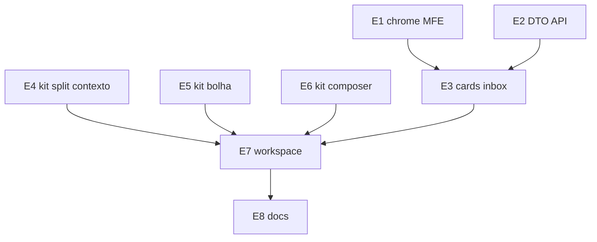
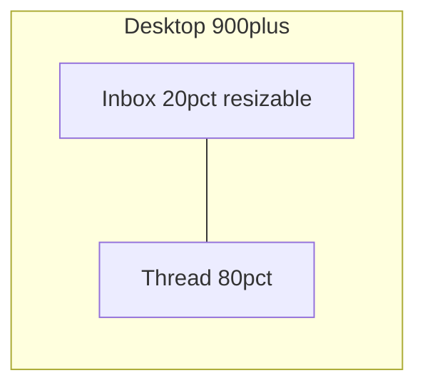
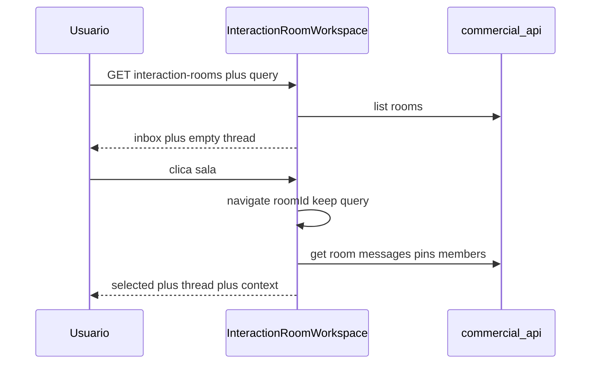

# UI da sala — plano único (inbox + workspace)

**Canônico:** este arquivo.

## Overview

Hoje inbox e thread são **páginas separadas**; o hero tem Atualizar redundante com WS; filtros e busca ocupam uma segunda barra; a lista não tem scroll próprio; cards mostram ISO com GMT e sem cliente. Unificar no mesmo canvas: hero compacto, lista 20% redimensionável | thread 80%, cards com conta. Componentes no kit [`@delpi/plugin-ui`](plugins/plugin-ui). Enrich de cliente na **commercial-api** (não api-delpi).

Sintoma nos prints: cards da inbox sem `selected`; timestamp GMT; conversa em cards cinza todos à esquerda, ações texto permanentes, composer com dashed zone; vazio à direita da thread.

## Diretrizes Cursor (checklist — não contradizer)

Índice: [`.cursor/rules/development-standards-index.mdc`](.cursor/rules/development-standards-index.mdc). Ordem: **módulo canônico + contrato** → **kit/perfil** → **teste**.

| Diretriz | Aplicação neste plano |
|----------|----------------------|
| [`plan-construction.mdc`](.cursor/rules/plan-construction.mdc) | Decisões travadas; E*.S* atômicos; impacto; test→commit por etapa |
| [`plugin-mfe-page-excellence.mdc`](.cursor/rules/plugin-mfe-page-excellence.mdc) | **P0 antes de polish:** URL shareable (path `roomId` + query de filtro/busca). **P1:** empty/erro/loading no centro. **P2:** README + WF-SALA-01 |
| [`plugins-reusable-components.mdc`](.cursor/rules/plugins-reusable-components.mdc) | Bolha, inbox, header, painel de contexto = kit. Dual-class `cm-` + `delpi-ui-`. Export em `commercialUi.ts` via factory |
| [`plugins-visual-design-system.mdc`](.cursor/rules/plugins-visual-design-system.mdc) | Tokens `--delpi-ui-*` no kit; grid MFE só `.dashboard-commercial .cm-room-workspace`. Zero `:root`/`body`/`*` globais. Dark via `data-theme`. **Zero** seletor `.delpi-ui-*` no CSS do commercial |
| [`plugins-frontend-build.mdc`](.cursor/rules/plugins-frontend-build.mdc) | `npm run build` em `plugin-ui` **e** `commercial` antes de cada commit da etapa |
| [`english-code-identifiers.mdc`](.cursor/rules/english-code-identifiers.mdc) | Arquivos/props: `InteractionRoomWorkspace`, `RoomContextPanel`, `mine`, `selected`. PT só em copy (`INTERACTION_ROOMS_CONTENT`) e commits |
| [`centralized-rules-first.mdc`](.cursor/rules/centralized-rules-first.mdc) + [`root-cause-generalized-fix.mdc`](.cursor/rules/root-cause-generalized-fix.mdc) | Causa raiz = páginas lista/detalhe **separadas** + thread sem `max-width` de canvas. **Não** `max-width` em Page/Panel. Relógio da inbox = **um** helper, não `toLocaleString` em dois arquivos |
| [`mfe-modal-host-contained.mdc`](.cursor/rules/mfe-modal-host-contained.mdc) | Tablet: contexto em acordeão/`HostContained` **dentro do host** `.dashboard-commercial`. Não `createModalShell` no `document.body`. Drawer da ficha (WF-SALA-07) **inalterado** |
| [`plugins-documentation.mdc`](.cursor/rules/plugins-documentation.mdc) | README commercial + WIREFRAMES; **não** docs api-delpi (sem API nova) |
| [`application-bounded-context-decoupling.mdc`](.cursor/rules/application-bounded-context-decoupling.mdc) + [`mfe-own-api-no-direct-api-delpi.mdc`](.cursor/rules/mfe-own-api-no-direct-api-delpi.mdc) | Cliente no card = enrich na **commercial-api**; MFE sem `/apps/api-delpi` |
| [`infra-sequential-container-startup.mdc`](.cursor/rules/infra-sequential-container-startup.mdc) | Homologação: `up-dev-sequential.sh --fase remote --build plugin-ui` **depois** `--fase mfe --build commercial`. Não `compose up --build` em lote |
| [`mf-federation-patch-safety.mdc`](.cursor/rules/mf-federation-patch-safety.mdc) | **Fora:** não alterar `federationReactProxyFix*` |
| [`test-and-commit.mdc`](.cursor/rules/test-and-commit.mdc) + [`plan-construction.mdc`](.cursor/rules/plan-construction.mdc) | **Cada E*.S***: teste/build do pacote → commit PT → **push**. Não juntar duas S no mesmo commit |
| Chat / schema-first / `assistant/*.json` | **Não se aplica** (não é pipeline LLM). Copy PT da sala permanece em [`interactionRoomsContent.ts`](plugins/commercial/src/content/interactionRoomsContent.ts) |

**Desvio a recusar:** CSS de bubble/inbox no MFE; `RoomContextPanel` só no commercial; path/arquivo `sala-contexto.tsx`; modal de contexto cobrindo a sidebar.

## Pesquisa de mercado (travada)

| Referência | Copiamos | Não copiamos |
|------------|----------|--------------|
| Slack | Lista + thread + painel direito | 4ª coluna de thread; virtualização |
| Teams | Chat centro + About à direita | Nested channels |
| Front / Intercom | Inbox \| conversa \| ficha | SLA/queue |
| Linear | Feed + properties | Issue tracker |
| Outlook | Master-detail + reading pane | Chrome de e-mail |

## Inventário (estender, não reinventar)

| Peça | Onde | Ação |
|------|------|------|
| TopBar | [`shellNav.ts`](plugins/commercial/src/content/shellNav.ts) + [`PluginShell.tsx`](plugins/commercial/src/app/PluginShell.tsx) `NAV_ICONS` | Inserir `interaction_rooms` **depois** de `overview` |
| Hero | [`PageHero`](plugins/plugin-ui/src/components/layout/PageHero.tsx) `children` + `actions` | Filtros no body; busca à direita; **sem** `actions` Atualizar |
| Inbox DTO | [`list_interaction_inbox.py`](commercial-api/commercial_app/application/use_cases/list_interaction_inbox.py) | Enriquecer `customer_code` / `customer_store` / `customer_name` |
| Avatar conta | [`CustomerAvatar.tsx`](plugins/commercial/src/features/customers/components/CustomerAvatar.tsx) | Slot no card; href ficha; `stopPropagation` |
| Split | kit novo `ResizableColumns` (não existe hoje) | 20/80, arrastar, colapsar; CSS no kit |
| Inbox | [`InteractionRoomsInboxPage.tsx`](plugins/commercial/src/features/interaction-rooms/InteractionRoomsInboxPage.tsx) | Coluna do workspace; extraída, não duplicada |
| Thread | [`InteractionRoomPage.tsx`](plugins/commercial/src/features/interaction-rooms/InteractionRoomPage.tsx) | Centro + composer; `mine` no kit |
| Ficha | [`InteractionRoomPanel.tsx`](plugins/commercial/src/features/interaction-rooms/InteractionRoomPanel.tsx) | Sem 3 colunas (WF-SALA-06/07) |
| Kit | [`MessageThread.tsx`](plugins/plugin-ui/src/components/collaboration/MessageThread.tsx), [`RoomInboxList.tsx`](plugins/plugin-ui/src/components/collaboration/RoomInboxList.tsx), [`RoomHeader.tsx`](plugins/plugin-ui/src/components/collaboration/RoomHeader.tsx) | Props + CSS `.delpi-ui-*` |
| Estilos kit | [`plugins/plugin-ui/src/styles.css`](plugins/plugin-ui/src/styles.css) | `@import` de `room-context-panel.css` (junto a `room-inbox.css`) |
| MFE factory | [`commercialUi.ts`](plugins/commercial/src/app/commercialUi.ts) | `createDashboard*` / export `CommercialRoomContextPanel` |
| Rotas | [`App.tsx`](plugins/commercial/src/App.tsx) | Mesmo shell; `roomId` opcional |
| Layout | [`index.css`](plugins/commercial/src/index.css) + [`responsive.css`](plugins/commercial/src/styles/responsive.css) | Só `.dashboard-commercial .cm-room-workspace*` |
| Tracking kit | [`plugins/plugin-ui/docs/refactoring-roadmap.md`](plugins/plugin-ui/docs/refactoring-roadmap.md) § 8 | Se o repo exigir linha para componente novo |

## Decisões travadas

- **P0 URL:** path `/interaction-rooms` e `/interaction-rooms/:roomId` (já shareable). Query `filter` + `q` sincronizada com estado da inbox (sem apagar no mount). Clique na lista = `navigatePluginPath` preservando query.
- **TopBar:** item «Sala de interação» **imediatamente após** «Visão geral» em [`SHELL_NAV_ITEMS`](plugins/commercial/src/content/shellNav.ts). Estender [`PluginNavId`](plugins/commercial/src/app/pluginRoutes.ts). Ícone Lucide `MessagesSquare` 16px (stroke 1.75). `requiredCap: always`. Help em `helpTooltips.ts`. Comentário «seis áreas» → sete.
- **Sem Atualizar no hero:** WS (`useInteractionInboxSync`) já recarrega a lista. Primeira carga continua HTTP. Retry **só** no `StateBanner` de erro (botão «Tentar de novo»).
- **Hero único:** UnderlineNav (filtros) em `PageHero` `children`. Busca em `actions` (direita do título, máx. 20rem). Density `compact` com sala aberta.
- **Entrega (ago/2026):** chrome da inbox ficou na **toolbar do pane** (`ScopeChipBar` + `CatalogSearchBar`); testes estruturais **proíbem** `PageHero` no workspace. Retry no `StateBanner` com label «Tentar de novo».
- **Split ao abrir conversa (≥900px):** lista **~20%** | mensagens **~80%**. Kit `ResizableColumns`: handle 6px, `role="separator"`, setas Left/Right ±16px. Min lista 240px; máx 40% do canvas. `localStorage` `commercial.interactionRoom.inboxWidthPx`.
- **Colapsar lista:** botão no splitter (`PanelLeftClose` 16px); rail 36px (`PanelLeftOpen`) para restaurar. Persist `inboxCollapsed` no mesmo localStorage.
- **&lt;900px:** lista **ou** detalhe (PagePath voltar). Sem drag.
- **Contexto da sala:** **não** terceira coluna. Toggle no `RoomHeader` abre `RoomContextPanel` **dentro** da coluna de mensagens.
- **Scroll:** inbox `overflow-y: auto; min-height: 0; flex: 1` abaixo do hero. Thread com scroll próprio. A página **não** arrasta a lista junto com o chrome.
- **Card inbox:** título; preview; hora relativa (sem GMT); **nome do cliente**; `CustomerAvatar` linkado à ficha com `stopPropagation`. Sem cliente: avatar genérico, sem href.
- **Conversa (3 containers):** header pedido | scroll msgs | composer docked. Bolhas `mine` direita (accent 18%) / outros esquerda; avatar `nameFor`; ações ícone só no hover (touch = visíveis). Clip = file picker; drop overlay na coluna; sem dashed permanente.
- **API (commercial-api):** estender inbox com `customer_code`, `customer_store`, `customer_name`. Enrich a partir de `entity_type`/`entity_key` via gateway já da commercial-api. Sem api-delpi no MFE. Fail-open. PT em `interaction_room.json`.
- **Kit:** `RoomContextPanel`; `mine`; `RoomInboxList` `leading` + `subtitle`; `ResizableColumns`. Zero CSS `.delpi-ui-*` no MFE.
- **Relógio:** `formatInboxMetaLabel(iso)` único.
- **Git:** ver **Protocolo de execução** abaixo (cada S* = teste + commit + push).
- **Painel/ficha:** herda kit (bolhas, composer, drop no composer); **sem** split 20/80 nem `RoomContextPanel`.
- **Arquivo inválido no drop/picker:** ignora ou banner erro (copy existente `attachUploadError` / hint 10 MB); não crash.
- **Badge TopBar:** soma `unread_count` via list inbox (mesmo GET); atualiza no `room.inbox.changed`; sem segundo HTTP paralelo no clique.

### Protocolo de execução (obrigatório)

Depois de **cada** `E*.S*`:

1. Marcar todo `in_progress`.
2. Implementar **só** o escopo da subetapa.
3. Testes do pacote tocado (`vitest` no kit e/ou commercial; `pytest` se commercial-api; `npm run build` do MFE e/ou `plugin-ui` conforme o diff).
4. Commit mensagem PT (porquê) + **push** (`git push -u origin HEAD` se branch nova).
5. Não agrupar duas subetapas no mesmo commit.
6. E8.S2 (verify): commit **somente** se houver fix de regressão.

Ordem das etapas respeita dependência: chrome visível cedo → API → slots kit → cards → primitivos de split/thread/composer → **só então** o workspace junta tudo.



### Melhorias alinhadas (travadas)

- Badge de não lidas na TopBar (soma inbox + WS), padrão tarefas/pedidos.
- Enrich em lote (máx. 50), sem N+1 no MFE.
- `prefers-reduced-motion`: sem animação de snap no splitter.



## Fluxos



## Sistema visual (obrigatório na implementação)

Fonte de tokens: [`.dashboard-commercial`](plugins/commercial/src/index.css) mapeia `--cm-*` → `--delpi-ui-*`. Kit **só** consome `--delpi-ui-*` (fallback `--text` / `--primary`). **Proibido** hex novo para superfície/texto; badge unread pode manter `#fff` sobre accent (já no kit). Homologar **claro e escuro** no portal (`data-theme`), não só vite standalone.

### Tokens

| Papel | Claro (`--cm-*`) | Escuro (`:root[data-theme="dark"] .dashboard-commercial`) |
|-------|------------------|-----------------------------------------------------------|
| Canvas página | `--surface-muted` / `--app-canvas` do portal | `--cm-surface-muted` mix `#1b2030` |
| Superfície card/bolha/inbox | `--cm-surface` `#fff` / `--surface` | mix `surface-2` 82% + black |
| Texto | `--cm-text` `#111` | `rgba(255,255,255,0.94)` |
| Texto secundário | `--cm-text-muted` 68% | `rgba(255,255,255,0.78)` |
| Borda | `--cm-border` `#e6e6e6` | `rgba(255,255,255,0.14)` |
| Accent / unread / selected | `--cm-accent` = `--primary` `#089bdb` | mesmo accent |
| Perigo / sucesso | `--cm-danger` `#b91c1c` / `--cm-success` `#15803d` | `#f87171` / `#4ade80` |
| Hover lista | `color-mix(accent 6%, transparent)` | idem (mix sobre surface escura) |
| Selected lista | borda accent 45% + fundo accent 10% | idem |
| Bolha `mine` | fundo accent **18%**; borda accent 40%; texto `--delpi-ui-text` | idem (mix, não azul sólido) |
| Bolha outros | `--delpi-ui-surface-elevated` + borda `--delpi-ui-border` | surface elevada do tema |
| Linha system | sem fundo; texto muted; centro | idem |
| Focus visível | outline 2px accent, offset 2px, em botões/inputs/itens lista | idem |
| Ícones Lucide | `stroke` = `currentColor`; sem fill sólido | idem |

### Tipografia

Herdar fonte do portal (sem `@font-face` no MFE). Escala travada:

| Superfície | Size | Weight | Line-height | Cor |
|------------|------|--------|-------------|-----|
| PageHero título | kit PageHero (não reduzir) | 700 | kit | `--delpi-ui-text` |
| PageHero subtítulo | kit | 400 | kit | muted |
| UnderlineNav | kit | 500/600 ativo | kit | text / accent underline |
| Inbox título sala | 0.9375rem (15px) | 600; **700** se unread | 1.3 | text |
| Inbox preview | 0.8125rem (13px) | 400 | 1.3 | muted; ellipsis 1 linha |
| Inbox meta (hora) | 0.75rem (12px) | 400 | 1.2 | muted; **sem GMT** |
| Badge unread | 0.6875rem (11px) | 700 | 1 | `#fff` sobre accent; min-width 1.25rem; pill |
| RoomHeader título | 1.125rem (18px) | 700 | 1.3 | text |
| RoomHeader subtítulo | 0.8125rem | 400 | 1.3 | muted |
| Bolha autor | 0.8125rem | 600 | 1.2 | text |
| Bolha hora | 0.75rem | 400 | 1.2 | muted |
| Bolha corpo | 0.9375rem | 400 | 1.45 | text; `pre-wrap` |
| System / task_ref | 0.8125rem | 400 | 1.35 | muted; centro |
| Contexto seção h3 | 0.75rem | 600 | 1.2 | muted; uppercase letter-spacing 0.04em |
| Contexto corpo | 0.8125rem | 400 | 1.35 | text |
| Composer textarea | 0.9375rem | 400 | 1.45 | text; placeholder muted |
| EmptyState título | kit | 600 | kit | text |
| EmptyState corpo | kit | 400 | kit | muted |

### Ícones (Lucide, `currentColor`)

| Controle | Ícone | Size (px) | Stroke | Onde |
|----------|-------|-----------|--------|------|
| Atualizar (só erro) | `RefreshCw` | 16 | 2 | StateBanner «Tentar de novo» |
| TopBar sala | `MessagesSquare` | 16 | 1.75 | PluginShell NAV_ICONS |
| Colapsar lista | `PanelLeftClose` / `PanelLeftOpen` | 16 | 2 | splitter |
| Busca | ícone interno do `CatalogSearchBar` | kit (16) | 2 | chrome |
| Anexar | `Paperclip` (já no composer) | 16 | 2 | toolbar composer |
| Enviar | `SendHorizontal` | 16 | 2 | composer (já no kit) |
| Contexto (tablet) | `Info` | 16 | 2 | RoomHeader actions |
| Abrir entidade | `ExternalLink` | 14 | 2 | seção Sobre, se href |
| Pin na lista contexto | `Pin` | 14 | 2 | item de pin |
| Voltar (mobile detalhe) | PagePath kit | kit | kit | só &lt;900px |
| Filtros | sem ícone (só label) | — | — | UnderlineNav |

Área de clique mínima **36×36px** em botões de ícone (padding no `ActionButton` ghost).

### Espaçamento e raios

- Gap chrome (hero → nav → search): `--cm-section-gap` 24px.
- Grid workspace: gap 12px entre colunas; padding interno coluna 0; borda direita 1px `--cm-border` na inbox e na thread.
- Inbox item: padding 0.6rem 0.75rem; radius 0.65rem; gap lista 0.25rem.
- Bolha: padding 0.65rem 0.85rem; radius 0.75rem; `max-width: min(42rem, 100%)`; gap lista 0.75rem.
- Item `mine`: `align-self: flex-end`; bolha não ultrapassa 75% da coluna thread.
- Composer: sticky bottom da coluna thread; padding-top 0.75rem; fundo `--cm-surface-muted` para separar do scroll.
- Contexto: padding 0.75rem 0.85rem; seções gap 1.25rem; radius 0 (coluna), divisor 1px border entre seções.
- Altura workspace: `flex: 1`; `min-height: 0` no grid abaixo do hero; colunas `overflow: hidden`; inbox e thread `overflow-y: auto` independentes.

---

## Páginas — wireframes e comportamento

### Página A — Workspace (`interaction_rooms` + `interaction_room_detail`)

Rota lista: `/interaction-rooms?filter=&q=`. Rota detalhe: `/interaction-rooms/:roomId` **mesma árvore**, query preservada.

```text
+-- TopBar: Inicio | Visao geral | Sala de interacao | Tarefas | Pedidos ... --+
| PagePath: Inicio / Sala de interacao                                         |
| PageHero (compacto com sala aberta)                                          |
|   Sala de interacao                    [buscar titulo da sala        ]       |
|   Conversas por pedido…                                                      |
|   [Todas] Nao lidas  Mencoes  Processos  Murais                              |
| StateBanner (erro + Tentar de novo)                                          |
+------------------+-----+-----------------------------------------------------+
| INBOX ~20%       |  || | THREAD ~80%                                         |
| scroll proprio   |drag | Header [Contexto]                                   |
| cards + avatar   |     | msgs scroll + composer sticky                       |
| [collapse]       |     | painel contexto DENTRO desta coluna se toggle       |
+------------------+-----+-----------------------------------------------------+
```

Sem `roomId`: lista pode usar largura maior (até 100% ou 40% + empty 60%) — empty «Selecione uma sala» na direita.

**Comportamento página**

- Load inbox: `LoadingActivityCard` só na coluna inbox; chrome visível.
- Erro inbox: `StateBanner` danger + «Tentar de novo» (`reloadKey++`). Sem botão no hero.
- Sem `roomId`: empty no painel direito; inbox com scroll.
- Com `roomId`: split 20/80 (ou largura persistida); loading só no thread.
- WS: debounce inbox 400ms; thread aplica eventos sem reload.
- Foco: Tab percorre TopBar → filtros hero → busca → splitter → itens inbox → header → composer.

### Página B — Ficha embed (WF-SALA-06) — **sem split 20/80**

`InteractionRoomPanel` em pedido/conta/OV/OP: `SectionCard` título «Sala de interação»; thread compacta + composer; CTA «Abrir sala» → workspace `/:roomId`. Sem inbox, sem `RoomContextPanel`.

### Página C — Drawer ficha (WF-SALA-07)

Viewport estreita na ficha: `createHostContainedDrawerShell` fill do host. Overlay **não** cobre `#portal-sidebar`. Conteúdo = mesmo Panel.

### Página D — Card Início (WF-SALA-08)

Inalterado nesta wave (`SectionRouteCard` + badge).

### Breakpoints

```text
>=900px    [inbox ~20% resizable 240px-40%] [thread ~80%]
           colapsar → rail 36px + thread 100%
           Contexto = toggle no header (painel na coluna thread)
<900px     rota lista = so inbox (full, scroll proprio)
           rota :roomId = so thread; PagePath volta (query preservada)
```

---

## Chrome (shared nas páginas A)

### PagePath

- Back «Início» → `home`. Comportamento atual.
- Mobile detalhe: back «Sala de interação» → lista + query.

### PageHero

- Título/subtítulo de `interactionRoomsContent`. **Sem** Atualizar.
- `actions` = só `CatalogSearchBar` (máx. 20rem).
- `children` = UnderlineNav filtros (chips na faixa inferior do hero).
- `density="compact"` quando `roomId` presente.

### UnderlineNav (filtros)

- Itens: Todas | Não lidas | Menções | Processos | Murais (`filter` query).
- Clique: `setFilter` + `replaceState` query; não limpa `q`.
- Ativo: underline accent 2px; `aria-current`.
- Teclado: setas do kit UnderlineNav.

### CatalogSearchBar (input)

- Placeholder: «Buscar por título da sala».
- Tipo search; `aria-label` busca.
- Valor ↔ query `q`; debounce **se o kit já debounce**; senão onChange imediato (não inventar debounce paralelo).
- Clear: comportamento nativo do kit (X se existir).
- Enter: não navega; só filtra lista.

### StateBanner erro — «Tentar de novo»

- Único reload manual. `RefreshCw` 16 + label. Dispara o mesmo `reloadKey` da inbox (e da thread se aberta).
- Não aparece no hero.

### StateBanner

- Danger: load/send/pin/task errors.
- Success: pin/tarefa OK; auto-dismiss se o kit já fizer; senão permanece até próxima ação.
- Full width acima do grid.

---

## Coluna inbox (`RoomInboxList`)

### Lista (`role="list"`)

- `aria-label`: «Salas de interação».
- Empty: texto centralizado muted (copy `inboxEmpty*`).
- Item = `<button>` full width.

### Item (botão)

```text
+--------------------------------------------------+
| Pedido 002573                          (2)  15:54|
| dfdfdf — ultima mensagem…                        |
| Entidade                                         |
+--------------------------------------------------+
```

- Linha 1: `CustomerAvatar` 32px (link conta) + título (ellipsis) + badge unread + `metaLabel` hora.
- Linha 2: nome do cliente (0.8125rem muted) ou kind se mural/processo.
- Linha 3: preview 1 linha ellipsis.
- Selected: classe `--selected`; `aria-current="true"`.
- Unread: título 700; badge pill accent.
- Hover: fundo accent 6%.
- Active/pressed: accent 14%.
- Focus-visible: outline 2px accent.
- Clique: navigate `/:roomId` + query; marca visual imediata (URL).
- Teclado: Enter/Espaço = clique.

### Relógio `formatInboxMetaLabel`

- Hoje: `HH:mm` (pt-BR 24h).
- Ontem: `Ontem`.
- Demais no ano: `dd/MM`.
- Outro ano: `dd/MM/yyyy`.
- Inválido: string vazia, não o ISO cru.

---

## Coluna thread (página de conversa)

Três containers **verticais** na coluna de mensagens. O `cm-page-stack` **não** é o scroller da thread.

```text
+-- coluna thread (flex column; min-height 0; height 100%) -----------+
| A HEADER  flex 0  — RoomHeader (pedido / entity / participantes)     |
|             + ContextPanel se toggle                                 |
| B THREAD  flex 1  — overflow-y auto  (unico scroll das msgs)         |
| C DOCK    flex 0  — composer sticky; sempre visivel                  |
+----------------------------------------------------------------------+
```

Drop de arquivo: overlay no **conjunto A+B+C**. Clip **abre o seletor de arquivo**, não a dropzone dashed permanente.

### Pesquisa de mercado (conversa — travada)

| Referência | Copiamos | Não copiamos |
|------------|----------|--------------|
| Slack | Composer docked; clip = picker na hora; drop em qualquer ponto (overlay); ações no hover (ícones); focus-within teclado | Huddle; 4ª coluna; emoji picker nesta wave |
| Teams | Bolha «eu» com tom de accent; outros superfície; header fixo acima do scroll | Nested channels |
| iMessage / WhatsApp | Eu à direita, outros à esquerda; cor distinta; system no centro | Verde iOS; ticks de entrega |
| Discord | Ações no hover; tooltip no ícone; avatar ao lado da bolha | Markdown extra / novas reactions |
| Linear | Nome + hora compactos; sem e-mail no card | Issue properties |
| Front / Intercom | Ícones **dentro** do composer | Fila de tickets |

Causa raiz do print: msgs no fluxo da página; sem `mine`; ações texto sempre visíveis; clip só mostra a dashed zone.

### A — Header (pedido)

```text
Pedido 002573                              [avatares 24px] [Contexto]
order · 02|002573   [chip kind]
```

- Título, subtítulo `entity_type` · `entity_key`, chip, `AvatarStack` 24px, toggle Contexto.
- **Não** rola com B. PagePath fica no chrome do workspace, acima do split.

### B — Scroll das mensagens

- `MessageThread`: `flex: 1; min-height: 0; overflow-y: auto`.
- Empty/loading só em B; C visível.
- Auto-scroll ao fundo se o usuário já estava perto (±64px); se rolou para cima, não puxar.
- System / `task_ref` / `pin`: centro, sem avatar, sem hover de ações.

### Card de mensagem

```text
OUTROS (esquerda)                         MEU (direita)
[AV 28]  Nome                 18/08 15:54          18/08 15:54
         +------------------+              +------------------+ [AV 28]
         | corpo            |              | corpo            |
         | unfurl/anexo     |              |                  |
         +------------------+              +------------------+
            [hover: ☑  📌]
```

| Peça | Spec |
|------|------|
| Avatar | `InitialsAvatar` 28px; `nameFor` (não `labelFor` com e-mail) |
| Nome | 0.8125rem / 600; **sem** e-mail mascarado |
| Data/hora | `dd/MM, HH:mm` sem GMT; 0.75rem muted |
| Outros | `flex-start`; max `min(75%, 42rem)`; surface + border; radius 0.75rem |
| Mine | `flex-end` + `row-reverse`; fundo `color-mix(accent 18%, surface)`; borda accent 40%; texto `--delpi-ui-text` |
| Corpo | 0.9375rem / 1.45; `pre-wrap` |

**Ações:** desktop (`hover: hover` + `pointer: fine`) opacity 0 até `:hover` / `:focus-within`. Touch: ícones sempre visíveis. Botão 32×32, ícone 16px (`ListTodo`, `Pin`/`PinOff`). `aria-label` + `title` + help do kit (`helpTooltips` / `interactionRoomsContent`). Sem texto «Criar tarefa»/«Fixar» no estado default. Contrato kit: `MessageThreadAction.icon` + `title`.

### C — Composer moderno

```text
+-- body (radius 0.75rem; focus-within outline 2px accent) ----------+
| textarea  min-h 2.75rem  max-h 8rem  auto-grow (sem resize grip)     |
| chips anexos pendentes                                               |
| [paperclip 32]                                        [send 32]      |
+----------------------------------------------------------------------+
```

- Clip: `<input type=file hidden multiple>` — clique abre o SO **na hora**.
- Dashed dropzone **não** permanente.
- Overlay de drop na coluna inteira (`ConversationFileDropLayer` no kit); accept / 10 MB iguais aos atuais.
- Cmd/Ctrl+Enter envia; Enter quebra linha.
- Send muted se vazio; accent se texto ou pending.
- MentionMenu = WF-SALA-03.

### Mention no corpo

- Chip accent; unfurl existente; `task`/`user` sem HTTP.

---

## Coluna / painel contexto (`RoomContextPanel`)

Novo kit. Dual-class `cm-room-context-panel` + `delpi-ui-room-context-panel`.

```text
SOBRE
  Pedido                    [Abrir ↗]
  02|002573

PARTICIPANTES
  (AvatarStack 32px)  Nome1  Nome2  +N
  (empty) Ninguem listado

FIXADAS (3)
  • texto/titulo da msg   18/08
  (empty) Nenhuma mensagem fixada
  clique: scrollIntoView da msg no thread (se DOM no viewport)
```

- Fundo: `--delpi-ui-surface`; borda-left 1px.
- Link «Abrir»: `InlineNavLink` / ActionButton ghost só se `resolveInteractionEntityHref` retornar href; senão só texto.
- Pin clique: `scrollIntoView({ block: "center" })` + highlight 1.5s (`outline` accent) no item do thread — **sem API nova**.
- Empty pins: uma linha muted.
- Tablet expandido: mesmo componente, `border-bottom` 1px, max-height 40vh, scroll interno.
- Copy nova em `interactionRoomsContent`: `contextAbout`, `contextParticipants`, `contextPins`, `contextPinsEmpty`, `contextMembersEmpty`, `contextSelectRoom`, `contextOpenEntity`, `contextToggle`.

---

## WF-SALA-02…08 (inalterados na estrutura)

Manter WF-SALA-02 tipos de mensagem, 03 menu `@`, 04 unfurl opaco, 05 empty (agora no **centro** do workspace), 06 embed, 07 drawer host-contained, 08 card início.

E8 **transcreve** esta spec para [`WIREFRAMES.md`](docs/12-roadmap-e-evolucao/commercial/WIREFRAMES.md): WF-SALA-01 = **20/80 + 3 containers na thread** (não três colunas Slack) + tokens claro/escuro.

---

## Estados globais (checklist QA visual)

- Default / hover / selected / unread / focus-visible / disabled / loading / empty / error / success.
- Claro e escuro: bolha mine legível (mix **18%**); badge unread `#fff` sobre `#089bdb`; bordas visíveis no dark.
- Reduced motion: sem exigir animações novas; `RefreshCw` spin pode respeitar `prefers-reduced-motion` (parar animação) se o botão já usar CSS spin — aplicar no kit se introduzirmos spin.

Embed na ficha inalterado (página B).

## Impacto transversal

- **Consumidores:** só `plugins/commercial` + kit (outros MFEs não usam `RoomInboxList` ainda, mas o CSS novo é genérico).
- **RBAC:** inalterado (`commercial.access`). Contrato inbox ganha `customer_*` (E2).
- **WS / realtime:** inalterado; workspace reusa `useInteractionInboxSync` / `useInteractionRoomSync`.
- **Docs:** WIREFRAMES + README commercial. Sem `06-modulos` / OpenAPI.
- **MF:** rebuild remote **antes** do MFE.

---

## E1 — Chrome (páginas atuais, sem workspace)

Usuário já vê TopBar, hero e hora certa **antes** do split. Pacote: `plugins/commercial`.

### E1.S1 — TopBar item

[`shellNav.ts`](plugins/commercial/src/content/shellNav.ts) após `overview`. [`PluginNavId`](plugins/commercial/src/app/pluginRoutes.ts). `NAV_ICONS` / `NAV_HELP` / `resolveActiveNavId` (lista **e** `/:roomId`). Help `navInteractionRooms`. **Sem** badge. Teste ordem + rota ativa. Build commercial.

### E1.S2 — Hero

Inbox atual: filtros + busca no `PageHero`; remover Atualizar; retry no `StateBanner`. Copy `reloadLabel` só no banner. Teste estrutural inbox. Build commercial.

### E1.S3 — Relógio inbox

Helper [`formatInboxMetaLabel`](plugins/commercial/src/features/interaction-rooms/) + vitest (hoje/ontem/data; **sem GMT**). Ligar só na inbox atual. Build commercial.

---

## E2 — Contrato inbox (commercial-api)

### E2.S1 — DTO cliente

Campos EN `customer_code`, `customer_store`, `customer_name` em [`list_interaction_inbox.py`](commercial-api/commercial_app/application/use_cases/list_interaction_inbox.py). Enrich em lote via gateway já da API. Fail-open. `pytest` do use case. **Não** mexer no MFE nesta S.

---

## E3 — Cards da lista (kit + MFE)

### E3.S1 — Slots kit inbox

[`RoomInboxList`](plugins/plugin-ui/src/components/collaboration/RoomInboxList.tsx): `leading`, `subtitle`. CSS kit. Vitest. Build plugin-ui.

### E3.S2 — Avatar/cliente no MFE

Factory se preciso. `CustomerAvatar` + href + `stopPropagation`. `selected` quando `roomId` na URL (ainda nas páginas atuais). Tipos TS do GET. Teste estrutural. Build commercial.

---

## E4 — Kit split e contexto (ainda desligados)

### E4.S1 — `ResizableColumns`

Componente + CSS + `@import` [`styles.css`](plugins/plugin-ui/src/styles.css). Handle, min/max, colapsar, teclado, `prefers-reduced-motion`. Vitest. **Nenhum** consumer no commercial. Build plugin-ui.

### E4.S2 — `RoomContextPanel`

Componente + `room-context-panel.css` + export. RTL headings/empty/link. Vitest. Build plugin-ui.

---

## E5 — Kit card de mensagem

### E5.S1 — `mine` + avatar

[`MessageThread`](plugins/plugin-ui/src/components/collaboration/MessageThread.tsx): `mine`, `InitialsAvatar`, alinhamento, mix 18%. System sem avatar. Vitest. Build plugin-ui. Painel/ficha passam a herdar o visual no próximo rebuild MFE (E7.S3 confirma).

### E5.S2 — Ações hover

`MessageThreadAction.icon` + `title`. CSS hover/focus-within vs touch. Sem texto permanente. Vitest a11y. Build plugin-ui.

---

## E6 — Kit composer e drop

### E6.S1 — Clip = file picker

[`MentionComposer`](plugins/plugin-ui/src/components/collaboration/MentionComposer.tsx): input hidden; auto-grow; **remover** dashed permanente do host na S seguinte. Vitest click→input. Build plugin-ui.

### E6.S2 — Overlay de drop

`ConversationFileDropLayer` no kit. dragover/drop/leave; accept 10 MB. Vitest. Build plugin-ui.

---

## E7 — Workspace (junta o kit)

### E7.S1 — Shell + P0 URL + 3 containers

[`InteractionRoomWorkspace.tsx`](plugins/commercial/src/features/interaction-rooms/): extrair InboxPage/Page. [`App.tsx`](plugins/commercial/src/App.tsx) mesma view. Query `filter`/`q`. Coluna thread flex (header | scroll | composer). Inbox scroll próprio. Empty à direita sem `roomId`. **Ainda sem** splitter (duas colunas CSS 20/80 fixo ok). Testes estruturais App + workspace. Build commercial.

### E7.S2 — Split redimensionável

Ligar `ResizableColumns` + localStorage + colapsar. &lt;900px lista **ou** detalhe. Teste. Build commercial.

### E7.S3 — Fiar thread e drop

`mine` + `nameFor` + ícones de ação + overlay drop na coluna. Composer sem toggle dashed. Painel: só herança do kit (sem split). Teste. Build commercial.

### E7.S4 — Contexto

Toggle header + `RoomContextPanel` + copy JSON + scrollIntoView pins. Teste. Build commercial.

### E7.S5 — Auto-scroll

Só scroll da lista B se usuário perto do fundo. Vitest helper. Build commercial.

### E7.S6 — Badge TopBar

Soma unread + WS `inbox.changed`. Mesmo padrão tarefas/pedidos. Teste shell. Build commercial.

---

## E8 — Docs e verify

### E8.S1 — Docs

[`WIREFRAMES.md`](docs/12-roadmap-e-evolucao/commercial/WIREFRAMES.md) WF-SALA-01 = 20/80 + 3 containers. [`plugins/commercial/README.md`](plugins/commercial/README.md). Commit+push.

### E8.S2 — Verify

Grep zero `.delpi-ui-message-thread` / `room-inbox` / `room-context` no CSS commercial. Vitest kit + interaction-rooms + app. `npm run build` plugin-ui e commercial. Homologação:

```bash
./infra/scripts/up-dev-sequential.sh --fase remote --build plugin-ui
./infra/scripts/up-dev-sequential.sh --fase mfe --build commercial
```

Commit **só** se houver fix.

Checklist funcional:

1. TopBar: Sala após Visão geral; ativo em lista e detalhe.
2. Hero: filtros + busca; sem Atualizar; erro com Tentar de novo.
3. Inbox: scroll próprio; hora sem GMT; avatar cliente.
4. Pedido 002573: 20/80 (ou largura gravada); 3 containers; bolha mine direita.
5. Hover ícones; clip abre picker; drop PDF na conversa.
6. Colapsar lista; &lt;900px lista ou detalhe.
7. Claro e escuro.

---

## Critérios de pronto

- Cada S* (exceto E8.S2 limpo) tem commit **e** push no remoto.
- P0: `/:roomId` + query filtro/busca.
- Split 20/80 persistido; 3 containers na thread; contexto só no toggle.
- Bolha mine; inbox sem GMT; card com cliente quando o DTO trouxer.
- Ficha/drawer sem split; overlay não cobre sidebar.
- Builds verdes; kit rebuild antes do MFE na homologação.

## Fora do escopo

- Virtualização, typing, presence, 4ª coluna Slack.
- Preview HTTP de `task`.
- Redesign Favoritos / chrome da TopBar além do item Sala + badge.
- Alterar patch Module Federation.
- Rota HTTP nova; api-delpi; docs TOTVS CRM / working tree alheio.
