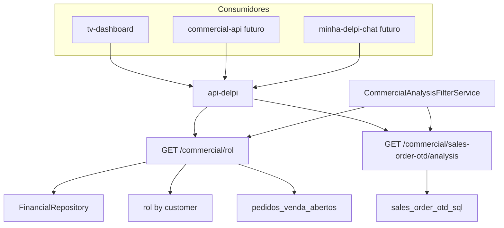

# Rotas comerciais consolidadas — ROL e OTD

> **Status:** especificação aprovada — rotas **ainda não implementadas** (plano E1–E4).  
> Consumidores-alvo: tv-dashboard, Portal Comercial (BFF futuro), minha-delpi-chat, SI.

## Overview

**Duas rotas genéricas** na api-delpi, **sem acoplamento a GR/TV**. Qualquer produto consome o mesmo contrato:

| Rota | operationId | entity |
|------|-------------|--------|
| `GET /commercial/rol` | `get_commercial_rol` | `commercial_rol` |
| `GET /commercial/sales-order-otd/analysis` | `get_commercial_sales_order_otd_analysis` | `commercial_sales_order_otd` |

Shape: **`composite_analysis`** (summary + series + breakdown por cliente/filial + paginação).

Rotas especializadas existentes (`/commercial/rol/series`, `/commercial/rol/by-customer`, `/commercial/sales-order-otd`, `/panel`, `/series`) **permanecem** por compatibilidade; as novas são o **pacote canônico** para dashboards, GR, Overview e chat.

**Carteira semanal** (slide previsto/realizado): compõe na rota **ROL** via bloco opcional `portfolio` (previsão = pedidos abertos por semana de entrega; realizado = ROL) — **sem terceira rota**.

## Decisões travadas

| Decisão | Valor |
|--------|--------|
| Quantidade de rotas | **2** — ROL + OTD |
| Naming | **Sem** prefixo `/gr/`; sem `CommercialGr*` no código |
| Paths | `/commercial/rol` e `/commercial/sales-order-otd/analysis` |
| Por cliente | Sim — `group_by=customer` (default **`customer`** para TV/slides tabulares) |
| Por segmento | Filtro `customer_segment` (`weg` \| `new_business`), não substitui breakdown |
| Multi-select cliente | `customer_codes` CSV (padrão existente, até 2000) |
| Metas | `summary.goal` via enrichment SI (`commercial_rol`, `commercial_sales_order_otd`) |
| Carteira semanal | Bloco `portfolio` na rota ROL quando `include=portfolio` |
| Consumidores | tv-dashboard, commercial-api (proxy futuro), minha-delpi-chat, SI — **mesmo contrato** |
| Idioma | paths/operationId/entity EN; labels PT em OpenAPI locale |

## Inventário — reuso vs lacuna

| Lacuna | Solução |
|--------|---------|
| ROL + meta + série + cliente num pacote | Nova `GET /commercial/rol` compõe `GetCommercialRolSeriesUseCase` + `GetCommercialRolByCustomerUseCase` + SI enrichment |
| OTD + qty atendida + meta + série + cliente | Nova `GET /commercial/sales-order-otd/analysis` estende `sales_order_otd_repository` |
| Filtros WEG/NN | `CommercialCustomerSegmentService` |
| Multi-cliente | `CommercialCustomerCodesFilterService` |
| Previsão carteira semanal | View `pedidos_venda_abertos` agregada por semana de entrega — bloco `portfolio` em ROL |

Referências no código:

- `app/application/use_cases/commercial/get_commercial_rol_series_use_case.py`
- `app/application/use_cases/commercial/get_commercial_rol_by_customer_use_case.py`
- `app/infrastructure/persistence/totvs/commercial_repositories/sales_order_otd_repository.py`
- `app/domain/services/commercial_customer_segment_service.py`
- `app/domain/services/commercial_customer_codes_filter_service.py`
- `app/infrastructure/persistence/totvs/pedidos_venda_abertos/`

## Contrato HTTP compartilhado

### Query params (ambas as rotas)

```
start_date, end_date
granularity          # day | week | month | year (default week)
branch               # 01 | 02 | omitido = consolidado (01+02 no summary/series)
customer_segment     # weg | new_business
customer_codes       # CSV multi-select
group_by             # none | customer | branch  (default customer)
page, page_size      # quando group_by=customer (default 50, max 500)
```

**Só ROL:**

```
include              # CSV flags: portfolio (bloco carteira semanal — previsto aberto + realizado)
```

### Resposta `composite_analysis`

```json
{
  "summary": {
    "start_date", "end_date", "branch", "customer_segment",
    "totals": { "...metricas do dominio..." },
    "goal": { "value", "pct", "source_key" }
  },
  "series": [
    {
      "period_label", "sort_key", "start_date", "end_date",
      "branch_01": { "...metrics..." },
      "branch_02": { "...metrics..." }
    }
  ],
  "by_customer": [
    {
      "customer_code", "customer_store", "customer_name", "branch",
      "...metrics..."
    }
  ],
  "portfolio": {
    "previous_week": { "forecast_value", "realized_value", "variance_value" },
    "current_week_forecast": [ { "customer_code", "customer_name", "branch", "forecast_value" } ]
  },
  "pagination": { "page", "page_size", "total" }
}
```

`portfolio` presente **somente** quando `include=portfolio` na rota ROL.

---

## Exemplos de retorno (tabelas)

Valores ilustrativos alinhados aos slides atuais do GR. Envelope padrão api-delpi: `{ "success": true, "data": { ... }, "meta": { "operationId", "entity", "shape": "composite_analysis", "fields": [...] } }`.

### Exemplo A — `GET /commercial/rol` (slide **Metas**)

**Request:** `?start_date=20260801&end_date=20260831&granularity=month&customer_segment=weg&group_by=branch`

#### `data.summary`

| Campo | Filial 01 (SC) | Filial 02 (ES) | Consolidado |
|-------|----------------|----------------|-------------|
| `rol_with_ipi` | 576.000,00 | 3.384.000,00 | 3.960.000,00 |
| `rol` | 512.430,00 | 3.010.200,00 | 3.522.630,00 |
| `gross_revenue` | 620.100,00 | 3.650.000,00 | 4.270.100,00 |
| `returns` | 12.400,00 | 68.200,00 | 80.600,00 |
| `discounts` | 31.700,00 | 197.600,00 | 229.300,00 |
| `goal.value` | 576.000,00 | 3.384.000,00 | 3.960.000,00 |
| `goal.realized_pct` | 18,58% | 18,58% | 18,58% |
| `goal.open_value` | 204.016,36 | 132.688,64 | 336.705,00 |

#### `data.by_customer` (quando `group_by=customer&customer_segment=new_business`)

| customer_code | customer_name | branch | rol_with_ipi | goal.value | goal.realized_pct | open_value |
|---------------|---------------|--------|--------------|------------|-------------------|------------|
| 000142 | Buhler | 01 | 6.358,49 | — | — | 12.100,00 |
| 000089 | Flextronics | 01 | 19.110,00 | — | — | 8.400,00 |
| 000201 | Franklin | 01 | 48.971,72 | — | — | 22.300,00 |
| 000315 | Wanke | 02 | 20.550,35 | — | — | 18.900,00 |
| 000402 | Schulz | 02 | 10.829,32 | — | — | 5.200,00 |
| **TOTAL** | — | — | **105.819,88** | **730.000,00** | **14,50%** | **66.900,00** |

---

### Exemplo B — `GET /commercial/rol` (slide **Realizado 2025 × 2026**)

**Request 1:** `?start_date=20250801&end_date=20250807&granularity=month&group_by=branch`  
**Request 2:** `?start_date=20260801&end_date=20260807&granularity=month&group_by=branch`  

YoY fica no consumidor — duas chamadas.

#### `data.summary` — comparativo (consumidor junta)

| segmento | branch | ATÉ 07/08/25 `rol_with_ipi` | ATÉ 07/08/26 `rol_with_ipi` | `% ANO` |
|----------|--------|----------------------------|----------------------------|---------|
| WEG | 01 | 892.450,00 | 1.045.200,00 | +17,1% |
| WEG | 02 | 4.210.300,00 | 4.980.100,00 | +18,3% |
| NN | 01 | 310.200,00 | 365.800,00 | +17,9% |
| NN | 02 | 185.400,00 | 218.600,00 | +17,9% |
| **TOTAL** | — | **5.598.350,00** | **6.609.700,00** | **+18,1%** |

#### `data.series` — mês cheio (ago/25 vs ago/26)

| period_label | branch | ago/25 `rol_with_ipi` | ago/26 `rol_with_ipi` | `%` |
|--------------|--------|----------------------|----------------------|-----|
| ago/2025 | 01 | 1.120.000,00 | — | — |
| ago/2026 | 01 | — | 871.310,09 | -22,2% |
| ago/2025 | 02 | 6.800.000,00 | — | — |
| ago/2026 | 02 | — | 5.210.400,00 | -23,4% |

---

### Exemplo C — `GET /commercial/rol?include=portfolio` (slide **Carteira Semanal NN**)

**Request:** `?granularity=week&customer_segment=new_business&include=portfolio&group_by=customer`

#### `data.portfolio.previous_week` (Matriz + Filial)

| escopo | forecast_value | realized_value | variance_value |
|--------|----------------|----------------|----------------|
| branch 01 (Matriz) | 56.471,63 | 55.667,33 | -804,30 |
| branch 02 (Filial) | 31.200,00 | 28.950,00 | -2.250,00 |
| **total** | **87.671,63** | **84.617,33** | **-3.054,30** |

#### `data.portfolio.current_week_forecast` (Previsão da semana)

| customer_code | customer_name | branch | forecast_value |
|---------------|---------------|--------|----------------|
| 000142 | Buhler | 01 | 6.358,49 |
| 000089 | Flextronics | 01 | 19.110,00 |
| 000201 | Franklin | 01 | 48.971,72 |
| 000178 | Menegotti | 01 | 2.652,39 |
| 000315 | Wanke | 02 | 20.550,35 |
| 000402 | Schulz | 02 | 10.829,32 |
| **TOTAL Matriz** | — | 01 | **88.468,84** |
| **TOTAL Filial** | — | 02 | **31.379,67** |

---

### Exemplo D — `GET /commercial/sales-order-otd/analysis` (slide **Atendimento Matriz**)

**Request:** `?start_date=20260803&end_date=20260828&granularity=week&branch=01&customer_segment=weg&group_by=customer`

#### `data.summary`

| Campo | Valor |
|-------|-------|
| `total_lines` | 412 |
| `total_qty` | 1.248 |
| `fulfilled_qty` | 1.198 |
| `on_time_lines` | 385 |
| `late_lines` | 27 |
| `fulfillment_pct` | 96,0% |
| `otd_pct` | 93,4% |
| `goal.value` | 95,0% |
| `goal.realized_pct` | 98,3% |

#### `data.series` (semanal — equivalente «quant itens / atendidos / %»)

| period_label | start_date | end_date | total_qty | fulfilled_qty | fulfillment_pct | otd_pct |
|--------------|------------|----------|-----------|---------------|-------------------|---------|
| semana 03 a 07/08 | 20260803 | 20260807 | 116 | 116 | 100,0% | 100,0% |
| semana 10 a 14/08 | 20260810 | 20260814 | 98 | 93 | 94,9% | 91,8% |
| semana 17 a 21/08 | 20260817 | 20260821 | 142 | 136 | 95,8% | 92,3% |
| semana 24 a 28/08 | 20260824 | 20260828 | 105 | 99 | 94,3% | 90,5% |

---

### Exemplo E — `GET /commercial/sales-order-otd/analysis` (slide **Atendimento Filial**)

**Request:** `?start_date=20260803&end_date=20260807&granularity=week&branch=02&group_by=customer`

#### `data.by_customer`

| customer_name | branch | total_qty | fulfilled_qty | fulfillment_pct | otd_pct |
|---------------|--------|-----------|---------------|-----------------|---------|
| Weg Amazonia | 02 | 0 | 0 | — | — |
| Weg Linhares | 02 | 116 | 116 | 100,0% | 100,0% |
| Weg Drives | 02 | 0 | 0 | — | — |

#### `data.by_customer` (Matriz — `branch=01`, mesma semana)

| customer_name | branch | total_qty | fulfilled_qty | fulfillment_pct | otd_pct |
|---------------|--------|-----------|---------------|-----------------|---------|
| Weg Motores | 01 | 20 | 19 | 95,0% | 95,0% |
| Weg Energia | 01 | 103 | 103 | 100,0% | 100,0% |
| Weg Automação | 01 | 20 | 19 | 95,0% | 95,0% |
| Weg Drives | 01 | 45 | 42 | 93,3% | 91,1% |
| Weg Linhares | 01 | 38 | 36 | 94,7% | 92,1% |

---

### Exemplo F — Paginação (`group_by=customer`)

| Campo | Exemplo |
|-------|---------|
| `pagination.page` | 1 |
| `pagination.page_size` | 50 |
| `pagination.total` | 127 |
| `pagination.has_more` | true |

Quando `group_by=none` ou `group_by=branch`: `by_customer` = `[]`, `pagination` omitido ou `total=0`.

---

## Métricas por domínio

### ROL

| Nível | Campos |
|-------|--------|
| summary | `rol`, `rol_with_ipi`, `gross_revenue`, `returns`, `discounts`, `goal_*` |
| series | por bucket + filial 01/02 |
| by_customer | ROL por cliente (+ paginação) |
| portfolio | previsão semana (valor aberto por entrega) + realizado semana anterior (ROL) |

### OTD (inclui «atendimento» dos slides)

| Nível | Campos |
|-------|--------|
| summary | `total_lines`, `total_qty`, `fulfilled_qty`, `on_time_lines`, `late_lines`, `fulfillment_pct`, `otd_pct`, `goal_*` |
| series | qty + OTD % por bucket e filial |
| by_customer | mesmas métricas por cliente (ex.: Weg Motores, Weg Energia) |

## Mapeamento slides GR → rotas

| Slide | Rota | Como |
|-------|------|------|
| Metas / Realizado ROL | `/commercial/rol` | `group_by=branch` ou duas chamadas `branch=01/02` |
| Realizado 2025×2026 | `/commercial/rol` | 2 chamadas com períodos distintos (TV) |
| Atendimento Matriz/Filial | `/commercial/sales-order-otd/analysis` | `granularity=week`, `group_by=customer` |
| Carteira Semanal NN | `/commercial/rol` | `include=portfolio`, `customer_segment=new_business`, `group_by=customer` |

## Matriz de fluxos transversais

| Fluxo | Superfície | Rota | P0 |
|-------|------------|------|-----|
| Slide TV ROL | tv-dashboard | `get_commercial_rol` | P0 |
| Slide TV OTD/Atendimento | tv-dashboard | `get_commercial_sales_order_otd_analysis` | P0 |
| Slide Carteira Semanal | tv-dashboard | `get_commercial_rol?include=portfolio` | P0 |
| Overview Portal (futuro) | commercial-api proxy | mesmas rotas api-delpi | herança |
| Chat operacional | minha-delpi-ai-api | registry + presentation profile | herança |
| Filtro WEG / NN | query | `customer_segment` | P0 |
| Multi-cliente | query | `customer_codes` | P0 |
| Breakdown por cliente | query | `group_by=customer` (default) | P0 |
| Rotas legadas series/scalar | compat | `/rol/series`, `/sales-order-otd` | mantidas |



## Arquitetura (sem acoplamento GR)

| Camada | Artefatos |
|--------|-----------|
| Domain | `CommercialAnalysisFilterRequest` + `CommercialAnalysisFilterService` |
| Application | `GetCommercialRolAnalysisUseCase`, `GetCommercialSalesOrderOtdAnalysisUseCase` |
| Infrastructure | SQL OTD agregado por período/cliente; query portfolio semanal em repo PVA |
| Interface | Rotas em `app/interface/http/routes/commercial/commercial_router.py` |
| Content | `app/content/tv_route_audience.json` — category `commercial` |

## Etapas de implementação

| Etapa | Entrega |
|-------|---------|
| E1 | `CommercialAnalysisFilterRequest` + service + testes |
| E2 | `GET /commercial/rol` + OpenAPI + smoke + sync TV |
| E3 | `GET /commercial/sales-order-otd/analysis` + SQL + testes |
| E4 | Gates cobertura + sync catálogo TV |

Checklist: `new-api-route-checklist.mdc` (OpenAPI bilíngue, `route_contract_registry`, smoke, TV catalog).

## Compatibilidade com rotas existentes

| Existente | Relação |
|-----------|---------|
| `GET /commercial/rol/series` | Mantida; nova `/commercial/rol` é superset para dashboards |
| `GET /commercial/rol/by-customer` | Mantida; nova rota inclui `by_customer` paginado |
| `GET /financial/rol` | Mantida (financeiro puro, sem filtros comerciais HTTP) |
| `GET /commercial/sales-order-otd` | Mantida (scalar KPI rápido) |
| `GET /commercial/sales-order-otd/series` | Mantida |
| `GET /commercial/sales-order-otd/panel` | Mantida (drill-down linhas) |

## Fora do escopo P0

- Prefixo `/gr/` ou entidades `commercial_gr_*`
- Terceira rota `weekly-portfolio`
- BFF commercial-api proxy
- YoY embutido na API
- Ticket médio / amostras / FNE

## Critérios de pronto

- Duas rotas publicadas, contrato idêntico de filtros, breakdown **por cliente** (default `group_by=customer`)
- Carteira semanal via `include=portfolio` na rota ROL
- TV catalog com 2 operationIds genéricos
- Testes + gates OpenAPI/TV verdes
- Zero nomenclatura GR no código HTTP

## Referências

- [GAV-TV-FEED.md](../../../docs/12-roadmap-e-evolucao/commercial/GAV-TV-FEED.md) — fontes GR / TV
- [new-api-route-checklist.mdc](../../../.cursor/rules/new-api-route-checklist.mdc) — checklist de rota nova
