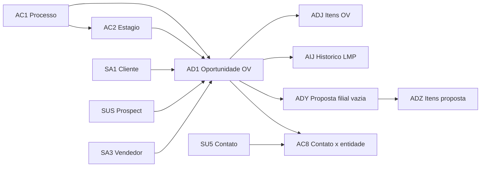

# Playbook — dicionário CRM TOTVS (SIGATEC) Delpi

**Seção curta:** [crm-sigatec.md](../crm-sigatec.md).

Este playbook é o **catálogo de dicionário** (SX2/SX3/SIX/SX9) extraído em **19 ago 2026**.

**Censo vivo** (volumes, funis usados, joins reais, físico vs SX2): **[crm-sigatec.md](../crm-sigatec.md)**. O dicionário sozinho superestima o CRM (182 nomes no recorte; 46 com dado; 67 sem objeto SQL).

## 1. Método de extração

| Rota | Uso |
|------|-----|
| `POST /apps/api-delpi/data/sql` | SX2 (tabelas), SX3 (colunas), SIX (índices), SX9 (relações), AC1/AC2 (funil vivo) |
| `GET /apps/api-delpi/system/tables/{table}/relations` | conferência SX9 |
| `GET /apps/api-delpi/system/tables/{table}/indexes` | conferência SIX |
| `GET /apps/api-delpi/system/tables/search` | **não usado** no recorte (fallback ~10k tabelas) |

Filtro SX2: prefixos físicos `AC%`, `AD%`, `AI%`, `SU%`, `SQ%` **ou** descrição contendo CRM, oportunidade, proposta, funil, estágio, contato, prospect, processo de venda.

Tipos SX3: `C` caractere, `N` numérico, `D` data, `M` memo, `L` lógico. Sempre filtrar `D_E_L_E_T_ = ''`.

## 2. Fronteira de produto

| Dado | Dono |
|------|------|
| OV, funil, proposta, cliente, vendedor (SQL TOTVS) | **api-delpi** (read-only) |
| Carteira, avatar, follow-up, reminder, anexo Delpi | **commercial-api** ([ADR-001](../../../../../docs/12-roadmap-e-evolucao/commercial/adr/ADR-001-commercial-api.md)) |

O MFE Portal Comercial **não** chama api-delpi direto para regra de membership; KPI TOTVS segue via gateway da commercial-api ou rotas já donas, conforme `mfe-own-api-no-direct-api-delpi.mdc`.

## 3. Grafo operacional (núcleo)



Nesta base `AD8`/`AD5`/`AD7` existem e têm **0** linhas. ADY é compartilhada (`ADY_FILIAL` vazio) — ver censo. Cardinalidade SX9 a partir de AD1: **1 → N** para AD2, AD9, ADC, ADJ.

## 4. Funil vivo (AC1010 / AC2010)

### 4.1 Processos

| Filial | Código | Nome | MSBLQL |
|--------|--------|------|--------|
| `` | `000001` | COMPONENTES | 1 Inativo |
| `` | `000002` | OPORTUNIDADE | 2 Ativo |
| `` | `000003` | MODIFICACAO | 2 Ativo |

`MSBLQL` **não** descreve o uso: `000001` inativo no cadastro concentra **3075/3767** OVs. Volumes por processo: [crm-sigatec.md](../crm-sigatec.md).

### 4.2 Estágios

| Processo | Estágio | Descrição | Contrib. % | Dias cadastro |
|----------|---------|-----------|------------|---------------|
| `000001` | `000001` | APRESENTAÇÃO DA EMPRESA | 5.0 | 1.0 |
| `000001` | `000002` | LEVANTAMENTO DAS NECESSIDADES | 10.0 | 1.0 |
| `000001` | `000003` | ELABORAÇÃO PROPOSTA TÉCNICA | 20.0 | 1.0 |
| `000001` | `000004` | ELABORAÇÃO PROPOSTA COMERCIAL | 5.0 | 1.0 |
| `000001` | `000005` | APRESENTAÇÃO DA PROPOSTA | 10.0 | 1.0 |
| `000001` | `000006` | AGUARDANDO RETORNO CLIENTE | 10.0 | 99.0 |
| `000001` | `000007` | FOLLOW-UP | 10.0 | 1.0 |
| `000001` | `000008` | ELABORAÇÃO DE AMOSTRA | 10.0 | 1.0 |
| `000001` | `000009` | REVISÃO TÉCNICA | 5.0 | 1.0 |
| `000001` | `000010` | REVISÃO COMERCIAL | 5.0 | 1.0 |
| `000001` | `000011` | NEGOCIAÇÃO / FECHAMENTO | 10.0 | 1.0 |
| `000002` | `000001` | ANALISE CRITICA | 5.0 | 0.0 |
| `000002` | `000002` | COTACAO | 5.0 | 2.0 |
| `000002` | `000003` | ENGENHARIA | 5.0 | 1.0 |
| `000002` | `000004` | FINALIZACAO DE COTACAO | 10.0 | 1.0 |
| `000002` | `000005` | PROPOSTA CONCLUIDA | 5.0 | 0.0 |
| `000002` | `000006` | PROPOSTA ENVIADA/AGUARD RETORN | 10.0 | 0.0 |
| `000002` | `000007` | AMOSTRA PCP | 10.0 | 0.0 |
| `000002` | `000008` | AMOSTRA ENGENHARIA | 10.0 | 3.0 |
| `000002` | `000009` | RELATORIO QUALIDADE | 10.0 | 2.0 |
| `000002` | `000010` | AMOSTRA ENVIADA A VENDAS | 10.0 | 0.0 |
| `000002` | `000011` | HOMOLOGACAO DE PRODUTO | 10.0 | 30.0 |
| `000002` | `000012` | LANCAMENTO / HOMOLOGACAO | 5.0 | 1.0 |
| `000002` | `000013` | ENCERRADO | 5.0 | 5.0 |
| `000003` | `000001` | ANALISE CRITICA | 5.0 | 0.0 |
| `000003` | `000002` | COTACAO | 5.0 | 2.0 |
| `000003` | `000003` | ENGENHARIA | 5.0 | 1.0 |
| `000003` | `000004` | FINALIZACAO DE COTACAO | 10.0 | 1.0 |
| `000003` | `000005` | PROPOSTA CONCLUIDA | 5.0 | 0.0 |
| `000003` | `000006` | PROPOSTA ENVIADA/AGUARD RETORN | 10.0 | 0.0 |
| `000003` | `000007` | AMOSTRA PCP | 10.0 | 0.0 |
| `000003` | `000008` | AMOSTRA ENGENHARIA | 10.0 | 3.0 |
| `000003` | `000009` | RELATORIO QUALIDADE | 10.0 | 2.0 |
| `000003` | `000010` | AMOSTRA ENVIADA A VENDAS | 10.0 | 0.0 |
| `000003` | `000011` | HOMOLOGACAO DE PRODUTO | 10.0 | 30.0 |
| `000003` | `000012` | LANCAMENTO / HOMOLOGACAO | 5.0 | 1.0 |
| `000003` | `000013` | ENCERRADO | 5.0 | 5.0 |

Estágio `000013 ENCERRADO` **não** equivale a ganha. Ver [comercial-taxa-conversao-estagios.md](../../comercial-taxa-conversao-estagios.md).

## 5. Combos de status (SX3)

| Tabela.campo | Combo SX3 | Uso Delpi |
|--------------|-----------|-----------|
| `AD1.AD1_STATUS` | 1 Aberto; 2 Perdido; 3 Suspenso; **9 Ganha** | Conversão comercial |
| `ADC.ADC_STATUS` | 1 Aberto; 2 Perdido; 3 Suspenso; 9 Encerrado | Histórico antigo da OV — **não** usar no LMP |
| `AIJ.AIJ_STATUS` | 1 Encerrado sem atraso; 2 Encerrado com atraso | Combo do dicionário; a api-delpi usa rótulos próprios em `lmp_history_event_enrichment.py` — homologar antes de unificar |
| `AIJ.AIJ_HISTOR` / `ADJ.ADJ_HISTOR` | 1 Sim; 2 Não | Registro histórico vs vigente |
| `SUS.US_STATUS` | 1 Classificado … **6 Cliente** | Conversão prospect → SA1 |
| `AD8.AD8_STATUS` | 1 Não iniciada; 2 Em andamento; 3 Completada; 4 Suspensa; 5 Encerrada | Tarefa CRM |
| `ADY.ADY_STATUS` | função `#FT600CbxStatus()` | Status da proposta documento |

## 6. Catálogo de tabelas

Total no recorte SX2: **179** (+ SA1/SA3/SE4 no censo = 182 nomes). Colunas SX3 dumpadas (exceto SA1/SA3 neste playbook): **1626**. Relações SX9 entre lógicas do recorte: **178**. Índices SIX: **296**.

**Censo 19 ago 2026** (`D_E_L_E_T_ = ''`): **46** com dado, **69** físicas vazias, **67** sem objeto SQL. Volumes e joins: [crm-sigatec.md](../crm-sigatec.md). `AD8`/`AD7`/`AD5` = 0 linhas; `ADM`/`ADN`/`AZR` não existem no SQL Server.

### 6.1 Núcleo OV / LMP

| Física | Lógica | Descrição SX2 | Chave única SX2 | Cols | Whitelist SQL | api-delpi |
|--------|--------|---------------|-----------------|------|---------------|-----------|
| `AC1010` | `AC1` | Processos de Venda (Funil Vnd) | `AC1_FILIAL+AC1_PROVEN` | 10 | sim | 3 funis; 000001 inativo no cadastro, 82% das OVs |
| `AC2010` | `AC2` | Estágios do Processo de Vendas | `AC2_FILIAL+AC2_PROVEN+AC2_STAGE` | 19 | sim | rótulo de estágio |
| `ACZ010` | `ACZ` | Regras do Processo de Venda | `ACZ_FILIAL+ACZ_PROVEN+ACZ_ITEM` | 8 | não | — |
| `AD1010` | `AD1` | Oportunidades de Venda | `AD1_FILIAL+AD1_NROPOR` | 82 | sim | **3767 OVs** (1 linha/OV); LMP, closing-rate, proposals |
| `ADJ010` | `ADJ` | PROD./CATEG. DA OPORTUNIDADE | `ADJ_FILIAL+ADJ_NROPOR+ADJ_REVISA+ADJ_PROPOS+ADJ_NUMORC+ADJ_ITEM+ADJ_CODAGR+ADJ_CODNIV` | 23 | sim | 19250 / 3710 OVs |
| `AIJ010` | `AIJ` | Evolução da Venda | `AIJ_FILIAL+AIJ_NROPOR+AIJ_REVISA+AIJ_PROVEN+AIJ_STAGE` | 15 | sim | 34589; `/history/events`, `/history/flow` |

### 6.2 Proposta comercial (ADY/ADZ)

| Física | Lógica | Descrição SX2 | Chave única SX2 | Cols | Whitelist SQL | api-delpi |
|--------|--------|---------------|-----------------|------|---------------|-----------|
| `ADY010` | `ADY` | Proposta Comercial Cabeçalho | `ADY_FILIAL+ADY_PROPOS+ADY_PREVIS` | 71 | sim | 3437; `ADY_FILIAL` vazio |
| `ADZ010` | `ADZ` | Proposta Comercial Itens | `ADZ_FILIAL+ADZ_PROPOS+ADZ_REVISA+ADZ_FOLDER+ADZ_ITEM` | 39 | sim | 41861 |

### 6.3 Conta, contato e equipe

| Física | Lógica | Descrição SX2 | Chave única SX2 | Cols | Whitelist SQL | api-delpi |
|--------|--------|---------------|-----------------|------|---------------|-----------|
| `AC8010` | `AC8` | Relação de Contatos x Entidade | `AC8_FILIAL+AC8_CODCON+AC8_ENTIDA+AC8_FILENT+AC8_CODENT` | 19 | não | 168 linhas (SA1 80 / SUS 42 / SA2 46) |
| `ACA010` | `ACA` | Equipe de Vendas | `ACA_FILIAL+ACA_GRPREP` | 30 | não | 6 |
| `ACH010` | `ACH` | Suspects | `ACH_FILIAL+ACH_CODIGO+ACH_LOJA` | 70 | não | 2 |
| `AD2010` | `AD2` | Time de Vendas | `AD2_FILIAL+AD2_NROPOR+AD2_REVISA+AD2_VEND` | 17 | não | 7232 |
| `AD9010` | `AD9` | Contatos da Oportunidade | `AD9_FILIAL+AD9_NROPOR+AD9_REVISA+AD9_CODCON` | 6 | não | 2826 |
| `ADK010` | `ADK` | Unidade de Negócio / Canal | `ADK_FILIAL+ADK_COD` | 30 | não | 2 |
| `ADM010` | `ADM` | PERFIS DE CONTATO | `ADM_FILIAL+ADM_CODIGO` | 3 | não | **sem objeto SQL** |
| `ADN010` | `ADN` | PERFIL X CONTATO | `ADN_FILIAL+ADN_CODCON+ADN_CODPER` | 6 | não | **sem objeto SQL** |
| `AO3010` | `AO3` | Usuários do CRM | `AO3_FILIAL+AO3_CODUSR` | 33 | não | 37 (sem coluna física `AO3_NOMUSR`) |
| `SQB010` | `SQB` | Departamento | `QB_FILIAL+QB_DEPTO` | 21 | sim | departamento contato |
| `SU5010` | `SU5` | Contatos | `U5_FILIAL+U5_CODCONT` | 79 | sim | 514; `U5_CLIENTE`/`U5_PROSPEC` vazios |
| `SUM010` | `SUM` | Cargos | `UM_FILIAL+UM_CARGO` | 7 | sim | cargo comercial |
| `SUS010` | `SUS` | Prospects | `US_FILIAL+US_COD+US_LOJA` | 101 | não | 154 (101 status 1 / 53 status 6) |

### 6.4 Atividade, agenda e visita

| Física | Lógica | Descrição SX2 | Chave única SX2 | Cols | Whitelist SQL | api-delpi |
|--------|--------|---------------|-----------------|------|---------------|-----------|
| `ACD010` | `ACD` | Eventos | `ACD_FILIAL+ACD_CODIGO` | 23 | não | — |
| `ACE010` | `ACE` | Grade de Eventos | `` | 14 | não | — |
| `AD5010` | `AD5` | Apontamento do Contato/Visita | `AD5_FILIAL+AD5_VEND+DTOS(AD5_DATA)+AD5_SEQUEN` | 14 | não | vazio nesta base |
| `AD6010` | `AD6` | Apontamento dos Custos | `AD6_FILIAL+AD6_VEND+AD6_DATA+AD6_SEQUEN+AD6_ITEM` | 16 | não | vazio nesta base |
| `AD7010` | `AD7` | Agenda | `` | 39 | não | vazio nesta base |
| `AD8010` | `AD8` | Tarefas | `AD8_FILIAL+AD8_TAREFA` | 30 | não | vazio nesta base |
| `ADS010` | `ADS` | TIPOS DE TAREFAS | `ADS_FILIAL+ADS_CODIGO` | 3 | não | — |
| `ADT010` | `ADT` | RELAC.COMPONENTE X TP.TAREFA | `ADT_FILIAL+ADT_CODCMP+ADT_CODTAR` | 5 | não | — |
| `ADX010` | `ADX` | COMPONENTES DA TAREFA | `ADX_FILIAL+ADX_ORCAME+ADX_VERSAO+ADX_TAREFA+ADX_ITEM` | 18 | não | — |

### 6.5 Configuração SIGATEC / regras

| Física | Lógica | Descrição SX2 | Chave única SX2 | Cols | Whitelist SQL | api-delpi |
|--------|--------|---------------|-----------------|------|---------------|-----------|
| `AC0010` | `AC0` | Cadastro de Feriado | `AC0_FILIAL+AC0_CODIGO` | 3 | não | — |
| `AC3010` | `AC3` | Concorrentes | `AC3_FILIAL+AC3_CODCON` | 18 | não | — |
| `AC4010` | `AC4` | Parceiros | `AC4_FILIAL+AC4_PARTNE` | 16 | não | — |
| `AC5010` | `AC5` | Eventos do Contato x Visita | `AC5_FILIAL+AC5_EVENTO` | 4 | não | — |
| `AC6010` | `AC6` | Metas de Venda x Marketing | `AC6_FILIAL+AC6_META` | 8 | não | — |
| `AC7010` | `AC7` | Campanhas x Metas | `AC7_FILIAL+AC7_META+AC7_CODCAM` | 5 | não | — |
| `AC9010` | `AC9` | Relação de Objetos x Entidades | `AC9_FILIAL+AC9_CODOBJ+AC9_ENTIDA+AC9_FILENT+AC9_CODENT` | 8 | não | — |
| `ACB010` | `ACB` | Bancos de Conhecimentos | `ACB_FILIAL+ACB_CODOBJ` | 7 | não | — |
| `ACC010` | `ACC` | Palavras-Chave | `` | 3 | não | — |
| `ACF010` | `ACF` | Telecobrança | `ACF_FILIAL+ACF_CODIGO` | 35 | não | — |
| `ACG010` | `ACG` | Itens de Telecobrança | `ACG_FILIAL+ACG_CODIGO+ACG_PREFIX+ACG_TITULO+ACG_PARCEL+ACG_TIPO+ACG_FILORI` | 41 | não | — |
| `ACI010` | `ACI` | Campanhas Executadas | `ACI_FILIAL+ACI_CODIGO` | 11 | não | — |
| `ACJ010` | `ACJ` | Códigos DDI | `` | 5 | não | — |
| `ACK010` | `ACK` | Cabeçalho das Verbas de Vendas | `ACK_FILIAL+ACK_CODVER` | 9 | não | — |
| `ACL010` | `ACL` | Itens da Verba de Vendas | `ACL_FILIAL+ACL_CODVER+ACL_ITEM` | 7 | não | — |
| `ACM010` | `ACM` | Movimentação da Verba de Venda | `ACM_FILIAL+ACM_CODVER+ACM_NUMPED+ACM_ITEPED` | 7 | não | — |
| `ACN010` | `ACN` | Descontos da Regra de Negócio | `ACN_FILIAL+ACN_CODREG+ACN_ITEM+ACN_CODPRO` | 9 | não | — |
| `ACO010` | `ACO` | Regras de Desconto | `ACO_FILIAL+ACO_CODREG` | 22 | não | — |
| `ACP010` | `ACP` | Itens da Regra de Desconto | `ACP_FILIAL+ACP_CODREG+ACP_ITEM+ACP_CODPRO` | 12 | não | — |
| `ACQ010` | `ACQ` | Regras de Bonificação | `ACQ_FILIAL+ACQ_CODREG` | 21 | não | — |
| `ACR010` | `ACR` | Itens da Regra de Bonificação | `ACR_FILIAL+ACR_CODREG+ACR_ITEM+ACR_CODPRO` | 8 | não | — |
| `ACS010` | `ACS` | Regras de Negócio | `ACS_FILIAL+ACS_CODREG` | 13 | não | — |
| `ACT010` | `ACT` | Itens da Regra de Negócio | `ACT_FILIAL+ACT_CODREG+ACT_ITEM` | 9 | não | — |
| `ACU010` | `ACU` | Categoria de Produtos | `ACU_FILIAL+ACU_COD` | 13 | não | — |
| `ACV010` | `ACV` | Categoria x Grupo ou Produto | `ACV_FILIAL+ACV_CATEGO+ACV_GRUPO+ACV_CODPRO+ACV_REFGRD` | 13 | não | — |
| `ACW010` | `ACW` | Restrições de Entrega x Visita | `ACW_FILIAL+ACW_NUMCTR+ACW_ITEM` | 13 | não | — |
| `ACX010` | `ACX` | Itens Regra Negócio Produção | `ACX_FILIAL+ACX_CODREG+ACX_ITEM` | 8 | não | — |
| `ACY010` | `ACY` | Grupos de Clientes | `ACY_FILIAL+ACY_GRPVEN` | 9 | não | — |
| `AD0010` | `AD0` | Numeracao de Doc. Por CNPJ | `AD0_FILIAL+AD0_CNPJ+AD0_SERIE+AD0_DOC` | 5 | não | — |
| `AD3010` | `AD3` | Concorrentes | `AD3_FILIAL+AD3_NROPOR+AD3_REVISA+AD3_CODCON` | 10 | não | — |
| `AD4010` | `AD4` | Parceiros de Venda - Partner | `AD4_FILIAL+AD4_NROPOR+AD4_REVISA+AD4_PARTNE` | 8 | não | — |
| `ADA010` | `ADA` | Contrato de Parceria | `ADA_FILIAL+ADA_NUMCTR` | 34 | não | — |
| `ADB010` | `ADB` | Itens do Contrato de Parceria | `ADB_FILIAL+ADB_NUMCTR+ADB_ITEM` | 29 | não | — |
| `ADC010` | `ADC` | Histórico de Oportunidades | `ADC_FILIAL+ADC_NROPOR+ADC_REVISA` | 36 | não | — |
| `ADD010` | `ADD` | Transações Financeiras | `ADD_FILIAL+ADD_NUMSOL` | 15 | não | — |
| `ADG010` | `ADG` | REGRA DE RODIZIO | `ADG_FILIAL+ADG_COD` | 7 | não | — |
| `ADH010` | `ADH` | ITENS DA REGRA DE RODIZIO | `ADH_FILIAL+ADH_COD+ADH_NUMITE` | 7 | não | — |
| `ADI010` | `ADI` | TIPO DE REGRA DE RODIZIO | `ADI_FILIAL+ADI_COD` | 8 | não | — |
| `ADL010` | `ADL` | CONTROLE DE CONTA DO VENDEDOR | `` | 27 | não | — |
| `ADO010` | `ADO` | Cadastro de Categoria | `ADO_FILIAL+ADO_CODIGO` | 4 | não | — |
| `ADP010` | `ADP` | Filtros de usuario por rotina | `` | 5 | não | — |
| `ADQ010` | `ADQ` | DETALHES DE CAMPOS TELESERVICE | `` | 9 | não | — |
| `ADR010` | `ADR` | COMPONENTES | `ADR_FILIAL+ADR_CODIGO` | 3 | não | — |
| `ADU010` | `ADU` | ITENS DE COMPLEXIDADE | `ADU_FILIAL+ADU_CODCMP+ADU_ITEM` | 10 | não | — |
| `ADV010` | `ADV` | COMPONENTES DA COMPOSICAO | `ADV_FILIAL+ADV_COMPOS+ADV_ITEM` | 13 | não | — |
| `ADW010` | `ADW` | Processos CRM x Acao | `ADW_FILIAL+ADW_CODIGO` | 5 | não | — |

### 6.6 Telemarketing e campanha (SU*)

| Física | Lógica | Descrição SX2 | Chave única SX2 | Cols | Whitelist SQL | api-delpi |
|--------|--------|---------------|-----------------|------|---------------|-----------|
| `SU0010` | `SU0` | Grupo de Atendimento | `U0_FILIAL+U0_CODIGO` | 0 | não | — |
| `SU1010` | `SU1` | Itens do Acessório | `U1_FILIAL+U1_CODACE+U1_ACESSOR` | 0 | não | — |
| `SU2010` | `SU2` | Concorrentes | `U2_FILIAL+U2_COD+U2_CONCOR` | 0 | não | — |
| `SU3010` | `SU3` | Promoções | `` | 0 | não | — |
| `SU4010` | `SU4` | Listas de Contatos | `U4_FILIAL+U4_LISTA+DTOS(U4_DATA)` | 48 | não | — |
| `SU6010` | `SU6` | Itens das Listas de Contatos | `U6_FILIAL+U6_LISTA+U6_CODIGO` | 21 | não | — |
| `SU7010` | `SU7` | Operadores | `U7_FILIAL+U7_COD` | 0 | não | — |
| `SU8010` | `SU8` | Histórico de Marketing | `` | 0 | não | — |
| `SU9010` | `SU9` | Ocorrências | `U9_FILIAL+U9_ASSUNTO+U9_CODIGO` | 0 | não | — |
| `SUA010` | `SUA` | Orçamento Televendas | `UA_FILIAL+UA_NUM` | 0 | não | — |
| `SUB010` | `SUB` | Itens do Orçamento Televendas | `UB_FILIAL+UB_NUM+UB_ITEM+UB_PRODUTO` | 0 | não | — |
| `SUC010` | `SUC` | Cabeçalho do Telemarketing | `UC_FILIAL+UC_CODIGO` | 0 | não | — |
| `SUD010` | `SUD` | Itens do Telemarketing | `UD_FILIAL+UD_CODIGO+UD_ITEM` | 0 | não | — |
| `SUE010` | `SUE` | Cabeçalho Config Telemarketing | `UE_FILIAL+UE_CODIGO` | 0 | não | — |
| `SUF010` | `SUF` | Itens Config Telemarketing | `UF_FILIAL+UF_CODIGO+UF_ITEM` | 0 | não | — |
| `SUG010` | `SUG` | Acessórios | `UG_FILIAL+UG_CODACE` | 0 | não | — |
| `SUH010` | `SUH` | Mídias | `UH_FILIAL+UH_MIDIA` | 0 | não | — |
| `SUI010` | `SUI` | Cabecalho Servico SLA | `` | 0 | não | — |
| `SUJ010` | `SUJ` | Itens do Servico de SLA | `` | 0 | não | — |
| `SUK010` | `SUK` | Itens de Campanhas Executadas | `` | 0 | não | — |
| `SUL010` | `SUL` | Tipo de Comunicação | `UL_FILIAL+UL_TPCOMUN` | 0 | não | — |
| `SUN010` | `SUN` | Tipo de Encerram | `UN_FILIAL+UN_ENCERR` | 0 | não | — |
| `SUO010` | `SUO` | Campanhas | `UO_FILIAL+UO_CODCAMP` | 0 | não | — |
| `SUP010` | `SUP` | Itens do Script Dinâmico | `UP_FILIAL+UP_CODCAMP+UP_IDTREE+UP_CARGO` | 0 | não | — |
| `SUQ010` | `SUQ` | Ações | `UQ_FILIAL+UQ_SOLUCAO` | 0 | não | — |
| `SUR010` | `SUR` | Ocorrência x Ação | `UR_FILIAL+UR_CODREC+UR_IDTREE+UR_IDCODE` | 0 | não | — |
| `SUT010` | `SUT` | Indicadores Gerenciais | `UT_FILIAL+UT_CODIGO` | 0 | não | — |
| `SUU010` | `SUU` | INDICADOR X OCO X ACAO | `` | 0 | não | — |
| `SUV010` | `SUV` | Atendentes In/Out | `UV_FILIAL+UV_USUARIO+UV_RAMAL+UV_ROTINA+UV_HRINI` | 0 | não | — |
| `SUW010` | `SUW` | Script Dinâmico x Campanha | `UW_FILIAL+UW_CODEVE+UW_CODCAMP+UW_CODSCRI+UW_PRODUTO+UW_MIDIA` | 0 | não | — |
| `SUX010` | `SUX` | Tipo de Ocorrências | `UX_FILIAL+UX_CODTPO` | 0 | não | — |
| `SUY010` | `SUY` | Dependências entre Ocorrências | `UY_FILIAL+UY_CODOCO+UY_CODDEP` | 0 | não | — |
| `SUZ010` | `SUZ` | Script Dinâmico | `UZ_FILIAL+UZ_CODSCRI` | 0 | não | — |

### 6.7 Fora do CRM — Help desk

| Física | Lógica | Descrição SX2 | Chave única SX2 | Cols | Whitelist SQL | api-delpi |
|--------|--------|---------------|-----------------|------|---------------|-----------|
| `ADE010` | `ADE` | Chamados de Help Desk | `ADE_FILIAL+ADE_CODIGO` | 94 | não | — |
| `ADF010` | `ADF` | Itens do chamado | `` | 23 | não | — |

### 6.8 Fora do CRM — Portal / suprimentos (AI*)

| Física | Lógica | Descrição SX2 | Chave única SX2 | Cols | Whitelist SQL | api-delpi |
|--------|--------|---------------|-----------------|------|---------------|-----------|
| `AI0010` | `AI0` | COMPLEMENTOS DE CLIENTES | `AI0_FILIAL+AI0_CODCLI+AI0_LOJA` | 0 | não | — |
| `AI1010` | `AI1` | Regras/Bonificação Financeira | `AI1_FILIAL+AI1_CODBNF` | 0 | não | — |
| `AI2010` | `AI2` | Itens / Bonificação Financeira | `AI2_FILIAL+AI2_CODBNF+AI2_ITEM+AI2_CODPRO` | 0 | não | — |
| `AI3010` | `AI3` | Usuários do Portal | `AI3_FILIAL+AI3_CODUSU` | 0 | não | — |
| `AI4010` | `AI4` | Usuários do Portal x Cliente | `AI4_FILIAL+AI4_CODUSU+AI4_CODCLI+AI4_LOJCLI` | 0 | não | — |
| `AI5010` | `AI5` | Fornecedores | `AI5_FILIAL+AI5_CODUSU+AI5_CODFOR+AI5_LOJFOR` | 0 | não | — |
| `AI6010` | `AI6` | Direitos | `AI6_FILIAL+AI6_CODUSU+AI6_WEBSRV` | 0 | não | — |
| `AI7010` | `AI7` | Web Services | `AI7_FILIAL+AI7_WEBSRV` | 0 | não | — |
| `AI8010` | `AI8` | Menus do Portal | `AI8_FILIAL+AI8_PORTAL+AI8_CODMNU` | 0 | não | — |
| `AI9010` | `AI9` | Portais do Sistema | `AI9_FILIAL+AI9_PORTAL` | 0 | não | — |
| `AIA010` | `AIA` | Tabela de Preços do Fornecedor | `AIA_FILIAL+AIA_CODFOR+AIA_LOJFOR+AIA_CODTAB` | 0 | não | — |
| `AIB010` | `AIB` | Itens da Tabela de Preços | `AIB_FILIAL+AIB_CODFOR+AIB_LOJFOR+AIB_CODTAB+AIB_ITEM` | 0 | não | — |
| `AIC010` | `AIC` | Tolerância na Entrada Material | `AIC_FILIAL+AIC_CODIGO` | 0 | não | — |
| `AID010` | `AID` | Fluxo de Caixas de Materiais | `AID_FILIAL+AID_NUMPV+DTOS(AID_DATA)` | 0 | não | — |
| `AIE010` | `AIE` | CÁLCULO DAS NECESSIDADES | `AIE_FILIAL+AIE_NUM+AIE_FILNEC+AIE_CODPRO` | 0 | não | — |
| `AIF010` | `AIF` | Histórico Alterações Cli/For | `` | 0 | não | — |
| `AIH010` | `AIH` | Regra Blq Margem Mín | `AIH_FILIAL+AIH_CODREG` | 0 | não | — |
| `AII010` | `AII` | Itens Blq Margem Mín | `AII_FILIAL+AII_CODREG+AII_ITEM` | 0 | não | — |
| `AIK010` | `AIK` | Bloqueio de Contatos | `AIK_FILIAL+AIK_COD` | 0 | não | — |
| `AIL010` | `AIL` | Itens Contatos Bloqueados | `AIL_FILIAL+AIL_CODAIK+AIL_ITEM+AIL_REFROT` | 0 | não | — |
| `AIM010` | `AIM` | Solicit. de Transf. de Contas | `AIM_FILIAL+AIM_CODIGO` | 0 | não | — |
| `AIN010` | `AIN` | Log  de Transf. de Contas | `AIN_FILIAL+AIN_CODIGO` | 0 | não | — |
| `AIO010` | `AIO` | Check-in\Check-out | `AIO_ALIAS+AIO_COD` | 0 | não | — |
| `AIP010` | `AIP` | Cadastro de Integrações | `AIP_FILIAL+AIP_CODIGO` | 0 | não | — |
| `AIQ010` | `AIQ` | Categoria de Cursos | `AIQ_FILIAL+AIQ_CODIGO` | 0 | não | — |
| `AIR010` | `AIR` | Controle de Exportação | `AIR_FILIAL+AIR_CODIGO` | 0 | não | — |
| `AIS010` | `AIS` | Aposentadoria Especial REINF | `AIS_FILIAL+AIS_PEDIDO+AIS_ITEMPV` | 0 | não | — |

### 6.9 Fora do CRM — RH (SQ*)

| Física | Lógica | Descrição SX2 | Chave única SX2 | Cols | Whitelist SQL | api-delpi |
|--------|--------|---------------|-----------------|------|---------------|-----------|
| `SQ0010` | `SQ0` | Grupos Funcionais | `Q0_FILIAL+Q0_GRUPO` | 0 | não | — |
| `SQ1010` | `SQ1` | Fatores de Avaliação | `Q1_FILIAL+Q1_GRUPO+Q1_FATOR` | 0 | não | — |
| `SQ2010` | `SQ2` | Graduação dos Fatores | `Q2_FILIAL+Q2_GRUPO+Q2_FATOR+Q2_GRAU` | 0 | não | — |
| `SQ3010` | `SQ3` | Cargos | `Q3_FILIAL+Q3_CARGO+Q3_CC` | 0 | não | — |
| `SQ4010` | `SQ4` | Graduação dos Cargos | `Q4_FILIAL+Q4_CARGO+Q4_CC+Q4_FATOR` | 0 | não | — |
| `SQ5010` | `SQ5` | Salários dos Cargos | `Q5_FILIAL+Q5_CARGO+Q5_NIVEL` | 0 | não | — |
| `SQ6010` | `SQ6` | Informantes | `Q6_FILIAL+Q6_INFORM` | 0 | não | — |
| `SQ7010` | `SQ7` | Ponderação Fatores/Informantes | `Q7_FILIAL+Q7_INFORM+Q7_GRUPO+Q7_FATOR` | 0 | não | — |
| `SQ8010` | `SQ8` | Graduação Fatores/Funcionários | `Q8_FILIAL+Q8_MAT+Q8_FATOR` | 0 | não | — |
| `SQ9010` | `SQ9` | Extra Curriculares | `` | 0 | não | — |
| `SQA010` | `SQA` | Classificação de Cargos | `QA_FILIAL+QA_CARGO` | 0 | não | — |
| `SQC010` | `SQC` | Histórico de Carreira | `` | 0 | não | — |
| `SQD010` | `SQD` | Agenda do Candidato | `` | 0 | não | — |
| `SQE010` | `SQE` | Tipos de Processo Seletivo | `QE_FILIAL+QE_PROCESS+QE_ITEM` | 0 | não | — |
| `SQF010` | `SQF` | Titulos Rateados | `QF_FILIAL+QF_NUMTIT+QF_ITEM` | 0 | não | — |
| `SQG010` | `SQG` | Currículo | `QG_FILIAL+QG_CURRIC` | 0 | não | — |
| `SQH010` | `SQH` | Configurações de Currículo | `QH_FILIAL+QH_CAMPO` | 0 | não | — |
| `SQI010` | `SQI` | Qualificação do Currículo | `QI_FILIAL+QI_CURRIC+QI_FATOR+QI_GRAU` | 0 | não | — |
| `SQL010` | `SQL` | Histórico Profissional | `` | 0 | não | — |
| `SQM010` | `SQM` | Cursos do Candidato | `` | 0 | não | — |
| `SQN010` | `SQN` | Fatores Calculáveis | `QN_FILIAL+QN_GRUPO+QN_FATOR+QN_GRAU` | 0 | não | — |
| `SQO010` | `SQO` | Questões | `QO_FILIAL+QO_QUESTAO` | 0 | não | — |
| `SQP010` | `SQP` | Alternativas x Questões | `QP_FILIAL+QP_QUESTAO+QP_ALTERNA` | 0 | não | — |
| `SQQ010` | `SQQ` | Tipos de Testes | `QQ_FILIAL+QQ_TESTE+QQ_ITEM` | 0 | não | — |
| `SQR010` | `SQR` | Avaliação do Currículo | `` | 0 | não | — |
| `SQS010` | `SQS` | Vagas | `QS_FILIAL+QS_VAGA` | 0 | não | — |
| `SQT010` | `SQT` | Cursos | `QT_FILIAL+QT_CURSO` | 0 | não | — |
| `SQU010` | `SQU` | Pesquisas | `QU_FILIAL+QU_CODIGO+QU_SEQ` | 0 | não | — |
| `SQV010` | `SQV` | Fatores Gerais de Avaliação | `QV_FILIAL+QV_FATOR+QV_GRAU` | 0 | não | — |
| `SQW010` | `SQW` | Modelos de Testes | `QW_FILIAL+QW_MODELO+QW_SEQ` | 0 | não | — |
| `SQX010` | `SQX` | Tipos de Curso | `QX_FILIAL+QX_CODIGO` | 0 | não | — |
| `SQY010` | `SQY` | HISTORICO DE TARIFAS DE VT | `QY_FILIAL+QY_COD+DTOS(QY_DATVIGE)` | 0 | não | — |

### 6.10 Fora do CRM — prospect B9*

| Física | Lógica | Descrição SX2 | Chave única SX2 | Cols | Whitelist SQL | api-delpi |
|--------|--------|---------------|-----------------|------|---------------|-----------|
| `B9Q010` | `B9Q` | PROSPECT X EXPECIALIDADE | `B9Q_FILIAL+B9Q_CODINT+B9Q_CODPRO+B9Q_CODESP+B9Q_CODLOC+B9Q_CODPRE+B9Q_SEQVIS` | 0 | não | — |
| `B9R010` | `B9R` | PROSPECT X SERVIÇOS | `B9R_FILIAL+B9R_CODINT+B9R_CODPRO+B9R_CODLOC+B9R_CODSER+B9R_CODPRE+B9R_SEQVIS` | 0 | não | — |
| `B9V010` | `B9V` | PROSPECT X ENDEREÇO | `B9V_FILIAL+B9V_CODINT+B9V_CODPRO+B9V_CEP+B9V_CODSEQ+B9V_ENDER+B9V_COMEND+B9V_CODPRE+B9V_CODCID+B9V_SEQB9V` | 0 | não | — |
| `B9Y010` | `B9Y` | CADASTRO PROSPECT | `B9Y_FILIAL+B9Y_CODIGO` | 0 | não | — |

### 6.11 Outros

| Física | Lógica | Descrição SX2 | Chave única SX2 | Cols | Whitelist SQL | api-delpi |
|--------|--------|---------------|-----------------|------|---------------|-----------|
| `AZR010` | `AZR` | Papéis do Usuário CRM | `AZR_FILIAL+AZR_PAPEL` | 3 | não | — |
| `AZS010` | `AZS` | Papéis x Usuário CRM | `AZS_FILIAL+AZS_CODUSR+AZS_SEQUEN+AZS_PAPEL` | 14 | não | — |
| `GU2010` | `GU2` | CONTATOS DOS EMITENTES | `GU2_FILIAL+GU2_CDEMIT+GU2_SEQ` | 0 | não | — |
| `TI6010` | `TI6` | CONTATOS EXTERNOS DA PERMISSÃO | `TI6_FILIAL+TI6_PERMIS+TI6_SEQPER+TI6_CODCON` | 0 | não | — |
| `VCE010` | `VCE` | Regras para Geração Lista CRM | `` | 0 | não | — |

## 7. Relações SX9 (núcleo)

Expressões como gravadas em `X9_EXPDOM` / `X9_EXPCDOM`. Cardinalidade `X9_LIGDOM`/`X9_LIGCDOM` (1/N).

| De | Para | Expressão origem | Expressão destino | Card. |
|----|------|------------------|-------------------|-------|
| `AC1` | `AC2` | `AC1_PROVEN` | `AC2_PROVEN` | 1→N |
| `AC1` | `ACZ` | `AC1_PROVEN` | `ACZ_PROVEN` | 1→N |
| `AC1` | `AD1` | `AC1_PROVEN` | `AD1_PROVEN` | 1→N |
| `AC1` | `AD7` | `AC1_PROVEN` | `AD7_PROVEN` | 1→N |
| `AC1` | `ADC` | `AC1_PROVEN` | `ADC_PROVEN` | 1→N |
| `AC2` | `AD1` | `AC2_PROVEN+AC2_STAGE` | `AD1_PROVEN+AD1_STAGE` | 1→N |
| `AC2` | `AD7` | `AC2_PROVEN+AC2_STAGE` | `AD7_PROVEN+AD7_STAGE` | 1→N |
| `AC2` | `ADC` | `AC2_PROVEN+AC2_STAGE` | `ADC_PROVEN+ADC_STAGE` | 1→N |
| `AC3` | `ACH` | `AC3_CODCON` | `ACH_CONCOR` | 1→N |
| `AC5` | `ACZ` | `AC5_EVENTO` | `ACZ_EVENTO` | 1→N |
| `AC5` | `AD5` | `AC5_EVENTO` | `AD5_EVENTO` | 1→N |
| `AC5` | `AD8` | `AC5_EVENTO` | `AD8_EVENTO` | 1→N |
| `AC8` | `ACW` | `AC8_CODCON+AC8_ENTIDA+AC8_FILENT+AC8_CODENT` | `ACW_CODCON+'SA1'+ACW_FILIAL+ACW_CODCLI+ACW_LOJA` | 1→N |
| `AC8` | `AD8` | `AC8_CODCON` | `AD8_CONTAT` | 1→N |
| `ACA` | `AO3` | `ACA_GRPREP` | `AO3_CODEQP` | 1→N |
| `ACA` | `SA3` | `ACA_GRPREP` | `A3_GRPREP` | 1→N |
| `ACH` | `ACI` | `ACH_CODIGO+ACH_LOJA` | `ACI_CHAVE` | 1→N |
| `ACH` | `AIM` | `ACH_CODIGO+ACH_LOJA` | `AIM_CODCTA+AIM_LOJCTA` | 1→N |
| `ACH` | `SU6` | `ACH_CODIGO+ACH_LOJA` | `U6_CODENT` | 1→N |
| `ACH` | `SUC` | `ACH_CODIGO+ACH_LOJA` | `UC_CHAVE` | 1→N |
| `ACJ` | `ACH` | `ACJ_DDI` | `ACH_DDI` | 1→N |
| `ACJ` | `ADK` | `ACJ_DDI` | `ADK_DDI` | 1→N |
| `ACJ` | `SA1` | `ACJ_DDI` | `A1_DDI` | 1→N |
| `ACJ` | `SA3` | `ACJ_DDI` | `A3_DDI` | 1→N |
| `ACJ` | `SU5` | `ACJ_DDI` | `U5_CODPAIS` | 1→N |
| `ACJ` | `SUS` | `ACJ_DDI` | `US_DDI` | 1→N |
| `ACU` | `ADJ` | `ACU_COD` | `ADJ_CATEG` | 1→N |
| `ACY` | `SA1` | `ACY_GRPVEN` | `A1_GRPVEN` | 1→N |
| `AD1` | `AD2` | `AD1_NROPOR+AD1_REVISA` | `AD2_NROPOR+AD2_REVISA` | 1→N |
| `AD1` | `AD3` | `AD1_NROPOR+AD1_REVISA` | `AD3_NROPOR+AD3_REVISA` | 1→N |
| `AD1` | `AD4` | `AD1_NROPOR+AD1_REVISA` | `AD4_NROPOR+AD4_REVISA` | 1→N |
| `AD1` | `AD5` | `AD1_NROPOR` | `AD5_NROPOR` | 1→N |
| `AD1` | `AD7` | `AD1_NROPOR` | `AD7_NROPOR` | 1→N |
| `AD1` | `AD8` | `AD1_NROPOR` | `AD8_NROPOR` | 1→N |
| `AD1` | `AD9` | `AD1_NROPOR+AD1_REVISA` | `AD9_NROPOR+AD9_REVISA` | 1→N |
| `AD1` | `ADC` | `AD1_NROPOR` | `ADC_NROPOR` | 1→1 |
| `AD1` | `ADJ` | `AD1_NROPOR+AD1_REVISA` | `ADJ_NROPOR+ADJ_REVISA` | 1→N |
| `AD1` | `ADY` | `AD1_NROPOR` | `ADY_OPORTU` | 1→N |
| `AD1` | `AIJ` | `AD1_NROPOR+AD1_REVISA+AD1_PROVEN` | `AIJ_NROPOR+AIJ_REVISA+AIJ_PROVEN` | 1→N |
| `AD5` | `AD6` | `AD5_VEND+AD5_DATA+AD5_SEQUEN` | `AD6_VEND+AD6_DATA+AD6_SEQUEN` | 1→N |
| `AD5` | `AD7` | `AD5_VEND+AD5_DATA+AD5_SEQUEN` | `AD7_VENDAP+AD7_DATAAP+AD7_SEQAP` | 1→N |
| `ADC` | `AD2` | `ADC_NROPOR+ADC_REVISA` | `AD2_NROPOR+AD2_REVISA` | 1→N |
| `ADC` | `AD3` | `ADC_NROPOR+ADC_REVISA` | `AD3_NROPOR+AD3_REVISA` | 1→N |
| `ADC` | `AD4` | `ADC_NROPOR+ADC_REVISA` | `AD4_NROPOR+AD4_REVISA` | 1→N |
| `ADC` | `AD9` | `ADC_NROPOR+ADC_REVISA` | `AD9_NROPOR+AD9_REVISA` | 1→N |
| `ADC` | `AIJ` | `ADC_NROPOR+ADC_REVISA` | `AIJ_NROPOR+AIJ_REVISA` | 1→N |
| `ADK` | `AD1` | `ADK_COD` | `AD1_CANAL` | 1→N |
| `ADK` | `AIN` | `ADK_COD` | `AIN_UNDANT` | 1→N |
| `ADK` | `AIN` | `ADK_COD` | `AIN_UNDATU` | 1→N |
| `ADK` | `AO3` | `ADK_COD` | `AO3_CODUND` | 1→N |
| `ADK` | `AZS` | `ADK_COD` | `AZS_CODUND` | 1→N |
| `ADK` | `SA1` | `ADK_COD` | `A1_UNIDVEN` | 1→N |
| `ADK` | `SA3` | `ADK_COD` | `A3_UNIDAD` | 1→N |
| `ADO` | `AD1` | `ADO_CODIGO` | `AD1_CODCAT` | 1→N |
| `ADO` | `ADC` | `ADO_CODIGO` | `ADC_CODCAT` | 1→N |
| `ADY` | `AD1` | `ADY_PROPOS` | `AD1_PROPOS` | 1→N |
| `ADY` | `ADZ` | `ADY_PROPOS+ADY_PREVIS` | `ADZ_PROPOS+ADZ_REVISA` | 1→N |
| `AO3` | `ACA` | `AO3_CODUSR` | `ACA_USRESP` | 1→N |
| `AO3` | `AZS` | `AO3_CODUSR` | `AZS_CODUSR` | 1→N |
| `AO3` | `SU5` | `AO3_CODUSR` | `U5_CODUSR` | 1→N |
| `SA1` | `ACF` | `A1_COD+A1_LOJA` | `ACF_CLIENT+ACF_LOJA` | 1→N |
| `SA1` | `ACI` | `A1_COD+A1_LOJA` | `ACI_CHAVE` | 1→N |
| `SA1` | `ACK` | `A1_COD+A1_LOJA` | `ACK_CODCLI+ACK_LOJA` | 1→N |
| `SA1` | `ACO` | `A1_COD+A1_LOJA` | `ACO_CODCLI+ACO_LOJA` | 1→N |
| `SA1` | `ACQ` | `A1_COD+A1_LOJA` | `ACQ_CODCLI+ACQ_LOJA` | 1→N |
| `SA1` | `ACS` | `A1_COD+A1_LOJA` | `ACS_CODCLI+ACS_LOJA` | 1→N |
| `SA1` | `ACW` | `A1_COD+A1_LOJA` | `ACW_CODCLI+ACW_LOJA` | 1→N |
| `SA1` | `AD1` | `A1_COD+A1_LOJA` | `AD1_CODCLI+AD1_LOJCLI` | 1→N |
| `SA1` | `AD5` | `A1_COD+A1_LOJA` | `AD5_CODCLI+AD5_LOJA` | 1→N |
| `SA1` | `AD7` | `A1_COD+A1_LOJA` | `AD7_CODCLI+AD7_LOJA` | 1→N |
| `SA1` | `AD8` | `A1_COD+A1_LOJA` | `AD8_CODCLI+AD8_LOJCLI` | 1→N |
| `SA1` | `ADA` | `A1_COD+A1_LOJA` | `ADA_CODCLI+ADA_LOJCLI` | 1→N |
| `SA1` | `ADC` | `A1_COD+A1_LOJA` | `ADC_CODCLI+ADC_LOJCLI` | 1→N |
| `SA1` | `ADY` | `A1_COD+A1_LOJA` | `ADY_CLIENT+ADY_LOJENT` | 1→N |
| `SA1` | `ADY` | `A1_COD+A1_LOJA` | `ADY_CODIGO+ADY_LOJA` | 1→N |
| `SA1` | `AI0` | `A1_COD+A1_LOJA` | `AI0_CODCLI+AI0_LOJA` | 1→1 |
| `SA1` | `AI1` | `A1_COD+A1_LOJA` | `AI1_CODCLI+AI1_LOJA` | 1→N |
| `SA1` | `AI4` | `A1_COD+A1_LOJA` | `AI4_CODCLI+AI4_LOJCLI` | 1→1 |
| `SA1` | `AIH` | `A1_COD+A1_LOJA` | `AIH_CODCLI+AIH_LOJA` | N→1 |
| `SA1` | `AIM` | `A1_COD+A1_LOJA` | `AIM_CODCTA+AIM_LOJCTA` | 1→N |
| `SA1` | `SA1` | `A1_COD` | `A1_CLIFAT` | 1→N |
| `SA1` | `SA1` | `A1_COD+A1_LOJA` | `A1_CLIPRI+A1_LOJPRI` | 1→N |
| `SA1` | `SC5` | `A1_COD+A1_LOJA` | `C5_CLIENTE+C5_LOJACLI` | 1→N |
| `SA1` | `SC5` | `A1_COD+A1_LOJA` | `C5_CLIREM+C5_LOJAREM` | 1→N |
| `SA1` | `SC5` | `A1_COD+A1_LOJA` | `C5_CLIENT+C5_LOJAENT` | 1→N |
| `SA1` | `SC5` | `A1_COD+A1_LOJA` | `C5_CLIRET+C5_LOJARET` | 1→N |
| `SA1` | `SU3` | `A1_COD+A1_LOJA` | `U3_CLIENTE+U3_LOJA` | 1→N |
| `SA1` | `SU5` | `A1_COD+A1_LOJA` | `U5_CLIENTE+U5_LOJA` | 1→N |
| `SA1` | `SU6` | `A1_COD+A1_LOJA` | `U6_CODENT` | 1→N |
| `SA1` | `SUA` | `A1_COD+A1_LOJA` | `UA_CLIENTE+UA_LOJA` | 1→N |
| `SA1` | `SUA` | `A1_COD+A1_LOJA` | `UA_CLIENT+UA_LOJAENT` | 1→N |
| `SA1` | `SUC` | `A1_COD+A1_LOJA` | `UC_CHAVE` | 1→N |
| `SA1` | `SUS` | `A1_COD+A1_LOJA` | `US_CODCLI+US_LOJACLI` | 1→1 |
| `SA3` | `ACH` | `A3_COD` | `ACH_VEND` | 1→N |
| `SA3` | `ACK` | `A3_COD` | `ACK_CODVEN` | 1→N |
| `SA3` | `AD1` | `A3_COD` | `AD1_VEND` | 1→N |
| `SA3` | `AD2` | `A3_COD` | `AD2_VEND` | 1→N |
| `SA3` | `AD2` | `A3_COD` | `AD2_RESPUN` | 1→N |
| `SA3` | `AD5` | `A3_COD` | `AD5_VEND` | 1→N |
| `SA3` | `AD6` | `A3_COD` | `AD6_VEND` | 1→N |
| `SA3` | `AD7` | `A3_COD` | `AD7_VEND` | 1→N |
| `SA3` | `AD7` | `A3_COD` | `AD7_VENDAP` | 1→N |
| `SA3` | `AD8` | `A3_COD` | `AD8_VEND` | 1→N |
| `SA3` | `ADA` | `A3_COD` | `ADA_VEND2` | 1→N |
| `SA3` | `ADA` | `A3_COD` | `ADA_VEND3` | 1→N |
| `SA3` | `ADA` | `A3_COD` | `ADA_VEND4` | 1→N |
| `SA3` | `ADA` | `A3_COD` | `ADA_VEND1` | 1→N |
| `SA3` | `ADA` | `A3_COD` | `ADA_VEND5` | 1→N |
| `SA3` | `ADC` | `A3_COD` | `ADC_VEND` | 1→N |
| `SA3` | `ADG` | `A3_COD` | `ADG_CODVEN` | 1→N |
| `SA3` | `ADK` | `A3_COD` | `ADK_RESP` | 1→N |
| `SA3` | `AI3` | `A3_COD` | `AI3_VEND` | 1→N |
| `SA3` | `AIM` | `A3_COD` | `AIM_VENPRO` | 1→N |
| `SA3` | `AIM` | `A3_COD` | `AIM_VENDCS` | 1→N |
| `SA3` | `AIM` | `A3_COD` | `AIM_VENSOL` | 1→N |
| `SA3` | `AIN` | `A3_COD` | `AIN_VENANT` | 1→N |
| `SA3` | `AIN` | `A3_COD` | `AIN_VENATU` | 1→N |
| `SA3` | `AIN` | `A3_COD` | `AIN_VENDCS` | 1→N |
| `SA3` | `AO3` | `A3_COD` | `AO3_VEND` | 1→N |
| `SA3` | `AZS` | `A3_COD` | `AZS_VEND` | 1→N |
| `SA3` | `SA1` | `A3_COD` | `A1_VEND` | 1→N |
| `SA3` | `SA3` | `A3_COD` | `A3_GEREN` | 1→N |
| `SA3` | `SA3` | `A3_COD` | `A3_SUPER` | 1→N |
| `SA3` | `SC5` | `A3_COD` | `C5_VEND1` | 1→N |
| `SA3` | `SC5` | `A3_COD` | `C5_VEND2` | 1→N |
| `SA3` | `SC5` | `A3_COD` | `C5_VEND3` | 1→N |
| `SA3` | `SC5` | `A3_COD` | `C5_VEND4` | 1→N |
| `SA3` | `SC5` | `A3_COD` | `C5_VEND5` | 1→N |
| `SA3` | `SU3` | `A3_COD` | `U3_VEND` | 1→N |
| `SA3` | `SU5` | `A3_COD` | `U5_CODSA3` | 1→N |
| `SA3` | `SU7` | `A3_COD` | `U7_CODVEN` | 1→1 |
| `SA3` | `SUA` | `A3_COD` | `UA_VEND` | 1→N |
| `SA3` | `SUS` | `A3_COD` | `US_VEND` | 1→N |
| `SQ0` | `SQB` | `Q0_GRUPO` | `QB_GRUPO` | 1→N |
| `SQ0` | `SU5` | `Q0_GRUPO` | `U5_GRUPO` | 1→N |
| `SQ3` | `SQB` | `Q3_DEPTO` | `QB_DEPTO` | 1→N |
| `SQB` | `SQ3` | `QB_DEPTO` | `Q3_DEPTO` | 1→N |
| `SQB` | `SQB` | `QB_DEPTO` | `QB_DEPSUP` | 1→N |
| `SQB` | `SQG` | `QB_DEPTO` | `QG_DEPTO` | 1→N |
| `SQB` | `SU5` | `QB_DEPTO` | `U5_DEPTO` | 1→N |
| `SU5` | `AC8` | `U5_CODCONT` | `AC8_CODCON` | 1→N |
| `SU5` | `ACF` | `U5_CODCONT` | `ACF_CODCON` | 1→N |
| `SU5` | `ACI` | `U5_CODCONT` | `ACI_CODCON` | 1→N |
| `SU5` | `ACW` | `U5_CODCONT` | `ACW_CODCON` | 1→N |
| `SU5` | `AD1` | `U5_CODCONT` | `AD1_CNTPRO` | 1→N |
| `SU5` | `AD7` | `U5_CODCONT` | `AD7_CONTAT` | 1→N |
| `SU5` | `AD9` | `U5_CODCONT` | `AD9_CODCON` | 1→N |
| `SU5` | `ADE` | `U5_CODCONT` | `ADE_CODCON` | 1→N |
| `SU5` | `ADE` | `U5_CODCONT` | `ADE_CODREP` | 1→N |
| `SU5` | `ADN` | `U5_CODCONT` | `ADN_CODCON` | 1→N |
| `SU5` | `SU4` | `U5_CODCONT` | `U4_CONTATO` | 1→N |
| `SU5` | `SU5` | `U5_CODCONT` | `U5_CONPRI` | 1→N |
| `SU5` | `SU6` | `U5_CODCONT` | `U6_CONTATO` | 1→N |
| `SU5` | `SUA` | `U5_CODCONT` | `UA_CODCONT` | 1→N |
| `SU5` | `SUC` | `U5_CODCONT` | `UC_CODCONT` | 1→N |
| `SU7` | `SU5` | `U7_COD` | `U5_OPERADO` | 1→N |
| `SUC` | `AD1` | `UC_CODIGO` | `AD1_CODTMK` | 1→N |
| `SUH` | `ACH` | `UH_MIDIA` | `ACH_MIDIA` | 1→N |
| `SUH` | `SUS` | `UH_MIDIA` | `US_MIDIA` | 1→N |
| `SUL` | `AD1` | `UL_TPCOMUN` | `AD1_COMUNI` | 1→N |
| `SUM` | `AD2` | `UM_CARGO` | `AD2_CODPAP` | 1→N |
| `SUM` | `AO3` | `UM_CARGO` | `AO3_CARGO` | 1→N |
| `SUM` | `SA3` | `UM_CARGO` | `A3_CARGO` | 1→N |
| `SUM` | `SU5` | `UM_CARGO` | `U5_FUNCAO` | 1→N |
| `SUM` | `SUM` | `UM_CARGO` | `UM_CRGSUP` | 1→N |
| `SUN` | `ACH` | `UN_ENCERR` | `ACH_CODESQ` | 1→N |
| `SUN` | `AD1` | `UN_ENCERR` | `AD1_ENCERR` | 1→N |
| `SUN` | `SUS` | `UN_ENCERR` | `US_CODDESQ` | 1→N |
| `SUO` | `ACH` | `UO_FILIAL+UO_CODCAMP` | `ACH_CHVCAM` | 1→N |
| `SUO` | `AD1` | `UO_FILIAL+UO_CODCAMP` | `AD1_CHVCAM` | 1→N |
| `SUO` | `SUS` | `UO_FILIAL+UO_CODCAMP` | `US_CHVCAM` | 1→N |
| `SUS` | `ACH` | `US_COD+US_LOJA` | `ACH_CODPRO+ACH_LOJPRO` | 1→N |
| `SUS` | `ACI` | `US_COD+US_LOJA` | `ACI_CHAVE` | 1→N |
| `SUS` | `AD1` | `US_COD+US_LOJA` | `AD1_PROSPE+AD1_LOJPRO` | 1→N |
| `SUS` | `AD5` | `US_COD+US_LOJA` | `AD5_PROSPE+AD5_LOJPRO` | 1→N |
| `SUS` | `AD7` | `US_COD+US_LOJA` | `AD7_PROSPE+AD7_LOJPRO` | 1→N |
| `SUS` | `AD8` | `US_COD+US_LOJA` | `AD8_PROSPE+AD8_LOJPRO` | 1→N |
| `SUS` | `ADC` | `US_COD+US_LOJA` | `ADC_PROSPE+ADC_LOJPRO` | 1→N |
| `SUS` | `ADY` | `US_COD+US_LOJA` | `ADY_CODIGO+ADY_LOJA` | 1→N |
| `SUS` | `AIM` | `US_COD+US_LOJA` | `AIM_CODCTA+AIM_LOJCTA` | 1→N |
| `SUS` | `SU6` | `US_COD+US_LOJA` | `U6_CODENT` | 1→N |
| `SUS` | `SUC` | `US_COD+US_LOJA` | `UC_CHAVE` | 1→N |

### 7.1 Joins canônicos (SQL Delpi)

```sql
-- OV + itens + histórico + funil
AD1.AD1_FILIAL = ADJ.ADJ_FILIAL AND AD1.AD1_NROPOR = ADJ.ADJ_NROPOR AND AD1.AD1_REVISA = ADJ.ADJ_REVISA
AD1.AD1_FILIAL = AIJ.AIJ_FILIAL AND AD1.AD1_NROPOR = AIJ.AIJ_NROPOR AND AD1.AD1_REVISA = AIJ.AIJ_REVISA
AC2.AC2_FILIAL = AD1.AD1_FILIAL AND AC2.AC2_PROVEN = AD1.AD1_PROVEN AND AC2.AC2_STAGE = AD1.AD1_STAGE
AC1.AC1_FILIAL = AD1.AD1_FILIAL AND AC1.AC1_PROVEN = AD1.AD1_PROVEN
SA1.A1_COD = AD1.AD1_CODCLI AND SA1.A1_LOJA = AD1.AD1_LOJCLI
SA3.A3_COD = AD1.AD1_VEND
ADY.ADY_FILIAL = AD1.AD1_FILIAL AND ADY.ADY_OPORTU = AD1.AD1_NROPOR AND ADY.ADY_REVISA = AD1.AD1_REVISA
-- alternativa SX9: AD1_NROPOR → ADY (sem revisão na relação)
SUS.US_COD = AD1.AD1_PROSPE AND SUS.US_LOJA = AD1.AD1_LOJPRO
```

AIJ e ADJ **não** têm linhas SX9 de saída no dicionário; o join é pela chave da OV.

## 8. Índices SIX (núcleo)

### `AD1`

| Ordem | Chave | Descrição |
|-------|-------|-----------|
| 1 | `AD1_FILIAL+AD1_NROPOR+AD1_REVISA` | Oportunidade + Revisao |
| 2 | `AD1_FILIAL+AD1_VEND+DTOS(AD1_DTINI)` | Vendedor + Dt.Inicio |
| 3 | `AD1_FILIAL+AD1_VEND+DTOS(AD1_DTFIM)` | Vendedor + Dt.Fechament |
| 4 | `AD1_FILIAL+AD1_PROSPE+AD1_LOJPRO+AD1_VEND+DTOS(AD1_DTINI)+DTOS(AD1_DTFIM)+AD1_PROVEN+AD1_STAGE+AD1_CODPRO+AD1_STATUS` | Prospect + Loja Prosp. + Vendedor + Dt.Inicio + Dt.Fechament + Process |
| 5 | `AD1_FILIAL+AD1_PROVEN+AD1_STAGE` | Processo + Estagio |
| 6 | `AD1_FILIAL+DTOS(AD1_DATA)+AD1_NROPOR+AD1_REVISA` | Dt Inclusão + Oportunidade + Revisao |
| 7 | `AD1_FILIAL+AD1_CODTMK` | Cod Atend |
| 8 | `AD1_FILIAL+DTOS(AD1_DATA)+AD1_PROVEN+AD1_VEND+AD1_STATUS` | Dt Inclusão + Processo + Vendedor + Status |

### `ADJ`

| Ordem | Chave | Descrição |
|-------|-------|-----------|
| 1 | `ADJ_FILIAL+ADJ_NROPOR+ADJ_REVISA+ADJ_ITEM+ADJ_PROD` | Oportunidade + Revisao + Item + Produto |
| 2 | `ADJ_FILIAL+ADJ_NROPOR+ADJ_REVISA+ADJ_ITEM+ADJ_CATEG+ADJ_PROD` | Oportunidade + Revisao + Item + Categoria + Produto |
| 3 | `ADJ_FILIAL+ADJ_NROPOR+ADJ_REVISA+ADJ_CATEG` | Oportunidade + Revisao + Categoria |
| 4 | `ADJ_FILIAL+ADJ_NROPOR+ADJ_REVISA+ADJ_PROPOS+ADJ_NUMORC+ADJ_ITEM` | Oportunidade + Revisao + No.Proposta + Nr.Orcamento + Item |
| 5 | `ADJ_FILIAL+ADJ_NROPOR+ADJ_PROPOS` | Oportunidade + No.Proposta |
| 6 | `ADJ_FILIAL+ADJ_NROPOR+ADJ_REVISA+ADJ_CODAGR+ADJ_CODNIV+ADJ_ITEM` | Oportunidade + Revisao + Agrupador + Nível Agrup. + Item |

### `AIJ`

| Ordem | Chave | Descrição |
|-------|-------|-----------|
| 1 | `AIJ_FILIAL+AIJ_NROPOR+AIJ_REVISA+AIJ_PROVEN+AIJ_STAGE` | Oportunidade + Revisão + Proc. Venda + Estágio |

### `AC1`

| Ordem | Chave | Descrição |
|-------|-------|-----------|
| 1 | `AC1_FILIAL+AC1_PROVEN` | Processo |
| 2 | `AC1_FILIAL+AC1_DESCRI` | Descrição |

### `AC2`

| Ordem | Chave | Descrição |
|-------|-------|-----------|
| 1 | `AC2_FILIAL+AC2_PROVEN+AC2_STAGE` | Processo + Estágio |

### `ADY`

| Ordem | Chave | Descrição |
|-------|-------|-----------|
| 1 | `ADY_FILIAL+ADY_PROPOS` | Proposta No. |
| 2 | `ADY_FILIAL+ADY_OPORTU+ADY_REVISA+ADY_PROPOS` | Oportunidade + Revisao + Proposta No. |
| 3 | `ADY_FILIAL+DTOS(ADY_DATA)+ADY_PROPOS+ADY_REVISA` | Data + Proposta No. + Revisao |

### `ADZ`

| Ordem | Chave | Descrição |
|-------|-------|-----------|
| 1 | `ADZ_FILIAL+ADZ_PROPOS+ADZ_ITEM` | Nr Proposta + Item |
| 2 | `ADZ_FILIAL+ADZ_PROPOS+ADZ_FOLDER+ADZ_ITEM` | Nr Proposta + Folder + Item |
| 3 | `ADZ_FILIAL+ADZ_PROPOS+ADZ_REVISA+ADZ_FOLDER+ADZ_ITEM` | Nr Proposta + Revisao + Folder + Item |
| 4 | `ADZ_FILIAL+ADZ_PROPOS+ADZ_REVISA+ADZ_CODAGR+ADZ_CODNIV` | Nr Proposta + Revisao + Agrupador + Nível Agrup. |

### `SU5`

| Ordem | Chave | Descrição |
|-------|-------|-----------|
| 1 | `U5_FILIAL+U5_CODCONT+U5_IDEXC` | Contato + ID Exchange |
| 2 | `U5_FILIAL+U5_CONTAT` | Nome |
| 3 | `U5_FILIAL+U5_FONE+U5_DDD+U5_CODPAIS` | Fone Resid. + DDD + DDI |
| 4 | `U5_FILIAL+U5_CELULAR+U5_DDD+U5_CODPAIS` | Celular + DDD + DDI |
| 5 | `U5_FILIAL+U5_FCOM1+U5_DDD+U5_CODPAIS` | Fone Com.1 + DDD + DDI |
| 6 | `U5_FILIAL+U5_FCOM2+U5_DDD+U5_CODPAIS` | Fone Com.2 + DDD + DDI |
| 7 | `U5_FILIAL+U5_FAX+U5_DDD+U5_CODPAIS` | Fax + DDD + DDI |
| 8 | `U5_FILIAL+U5_CPF` | CPF |
| 9 | `U5_FILIAL+U5_EMAIL` | E-mail |
| A | `U5_FILIAL+U5_IDSITE` | Id no Site |
| B | `U5_FILIAL+U5_IDEXC` | ID Exchange |
| C | `U5_FILIAL+U5_CONPRI+U5_CODCONT` | Cont Primar. + Contato |

### `SUS`

| Ordem | Chave | Descrição |
|-------|-------|-----------|
| 1 | `US_FILIAL+US_COD+US_LOJA` | Codigo + Loja |
| 2 | `US_FILIAL+US_NOME` | Razao Social |
| 3 | `US_FILIAL+US_TEL+US_DDD+US_DDI` | Telefone + DDD + DDI |
| 4 | `US_FILIAL+US_CGC` | CNPJ |
| 5 | `US_FILIAL+US_CODCLI+US_LOJACLI` | Cliente + Loja do Cl. |
| 6 | `US_FILIAL+US_VEND+US_COD+US_LOJA` | Vendedor + Codigo + Loja |
| 7 | `US_FILIAL+US_STATUS` | Status Atual |

### `AD8`

| Ordem | Chave | Descrição |
|-------|-------|-----------|
| 1 | `AD8_FILIAL+AD8_TAREFA` | Nr.Tarefa |
| 2 | `AD8_FILIAL+AD8_CODUSR+DTOS(AD8_DTINI)` | Usuário + Data Inicio |
| 3 | `AD8_FILIAL+AD8_EMLNAM` | Nome arq EML |
| 4 | `AD8_FILIAL+AD8_PROSPE+AD8_LOJPRO+DTOS(AD8_DTINI)` | Prospect + Loja/Prosp. + Data Inicio |
| 5 | `AD8_FILIAL+AD8_CODCLI+AD8_LOJCLI+DTOS(AD8_DTINI)` | Cliente + Loja + Data Inicio |
| 6 | `AD8_FILIAL+AD8_IDEXC` | ID Exchange |
| 7 | `AD8_FILIAL+AD8_ANIVER+AD8_CONTAT+DTOS(AD8_DTINI)+AD8_CODUSR` | Tarefa Anive + Contato + Data Inicio + Usuário |

### `AD5`

| Ordem | Chave | Descrição |
|-------|-------|-----------|
| 1 | `AD5_FILIAL+AD5_VEND+DTOS(AD5_DATA)+AD5_SEQUEN` | Vendedor + Data + Sequência |
| 2 | `AD5_FILIAL+AD5_NROPOR` | Oportunidade |

### `ADC`

| Ordem | Chave | Descrição |
|-------|-------|-----------|
| 1 | `ADC_FILIAL+ADC_NROPOR+ADC_REVISA` | Oportunidade + Revisao |

### `AO3`

| Ordem | Chave | Descrição |
|-------|-------|-----------|
| 1 | `AO3_FILIAL+AO3_CODUSR` | Usuário |
| 2 | `AO3_FILIAL+AO3_VEND` | Cod Vendedor |

## 9. Schemas SX3 (colunas)

SA1 (265 cols) e SA3 (99 cols) não são repetidos aqui — ver [cadastro-cliente.md](../cadastro-cliente.md) e o dicionário via `GET /system/tables/SA1/columns`.

### `AC1010` (`AC1`) — Processos de Venda (Funil Vnd)

Chave SX2: `AC1_FILIAL+AC1_PROVEN`.

| Ordem | Campo | Tipo | Título | Descrição | Combo |
|-------|-------|------|--------|-----------|-------|
| 01 | `AC1_FILIAL` | C(2) | Filial | Filial do Sistema |  |
| 02 | `AC1_PROVEN` | C(6) | Processo | Nr.Processo de Venda |  |
| 03 | `AC1_DESCRI` | C(30) | Descrição | Descrição do Processo |  |
| 04 | `AC1_CODMEM` | C(6) | Link p/ Memo | Link para memo. |  |
| 05 | `AC1_MEMO` | M(80) | Observacoes | Observacoes |  |
| 06 | `AC1_TPIMP` | C(1) | Tp.Impressao | Tipo de Impressao | 1=Ms-Word;2=PDF |
| 07 | `AC1_DTOTAL` | N(3) | Total Dias | Total de Dias |  |
| 08 | `AC1_HTOTAL` | C(5) | Total Horas | Total de Horas |  |
| 09 | `AC1_MSBLQL` | C(1) | Status | Status do registro | 1=Inativo;2=Ativo |
| 10 | `AC1_STAUTO` | L(1) | Avança Est.? | Avança estágio? |  |

### `AC2010` (`AC2`) — Estágios do Processo de Vendas

Chave SX2: `AC2_FILIAL+AC2_PROVEN+AC2_STAGE`.

| Ordem | Campo | Tipo | Título | Descrição | Combo |
|-------|-------|------|--------|-----------|-------|
| 01 | `AC2_FILIAL` | C(2) | Filial | Filial do Sistema |  |
| 02 | `AC2_PROVEN` | C(6) | Processo | Nr.Processo de Venda |  |
| 03 | `AC2_STAGE` | C(6) | Estágio | Estagio do Processo |  |
| 04 | `AC2_DESCRI` | C(30) | Descrição | Descrição do Estágio |  |
| 05 | `AC2_CODMEM` | C(6) | Link - SYP | Link - SYP |  |
| 06 | `AC2_MEMO` | M(80) | Tarefas | Tarefas |  |
| 07 | `AC2_RELEVA` | N(3) | Contribui. % | Contribuicao em % |  |
| 08 | `AC2_SENDWF` | C(1) | Notifica Rsp | Notifica Responsável | 1=Sim;2=Não |
| 09 | `AC2_ACAO` | C(128) | Ação | Ação Executada |  |
| 10 | `AC2_AVFIN` | C(1) | Aval. Finan. | Avaliação Financeira | 1=Sim;2=Não |
| 11 | `AC2_VLRLIM` | N(12,2) | Vlr. Atraso | Valor Limite p/ avaliação |  |
| 12 | `AC2_DIALIM` | N(3) | Dias Atraso | Lim.em dias p/ avaliação |  |
| 13 | `AC2_AVLPRO` | C(1) | Avl.Prospect | Aval. Cred. para Prospect | 1=Sim;2=Não |
| 14 | `AC2_VTOBRG` | C(1) | VT.Obrigat | Vistoria Tec. Obrigatoria | 1=Sim;2=Não |
| 15 | `AC2_DDURAC` | N(3) | Dias Duração | Dias de dur. do estágio |  |
| 16 | `AC2_HDURAC` | C(5) | Hr. Duração | Horas de dur. do estágio |  |
| 17 | `AC2_DNOTIF` | N(3) | Dias Notific | Dias para notificação |  |
| 18 | `AC2_HNOTIF` | C(5) | Hr. Notific | Horas para notificação |  |
| 19 | `AC2_ZEMAIL` | C(60) | Email | Email |  |

### `ACZ010` (`ACZ`) — Regras do Processo de Venda

Chave SX2: `ACZ_FILIAL+ACZ_PROVEN+ACZ_ITEM`.

| Ordem | Campo | Tipo | Título | Descrição | Combo |
|-------|-------|------|--------|-----------|-------|
| 01 | `ACZ_FILIAL` | C(2) | Filial | Filial do Sistema |  |
| 02 | `ACZ_PROVEN` | C(6) | Processo | Nr.Processo de Venda |  |
| 03 | `ACZ_ITEM` | C(2) | Item | Item |  |
| 04 | `ACZ_OPER` | C(1) | Operacäo | Codigo da Operacäo | 1=Inclusäo;2=Alteracäo;3=Exclusäo |
| 05 | `ACZ_EVENTO` | C(6) | Evento | Codigo do Evento |  |
| 06 | `ACZ_DESCRI` | C(30) | Descricäo | Descricäo do Evento |  |
| 07 | `ACZ_ACAO` | C(1) | Acäo | Codigo da Acäo | 1=Avanca estagio;2=Vai para estagio;3=Retrocede estagio |
| 08 | `ACZ_STAGE` | C(6) | Estagio | Estagio do Processo |  |

### `AD1010` (`AD1`) — Oportunidades de Venda

Chave SX2: `AD1_FILIAL+AD1_NROPOR`.

| Ordem | Campo | Tipo | Título | Descrição | Combo |
|-------|-------|------|--------|-----------|-------|
| 01 | `AD1_FILIAL` | C(2) | Filial | Filial do Sistema |  |
| 02 | `AD1_LEGDLP` | C(15) | Anot. | Possui Anotação? |  |
| 03 | `AD1_PRIOR` | C(1) | Prioridade | Prioridade | 1=Baixa;2=Media;3=Alta |
| 04 | `AD1_NROPOR` | C(6) | Oportunidade | Nr.da Oportunidade |  |
| 05 | `AD1_REVISA` | C(2) | Revisao | Revisao da oportunidade |  |
| 06 | `AD1_DESCRI` | C(30) | Descricao | Descricao da Oportunidade |  |
| 07 | `AD1_DATA` | D(8) | Data | Data de inclusao |  |
| 08 | `AD1_HORA` | C(5) | Hora | Hora de inclusao |  |
| 09 | `AD1_USER` | C(6) | Cod.Usuario | Usuario de Inclusão |  |
| 10 | `AD1_VEND` | C(6) | Vendedor | Vendedor |  |
| 11 | `AD1_NOMVEN` | C(40) | Nome | Nome do Vendedor |  |
| 12 | `AD1_DTINI` | D(8) | Dt.Inicio | Data de Inicio |  |
| 13 | `AD1_DTFIM` | D(8) | Dt.Termino | Data de Encerramento |  |
| 14 | `AD1_PROSPE` | C(6) | Prospect | Prospect |  |
| 15 | `AD1_LOJPRO` | C(2) | Loja Prosp. | Loja do Prospect |  |
| 16 | `AD1_NOMPRO` | C(40) | Nome Prosp. | Nome do Prospect |  |
| 17 | `AD1_CODCLI` | C(6) | Cliente | Codigo do cliente |  |
| 18 | `AD1_LOJCLI` | C(2) | Loja | Loja do Cliente |  |
| 19 | `AD1_NOMCLI` | C(50) | Nome Cliente | Nome do Cliente |  |
| 20 | `AD1_PROVEN` | C(6) | Processo | Processo de Venda |  |
| 21 | `AD1_STAGE` | C(6) | Estagio | Estagio da Venda |  |
| 22 | `AD1_PERCEN` | N(3) | Estagio % | Percentual de conclusao |  |
| 23 | `AD1_VERBA` | N(12,2) | Receita Est. | Receita Estimada |  |
| 24 | `AD1_MOEDA` | N(2) | Moeda | Moeda da Verba |  |
| 25 | `AD1_CODPRO` | C(15) | Produto | Código do Produto |  |
| 26 | `AD1_DESPRO` | C(120) | Descrição | Descrição do Produto |  |
| 27 | `AD1_FCS` | C(6) | F.C.S. | Fator Critico de Sucesso |  |
| 28 | `AD1_DESFCS` | C(30) | Descrição | Descricao do Fator |  |
| 29 | `AD1_FCI` | C(6) | F.C.I. | Fator Critico Insucesso |  |
| 30 | `AD1_DESFCI` | C(30) | Descrição | Descrição do Fator |  |
| 31 | `AD1_STATUS` | C(1) | Status | Status da Oportunidade | 1=Aberto;2=Perdido;3=Suspenso;9=Ganha |
| 32 | `AD1_NUMORC` | C(6) | Orçamento | Número do Orçamento |  |
| 33 | `AD1_CODMEM` | C(6) | Link - SYP | Link - SYP |  |
| 34 | `AD1_MODO` | C(1) | Modo | Modo de Atualizacäo | 1=Manual;2=Automatico |
| 35 | `AD1_CODTMK` | C(6) | Cod Atend | Codigo  do Atendimento |  |
| 36 | `AD1_COMUNI` | C(6) | Comunicacao | Tipo de Comunicacao |  |
| 37 | `AD1_CANAL` | C(6) | Un. Negócio | Unidade de Negócio |  |
| 38 | `AD1_ENCERR` | C(6) | Encerramento | Codigo do Encerramento |  |
| 39 | `AD1_TABELA` | C(3) | Tabela | Codigo da Tabela de Preco |  |
| 40 | `AD1_MEMENC` | C(6) | Descr.Encerr | Descr. de Encerramento |  |
| 41 | `AD1_DTPFIM` | D(8) | Dt Prev. Fim | Dt Prev. Fim - Forecast |  |
| 42 | `AD1_REGSLA` | C(6) | Registro SLA | Registro ID do SLA |  |
| 43 | `AD1_PROPOS` | C(6) | Proposta | Proposta |  |
| 44 | `AD1_FEELIN` | C(1) | Temperatura | Temperatura  da Oport. | 1=Baixa;2=Média;3=Alta |
| 45 | `AD1_DTASSI` | D(8) | Dt.Ass.Prop. | Dt. assinatura proposta |  |
| 46 | `AD1_OBSPRO` | M(10) | Obs.Proposta | Observacoes da proposta |  |
| 47 | `AD1_CNTPRO` | C(6) | Contato Ass. | Contato ass. proposta |  |
| 48 | `AD1_NOMCNT` | C(50) | Nome contato | Nome do contato |  |
| 49 | `AD1_USRASS` | C(6) | Usuário Resp | Cod. Usuario Responsável |  |
| 50 | `AD1_DSCUSR` | C(40) | Nome Usuario | Nome do usuario |  |
| 51 | `AD1_VISTEC` | C(1) | Vist.Técnica | Vistoria Técnica? | 1=Sim;2=Não |
| 52 | `AD1_CODVIS` | C(6) | Vistoria Téc | Código da Vist. Técnica |  |
| 53 | `AD1_SITVIS` | C(1) | Sit.Vist.Téc | Situação Vistoria Téc | 1=Em Aberto;2=Agendado;3=Concluida;4=Nenhuma |
| 54 | `AD1_DTPENC` | D(8) | Dt.Prev.Enc | Data Prev. Encerramento |  |
| 55 | `AD1_HRPENC` | C(5) | Hr.Prev.Enc | Hora Prev. Encerramento |  |
| 56 | `AD1_RCINIC` | N(12,2) | Prev. Inic. | Previsão Inicial |  |
| 57 | `AD1_RCFECH` | N(12,2) | Mensalidade | Mensalidade da Oportu. |  |
| 58 | `AD1_RCREAL` | N(12,2) | Receita Real | Receita Real |  |
| 59 | `AD1_CUSTO` | N(12,2) | Custo | Custo da Oportunidade |  |
| 60 | `AD1_MTVENC` | M(10) | Motivo | Motivo do Encerramento |  |
| 61 | `AD1_SETOR` | C(1) | Setor | Setor | 1=Publico;2=Privado |
| 62 | `AD1_CODCAT` | C(3) | Cod.Categ | Código de Categoria |  |
| 63 | `AD1_TPCAMP` | C(1) | Tipo Camp | Tipo de Campanha |  |
| 64 | `AD1_CHVCAM` | C(14) | Código | Código da Campanha |  |
| 65 | `AD1_IDESTN` | C(30) | Id.Estr.Neg | Id. de Acesso Estr. Neg. |  |
| 66 | `AD1_NVESTN` | N(2) | Nvl. Est.Neg | Nvl de Acesso a Estr. Neg |  |
| 67 | `AD1_MSBLQL` | C(1) | Status Regis | Status do Registro | 1=Inativo;2=Ativo |
| 68 | `AD1_DESCAM` | C(40) | Desc. Camp. | Descrição da Campanha |  |
| 69 | `AD1_ZPRVND` | N(12,2) | Prv Venda | Prv Venda |  |
| 70 | `AD1_DESMOE` | C(15) | Desc. Moeda | Descricao da Moeda |  |
| 71 | `AD1_ZEMBES` | C(1) | Emb especial | Embalagem especial | 1=Sim;2=Não; |
| 72 | `AD1_ZDEMBE` | C(254) | Desc emb esp | Desc embalagem especial |  |
| 73 | `AD1_ZCERTI` | C(1) | Certificação | Certificação | 1=Sim;2=Não; |
| 74 | `AD1_ZDCERT` | C(254) | Desc certifi | Descrição da certificação |  |
| 75 | `AD1_ZCOMSI` | C(1) | Comp similar | Componente similar | 1=Sim;2=Não; |
| 76 | `AD1_ZDCOMS` | C(254) | Desc compon. | Desc componente similar |  |
| 77 | `AD1_ZAMOST` | C(1) | Amostra | Amostra | 1=Amostra;2=Desenho;3=Descrição;4=Desenho e amostra; |
| 78 | `AD1_ZDAMOS` | C(254) | Desc amostra | Descrição da amostra |  |
| 79 | `AD1_ZENGEN` | C(1) | Invest/Proc | Investimento / Processo | 1=Sim;2=Não; |
| 80 | `AD1_MEMO` | M(80) | Notas | Notas |  |
| 81 | `AD1_ZFLORI` | C(2) | Filial orig. | Filial orig. |  |
| 82 | `AD1_ZOVORI` | C(6) | OV original | OV original |  |

### `ADJ010` (`ADJ`) — PROD./CATEG. DA OPORTUNIDADE

Chave SX2: `ADJ_FILIAL+ADJ_NROPOR+ADJ_REVISA+ADJ_PROPOS+ADJ_NUMORC+ADJ_ITEM+ADJ_CODAGR+ADJ_CODNIV`.

| Ordem | Campo | Tipo | Título | Descrição | Combo |
|-------|-------|------|--------|-----------|-------|
| 01 | `ADJ_FILIAL` | C(2) | Filial | Filial do Sistema |  |
| 02 | `ADJ_ITEM` | C(3) | Item | Numero do Item |  |
| 03 | `ADJ_PROD` | C(15) | Produto | Codigo do Produto |  |
| 04 | `ADJ_DPROD` | C(120) | Descricao | Descricao do Produto |  |
| 05 | `ADJ_ZCDFIN` | C(15) | Cod final | Codigo de produto final |  |
| 06 | `ADJ_ZPRVND` | N(10,3) | Qt Prv Anual | Qtd prevista vendas anual |  |
| 07 | `ADJ_QUANT` | N(11) | Lote minimo | Quantidade |  |
| 08 | `ADJ_PRUNIT` | N(14) | Preco Unitar | Preco Unitario |  |
| 09 | `ADJ_VALOR` | N(14) | Valor Total | Valor Total |  |
| 10 | `ADJ_NUMORC` | C(6) | Nr.Orcamento | Numero do Orcamento |  |
| 11 | `ADJ_PROPOS` | C(6) | No.Proposta | Numero da Proposta |  |
| 12 | `ADJ_NROPOR` | C(6) | Oportunidade | Codigo Oportunidade |  |
| 13 | `ADJ_REVISA` | C(2) | Revisao | Revisao da Oportunidade |  |
| 14 | `ADJ_TPVEND` | C(1) | Tp.Venda | Tipo de Venda | 1=Aluguel de Software;2=Tradicional;3=Corporativo |
| 15 | `ADJ_HISTOR` | C(1) | Historico | Indica registro historico | 1=Sim;2=Nao |
| 16 | `ADJ_CODAGR` | C(6) | Agrupador | Código do Agrupador |  |
| 17 | `ADJ_CODNIV` | C(3) | Nível Agrup. | Nível do Agrupador |  |
| 18 | `ADJ_RESUMO` | C(30) | Desc.Agrupad | Descrição do Agrupador |  |
| 19 | `ADJ_DSCNIV` | C(30) | Desc. Nível | Descrição do Nível |  |
| 20 | `ADJ_FCAST` | C(1) | Forecast | Forecast | 1=Sim;2=Não |
| 21 | `ADJ_IDINT` | C(30) | Cod. Intelig | Cod. Intel. Agrupador |  |
| 22 | `ADJ_CATEG` | C(6) | Categoria | Categoria |  |
| 23 | `ADJ_DCATEG` | C(30) | Descricao | Descricao da Categoria |  |

### `AIJ010` (`AIJ`) — Evolução da Venda

Chave SX2: `AIJ_FILIAL+AIJ_NROPOR+AIJ_REVISA+AIJ_PROVEN+AIJ_STAGE`.

| Ordem | Campo | Tipo | Título | Descrição | Combo |
|-------|-------|------|--------|-----------|-------|
| 01 | `AIJ_FILIAL` | C(2) | Filial | Filial do Sistema |  |
| 02 | `AIJ_NROPOR` | C(6) | Oportunidade | Oportunidade de Venda |  |
| 03 | `AIJ_REVISA` | C(2) | Revisão | Revisão da Oportunidade |  |
| 04 | `AIJ_PROVEN` | C(6) | Proc. Venda | Processo de Venda |  |
| 05 | `AIJ_STAGE` | C(6) | Estágio | Estágio da Venda |  |
| 06 | `AIJ_DSTAGE` | C(30) | Descrição | Desc. do Estágio da Venda |  |
| 07 | `AIJ_DTINIC` | D(8) | Data Início | Data Início |  |
| 08 | `AIJ_HRINIC` | C(5) | Hora Início | Hora Início |  |
| 09 | `AIJ_DTLIMI` | D(8) | Data Limite | Data Limite |  |
| 10 | `AIJ_HRLIMI` | C(5) | Hora Limite | Hora Limite |  |
| 11 | `AIJ_DTENCE` | D(8) | Data Encer. | Data de Encerramento |  |
| 12 | `AIJ_HRENCE` | C(5) | Hora Encer. | Hora de Encerramento |  |
| 13 | `AIJ_DUREST` | C(120) | Tempo Perman | Tempo de Permanência |  |
| 14 | `AIJ_HISTOR` | C(1) | Histórico | Indica registro histórico | 1=Sim;2=Não |
| 15 | `AIJ_STATUS` | C(1) | Status | Status do Est. Encerrado | 1=Encerrado sem Atraso;2=Encerrado com Atraso |

### `ADY010` (`ADY`) — Proposta Comercial Cabeçalho

Chave SX2: `ADY_FILIAL+ADY_PROPOS+ADY_PREVIS`.

| Ordem | Campo | Tipo | Título | Descrição | Combo |
|-------|-------|------|--------|-----------|-------|
| 01 | `ADY_FILIAL` | C(2) | Filial | Filial do Sistema |  |
| 02 | `ADY_PROPOS` | C(6) | Proposta No. | Proposta Numero |  |
| 03 | `ADY_PREVIS` | C(2) | Rev. Propost | Revisão da Proposta |  |
| 04 | `ADY_OPORTU` | C(6) | Oportunidade | Oportunidade de Venda |  |
| 05 | `ADY_REVISA` | C(2) | Revisao | Revisao da Oportunidade |  |
| 06 | `ADY_DESOPO` | C(60) | Descricao | Descricao da Oportunidade |  |
| 07 | `ADY_ENTIDA` | C(1) | Entidade | Entidade da Proposta | 1=Cliente;2=Prospect |
| 08 | `ADY_CODIGO` | C(6) | Codigo | Codigo da Entidade |  |
| 09 | `ADY_LOJA` | C(2) | Loja | Loja da Entidade |  |
| 10 | `ADY_DESENT` | C(50) | Descricao | Descricao da Entidade |  |
| 11 | `ADY_TABELA` | C(3) | Tabela Preco | Tabela de Preco |  |
| 12 | `ADY_ORCAME` | C(6) | Nr Orcamento | Numero do Orcamento |  |
| 13 | `ADY_STATUS` | C(1) | Status | Status da Proposta | #FT600CbxStatus() |
| 14 | `ADY_DATA` | D(8) | Data | Data de Emissao |  |
| 15 | `ADY_CLIENT` | C(6) | Cli. Entrega | Cliente para entrega |  |
| 16 | `ADY_LOJENT` | C(2) | Loj. Entrega | Loja para entrega |  |
| 17 | `ADY_DSCENT` | C(50) | Dsc.Cli.Ent | Nome Cli. Entrega |  |
| 18 | `ADY_VEND` | C(6) | Vendedor | Vendedor |  |
| 19 | `ADY_PROCES` | C(1) | Processado | Marca de processamento |  |
| 20 | `ADY_TPCONT` | C(1) | Tp.Contrato | Tipo do contrato gerado | 1=Nenhum;2=Pré-Determinado;3=Fixo;4=Integração com GCT |
| 21 | `ADY_VISTEC` | C(1) | Vist.Técnica | Vistoria Técnica? | 1=Sim;2=Não |
| 22 | `ADY_CODVIS` | C(6) | Vistoria Téc | Código da Vist. Técnica |  |
| 23 | `ADY_SITVIS` | C(1) | Sit.Vist.Téc | Situação Vistoria Téc. | 1=Em Aberto;2=Agendado;3=Concluida;4=Nenhuma |
| 24 | `ADY_CONDPG` | C(3) | Cond. Pagto | Condicao de Pagamento |  |
| 25 | `ADY_TES` | C(3) | Tipo Saida | Tipo de Saida |  |
| 26 | `ADY_DESCON` | N(5,2) | %Desconto | Percentual de Desconto |  |
| 27 | `ADY_TPPROD` | C(1) | Tp. Produto | Tipo do Produto | 1=Material Operacional;2=Mensal;3=Demanda |
| 28 | `ADY_LOCAL` | C(8) | Local | Local de Atendimento |  |
| 29 | `ADY_DTREVI` | D(8) | DT Revisão | Data de Revisao |  |
| 30 | `ADY_SINCPR` | L(1) | Sincronizar | Sincronizar Proposta |  |
| 31 | `ADY_MSBLQL` | C(1) | Registro | Status do registro | 1=Inativo;2=Ativo |
| 32 | `ADY_PCALC` | M(10) | Formula Calc | Formula de Calculo |  |
| 33 | `ADY_OBS` | M(10) | Observação | Observação |  |
| 34 | `ADY_HREMIS` | C(8) | Hora Emissão | Hora Emissão Proposta |  |
| 35 | `ADY_USREMI` | C(6) | Usuário Emis | Usuário Emissão Proposta |  |
| 36 | `ADY_DTUPL` | D(8) | Dt. Upload | Data Upload da Proposta |  |
| 37 | `ADY_HRUPLO` | C(8) | Hora Emissão | Hora Emissão Proposta |  |
| 38 | `ADY_USRUPL` | C(6) | Usuário Upl. | Usuário Upload Proposta |  |
| 39 | `ADY_DTAPRO` | D(8) | Data Aprov. | Data Aprovação Proposta |  |
| 40 | `ADY_HRAPRO` | C(8) | Hora Aprov. | Hora Aprovação Proposta |  |
| 41 | `ADY_USRAPR` | C(6) | Usuário Apr. | Usuário de Aprovação |  |
| 42 | `ADY_DTPDV` | D(8) | Data Pedido | Data Geração do PV |  |
| 43 | `ADY_HRPDV` | C(8) | Hr. Pedido | Hora Geração do Pedido |  |
| 44 | `ADY_USRPDV` | C(6) | Usua. Pedido | Usuário Geração Pedido |  |
| 45 | `ADY_DTFAT` | D(8) | Data Fatur. | Data de Faturamento |  |
| 46 | `ADY_HRFAT` | C(8) | Hora Fatur. | Hora de Faturamento |  |
| 47 | `ADY_USRFAT` | C(6) | Usuário Fat. | Usuário de Faturamento |  |
| 48 | `ADY_DTREPR` | D(8) | Dt. Reprov. | Data de Reprovação |  |
| 49 | `ADY_HRREPR` | C(8) | Hora Reprov. | Hora de Reprovação |  |
| 50 | `ADY_USREPR` | C(6) | Usuário Rep. | Usuário de Reprovação |  |
| 51 | `ADY_MTREPR` | C(6) | Motivo Rep. | Motivo de Reprovação |  |
| 52 | `ADY_OBSREP` | M(10) | Observação | Observação de Reprovação |  |
| 53 | `ADY_DTAPRP` | D(8) | Data Apr/Rep | Data Aprovaçãp/Reprovação |  |
| 54 | `ADY_HRAPRP` | C(8) | Hora Apr/Rep | Data Aprovação/Reprovação |  |
| 55 | `ADY_USAPRP` | C(6) | Usua. Ap/Rep | Usuário Aprova/Reprovação |  |
| 56 | `ADY_OBSAPR` | M(10) | Observação | Obs. Aprovação/Reprovação |  |
| 57 | `ADY_LRAT` | L(1) | Rateio | Possui Rateio |  |
| 58 | `ADY_CNTPRO` | C(6) | Contato | Contato da Proposta |  |
| 59 | `ADY_PICMS` | N(2) | Alíq. ICMS | Alíquota de ICMS |  |
| 60 | `ADY_ICMINC` | C(1) | ICMS Incluso | ICMS Incluso? | 1=Sim;2=Não |
| 61 | `ADY_PIPI` | C(30) | IPI | IPI a Acrescentar |  |
| 62 | `ADY_EMBALA` | C(1) | Embalagem | Embalagem Inclusa? | 1=Sim;2=Não |
| 63 | `ADY_FRETE` | C(1) | Frete | Tipo de Frete | C=CIF;F=FOB;EX=EX-WORKS |
| 64 | `ADY_VALID` | N(2) | Validade | Validade da Proposta |  |
| 65 | `ADY_YOBSBS` | M(10) | Obs Prc Base | Obs. Preço Base |  |
| 66 | `ADY_PEDCLI` | C(50) | Ped Cliente | Pedido do Cliente |  |
| 67 | `ADY_UNIDAD` | C(8) | Unid. Negoc. | Unidade de Negócio |  |
| 68 | `ADY_DSCUND` | C(40) | Dsc. Unidade | Descrição Unid. Vendedor |  |
| 69 | `ADY_SETPUB` | C(1) | Setor Pub. | Setor Público |  |
| 70 | `ADY_VALOR` | N(14,2) | Tot. Estim. | Total de receita estimada |  |
| 71 | `ADY_ZFRTDT` | C(254) | Obs Frete | Obs Frete |  |

### `ADZ010` (`ADZ`) — Proposta Comercial Itens

Chave SX2: `ADZ_FILIAL+ADZ_PROPOS+ADZ_REVISA+ADZ_FOLDER+ADZ_ITEM`.

| Ordem | Campo | Tipo | Título | Descrição | Combo |
|-------|-------|------|--------|-----------|-------|
| 01 | `ADZ_FILIAL` | C(2) | Filial | Filial do Sistema |  |
| 02 | `ADZ_ITEM` | C(2) | Item | Item |  |
| 03 | `ADZ_PRODUT` | C(15) | Produto | Codigo do Produto |  |
| 04 | `ADZ_DESCRI` | C(120) | Descricao | Descricao do Produto |  |
| 05 | `ADZ_UM` | C(2) | Unidade | Unidade de Medida Primar. |  |
| 06 | `ADZ_CONDPG` | C(3) | Cond. Pagto | Condicao de Pagamento |  |
| 07 | `ADZ_TES` | C(3) | Tipo Saida | Tipo Saida do Item |  |
| 08 | `ADZ_QTDVEN` | N(11) | Quantidade | Quantidade Vendida |  |
| 09 | `ADZ_PRCVEN` | N(14,2) | Prc Unitario | Preco Unitario Liquido |  |
| 10 | `ADZ_TOTAL` | N(14,2) | Vlr. Total | Valor Total do Item |  |
| 11 | `ADZ_PRAZO` | N(3) | Prazo | Prazo de Entrega |  |
| 12 | `ADZ_LTEMIN` | N(9) | Lote Mínimo | Lote Mínimo |  |
| 13 | `ADZ_MOEDA` | C(1) | Moeda | Moeda |  |
| 14 | `ADZ_PRCTAB` | N(14,2) | Prc Tabela | Preco da Tabela |  |
| 15 | `ADZ_DESCON` | N(5,2) | % Desconto | Percentual de Desconto |  |
| 16 | `ADZ_VALDES` | N(14,2) | Vlr Desconto | Valor do Desconto do Item |  |
| 17 | `ADZ_PMS` | C(10) | Projeto PMS | Numero do Projeto do PMS |  |
| 18 | `ADZ_DT1VEN` | D(8) | 1o. Vencto. | Primeiro Vencimento |  |
| 19 | `ADZ_ITEMOR` | C(2) | Item Orc. | Item do Orcamento |  |
| 20 | `ADZ_FOLDER` | C(1) | Folder | Folder |  |
| 21 | `ADZ_ORCAME` | C(6) | Nr Orcamento | Numero do Orcamento |  |
| 22 | `ADZ_PROPOS` | C(6) | Nr Proposta | Numero da Proposta |  |
| 23 | `ADZ_ITPAI` | C(2) | Item Pai | Item Pai |  |
| 24 | `ADZ_TPPROD` | C(1) | Tp.Produto | Tipo do produto | 1=Material Operacional;2=Mensal;3=Demanda |
| 25 | `ADZ_LOCAL` | C(8) | Local | Local de Atendimento |  |
| 26 | `ADZ_PMSVER` | C(3) | Versão PMS | Versão PMS |  |
| 27 | `ADZ_REVISA` | C(2) | Revisao | Revisão da proposta |  |
| 28 | `ADZ_PRDALO` | C(1) | Alocação? | Produto de Alocação | 1=Sim;2=Não |
| 29 | `ADZ_CODAGR` | C(6) | Agrupador | Código do Agrupador |  |
| 30 | `ADZ_CODNIV` | C(3) | Nível Agrup. | Nível do Agrupador |  |
| 31 | `ADZ_PERIOD` | C(1) | Periodicid. | Periodicidade | 1=Dias;2=Semanas;3=Meses;4=Anos |
| 32 | `ADZ_PERREC` | N(3) | Period.Recor | Periodo de Recorrencias |  |
| 33 | `ADZ_QTDREC` | N(4) | Qtd. Recorr. | Quantidade de Recorrencia |  |
| 34 | `ADZ_DIASEM` | C(1) | Dia Semana | Dia Preferencial Semana | 1=Indiferente;2= Dia Util Seguinte;3=Dia Util Anterior |
| 35 | `ADZ_CODVIS` | C(6) | Cod.Vistoria | Cod. do Prod. da Vistoria |  |
| 36 | `ADZ_ITEMVI` | C(2) | Item Vistori | Item Vistoria |  |
| 37 | `ADZ_CODOFE` | C(6) | Cod. Oferta | Código da Oferta |  |
| 38 | `ADZ_ITOFER` | C(3) | Cod. Oferta | Código da Oferta |  |
| 39 | `ADZ_TABAGR` | C(3) | Tab. Prç Agr | Tab. de preço agrupador |  |

### `AD2010` (`AD2`) — Time de Vendas

Chave SX2: `AD2_FILIAL+AD2_NROPOR+AD2_REVISA+AD2_VEND`.

| Ordem | Campo | Tipo | Título | Descrição | Combo |
|-------|-------|------|--------|-----------|-------|
| 01 | `AD2_FILIAL` | C(2) | Filial | Filial do Sistema |  |
| 02 | `AD2_NROPOR` | C(6) | Oportunidade | Nr. da Oportunidade |  |
| 03 | `AD2_REVISA` | C(2) | Revisao | Revisao da oportunidade |  |
| 04 | `AD2_HISTOR` | C(1) | Historico | Indica registro historico | 1=Sim;2=Nao |
| 05 | `AD2_VEND` | C(6) | Vendedor | Vendedor |  |
| 06 | `AD2_NOMVEN` | C(30) | Nome | Nome do Vendedor |  |
| 07 | `AD2_PERC` | N(3) | % Particip. | % Participacao |  |
| 08 | `AD2_CODCAR` | C(6) | Codigo Cargo | Codigo do Cargo |  |
| 09 | `AD2_CARGO` | C(55) | Cargo | Cargo do Vendedor |  |
| 10 | `AD2_UNIDAD` | C(6) | Unidade | Unidade de Negócio |  |
| 11 | `AD2_NMUNID` | C(40) | Nm. Unidade | Nome da Un. Negócio |  |
| 12 | `AD2_RESPUN` | C(6) | Cod. Resp. | Responsável Un. Negócio |  |
| 13 | `AD2_NRESUN` | C(30) | Responsável | Nome do Responsável |  |
| 14 | `AD2_CODPAP` | C(6) | Cod. Papel | Código do Papel |  |
| 15 | `AD2_PAPEL` | C(55) | Papel | Descrição do Papel |  |
| 16 | `AD2_IDESTN` | C(30) | Id.Estr.Neg | Id. de Acesso Estr. Neg. |  |
| 17 | `AD2_NVESTN` | N(2) | Nvl. Est.Neg | Nvl de Acesso a Estr. Neg |  |

### `AD5010` (`AD5`) — Apontamento do Contato/Visita

Chave SX2: `AD5_FILIAL+AD5_VEND+DTOS(AD5_DATA)+AD5_SEQUEN`.

| Ordem | Campo | Tipo | Título | Descrição | Combo |
|-------|-------|------|--------|-----------|-------|
| 01 | `AD5_FILIAL` | C(2) | Filial | Filial do Sistema |  |
| 02 | `AD5_VEND` | C(6) | Vendedor | Vendedor |  |
| 03 | `AD5_NOMVEN` | C(40) | Nome | Nome do Vendedor |  |
| 04 | `AD5_DATA` | D(8) | Data | Data do Contato/Visita |  |
| 05 | `AD5_SEQUEN` | C(2) | Sequencia | Sequencia do Contato |  |
| 06 | `AD5_CODCLI` | C(6) | Cliente | Codigo do Cliente |  |
| 07 | `AD5_LOJA` | C(2) | Loja | Loja do Cliente |  |
| 08 | `AD5_NROPOR` | C(6) | Oportunidade | Nr. da Oportunidade |  |
| 09 | `AD5_EVENTO` | C(6) | Evento | Codigo do Evento |  |
| 10 | `AD5_DESEVE` | C(30) | Descricao | Descricao do Evento |  |
| 11 | `AD5_PROSPE` | C(6) | Prospect | Prospect |  |
| 12 | `AD5_LOJPRO` | C(2) | Loja Prosp. | Loja do Prospect |  |
| 13 | `AD5_IDESTN` | C(30) | Id.Estr.Neg | Id. de Acesso Estr. Neg. |  |
| 14 | `AD5_NVESTN` | N(2) | Nvl. Est.Neg | Nvl de Acesso a Estr. Neg |  |

### `AD7010` (`AD7`) — Agenda

| Ordem | Campo | Tipo | Título | Descrição | Combo |
|-------|-------|------|--------|-----------|-------|
| 01 | `AD7_FILIAL` | C(2) | Filial | Filial |  |
| 02 | `AD7_TOPICO` | C(30) | Assunto | Assunto |  |
| 03 | `AD7_DATA` | D(8) | Data | Data |  |
| 04 | `AD7_HORA1` | C(5) | Hora Inicio | Hora Inicio |  |
| 05 | `AD7_HORA2` | C(5) | Hora Fim | Hora Fim |  |
| 06 | `AD7_MEMO` | M(80) | Comentário | Comentário |  |
| 07 | `AD7_NROPOR` | C(6) | Oportunidade | Oportunidade |  |
| 08 | `AD7_CODCLI` | C(6) | Cliente | Cliente |  |
| 09 | `AD7_LOJA` | C(2) | Loja | Loja |  |
| 10 | `AD7_NOMCLI` | C(50) | Nome | Nome Reduzido |  |
| 11 | `AD7_VEND` | C(6) | Vendedor | Vendedor |  |
| 12 | `AD7_NOMVEN` | C(30) | Nome Vend. | Nome do Vendedor |  |
| 13 | `AD7_ORIGEM` | C(1) | Origem | Origem do Agendamento | 1=Manual;2=Visita Programada |
| 14 | `AD7_PROSPE` | C(6) | Prospect | Código do Prospect |  |
| 15 | `AD7_LOJPRO` | C(2) | Loja/Prosp. | Loja do Prospect |  |
| 16 | `AD7_NOMPRO` | C(30) | Nome | Nome do Prospect |  |
| 17 | `AD7_CONTAT` | C(6) | Contato | Contato |  |
| 18 | `AD7_NOMCON` | C(50) | Nome | Nome do Contato |  |
| 19 | `AD7_CODMEM` | C(6) | Link - SYP | Link - SYP |  |
| 20 | `AD7_CODTMK` | C(6) | Origem TMK | Atendimento TeleMarketing |  |
| 21 | `AD7_CODTLV` | C(6) | Origem TLV | Atendimento Televendas |  |
| 22 | `AD7_ITTELE` | C(2) | Item tele. | Item telemark./televendas |  |
| 23 | `AD7_PROVEN` | C(6) | Processo | Processo de Venda |  |
| 24 | `AD7_STAGE` | C(6) | Estagio | Estagio do Processo |  |
| 25 | `AD7_VENDAP` | C(6) | Vendedor AP | Vendedor do Apontamento |  |
| 26 | `AD7_DATAAP` | D(8) | Data AP | Data do Apontamento |  |
| 27 | `AD7_SEQAP` | C(2) | Sequencia AP | Sequencia do Apontamento |  |
| 28 | `AD7_AGEREU` | C(1) | Agenda/Reuni | Seleciona Agenda/Reuniao | A=Agenda;R=Reuniao |
| 29 | `AD7_EMAILP` | C(250) | Email Partic | Email Participantes Reuni |  |
| 30 | `AD7_LOCAL` | C(70) | Local | Local da Reuniao |  |
| 31 | `AD7_LASTMO` | C(25) | Ult.Modifica | Ult.Modificacao |  |
| 32 | `AD7_EMLNAM` | C(50) | Campo EML | Campo EML |  |
| 33 | `AD7_IDEXC` | C(250) | ID Exchange | ID Exchange |  |
| 34 | `AD7_CHGKEY` | C(250) | Change Key | Change Key |  |
| 35 | `AD7_ALERTA` | N(10) | Tempo Alerta | Tempo para disparar Alert |  |
| 36 | `AD7_TPALER` | C(1) | Tipo Alerta | Tipo do tempo de alerta | 1=Minutos;2=Horas;3=Dias |
| 37 | `AD7_CODUMO` | C(7) | Cod.Ag.uMov | Cod.Ag.uMov |  |
| 38 | `AD7_IDESTN` | C(30) | Id.Estr.Neg | Id. de Acesso Estr. Neg. |  |
| 39 | `AD7_NVESTN` | N(2) | Nvl. Est.Neg | Nvl de Acesso a Estr. Neg |  |

### `AD8010` (`AD8`) — Tarefas

Chave SX2: `AD8_FILIAL+AD8_TAREFA`.

| Ordem | Campo | Tipo | Título | Descrição | Combo |
|-------|-------|------|--------|-----------|-------|
| 01 | `AD8_FILIAL` | C(2) | Filial | Filial |  |
| 02 | `AD8_TAREFA` | C(6) | Nr.Tarefa | N·mero da Tarefa |  |
| 03 | `AD8_CODUSR` | C(6) | Usußrio | Usußrio |  |
| 04 | `AD8_TOPICO` | C(30) | Assunto | Assunto |  |
| 05 | `AD8_DTINI` | D(8) | Data Inicio | Data de Inicio |  |
| 06 | `AD8_DTFIM` | D(8) | Data Termino | Data de Termino |  |
| 07 | `AD8_STATUS` | C(1) | Status | Status | 1=Nao Iniciada;2=Em Andamento;3=Completada;4=Suspensa;5=Encerrada |
| 08 | `AD8_PRIOR` | C(1) | Prioridade | Prioridade | 1=Baixa;2=Normal;3=Alta |
| 09 | `AD8_PERC` | N(6,2) | %Completo | %Completo |  |
| 10 | `AD8_CODMEM` | C(6) | Link SYP | Link - SYP |  |
| 11 | `AD8_MEMO` | M(80) | Comentßrio | Comentßrio |  |
| 12 | `AD8_CODCLI` | C(6) | Cliente | Codigo do Cliente |  |
| 13 | `AD8_LOJCLI` | C(2) | Loja | Loja do cliente |  |
| 14 | `AD8_NROPOR` | C(6) | Oportunidade | Numero da Oportunidade |  |
| 15 | `AD8_DTREMI` | D(8) | Data Lembret | Data Lembrete |  |
| 16 | `AD8_PROSPE` | C(6) | Prospect | Prospect |  |
| 17 | `AD8_LOJPRO` | C(2) | Loja/Prosp. | Loja Prospect |  |
| 18 | `AD8_EVENTO` | C(6) | Cod. Evento | Codigo do Evento |  |
| 19 | `AD8_CONTAT` | C(6) | Contato | Contato |  |
| 20 | `AD8_LASTMO` | C(25) | Ult.Modifica | Ult.Modificao |  |
| 21 | `AD8_EMLNAM` | C(50) | Nome arq EML | Nome arquivo EML |  |
| 22 | `AD8_HORA1` | C(5) | Hora Inicio | Hora Inicio |  |
| 23 | `AD8_HORA2` | C(5) | Hora Inicio | Hora Inicio |  |
| 24 | `AD8_HRREMI` | C(5) | Hora Lembret | Hora Lembrete |  |
| 25 | `AD8_IDEXC` | C(250) | ID Exchange | ID Exchange |  |
| 26 | `AD8_CHGKEY` | C(250) | Change Key | Change Key |  |
| 27 | `AD8_ANIVER` | C(1) | Tarefa Anive | Tarefa de Aniversário | 1=Sim;2=Não |
| 28 | `AD8_IDESTN` | C(30) | Id.Estr.Neg | Id. de Acesso Estr. Neg |  |
| 29 | `AD8_NVESTN` | N(2) | Nvl. Est.Neg | Nvl de Acesso a Estr. Neg |  |
| 30 | `AD8_VEND` | C(6) | Vendedor | Código do Vendedor |  |

### `AD9010` (`AD9`) — Contatos da Oportunidade

Chave SX2: `AD9_FILIAL+AD9_NROPOR+AD9_REVISA+AD9_CODCON`.

| Ordem | Campo | Tipo | Título | Descrição | Combo |
|-------|-------|------|--------|-----------|-------|
| 01 | `AD9_FILIAL` | C(2) | Filial | Filial |  |
| 02 | `AD9_NROPOR` | C(6) | Oportunidade | Oportunidade |  |
| 03 | `AD9_REVISA` | C(2) | Revisao | Revisao da oportunidade |  |
| 04 | `AD9_HISTOR` | C(1) | Historico | Indica registro historico | 1=Sim;2=Nao |
| 05 | `AD9_CODCON` | C(6) | Contato | Contato |  |
| 06 | `AD9_NOMCON` | C(50) | Nome | Nome do Contato |  |

### `ADC010` (`ADC`) — Histórico de Oportunidades

Chave SX2: `ADC_FILIAL+ADC_NROPOR+ADC_REVISA`.

| Ordem | Campo | Tipo | Título | Descrição | Combo |
|-------|-------|------|--------|-----------|-------|
| 01 | `ADC_FILIAL` | C(2) | Filial | Filial do Sistema |  |
| 02 | `ADC_NROPOR` | C(6) | Oportunidade | Codigo da Oportunidade |  |
| 03 | `ADC_REVISA` | C(2) | Revisao | Revisao da Oportunidade |  |
| 04 | `ADC_DESCRI` | C(30) | Descricao | Descricao da Oportunidade |  |
| 05 | `ADC_DATA` | D(8) | Inclusao | Data de Inclusao |  |
| 06 | `ADC_HORA` | C(5) | Hora | Hora de inclusao |  |
| 07 | `ADC_USER` | C(6) | Usuario | Usuario de Inclusao |  |
| 08 | `ADC_VEND` | C(6) | Vendedor | Vendedor |  |
| 09 | `ADC_NOMVEN` | C(30) | Nome | Nome do Vendedor |  |
| 10 | `ADC_DTINI` | D(8) | Dt.Inicio | Data de Inicio |  |
| 11 | `ADC_DTFIM` | D(8) | Dt. Fim | Data de Termino |  |
| 12 | `ADC_PROSPE` | C(6) | Prospect | Codigo do Prospect |  |
| 13 | `ADC_LOJPRO` | C(2) | Loj.Prospect | Loja dp Prospect |  |
| 14 | `ADC_NOMPRO` | C(30) | Nome Prosp. | Nome do Prospect |  |
| 15 | `ADC_CODCLI` | C(6) | Cliente | Codigo do Cliente |  |
| 16 | `ADC_LOJCLI` | C(2) | Loja Cliente | Loja do Cliente |  |
| 17 | `ADC_NOMCLI` | C(50) | Nome Cliente | Nome do Cliente |  |
| 18 | `ADC_PROVEN` | C(6) | Processo | Processo de Venda |  |
| 19 | `ADC_STAGE` | C(6) | Estagio | Estagio do Processo |  |
| 20 | `ADC_PERCEN` | N(3) | Estagio % | Percentual / Contribuicao |  |
| 21 | `ADC_VERBA` | N(12,2) | Verba | Verba da Oportunidade |  |
| 22 | `ADC_MOEDA` | N(2) | Moeda | Moeda da Verba |  |
| 23 | `ADC_CODPRO` | C(15) | Produto | Codigo do Produto |  |
| 24 | `ADC_DESPRO` | C(120) | Descricao | Descricao do Produto |  |
| 25 | `ADC_FCS` | C(6) | F.C.S. | Fator critico de sucesso |  |
| 26 | `ADC_DESFCS` | C(30) | Descricao | Descricao do Fator |  |
| 27 | `ADC_FCI` | C(6) | F.C.I. | Fator critico  insucesso |  |
| 28 | `ADC_DESFCI` | C(30) | Descricao | Descricao do fator |  |
| 29 | `ADC_PRIOR` | C(1) | Prioridade | Prioridade | 1=Baixa;2=Media;3=Alta |
| 30 | `ADC_STATUS` | C(1) | Status | Status | 1=Aberto;2=Perdido;3=Suspenso;9=Encerrado |
| 31 | `ADC_NUMORC` | C(6) | Orcamento | Numero do Orcamento |  |
| 32 | `ADC_CODMEM` | C(6) | Link - SYP | Link - campo Memo |  |
| 33 | `ADC_MEMO` | M(80) | Notas | Notas |  |
| 34 | `ADC_MODO` | C(1) | Modo | Modo de Atualizacäo | 1=Manual;2=Automatico |
| 35 | `ADC_SETOR` | C(1) | Setor | Setor | 1=Publico;2=Privado |
| 36 | `ADC_CODCAT` | C(3) | Cod.Categ | Código de Categoria |  |

### `SU5010` (`SU5`) — Contatos

Chave SX2: `U5_FILIAL+U5_CODCONT`.

| Ordem | Campo | Tipo | Título | Descrição | Combo |
|-------|-------|------|--------|-----------|-------|
| 01 | `U5_FILIAL` | C(2) | Filial | Filial |  |
| 02 | `U5_CODCONT` | C(6) | Contato | Codigo do Contato |  |
| 03 | `U5_CONTAT` | C(50) | Nome | Nome do Contato |  |
| 04 | `U5_CPF` | C(14) | CPF | CPF do cliente |  |
| 05 | `U5_END` | C(30) | Endereco | Endereco |  |
| 06 | `U5_BAIRRO` | C(30) | Bairro | Bairro |  |
| 07 | `U5_MUN` | C(20) | Municipio | Municipio |  |
| 08 | `U5_EST` | C(2) | Estado | Estado |  |
| 09 | `U5_CEP` | C(8) | CEP | CEP |  |
| 10 | `U5_CODPAIS` | C(6) | DDI | Codigo do Pais |  |
| 11 | `U5_DDD` | C(3) | DDD | DDD |  |
| 12 | `U5_FONE` | C(15) | Fone Resid. | Telefone Residencial |  |
| 13 | `U5_CELULAR` | C(15) | Celular | Celular |  |
| 14 | `U5_FAX` | C(15) | Fax | Fax |  |
| 15 | `U5_FCOM1` | C(15) | Fone Com.1 | Telefone Comercial 1 |  |
| 16 | `U5_FCOM2` | C(15) | Fone Com.2 | Telefone Comercial 2 |  |
| 17 | `U5_EMAIL` | C(30) | E-mail | e-mail |  |
| 18 | `U5_URL` | C(30) | Home Page | Home Page |  |
| 19 | `U5_NIVEL` | C(6) | Nivel | Nivel de Classificacao |  |
| 20 | `U5_DNIVEL` | C(20) | Descriþõo | Descricao do Nivel |  |
| 21 | `U5_SEXO` | C(1) | Sexo | Sexo (Masculino/Feminino) | 1=Masculino;2=Feminino; |
| 22 | `U5_NIVER` | D(8) | Aniversario | Data de Aniversario |  |
| 23 | `U5_RENDA` | N(12,2) | Renda Media | Renda Media |  |
| 24 | `U5_AUTORIZ` | C(1) | Recebe email | Autorizaþão de Lista MAIL | 1=Sim;2=Nao |
| 25 | `U5_CIVIL` | C(1) | Estado Civil | Estado Civil | 1=Solteiro;2=Casado;3=Divorciado;4=Viuvo;5=Companheiro(a); |
| 26 | `U5_CONJUGE` | C(40) | Conjuge | Nome do conjuge |  |
| 27 | `U5_FILHOS` | N(2) | Tem Filhos | Quantos filhos |  |
| 28 | `U5_NOMEF` | C(40) | Nome Filhos | Nome dos Filhos |  |
| 29 | `U5_OPERADO` | C(6) | Operador | Operador |  |
| 30 | `U5_NOPERAD` | C(30) | Nome | Nome do Operador |  |
| 31 | `U5_DIALIG` | C(7) | Ligacoes | Dias para ligacao |  |
| 32 | `U5_NDIALIG` | C(50) | Descricao | Descricao dos dias da sem |  |
| 33 | `U5_HORA1` | C(8) | Hora inicio | Hora inicio |  |
| 34 | `U5_HORA2` | C(8) | Hora Fim | Hora Fim |  |
| 35 | `U5_DIAVIS` | C(7) | Visitas | Dias para visita |  |
| 36 | `U5_NDIAVIS` | C(50) | Descricao | Descricao dos dias da sem |  |
| 37 | `U5_HORAV1` | C(8) | Hr.Ini.Visit | Hora de inicio da Visita |  |
| 38 | `U5_HORAV2` | C(8) | Hr.Fim.Visit | Hora Final da Visita |  |
| 39 | `U5_OBS` | C(50) | Detalhes | Detalhes do Contato |  |
| 40 | `U5_ATIVO` | C(1) | Esta Ativo | Contato Ativo | 1=Sim;2=Nao |
| 41 | `U5_FUNCAO` | C(6) | Cargo | Codigo do Cargo |  |
| 42 | `U5_DFUNCAO` | C(30) | Descricao | Desc. do Cargo |  |
| 43 | `U5_GRUPO` | C(2) | Grupo | Grupo Funcional |  |
| 44 | `U5_DGRUPO` | C(40) | Descricao | Descricao do Grupo |  |
| 45 | `U5_DEPTO` | C(9) | Departamento | Departamento |  |
| 46 | `U5_DDEPTO` | C(40) | Descricao | Descricao do Departamento |  |
| 47 | `U5_STATUS` | C(1) | Status | Status do Contato | 1=Desatualizado;2=Atualizado;3=Em Desenvolvimento |
| 48 | `U5_CLIENTE` | C(6) | Cliente | Codigo do cliente |  |
| 49 | `U5_LOJA` | C(2) | Loja | Loja |  |
| 50 | `U5_PROSPEC` | C(6) | Prospect | Codigo do prospect |  |
| 51 | `U5_LOJAPRO` | C(2) | Loja Prosp. | Loja do Prospect |  |
| 52 | `U5_ULTCONT` | D(8) | Último Cont. | Último Contato |  |
| 53 | `U5_PERIOD` | N(4) | Periodo | Periodicidade  do Contato |  |
| 54 | `U5_TIPO` | C(1) | Atendimento | Tipo de Atendimento | 1=SAC;2=Vendas;3=Cobranca |
| 55 | `U5_IDSITE` | C(20) | Id no Site | Id no Site (TOTVS up) |  |
| 56 | `U5_PAIS` | C(3) | País | País do Contato |  |
| 57 | `U5_RG` | C(15) | Numero de RG | Número de RG |  |
| 58 | `U5_OAB` | C(15) | Núm. da OAB | Núm. do registro na Ordem |  |
| 59 | `U5_CODAGA` | C(6) | Cód. End. | Código do endereço |  |
| 60 | `U5_AGBRES` | C(6) | Cód. Tel. | Código tel. residencial |  |
| 61 | `U5_AGBCEL` | C(6) | Cód. Tel. | Código tel. celular |  |
| 62 | `U5_AGBFAX` | C(6) | Cód. Tel. | Código tel. fax |  |
| 63 | `U5_AGBCOM` | C(6) | Cód. Tel. | Código tel. comercial |  |
| 64 | `U5_TRATA` | C(2) | Tratamento | Tratamento do Contato |  |
| 65 | `U5_TRATADE` | C(50) | Desc. Trat. | Descrição do Tratamento |  |
| 66 | `U5_IDEXC` | C(200) | ID Exchange | ID do contato no outlook |  |
| 67 | `U5_CHGKEY` | C(220) | Change Key | Id Alteracao do contato |  |
| 68 | `U5_CODSA3` | C(6) | Vendedor | Vendedor |  |
| 69 | `U5_IDESTN` | C(30) | Id.Estr.Neg | Id. de Acesso Estr. Neg. |  |
| 70 | `U5_NVESTN` | N(2) | Nvl. Est.Neg | Nvl de Acesso a Estr. Neg |  |
| 71 | `U5_CONPRI` | C(6) | Cont Primar. | Contato Primário |  |
| 72 | `U5_MSBLQL` | C(1) | Status | Status do Registro | 1=Inativo;2=Ativo |
| 73 | `U5_CODUSR` | C(6) | Cod. Usuario | Código do Usuario |  |
| 74 | `U5_ENDI` | M(10) | End. Intern. | Endereço Internacional |  |
| 75 | `U5_SOLICTE` | C(1) | Solicitante? | Contato é solicitante? | 1=Sim;2=Não |
| 76 | `U5_PRIEMP` | C(1) | Cont. Princ? | Contato Principal? | 1=Sim ;2=Não |
| 77 | `U5_COMENT` | M(10) | Comentários | Comentários |  |
| 78 | `U5_PAPNEG` | C(1) | Papel Neg. | Papel na Negociação | 1=Influenciador;2=Decisor |
| 79 | `U5_NSOCIAL` | C(40) | Nome Social | Nome Social |  |

### `SUS010` (`SUS`) — Prospects

Chave SX2: `US_FILIAL+US_COD+US_LOJA`.

| Ordem | Campo | Tipo | Título | Descrição | Combo |
|-------|-------|------|--------|-----------|-------|
| 01 | `US_FILIAL` | C(2) | Filial | Filial |  |
| 02 | `US_COD` | C(6) | Codigo | Codigo do Prospect |  |
| 03 | `US_LOJA` | C(2) | Loja | Loja |  |
| 04 | `US_NOME` | C(40) | Razao Social | Razao Social do Prospect |  |
| 05 | `US_NREDUZ` | C(20) | N Fantasia | Nome Fantasia do Prospect |  |
| 06 | `US_TIPO` | C(1) | Tipo | Tipo do Prospect | F=Cons.Final;L=Produtor Rural;R=Revendedor;S=Solidario;X=Exportacao |
| 07 | `US_END` | C(40) | Endereco | Endereco |  |
| 08 | `US_MUN` | C(15) | Municipio | Cidade |  |
| 09 | `US_BAIRRO` | C(30) | Bairro | Bairro do Prospect |  |
| 10 | `US_CEP` | C(8) | CEP | CEP |  |
| 11 | `US_EST` | C(2) | Estado | Estado |  |
| 12 | `US_DDI` | C(6) | DDI | Codigo do DDI |  |
| 13 | `US_DDD` | C(3) | DDD | Codigo do DDD |  |
| 14 | `US_TEL` | C(15) | Telefone | Telefone |  |
| 15 | `US_FAX` | C(15) | Fax | . |  |
| 16 | `US_EMAIL` | C(30) | e-mail | e-mail |  |
| 17 | `US_URL` | C(30) | Home Page | Home Page |  |
| 18 | `US_ULTVIS` | D(8) | Ult.Visita | Data da Ultima Visita |  |
| 19 | `US_HISTMK` | M(35) | Hist.Atend. | Historico do Atendimento |  |
| 20 | `US_CODHIST` | C(6) | Cod. Histori | Codigo do Historico |  |
| 21 | `US_VEND` | C(6) | Vendedor | Codigo do Vendedor |  |
| 22 | `US_CGC` | C(14) | CNPJ/CPF | CNPJ/CPF |  |
| 23 | `US_SATIV` | C(6) | Negocio  1 | Segmento de Negocio 1 |  |
| 24 | `US_DSATIV` | C(55) | Descricao | Descricao Segmento 1 |  |
| 25 | `US_SATIV2` | C(6) | Negocio  2 | Segmento de Negocio 2 |  |
| 26 | `US_DSATIV2` | C(55) | Descricao | Descricao Segmento 2 |  |
| 27 | `US_SATIV3` | C(6) | Negocio  3 | Segmento de Negocio 3 |  |
| 28 | `US_DSATIV3` | C(55) | Descricao | Descricao Segmento 3 |  |
| 29 | `US_SATIV4` | C(6) | Negocio  4 | Segmento de Negocio 4 |  |
| 30 | `US_DSATIV4` | C(55) | Descricao | Descricao Segmento 4 |  |
| 31 | `US_SATIV5` | C(6) | Negocio  5 | Segmento de Negocio 5 |  |
| 32 | `US_DSATIV5` | C(55) | Descricao | Descricao Segmento 5 |  |
| 33 | `US_SATIV6` | C(6) | Negocio  6 | Segmento de Negocio 6 |  |
| 34 | `US_DSATIV6` | C(55) | Descricao | Descricao Segmento 6 |  |
| 35 | `US_SATIV7` | C(6) | Negocio  7 | Segmento de Negocio 7 |  |
| 36 | `US_DSATIV7` | C(55) | Descricao | Descricao Segmento 7 |  |
| 37 | `US_SATIV8` | C(6) | Negocio  8 | Segmento de Negocio 8 |  |
| 38 | `US_DSATIV8` | C(55) | Descricao | Descricao Segmento 8 |  |
| 39 | `US_ORIGEM` | C(1) | Origem | Origem desse Prospect | 1=Mailing;2=Campanha;3=Web;4=Indicação;5=Evento;6=Anúncio; 7=Parceiro;8=Relações públicas;9=Seminário;A=Boca-a-boca;B… |
| 40 | `US_STATUS` | C(1) | Status Atual | Status do Prospect | 1=Classificado;2=Desenvolvimento;3=Gerente;4=StandBy;5=Desqualificado;6=Cliente |
| 41 | `US_CODCLI` | C(6) | Cliente | Codigo Cliente |  |
| 42 | `US_LOJACLI` | C(2) | Loja do Cl. | Loja do cliente |  |
| 43 | `US_DESCCLI` | C(50) | Descricao | Nome do Cliente |  |
| 44 | `US_INSCR` | C(18) | Ins. Estad. | Inscricao Estadual |  |
| 45 | `US_ALIQIR` | N(5,2) | Aliq. IRRF | Aliquota IRRF |  |
| 46 | `US_GRPTRIB` | C(3) | Grp.Clientes | Grupo de Clientes |  |
| 47 | `US_NATUREZ` | C(10) | Natureza | Codigo da Nat Financeira |  |
| 48 | `US_RECCOFI` | C(1) | Rec.COFINS | Recolhe COFINS  ? | S=Sim;N=Nao;P=Empresa Pública |
| 49 | `US_RECCSLL` | C(1) | Rec. CSLL | Recolhe CSLL ? | S=Sim;N=Nao;P=Empresa Pública |
| 50 | `US_RECISS` | C(1) | Recolhe ISS | Recolhe ISS             ? | 1=Sim;2=Nao |
| 51 | `US_RECINSS` | C(1) | Calc. INSS | Calcula INSS <S/N> ? | S=Sim;N=Nao |
| 52 | `US_RECPIS` | C(1) | Calc. PIS | Calcula PIS  <S/N> ? | S=Sim;N=Nao;P=Empresa Pública |
| 53 | `US_SUFRAMA` | C(12) | SUFRAMA | Codigo na SUFRAMA |  |
| 54 | `US_TRASLA` | C(5) | Translado | Translado |  |
| 55 | `US_TPESSOA` | C(2) | Tipo Pessoa | Tipo de Pessoa | CI=Comercio/Industria;PF=Pessoa Fisica;OS=Prestacäo de Servico;EP=Empresa Publica |
| 56 | `US_CNAE` | C(9) | Código CNAE | Código do  CNAE |  |
| 57 | `US_CONTRIB` | C(1) | Contribuinte | Contribuinte do ICMS | 1=Sim;2=Não |
| 58 | `US_FORMULA` | C(3) | Formula | Formula de Calculo |  |
| 59 | `US_FATANU` | N(14,2) | Faturamento | Faturamento Anual |  |
| 60 | `US_QTFUNC` | C(1) | Funcionários | Quant. de funcionários | 0= < 50;1= 51 a 200;2= 201 a 500;3= 501 a 1000;4= 1001 a 5000;5= > 5000 |
| 61 | `US_PAIS` | C(3) | País | País do Prospect |  |
| 62 | `US_MIDIA` | C(6) | Midia | Midia de conhecimento |  |
| 63 | `US_DTCAD` | D(8) | Dt.Cadastro | Data de Cadastro |  |
| 64 | `US_LC` | N(14,2) | Lim.Crédito | Lim. Crédito do Prospect |  |
| 65 | `US_VENCLC` | D(8) | Venc.Lim.Cre | Venc. do Lim. de Crédito |  |
| 66 | `US_MOEDALC` | N(2) | Moeda do LC | Moeda do Lim. de Crédito |  |
| 67 | `US_PESSOA` | C(1) | Fisica/Jurid | Pessoa Fisica/Juridica | F=Fisica;J=Juridica |
| 68 | `US_COD_MUN` | C(5) | Cd.Municipio | Código do Município |  |
| 69 | `US_REGIAO` | C(6) | Região | Região do Prospect |  |
| 70 | `US_DSCREG` | C(15) | Desc.Região | Descrição da Região |  |
| 71 | `US_HRCAD` | C(5) | Hr.Cadastro | Hora de Cadastro |  |
| 72 | `US_DTCONV` | D(8) | Conversao | Data da Conversao |  |
| 73 | `US_HRCONV` | C(5) | Hr.Conversão | Hora da Conversão |  |
| 74 | `US_DURCAD` | C(120) | Dur.Cadastro | Duração do Cadastro |  |
| 75 | `US_OBS` | C(250) | Observação | Observação |  |
| 76 | `US_ENTORI` | C(6) | Ent. Origem | Entidade de Origem |  |
| 77 | `US_IMGUMOV` | C(100) | URL.Img.uMov | Ver imagem uMov.me |  |
| 78 | `US_IDESTN` | C(30) | Id.Estr.Neg | Id. de Acesso Estr. Neg. |  |
| 79 | `US_NVESTN` | N(2) | Nvl. Est.Neg | Nvl de Acesso a Estr. Neg |  |
| 80 | `US_MSBLQL` | C(1) | Status | Status do Registro | 1=Inativo;2=Ativo |
| 81 | `US_TPCAMP` | C(1) | Tipo Camp | Tipo de Campanha |  |
| 82 | `US_CHVCAM` | C(14) | Código | Código da Campanha |  |
| 83 | `US_DESCAM` | C(40) | Desc. Camp. | Descrição da Campanha |  |
| 84 | `US_SETPUBL` | C(1) | Emp Publica | Empresa de Setor Público | 1=Sim;2=Não |
| 85 | `US_CODSEG` | C(6) | Cod Segmento | Codigo do Segmento |  |
| 86 | `US_CODTER` | C(6) | Cod. Ter. | Código do Território |  |
| 87 | `US_NOMTER` | C(40) | Nome | Nome do Território |  |
| 88 | `US_CODDESQ` | C(6) | Cód. Desqual | Código da Desqualificação |  |
| 89 | `US_DESSEG` | C(40) | Descrição | Descrição do Segmento |  |
| 90 | `US_DESQUAL` | C(40) | Desc. Desqu. | Desc. da Desqualificação |  |
| 91 | `US_TPMEMB` | C(1) | Tipo Membro | Tipo do Membro | 1=Unidade de Negócio;2=Papeis do Usuario;3=Equipe |
| 92 | `US_CODMEMB` | C(14) | Membro | Código do Membro |  |
| 93 | `US_OBSDESQ` | M(10) | Motivo Desq. | Motivo da Desqualificação |  |
| 94 | `US_USRDESQ` | C(25) | Usuário Desq | Cod. Do usuário de desq. |  |
| 95 | `US_DSCMEMB` | C(60) | Desc. Membro | Descrição do Membro |  |
| 96 | `US_DESQUSR` | C(25) | Nome Usuário | Nome do usuário de Desqu. |  |
| 97 | `US_DTDESQ` | D(8) | Dt Desqual | Data de Desqualificacao |  |
| 98 | `US_DTREATV` | D(8) | Dt Reativ. | Data da reativação |  |
| 99 | `US_PROPRI` | C(6) | Proprietário | Proprietário da Conta |  |
| 9A | `US_DSCPRO` | C(25) | Dsc Propriet | Descrição do Proprietário |  |
| 9B | `US_NSOCIAL` | C(40) | Nome Social | Nome Social |  |

### `AO3010` (`AO3`) — Usuários do CRM

Chave SX2: `AO3_FILIAL+AO3_CODUSR`.

| Ordem | Campo | Tipo | Título | Descrição | Combo |
|-------|-------|------|--------|-----------|-------|
| 01 | `AO3_FILIAL` | C(2) | Filial | Filial do Sistema |  |
| 02 | `AO3_CODUSR` | C(6) | Usuário | Código do Usuário |  |
| 03 | `AO3_NOMUSR` | C(50) | Nome Usuario | Nome do Usuario |  |
| 04 | `AO3_CODUND` | C(6) | Unid.Negócio | Unidade de Negócio |  |
| 05 | `AO3_NOMUND` | C(50) | Unid.Negocio | Nome Unidade de Negocio |  |
| 06 | `AO3_CODEQP` | C(6) | Equipe Venda | Equipe de Vendas |  |
| 07 | `AO3_NOMEQP` | C(50) | Equipe Venda | Nome da Equipe de Venda |  |
| 08 | `AO3_IDESTN` | C(30) | Id.Estr.Neg | Id. de Acesso Estr. Neg. |  |
| 09 | `AO3_NVESTN` | N(2) | Nvl. Est.Neg | Nvl de Acesso a Estr. Neg |  |
| 10 | `AO3_SINCOM` | C(1) | Sinc.Comp. | Sincroniza Compromisso | 1=Sim;2=Não |
| 11 | `AO3_SINTAF` | C(1) | Sinc.Tarefa | Sincroniza Tarefa | 1=Sim;2=Não |
| 12 | `AO3_SINCON` | C(1) | Sinc.Contato | Sincroniza Contato | 1=Sim;2=Não |
| 13 | `AO3_PERCOM` | C(1) | Período | Período de Sincronização | 1=Dia Atual;2=1 Semana;3=1 Mês;4=3 Meses;5=6 Meses;6=1 Ano |
| 14 | `AO3_PERTAF` | C(1) | Período | Período de Sincronização | 1=Dia Atual;2=1 Semana;3=1 Mês;4=3 Meses;5=6 Meses;6=1 Ano |
| 15 | `AO3_SINTIM` | C(4) | Tempo Sinc. | Tempo Sincronização |  |
| 16 | `AO3_EXGUSR` | C(30) | Usuário Exc. | Usuário Exchange |  |
| 17 | `AO3_EXGEMA` | C(100) | Email | Email do Exchange |  |
| 18 | `AO3_HABSIN` | C(1) | Habil. Sinc. | Habilita Sincronização | 1=Sim;2=Não |
| 19 | `AO3_BICOMP` | C(1) | Imp.Comp | Importa Compro. Exchange | 1=Sim;2=Não |
| 20 | `AO3_BITAF` | C(1) | Imp.Tarefas | Importa Tarefas Exchange | 1=Sim;2=Não |
| 21 | `AO3_BICONT` | C(1) | Imp.Contatos | Importa Contatos Exchange | 1=Sim;2=Não |
| 22 | `AO3_SNAEXG` | C(100) | Senha Exg | Senha do Exchange |  |
| 23 | `AO3_VEND` | C(6) | Cod Vendedor | Codigo do Vendedor |  |
| 24 | `AO3_MSBLQL` | C(1) | Status | Status do registro | 1=Inativo;2=Ativo |
| 25 | `AO3_IMGPTH` | C(150) | Dir.raiz Img | Diretório Raiz das Imagem |  |
| 26 | `AO3_PMUMOV` | L(1) | Perm. Mobile | Usa Crm Mobile ? |  |
| 27 | `AO3_CARGO` | C(6) | Cargo | Cargo do usuario |  |
| 28 | `AO3_ATPRD` | C(6) | Área de Trab | Área de Trabalho Padrão |  |
| 29 | `AO3_ATDESC` | C(50) | Desc. Área | Desc. Área Trabalho |  |
| 30 | `AO3_CDHIER` | C(6) | Hierarquia | Codigo Hierarquia |  |
| 31 | `AO3_NVHIER` | C(6) | Nivel | Nivel Hierarquia |  |
| 32 | `AO3_NVEND` | C(40) | Vendedor | Nome do Vendedor |  |
| 33 | `AO3_INVTER` | C(1) | Inv. Territ. | Permite Inv. Territorial | 1=Sim;2=Nao |

### `AC8010` (`AC8`) — Relação de Contatos x Entidade

Chave SX2: `AC8_FILIAL+AC8_CODCON+AC8_ENTIDA+AC8_FILENT+AC8_CODENT`.

| Ordem | Campo | Tipo | Título | Descrição | Combo |
|-------|-------|------|--------|-----------|-------|
| 01 | `AC8_FILIAL` | C(2) | Filial | Filial do Sistema |  |
| 02 | `AC8_FILENT` | C(2) | Fil.Entidade | Filial da Entidade |  |
| 03 | `AC8_ENTIDA` | C(3) | Entidade | Entidade |  |
| 04 | `AC8_CODENT` | C(25) | Cod.Entidade | Codigo da entidade |  |
| 05 | `AC8_CODCON` | C(6) | Contato | Codigo do Contato |  |
| 06 | `AC8_CONTAT` | C(50) | Nome | Nome do Contato |  |
| 07 | `AC8_FONE` | C(15) | Fone Resid. | Telefone residencial |  |
| 08 | `AC8_DDD` | C(3) | DDD | DDD |  |
| 09 | `AC8_CEL` | C(15) | Celular | Celular |  |
| 10 | `AC8_FAX` | C(15) | Fax | Fax |  |
| 11 | `AC8_FCOM1` | C(15) | Fone Com.1 | Telefone Comercial 1 |  |
| 12 | `AC8_FCOM2` | C(15) | Fone Com.2 | Telefone Comercial 2 |  |
| 13 | `AC8_EMAIL` | C(40) | E-mail | E-mail do Contato |  |
| 14 | `AC8_CARGO` | C(6) | Cargo | Cargo do Contato |  |
| 15 | `AC8_DCARGO` | C(30) | Descrição | Descrição do Cargo. |  |
| 16 | `AC8_ATIVO` | C(1) | Ativo? | Cadastro Ativo? | 1=Sim;2=Não |
| 17 | `AC8_ULTCON` | D(8) | Últ.Contato | Último Contato |  |
| 18 | `AC8_TIPO` | C(1) | Atendimento | Tipo de Atendimento | 1=SAC;2=Vendas;3=Cobrança |
| 19 | `AC8_PRIMAR` | C(1) | Primário | Contato Primário | 0=Nao;1=Sim |

### `ACH010` (`ACH`) — Suspects

Chave SX2: `ACH_FILIAL+ACH_CODIGO+ACH_LOJA`.

| Ordem | Campo | Tipo | Título | Descrição | Combo |
|-------|-------|------|--------|-----------|-------|
| 01 | `ACH_FILIAL` | C(2) | Filial | Filial |  |
| 02 | `ACH_CODIGO` | C(6) | Codigo | Codigo |  |
| 03 | `ACH_LOJA` | C(2) | Loja | Loja |  |
| 04 | `ACH_RAZAO` | C(40) | Razao Social | Razao Social |  |
| 05 | `ACH_NFANT` | C(20) | N. Fantasia | Nome Fantasia |  |
| 06 | `ACH_TIPO` | C(1) | Tipo | Tipo do Suspect | 1=Cons.Final;2=Produtor Rural;3=Revendedor;4=Solidario;5=Exportacao;6=Monotributista |
| 07 | `ACH_CGC` | C(14) | CNPJ | CNPJ do Suspect |  |
| 08 | `ACH_END` | C(50) | Endereco | Endereco |  |
| 09 | `ACH_BAIRRO` | C(30) | Bairro | Bairro do Suspect |  |
| 10 | `ACH_CIDADE` | C(30) | Cidade | Cidade |  |
| 11 | `ACH_EST` | C(2) | Estado | Estado |  |
| 12 | `ACH_CEP` | C(8) | Cep | Cep |  |
| 13 | `ACH_DDI` | C(6) | DDI | Codigo do DDI |  |
| 14 | `ACH_DDD` | C(3) | DDD | Codigo do DDD |  |
| 15 | `ACH_TEL` | C(20) | Telefone | Telefone |  |
| 16 | `ACH_FAX` | C(20) | Fax | Fax |  |
| 17 | `ACH_EMAIL` | C(40) | E-mail | E-Mail |  |
| 18 | `ACH_URL` | C(40) | Home page | Home page |  |
| 19 | `ACH_STATUS` | C(1) | Status | Status do Suspect | 0=Mailing;1=Classificado;2=Desenvolvimento;3=Gerente;4=Standby;5=Desqualificado;6=Prospect |
| 20 | `ACH_CODPRO` | C(6) | Prospect | Codigo como Prospect |  |
| 21 | `ACH_LOJPRO` | C(2) | Lj. Prospect | Loja do Prospect |  |
| 22 | `ACH_DESPRO` | C(40) | Descricäo | Nome do Prospect |  |
| 23 | `ACH_DTCONV` | D(8) | Conversäo | Data da Conversäo |  |
| 24 | `ACH_CNAE` | C(9) | Código CNAE | Código do  CNAE |  |
| 25 | `ACH_FATANU` | N(14,2) | Faturamento | Faturamento Anual |  |
| 26 | `ACH_QTFUNC` | C(1) | Funcionários | Quant. de funcionários | 0= < 50;1= 51 a 200;2= 201 a 500;3= 501 a 1000;4= 1001 a 5000;5= > 5000 |
| 27 | `ACH_PAIS` | C(3) | País | País do Suspect |  |
| 28 | `ACH_MIDIA` | C(6) | Mídia | Mídia pela qual o Suspect |  |
| 29 | `ACH_OBS` | C(250) | Observacao | Observacao |  |
| 30 | `ACH_CONCOR` | C(6) | Concorrente | Codigo do Concorrente |  |
| 31 | `ACH_MOTIVO` | C(6) | Motivo Desc. | Motivo da desqualificação |  |
| 32 | `ACH_CODTMK` | C(6) | Cod Atend | Codigo Atendimento |  |
| 33 | `ACH_VEND` | C(6) | Vendedor | Codigo do Vendedor |  |
| 34 | `ACH_RESERV` | C(1) | Reserva | Reserva da Conta | 1=Sim;2=Näo |
| 35 | `ACH_PESSOA` | C(1) | Física/Jurid | Pessoa Física/Jurídica | F=Física;J=Jurídica |
| 36 | `ACH_CODMUN` | C(5) | Cd.Municipio | Codigo do Municipio |  |
| 37 | `ACH_REGIAO` | C(6) | Regiao | Regiao do Suspect |  |
| 38 | `ACH_DSCREG` | C(55) | Desc.Região | Descrição da Região |  |
| 39 | `ACH_DTCAD` | D(8) | Dt.Cadastro | Data de Cadastro |  |
| 40 | `ACH_HRCAD` | C(5) | Hr.Cadastro | Hora de Cadastro |  |
| 41 | `ACH_HRCONV` | C(5) | Hr.Conversão | Hora da Conversão |  |
| 42 | `ACH_DURCAD` | C(120) | Dur.Cadastro | Duração do Cadastro |  |
| 43 | `ACH_IMGUMO` | C(100) | URL.Img.uMov | Ver imagem uMov.me |  |
| 44 | `ACH_ORIGEM` | C(1) | Origem | Origem do Suspect | 1=Mailing;2=Campanha;3=Web;4=Indicação;5=Evento;6=Anúncio;7=Parceiro;8=Relações públicas;9=Seminário;A=Boca-a-boca;B=… |
| 45 | `ACH_INTUMO` | C(1) | Int.uMov.me | Integrado uMov.me | 1=Sim;2=Não |
| 46 | `ACH_ENTORI` | C(6) | Ent. Origem | Entidade de Origem |  |
| 47 | `ACH_IDESTN` | C(30) | Id.Estr.Neg | Id. de Acesso Estr. Neg. |  |
| 48 | `ACH_NVESTN` | N(2) | Nvl. Est.Neg | Nvl de Acesso a Estr. Neg |  |
| 49 | `ACH_MSBLQL` | C(1) | Status | Status do Registro | 1=Inativo;2=Ativo |
| 50 | `ACH_TPCAMP` | C(1) | Tipo Camp | Tipo de Campanha |  |
| 51 | `ACH_CHVCAM` | C(14) | Código | Código da Campanha |  |
| 52 | `ACH_DESCAM` | C(40) | Desc. Camp. | Descrição da Campanha |  |
| 53 | `ACH_CODESQ` | C(6) | Cód. Desqual | Código da Desqualificação |  |
| 54 | `ACH_CODTER` | C(6) | Cod. Terr. | Código do Território |  |
| 55 | `ACH_DESQUA` | C(40) | Desc. Desqu. | Desc. da Desqualificação |  |
| 56 | `ACH_NOMTER` | C(40) | Nome | Nome do Território |  |
| 57 | `ACH_OBSDES` | M(10) | Motivo Desq. | Motivo da Desqualificação |  |
| 58 | `ACH_TPMEM` | C(1) | Tipo Membro | Tipo do Membro | 1=Unidade de Negócio;2=Papeis do Usuario;3=Equipe |
| 59 | `ACH_CODUSR` | C(25) | Usuário Desq | Cod. Do usuário de desq. |  |
| 60 | `ACH_CODMEM` | C(14) | Membro | Codigo do Membro |  |
| 61 | `ACH_CODSEG` | C(6) | Cod Segmento | Código do Segmento |  |
| 62 | `ACH_DESSEG` | C(40) | Descr. Segm. | Descrição do Segmento |  |
| 63 | `ACH_DESUSR` | C(25) | Nome Usuário | Nome do usuário de Desqu. |  |
| 64 | `ACH_DSCMEM` | C(60) | Desc. Membro | Descrição do Membro |  |
| 65 | `ACH_DTDESQ` | D(8) | Dt Desqual. | Data de Desqualificacao |  |
| 66 | `ACH_DTREAT` | D(8) | Dt Reativ. | Data da reativação |  |
| 67 | `ACH_PROPRI` | C(6) | Proprietário | Proprietário |  |
| 68 | `ACH_DSCPRO` | C(25) | Dsc Propriet | Descrição do priprietário |  |
| 69 | `ACH_SETPUB` | C(1) | Setor Publ. | Setor Público | 1=Sim;2=Nao |
| 70 | `ACH_NSOCIA` | C(40) | Nome Social | Nome Social |  |

### `ADK010` (`ADK`) — Unidade de Negócio / Canal

Chave SX2: `ADK_FILIAL+ADK_COD`.

| Ordem | Campo | Tipo | Título | Descrição | Combo |
|-------|-------|------|--------|-----------|-------|
| 01 | `ADK_FILIAL` | C(2) | Filial | Filial do Sistema |  |
| 02 | `ADK_MUN` | C(15) | Municipio | Municipio da Unidade |  |
| 03 | `ADK_EST` | C(2) | Estado | Estado da Unidade |  |
| 04 | `ADK_PAIS` | C(3) | Pais | Pais da Unidade |  |
| 05 | `ADK_CEP` | C(8) | Cep | CEP da Unidade |  |
| 06 | `ADK_DDI` | C(6) | DDI | Codigo DDI |  |
| 07 | `ADK_DDD` | C(3) | DDD | Codigo DDD |  |
| 08 | `ADK_TEL` | C(9) | Telefone | Telefone da Unidade |  |
| 09 | `ADK_TEL2` | C(9) | Telefone(2) | Telefone 2 da Unidade |  |
| 10 | `ADK_FAX` | C(9) | Fax | Fax da Unidade |  |
| 11 | `ADK_EMAIL` | C(40) | Email | Email da Unidade |  |
| 12 | `ADK_COD` | C(6) | Codigo | Codigo da Unidade |  |
| 13 | `ADK_GRUNVE` | C(6) | Grp.Unid.Ven | Grupo Unidade de Vendas |  |
| 14 | `ADK_OBS` | M(200) | Observacao | Observacao |  |
| 15 | `ADK_MSBLQL` | C(1) | Status | Status do Registro | 1=Inativo;2=Ativo |
| 16 | `ADK_CEPDE` | C(8) | Cep de | Cep de |  |
| 17 | `ADK_CEPATE` | C(8) | Cep Ate | Cep Ate |  |
| 18 | `ADK_TIPSUP` | C(3) | Tip.Superior | Tipo do Superior |  |
| 19 | `ADK_NOME` | C(40) | Nome | Nome da unidade |  |
| 20 | `ADK_CNPJ` | C(14) | CNPJ | CNPJ da Unidade |  |
| 21 | `ADK_RAZAO` | C(40) | Razao Social | Razao Social |  |
| 22 | `ADK_TIPO` | C(1) | Tipo | Tipo da Unidade | 1=Franquia;2=Revenda;3=Filial |
| 23 | `ADK_RESP` | C(6) | V. Responsav | Vend. Resp. pela Unidade |  |
| 24 | `ADK_END` | C(40) | Endereco | Endereco da Unidade |  |
| 25 | `ADK_BAIRRO` | C(20) | Bairro | Bairro da Unidade |  |
| 26 | `ADK_CORP` | L(1) | Corporativo | Segmento Corporativo |  |
| 27 | `ADK_EVENTO` | L(1) | Evento | Segmento Evento |  |
| 28 | `ADK_LAZER` | L(1) | Lazer | Segmento Lazer |  |
| 29 | `ADK_USRESP` | C(14) | Usuário Res. | Usuário Responsável |  |
| 30 | `ADK_DSCURP` | C(30) | Usuário Res. | Usuário Responsável |  |

### `SUM010` (`SUM`) — Cargos

Chave SX2: `UM_FILIAL+UM_CARGO`.

| Ordem | Campo | Tipo | Título | Descrição | Combo |
|-------|-------|------|--------|-----------|-------|
| 01 | `UM_FILIAL` | C(2) | Filial | Filial |  |
| 02 | `UM_CARGO` | C(6) | Cargo | Codigo do Cargo |  |
| 03 | `UM_DESC` | C(55) | Descriþõo | Descricao do Cargo |  |
| 04 | `UM_DESC_I` | C(55) | Desc Ing. | Descrição do Cargo em Ing |  |
| 05 | `UM_DESC_E` | C(55) | Desc Esp. | Descrição do Cargo em Esp |  |
| 06 | `UM_MSBLQL` | C(1) | Status | Status do registro | 1=Inativo;2=Ativo |
| 07 | `UM_CRGSUP` | C(6) | Cargo Super. | Cargo Superior |  |

### `SQB010` (`SQB`) — Departamento

Chave SX2: `QB_FILIAL+QB_DEPTO`.

| Ordem | Campo | Tipo | Título | Descrição | Combo |
|-------|-------|------|--------|-----------|-------|
| 01 | `QB_FILIAL` | C(2) | Filial | Filial |  |
| 02 | `QB_GRUPO` | C(2) | Grupo | Grupo Funcional |  |
| 03 | `QB_DEPTO` | C(9) | Departamento | Departamento |  |
| 04 | `QB_DESCRIC` | C(30) | Descricao | Descricao do Departamento |  |
| 05 | `QB_CC` | C(9) | Centro Custo | Código do Centro de Custo |  |
| 06 | `QB_DESCCC` | C(30) | Descr.CCusto | Descr. Centro de Custo |  |
| 07 | `QB_REGIAO` | C(6) | Região | Região do Departamento |  |
| 08 | `QB_DESCREG` | C(30) | Descr.Região | Descrição da Região |  |
| 09 | `QB_FILRESP` | C(2) | Filial Resp. | Filial do Responsavel |  |
| 10 | `QB_MATRESP` | C(6) | Matric Resp | Matricula do Responsavel |  |
| 11 | `QB_DEPSUP` | C(9) | Depto Super | Departamento Superior |  |
| 12 | `QB_ARELIN` | C(10) | Ar.Lin.Neg. | Área e Linha de Negocio |  |
| 13 | `QB_FILTIT` | C(2) | Filial Tit | Filial Titular |  |
| 14 | `QB_MATTIT` | C(6) | Mat Titular | Matricula do Titular |  |
| 15 | `QB_KEYINI` | C(60) | Chave de bus | Chave de busca das solici |  |
| 16 | `QB_FILRSP2` | C(2) | Fil. 2 Resp. | Filial do segundo resp. |  |
| 17 | `QB_MATRSP2` | C(6) | Matr. 2 Resp | Matricula do Responsavel |  |
| 18 | `QB_COMARC` | C(6) | Comarca | Comarca |  |
| 19 | `QB_CONOME` | C(30) | Nome Comarca | Nome da Comarca |  |
| 20 | `QB_EMPRESP` | C(2) | Emp. Resp. | Empresa do Responsável |  |
| 21 | `QB_DTALTRE` | D(8) | Dt Alt.Resp. | Dt.Alteracao Responsavel |  |

### `AC0010` (`AC0`) — Cadastro de Feriado

Chave SX2: `AC0_FILIAL+AC0_CODIGO`.

| Ordem | Campo | Tipo | Título | Descrição | Combo |
|-------|-------|------|--------|-----------|-------|
| 01 | `AC0_FILIAL` | C(2) | Filial | Filial do Sistema |  |
| 02 | `AC0_CODIGO` | C(6) | Codigo | Codigo do Feriado |  |
| 03 | `AC0_DESC` | C(30) | Descricao | Descricao do Feriado |  |

### `AC3010` (`AC3`) — Concorrentes

Chave SX2: `AC3_FILIAL+AC3_CODCON`.

| Ordem | Campo | Tipo | Título | Descrição | Combo |
|-------|-------|------|--------|-----------|-------|
| 01 | `AC3_FILIAL` | C(2) | Filial | Filial do Sistema |  |
| 02 | `AC3_CODCON` | C(6) | Concorrente | Concorrente |  |
| 03 | `AC3_NOME` | C(40) | Razao Social | Razão Social |  |
| 04 | `AC3_NREDUZ` | C(20) | Fantasia | Nome Fantasia |  |
| 05 | `AC3_END` | C(40) | Endereþo | Endereþo do Concorrente |  |
| 06 | `AC3_MUN` | C(15) | Municipio | Municipio |  |
| 07 | `AC3_EST` | C(2) | Estado | Unidade Federativa |  |
| 08 | `AC3_BAIRRO` | C(30) | Bairro | Bairro |  |
| 09 | `AC3_CEP` | C(8) | CEP | CEP |  |
| 10 | `AC3_DDD` | C(3) | DDD | DDD do Concorrente |  |
| 11 | `AC3_TEL` | C(15) | Telefone | Telefone |  |
| 12 | `AC3_FAX` | C(15) | Fax | Fax |  |
| 13 | `AC3_CONTAT` | C(15) | Contato | Contato |  |
| 14 | `AC3_HPAGE` | C(30) | Home-Page | Home-Page |  |
| 15 | `AC3_CODMEM` | C(6) | Link p/ Memo | Link para memo. |  |
| 16 | `AC3_MEMO` | M(80) | Observacoes | Observacoes |  |
| 17 | `AC3_PAINEL` | C(1) | Painel For P | Painel Formacao de preco | 1=Sim;2=Nao |
| 18 | `AC3_MSBLQL` | C(1) | Status | Status do registro | 1=Inativo;2=Ativo |

### `AC4010` (`AC4`) — Parceiros

Chave SX2: `AC4_FILIAL+AC4_PARTNE`.

| Ordem | Campo | Tipo | Título | Descrição | Combo |
|-------|-------|------|--------|-----------|-------|
| 01 | `AC4_FILIAL` | C(2) | Filial | Filial do Sistema |  |
| 02 | `AC4_PARTNE` | C(6) | Parceiro | C¾digo do Parceiro |  |
| 03 | `AC4_NOME` | C(30) | Nome | Nome do Parceiro |  |
| 04 | `AC4_NREDUZ` | C(20) | Fantasia | Nome Fantasia |  |
| 05 | `AC4_END` | C(40) | Endereþo | Endereþo do Concorrente |  |
| 06 | `AC4_MUN` | C(15) | Municipio | Municipio |  |
| 07 | `AC4_EST` | C(2) | UF | Unidade Federativa |  |
| 08 | `AC4_BAIRRO` | C(30) | Bairro | Bairro |  |
| 09 | `AC4_CEP` | C(8) | CEP | CEP |  |
| 10 | `AC4_DDI` | C(6) | DDI | Codigo do DDI |  |
| 11 | `AC4_DDD` | C(3) | DDD | Codigo do DDD |  |
| 12 | `AC4_TEL` | C(15) | Telefone | Telefone |  |
| 13 | `AC4_FAX` | C(15) | Fax | Fax |  |
| 14 | `AC4_CONTAT` | C(15) | Contato | Contato |  |
| 15 | `AC4_HPAGE` | C(30) | Home-Page | Home-Page |  |
| 16 | `AC4_MSBLQL` | C(1) | Status | Status do registro | 1=Inativo;2=Ativo |

### `AC5010` (`AC5`) — Eventos do Contato x Visita

Chave SX2: `AC5_FILIAL+AC5_EVENTO`.

| Ordem | Campo | Tipo | Título | Descrição | Combo |
|-------|-------|------|--------|-----------|-------|
| 01 | `AC5_FILIAL` | C(2) | Filial | Filial do Sistema |  |
| 02 | `AC5_EVENTO` | C(6) | Evento | C¾digo do Evento |  |
| 03 | `AC5_DESCRI` | C(30) | Descriþõo | Descriþõo |  |
| 04 | `AC5_MSBLQL` | C(1) | Status | Status do registro | 1=Inativo;2=Ativo |

### `AC6010` (`AC6`) — Metas de Venda x Marketing

Chave SX2: `AC6_FILIAL+AC6_META`.

| Ordem | Campo | Tipo | Título | Descrição | Combo |
|-------|-------|------|--------|-----------|-------|
| 01 | `AC6_FILIAL` | C(2) | Filial | Filial do Sistema |  |
| 02 | `AC6_META` | C(6) | Meta | C¾digo da Meta |  |
| 03 | `AC6_TITULO` | C(40) | TÝtulo | TÝtulo da Meta |  |
| 04 | `AC6_OBJETI` | C(254) | Objetivo | Objetivo da Meta |  |
| 05 | `AC6_DTINI` | D(8) | Data Inicial | Data de InÝcio da Meta |  |
| 06 | `AC6_DTFIM` | D(8) | Data Final | Data de Finalizaþõo Meta |  |
| 07 | `AC6_TOTFAT` | N(12,2) | Fat. Total | Meta de Faturamento Total |  |
| 08 | `AC6_MSBLQL` | C(1) | Status | Status do registro | 1=Inativo;2=Ativo |

### `AC7010` (`AC7`) — Campanhas x Metas

Chave SX2: `AC7_FILIAL+AC7_META+AC7_CODCAM`.

| Ordem | Campo | Tipo | Título | Descrição | Combo |
|-------|-------|------|--------|-----------|-------|
| 01 | `AC7_FILIAL` | C(2) | Filial | Filial do Sistema |  |
| 02 | `AC7_META` | C(6) | Meta | Código da Meta |  |
| 03 | `AC7_CODCAM` | C(6) | Campanha | Código da Campanha |  |
| 04 | `AC7_TITCAM` | C(40) | Título | Título da Campanha |  |
| 05 | `AC7_FATCAM` | N(15,2) | Fat.Campanha | Meta Faturamento Campanha |  |

### `AC9010` (`AC9`) — Relação de Objetos x Entidades

Chave SX2: `AC9_FILIAL+AC9_CODOBJ+AC9_ENTIDA+AC9_FILENT+AC9_CODENT`.

| Ordem | Campo | Tipo | Título | Descrição | Combo |
|-------|-------|------|--------|-----------|-------|
| 01 | `AC9_FILIAL` | C(2) | Filial | Filial do Sistema |  |
| 02 | `AC9_FILENT` | C(2) | Fil.Entidade | Filial da Entidade |  |
| 03 | `AC9_ENTIDA` | C(3) | Entidade | Entidade |  |
| 04 | `AC9_CODENT` | C(70) | Cod.Entidade | Codigo da entidade |  |
| 05 | `AC9_CODOBJ` | C(10) | Cod. Objeto | Codigo do Objeto |  |
| 06 | `AC9_OBJETO` | C(200) | Objeto | Objeto |  |
| 07 | `AC9_DESCRI` | C(60) | Descricao | Descricao |  |
| 08 | `AC9_PRVIEW` | C(1) | Preview | Preview | 1=Sim;2=Nao |

### `ACA010` (`ACA`) — Equipe de Vendas

Chave SX2: `ACA_FILIAL+ACA_GRPREP`.

| Ordem | Campo | Tipo | Título | Descrição | Combo |
|-------|-------|------|--------|-----------|-------|
| 01 | `ACA_FILIAL` | C(2) | Filial | Filial do Sistema |  |
| 02 | `ACA_GRPREP` | C(6) | Grupo | Nr. Grupo/representantes |  |
| 03 | `ACA_DESCRI` | C(30) | Descriþõo | Descriþõo do Grupo |  |
| 04 | `ACA_GRPSUP` | C(6) | Grupo super. | Nr. Grupo superior |  |
| 05 | `ACA_ACCLIE` | C(1) | Clientes | Acessa Clientes | 1=Sim;2=Não;3=Inclui,Altera,Exclui;4=Inclui,Altera;5=Inclui,Exclui;6=Altera,Exclui;7=Só inclui;8=Só altera;9=Só exclu… |
| 06 | `ACA_ACPROS` | C(1) | Prospects | Acessa Prospects | 1=Sim;2=Não;3=Inclui,Altera,Exclui;4=Inclui,Altera;5=Inclui,Exclui;6=Altera,Exclui;7=Só inclui;8=Só altera;9=Só exclu… |
| 07 | `ACA_ACPIPE` | C(1) | Pipeline | Acessa Pipeline | 1=Sim;2=Nao |
| 08 | `ACA_ACAPON` | C(1) | Apontamento | Acessa Apontamentos | 1=Sim;2=Nao;3=Inclui,Altera,Exclui;4=Inclui,Altera;5=Inclui,Exclui;6=Altera,Exclui;7=So inclui;8=So altera;9=So exclu… |
| 09 | `ACA_ACOPOR` | C(1) | Oportunidade | Acessa Oportunidades | 1=Sim;2=Nao |
| 10 | `ACA_ACESTR` | C(1) | Estrutura | Acessa estrutura / vendas | 1=Sim;2=Nao |
| 11 | `ACA_MODCLI` | C(1) | Ac. Cliente | Modo de acesso - clientes | 1=Vendedor;2=Vend./Indef.;3=Todos |
| 12 | `ACA_MODPRO` | C(1) | Ac. Prospect | Modo de acesso-prospects | 1=Vendedor;2=Vend./Indef.;3=Todos |
| 13 | `ACA_MODOPO` | C(1) | Ac.Oportuni. | Modo/acesso-oportunidades | 1=Vendedor;2=Vend./Indef.;3=Todos |
| 14 | `ACA_MODEST` | C(1) | Ac.Estrutura | Modo de acesso-estrutura | 1=Vendedor;2=Total |
| 15 | `ACA_TIPSUP` | C(6) | Tip.Superior | Tipo do Superior |  |
| 16 | `ACA_LIBORC` | C(1) | Lib.Orcamen. | Libera orcamentos | 1=Sim;2=Nao |
| 17 | `ACA_PROPOS` | C(1) | Proposta | Acessa Proposta | 1=Sim;2=Nao |
| 18 | `ACA_ACSUSP` | C(1) | Suspects | Acesso Suspects | 1=Sim;2=Não;3=Inclui,Altera,Exclui;4=Inclui,Altera;5=Inclui,Exclui;6=Altera,Exclui;7=Só inclui;8=Só altera;9=Só exclu… |
| 19 | `ACA_ACCONT` | C(1) | Contatos | Acesso de Contatos | 1=Sim;2=Não;3=Inclui,Altera,Exclui;4=Inclui,Altera;5=Inclui,Exclui;6=Altera,Exclui;7=Só inclui;8=Só altera;9=Só exclu… |
| 20 | `ACA_ACMETA` | C(1) | Metas de Ven | Acesso Metas de Vendas | 1=Sim;2=Não;3=Inclui,Altera,Exclui;4=Inclui,Altera;5=Inclui,Exclui;6=Altera,Exclui;7=Só inclui;8=Só altera;9=Só exclu… |
| 21 | `ACA_ACPROD` | C(1) | Produtos | Acessa Produtos | 1=Sim;2=Não;3=Inclui,Altera,Exclui;4=Inclui,Altera;5=Inclui,Exclui;6=Altera,Exclui;7=Só inclui;8=Só altera;9=Só exclu… |
| 22 | `ACA_SCRIPT` | C(1) | Exec.Scripts | Exec. Scripts na WorkArea | 1=Sim;2=Nao |
| 23 | `ACA_QUASUS` | C(1) | Qual.Suspect | Qualificar Suspect | 1=Sim;2=Nao |
| 24 | `ACA_PDSCMX` | N(6,2) | % Max Desc | Percentual máx desconto |  |
| 25 | `ACA_VDSCMX` | N(8,2) | Vlr.Max.Desc | Valor máx desconto |  |
| 26 | `ACA_PACRMX` | N(6,2) | % Max Acr | Percentual máx. acréscimo |  |
| 27 | `ACA_VACRMX` | N(8,2) | Vlr.Max.Acr | Valor máx acréscimo |  |
| 28 | `ACA_USRESP` | C(6) | Usuário Res. | Usuário Responsável |  |
| 29 | `ACA_NOMUSR` | C(30) | Nome Usuário | Nome do Usuário |  |
| 30 | `ACA_MSBLQL` | C(1) | Status | Status do registro | 1=Inativo;2=Ativo |

### `ACB010` (`ACB`) — Bancos de Conhecimentos

Chave SX2: `ACB_FILIAL+ACB_CODOBJ`.

| Ordem | Campo | Tipo | Título | Descrição | Combo |
|-------|-------|------|--------|-----------|-------|
| 01 | `ACB_FILIAL` | C(2) | Filial | Filial do Sistema |  |
| 02 | `ACB_CODOBJ` | C(10) | Cod. Objeto | Código do Objeto |  |
| 03 | `ACB_OBJETO` | C(200) | Objeto | Objeto |  |
| 04 | `ACB_DESCRI` | C(254) | Descrição | Descrição do Objeto |  |
| 05 | `ACB_TAMANH` | C(20) | Tamanho | Tamanho do objeto |  |
| 06 | `ACB_BINID` | C(32) | ID digital | ID do conteúdo digital |  |
| 07 | `ACB_STORAG` | C(60) | Armazenagem | Modelo de armazenagem |  |

### `ACC010` (`ACC`) — Palavras-Chave

| Ordem | Campo | Tipo | Título | Descrição | Combo |
|-------|-------|------|--------|-----------|-------|
| 01 | `ACC_FILIAL` | C(2) | Filial | Filial do Sistema |  |
| 02 | `ACC_CODOBJ` | C(10) | Cod. Objeto | Codigo do Objeto |  |
| 03 | `ACC_KEYWRD` | C(20) | Palavr.Chave | Palavra chave |  |

### `ACD010` (`ACD`) — Eventos

Chave SX2: `ACD_FILIAL+ACD_CODIGO`.

| Ordem | Campo | Tipo | Título | Descrição | Combo |
|-------|-------|------|--------|-----------|-------|
| 01 | `ACD_FILIAL` | C(2) | Filial | Filial |  |
| 02 | `ACD_CODIGO` | C(6) | Codigo | Código do evento |  |
| 03 | `ACD_DESC` | C(30) | Evento | Descricao do evento |  |
| 04 | `ACD_TEMA` | C(40) | Tema | Tema do evento |  |
| 05 | `ACD_TIPEXP` | C(1) | Exposicao | Tipo de Exposicao | 1=Feira;2=Palestra;3=Seminario;4=WorkShop;5=Road Show;6=Forum |
| 06 | `ACD_GRATUI` | C(1) | Gratuito | Gratuito | 1=Sim;2=Nao |
| 07 | `ACD_PRECO` | N(8,2) | Preco | Valor do Evento |  |
| 08 | `ACD_LOCAL` | C(40) | Local | Local do Evento |  |
| 09 | `ACD_END` | C(50) | Endereco | Endereco do evento |  |
| 10 | `ACD_MUN` | C(20) | Cidade | Cidade |  |
| 11 | `ACD_EST` | C(2) | Estado | Estado |  |
| 12 | `ACD_PAIS` | C(10) | País | País |  |
| 13 | `ACD_TEL` | C(15) | Telefone | Telefone para contato |  |
| 14 | `ACD_HPAGE` | C(30) | Home Page | Home Page |  |
| 15 | `ACD_EMAIL` | C(35) | E-Mail | E-mail |  |
| 16 | `ACD_DTINI` | D(8) | Data Inicio | Data Inicial |  |
| 17 | `ACD_DTFIM` | D(8) | Data Termino | Data Final |  |
| 18 | `ACD_HRINI` | C(5) | Hora Inicio | Hora inicial |  |
| 19 | `ACD_HRFIM` | C(5) | Hora Termino | Horario de Termino |  |
| 20 | `ACD_ESTAC` | C(1) | Estacionam. | Estacionamento | 1=No Local;2=No Local / Pago;3=Convenio;4=Gratuito;5=Convenio / Manobrista;6=Gratuito / Manobrista |
| 21 | `ACD_ENDEST` | C(50) | End. Estac. | End. do Estacionamento |  |
| 22 | `ACD_STATUS` | C(1) | Status | Status | 1=Aberto;2=Lotado;3=Finalizado;4=Cancelado |
| 23 | `ACD_MSBLQL` | C(1) | Status | Status do registro | 1=Inativo;2=Ativo |

### `ACE010` (`ACE`) — Grade de Eventos

| Ordem | Campo | Tipo | Título | Descrição | Combo |
|-------|-------|------|--------|-----------|-------|
| 01 | `ACE_FILIAL` | C(2) | Filial | Filial |  |
| 02 | `ACE_CODIGO` | C(6) | Codigo | Codigo do Evento |  |
| 03 | `ACE_GRADE` | C(20) | Grade | Grade do evento |  |
| 04 | `ACE_TEMA` | C(40) | Tema | Tema do Evento |  |
| 05 | `ACE_HRINI` | C(5) | Hora InÝcio | Hora InÝcial |  |
| 06 | `ACE_HRFIM` | C(5) | Hora TÚrmino | Horßrio de TÚrmino |  |
| 07 | `ACE_DATA` | D(8) | Data | Data da atividade |  |
| 08 | `ACE_SALA` | C(10) | Sala | Sala |  |
| 09 | `ACE_PALEST` | C(30) | Palestrante | Palestrante |  |
| 10 | `ACE_EMP` | C(30) | Empresa | Empresa |  |
| 11 | `ACE_CAPAC` | N(6) | Capacidade | Capacidade da sala |  |
| 12 | `ACE_OCUPAC` | N(6) | Ocupacao | Ocupacao atual da sala |  |
| 13 | `ACE_MARGEM` | N(6,2) | %Margem Seg. | % Margem de Seguranca |  |
| 14 | `ACE_STATUS` | C(1) | Status | Status Grade de Eventos | 1=Aberto;2=Lotado;3=Finalizado;4=Cancelado |

### `ACF010` (`ACF`) — Telecobrança

Chave SX2: `ACF_FILIAL+ACF_CODIGO`.

| Ordem | Campo | Tipo | Título | Descrição | Combo |
|-------|-------|------|--------|-----------|-------|
| 01 | `ACF_FILIAL` | C(2) | Filial | Filial |  |
| 02 | `ACF_CODIGO` | C(6) | Atendimento | Codigo do Atendimento |  |
| 03 | `ACF_CLIENT` | C(6) | Cliente | Codigo do Cliente |  |
| 04 | `ACF_LOJA` | C(2) | Loja | Loja do Cliente |  |
| 05 | `ACF_DESC` | C(50) | Empresa | Nome do Cliente |  |
| 06 | `ACF_CODCON` | C(6) | Contato | Codigo do Contato |  |
| 07 | `ACF_DESCNT` | C(50) | Nome | Nome do Contato |  |
| 08 | `ACF_OPERAD` | C(6) | Operador | Codigo do Operador |  |
| 09 | `ACF_DESCOP` | C(30) | Nome | Nome do Operador |  |
| 10 | `ACF_OPERA` | C(1) | Ligacao | Tipo da Ligacao | 1=Receptivo;2=Ativo |
| 11 | `ACF_MOTIVO` | C(6) | Ocorrencia | Ocorrencia da Ligacao |  |
| 12 | `ACF_DESCMO` | C(30) | Descricao | Descricao do Motivo |  |
| 13 | `ACF_DATA` | D(8) | Data | Data do Atendimento |  |
| 14 | `ACF_CODOBS` | C(6) | Codigo Obs. | Codigo da Observacao |  |
| 15 | `ACF_OBS` | M(35) | Observacao | Observacao do Atendimento |  |
| 16 | `ACF_PENDEN` | D(8) | Retorno | Data do Retorno |  |
| 17 | `ACF_HRPEND` | C(5) | Hora | Hora do Retorno |  |
| 18 | `ACF_INICIO` | C(8) | Inicio | Inicio do Atendimento |  |
| 19 | `ACF_FIM` | C(8) | Termino | Termino do Atendimento |  |
| 20 | `ACF_DIASDA` | N(8) | N. Dias Liga | Nº de Dias das Ligacoes |  |
| 21 | `ACF_HORADA` | N(8) | Hora Histori | Nº de horas da Ligacao |  |
| 22 | `ACF_CODCAM` | C(6) | Campanha | Codigo da Campanha |  |
| 23 | `ACF_DESCAM` | C(30) | Descricao | Descricao da Campanha |  |
| 24 | `ACF_PRAZO` | D(8) | Prazo Cobr. | Prazo para cobrar. |  |
| 25 | `ACF_STATUS` | C(1) | Status | Status do atendimento | 1=Atendimento;2=Cobranca;3=Encerrado |
| 26 | `ACF_DTINI` | D(8) | Data Inicial | Data Inicial do Atendimen |  |
| 27 | `ACF_QTDATE` | N(3) | Qtd Atendim. | Quantidade de Atendimento |  |
| 28 | `ACF_OBSCAN` | M(35) | Obs Cancelam | Observacäo Cancelamento |  |
| 29 | `ACF_CCANC` | C(6) | Cod. Cancel. | Codigo do Cancelamento |  |
| 30 | `ACF_OPERAT` | C(6) | Operador | Operador Atendimento |  |
| 31 | `ACF_CODENC` | C(6) | Encerramento | Codigo do Encerramento |  |
| 32 | `ACF_CODMOT` | C(6) | Cod.Motivo | Codigo da Descricäo |  |
| 33 | `ACF_OBSMOT` | C(80) | Motivo | Motivo do Encerramento |  |
| 34 | `ACF_ULTATE` | D(8) | Data Ult.At. | Data Ultimo Atendimento |  |
| 35 | `ACF_CONDPG` | C(3) | Condição | Condição Pagamento |  |

### `ACG010` (`ACG`) — Itens de Telecobrança

Chave SX2: `ACG_FILIAL+ACG_CODIGO+ACG_PREFIX+ACG_TITULO+ACG_PARCEL+ACG_TIPO+ACG_FILORI`.

| Ordem | Campo | Tipo | Título | Descrição | Combo |
|-------|-------|------|--------|-----------|-------|
| 01 | `ACG_FILIAL` | C(2) | Filial | Filial |  |
| 02 | `ACG_CODIGO` | C(6) | Atendimento | Codigo do Atendimento |  |
| 03 | `ACG_TITULO` | C(9) | Titulo | Numero do Titulo |  |
| 04 | `ACG_PREFIX` | C(3) | Prefixo | Prefixo do Titulo |  |
| 05 | `ACG_PARCEL` | C(3) | Parcela | Parcela do Titulo |  |
| 06 | `ACG_TIPO` | C(3) | Tipo | Tipo do Titulo |  |
| 07 | `ACG_DESCTP` | C(30) | Descricao | Descricao do Tipo |  |
| 08 | `ACG_NATURE` | C(10) | Natureza | Natureza do Titulo |  |
| 09 | `ACG_DESCNT` | C(30) | Descricao | Descricao da Natureza |  |
| 10 | `ACG_DTVENC` | D(8) | Vencimento | Vencimento do Titulo |  |
| 11 | `ACG_DTREAL` | D(8) | Venc. Real | Vencimento Real do Titulo |  |
| 12 | `ACG_VALOR` | N(12,2) | Valor | Valor do Titulo |  |
| 13 | `ACG_ACRESC` | N(12,2) | Acrescimo | Valor Acrescimo do Titulo |  |
| 14 | `ACG_DECRES` | N(12,2) | Decrescimo | Decrescimo do Titulo |  |
| 15 | `ACG_NUMBCO` | C(15) | Nº no Banco | No. do Titulo no Banco |  |
| 16 | `ACG_HIST` | C(25) | Desc. Tipo | Descrição Tipo do Título |  |
| 17 | `ACG_VALJUR` | N(14,2) | Taxa Perman. | Taxa Permanencia Diaria |  |
| 18 | `ACG_PORJUR` | N(5,2) | Porc Juros | Porcentual Juros Diario |  |
| 19 | `ACG_IRRF` | N(14,2) | IRRF | Valor do IRRF |  |
| 20 | `ACG_ISS` | N(14,2) | ISS | Valor do ISS |  |
| 21 | `ACG_CSLL` | N(14,2) | CSLL | Valor CSLL |  |
| 22 | `ACG_COFINS` | N(14,2) | COFINS | Valor COFINS |  |
| 23 | `ACG_PIS` | N(14,2) | PIS/PASEP | Valor PIS |  |
| 24 | `ACG_STATUS` | C(1) | Status | Status do Titulo | 1=Pago;2=Negociado;3=Cartorio;4=Baixa;5=Abatimento |
| 25 | `ACG_OPERAD` | C(6) | Responsavel | Codigo do Operador Resp. |  |
| 26 | `ACG_DESCOP` | C(20) | Nome | Nome Operador Responsavel |  |
| 27 | `ACG_ATRASO` | N(5) | Atraso | Dias de atraso |  |
| 28 | `ACG_RECEBE` | N(16,2) | Val. Receber | Valor a Receber |  |
| 29 | `ACG_JUROS` | N(16,2) | Juros | Total dos Juros |  |
| 30 | `ACG_DESCFI` | N(5,2) | Desc. Financ | Desconto Financeiro |  |
| 31 | `ACG_LIDESC` | D(8) | Limite Desc. | Vencimento do Desconto |  |
| 32 | `ACG_PROMOC` | C(6) | Promoção | Amarração com a promoção |  |
| 33 | `ACG_SITUAC` | C(1) | Situação | Situação de Cobrança |  |
| 34 | `ACG_PORTAD` | C(3) | Portador | Banco portador |  |
| 35 | `ACG_VALREF` | N(12,2) | Referencia | Valor de Referencia |  |
| 36 | `ACG_BAIXA` | C(1) | Baixa | Status da Baixa | 1=Baixa Parcial;2=Sem Baixa |
| 37 | `ACG_FILORI` | C(2) | Fl Origem | Filial Origem |  |
| 38 | `ACG_MULTA` | N(17,2) | Multa | Valor da Multa |  |
| 39 | `ACG_CHKBOL` | C(2) | CHECKBOL | seleciona item |  |
| 40 | `ACG_DESCJU` | N(5,2) | Desc.Juros | Desconto Juros |  |
| 41 | `ACG_DSITCB` | C(40) | Desc. Situac | Desc. Situação de Cobr. |  |

### `ACI010` (`ACI`) — Campanhas Executadas

Chave SX2: `ACI_FILIAL+ACI_CODIGO`.

| Ordem | Campo | Tipo | Título | Descrição | Combo |
|-------|-------|------|--------|-----------|-------|
| 01 | `ACI_FILIAL` | C(2) | Filial | Filial |  |
| 02 | `ACI_CODIGO` | C(6) | C¾digo | C¾digo da Execuþao |  |
| 03 | `ACI_CODCON` | C(6) | Contato | C¾digo do Contato |  |
| 04 | `ACI_ENTIDA` | C(3) | Entidade | C¾digo da Entidade |  |
| 05 | `ACI_CHAVE` | C(25) | Chave | C¾digo da Chave |  |
| 06 | `ACI_OPERAD` | C(6) | Operador | C¾digo do Operador |  |
| 07 | `ACI_CODCAM` | C(6) | Campanha | C¾digo da Campanha |  |
| 08 | `ACI_CODSCR` | C(6) | Script | C¾digo do Script |  |
| 09 | `ACI_DATA` | D(8) | Data | Data da Execuþão |  |
| 10 | `ACI_ROTINA` | C(1) | Rotina | Tipo do Atendimento | 1=Telemarketing;2=Televendas;3=Telecobranca |
| 11 | `ACI_ATEND` | C(6) | Atendimento | Codigo do Atendimento |  |

### `ACJ010` (`ACJ`) — Códigos DDI

| Ordem | Campo | Tipo | Título | Descrição | Combo |
|-------|-------|------|--------|-----------|-------|
| 01 | `ACJ_FILIAL` | C(2) | Filial | Filial do Sistema |  |
| 02 | `ACJ_DDI` | C(6) | DDI | Codigo DDI |  |
| 03 | `ACJ_PAIS` | C(40) | Pais | Nome do Pais |  |
| 04 | `ACJ_PAIS_I` | C(40) | Pais em Ing. | Nome do País em Inglês |  |
| 05 | `ACJ_PAIS_E` | C(40) | País em Esp. | Nome do País em Espanhol |  |

### `ACK010` (`ACK`) — Cabeçalho das Verbas de Vendas

Chave SX2: `ACK_FILIAL+ACK_CODVER`.

| Ordem | Campo | Tipo | Título | Descrição | Combo |
|-------|-------|------|--------|-----------|-------|
| 01 | `ACK_FILIAL` | C(2) | Filial | Filial do Sistema |  |
| 02 | `ACK_CODVER` | C(6) | Codigo | Codigo |  |
| 03 | `ACK_GRPVEN` | C(6) | Grupo Vend. | Grupo Vendedores |  |
| 04 | `ACK_CODVEN` | C(6) | Vendedor | Codigo do Vendedor |  |
| 05 | `ACK_GRPCLI` | C(6) | Grp.Cliente | Grupo de Clientes |  |
| 06 | `ACK_CODCLI` | C(6) | Cliente | Codigo do Cliente |  |
| 07 | `ACK_LOJA` | C(2) | Loja | Loja |  |
| 08 | `ACK_DATINI` | D(8) | Data inicial | Data inicial |  |
| 09 | `ACK_DATFIM` | D(8) | Data final | Data final |  |

### `ACL010` (`ACL`) — Itens da Verba de Vendas

Chave SX2: `ACL_FILIAL+ACL_CODVER+ACL_ITEM`.

| Ordem | Campo | Tipo | Título | Descrição | Combo |
|-------|-------|------|--------|-----------|-------|
| 01 | `ACL_FILIAL` | C(2) | Filial | Filial do Sistema |  |
| 02 | `ACL_CODVER` | C(6) | Codigo | Codigo da Verba |  |
| 03 | `ACL_ITEM` | C(3) | Item | Item |  |
| 04 | `ACL_CODPRO` | C(15) | Produto | Produto |  |
| 05 | `ACL_DESPRO` | C(120) | Descricao | Descricao do Produto |  |
| 06 | `ACL_VALOR` | N(12,2) | Valor | Valor |  |
| 07 | `ACL_SALDO` | N(12,2) | Saldo | Saldo da Verba |  |

### `ACM010` (`ACM`) — Movimentação da Verba de Venda

Chave SX2: `ACM_FILIAL+ACM_CODVER+ACM_NUMPED+ACM_ITEPED`.

| Ordem | Campo | Tipo | Título | Descrição | Combo |
|-------|-------|------|--------|-----------|-------|
| 01 | `ACM_FILIAL` | C(2) | Filial | Filial do Sistema |  |
| 02 | `ACM_CODVER` | C(6) | Cod. Verba | Codigo da Verba |  |
| 03 | `ACM_NUMPED` | C(6) | Nr. Pedido | Numero do Pedido |  |
| 04 | `ACM_ITEPED` | C(2) | It. Pedido | Item do Pedido |  |
| 05 | `ACM_DATA` | D(8) | Data | Data |  |
| 06 | `ACM_VALOR` | N(12,2) | Valor | Valor |  |
| 07 | `ACM_OPERA` | C(1) | Operacao | Tipo da Operacao |  |

### `ACN010` (`ACN`) — Descontos da Regra de Negócio

Chave SX2: `ACN_FILIAL+ACN_CODREG+ACN_ITEM+ACN_CODPRO`.

| Ordem | Campo | Tipo | Título | Descrição | Combo |
|-------|-------|------|--------|-----------|-------|
| 01 | `ACN_FILIAL` | C(2) | Filial | Filial do Sistema |  |
| 02 | `ACN_CODREG` | C(6) | Cod. Regra | Codigo da Regra |  |
| 03 | `ACN_ITEM` | C(3) | Item | Item |  |
| 04 | `ACN_GRPPRO` | C(4) | Grupo Prod. | Grupo de Produtos |  |
| 05 | `ACN_DESGRU` | C(30) | Descricao | Descricao do grupo |  |
| 06 | `ACN_CODPRO` | C(15) | Produto | Codigo do Produto |  |
| 07 | `ACN_DESPRO` | C(120) | Descricao | Descricao do Produto |  |
| 08 | `ACN_DESCON` | N(6,2) | % Desc.ate | Desconto ate |  |
| 09 | `ACN_ITEMGR` | C(3) | Item Grade | Item da Grade |  |

### `ACO010` (`ACO`) — Regras de Desconto

Chave SX2: `ACO_FILIAL+ACO_CODREG`.

| Ordem | Campo | Tipo | Título | Descrição | Combo |
|-------|-------|------|--------|-----------|-------|
| 01 | `ACO_FILIAL` | C(2) | Filial | Filial do Sistema |  |
| 02 | `ACO_CODREG` | C(6) | Cod. Regra | Codigo da Regra |  |
| 03 | `ACO_DESCRI` | C(30) | Descricao | Descricao |  |
| 04 | `ACO_CODCLI` | C(6) | Cliente | Codigo do Cliente |  |
| 05 | `ACO_LOJA` | C(2) | Loja | Loja do Cliente |  |
| 06 | `ACO_NOME` | C(50) | Nome | Nome |  |
| 07 | `ACO_CODTAB` | C(3) | Tabela Prec. | Tabela de Precos |  |
| 08 | `ACO_CONDPG` | C(3) | Cond.Pagto | Condiþõo de pagamento |  |
| 09 | `ACO_FORMPG` | C(6) | Form.Pagto | Forma de Pagamento |  |
| 10 | `ACO_FAIXA` | N(12,2) | Faixa de Vlr | Valor do Documento |  |
| 11 | `ACO_MOEDA` | N(2) | Moeda | Moeda do Valor do Doc. |  |
| 12 | `ACO_PERDES` | N(6,2) | % Desconto | % Desconto |  |
| 13 | `ACO_CFAIXA` | C(20) | Faixa | Faixa de Valor |  |
| 14 | `ACO_TPHORA` | C(1) | Tipo horario | Tipo horario | 1=Unico;2=Recorrente |
| 15 | `ACO_HORADE` | C(5) | Hora Inicial | Hora Inicial |  |
| 16 | `ACO_HORATE` | C(5) | Hora Final | Hora Final |  |
| 17 | `ACO_DATDE` | D(8) | Data Inicial | Data Inicial |  |
| 18 | `ACO_DATATE` | D(8) | Data Final | Data Final |  |
| 19 | `ACO_GRPVEN` | C(6) | Grp.Clientes | Grupo de Clientes |  |
| 20 | `ACO_DESCPR` | L(1) | Desc. Prox. | Desc. Prox. Venda? |  |
| 21 | `ACO_VLRDES` | N(11,2) | Vlr. Descont | Valor de desconto |  |
| 22 | `ACO_MSBLQL` | C(1) | Status | Status do registro | 1=Inativo;2=Ativo |

### `ACP010` (`ACP`) — Itens da Regra de Desconto

Chave SX2: `ACP_FILIAL+ACP_CODREG+ACP_ITEM+ACP_CODPRO`.

| Ordem | Campo | Tipo | Título | Descrição | Combo |
|-------|-------|------|--------|-----------|-------|
| 01 | `ACP_FILIAL` | C(2) | Filial | Filial do Sistema |  |
| 02 | `ACP_CODREG` | C(6) | Cod. Regra | Codigo da Regra |  |
| 03 | `ACP_ITEM` | C(3) | Item | Item |  |
| 04 | `ACP_CODPRO` | C(15) | Produto | Produto |  |
| 05 | `ACP_DESPRO` | C(120) | Descricao | Descricao do produto |  |
| 06 | `ACP_GRUPO` | C(4) | Grupo | Grupo de Produto |  |
| 07 | `ACP_PERDES` | N(6,2) | % Desconto | Percentual de desconto |  |
| 08 | `ACP_FAIXA` | N(9,2) | Faixa | Faixa de Quantidade |  |
| 09 | `ACP_CFAIXA` | C(20) | Ind.Faixa | Indicado da Faixa |  |
| 10 | `ACP_ITEMGR` | C(3) | Item Grade | Item da Grade |  |
| 11 | `ACP_VLRDES` | N(11,2) | Vlr. Descont | Valor de desconto |  |
| 12 | `ACP_TPDESC` | C(1) | Tipo Vlr Des | Tipo Valor Desc. | 1=Por Unidade;2=No Total do Item |

### `ACQ010` (`ACQ`) — Regras de Bonificação

Chave SX2: `ACQ_FILIAL+ACQ_CODREG`.

| Ordem | Campo | Tipo | Título | Descrição | Combo |
|-------|-------|------|--------|-----------|-------|
| 01 | `ACQ_FILIAL` | C(2) | Filial | Filial do Sistema |  |
| 02 | `ACQ_CODREG` | C(6) | Cod. Regra | Codigo da Regra |  |
| 03 | `ACQ_DESCRI` | C(30) | Descricao | Descricao |  |
| 04 | `ACQ_CODCLI` | C(6) | Cliente | Codigo do Cliente |  |
| 05 | `ACQ_LOJA` | C(2) | Loja | Loja do Cliente |  |
| 06 | `ACQ_NOME` | C(50) | Nome | Nome |  |
| 07 | `ACQ_GRPVEN` | C(6) | Grp.Clientes | Grupo de Clientes |  |
| 08 | `ACQ_NOMGRP` | C(30) | Desc.Grupo | Descricõo do Grupo |  |
| 09 | `ACQ_CODTAB` | C(3) | Tabela Prec. | Tabela de Precos |  |
| 10 | `ACQ_CONDPG` | C(3) | Cond.Pagto | Condiþõo de pagamento |  |
| 11 | `ACQ_FORMPG` | C(6) | Form.Pagto | Forma de Pagamento |  |
| 12 | `ACQ_CODPRO` | C(15) | Produto | Produto |  |
| 13 | `ACQ_DESPRO` | C(120) | Descricao | Descricao do produto |  |
| 14 | `ACQ_QUANT` | N(12,2) | Quantidade | Quantidade Bonificada |  |
| 15 | `ACQ_TPRGBN` | C(1) | Tipo Bonif. | Tipo de bonificaþõo | 1=Todos;2=Somente Um |
| 16 | `ACQ_TPHORA` | C(1) | Tipo horario | Tipo horario | 1=Unico;2=Recorrente |
| 17 | `ACQ_HORADE` | C(5) | Hora Inicial | Hora Inicial |  |
| 18 | `ACQ_HORATE` | C(5) | Hora Final | Hora Final |  |
| 19 | `ACQ_DATDE` | D(8) | Data Inicial | Data Inicial |  |
| 20 | `ACQ_DATATE` | D(8) | Data Final | Data Final |  |
| 21 | `ACQ_LOTE` | N(9,2) | Lote | Lote de Quantidade |  |

### `ACR010` (`ACR`) — Itens da Regra de Bonificação

Chave SX2: `ACR_FILIAL+ACR_CODREG+ACR_ITEM+ACR_CODPRO`.

| Ordem | Campo | Tipo | Título | Descrição | Combo |
|-------|-------|------|--------|-----------|-------|
| 01 | `ACR_FILIAL` | C(2) | Filial | Filial do Sistema |  |
| 02 | `ACR_CODREG` | C(6) | Cod. Regra | Codigo da Regra |  |
| 03 | `ACR_ITEM` | C(3) | Item | Item |  |
| 04 | `ACR_CODPRO` | C(15) | Produto | Produto |  |
| 05 | `ACR_DESPRO` | C(120) | Descricao | Descricao do produto |  |
| 06 | `ACR_GRUPO` | C(4) | Grupo | Grupo de Produto |  |
| 07 | `ACR_LOTE` | N(9,2) | Lote | Lote de Quantidade |  |
| 08 | `ACR_ITEMGR` | C(3) | Item Grade | Item da Grade |  |

### `ACS010` (`ACS`) — Regras de Negócio

Chave SX2: `ACS_FILIAL+ACS_CODREG`.

| Ordem | Campo | Tipo | Título | Descrição | Combo |
|-------|-------|------|--------|-----------|-------|
| 01 | `ACS_FILIAL` | C(2) | Filial | Filial do Sistema |  |
| 02 | `ACS_CODREG` | C(6) | Cod. Regra | Codigo da Regra |  |
| 03 | `ACS_DESCRI` | C(30) | Descricao | Descricao |  |
| 04 | `ACS_CODCLI` | C(6) | Cliente | Codigo do Cliente |  |
| 05 | `ACS_LOJA` | C(2) | Loja | Loja do Cliente |  |
| 06 | `ACS_NOME` | C(50) | Nome | Nome |  |
| 07 | `ACS_GRPVEN` | C(6) | Grp.Clientes | Grupo de Clientes |  |
| 08 | `ACS_DESGRP` | C(30) | Descricao | Descricao do grupo |  |
| 09 | `ACS_TPHORA` | C(1) | Tipo horario | Tipo horario | 1=Unico;2=Recorrente |
| 10 | `ACS_HORDE` | C(5) | Hora Inicial | Hora Inicial |  |
| 11 | `ACS_HORATE` | C(5) | Hora Final | Hora Final |  |
| 12 | `ACS_DATDE` | D(8) | Data Inicial | Data Inicial |  |
| 13 | `ACS_DATATE` | D(8) | Data Final | Data Final |  |

### `ACT010` (`ACT`) — Itens da Regra de Negócio

Chave SX2: `ACT_FILIAL+ACT_CODREG+ACT_ITEM`.

| Ordem | Campo | Tipo | Título | Descrição | Combo |
|-------|-------|------|--------|-----------|-------|
| 01 | `ACT_FILIAL` | C(2) | Filial | Filial do Sistema |  |
| 02 | `ACT_CODREG` | C(6) | Cod. Regra | Codigo da Regra |  |
| 03 | `ACT_ITEM` | C(3) | Item | Item |  |
| 04 | `ACT_CODTAB` | C(3) | Tabela Preþo | Tabela de preþo |  |
| 05 | `ACT_DESTAB` | C(30) | Descriþõo | Descriþõo da Tabela Preþo |  |
| 06 | `ACT_CONDPG` | C(3) | Cond.Pagto | Condiþõo de Pagamento |  |
| 07 | `ACT_DESCPG` | C(15) | Descriþõo | Descriþõo da Condiþõo Pg |  |
| 08 | `ACT_FORMPG` | C(6) | Form.Pagto | Forma de Pagamento |  |
| 09 | `ACT_TPRGNG` | C(1) | Tipo Regra | Tipo de Regra de Negocio | 1=Regra;2=Exceção |

### `ACU010` (`ACU`) — Categoria de Produtos

Chave SX2: `ACU_FILIAL+ACU_COD`.

| Ordem | Campo | Tipo | Título | Descrição | Combo |
|-------|-------|------|--------|-----------|-------|
| 01 | `ACU_FILIAL` | C(2) | Filial | Filial do Sistema |  |
| 02 | `ACU_COD` | C(6) | Categoria | Categoria |  |
| 03 | `ACU_DESC` | C(30) | Descricao | Descricao da Categoria |  |
| 04 | `ACU_CODPAI` | C(6) | Cat.Superior | Categoria superior |  |
| 05 | `ACU_MSBLQL` | C(1) | Status | Status do Registro | 1=Inativo;2=Ativo |
| 06 | `ACU_ECFLAG` | C(1) | E-Commerce | Status E-Commerce | 1=Ativo;2=Inativo |
| 07 | `ACU_ECDTEX` | C(8) | Dt Exp | Data da Exportação |  |
| 08 | `ACU_ECSEQ` | C(15) | Seq. Exp. | Seq. Exportac. Intermed. |  |
| 09 | `ACU_SEQ` | N(2) | Seq Apresent | Sequencia de Apresentação |  |
| 10 | `ACU_DESCC` | M(10) | Desc Compl | Descrição Completa |  |
| 11 | `ACU_CDPROD` | C(2) | Cod. P. Prod | Codificação para Produto |  |
| 12 | `ACU_DTINAT` | D(8) | Data Inat. | Data da inativação |  |
| 13 | `ACU_USINAT` | C(30) | Usuário Inat | Usuário da inativação |  |

### `ACV010` (`ACV`) — Categoria x Grupo ou Produto

Chave SX2: `ACV_FILIAL+ACV_CATEGO+ACV_GRUPO+ACV_CODPRO+ACV_REFGRD`.

| Ordem | Campo | Tipo | Título | Descrição | Combo |
|-------|-------|------|--------|-----------|-------|
| 01 | `ACV_FILIAL` | C(2) | Filial | Filial do Sistema |  |
| 02 | `ACV_CATEGO` | C(6) | Categoria | Categoria |  |
| 03 | `ACV_DESCAT` | C(30) | Descricao | Descricao da categoria |  |
| 04 | `ACV_GRUPO` | C(4) | Grupo | Grupo |  |
| 05 | `ACV_DESGRU` | C(30) | Descricao | Descricao do grupo |  |
| 06 | `ACV_CODPRO` | C(15) | Produto | Código do produto |  |
| 07 | `ACV_DESPRO` | C(120) | Desc.Prod. | Descrição do produto |  |
| 08 | `ACV_REFGRD` | C(14) | Ref Grad Cfg | Referencia Grade Cfg |  |
| 09 | `ACV_DESREF` | C(30) | Desc. Ref Gr | Descricao Referencia Grad |  |
| 10 | `ACV_SUVEND` | C(1) | Sug. Venda | Sugestão de Vendas |  |
| 11 | `ACV_SEQPRD` | C(2) | Sequência | Sequencia de produto |  |
| 12 | `ACV_ECDTEX` | C(8) | Dt. Exp. | Data de Exportação |  |
| 13 | `ACV_ECSEQ` | C(15) | Seq. Exp. | Seq. Exportac. Intermed. |  |

### `ACW010` (`ACW`) — Restrições de Entrega x Visita

Chave SX2: `ACW_FILIAL+ACW_NUMCTR+ACW_ITEM`.

| Ordem | Campo | Tipo | Título | Descrição | Combo |
|-------|-------|------|--------|-----------|-------|
| 01 | `ACW_FILIAL` | C(2) | Filial | Filial do sistema |  |
| 02 | `ACW_NUMCTR` | C(6) | N.Controle | Numero de Controle |  |
| 03 | `ACW_GRPVEN` | C(6) | Grp.Clientes | Grupo de Clientes |  |
| 04 | `ACW_CODCLI` | C(6) | Cliente | Codigo do Cliente |  |
| 05 | `ACW_LOJA` | C(2) | Loja | Loja do cliente |  |
| 06 | `ACW_ITEM` | C(2) | Item | Item |  |
| 07 | `ACW_DATA` | D(8) | Data | Data |  |
| 08 | `ACW_HORA1` | C(5) | Hora de | Hora de |  |
| 09 | `ACW_HORA2` | C(5) | Hora ate | Hora ate |  |
| 10 | `ACW_MOTIVO` | C(40) | Motivo | Motivo |  |
| 11 | `ACW_TIPO` | C(1) | Tipo | Tipo | 1=Restricao;2=Regra |
| 12 | `ACW_ABRANG` | C(1) | Abrangencia | Abrangencia | 1=Visita;2=Entrega;3=Ambos |
| 13 | `ACW_CODCON` | C(6) | Contato | Codigo do Contato |  |

### `ACX010` (`ACX`) — Itens Regra Negócio Produção

Chave SX2: `ACX_FILIAL+ACX_CODREG+ACX_ITEM`.

| Ordem | Campo | Tipo | Título | Descrição | Combo |
|-------|-------|------|--------|-----------|-------|
| 01 | `ACX_FILIAL` | C(2) | Filial | Filial do Sistema |  |
| 02 | `ACX_CODREG` | C(6) | Regra | Codigo da regra |  |
| 03 | `ACX_ITEM` | C(3) | Item | Item da regra |  |
| 04 | `ACX_CODPRO` | C(15) | Produto | Codigo do produto |  |
| 05 | `ACX_DESPRO` | C(120) | Descricao | Descricao do produto |  |
| 06 | `ACX_GRUPO` | C(4) | Grupo | Grupo de produto |  |
| 07 | `ACX_DESGRU` | C(30) | Descricao | Descricao do grupo |  |
| 08 | `ACX_TPRGNG` | C(1) | Tipo Regra | Tipo de Regra de Negocio | 1=Regra;2=Excecao |

### `ACY010` (`ACY`) — Grupos de Clientes

Chave SX2: `ACY_FILIAL+ACY_GRPVEN`.

| Ordem | Campo | Tipo | Título | Descrição | Combo |
|-------|-------|------|--------|-----------|-------|
| 01 | `ACY_FILIAL` | C(2) | Filial | Filial do Sistema |  |
| 02 | `ACY_GRPVEN` | C(6) | Grupo | Codigo do Grupo |  |
| 03 | `ACY_DESCRI` | C(30) | Descricao | Descricao do Grupo |  |
| 04 | `ACY_GRPSUP` | C(6) | Grp.Superior | Grupo superior |  |
| 05 | `ACY_CHAVE` | C(20) | Chave | Chave |  |
| 06 | `ACY_MSEXP` | C(8) | Ident.Exp. | Ident.Exp.Dados |  |
| 07 | `ACY_HREXPO` | C(8) | Hr. Ult. Exp | Hora da Ultima Exportação |  |
| 08 | `ACY_USERGI` | C(17) | Log de Inclu | Log de Inclusão S&OP Neo. |  |
| 09 | `ACY_USERGA` | C(17) | Log de Alter | Log de Alteração |  |

### `AD0010` (`AD0`) — Numeracao de Doc. Por CNPJ

Chave SX2: `AD0_FILIAL+AD0_CNPJ+AD0_SERIE+AD0_DOC`.

| Ordem | Campo | Tipo | Título | Descrição | Combo |
|-------|-------|------|--------|-----------|-------|
| 01 | `AD0_FILIAL` | C(2) | Filial | Filial do Sistema |  |
| 02 | `AD0_CNPJ` | C(14) | CNPJ | Control. Numeração CNPJ |  |
| 03 | `AD0_SERIE` | C(3) | Série | Série do Documento |  |
| 04 | `AD0_DOC` | C(9) | Num.Doc | Número do Documento |  |
| 05 | `AD0_SDOC` | C(3) | Série Doc. | Série do Documento Fiscal |  |

### `AD3010` (`AD3`) — Concorrentes

Chave SX2: `AD3_FILIAL+AD3_NROPOR+AD3_REVISA+AD3_CODCON`.

| Ordem | Campo | Tipo | Título | Descrição | Combo |
|-------|-------|------|--------|-----------|-------|
| 01 | `AD3_FILIAL` | C(2) | Filial | Filial do Sistema |  |
| 02 | `AD3_NROPOR` | C(6) | Oportunidade | Nr.da Oportunidade |  |
| 03 | `AD3_REVISA` | C(2) | Revisao | Revisao da oportunidade |  |
| 04 | `AD3_HISTOR` | C(1) | Historico | Indica registro historico | 1=Sim;2=Nao |
| 05 | `AD3_CODCON` | C(6) | Concorrente | Concorrente |  |
| 06 | `AD3_NOMCON` | C(30) | Nome | Nome do Concorrente |  |
| 07 | `AD3_PRECO` | N(12,2) | Valor | Valor |  |
| 08 | `AD3_MOEDA` | N(2) | Moeda | Moeda |  |
| 09 | `AD3_FCS` | C(6) | F.C.S. | Fator Critico de Sucesso |  |
| 10 | `AD3_FCI` | C(6) | F.C.I. | Fator Critico Insucesso |  |

### `AD4010` (`AD4`) — Parceiros de Venda - Partner

Chave SX2: `AD4_FILIAL+AD4_NROPOR+AD4_REVISA+AD4_PARTNE`.

| Ordem | Campo | Tipo | Título | Descrição | Combo |
|-------|-------|------|--------|-----------|-------|
| 01 | `AD4_FILIAL` | C(2) | Filial | Filial do Sistema |  |
| 02 | `AD4_NROPOR` | C(6) | Oportunidade | Nr. da Oportunidade |  |
| 03 | `AD4_REVISA` | C(2) | Revisao | Revisao da oportunidade |  |
| 04 | `AD4_HISTOR` | C(1) | Historico | Indica registro historico | 1=Sim;2=Nao |
| 05 | `AD4_PARTNE` | C(6) | Parceiro | Parceiro de Venda |  |
| 06 | `AD4_NOMPAR` | C(30) | Nome | Nome do Parceiro |  |
| 07 | `AD4_CODMEM` | C(6) | Link - SYP | Link - SYP |  |
| 08 | `AD4_MEMO` | M(80) | Notas | Notas |  |

### `AD6010` (`AD6`) — Apontamento dos Custos

Chave SX2: `AD6_FILIAL+AD6_VEND+AD6_DATA+AD6_SEQUEN+AD6_ITEM`.

| Ordem | Campo | Tipo | Título | Descrição | Combo |
|-------|-------|------|--------|-----------|-------|
| 01 | `AD6_FILIAL` | C(2) | Filial | Filial do Sistema |  |
| 02 | `AD6_VEND` | C(6) | Vendedor | Codigo do Vendedor |  |
| 03 | `AD6_DATA` | D(8) | Data | Data de Contato/Visita |  |
| 04 | `AD6_SEQUEN` | C(2) | Sequencia | Sequencia |  |
| 05 | `AD6_ITEM` | C(2) | Item | Item |  |
| 06 | `AD6_CODPRO` | C(15) | Produto | Produto |  |
| 07 | `AD6_DESPRO` | C(120) | Descricao | Descricao do Produto |  |
| 08 | `AD6_QUANT` | N(9,2) | Quantidade | Quantidade |  |
| 09 | `AD6_VLUNIT` | N(12,2) | Vl.Unitario | Valor Unitario |  |
| 10 | `AD6_TOTAL` | N(12,2) | Total | Valor Total |  |
| 11 | `AD6_PREFIX` | C(3) | Prefixo (CP) | Prefixo do titulo a Pagar |  |
| 12 | `AD6_NUMERO` | C(9) | Numero  (CP) | Numero do titulo a Pagar |  |
| 13 | `AD6_PARCEL` | C(3) | Parcela (CP) | Parcela do titulo a Pagar |  |
| 14 | `AD6_TIPO` | C(3) | Tipo    (CP) | Tipo do titulo a Pagar |  |
| 15 | `AD6_CODFOR` | C(6) | Fornecedor | Codigo do Fornecedor |  |
| 16 | `AD6_LOJFOR` | C(2) | Loja | Loja do Fornecedor |  |

### `ADA010` (`ADA`) — Contrato de Parceria

Chave SX2: `ADA_FILIAL+ADA_NUMCTR`.

| Ordem | Campo | Tipo | Título | Descrição | Combo |
|-------|-------|------|--------|-----------|-------|
| 01 | `ADA_FILIAL` | C(2) | Filial | Filial do Sistema |  |
| 02 | `ADA_NUMCTR` | C(6) | Contrato N. | Numero do contrato |  |
| 03 | `ADA_EMISSA` | D(8) | Emissao | Emissao do contrato |  |
| 04 | `ADA_CODCLI` | C(6) | Cliente | Codigo do cliente |  |
| 05 | `ADA_LOJCLI` | C(2) | Loja | loja do cliente |  |
| 06 | `ADA_NOMCLI` | C(50) | Nome | Nome do cliente |  |
| 07 | `ADA_CONDPG` | C(3) | Cond.Pagto | Condicao de pagamento |  |
| 08 | `ADA_TABELA` | C(3) | Tabela | Tabela de Preco |  |
| 09 | `ADA_DESC1` | N(5,2) | %Desconto 1 | % Desconto 1 |  |
| 10 | `ADA_DESC2` | N(5,2) | %Desconto 2 | % Desconto 2 |  |
| 11 | `ADA_DESC3` | N(5,2) | %Desconto 3 | % Desconto 3 |  |
| 12 | `ADA_DESC4` | N(5,2) | %Desconto 4 | % Desconto 4 |  |
| 13 | `ADA_VEND1` | C(6) | Vendedor 1 | Codigo do Vendedor 1 |  |
| 14 | `ADA_VEND2` | C(6) | Vendedor 2 | Codigo do Vendedor 2 |  |
| 15 | `ADA_VEND3` | C(6) | Vendedor 3 | Codigo do Vendedor 3 |  |
| 16 | `ADA_VEND4` | C(6) | Vendedor 4 | Codigo do Vendedor 4 |  |
| 17 | `ADA_VEND5` | C(6) | Vendedor 5 | Codigo do Vendedor 5 |  |
| 18 | `ADA_COMIS1` | N(5,2) | Comissao 1 | Comissao do Vendedor 1 |  |
| 19 | `ADA_COMIS2` | N(5,2) | Comissao 2 | Comissao do Vendedor 2 |  |
| 20 | `ADA_COMIS3` | N(5,2) | Comissao 3 | Comissao do Vendedor 3 |  |
| 21 | `ADA_COMIS4` | N(5,2) | Comissao 4 | Comissao do Vendedor 4 |  |
| 22 | `ADA_COMIS5` | N(5,2) | Comissao 5 | Comissao do Vendedor 5 |  |
| 23 | `ADA_MOEDA` | N(2) | Moeda | Moeda do Contrato |  |
| 24 | `ADA_FILENT` | C(2) | Filial Entr. | Filial de Entrega |  |
| 25 | `ADA_TIPLIB` | C(1) | Tp Liberacao | Tipo de liberacao | 1=Liberacao por item;2=Liberacao por pedido |
| 26 | `ADA_STATUS` | C(1) | Status | Status do Contrato |  |
| 27 | `ADA_SAFRA` | C(6) | Safra | Safra Contratada |  |
| 28 | `ADA_TRCNUM` | C(15) | Ctr. Troca | Numero acordo de Troca |  |
| 29 | `ADA_SEGURO` | N(12,2) | Seguro | Valor do Seguro |  |
| 30 | `ADA_CODSAF` | C(15) | Cod. Safra | Codigo da Safra |  |
| 31 | `ADA_CTRCOM` | C(6) | Ctr. Compra | Nr. Contrato Compra |  |
| 32 | `ADA_FRETE` | N(12,2) | Frete | Valor do Frete |  |
| 33 | `ADA_MENNOT` | M(10) | Mens.p/ Nota | Mensagem para Nota Fiscal |  |
| 34 | `ADA_TPFRET` | C(1) | Tipo Frete | Tipo do Frete Utilizado | C=CIF;F=FOB;T=Por conta terceiros;S=Sem frete |

### `ADB010` (`ADB`) — Itens do Contrato de Parceria

Chave SX2: `ADB_FILIAL+ADB_NUMCTR+ADB_ITEM`.

| Ordem | Campo | Tipo | Título | Descrição | Combo |
|-------|-------|------|--------|-----------|-------|
| 01 | `ADB_FILIAL` | C(2) | Filial | Filial do Sistema |  |
| 02 | `ADB_NUMCTR` | C(6) | Contrato N. | Numero do Contrato |  |
| 03 | `ADB_ITEM` | C(2) | Item | Item do Contrato |  |
| 04 | `ADB_CODPRO` | C(15) | Produto | Codigo do produto |  |
| 05 | `ADB_DESPRO` | C(30) | Descricao | Descricao do produto |  |
| 06 | `ADB_UM` | C(2) | Unidade | Unidade de Medida Primar. |  |
| 07 | `ADB_QUANT` | N(9,2) | Quantidade | Quantidade contratada |  |
| 08 | `ADB_PRCVEN` | N(9,2) | Preco Venda | Preco de venda |  |
| 09 | `ADB_TOTAL` | N(12,2) | Total | Total da venda |  |
| 10 | `ADB_TES` | C(3) | TES | Tipo de Entrada e Saida |  |
| 11 | `ADB_TESCOB` | C(3) | TES Cobranca | TES para cobranca |  |
| 12 | `ADB_LOCAL` | C(2) | Armazem | Codigo do armazem |  |
| 13 | `ADB_PRUNIT` | N(9,2) | Preco Lista | Preco de lista |  |
| 14 | `ADB_SEGUM` | C(2) | Segunda UM | Segunda Unidade de Medida |  |
| 15 | `ADB_UNSVEN` | N(9,2) | Qtd Ctr 2 UM | Qtd. Ctr. na 2nd.Unidade |  |
| 16 | `ADB_DESC` | N(5,2) | % Desconto | Percentual de desconto |  |
| 17 | `ADB_VALDES` | N(12,2) | Vlr.Desconto | Valor do desconto |  |
| 18 | `ADB_FILENT` | C(2) | Filial Entr. | . |  |
| 19 | `ADB_QTDENT` | N(9,2) | Qtd.Entregue | Quantidade entregue |  |
| 20 | `ADB_QTDEMP` | N(9,2) | Qt.Empenhada | Quantidade empenhada |  |
| 21 | `ADB_PEDCOB` | C(6) | Pedido Cob. | Nr. Pedido de Cobranca |  |
| 22 | `ADB_CODCLI` | C(6) | Cliente | Codigo do cliente |  |
| 23 | `ADB_LOJCLI` | C(2) | Loja | Loja do cliente |  |
| 24 | `ADB_CLACOM` | C(4) | Tipo Class. | Tipo de Class. Comercial |  |
| 25 | `ADB_CULTRA` | C(10) | Cultura | Cultura |  |
| 26 | `ADB_PENE` | C(4) | Peneira | Peneira |  |
| 27 | `ADB_PREREF` | N(9,2) | Vl.Previsto | Vl.Previsto |  |
| 28 | `ADB_CATEG` | C(2) | Categoria | Categoria |  |
| 29 | `ADB_CTVAR` | C(10) | Cultivar | Cultivar |  |

### `ADD010` (`ADD`) — Transações Financeiras

Chave SX2: `ADD_FILIAL+ADD_NUMSOL`.

| Ordem | Campo | Tipo | Título | Descrição | Combo |
|-------|-------|------|--------|-----------|-------|
| 01 | `ADD_FILIAL` | C(2) | Filial | Filial do Sistema |  |
| 02 | `ADD_NUMSOL` | C(12) | Solicitacäo | Numero da solicitacäo |  |
| 03 | `ADD_FILENT` | C(2) | Filial Entid | Filial da entidade |  |
| 04 | `ADD_ENTIDA` | C(3) | Entidade | Codigo da Entidade |  |
| 05 | `ADD_CODENT` | C(25) | Cod.Entidad. | Codigo da entidade |  |
| 06 | `ADD_INDENT` | C(1) | Ind.Entidad. | Indice da entidade |  |
| 07 | `ADD_DTVLD` | D(8) | Validade | Data de validade |  |
| 08 | `ADD_HRVLD` | C(8) | Hora | Hora de validade |  |
| 09 | `ADD_STATRA` | C(1) | Status Trans | Status da transacäo | 1=Processando;2=Procesado;3=Autorizado;4=Cancelado;5=Baixado |
| 10 | `ADD_STASIS` | C(1) | Status Sist. | Status do Sistema | 1=Aberto;2=Expirado;3=Baixado;4=Cancelado |
| 11 | `ADD_VALOR` | N(12,2) | Valor Orig. | Valor original |  |
| 12 | `ADD_SALDO` | N(12,2) | Saldo | Saldo da transacäo |  |
| 13 | `ADD_MOEDA` | N(2) | Moeda | codigo da moeda |  |
| 14 | `ADD_BASE64` | C(200) | Inf. Control | Informacäo de controle |  |
| 15 | `ADD_LOTE` | C(12) | Nr.Lote | Nr. Lote e-Financial |  |

### `ADE010` (`ADE`) — Chamados de Help Desk

Chave SX2: `ADE_FILIAL+ADE_CODIGO`.

| Ordem | Campo | Tipo | Título | Descrição | Combo |
|-------|-------|------|--------|-----------|-------|
| 01 | `ADE_FILIAL` | C(2) | Filial | Filial do Sistema |  |
| 02 | `ADE_CODIGO` | C(6) | Codigo | Codigo do Chamado |  |
| 03 | `ADE_CODCON` | C(6) | Contato | Contato |  |
| 04 | `ADE_NMCONT` | C(50) | Nome Contato | Nome do Contato |  |
| 05 | `ADE_ENTIDA` | C(3) | Entidade | Entidade |  |
| 06 | `ADE_NMENT` | C(30) | Nome Entidad | Nome da Entidade |  |
| 07 | `ADE_CHAVE` | C(25) | Cod Entidade | Codigo da Entidade |  |
| 08 | `ADE_DESCCH` | C(40) | Nome | Nome |  |
| 09 | `ADE_EMAIL` | C(40) | Email | Email |  |
| 10 | `ADE_DDDRET` | C(2) | DDD | DDD |  |
| 11 | `ADE_TELRET` | C(15) | Telefone | Telefone |  |
| 12 | `ADE_CODSB1` | C(15) | Produto | Produto |  |
| 13 | `ADE_NMPROD` | C(120) | Nome Produto | Nome Produto |  |
| 14 | `ADE_DATA` | D(8) | DT Abertura | Data Abertura |  |
| 15 | `ADE_HORA` | C(5) | HR Abertura | HR Abertura |  |
| 16 | `ADE_DESCIN` | C(30) | Indice Entid | Indice da Entidade |  |
| 17 | `ADE_TECNIC` | C(14) | Tecnico | Tecnico |  |
| 18 | `ADE_NMTEC` | C(30) | Nome Tecnico | Nome Tecnico |  |
| 19 | `ADE_SEVCOD` | C(1) | Criticidade | Criticidade do Problema | 5=Crítica;4=Alta;3=Média;2=Baixa;1=Alteração de especificação |
| 20 | `ADE_TIPO` | C(6) | Comunicacao | Tipo de Comunicacao |  |
| 21 | `ADE_MIDIA` | C(6) | Cod Midia | Codigo da Midia |  |
| 22 | `ADE_NMTIPO` | C(30) | Descricao | Descricao da Comunicacao |  |
| 23 | `ADE_NMMIDI` | C(30) | Nome Midia | Nome da Midia |  |
| 24 | `ADE_OPERAD` | C(6) | Analista | Analista |  |
| 25 | `ADE_NMOPER` | C(30) | Nome Analist | Nome do Analista |  |
| 26 | `ADE_GRUPO` | C(2) | Equipe | Equipe |  |
| 27 | `ADE_DESCGP` | C(40) | Nome Equipe | Nome da Equipe |  |
| 28 | `ADE_ASSUNT` | C(6) | Assunto | Assunto |  |
| 29 | `ADE_DESCAS` | C(30) | Desc Assunto | Descricao do Assunto |  |
| 30 | `ADE_CHANEX` | C(6) | CH Associado | CH Associado |  |
| 31 | `ADE_OPERAC` | C(1) | Atendimento | Atendimento | 1=Receptivo;2=Ativo |
| 32 | `ADE_STATUS` | C(1) | Status | Status | 1=Em Aberto;2=Pendente;3=Encerrado |
| 33 | `ADE_PLVCHV` | C(200) | Palavra Chav | Palavra Chave |  |
| 34 | `ADE_REGSLA` | C(6) | Registro SLA | Registro de SLA |  |
| 35 | `ADE_DTEXPI` | D(8) | Data SLA | Data p/ expirar SLA |  |
| 36 | `ADE_INCIDE` | M(80) | Incidente | Incidente |  |
| 37 | `ADE_CODINC` | C(6) | Cod Incident | Codigo Incidente |  |
| 38 | `ADE_SEVSLA` | N(3) | Severid. SLA | Severidade do SLA |  |
| 39 | `ADE_CRITIC` | N(3) | Criticidade | Criticidade do Problema |  |
| 40 | `ADE_FNCFIL` | C(2) | Filial FNC | Filial da Ficha no QNC |  |
| 41 | `ADE_FNC` | C(15) | Codigo FNC | Codigo da Ficha no QNC |  |
| 42 | `ADE_FNCREV` | C(2) | Revisao FNC | Codigo da Revisao da FNC |  |
| 43 | `ADE_CODCAM` | C(6) | Campanha | Codigo da Campanha |  |
| 44 | `ADE_DSCCAM` | C(30) | Descricao | Descricao |  |
| 45 | `ADE_CODORI` | C(8) | Cod. Origem | Codigo do tipo de origem |  |
| 46 | `ADE_NORIGE` | C(25) | Origem | Origem da Não-Conformidad |  |
| 47 | `ADE_CODEFE` | C(8) | Cod. Efeitos | Codigo dos Efeitos |  |
| 48 | `ADE_NEFEIT` | C(25) | Efeitos | Efeitos Causados |  |
| 49 | `ADE_CODCAT` | C(8) | Cod. Categ. | Codigo da Categoria |  |
| 50 | `ADE_NCATEG` | C(25) | Categoria | Tipo de Problema |  |
| 51 | `ADE_CODCAU` | C(8) | Cod. Causa | Codigo da Causa |  |
| 52 | `ADE_NCAUSA` | C(25) | Causa | Possiveis Causas |  |
| 53 | `ADE_CODDEC` | C(6) | Ch Desc | No Chamado Decrescente |  |
| 54 | `ADE_OPEUSO` | C(6) | Analist uso | Analista em atendimento |  |
| 55 | `ADE_SECUSO` | N(6) | Hora em uso | Hr inicio analista atend. |  |
| 56 | `ADE_TIPPRF` | C(30) | Tipo Perfil | Tipo de Perfil do cliente |  |
| 57 | `ADE_HREXPI` | C(5) | Hora SLA | Hora p/ expirar SLA |  |
| 58 | `ADE_CHORIG` | C(6) | Ch Original | No do chamado original |  |
| 59 | `ADE_DINISL` | D(8) | Dt.Ini SLA | Data de Inicio do SLA |  |
| 60 | `ADE_HINISL` | C(5) | Hr.Ini SLA | Hora de inicio do SLA |  |
| 61 | `ADE_DPSE1S` | D(8) | Dt.Pse SLA | Data da primeira pausa no |  |
| 62 | `ADE_HPSE1S` | C(5) | Hr.Ini SLA | Hora de Inicio do SLA |  |
| 63 | `ADE_DATUSL` | D(8) | Dt.Atu SLA | Data de Atualização do SL |  |
| 64 | `ADE_HATUSL` | C(5) | Hr.Atu SLA | Hora de Atualização do SL |  |
| 65 | `ADE_DENCSL` | D(8) | Dt.Enc SLA | Data de Encerramento do S |  |
| 66 | `ADE_HENCSL` | C(5) | Hr.Enc SLA | Hora de Encerramento do S |  |
| 67 | `ADE_DENCCH` | D(8) | Dt.Enc Ch | Data de Encerramento do C |  |
| 68 | `ADE_HENCCH` | C(5) | Hr.Enc SLA | Hora de Encerramento do S |  |
| 69 | `ADE_DPSEUL` | D(8) | Dt. Pausa SL | Data da ultima pausa do S |  |
| 70 | `ADE_HPSEUL` | C(5) | Hr. Pausa SL | Hr da ultima pausa do SLA |  |
| 71 | `ADE_SLAANT` | C(6) | Reg.SLA Ant. | Registro SLA Anterior |  |
| 72 | `ADE_SESLA` | C(3) | Severid. SLA | Severidade do SLA |  |
| 73 | `ADE_FILORI` | C(2) | Fil.Orig | Filial original do cham. |  |
| 74 | `ADE_ASSANT` | C(6) | Assunto Ant. | Assunto anterior |  |
| 75 | `ADE_PRDANT` | C(15) | Produto Ant. | Produto anterior |  |
| 76 | `ADE_CODREP` | C(6) | Cont.Repres. | Contato representante |  |
| 77 | `ADE_DESREP` | C(50) | Nome Repres. | Nome do representante |  |
| 78 | `ADE_ENTREP` | C(3) | Ent.Repres. | Entidade representante |  |
| 79 | `ADE_DESENT` | C(30) | Nome Ent.Rep | Nome do representante |  |
| 80 | `ADE_CHVREP` | C(25) | Cod.Ent.Rep. | Codigo Entidade Rep. |  |
| 81 | `ADE_DCHREP` | C(40) | Nome Rep. | Nome Entidade Rep. |  |
| 82 | `ADE_DDDREP` | C(2) | DDD Repres. | DDD do representante |  |
| 83 | `ADE_TELREP` | C(8) | Tel.Repres. | Telefone do representante |  |
| 84 | `ADE_DATUSO` | D(8) | Data Atend. | Data uso Atendimento |  |
| 85 | `ADE_RECORR` | C(1) | Recorrente | Chamado recorrente | 1=Sim;2=Nao |
| 86 | `ADE_WFASTA` | C(1) | Status WF A. | Status WF Autorizacao | 1=Sem workflow de autorizacao;2=Aprovado/Reprovado;3=Aprovado;4=Reprovado;5=Aguardando resposta |
| 87 | `ADE_STRREC` | C(40) | Cfg.Recorren | Config. de recorrencia |  |
| 88 | `ADE_CHORRC` | C(6) | Ch. Ori. Rec | Chamado Ori. recorrencia |  |
| 89 | `ADE_FOLLOW` | D(8) | Follow Up | Data para Follow Up |  |
| 90 | `ADE_FLCHAN` | C(2) | FIL.CH.ASSOC | Filial Chamado Associado |  |
| 91 | `ADE_CODOBS` | C(6) | Cod. Observ. | Código da Observação |  |
| 92 | `ADE_FLSLAN` | C(2) | FIL.SLA.ANT | Filial do SLA Anterior |  |
| 93 | `ADE_OBSMEM` | M(80) | Obs.Solicit. | Observação do Solicitante |  |
| 94 | `ADE_QTASS` | N(4) | Qtda.Assoc | Qtda. Chamados Associados |  |

### `ADF010` (`ADF`) — Itens do chamado

| Ordem | Campo | Tipo | Título | Descrição | Combo |
|-------|-------|------|--------|-----------|-------|
| 01 | `ADF_FILIAL` | C(2) | Filial | Filial do Sistema |  |
| 02 | `ADF_CODIGO` | C(6) | Cod. Chamado | Codigo do Chamado |  |
| 03 | `ADF_ITEM` | C(3) | Item | Item |  |
| 04 | `ADF_CODSU9` | C(6) | Ocorrencia | Ocorrencia |  |
| 05 | `ADF_NMSU9` | C(20) | Descricao | Descricao |  |
| 06 | `ADF_CODSUQ` | C(6) | Acao | Acao |  |
| 07 | `ADF_NMSUQ` | C(20) | Descricao | Descricao |  |
| 08 | `ADF_CODSU7` | C(6) | Analista | Analista |  |
| 09 | `ADF_NMSU7` | C(30) | Nome Analist | Nome Analista |  |
| 10 | `ADF_CODSU0` | C(2) | Equipe | Equipe |  |
| 11 | `ADF_NMGRUP` | C(40) | Nome Equipe | Nome da Equipe |  |
| 12 | `ADF_OBS` | M(80) | Observacao | Observacao |  |
| 13 | `ADF_CODOBS` | C(6) | Cod. Obs. | Codigo da Observacao |  |
| 14 | `ADF_DATA` | D(8) | Data | Data |  |
| 15 | `ADF_HORA` | C(5) | Hora | Hora |  |
| 16 | `ADF_FNC` | C(15) | Codigo FNC | Codigo da ficha no QNC |  |
| 17 | `ADF_FNCREV` | C(2) | Revisao FNC | Codigo da Revisao da FNC |  |
| 18 | `ADF_HORAF` | C(5) | Hora Fim | Hora que terminou o item |  |
| 19 | `ADF_FILORI` | C(2) | Fil.Orig | Filial original do cham. |  |
| 20 | `ADF_CODSKW` | C(6) | Cod.Workflow | Codigo do Workflow |  |
| 21 | `ADF_SKWSTA` | C(1) | Status WF | Status do workflow | 1=Autorizado;2=Reprovado;3=Aguardando autorização |
| 22 | `ADF_FILASS` | C(2) | Fil.Assoc. | Filial Chamado Principal |  |
| 23 | `ADF_CODASS` | C(6) | Cod.Assoc. | Código Chamado Principal |  |

### `ADG010` (`ADG`) — REGRA DE RODIZIO

Chave SX2: `ADG_FILIAL+ADG_COD`.

| Ordem | Campo | Tipo | Título | Descrição | Combo |
|-------|-------|------|--------|-----------|-------|
| 01 | `ADG_FILIAL` | C(2) | Filial | Filial do Sistema |  |
| 02 | `ADG_COD` | C(6) | Codigo | Codigo da Regra |  |
| 03 | `ADG_CODVEN` | C(6) | Vendedor | Codigo do Vendedor |  |
| 04 | `ADG_NOME` | C(30) | Nome Vend. | Nome do Vendedor |  |
| 05 | `ADG_DESREG` | C(30) | Descricao | Descricao da Regra |  |
| 06 | `ADG_POSICA` | C(4) | Posicao | Posicao na Fila |  |
| 07 | `ADG_CTASUB` | C(1) | Contas | Contas Subordinadas | 1=Vendedor; 2=Subordinados; 3=Subord.e Vend. |

### `ADH010` (`ADH`) — ITENS DA REGRA DE RODIZIO

Chave SX2: `ADH_FILIAL+ADH_COD+ADH_NUMITE`.

| Ordem | Campo | Tipo | Título | Descrição | Combo |
|-------|-------|------|--------|-----------|-------|
| 01 | `ADH_FILIAL` | C(2) | Filial | Filial do Sistema |  |
| 02 | `ADH_COD` | C(6) | Codigo | Codigo da Regra |  |
| 03 | `ADH_NUMITE` | C(4) | Item | Sequencia do Item |  |
| 04 | `ADH_TIPREG` | C(2) | Tipo Regra | Tipo de Regra |  |
| 05 | `ADH_TIPDES` | C(40) | Descricao | Descricao da Regra |  |
| 06 | `ADH_FAIXDE` | C(15) | Faixa de | Faixa de |  |
| 07 | `ADH_FAIXAT` | C(15) | Faixa Ate | Faixa Ate |  |

### `ADI010` (`ADI`) — TIPO DE REGRA DE RODIZIO

Chave SX2: `ADI_FILIAL+ADI_COD`.

| Ordem | Campo | Tipo | Título | Descrição | Combo |
|-------|-------|------|--------|-----------|-------|
| 01 | `ADI_FILIAL` | C(2) | Filial | Filial do Sistema |  |
| 02 | `ADI_COD` | C(2) | Codigo | Codigo da Regra |  |
| 03 | `ADI_DESCRI` | C(40) | Descricao | Descricao da Regra |  |
| 04 | `ADI_ALIAS` | C(3) | Tabela | Tabela |  |
| 05 | `ADI_TABDES` | C(30) | Descricao | Descricao da Tabela |  |
| 06 | `ADI_CAMPO` | C(10) | Campo | Campo da Tabela |  |
| 07 | `ADI_CPODES` | C(25) | Descricao | Descricao do Campo |  |
| 08 | `ADI_PESO` | C(6) | Peso | Peso do tipo da regra |  |

### `ADL010` (`ADL`) — CONTROLE DE CONTA DO VENDEDOR

| Ordem | Campo | Tipo | Título | Descrição | Combo |
|-------|-------|------|--------|-----------|-------|
| 01 | `ADL_FILIAL` | C(2) | Filial | Filial do Sistema |  |
| 02 | `ADL_VEND` | C(6) | Vendedor | Codigo do Vendedor |  |
| 03 | `ADL_FILENT` | C(2) | Filial Ent | Filial da Entidade |  |
| 04 | `ADL_ENTIDA` | C(3) | Entidade | Codigo da Entidade |  |
| 05 | `ADL_CODENT` | C(6) | Cod Entidade | Codigo da Entidade |  |
| 06 | `ADL_LOJENT` | C(2) | Loj.Entidade | Loja da Entidade |  |
| 07 | `ADL_CODOPO` | C(6) | Cod. Oportu. | Codigo da oportunidade |  |
| 08 | `ADL_CODORC` | C(6) | Cod. Orcam. | Codigo do Orcamento |  |
| 09 | `ADL_CODPRO` | C(6) | Cod.Proposta | Codigo da Proposta |  |
| 10 | `ADL_NIVE01` | C(30) | Nivel 01 | Reprs. nivel 01 |  |
| 11 | `ADL_NIVE02` | C(30) | Nivel 02 | Reprs. nivel 02 |  |
| 12 | `ADL_NIVE03` | C(30) | Nivel 03 | Reprs. nivel 03 |  |
| 13 | `ADL_NIVE04` | C(30) | Nivel 04 | Reprs. nivel 04 |  |
| 14 | `ADL_NIVE05` | C(30) | Nivel 05 | Reprs. nivel 05 |  |
| 15 | `ADL_NIVE06` | C(30) | Nivel 06 | Reprs. nivel 06 |  |
| 16 | `ADL_NIVE07` | C(30) | Nivel 07 | Reprs. nivel 07 |  |
| 17 | `ADL_NIVE08` | C(30) | Nivel 08 | Reprs. nivel 08 |  |
| 18 | `ADL_NIVE09` | C(30) | Nivel 09 | Reprs. nivel 09 |  |
| 19 | `ADL_NIVE10` | C(30) | Nivel 10 | Reprs. nivel 10 |  |
| 20 | `ADL_NIVE11` | C(30) | Nivel 11 | Reprs. nivel 11 |  |
| 21 | `ADL_NIVE12` | C(30) | Nivel 12 | Reprs. nivel 12 |  |
| 22 | `ADL_NIVE13` | C(30) | Nivel 13 | Reprs. nivel 13 |  |
| 23 | `ADL_NIVE14` | C(30) | Nivel 14 | Reprs. nivel 14 |  |
| 24 | `ADL_NIVE15` | C(30) | Nivel 15 | Reprs. nivel 15 |  |
| 25 | `ADL_NVLSTR` | C(30) | Nivel Estr. | Nivel na estrutura |  |
| 26 | `ADL_NOME` | C(40) | Nome | Nome da entidade |  |
| 27 | `ADL_CGC` | C(14) | CGC | CGC da entidade |  |

### `ADM010` (`ADM`) — PERFIS DE CONTATO

Chave SX2: `ADM_FILIAL+ADM_CODIGO`.

| Ordem | Campo | Tipo | Título | Descrição | Combo |
|-------|-------|------|--------|-----------|-------|
| 01 | `ADM_FILIAL` | C(2) | Filial | Filial |  |
| 02 | `ADM_CODIGO` | C(6) | Codigo | Codigo do Perfil |  |
| 03 | `ADM_DESCRI` | C(30) | Descricao | Descricao do Perfil |  |

### `ADN010` (`ADN`) — PERFIL X CONTATO

Chave SX2: `ADN_FILIAL+ADN_CODCON+ADN_CODPER`.

| Ordem | Campo | Tipo | Título | Descrição | Combo |
|-------|-------|------|--------|-----------|-------|
| 01 | `ADN_FILIAL` | C(2) | Filial | Filial |  |
| 02 | `ADN_CODCON` | C(6) | Contato | Codigo do Contato |  |
| 03 | `ADN_CODPER` | C(6) | Perfil | Perfil do Contato |  |
| 04 | `ADN_DESCRI` | C(30) | Descricao | Descricao do Perfil |  |
| 05 | `ADN_ATIVO` | C(1) | Ativo | Perfil Ativo | 1=Sim;2=Nao |
| 06 | `ADN_VALID` | D(8) | Validade | Validade do Perfil |  |

### `ADO010` (`ADO`) — Cadastro de Categoria

Chave SX2: `ADO_FILIAL+ADO_CODIGO`.

| Ordem | Campo | Tipo | Título | Descrição | Combo |
|-------|-------|------|--------|-----------|-------|
| 01 | `ADO_FILIAL` | C(2) | Filial | Filial do Sistema |  |
| 02 | `ADO_CODIGO` | C(3) | Codigo | Código da categoria |  |
| 03 | `ADO_DESCRI` | C(40) | Descricao | Descrição da categoria |  |
| 04 | `ADO_SUBCAT` | C(3) | SubCat Pai | Subcategoria oportunidade |  |

### `ADP010` (`ADP`) — Filtros de usuario por rotina

| Ordem | Campo | Tipo | Título | Descrição | Combo |
|-------|-------|------|--------|-----------|-------|
| 01 | `ADP_FILIAL` | C(2) | Filial | Filial do sistema |  |
| 02 | `ADP_CODUSR` | C(6) | Cod. Usuario | Codigo do usuario |  |
| 03 | `ADP_ROTINA` | C(10) | Nome Rotina | Nome da rotina com filtro |  |
| 04 | `ADP_EXPR` | C(250) | Expressao | Expressao do filtro |  |
| 05 | `ADP_NOMFIL` | C(40) | Nome Filtro | Nome do filtro |  |

### `ADQ010` (`ADQ`) — DETALHES DE CAMPOS TELESERVICE

| Ordem | Campo | Tipo | Título | Descrição | Combo |
|-------|-------|------|--------|-----------|-------|
| 01 | `ADQ_FILIAL` | C(2) | Filial | Filial do sistema |  |
| 02 | `ADQ_ATEND` | C(6) | Cod. Atend. | Código do atendimento |  |
| 03 | `ADQ_CAMPO` | C(10) | Campo | Nome do campo (SX3) |  |
| 04 | `ADQ_TITPOR` | C(12) | Titulo | Título em português |  |
| 05 | `ADQ_TITSPA` | C(12) | Tit.Espanhol | Título em espanhol |  |
| 06 | `ADQ_TITENG` | C(12) | Tit.Inglês | Título em inglês |  |
| 07 | `ADQ_INIPAD` | C(128) | Inic.Padrão | Inicializador padrão |  |
| 08 | `ADQ_OBRIGA` | L(1) | Obrigatório | Obrigatório |  |
| 09 | `ADQ_USADO` | L(1) | Usado | Campo usado |  |

### `ADR010` (`ADR`) — COMPONENTES

Chave SX2: `ADR_FILIAL+ADR_CODIGO`.

| Ordem | Campo | Tipo | Título | Descrição | Combo |
|-------|-------|------|--------|-----------|-------|
| 01 | `ADR_FILIAL` | C(2) | Filial | Filial do Sistema |  |
| 02 | `ADR_CODIGO` | C(6) | Codigo | Codigo do Componente |  |
| 03 | `ADR_DESCRI` | C(30) | Descricao | Descr. do Componente |  |

### `ADS010` (`ADS`) — TIPOS DE TAREFAS

Chave SX2: `ADS_FILIAL+ADS_CODIGO`.

| Ordem | Campo | Tipo | Título | Descrição | Combo |
|-------|-------|------|--------|-----------|-------|
| 01 | `ADS_FILIAL` | C(2) | Filial | Filial do Sistema |  |
| 02 | `ADS_CODIGO` | C(6) | Codigo | Codigo da tarefa |  |
| 03 | `ADS_DESCRI` | C(100) | Descricao | Descricao da Tarefa |  |

### `ADT010` (`ADT`) — RELAC.COMPONENTE X TP.TAREFA

Chave SX2: `ADT_FILIAL+ADT_CODCMP+ADT_CODTAR`.

| Ordem | Campo | Tipo | Título | Descrição | Combo |
|-------|-------|------|--------|-----------|-------|
| 01 | `ADT_FILIAL` | C(2) | Filial | Filial do Sistema |  |
| 02 | `ADT_CODTAR` | C(6) | Tarefa | Codigo da tarefa |  |
| 03 | `ADT_DSCTAR` | C(30) | Descricao | Descr. da tarefa |  |
| 04 | `ADT_CODCMP` | C(6) | Componente | Cod. Componente |  |
| 05 | `ADT_DSCCMP` | C(30) | Descricao | Descr. Componente |  |

### `ADU010` (`ADU`) — ITENS DE COMPLEXIDADE

Chave SX2: `ADU_FILIAL+ADU_CODCMP+ADU_ITEM`.

| Ordem | Campo | Tipo | Título | Descrição | Combo |
|-------|-------|------|--------|-----------|-------|
| 01 | `ADU_FILIAL` | C(2) | Filial | Filial |  |
| 02 | `ADU_CODCMP` | C(6) | Componente | Cod. Componente |  |
| 03 | `ADU_ITEM` | C(2) | Item | Item |  |
| 04 | `ADU_DESC` | C(30) | Descricao | Descr. Item |  |
| 05 | `ADU_QUANT` | N(12,4) | Quantidade | Fator da Operacao |  |
| 06 | `ADU_OPERA` | C(1) | Operacao | Operacao | 1=Soma;2=Subtrai |
| 07 | `ADU_IMPRES` | C(1) | Impresso | Impresso na proposta | 1=Sim;2=Nao |
| 08 | `ADU_IMPMEM` | C(1) | Impr. Memo | Imprime Memo na proposta | 1=Sim;2=Nao |
| 09 | `ADU_CODMEM` | C(6) | Cod. Memo | Codigo Memo |  |
| 10 | `ADU_MEMO` | M(60) | Complemento | Complemento de informacao |  |

### `ADV010` (`ADV`) — COMPONENTES DA COMPOSICAO

Chave SX2: `ADV_FILIAL+ADV_COMPOS+ADV_ITEM`.

| Ordem | Campo | Tipo | Título | Descrição | Combo |
|-------|-------|------|--------|-----------|-------|
| 01 | `ADV_FILIAL` | C(2) | Filial | Filial |  |
| 02 | `ADV_COMPOS` | C(10) | Composicao | Cod. Composicao |  |
| 03 | `ADV_ITEM` | C(2) | Item | Num. do Item |  |
| 04 | `ADV_CODCMP` | C(6) | Componente | Cod. Componente |  |
| 05 | `ADV_DSCCMP` | C(30) | Descricao | Descricao do componente |  |
| 06 | `ADV_ITCOMP` | C(2) | It. Complex. | Item de complexidade |  |
| 07 | `ADV_DSCITE` | C(30) | Descr. Item | Descricao do item |  |
| 08 | `ADV_QUANT` | N(12,4) | Quantidade | Fator da Operacao |  |
| 09 | `ADV_OPERA` | C(1) | Operacao | Operacao | 1=Soma;2=Subtrai |
| 10 | `ADV_IMPRES` | C(1) | Impresso | Impresso na Proposta | 1=Sim;2=Nao |
| 11 | `ADV_IMPMEM` | C(1) | Impr. Memo | Imprime Memo na Proposta | 1=Sim;2=Nao |
| 12 | `ADV_CODMEM` | C(6) | Cod. Memo | Codigo Memo |  |
| 13 | `ADV_MEMO` | M(60) | Complemento | Complemento de Informacao |  |

### `ADW010` (`ADW`) — Processos CRM x Acao

Chave SX2: `ADW_FILIAL+ADW_CODIGO`.

| Ordem | Campo | Tipo | Título | Descrição | Combo |
|-------|-------|------|--------|-----------|-------|
| 01 | `ADW_FILIAL` | C(2) | Filial | Filial do Sistema |  |
| 02 | `ADW_CODIGO` | C(6) | Codigo | Codigo |  |
| 03 | `ADW_PROCES` | C(6) | Processo | Processo |  |
| 04 | `ADW_DESCEV` | C(50) | Nome | Nome |  |
| 05 | `ADW_FORMUL` | C(200) | Formula | Formula |  |

### `ADX010` (`ADX`) — COMPONENTES DA TAREFA

Chave SX2: `ADX_FILIAL+ADX_ORCAME+ADX_VERSAO+ADX_TAREFA+ADX_ITEM`.

| Ordem | Campo | Tipo | Título | Descrição | Combo |
|-------|-------|------|--------|-----------|-------|
| 01 | `ADX_FILIAL` | C(2) | Filial | Filial |  |
| 02 | `ADX_ORCAME` | C(10) | Pre-Projeto | Cod. Pre-Projeto |  |
| 03 | `ADX_TAREFA` | C(12) | Tarefa | Tarefa |  |
| 04 | `ADX_ITEM` | C(2) | Item | Item |  |
| 05 | `ADX_CODCMP` | C(6) | Descricao | Descricao |  |
| 06 | `ADX_DSCCMP` | C(30) | Descricao | Descricao |  |
| 07 | `ADX_ITCOMP` | C(2) | It. Complex. | Item de Complexidade |  |
| 08 | `ADX_DSCITE` | C(30) | Descr. Item | Descricao do item |  |
| 09 | `ADX_QTDORI` | N(12,4) | Qtd. Modelo | Qtd. original do modelo |  |
| 10 | `ADX_QUANT` | N(12,4) | Quantidade | Fatorda Operacao |  |
| 11 | `ADX_OPERA` | C(1) | Operacao | Operacao | 1=Soma;2=Subtrai |
| 12 | `ADX_VALPER` | N(12,4) | Tot.Pergunta | Valor das Perguntas |  |
| 13 | `ADX_IMPRES` | C(1) | Impresso | Impresso na proposta | 1=Sim;2=Nao |
| 14 | `ADX_IMPMEM` | C(1) | Impr. Memo | Imprime Memo na proposta | 1=Sim;2=Nao |
| 15 | `ADX_CODMEM` | C(6) | Cod. Memo | Codigo Memo |  |
| 16 | `ADX_MEMO` | M(60) | Complemento | Complemento da informacao |  |
| 17 | `ADX_PROORI` | C(10) | Proc. Origem | Processo Origem |  |
| 18 | `ADX_VERSAO` | C(3) | Versão | Versão |  |

### `AZR010` (`AZR`) — Papéis do Usuário CRM

Chave SX2: `AZR_FILIAL+AZR_PAPEL`.

| Ordem | Campo | Tipo | Título | Descrição | Combo |
|-------|-------|------|--------|-----------|-------|
| 01 | `AZR_FILIAL` | C(2) | Filial | Filial do Sistema |  |
| 02 | `AZR_PAPEL` | C(6) | Papel | Papel do Usuário |  |
| 03 | `AZR_NOMPAP` | C(50) | Nome | Nome do Papel |  |

### `AZS010` (`AZS`) — Papéis x Usuário CRM

Chave SX2: `AZS_FILIAL+AZS_CODUSR+AZS_SEQUEN+AZS_PAPEL`.

| Ordem | Campo | Tipo | Título | Descrição | Combo |
|-------|-------|------|--------|-----------|-------|
| 01 | `AZS_FILIAL` | C(2) | Filial | Filial do Sistema |  |
| 02 | `AZS_CODUSR` | C(6) | Cod. Usuário | Código do Usuário |  |
| 03 | `AZS_SEQUEN` | C(2) | Sequência | Sequência |  |
| 04 | `AZS_PAPEL` | C(6) | Papel | Código do Papel |  |
| 05 | `AZS_NOMPAP` | C(50) | N. do Papel | Nome do Papel |  |
| 06 | `AZS_COMPLE` | C(20) | Complemento | Complemento do Papel |  |
| 07 | `AZS_CODUND` | C(6) | Unid Negócio | Unidade de Negócio |  |
| 08 | `AZS_NOMUND` | C(40) | Nome da Unid | Nome da Unidade de Neg. |  |
| 09 | `AZS_CODEQP` | C(6) | Cod. Equipe | Código da Equipe |  |
| 10 | `AZS_NOMEQP` | C(30) | Nome da Eqp. | Nome da Equipe |  |
| 11 | `AZS_IDESTN` | C(30) | Id.Inteligen | Identificador Inteligente |  |
| 12 | `AZS_NVESTN` | N(2) | Nvl. Estrut. | Nivel da Estrutura de Neg |  |
| 13 | `AZS_VEND` | C(6) | Cód Vendedor | Código do Vendedor |  |
| 14 | `AZS_PAPPRI` | C(1) | Principal | Papel Principal? | 1=Sim;2=Não |

### `SU4010` (`SU4`) — Listas de Contatos

Chave SX2: `U4_FILIAL+U4_LISTA+DTOS(U4_DATA)`.

| Ordem | Campo | Tipo | Título | Descrição | Combo |
|-------|-------|------|--------|-----------|-------|
| 01 | `U4_FILIAL` | C(2) | Filial | Filial | 1=Marketing;2=Cobranca;3=Vendas;4-TeleAtendimento |
| 02 | `U4_LISTA` | C(6) | Codigo | Codigo da Lista |  |
| 03 | `U4_DESC` | C(20) | Nome Lista | Nome da Lista |  |
| 04 | `U4_DATA` | D(8) | Data | Data da geracao da Lista |  |
| 05 | `U4_TIPO` | C(1) | Tipo Lista | Objetivo da Lista | 1=Marketing;2=Cobranca;3=Vendas;4=TeleAtendimento |
| 06 | `U4_FORMA` | C(1) | Tipo Contato | Tipo de Marketing | 1=Voz;2=Fax;3=Cross Posting;4=Mala Direta;5=Pendencia;6=Website |
| 07 | `U4_TELE` | C(1) | Rotina | Rotina de Atendimento | 1=TeleMarketing;2=TeleVendas;3=TeleCobranca;4=Todos;5=Teleatendimento |
| 08 | `U4_OPERAD` | C(6) | Operador | Operador |  |
| 09 | `U4_NOPERAD` | C(40) | Nome | Nome do Operador |  |
| 10 | `U4_CONFIG` | C(6) | Configuracao | Configuracao de TMK |  |
| 11 | `U4_TIPOTEL` | C(1) | Telefone | Tipo do Telefone | 1=Residencial;2=Celular;3=Fax;4=Comercial 1;5=Comercial 2 |
| 12 | `U4_MALADIR` | C(30) | Arquivo | Arquivo de Mala-Direta |  |
| 13 | `U4_TIPOEND` | C(1) | Endereco | Endereþo para envio | 1=Residencial;2=Comercial |
| 14 | `U4_LABEL` | C(1) | Etiqueta | Gerar Etiquetas | 1=Sim;2=Nao |
| 15 | `U4_ETIQUET` | C(30) | Arq.Etiqueta | Arquivo de Etiqueta |  |
| 16 | `U4_CODCAMP` | C(6) | Campanha | Campanha |  |
| 17 | `U4_DESCCAM` | C(40) | Descricao | Descricao da Campanha |  |
| 18 | `U4_SCRIPT` | C(6) | Script | Codigo do Script |  |
| 19 | `U4_EVENTO` | C(6) | Evento | Codigo do Evento |  |
| 20 | `U4_ASSUNTO` | C(80) | Assunto | Assunto do Email |  |
| 21 | `U4_CODMENS` | C(6) | Codigo Msg. | Codigo da mensagem email |  |
| 22 | `U4_ATTACH` | C(255) | Anexos | Anexos |  |
| 23 | `U4_FILTRO` | C(40) | Filtro | Filtro utilizado |  |
| 24 | `U4_STATUS` | C(1) | Status | Status da Lista | 1=Ativa;2=Encerrada;3=Em Andamento |
| 25 | `U4_CRONUM` | C(6) | Codigo | Codigo |  |
| 26 | `U4_CLIENTE` | C(6) | Operador Ant | Operador anterior |  |
| 27 | `U4_LOJA` | C(2) | Chamadas | Qtd. de Chamadas Realizad |  |
| 28 | `U4_NREDUZ` | C(20) | Nome | Nome reduzido |  |
| 29 | `U4_HORA1` | C(8) | Inicio | Hora Inicio |  |
| 30 | `U4_HORA2` | C(8) | Hora Fim | Hora Fim |  |
| 31 | `U4_NCONTAT` | C(50) | Nome | Nome do contato |  |
| 32 | `U4_OCODISC` | C(2) | Status | Codigo do status |  |
| 33 | `U4_NSTATUS` | C(20) | Off | Off |  |
| 34 | `U4_NIVEL` | C(1) | Nivel | Nivel | 1=Sim;2=Näo |
| 35 | `U4_CODLIG` | C(6) | Cod.Ligacao | Codigo da ligacao |  |
| 36 | `U4_PROSPEC` | C(1) | Prospect | Ligacao para prospect | 1=Sim;2=Näo |
| 37 | `U4_FAXARQ` | C(14) | Arq. fax | Arquivo de Fax |  |
| 38 | `U4_MESSAGE` | M(40) | Mensagem | Mensagem do e-mail |  |
| 39 | `U4_CONTATO` | C(6) | Contato | Contato |  |
| 40 | `U4_ROTINA` | C(15) | Rotina | Rotina Encerramento |  |
| 41 | `U4_ANTLST` | C(6) | Antiga lista | Lista de origem |  |
| 42 | `U4_BLQCONT` | C(1) | Gera.Con.Blq | Gera Contato Bloqueado |  |
| 43 | `U4_SERVSLA` | C(6) | Servico SLA | Servico de SLA do grupo |  |
| 44 | `U4_ORIGEM` | C(50) | Origem | Origem da Lista |  |
| 45 | `U4_CUSTO` | N(14,2) | Custo | Custo da Lista |  |
| 46 | `U4_DTUPD` | D(8) | Dt Modific | Dt Última Modifica |  |
| 47 | `U4_DTUTIL` | D(8) | Dt Utiliza | Dt Última Utilização |  |
| 48 | `U4_ENTIDA` | C(3) | Alias | Alias da Entidade |  |

### `SU6010` (`SU6`) — Itens das Listas de Contatos

Chave SX2: `U6_FILIAL+U6_LISTA+U6_CODIGO`.

| Ordem | Campo | Tipo | Título | Descrição | Combo |
|-------|-------|------|--------|-----------|-------|
| 01 | `U6_FILIAL` | C(2) | Filial | Filial |  |
| 02 | `U6_LISTA` | C(6) | Codigo Lista | Codigo da Lista |  |
| 03 | `U6_CODIGO` | C(6) | Codigo | Codigo de Interacao |  |
| 04 | `U6_FILENT` | C(2) | Fil.Entidade | Filial da Entidade |  |
| 05 | `U6_ENTIDA` | C(3) | Entidade | Entidade |  |
| 06 | `U6_DENTIDA` | C(30) | Entidade | Descrição da Entidade |  |
| 07 | `U6_CODENT` | C(25) | Cod.Entidade | Codigo da entidade |  |
| 08 | `U6_DESCENT` | C(30) | Nome | Nome da Chave |  |
| 09 | `U6_ORIGEM` | C(1) | Origem | Origem da Interacao | 1=Lista;2=Manual;3=Atendimento |
| 10 | `U6_CONTATO` | C(6) | Contato | Contato |  |
| 11 | `U6_NCONTAT` | C(50) | Nome | Nome do Contato |  |
| 12 | `U6_DATA` | D(8) | Data | Data |  |
| 13 | `U6_HRINI` | C(5) | Inicio | Hora Inicio |  |
| 14 | `U6_HRFIM` | C(5) | Hora Fim | Hora Fim |  |
| 15 | `U6_STATUS` | C(1) | Status | Status da Interacao | 1=Nao Enviado;2=Em Uso;3=Enviado |
| 16 | `U6_CODLIG` | C(6) | Atend.Origem | Codigo do Atend.Origem |  |
| 17 | `U6_CODOPER` | C(6) | Operador | Codigo do Operador |  |
| 18 | `U6_ROTINA` | C(15) | Rotina | Rotina Encerramento |  |
| 19 | `U6_DTBASE` | D(8) | Data Base | Data de geracao da lista |  |
| 20 | `U6_NUMOS` | C(6) | Número O.S. | Número O.S. |  |
| 21 | `U6_REGSLA` | C(6) | Registro SLA | Registro SLA |  |

## 10. Relações SX9 completas (lógica CRM × lógica CRM)

Inclui todas as ligações em que origem **e** destino pertencem ao recorte (AC/AD/AIJ/AO3/AZ*/SU4-6/SUS/SQB/SUM). Relações de SA1 para o resto do ERP foram omitidas (milhares de linhas).

| De | Para | Expressão origem | Expressão destino | Ident |
|----|------|------------------|-------------------|-------|
| `AC1` | `AC2` | `AC1_PROVEN` | `AC2_PROVEN` | `001` |
| `AC1` | `ACZ` | `AC1_PROVEN` | `ACZ_PROVEN` | `001` |
| `AC1` | `AD1` | `AC1_PROVEN` | `AD1_PROVEN` | `003` |
| `AC1` | `AD7` | `AC1_PROVEN` | `AD7_PROVEN` | `002` |
| `AC1` | `ADC` | `AC1_PROVEN` | `ADC_PROVEN` | `004` |
| `AC2` | `AD1` | `AC2_PROVEN+AC2_STAGE` | `AD1_PROVEN+AD1_STAGE` | `002` |
| `AC2` | `AD7` | `AC2_PROVEN+AC2_STAGE` | `AD7_PROVEN+AD7_STAGE` | `003` |
| `AC2` | `ADC` | `AC2_PROVEN+AC2_STAGE` | `ADC_PROVEN+ADC_STAGE` | `001` |
| `AC3` | `ACH` | `AC3_CODCON` | `ACH_CONCOR` | `002` |
| `AC3` | `AD3` | `AC3_CODCON` | `AD3_CODCON` | `001` |
| `AC4` | `ACI` | `AC4_PARTNE` | `ACI_CHAVE` | `001` |
| `AC4` | `AD4` | `AC4_PARTNE` | `AD4_PARTNE` | `002` |
| `AC4` | `SU6` | `AC4_PARTNE` | `U6_CODENT` | `004` |
| `AC4` | `SUC` | `AC4_PARTNE` | `UC_CHAVE` | `005` |
| `AC5` | `ACZ` | `AC5_EVENTO` | `ACZ_EVENTO` | `003` |
| `AC5` | `AD5` | `AC5_EVENTO` | `AD5_EVENTO` | `001` |
| `AC5` | `AD8` | `AC5_EVENTO` | `AD8_EVENTO` | `002` |
| `AC6` | `AC7` | `AC6_META` | `AC7_META` | `001` |
| `AC8` | `ACW` | `AC8_CODCON+AC8_ENTIDA+AC8_FILENT+AC8_CODENT` | `ACW_CODCON+'SA1'+ACW_FILIAL+ACW_CODCLI+ACW_LOJA` | `001` |
| `AC8` | `AD8` | `AC8_CODCON` | `AD8_CONTAT` | `004` |
| `ACA` | `ACK` | `ACA_GRPREP` | `ACK_GRPVEN` | `001` |
| `ACA` | `AO3` | `ACA_GRPREP` | `AO3_CODEQP` | `004` |
| `ACA` | `AZS` | `ACA_GRPREP` | `AZS_CODEQP` | `001` |
| `ACB` | `AC9` | `ACB_CODOBJ` | `AC9_CODOBJ` | `001` |
| `ACB` | `ACC` | `ACB_CODOBJ` | `ACC_CODOBJ` | `002` |
| `ACD` | `ACE` | `ACD_CODIGO` | `ACE_CODIGO` | `001` |
| `ACD` | `SU4` | `ACD_CODIGO` | `U4_EVENTO` | `003` |
| `ACD` | `SUW` | `ACD_CODIGO` | `UW_CODEVE` | `004` |
| `ACD` | `VCE` | `ACD_CODIGO` | `VCE_EVENTO` | `001` |
| `ACE` | `SUD` | `ACE_GRADE` | `UD_GRADE` | `001` |
| `ACF` | `ACG` | `ACF_CODIGO` | `ACG_CODIGO` | `001` |
| `ACH` | `ACI` | `ACH_CODIGO+ACH_LOJA` | `ACI_CHAVE` | `001` |
| `ACH` | `AIM` | `ACH_CODIGO+ACH_LOJA` | `AIM_CODCTA+AIM_LOJCTA` | `003` |
| `ACH` | `SU6` | `ACH_CODIGO+ACH_LOJA` | `U6_CODENT` | `005` |
| `ACH` | `SUC` | `ACH_CODIGO+ACH_LOJA` | `UC_CHAVE` | `004` |
| `ACI` | `SUK` | `ACI_CODIGO` | `UK_CODIGO` | `001` |
| `ACJ` | `AC4` | `ACJ_DDI` | `AC4_DDI` | `001` |
| `ACJ` | `ACH` | `ACJ_DDI` | `ACH_DDI` | `002` |
| `ACJ` | `ADK` | `ACJ_DDI` | `ADK_DDI` | `003` |
| `ACJ` | `SU2` | `ACJ_DDI` | `U2_DDI` | `010` |
| `ACJ` | `SU5` | `ACJ_DDI` | `U5_CODPAIS` | `011` |
| `ACJ` | `SUS` | `ACJ_DDI` | `US_DDI` | `009` |
| `ACK` | `ACL` | `ACK_CODVER` | `ACL_CODVER` | `001` |
| `ACO` | `ACP` | `ACO_CODREG` | `ACP_CODREG` | `001` |
| `ACQ` | `ACR` | `ACQ_CODREG` | `ACR_CODREG` | `001` |
| `ACS` | `ACN` | `ACS_CODREG` | `ACN_CODREG` | `002` |
| `ACS` | `ACT` | `ACS_CODREG` | `ACT_CODREG` | `001` |
| `ACU` | `ACU` | `ACU_COD` | `ACU_CODPAI` | `002` |
| `ACU` | `ACV` | `ACU_COD` | `ACV_CATEGO` | `003` |
| `ACU` | `ADJ` | `ACU_COD` | `ADJ_CATEG` | `001` |
| `ACY` | `ACK` | `ACY_GRPVEN` | `ACK_GRPCLI` | `004` |
| `ACY` | `ACO` | `ACY_GRPVEN` | `ACO_GRPVEN` | `003` |
| `ACY` | `ACQ` | `ACY_GRPVEN` | `ACQ_GRPVEN` | `003` |
| `ACY` | `ACS` | `ACY_GRPVEN` | `ACS_GRPVEN` | `002` |
| `ACY` | `ACW` | `ACY_GRPVEN` | `ACW_GRPVEN` | `001` |
| `ACY` | `AI1` | `ACY_GRPVEN` | `AI1_GRPVEN` | `005` |
| `ACY` | `AIH` | `ACY_GRPVEN` | `AIH_GRPVEN` | `006` |
| `AD1` | `AD2` | `AD1_NROPOR+AD1_REVISA` | `AD2_NROPOR+AD2_REVISA` | `009` |
| `AD1` | `AD3` | `AD1_NROPOR+AD1_REVISA` | `AD3_NROPOR+AD3_REVISA` | `004` |
| `AD1` | `AD4` | `AD1_NROPOR+AD1_REVISA` | `AD4_NROPOR+AD4_REVISA` | `003` |
| `AD1` | `AD5` | `AD1_NROPOR` | `AD5_NROPOR` | `002` |
| `AD1` | `AD7` | `AD1_NROPOR` | `AD7_NROPOR` | `005` |
| `AD1` | `AD8` | `AD1_NROPOR` | `AD8_NROPOR` | `001` |
| `AD1` | `AD9` | `AD1_NROPOR+AD1_REVISA` | `AD9_NROPOR+AD9_REVISA` | `006` |
| `AD1` | `ADC` | `AD1_NROPOR` | `ADC_NROPOR` | `007` |
| `AD1` | `ADJ` | `AD1_NROPOR+AD1_REVISA` | `ADJ_NROPOR+ADJ_REVISA` | `001` |
| `AD1` | `ADY` | `AD1_NROPOR` | `ADY_OPORTU` | `008` |
| `AD1` | `AIJ` | `AD1_NROPOR+AD1_REVISA+AD1_PROVEN` | `AIJ_NROPOR+AIJ_REVISA+AIJ_PROVEN` | `002` |
| `AD5` | `AD6` | `AD5_VEND+AD5_DATA+AD5_SEQUEN` | `AD6_VEND+AD6_DATA+AD6_SEQUEN` | `002` |
| `AD5` | `AD7` | `AD5_VEND+AD5_DATA+AD5_SEQUEN` | `AD7_VENDAP+AD7_DATAAP+AD7_SEQAP` | `001` |
| `ADA` | `ADB` | `ADA_NUMCTR` | `ADB_NUMCTR` | `001` |
| `ADC` | `AD2` | `ADC_NROPOR+ADC_REVISA` | `AD2_NROPOR+AD2_REVISA` | `001` |
| `ADC` | `AD3` | `ADC_NROPOR+ADC_REVISA` | `AD3_NROPOR+AD3_REVISA` | `004` |
| `ADC` | `AD4` | `ADC_NROPOR+ADC_REVISA` | `AD4_NROPOR+AD4_REVISA` | `002` |
| `ADC` | `AD9` | `ADC_NROPOR+ADC_REVISA` | `AD9_NROPOR+AD9_REVISA` | `003` |
| `ADC` | `AIJ` | `ADC_NROPOR+ADC_REVISA` | `AIJ_NROPOR+AIJ_REVISA` | `001` |
| `ADE` | `ADF` | `ADE_CODIGO` | `ADF_CODIGO` | `001` |
| `ADG` | `ADH` | `ADG_COD` | `ADH_COD` | `001` |
| `ADI` | `ADH` | `ADI_COD` | `ADH_TIPREG` | `001` |
| `ADK` | `AD1` | `ADK_COD` | `AD1_CANAL` | `001` |
| `ADK` | `AIN` | `ADK_COD` | `AIN_UNDANT` | `002` |
| `ADK` | `AIN` | `ADK_COD` | `AIN_UNDATU` | `003` |
| `ADK` | `AO3` | `ADK_COD` | `AO3_CODUND` | `002` |
| `ADK` | `AZS` | `ADK_COD` | `AZS_CODUND` | `006` |
| `ADM` | `ADN` | `ADM_CODIGO` | `ADN_CODPER` | `001` |
| `ADO` | `AD1` | `ADO_CODIGO` | `AD1_CODCAT` | `001` |
| `ADO` | `ADC` | `ADO_CODIGO` | `ADC_CODCAT` | `002` |
| `ADO` | `ADO` | `ADO_CODIGO` | `ADO_SUBCAT` | `003` |
| `ADR` | `ADT` | `ADR_CODIGO` | `ADT_CODCMP` | `004` |
| `ADR` | `ADU` | `ADR_CODIGO` | `ADU_CODCMP` | `001` |
| `ADR` | `ADV` | `ADR_CODIGO` | `ADV_CODCMP` | `003` |
| `ADR` | `ADX` | `ADR_CODIGO` | `ADX_CODCMP` | `002` |
| `ADU` | `ADV` | `ADU_CODCMP+ADU_ITEM` | `ADV_CODCMP+ADV_ITCOMP` | `002` |
| `ADU` | `ADX` | `ADU_CODCMP+ADU_ITEM` | `ADX_CODCMP+ADX_ITCOMP` | `001` |
| `ADY` | `AD1` | `ADY_PROPOS` | `AD1_PROPOS` | `001` |
| `ADY` | `ADZ` | `ADY_PROPOS+ADY_PREVIS` | `ADZ_PROPOS+ADZ_REVISA` | `001` |
| `AO3` | `ACA` | `AO3_CODUSR` | `ACA_USRESP` | `001` |
| `AO3` | `AZS` | `AO3_CODUSR` | `AZS_CODUSR` | `003` |
| `AO3` | `SU5` | `AO3_CODUSR` | `U5_CODUSR` | `002` |
| `AZR` | `AZS` | `AZR_PAPEL` | `AZS_PAPEL` | `001` |
| `SQ0` | `SQB` | `Q0_GRUPO` | `QB_GRUPO` | `002` |
| `SQ0` | `SU5` | `Q0_GRUPO` | `U5_GRUPO` | `008` |
| `SQ3` | `SQB` | `Q3_DEPTO` | `QB_DEPTO` | `005` |
| `SQB` | `SQ3` | `QB_DEPTO` | `Q3_DEPTO` | `008` |
| `SQB` | `SQB` | `QB_DEPTO` | `QB_DEPSUP` | `002` |
| `SQB` | `SQG` | `QB_DEPTO` | `QG_DEPTO` | `003` |
| `SQB` | `SU5` | `QB_DEPTO` | `U5_DEPTO` | `018` |
| `SU0` | `ADE` | `U0_CODIGO` | `ADE_GRUPO` | `003` |
| `SU0` | `ADF` | `U0_CODIGO` | `ADF_CODSU0` | `004` |
| `SU2` | `ACI` | `U2_COD` | `ACI_CHAVE` | `001` |
| `SU2` | `SU6` | `U2_CONCOR` | `U6_CODENT` | `002` |
| `SU4` | `SU6` | `U4_LISTA` | `U6_LISTA` | `003` |
| `SU4` | `VCE` | `U4_MALADIR` | `VCE_MALADI` | `001` |
| `SU4` | `VCE` | `U4_ETIQUET` | `VCE_ETIQUE` | `002` |
| `SU5` | `AC8` | `U5_CODCONT` | `AC8_CODCON` | `004` |
| `SU5` | `ACF` | `U5_CODCONT` | `ACF_CODCON` | `007` |
| `SU5` | `ACI` | `U5_CODCONT` | `ACI_CODCON` | `003` |
| `SU5` | `ACW` | `U5_CODCONT` | `ACW_CODCON` | `002` |
| `SU5` | `AD1` | `U5_CODCONT` | `AD1_CNTPRO` | `001` |
| `SU5` | `AD7` | `U5_CODCONT` | `AD7_CONTAT` | `002` |
| `SU5` | `AD9` | `U5_CODCONT` | `AD9_CODCON` | `008` |
| `SU5` | `ADE` | `U5_CODCONT` | `ADE_CODCON` | `007` |
| `SU5` | `ADE` | `U5_CODCONT` | `ADE_CODREP` | `008` |
| `SU5` | `ADN` | `U5_CODCONT` | `ADN_CODCON` | `017` |
| `SU5` | `SU4` | `U5_CODCONT` | `U4_CONTATO` | `019` |
| `SU5` | `SU5` | `U5_CODCONT` | `U5_CONPRI` | `019` |
| `SU5` | `SU6` | `U5_CODCONT` | `U6_CONTATO` | `016` |
| `SU5` | `SUA` | `U5_CODCONT` | `UA_CODCONT` | `018` |
| `SU5` | `SUC` | `U5_CODCONT` | `UC_CODCONT` | `017` |
| `SU6` | `SU8` | `U6_LISTA+U6_CODIGO` | `U8_CRONUM+U8_CONTATO` | `001` |
| `SU7` | `ACF` | `U7_COD` | `ACF_OPERAD` | `002` |
| `SU7` | `ACG` | `U7_COD` | `ACG_OPERAD` | `003` |
| `SU7` | `ACI` | `U7_COD` | `ACI_OPERAD` | `004` |
| `SU7` | `ADE` | `U7_COD` | `ADE_OPERAD` | `001` |
| `SU7` | `ADF` | `U7_COD` | `ADF_CODSU7` | `004` |
| `SU7` | `SU4` | `U7_COD` | `U4_OPERAD` | `012` |
| `SU7` | `SU5` | `U7_COD` | `U5_OPERADO` | `011` |
| `SU7` | `SU6` | `U7_COD` | `U6_CODOPER` | `007` |
| `SU9` | `ACF` | `U9_CODIGO` | `ACF_MOTIVO` | `001` |
| `SU9` | `ADF` | `U9_CODIGO` | `ADF_CODSU9` | `003` |
| `SUC` | `AD1` | `UC_CODIGO` | `AD1_CODTMK` | `001` |
| `SUE` | `SU4` | `UE_CODIGO` | `U4_CONFIG` | `002` |
| `SUH` | `ACH` | `UH_MIDIA` | `ACH_MIDIA` | `001` |
| `SUH` | `ADE` | `UH_MIDIA` | `ADE_MIDIA` | `001` |
| `SUH` | `SUS` | `UH_MIDIA` | `US_MIDIA` | `006` |
| `SUL` | `AD1` | `UL_TPCOMUN` | `AD1_COMUNI` | `001` |
| `SUL` | `ADE` | `UL_TPCOMUN` | `ADE_TIPO` | `001` |
| `SUM` | `AD2` | `UM_CARGO` | `AD2_CODPAP` | `001` |
| `SUM` | `AO3` | `UM_CARGO` | `AO3_CARGO` | `002` |
| `SUM` | `SU5` | `UM_CARGO` | `U5_FUNCAO` | `003` |
| `SUM` | `SUM` | `UM_CARGO` | `UM_CRGSUP` | `003` |
| `SUN` | `ACF` | `UN_ENCERR` | `ACF_CODENC` | `002` |
| `SUN` | `ACH` | `UN_ENCERR` | `ACH_CODESQ` | `002` |
| `SUN` | `AD1` | `UN_ENCERR` | `AD1_ENCERR` | `001` |
| `SUN` | `SUS` | `UN_ENCERR` | `US_CODDESQ` | `001` |
| `SUO` | `AC7` | `UO_CODCAMP` | `AC7_CODCAM` | `004` |
| `SUO` | `ACF` | `UO_CODCAMP` | `ACF_CODCAM` | `001` |
| `SUO` | `ACH` | `UO_FILIAL+UO_CODCAMP` | `ACH_CHVCAM` | `005` |
| `SUO` | `ACI` | `UO_CODCAMP` | `ACI_CODCAM` | `003` |
| `SUO` | `AD1` | `UO_FILIAL+UO_CODCAMP` | `AD1_CHVCAM` | `002` |
| `SUO` | `ADE` | `UO_CODCAMP` | `ADE_CODCAM` | `004` |
| `SUO` | `SU4` | `UO_CODCAMP` | `U4_CODCAMP` | `013` |
| `SUO` | `SUS` | `UO_FILIAL+UO_CODCAMP` | `US_CHVCAM` | `014` |
| `SUQ` | `ADF` | `UQ_SOLUCAO` | `ADF_CODSUQ` | `001` |
| `SUR` | `ADF` | `UR_CODSOL` | `ADF_CODSUQ` | `003` |
| `SUS` | `ACH` | `US_COD+US_LOJA` | `ACH_CODPRO+ACH_LOJPRO` | `002` |
| `SUS` | `ACI` | `US_COD+US_LOJA` | `ACI_CHAVE` | `002` |
| `SUS` | `AD1` | `US_COD+US_LOJA` | `AD1_PROSPE+AD1_LOJPRO` | `006` |
| `SUS` | `AD5` | `US_COD+US_LOJA` | `AD5_PROSPE+AD5_LOJPRO` | `007` |
| `SUS` | `AD7` | `US_COD+US_LOJA` | `AD7_PROSPE+AD7_LOJPRO` | `005` |
| `SUS` | `AD8` | `US_COD+US_LOJA` | `AD8_PROSPE+AD8_LOJPRO` | `004` |
| `SUS` | `ADC` | `US_COD+US_LOJA` | `ADC_PROSPE+ADC_LOJPRO` | `003` |
| `SUS` | `ADY` | `US_COD+US_LOJA` | `ADY_CODIGO+ADY_LOJA` | `007` |
| `SUS` | `AIM` | `US_COD+US_LOJA` | `AIM_CODCTA+AIM_LOJCTA` | `009` |
| `SUS` | `SU6` | `US_COD+US_LOJA` | `U6_CODENT` | `011` |
| `SUS` | `SUC` | `US_COD+US_LOJA` | `UC_CHAVE` | `010` |
| `SUZ` | `ACI` | `UZ_CODSCRI` | `ACI_CODSCR` | `001` |
| `SUZ` | `SU4` | `UZ_CODSCRI` | `U4_SCRIPT` | `003` |

## 11. Índices SIX completos do recorte

### `AC0`

| Ordem | Chave | Descrição |
|-------|-------|-----------|
| 1 | `AC0_FILIAL+AC0_CODIGO` | Codigo |

### `AC1`

| Ordem | Chave | Descrição |
|-------|-------|-----------|
| 1 | `AC1_FILIAL+AC1_PROVEN` | Processo |
| 2 | `AC1_FILIAL+AC1_DESCRI` | Descrição |

### `AC2`

| Ordem | Chave | Descrição |
|-------|-------|-----------|
| 1 | `AC2_FILIAL+AC2_PROVEN+AC2_STAGE` | Processo + Estágio |

### `AC3`

| Ordem | Chave | Descrição |
|-------|-------|-----------|
| 1 | `AC3_FILIAL+AC3_CODCON` | Concorrente |
| 2 | `AC3_FILIAL+AC3_NOME` | Razao Social |

### `AC4`

| Ordem | Chave | Descrição |
|-------|-------|-----------|
| 1 | `AC4_FILIAL+AC4_PARTNE` | Parceiro |
| 2 | `AC4_FILIAL+AC4_NOME` | Nome |

### `AC5`

| Ordem | Chave | Descrição |
|-------|-------|-----------|
| 1 | `AC5_FILIAL+AC5_EVENTO` | Tipo |
| 2 | `AC5_FILIAL+AC5_DESCRI` | Descrição |

### `AC6`

| Ordem | Chave | Descrição |
|-------|-------|-----------|
| 1 | `AC6_FILIAL+AC6_META` | Meta |

### `AC7`

| Ordem | Chave | Descrição |
|-------|-------|-----------|
| 1 | `AC7_FILIAL+AC7_META+AC7_CODCAM` | Meta + Campanha |

### `AC8`

| Ordem | Chave | Descrição |
|-------|-------|-----------|
| 1 | `AC8_FILIAL+AC8_CODCON+AC8_ENTIDA+AC8_FILENT+AC8_CODENT` | Contato + Entidade + Fil.Entidade + Cod.Entidade |
| 2 | `AC8_FILIAL+AC8_ENTIDA+AC8_FILENT+AC8_CODENT+AC8_CODCON` | Entidade + Fil.Entidade + Cod.Entidade + Contato |
| 3 | `AC8_FILIAL+AC8_FILENT+AC8_ENTIDA+AC8_CODENT` | Fil.Entidade + Entidade + Cod.Entidade |

### `AC9`

| Ordem | Chave | Descrição |
|-------|-------|-----------|
| 1 | `AC9_FILIAL+AC9_CODOBJ+AC9_ENTIDA+AC9_FILENT+AC9_CODENT` | Cod. Objeto + Entidade + Fil.Entidade + Cod.Entidade |
| 2 | `AC9_FILIAL+AC9_ENTIDA+AC9_FILENT+AC9_CODENT+AC9_CODOBJ` | Entidade + Fil.Entidade + Cod.Entidade + Cod. Objeto |

### `ACA`

| Ordem | Chave | Descrição |
|-------|-------|-----------|
| 1 | `ACA_FILIAL+ACA_GRPREP` | Equipe |
| 2 | `ACA_FILIAL+ACA_GRPSUP` | Equipe sup. |
| 3 | `ACA_FILIAL+ACA_DESCRI` | Descrição |

### `ACB`

| Ordem | Chave | Descrição |
|-------|-------|-----------|
| 1 | `ACB_FILIAL+ACB_CODOBJ` | Cod. Objeto |
| 2 | `ACB_FILIAL+ACB_OBJETO` | Objeto |
| 3 | `ACB_FILIAL+ACB_DESCRI` | Descricao |
| 4 | `ACB_FILIAL+ACB_BINID` | ID digital |

### `ACC`

| Ordem | Chave | Descrição |
|-------|-------|-----------|
| 1 | `ACC_FILIAL+ACC_CODOBJ` | Cod. Objeto |
| 2 | `ACC_FILIAL+ACC_KEYWRD` | Palavr.Chave |

### `ACD`

| Ordem | Chave | Descrição |
|-------|-------|-----------|
| 1 | `ACD_FILIAL+ACD_CODIGO` | Codigo |
| 2 | `ACD_FILIAL+ACD_DESC` | Evento |

### `ACE`

| Ordem | Chave | Descrição |
|-------|-------|-----------|
| 1 | `ACE_FILIAL+ACE_CODIGO+ACE_GRADE` | Codigo + Grade |
| 2 | `ACE_FILIAL+ACE_GRADE` | Grade |
| 3 | `ACE_FILIAL+ACE_CODIGO+ACE_HRINI` | Codigo + Hora Início |

### `ACF`

| Ordem | Chave | Descrição |
|-------|-------|-----------|
| 1 | `ACF_FILIAL+ACF_CODIGO` | Atendimento |
| 2 | `ACF_FILIAL+ACF_CLIENT+ACF_LOJA` | Cliente + Loja |
| 3 | `ACF_FILIAL+ACF_CLIENT+ACF_LOJA+STR(ACF_DIASDA,8,0)+STR(ACF_HORADA,8,0)` | Cliente + Loja + N. Dias Liga + Hora Histori |
| 4 | `ACF_FILIAL+DTOS(ACF_DATA)` | Data |
| 5 | `ACF_FILIAL+ACF_MOTIVO` | Ocorrencia |
| 6 | `ACF_FILIAL+ACF_OPERAD` | Operador |
| 7 | `ACF_FILIAL+ACF_CODCON+ACF_CLIENT+ACF_LOJA` | Contato + Cliente + Loja |

### `ACG`

| Ordem | Chave | Descrição |
|-------|-------|-----------|
| 1 | `ACG_FILIAL+ACG_CODIGO+ACG_PREFIX+ACG_TITULO+ACG_PARCEL+ACG_TIPO+ACG_FILORI` | Atendimento + Prefixo + Titulo + Parcela + Tipo + Fl Origem |
| 2 | `ACG_FILIAL+ACG_PREFIX+ACG_TITULO+ACG_PARCEL+ACG_TIPO+ACG_FILORI` | Prefixo + Titulo + Parcela + Tipo + Fl Origem |

### `ACH`

| Ordem | Chave | Descrição |
|-------|-------|-----------|
| 1 | `ACH_FILIAL+ACH_CODIGO+ACH_LOJA` | Codigo + Loja |
| 2 | `ACH_FILIAL+ACH_CGC` | CNPJ |
| 3 | `ACH_FILIAL+ACH_RAZAO` | Razao Social |
| 4 | `ACH_FILIAL+ACH_CODPRO+ACH_LOJPRO` | Prospect + Lj. Prospect |
| 5 | `ACH_FILIAL+ACH_VEND+ACH_CODIGO+ACH_LOJA` | Vendedor + Codigo + Loja |

### `ACI`

| Ordem | Chave | Descrição |
|-------|-------|-----------|
| 1 | `ACI_FILIAL+ACI_CODIGO` | Código |
| 2 | `ACI_FILIAL+ACI_CODCON+ACI_ENTIDA+ACI_CHAVE` | Contato + Entidade + Chave |
| 3 | `ACI_FILIAL+ACI_CODCAM+ACI_CODSCR` | Campanha + Script |
| 4 | `ACI_FILIAL+ACI_ROTINA+ACI_ATEND` | Rotina + Atendimento |

### `ACJ`

| Ordem | Chave | Descrição |
|-------|-------|-----------|
| 1 | `ACJ_FILIAL+ACJ_DDI` | DDI |
| 2 | `ACJ_FILIAL+ACJ_PAIS` | Pais |

### `ACK`

| Ordem | Chave | Descrição |
|-------|-------|-----------|
| 1 | `ACK_FILIAL+ACK_CODVER+ACK_GRPVEN+ACK_CODVEN+ACK_GRPCLI+ACK_CODCLI+ACK_LOJA+DTOS(ACK_DATINI)+DTOS(ACK_DATFIM)` | Codigo + Grupo Vend. + Vendedor + Grp.Cliente + Cliente + Loja + Data |
| 2 | `ACK_FILIAL+ACK_GRPVEN+ACK_CODVEN+ACK_GRPCLI+ACK_CODCLI+ACK_LOJA+ACK_CODVER+DTOS(ACK_DATINI)+DTOS(ACK_DATFIM)` | Grupo Vend. + Vendedor + Grp.Cliente + Cliente + Loja + Codigo + Data |
| 3 | `ACK_FILIAL+ACK_CODVEN+ACK_GRPVEN+ACK_GRPCLI+ACK_CODCLI+ACK_LOJA+ACK_CODVER+DTOS(ACK_DATINI)+DTOS(ACK_DATFIM)` | Vendedor + Grupo Vend. + Grp.Cliente + Cliente + Loja + Codigo + Data |
| 4 | `ACK_FILIAL+ACK_GRPCLI+ACK_CODCLI+ACK_LOJA+ACK_GRPVEN+ACK_CODVEN+ACK_CODVER+DTOS(ACK_DATINI)+DTOS(ACK_DATFIM)` | Grp.Cliente + Cliente + Loja + Grupo Vend. + Vendedor + Codigo + Data |
| 5 | `ACK_FILIAL+ACK_CODCLI+ACK_LOJA+ACK_GRPCLI+ACK_GRPVEN+ACK_CODVEN+ACK_CODVER+DTOS(ACK_DATINI)+DTOS(ACK_DATFIM)` | Cliente + Loja + Grp.Cliente + Grupo Vend. + Vendedor + Codigo + Data |

### `ACL`

| Ordem | Chave | Descrição |
|-------|-------|-----------|
| 1 | `ACL_FILIAL+ACL_CODVER+ACL_ITEM+ACL_CODPRO` | Codigo + Item + Produto |
| 2 | `ACL_FILIAL+ACL_CODPRO+ACL_CODVER` | Produto + Codigo |

### `ACM`

| Ordem | Chave | Descrição |
|-------|-------|-----------|
| 1 | `ACM_FILIAL+ACM_CODVER+ACM_NUMPED+ACM_ITEPED` | Cod. Verba + Nr. Pedido + It. Pedido |
| 2 | `ACM_FILIAL+ACM_NUMPED+ACM_ITEPED+ACM_CODVER` | Nr. Pedido + It. Pedido + Cod. Verba |

### `ACN`

| Ordem | Chave | Descrição |
|-------|-------|-----------|
| 1 | `ACN_FILIAL+ACN_CODREG+ACN_ITEM+ACN_GRPPRO+ACN_CODPRO` | Cod. Regra + Item + Grupo Prod. + Produto |
| 2 | `ACN_FILIAL+ACN_GRPPRO+ACN_CODPRO+ACN_CODREG+ACN_ITEM` | Grupo Prod. + Produto + Cod. Regra + Item |

### `ACO`

| Ordem | Chave | Descrição |
|-------|-------|-----------|
| 1 | `ACO_FILIAL+ACO_CODREG` | Cod. Regra |
| 2 | `ACO_FILIAL+ACO_CODTAB+ACO_CONDPG+ACO_FORMPG+ACO_CODCLI+ACO_LOJA+ACO_CFAIXA` | Tabela Prec. + Cond.Pagto + Form.Pagto + Cliente + Loja + Faixa |

### `ACP`

| Ordem | Chave | Descrição |
|-------|-------|-----------|
| 1 | `ACP_FILIAL+ACP_CODREG+ACP_ITEM` | Cod. Regra + Item |
| 2 | `ACP_FILIAL+ACP_CODREG+ACP_GRUPO+ACP_CODPRO+ACP_CFAIXA` | Cod. Regra + Grupo + Produto + Ind.Faixa |

### `ACQ`

| Ordem | Chave | Descrição |
|-------|-------|-----------|
| 1 | `ACQ_FILIAL+ACQ_CODREG` | Cod. Regra |
| 2 | `ACQ_FILIAL+ACQ_CODTAB+ACQ_CONDPG+ACQ_FORMPG+ACQ_CODCLI+ACQ_LOJA` | Tabela Prec. + Cond.Pagto + Form.Pagto + Cliente + Loja |

### `ACR`

| Ordem | Chave | Descrição |
|-------|-------|-----------|
| 1 | `ACR_FILIAL+ACR_CODREG+ACR_ITEM` | Cod. Regra + Item |
| 2 | `ACR_FILIAL+ACR_CODREG+ACR_GRUPO+ACR_CODPRO` | Cod. Regra + Grupo + Produto |

### `ACS`

| Ordem | Chave | Descrição |
|-------|-------|-----------|
| 1 | `ACS_FILIAL+ACS_CODREG` | Cod. Regra |
| 2 | `ACS_FILIAL+ACS_CODCLI+ACS_LOJA` | Cliente + Loja |
| 3 | `ACS_FILIAL+ACS_GRPVEN+ACS_CODCLI+ACS_LOJA` | Grp.Clientes + Cliente + Loja |

### `ACT`

| Ordem | Chave | Descrição |
|-------|-------|-----------|
| 1 | `ACT_FILIAL+ACT_CODREG+ACT_ITEM` | Cod. Regra + Item |
| 2 | `ACT_FILIAL+ACT_CODREG+ACT_CODTAB+ACT_CONDPG+ACT_FORMPG` | Cod. Regra + Tabela Preço + Cond.Pagto + Form.Pagto |

### `ACU`

| Ordem | Chave | Descrição |
|-------|-------|-----------|
| 1 | `ACU_FILIAL+ACU_COD` | Categoria |
| 2 | `ACU_FILIAL+ACU_CODPAI+ACU_CDPROD` | Cat.Superior + Cod. P. Prod |

### `ACV`

| Ordem | Chave | Descrição |
|-------|-------|-----------|
| 1 | `ACV_FILIAL+ACV_CATEGO+ACV_GRUPO+ACV_CODPRO` | Categoria + Grupo + Produto |
| 2 | `ACV_FILIAL+ACV_GRUPO+ACV_CODPRO+ACV_CATEGO` | Grupo + Produto + Categoria |
| 3 | `ACV_FILIAL+ACV_CATEGO+ACV_GRUPO+ACV_REFGRD` | Categoria + Grupo + Ref Grad Cfg |
| 4 | `ACV_FILIAL+ACV_GRUPO+ACV_REFGRD+ACV_CATEGO` | Grupo + Ref Grad Cfg + Categoria |
| 5 | `ACV_FILIAL+ACV_CODPRO+ACV_CATEGO` | Produto + Categoria |
| 6 | `ACV_FILIAL+ACV_SEQPRD` | Sequência |
| 7 | `ACV_FILIAL+ACV_REFGRD+ACV_GRUPO` | Ref Grad Cfg + Grupo |

### `ACW`

| Ordem | Chave | Descrição |
|-------|-------|-----------|
| 1 | `ACW_FILIAL+ACW_NUMCTR+ACW_ITEM` | N.Controle + Item |
| 2 | `ACW_FILIAL+ACW_GRPVEN+DTOS(ACW_DATA)` | Grp.Clientes + Data |
| 3 | `ACW_FILIAL+ACW_CODCLI+ACW_LOJA+DTOS(ACW_DATA)` | Cliente + Loja + Data |

### `ACX`

| Ordem | Chave | Descrição |
|-------|-------|-----------|
| 1 | `ACX_FILIAL+ACX_CODREG+ACX_ITEM` | Regra + Item |
| 2 | `ACX_FILIAL+ACX_CODREG+ACX_CODPRO+ACX_GRUPO` | Regra + Produto + Grupo |

### `ACY`

| Ordem | Chave | Descrição |
|-------|-------|-----------|
| 1 | `ACY_FILIAL+ACY_GRPVEN` | Grupo |
| 2 | `ACY_FILIAL+ACY_GRPSUP` | Grp.Superior |
| 3 | `ACY_FILIAL+ACY_DESCRI` | Descricao |

### `ACZ`

| Ordem | Chave | Descrição |
|-------|-------|-----------|
| 1 | `ACZ_FILIAL+ACZ_PROVEN+ACZ_ITEM` | Processo + Item |
| 2 | `ACZ_FILIAL+ACZ_PROVEN+ACZ_OPER+ACZ_EVENTO` | Processo + Operacäo + Evento |

### `AD0`

| Ordem | Chave | Descrição |
|-------|-------|-----------|
| 1 | `AD0_FILIAL+AD0_CNPJ+AD0_SERIE+AD0_DOC` | CNPJ + Série + Num.Doc |
| 2 | `AD0_FILIAL+AD0_CNPJ+AD0_SDOC+AD0_DOC` | CNPJ + Série Doc. + Num.Doc |

### `AD1`

| Ordem | Chave | Descrição |
|-------|-------|-----------|
| 1 | `AD1_FILIAL+AD1_NROPOR+AD1_REVISA` | Oportunidade + Revisao |
| 2 | `AD1_FILIAL+AD1_VEND+DTOS(AD1_DTINI)` | Vendedor + Dt.Inicio |
| 3 | `AD1_FILIAL+AD1_VEND+DTOS(AD1_DTFIM)` | Vendedor + Dt.Fechament |
| 4 | `AD1_FILIAL+AD1_PROSPE+AD1_LOJPRO+AD1_VEND+DTOS(AD1_DTINI)+DTOS(AD1_DTFIM)+AD1_PROVEN+AD1_STAGE+AD1_CODPRO+AD1_STATUS` | Prospect + Loja Prosp. + Vendedor + Dt.Inicio + Dt.Fechament + Process |
| 5 | `AD1_FILIAL+AD1_PROVEN+AD1_STAGE` | Processo + Estagio |
| 6 | `AD1_FILIAL+DTOS(AD1_DATA)+AD1_NROPOR+AD1_REVISA` | Dt Inclusão + Oportunidade + Revisao |
| 7 | `AD1_FILIAL+AD1_CODTMK` | Cod Atend |
| 8 | `AD1_FILIAL+DTOS(AD1_DATA)+AD1_PROVEN+AD1_VEND+AD1_STATUS` | Dt Inclusão + Processo + Vendedor + Status |

### `AD2`

| Ordem | Chave | Descrição |
|-------|-------|-----------|
| 1 | `AD2_FILIAL+AD2_NROPOR+AD2_REVISA+AD2_VEND` | Oportunidade + Revisao + Vendedor |
| 2 | `AD2_FILIAL+AD2_VEND+AD2_NROPOR+AD2_REVISA` | Vendedor + Oportunidade + Revisao |

### `AD3`

| Ordem | Chave | Descrição |
|-------|-------|-----------|
| 1 | `AD3_FILIAL+AD3_NROPOR+AD3_REVISA+AD3_CODCON` | Oportunidade + Revisao + Concorrente |

### `AD4`

| Ordem | Chave | Descrição |
|-------|-------|-----------|
| 1 | `AD4_FILIAL+AD4_NROPOR+AD4_REVISA+AD4_PARTNE` | Oportunidade + Revisao + Parceiro |

### `AD5`

| Ordem | Chave | Descrição |
|-------|-------|-----------|
| 1 | `AD5_FILIAL+AD5_VEND+DTOS(AD5_DATA)+AD5_SEQUEN` | Vendedor + Data + Sequência |
| 2 | `AD5_FILIAL+AD5_NROPOR` | Oportunidade |

### `AD6`

| Ordem | Chave | Descrição |
|-------|-------|-----------|
| 1 | `AD6_FILIAL+AD6_VEND+DTOS(AD6_DATA)+AD6_SEQUEN+AD6_ITEM` | Vendedor + Data + Sequência + Item |
| 2 | `AD6_FILIAL+AD6_PREFIX+AD6_NUMERO+AD6_PARCEL+AD6_TIPO+AD6_CODFOR+AD6_LOJFOR` | Prefixo (CP) + Numero  (CP) + Parcela (CP) + Tipo    (CP) + Fornecedor |

### `AD7`

| Ordem | Chave | Descrição |
|-------|-------|-----------|
| 1 | `AD7_FILIAL+AD7_VEND+DTOS(AD7_DATA)+AD7_HORA1` | Vendedor + Data + Hora Inicio |
| 2 | `AD7_FILIAL+AD7_CODCLI+AD7_LOJA+DTOS(AD7_DATA)+AD7_CONTAT` | Cliente + Loja + Data + Contato |
| 3 | `AD7_FILIAL+AD7_PROSPE+AD7_LOJPRO+DTOS(AD7_DATA)` | Prospect + Loja + Data |
| 4 | `AD7_FILIAL+AD7_CODTMK` | Origem TMK |
| 5 | `AD7_FILIAL+AD7_CODTLV` | Origem TLV |
| 6 | `AD7_FILIAL+AD7_NROPOR` | Oportunidade |
| 7 | `AD7_FILIAL+AD7_VENDAP+DTOS(AD7_DATAAP)+AD7_SEQAP` | Vendedor AP + Data AP + Sequencia AP |
| 8 | `AD7_FILIAL+AD7_EMLNAM` | Campo EML |
| 9 | `AD7_FILIAL+AD7_IDEXC` | ID Exchange |
| A | `AD7_FILIAL+AD7_CODCLI+AD7_LOJA+DTOS(AD7_DATA)+AD7_HORA1+AD7_CODUMO` | Cliente + Loja + Data + Hora Inicio + Cod.Ag.uMov |
| B | `AD7_FILIAL+AD7_PROSPE+AD7_LOJPRO+DTOS(AD7_DATA)+AD7_HORA1+AD7_CODUMO` | Prospect + Loja + Data + Hora Inicio + Cod.Ag.uMov |
| C | `AD7_FILIAL+AD7_CODUMO` | Cod.Ag.uMov |

### `AD8`

| Ordem | Chave | Descrição |
|-------|-------|-----------|
| 1 | `AD8_FILIAL+AD8_TAREFA` | Nr.Tarefa |
| 2 | `AD8_FILIAL+AD8_CODUSR+DTOS(AD8_DTINI)` | Usuário + Data Inicio |
| 3 | `AD8_FILIAL+AD8_EMLNAM` | Nome arq EML |
| 4 | `AD8_FILIAL+AD8_PROSPE+AD8_LOJPRO+DTOS(AD8_DTINI)` | Prospect + Loja/Prosp. + Data Inicio |
| 5 | `AD8_FILIAL+AD8_CODCLI+AD8_LOJCLI+DTOS(AD8_DTINI)` | Cliente + Loja + Data Inicio |
| 6 | `AD8_FILIAL+AD8_IDEXC` | ID Exchange |
| 7 | `AD8_FILIAL+AD8_ANIVER+AD8_CONTAT+DTOS(AD8_DTINI)+AD8_CODUSR` | Tarefa Anive + Contato + Data Inicio + Usuário |

### `AD9`

| Ordem | Chave | Descrição |
|-------|-------|-----------|
| 1 | `AD9_FILIAL+AD9_NROPOR+AD9_REVISA+AD9_CODCON` | Oportunidade + Revisao + Contato |

### `ADA`

| Ordem | Chave | Descrição |
|-------|-------|-----------|
| 1 | `ADA_FILIAL+ADA_NUMCTR` | Contrato N. |
| 2 | `ADA_FILIAL+ADA_CODCLI+ADA_LOJCLI` | Cliente + Loja |

### `ADB`

| Ordem | Chave | Descrição |
|-------|-------|-----------|
| 1 | `ADB_FILIAL+ADB_NUMCTR+ADB_ITEM` | Contrato N. + Item |
| 2 | `ADB_FILIAL+ADB_CODCLI+ADB_LOJCLI+ADB_CODPRO` | Cliente + Loja + Produto |

### `ADC`

| Ordem | Chave | Descrição |
|-------|-------|-----------|
| 1 | `ADC_FILIAL+ADC_NROPOR+ADC_REVISA` | Oportunidade + Revisao |

### `ADD`

| Ordem | Chave | Descrição |
|-------|-------|-----------|
| 1 | `ADD_FILIAL+ADD_NUMSOL` | Solicitacäo |
| 2 | `ADD_FILIAL+ADD_ENTIDA+ADD_FILENT+ADD_CODENT` | Entidade + Filial Entid + Cod.Entidad. |

### `ADE`

| Ordem | Chave | Descrição |
|-------|-------|-----------|
| 1 | `ADE_FILIAL+ADE_CODIGO` | Codigo |
| 2 | `ADE_FILIAL+ADE_OPERAD+ADE_GRUPO` | Analista + Equipe |
| 3 | `ADE_FILIAL+ADE_GRUPO+ADE_OPERAD` | Equipe + Analista |
| 4 | `ADE_FILIAL+ADE_CHANEX` | CH Associado |
| 5 | `ADE_FILIAL+DTOS(ADE_DTEXPI)` | Data SLA |
| 6 | `ADE_FILIAL+ADE_CODIGO+ADE_GRUPO+DTOS(ADE_DATA)+ADE_STATUS` | Codigo + Equipe + DT Abertura + Status |
| 7 | `ADE_FILIAL+ADE_CODIGO+ADE_GRUPO+DTOS(ADE_DATA)+ADE_STATUS+ADE_CHAVE+ADE_ENTIDA` | Codigo + Equipe + DT Abertura + Status + Cod Entidade + Entidade |
| 8 | `ADE_FILIAL+ADE_CODIGO+ADE_GRUPO+DTOS(ADE_DATA)+ADE_STATUS+ADE_OPERAD` | Codigo + Equipe + DT Abertura + Status + Analista |
| 9 | `ADE_FILIAL+ADE_STATUS` | Status |
| A | `ADE_FILIAL+ADE_GRUPO+ADE_CODIGO+DTOS(ADE_DATA)+ADE_STATUS` | Equipe + Codigo + DT Abertura + Status |
| B | `ADE_FILIAL+DTOS(ADE_DATA)+ADE_CODIGO+ADE_CHAVE+ADE_ENTIDA+ADE_STATUS` | DT Abertura + Codigo + Cod Entidade + Entidade + Status |
| C | `ADE_FILIAL+ADE_GRUPO+DTOS(ADE_DATA)+ADE_OPERAD+ADE_STATUS+ADE_CODIGO` | Equipe + DT Abertura + Analista + Status + Codigo |
| D | `ADE_FILIAL+ADE_CODIGO+ADE_CODSB1+ADE_ENTIDA+ADE_OPERAD+DTOS(ADE_DATA)+ADE_CHAVE+ADE_GRUPO` | Codigo + Produto + Entidade + Analista + DT Abertura + Cod Entidade + |
| E | `ADE_FILIAL+ADE_CODCON+DTOS(ADE_DATA)+ADE_CODIGO+ADE_OPERAD+DTOS(ADE_DTEXPI)+ADE_STATUS+ADE_CODINC+ADE_SEVCOD+ADE_CHAVE+ADE_ENTIDA+ADE_CODSB1` | Contato + DT Abertura + Codigo + Analista + Data SLA + Status + Cod In |
| F | `ADE_FILIAL+ADE_CODSB1+ADE_STATUS+DTOS(ADE_DATA)+ADE_CODIGO+ADE_OPERAD+DTOS(ADE_DTEXPI)+ADE_CODINC+ADE_SEVCOD+ADE_CHAVE+ADE_ENTIDA` | Produto + Status + DT Abertura + Codigo + Analista + Data SLA + Cod In |
| G | `ADE_FILIAL+ADE_GRUPO+ADE_TIPO+ADE_STATUS+DTOS(ADE_DATA)+ADE_OPERAD` | Equipe + Comunicacao + Status + DT Abertura + Analista |
| H | `ADE_FILIAL+ADE_STATUS+ADE_REGSLA+DTOS(ADE_DATA)+ADE_GRUPO+ADE_CODSB1+ADE_OPERAD+DTOS(ADE_DTEXPI)+ADE_CODIGO` | Status + Registro SLA + DT Abertura + Equipe + Produto + Analista + Da |
| I | `ADE_FILIAL+ADE_ENTIDA+ADE_GRUPO+DTOS(ADE_DATA)+ADE_CHAVE+ADE_CODSB1+DTOS(ADE_DTEXPI)+ADE_FNC+ADE_ASSUNT+ADE_STATUS+ADE_OPERAD+ADE_CODIGO+ADE_TIPO` | Entidade + Equipe + DT Abertura + Cod Entidade + Produto + Data SLA + |
| J | `ADE_FILIAL+ADE_STATUS+DTOS(ADE_DATA)+ADE_GRUPO+ADE_CODSB1+ADE_OPERAD` | Status + DT Abertura + Equipe + Produto + Analista |
| K | `ADE_FILIAL+ADE_CODDEC` | Ch Desc |
| L | `ADE_FILIAL+ADE_CHORIG` | Ch Original |
| M | `ADE_FILIAL+ADE_FILORI+ADE_CHORIG` | Fil.Orig + Ch Original |
| N | `ADE_FILIAL+ADE_CODCON+ADE_ENTIDA+ADE_CHAVE` | Contato + Entidade + Cod Entidade |
| O | `ADE_FILIAL+ADE_RECORR` | Recorrente |
| P | `ADE_FILIAL+ADE_CHORRC+DTOS(ADE_DATA)` | Ch. Ori. Rec + DT Abertura |

### `ADF`

| Ordem | Chave | Descrição |
|-------|-------|-----------|
| 1 | `ADF_FILIAL+ADF_CODIGO+ADF_ITEM` | Cod. Chamado + Item |
| 2 | `ADF_FILIAL+ADF_CODIGO+ADF_CODSU0+ADF_CODSU7+ADF_CODSU9+ADF_CODSUQ` | Cod. Chamado + Equipe + Analista + Ocorrencia + Acao |
| 3 | `ADF_FILIAL+DTOS(ADF_DATA)+ADF_CODSU7+ADF_CODSU0` | Data + Analista + Equipe |

### `ADG`

| Ordem | Chave | Descrição |
|-------|-------|-----------|
| 1 | `ADG_FILIAL+ADG_COD` | Codigo |
| 2 | `ADG_FILIAL+ADG_POSICA` | Posicao |
| 3 | `ADG_FILIAL+ADG_CODVEN+ADG_POSICA` | Vendedor + Posicao |

### `ADH`

| Ordem | Chave | Descrição |
|-------|-------|-----------|
| 1 | `ADH_FILIAL+ADH_COD+ADH_NUMITE` | Codigo + Item |

### `ADI`

| Ordem | Chave | Descrição |
|-------|-------|-----------|
| 1 | `ADI_FILIAL+ADI_COD` | Codigo |
| 2 | `ADI_FILIAL+ADI_PESO` | Peso |

### `ADJ`

| Ordem | Chave | Descrição |
|-------|-------|-----------|
| 1 | `ADJ_FILIAL+ADJ_NROPOR+ADJ_REVISA+ADJ_ITEM+ADJ_PROD` | Oportunidade + Revisao + Item + Produto |
| 2 | `ADJ_FILIAL+ADJ_NROPOR+ADJ_REVISA+ADJ_ITEM+ADJ_CATEG+ADJ_PROD` | Oportunidade + Revisao + Item + Categoria + Produto |
| 3 | `ADJ_FILIAL+ADJ_NROPOR+ADJ_REVISA+ADJ_CATEG` | Oportunidade + Revisao + Categoria |
| 4 | `ADJ_FILIAL+ADJ_NROPOR+ADJ_REVISA+ADJ_PROPOS+ADJ_NUMORC+ADJ_ITEM` | Oportunidade + Revisao + No.Proposta + Nr.Orcamento + Item |
| 5 | `ADJ_FILIAL+ADJ_NROPOR+ADJ_PROPOS` | Oportunidade + No.Proposta |
| 6 | `ADJ_FILIAL+ADJ_NROPOR+ADJ_REVISA+ADJ_CODAGR+ADJ_CODNIV+ADJ_ITEM` | Oportunidade + Revisao + Agrupador + Nível Agrup. + Item |

### `ADK`

| Ordem | Chave | Descrição |
|-------|-------|-----------|
| 1 | `ADK_FILIAL+ADK_COD` | Codigo |
| 2 | `ADK_FILIAL+ADK_NOME` | Nome |
| 3 | `ADK_FILIAL+ADK_CNPJ` | CNPJ |
| 4 | `ADK_FILIAL+ADK_GRUNVE` | Grp.Unid.Ven |

### `ADL`

| Ordem | Chave | Descrição |
|-------|-------|-----------|
| 1 | `ADL_FILIAL+ADL_ENTIDA+ADL_FILENT+ADL_CODENT+ADL_LOJENT+ADL_VEND` | Entidade + Filial Ent + Cod Entidade + Loj.Entidade + Vendedor |
| 2 | `ADL_FILIAL+ADL_CGC` | CGC |
| 3 | `ADL_FILIAL+ADL_NOME` | Nome |
| 4 | `ADL_FILIAL+ADL_CODENT+ADL_LOJENT` | Cod Entidade + Loj.Entidade |
| 5 | `ADL_FILIAL+ADL_VEND+ADL_ENTIDA+ADL_CODENT+ADL_LOJENT` | Vendedor + Entidade + Cod Entidade + Loj.Entidade |
| 6 | `ADL_FILIAL+ADL_NIVE01+ADL_FILENT+ADL_ENTIDA+ADL_CODENT+ADL_LOJENT` | Filial+Nivel+Fil.Ent+Entidade+Codigo+Loja |
| 7 | `ADL_FILIAL+ADL_NIVE02+ADL_FILENT+ADL_ENTIDA+ADL_CODENT+ADL_LOJENT` | Filial+Nivel+Fil.Ent+Entidade+Codigo+Loja |
| 8 | `ADL_FILIAL+ADL_NIVE03+ADL_FILENT+ADL_ENTIDA+ADL_CODENT+ADL_LOJENT` | Filial+Nivel+Fil.Ent+Entidade+Codigo+Loja |
| 9 | `ADL_FILIAL+ADL_NIVE04+ADL_FILENT+ADL_ENTIDA+ADL_CODENT+ADL_LOJENT` | Filial+Nivel+Fil.Ent+Entidade+Codigo+Loja |
| A | `ADL_FILIAL+ADL_NIVE05+ADL_FILENT+ADL_ENTIDA+ADL_CODENT+ADL_LOJENT` | Filial+Nivel+Fil.Ent+Entidade+Codigo+Loja |
| B | `ADL_FILIAL+ADL_NIVE06+ADL_FILENT+ADL_ENTIDA+ADL_CODENT+ADL_LOJENT` | Filial+Nivel+Fil.Ent+Entidade+Codigo+Loja |
| C | `ADL_FILIAL+ADL_NIVE07+ADL_FILENT+ADL_ENTIDA+ADL_CODENT+ADL_LOJENT` | Filial+Nivel+Fil.Ent+Entidade+Codigo+Loja |
| D | `ADL_FILIAL+ADL_NIVE01+ADL_CODOPO` | Filial+Nivel+Oportunidade |
| E | `ADL_FILIAL+ADL_NIVE02+ADL_CODOPO` | Filial+Nivel+Oportunidade |
| F | `ADL_FILIAL+ADL_NIVE03+ADL_CODOPO` | Filial+Nivel+Oportunidade |
| G | `ADL_FILIAL+ADL_NIVE04+ADL_CODOPO` | Filial+Nivel+Oportunidade |
| H | `ADL_FILIAL+ADL_NIVE05+ADL_CODOPO` | Filial+Nivel+Oportunidade |
| I | `ADL_FILIAL+ADL_NIVE06+ADL_CODOPO` | Filial+Nivel+Oportunidade |
| J | `ADL_FILIAL+ADL_NIVE07+ADL_CODOPO` | Filial+Nivel+Oportunidade |

### `ADM`

| Ordem | Chave | Descrição |
|-------|-------|-----------|
| 1 | `ADM_FILIAL+ADM_CODIGO` | Codigo |
| 2 | `ADM_FILIAL+ADM_DESCRI` | Descricao |

### `ADN`

| Ordem | Chave | Descrição |
|-------|-------|-----------|
| 1 | `ADN_FILIAL+ADN_CODCON+ADN_CODPER` | Contato + Perfil |
| 2 | `ADN_FILIAL+ADN_CODPER+ADN_CODCON` | Perfil + Contato |

### `ADO`

| Ordem | Chave | Descrição |
|-------|-------|-----------|
| 1 | `ADO_FILIAL+ADO_CODIGO` | Codigo |
| 2 | `ADO_FILIAL+ADO_SUBCAT+ADO_CODIGO` | SubCat Pai + Codigo |

### `ADP`

| Ordem | Chave | Descrição |
|-------|-------|-----------|
| 1 | `ADP_FILIAL+ADP_CODUSR+ADP_ROTINA+ADP_NOMFIL` | Cod. Usuario + Nome Rotina + Nome Filtro |

### `ADQ`

| Ordem | Chave | Descrição |
|-------|-------|-----------|
| 1 | `ADQ_FILIAL+ADQ_ATEND+ADQ_CAMPO` | Cod. Atend. + Campo |

### `ADR`

| Ordem | Chave | Descrição |
|-------|-------|-----------|
| 1 | `ADR_FILIAL+ADR_CODIGO` | Codigo |
| 2 | `ADR_FILIAL+ADR_DESCRI` | Descricao |

### `ADS`

| Ordem | Chave | Descrição |
|-------|-------|-----------|
| 1 | `ADS_FILIAL+ADS_CODIGO` | Codigo |
| 2 | `ADS_FILIAL+ADS_DESCRI` | Descricao |

### `ADT`

| Ordem | Chave | Descrição |
|-------|-------|-----------|
| 1 | `ADT_FILIAL+ADT_CODTAR+ADT_CODCMP` | Tarefa + Componente |
| 2 | `ADT_FILIAL+ADT_CODCMP+ADT_CODTAR` | Componente + Tarefa |

### `ADU`

| Ordem | Chave | Descrição |
|-------|-------|-----------|
| 1 | `ADU_FILIAL+ADU_CODCMP+ADU_ITEM` | Componente + Item |
| 2 | `ADU_FILIAL+ADU_DESC` | Descricao |

### `ADV`

| Ordem | Chave | Descrição |
|-------|-------|-----------|
| 1 | `ADV_FILIAL+ADV_COMPOS+ADV_ITEM` | Composicao + Item |
| 2 | `ADV_FILIAL+ADV_COMPOS+ADV_CODCMP` | Composicao + Componente |

### `ADW`

| Ordem | Chave | Descrição |
|-------|-------|-----------|
| 1 | `ADW_FILIAL+ADW_CODIGO+ADW_PROCES` | Codigo + Processo |
| 2 | `ADW_FILIAL+ADW_PROCES` | Processo |

### `ADX`

| Ordem | Chave | Descrição |
|-------|-------|-----------|
| 1 | `ADX_FILIAL+ADX_ORCAME+ADX_TAREFA+ADX_ITEM` | Pre-Projeto + Tarefa + Item |
| 2 | `ADX_FILIAL+ADX_ORCAME+ADX_VERSAO+ADX_TAREFA+ADX_ITEM` | Pre-Projeto + Versão + Tarefa + Item |

### `ADY`

| Ordem | Chave | Descrição |
|-------|-------|-----------|
| 1 | `ADY_FILIAL+ADY_PROPOS` | Proposta No. |
| 2 | `ADY_FILIAL+ADY_OPORTU+ADY_REVISA+ADY_PROPOS` | Oportunidade + Revisao + Proposta No. |
| 3 | `ADY_FILIAL+DTOS(ADY_DATA)+ADY_PROPOS+ADY_REVISA` | Data + Proposta No. + Revisao |

### `ADZ`

| Ordem | Chave | Descrição |
|-------|-------|-----------|
| 1 | `ADZ_FILIAL+ADZ_PROPOS+ADZ_ITEM` | Nr Proposta + Item |
| 2 | `ADZ_FILIAL+ADZ_PROPOS+ADZ_FOLDER+ADZ_ITEM` | Nr Proposta + Folder + Item |
| 3 | `ADZ_FILIAL+ADZ_PROPOS+ADZ_REVISA+ADZ_FOLDER+ADZ_ITEM` | Nr Proposta + Revisao + Folder + Item |
| 4 | `ADZ_FILIAL+ADZ_PROPOS+ADZ_REVISA+ADZ_CODAGR+ADZ_CODNIV` | Nr Proposta + Revisao + Agrupador + Nível Agrup. |

### `AIJ`

| Ordem | Chave | Descrição |
|-------|-------|-----------|
| 1 | `AIJ_FILIAL+AIJ_NROPOR+AIJ_REVISA+AIJ_PROVEN+AIJ_STAGE` | Oportunidade + Revisão + Proc. Venda + Estágio |

### `AO3`

| Ordem | Chave | Descrição |
|-------|-------|-----------|
| 1 | `AO3_FILIAL+AO3_CODUSR` | Usuário |
| 2 | `AO3_FILIAL+AO3_VEND` | Cod Vendedor |

### `AZR`

| Ordem | Chave | Descrição |
|-------|-------|-----------|
| 1 | `AZR_FILIAL+AZR_PAPEL` | Papel |
| 2 | `AZR_FILIAL+AZR_NOMPAP` | Nome |

### `AZS`

| Ordem | Chave | Descrição |
|-------|-------|-----------|
| 1 | `AZS_FILIAL+AZS_CODUSR+AZS_SEQUEN+AZS_PAPEL` | Cod. Usuário + Sequência + Papel |
| 2 | `AZS_FILIAL+AZS_CODUSR+AZS_PAPPRI` | Cod. Usuário + Principal |
| 3 | `AZS_FILIAL+AZS_CODUSR+AZS_IDESTN` | Cod. Usuário + Id.Inteligen |
| 4 | `AZS_FILIAL+AZS_VEND` | Cód Vendedor |

### `SQB`

| Ordem | Chave | Descrição |
|-------|-------|-----------|
| 1 | `QB_FILIAL+QB_DEPTO+QB_DESCRIC` | Departamento + Descricao |
| 2 | `QB_FILIAL+QB_DESCRIC` | Descricao |
| 3 | `QB_FILIAL+QB_DEPTO+QB_CC` | Departamento + Centro Custo |
| 4 | `QB_FILIAL+QB_CC+QB_DEPTO` | Centro Custo + Departamento |
| 6 | `QB_FILIAL+QB_KEYINI` | Chave de bus |
| 7 | `QB_FILIAL+QB_DEPSUP` | Depto Super |

### `SU4`

| Ordem | Chave | Descrição |
|-------|-------|-----------|
| 1 | `U4_FILIAL+U4_LISTA+DTOS(U4_DATA)` | Codigo + Data |
| 2 | `U4_FILIAL+U4_DESC` | Nome Lista |
| 3 | `U4_FILIAL+DTOS(U4_DATA)+U4_STATUS` | Data + Status |
| 4 | `U4_FILIAL+U4_CODLIG` | Cod.Ligacao |
| 5 | `U4_FILIAL+U4_OPERAD+U4_STATUS` | Operador + Status |

### `SU5`

| Ordem | Chave | Descrição |
|-------|-------|-----------|
| 1 | `U5_FILIAL+U5_CODCONT+U5_IDEXC` | Contato + ID Exchange |
| 2 | `U5_FILIAL+U5_CONTAT` | Nome |
| 3 | `U5_FILIAL+U5_FONE+U5_DDD+U5_CODPAIS` | Fone Resid. + DDD + DDI |
| 4 | `U5_FILIAL+U5_CELULAR+U5_DDD+U5_CODPAIS` | Celular + DDD + DDI |
| 5 | `U5_FILIAL+U5_FCOM1+U5_DDD+U5_CODPAIS` | Fone Com.1 + DDD + DDI |
| 6 | `U5_FILIAL+U5_FCOM2+U5_DDD+U5_CODPAIS` | Fone Com.2 + DDD + DDI |
| 7 | `U5_FILIAL+U5_FAX+U5_DDD+U5_CODPAIS` | Fax + DDD + DDI |
| 8 | `U5_FILIAL+U5_CPF` | CPF |
| 9 | `U5_FILIAL+U5_EMAIL` | E-mail |
| A | `U5_FILIAL+U5_IDSITE` | Id no Site |
| B | `U5_FILIAL+U5_IDEXC` | ID Exchange |
| C | `U5_FILIAL+U5_CONPRI+U5_CODCONT` | Cont Primar. + Contato |

### `SU6`

| Ordem | Chave | Descrição |
|-------|-------|-----------|
| 1 | `U6_FILIAL+U6_LISTA+U6_CODIGO` | Codigo Lista + Codigo |
| 2 | `U6_FILIAL+DTOS(U6_DATA)+U6_CONTATO` | Data + Contato |
| 3 | `U6_FILIAL+U6_CONTATO+U6_LISTA` | Contato + Codigo Lista |

### `SUM`

| Ordem | Chave | Descrição |
|-------|-------|-----------|
| 1 | `UM_FILIAL+UM_CARGO` | Cargo |
| 2 | `UM_FILIAL+UM_DESC` | Descrição |

### `SUS`

| Ordem | Chave | Descrição |
|-------|-------|-----------|
| 1 | `US_FILIAL+US_COD+US_LOJA` | Codigo + Loja |
| 2 | `US_FILIAL+US_NOME` | Razao Social |
| 3 | `US_FILIAL+US_TEL+US_DDD+US_DDI` | Telefone + DDD + DDI |
| 4 | `US_FILIAL+US_CGC` | CNPJ |
| 5 | `US_FILIAL+US_CODCLI+US_LOJACLI` | Cliente + Loja do Cl. |
| 6 | `US_FILIAL+US_VEND+US_COD+US_LOJA` | Vendedor + Codigo + Loja |
| 7 | `US_FILIAL+US_STATUS` | Status Atual |

## 12. Implicações para o CRM Minha Delpi

1. **Não recriar AD1** no Postgres como fonte da OV — ler api-delpi. Uma linha por OV; chave `FILIAL+NROPOR` (numeração **não** única entre 01/02).
2. **Dois funis:** `000001 COMPONENTES` (82% das OVs, cadastro inativo) ≠ LMP `000002`/`000003`. Import só de LMP perde a maioria.
3. **P0 de leitura já existe** para LMP + propostas + closing-rate — não cobre o funil COMPONENTES.
4. **Meu Dia / reminder:** `AD8`/`AD5`/`AD7` estão **vazios** — persistir só no commercial-api, sem ETL TOTVS.
5. **Contato:** usar `AC8`/`AD9`; não `SU5.U5_CLIENTE` (vazio nesta base).
6. **Proposta ADY:** filial compartilhada; join por `NROPOR` colide entre filiais.
7. **Dev:** `DATA_SQL_SKIP_TABLE_WHITELIST` para inventário; **não** em produção. Rota nova de leitura ainda precisa de allowlist (ou skip explícito) se for `POST /data/sql`.
8. Coluna SX3 pode não existir no físico (`AO3_NOMUSR`). Confirmar em `sys.columns` antes de SQL de import.
5. Qualquer coluna nova: confirmar no SX3 (`GET /system/tables/{t}/columns`) — este dump é um snapshot.
