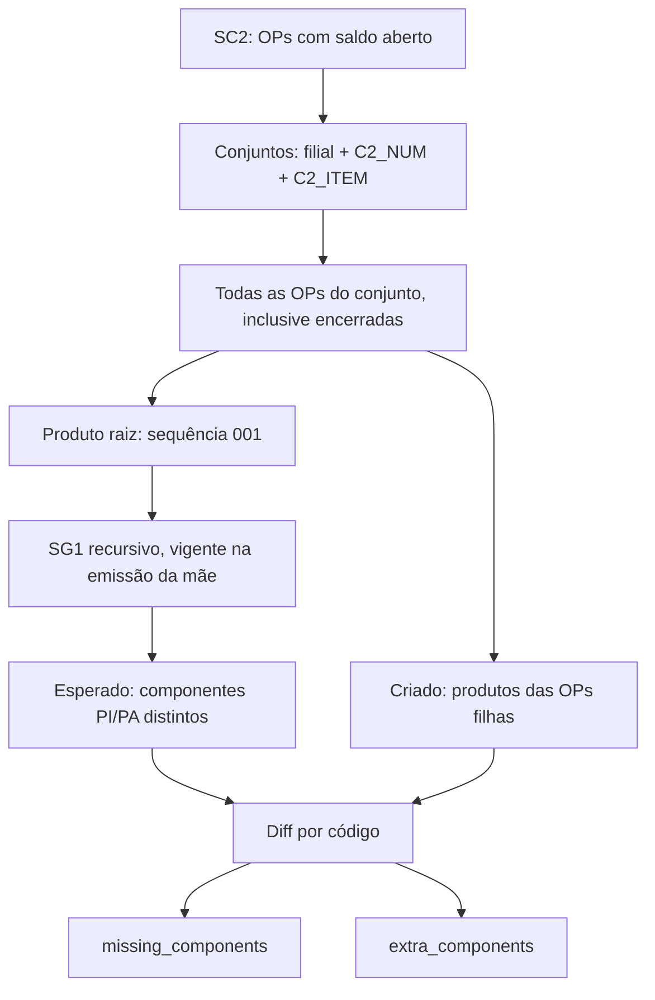

# Conjuntos de OP incompletos

`GET /production/production-order-sets/incomplete` — `operationId` `get_production_order_sets_incomplete`, entity `production_order_sets_incomplete`, shape `paged_list`.

Aponta conjuntos de ordens de produção cujas OPs filhas **não batem** com a estrutura do produto raiz. É o insumo do detector "Conjuntos incompletos" da Análise de problemas do Portal PCP.

## Por que existe

Um conjunto deve nascer completo: a OP mãe do produto raiz e uma OP filha para cada intermediário da estrutura. Quando o conjunto nasce furado, ninguém percebe até a produção travar esperando uma peça que não tem ordem. Não havia nenhuma consulta que cruzasse a estrutura (SG1) com as OPs criadas no mesmo conjunto.

## Regra de detecção



| Decisão | Valor |
|---|---|
| Chave do conjunto | `C2_FILIAL + C2_NUM + C2_ITEM` — ver [ordem-producao-chave.md](./padroes-totvs/ordem-producao-chave.md) |
| Universo | Conjuntos com ao menos uma OP em aberto (`C2_QUANT > C2_QUJE`) |
| Conferência | **Todas** as OPs do conjunto, inclusive encerradas |
| Estrutura | Explodida multinível a partir do raiz, comparação por código distinto |
| Componentes que devem ter OP | `B1_TIPO IN ('PI','PA')`, excluindo o próprio raiz; `MP` nunca entra |
| Vigência da estrutura | Lida na **emissão da OP mãe** (`C2_EMISSAO`), via `ProductBomValidityFilterService` |
| Quantidade | Não validada — só a existência do produto no conjunto |
| Conjunto sem OP mãe viva | Fora do universo (sem raiz não há estrutura esperada) |
| Severidade | **Não** é decidida aqui — a api-delpi devolve o diff bruto; a regra é do consumidor |

## Parâmetros

| Param | Valores | Efeito |
|---|---|---|
| `branch` | `all` \| `01` \| `02` | Vazio = consolidado nas filiais válidas |
| `issued_from` | `YYYY-MM-DD` | Emissão mínima da OP mãe |
| `page` / `page_size` | 1‑based / até 200 | Paginação **por conjunto** |

`issued_from` importa na prática: a filial 01 carrega centenas de conjuntos abertos desde os anos 2000 que nunca foram encerrados. Sem recorte, o universo é 2 365 conjuntos com 269 apontados, dos quais ~245 foram emitidos entre 2003 e 2013. Com `issued_from=2025-01-01` o universo cai para 491 conjuntos e 2 apontados — que são os que o PCP consegue tratar. A api-delpi **não** aplica recorte por conta própria; quem consome decide.

## Payload

```json
{
  "items": [
    {
      "branch": "01",
      "set_number": "247192",
      "set_item": "01",
      "set_key": "24719201",
      "root_code": "90263364",
      "root_description": "CABO DE LIGACAO 5.5M-3X2.5",
      "root_type": "PA",
      "root_order": "24719201001",
      "due_date": "2026-08-24",
      "issued_at": "2026-08-12",
      "order_count": 2,
      "open_order_count": 2,
      "expected_component_count": 2,
      "created_component_count": 1,
      "missing_count": 1,
      "extra_count": 0,
      "missing_components": [
        {
          "product_code": "50090002",
          "description": "SEPARADOR DE CABOS FILAMENTO PEQUENO PLA CINZA",
          "product_type": "PI",
          "bom_level": 2
        }
      ],
      "extra_components": []
    }
  ],
  "pagination": { "page": 1, "page_size": 50, "total": 2, "total_pages": 1, "is_complete": true },
  "filters": { "branch": "01", "issued_from": "2025-01-01" },
  "summary": {
    "checked_set_count": 491,
    "incomplete_set_count": 2,
    "missing_set_count": 2,
    "extra_set_count": 0,
    "branch": "01",
    "branch_filter_applied": true,
    "consolidated_across_branches": false
  }
}
```

`root_*` e não `pa_*`: o produto da sequência `001` é `PI` em 556 dos 2 876 conjuntos abertos da filial 01, então chamar de PA seria mentira.

`due_date` segue a entrega efetiva da carga máquina (`effective_due_date_sql`): a data da OP mãe na view PCP manda; sem ela, `C2_DATPRF` da própria mãe.

## Performance

A conferência é um **batch com tabelas temporárias** (`#SET_ROOT`, `#BOM`, `#DIFF`, `#PER_SET`), não uma CTE monolítica: o SQL Server expande CTE inline e reavaliava a recursão da estrutura a cada referência.

| Consulta | Tempo medido (filial 01) |
|---|---|
| Summary com filial | ~0,6 s a 0,9 s |
| Página com filial e recorte de emissão | ~0,9 s |
| Summary consolidado (01+02) | ~1,4 s |
| Página consolidada | ~1,6 s |
| ⚠ Versão anterior em CTE única | **20,4 s** |
| ⚠ Versão com `RTRIM` no join da SG1 | timeout |

Cache: namespace `production-order-sets-incomplete-v1`, TTL `QUERY_CACHE_TTL_SECONDS`.

## Código

| Camada | Arquivo |
|---|---|
| Escopo e sonda | `app/domain/production/production_order_sets_scope.py` |
| SQL | `app/infrastructure/persistence/totvs/production/production_order_sets_sql.py` |
| Repository | `.../production_order_sets_repository.py` |
| Port | `app/domain/ports/production/production_order_sets_repository_port.py` |
| DTO | `app/application/dto/production/production_order_sets_request.py` |
| Mapper | `app/domain/services/production/production_order_set_mapper.py` |
| Assembler | `app/application/services/production/production_order_sets_response_assembler.py` |
| Use case | `app/application/use_cases/production/get_production_order_sets_use_cases.py` |
| Router | `app/interface/http/routes/production/production_order_sets_router.py` |
| Testes | `tests/test_production_order_sets_sql.py`, `tests/test_production_order_sets_routes.py` |

## Consumidor

`production-control-api` → detector `incomplete-order-sets` da Análise de problemas → MFE `plugins/production-control`.

O BFF é quem aplica a regra do produto: severidade (`critical` com falta, `attention` só com sobra), recorte de emissão (`issuedFromDays`, 730 dias por padrão) e exclusões de negócio, tudo em `production_control_app/content/problem_analysis.json`. Ver [README do BFF](../../../production-control-api/README.md) § *Análise de problemas — detectores*.
