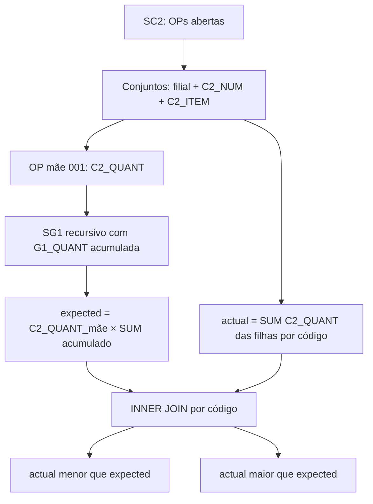

# Conjuntos de OP com quantidade de intermediário divergente

`GET /production/production-order-sets/quantity-mismatches` — `operationId` `get_production_order_sets_quantity_mismatches`, entity `production_order_sets_quantity_mismatches`, shape `paged_list`.

Aponta conjuntos cujas OPs filhas de intermediários (`PI`/`PA`) existem, mas a **quantidade** não bate com a necessidade da estrutura para a quantidade da OP mãe. É o insumo do detector "Quantidades incorretas" da Análise de problemas do Portal PCP.

Irmão de [conjuntos incompletos](./production-order-sets-incomplete.md), que valida só a **existência** do código no conjunto.

## Por que existe

Um conjunto pode nascer com todas as OPs certas e ainda assim estar errado: a OP do intermediário veio com quantidade diferente da que a estrutura exige para fabricar a quantidade da OP mãe. Sem essa conferência, a fábrica só descobre na montagem.

## Regra de detecção



| Decisão | Valor |
|---|---|
| Chave do conjunto | `C2_FILIAL + C2_NUM + C2_ITEM` — ver [ordem-producao-chave.md](./padroes-totvs/ordem-producao-chave.md) |
| Universo | Conjuntos com ao menos uma OP em aberto (`C2_QUANT > C2_QUJE` **e** `C2_DATRF` vazio) |
| Conferência | Códigos presentes na estrutura **e** com OP filha (INNER JOIN) |
| Componentes | `B1_TIPO IN ('PI','PA')`, excluindo o próprio raiz; `MP` nunca entra |
| Vigência | Emissão da OP mãe (`C2_EMISSAO`) |
| Esperado | `C2_QUANT` da mãe × soma da `G1_QUANT` acumulada na explosão multinível |
| Criado | `SUM(C2_QUANT)` das OPs filhas do mesmo `C2_PRODUTO` |
| Igualdade | Estrita em `DECIMAL(18,6)` — qualquer diferença aponta |
| Falta/sobra de existência | Fora deste detector — ver incomplete |
| Severidade | Decidida pelo consumidor (BFF) |

## Parâmetros

Iguais ao incomplete: `branch`, `issued_from`, `page`, `page_size`.

## Payload

```json
{
  "items": [
    {
      "branch": "01",
      "set_number": "247192",
      "set_item": "01",
      "set_key": "24719201",
      "root_code": "90263364",
      "root_description": "CABO DE LIGACAO 5.5M-3X2.5",
      "root_type": "PA",
      "root_order": "24719201001",
      "root_quantity": 2.0,
      "due_date": "2026-08-24",
      "issued_at": "2026-08-12",
      "order_count": 3,
      "open_order_count": 3,
      "under_count": 1,
      "over_count": 0,
      "under_components": [
        {
          "product_code": "50090002",
          "description": "SEPARADOR DE CABOS",
          "product_type": "PI",
          "bom_level": 2,
          "production_order": "24719201003",
          "expected_quantity": 4.0,
          "actual_quantity": 2.0,
          "delta_quantity": -2.0
        }
      ],
      "over_components": []
    }
  ],
  "pagination": { "page": 1, "page_size": 50, "total": 1, "total_pages": 1, "is_complete": true },
  "filters": { "branch": "01", "issued_from": "2025-01-01" },
  "summary": {
    "checked_set_count": 491,
    "mismatch_set_count": 1,
    "under_set_count": 1,
    "over_set_count": 0,
    "branch": "01",
    "branch_filter_applied": true,
    "consolidated_across_branches": false
  }
}
```

`delta_quantity` = `actual_quantity - expected_quantity`.

## Código

| Camada | Arquivo |
|---|---|
| Escopo | `app/domain/production/production_order_sets_scope.py` |
| SQL | `app/infrastructure/persistence/totvs/production/production_order_sets_sql.py` |
| Repository | `.../production_order_sets_repository.py` |
| Mapper / assembler / use case | mesmos módulos do incomplete |
| Router | `app/interface/http/routes/production/production_order_sets_router.py` |
| Testes | `tests/test_production_order_sets_sql.py`, `tests/test_production_order_sets_routes.py` |

## Consumidor

`production-control-api` → detector `order-set-quantity-mismatches` → MFE `plugins/production-control`.
