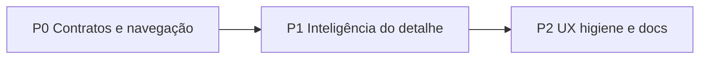

# Playbook — excelência de páginas MFE (lista + detalhe)

> **Escopo:** melhorar bancadas operacionais em plugins MFE (lista + filtros + modal/detalhe).  
> **Regra Cursor:** [`.cursor/rules/plugin-mfe-page-excellence.mdc`](../../.cursor/rules/plugin-mfe-page-excellence.mdc)  
> **Caso de referência:** Pedidos em aberto — [`plugins/commercial`](../../plugins/commercial/README.md) + [WIREFRAMES WF-02R / WF-02R-D](../12-roadmap-e-evolucao/commercial/WIREFRAMES.md) (jul–ago/2026).

Complementa: causa raiz (`root-cause-generalized-fix`), kit (`plugins-reusable-components`), docs (`plugins-documentation`), modal host (`mfe-modal-host-contained`), rebuild sequencial (`infra-sequential-container-startup`).

---

## Quando usar

Aplicar este playbook quando a tarefa for:

- Elevar qualidade de uma página **lista + detalhe** (tabela/cards + modal ou página de detalhe)
- Corrigir deep links, filtros na URL, empty states, helps, ou integração com outro MFE
- Enriquecer o detalhe com dados de API já existentes (status, KPIs, timelines)

**Não** substitui: scaffold de plugin novo (`novo-plugin-mfe-checklist`), rota REST nova (`new-api-route-checklist`), nem regras de chat/apresentação.

---

## Ordem obrigatória (P0 → P1 → P2)

Não pular P0 para “só polish”: UI bonita sobre contrato mentido ou URL frágil gera regressão.

Em esforços grandes: **teste + commit por fase**. Rebuild MFE com `./infra/scripts/up-*-sequential.sh --fase mfe --build <plugin>` (fase `remote` só se `plugin-ui` mudou).

---

### P0 — Contratos e navegação (fundação)

| Fazer | Não fazer |
|-------|-----------|
| Tipar e consumir o **payload real** da API | Inventar shape ou path “como se fosse” |
| Sync estado ↔ query (`replaceState`) para filtros e detalhe | One-shot que **apaga** params de filtro no mount |
| Deep link de detalhe (`id`/pedido/linha/filial) abre e fecha limpando só params de detalhe | Tratar identidade A como path de identidade B (ex.: pedido SC5 como OV AD1) |
| CTA cruzado (ex.: OTD → comercial) **só** se o campo existir no payload | Mostrar CTA “sempre” e 404 depois |
| Preferir enriquecer lista na API se houver vínculo TOTVS estável; senão fallback honesto (search + score) | Stub `missing: true` sem HTTP documentado como verdade |

**Critérios P0:** URL compartilhável (filtros + detalhe); contrato tipado; deep links corretos; testes parse/build URL.

---

### P1 — Inteligência do detalhe (valor operacional)

| Fazer | Não fazer |
|-------|-----------|
| Consumir campos reais (`indicators`, agregados, flags de empty) | Heurística frágil “documentada” como contrato |
| Strip/KPI de restrição (status + constraint) no detalhe | Reimplementar ficha completa de outro dashboard no modal |
| Prefetch limitado + fetch on-demand + badge se truncar | Carregar N ilimitado sem cancelamento |
| Empty / erro / loading **visíveis** por seção | `return null` silencioso |
| Lista/tabela densa com limite visual + link “ver completo” | Sort server / ficha irmã embutida sem pedido |

**Critérios P1:** detalhe muda com filial/contexto; payload agregado coerente na UI; empty/erro comunicados.

---

### P2 — UX, higiene e docs

| Fazer | Não fazer |
|-------|-----------|
| Skeleton por seção **sem** bloquear snapshot/KPIs locais | Bloquear o modal inteiro enquanto extras carregam |
| Remover dead code (drawers/modais sem import) + CSS morto | Deixar `@deprecated` “por enquanto” |
| Empty de escopo (carteira vazia) + freshness leve (hora local pós-reload) | Inventar `as_of` na API só para o chip |
| Helps com `SectionHintLabel` / hover no rótulo; PT de negócio em `helpTooltips.ts` | Ícone «?» solto; paths/`indicators.*`/códigos de API no help |
| Atualizar README do plugin (+ wireframe) | Entregar só código |

**Critérios P2:** helps limpos; dead code zero; docs alinhados; `tsc` + testes da fase.

---

## Princípios transversais

1. **Contrato API manda** — MFE tipa e consome; não “corrige” inventando caminho.
2. **Modal = resumo acionável** — drill-down completo via deep link para a ficha canônica.
3. **URL CRM-style** — filtros e detalhe na query; F5/compartilhar preservam contexto.
4. **Kit-first** — `@delpi/plugin-ui`; CSS do MFE só layout de página (`cm-*` / prefixo).
5. **Helps para humanos** — zero vazamento técnico de API no tooltip.
6. **Causa raiz** — ver `root-cause-generalized-fix.mdc` antes de patch pontual.
7. **Docs obrigatórios** — `plugins-documentation.mdc` quando UX/contrato mudou.

---

## Escopo do agente

### Deve

- Seguir P0 → P1 → P2 e declarar o que está na fase atual
- Localizar módulo canônico (helpers de deep link, content JSON, serviços API) antes de espalhar `if`
- Escrever testes unitários dos utilitários (parse/build URL, score/match, etc.)
- Orientar rebuild sequencial e atualizar README/wireframe no fechamento

### Não deve

- Mentir contrato ou path
- Apagar query de atenção/filtro no mount
- Duplicar outro MFE dentro do modal
- Hardcode PT longo / nomes de API nos helps
- Alterar Module Federation / `plugin-ui` sem necessidade explícita
- Inventar campos na API “para a UI ficar completa”
- Commit/push sem pedido explícito do usuário

---

## Checklist de pronto (merge)

- [ ] URL de filtros e de detalhe compartilháveis
- [ ] Detalhe coerente com payload real (incl. filial/contexto)
- [ ] Empty / loading / erro comunicados
- [ ] Helps sem vazamento técnico
- [ ] Dead code / CSS morto removidos
- [ ] Testes do escopo + `tsc` do(s) plugin(s)
- [ ] README (e wireframe, se houver) atualizados

---

## Mapa do caso de referência (Pedidos em aberto)

| Tema | Onde |
|------|------|
| Deep links | `plugins/commercial/src/utils/openOrdersDeepLink.ts` |
| OV (search, não path pedido) | `plugins/commercial/src/utils/resolveProposalForOpenOrder.ts` |
| Extras do modal | `plugins/commercial/src/hooks/useOpenOrdersLineDetailExtras.ts` |
| Helps | `plugins/commercial/src/content/helpTooltips.ts` |
| CTA OTD → comercial | `plugins/dashboard-production/src/utils/commercialOpenOrderLink.ts` |
| UX canônica | `docs/12-roadmap-e-evolucao/commercial/WIREFRAMES.md` § WF-02R / WF-02R-D |
| README plugin | `plugins/commercial/README.md` § Pedidos em aberto |
