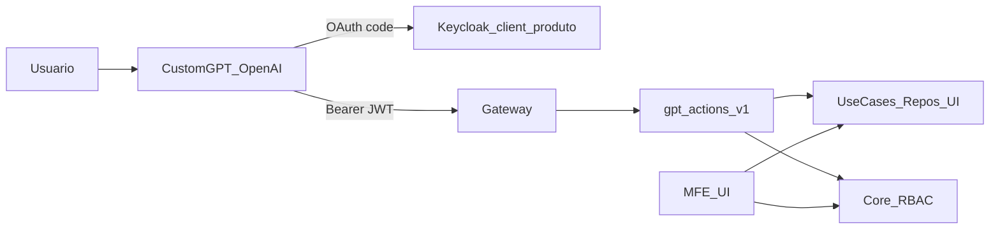

# Padrão — Custom GPT Actions (OpenAI) com OAuth Keycloak

> **Status:** documentação oficial — setembro/2026  
> **Escopo:** como expor um produto da Minha DELPI a um **Custom GPT** da OpenAI (Actions), com a mesma identidade e RBAC da UI  
> **Não confundir com:** Chat interno Minha DELPI (`minha-delpi-ai-api` + Action Catalog OpenAPI)

---

## 1. Objetivo

Registrar o padrão já comprovado no **Transformômetro**, de forma **generalista**, para que outros produtos (Quality Action Plans, cadastros, dashboards operacionais, etc.) possam repetir o mesmo desenho sem reinventar auth, contrato ou ownership.

Resultado desejado:

```text
Usuário no ChatGPT
  → OAuth Authorization Code no Keycloak (client confidencial do produto)
  → Bearer JWT (aud = delpi-central, email, iss público)
  → Gateway → API dona do domínio
  → Facade compacta (≤ ~30 operations)
  → Use cases / repositórios já usados pela UI
  → Mesmo RBAC Core da tela
```

---

## 2. Duas superfícies distintas (não misturar)

| Superfície | Consumidor | Auth | Write | Fonte de contrato |
|---|---|---|---|---|
| **Chat Minha DELPI** | Agente interno | JWT sessão portal / provider binding | Em geral `allowWrite: false` até decisão explícita | OpenAPI do produto + Action Catalog |
| **Custom GPT OpenAI** | GPT externo (chatgpt.com) | OAuth Keycloak **por produto** | Sim, se RBAC permitir | Facade `…/gpt-actions/v1/openapi.json` |

Regras:

- Ligar write no Chat Minha DELPI **não** é consequência de existir Custom GPT.
- Custom GPT **não** usa API Key para write; usuário Keycloak + Core RBAC.
- E-mail da conta OpenAI **não precisa** ser o mesmo do login Minha DELPI. A autoridade é o JWT Keycloak.

---

## 3. Arquitetura canônica



Princípios (alinham às 8 responsabilidades):

1. **Arquitetura:** facade no bounded context dono; não copiar regra para o GPT.
2. **Segurança:** backend decide AuthZ; cliente GPT nunca é autoridade.
3. **Contratos:** uma OpenAPI pública só para import; paths/operationIds em inglês.
4. **Dados:** mesma persistência/owner da UI.
5. **Qualidade:** positive + sibling + negative (401/403/capability).
6. **Delivery:** deploy da API no host **público** HTTPS (ChatGPT não alcança `localhost`).
7. **Confiabilidade:** timeouts/CORS (`chatgpt.com`, `chat.openai.com`) já no gateway/API.

---

## 4. Quando usar este padrão

Usar quando:

- o especialista precisa **consultar e/ou gravar** no mesmo produto da UI;
- o volume de rotas CRUD é grande (dezenas/centenas) e o Custom GPT limita ~**30 operations**;
- a empresa quer expertise em linguagem natural **fora** do portal, sem abrir API Key.

Não usar quando:

- basta o Chat Minha DELPI read-only;
- o fluxo exige upload binário, assinatura manuscrita, locks ou magic-link (manter na UI / superfície dedicada);
- não há host HTTPS público estável.

---

## 5. Naming e ownership

| Artefato | Convenção |
|---|---|
| Client Keycloak | `chatgpt-{product}` (ex.: `chatgpt-transformometro`, `chatgpt-quality-action-plans`) |
| Prefixo HTTP | `/apps/{api}/…/gpt-actions/v1/` |
| `operationId` | `gpt_*` em snake_case inglês |
| Paths | kebab-case inglês |
| Secret do client | **somente** GPT Editor / cofre — **nunca** Git |
| OpenAPI versionado | `docs/gpt-actions/openapi-gpt-actions.json` (ou equivalente) no repo da API dona |

Produto de referência: `transformometro-api` (`chatgpt-transformometro`).

---

## 6. Facade compacta (obrigatória se > ~30 rotas)

Não expor o CRUD inteiro. Criar uma fachada que:

1. Lista um **catálogo** (enums, unidades, escopo do usuário).
2. Expõe **análise** read-only (KPIs / listagens agregadas).
3. Expõe **records** genéricos (`entity` enum) para search/get/create/update/delete quando couber.
4. Expõe **workflows** pontuais (activate, recalculate, send/cancel) sem virar 1:1 com cada rota UI.
5. Despacha para **os mesmos** application services / repositories da UI (sem segunda fonte de verdade).

Checklist de design da facade:

- [ ] ≤ 30 `operationId`s no schema **importado**
- [ ] Bodies de write no formato canônico do produto (ex.: `{ "data": { … } }`)
- [ ] Capabilities por entity (ex.: measurement sem delete) → 400 claro, não 500
- [ ] Gate de view (`*.view` ou equivalente) em catalog/analysis → 403
- [ ] Manage por filial/tenant nos writes → 403
- [ ] OpenAPI público **sem token** só no schema de import

---

## 7. Contrato OpenAPI — restrições do GPT Builder (OpenAI)

O importador da OpenAI é mais rígido que um cliente OpenAPI comum. Validado em produção:

| Restrição | Exigência |
|---|---|
| `servers[].url` | **Absoluta** (`https://host/apps/…`), nunca relativa |
| Campo `openapi` | **`3.1.0` ou `3.1.1`** (rejeita `3.0.3`) |
| Description de parâmetro | ≤ **700** caracteres |
| Description de operation | ≤ **300** caracteres |
| Path `…/openapi.json` **dentro** do schema | **Não incluir** como Action — o Builder interpreta como documento OpenAPI 3.1 e falha |
| Endpoint HTTP `GET …/openapi.json` | Mantém-se público para **Importar de URL**; só não entra em `paths` do documento |

Builder de referência: `transformometro-api/tm_app/application/gpt_actions/openapi_builder.py`.

CORS: permitir `https://chatgpt.com` e `https://chat.openai.com` na API/gateway.

---

## 8. Keycloak — client OAuth por produto

Um client **confidential** por especialista (não reutilizar o client público do Portal).

| Campo | Valor |
|---|---|
| Client authentication | **On** |
| Standard flow | **On** |
| Direct access grants | **Off** (produção) |
| Audience | scope Default `audience-delpi` → `aud` inclui `delpi-central` |
| Default scopes | `openid` (via basic), `email`, `profile`, `audience-delpi` |
| Web origins | `https://chatgpt.com`, `https://chat.openai.com` |
| Valid redirect URIs | ver abaixo |

Redirects (após existir o GPT ID `g-…`):

```text
https://chatgpt.com/aip/g-{GPT_ID}/oauth/callback
https://chat.openai.com/aip/g-{GPT_ID}/oauth/callback
```

Até fechar o ID, wildcards (`https://chatgpt.com/*`) são aceitáveis em ambiente controlado.

Guia Keycloak (exemplo Transformômetro): [configurar-keycloak.md §10b](../10-guias-operacionais/configurar-keycloak.md).

Prova rápida (sem secret):

```bash
# Client existe + redirect aceito → tela de login Minha DELPI (HTTP 200)
curl -sS -o /dev/null -w '%{http_code}\n' -G \
  'https://minhadelpi.com.br/auth/realms/delpi/protocol/openid-connect/auth' \
  --data-urlencode 'client_id=chatgpt-{product}' \
  --data-urlencode 'redirect_uri=https://chatgpt.com/aip/g-XXXX/oauth/callback' \
  --data-urlencode 'response_type=code' \
  --data-urlencode 'scope=openid email profile'
```

Client inexistente → tipicamente HTTP 400.

---

## 9. GPT Builder — checklist operacional

1. Deploy da API no host público; validar:

```bash
curl -sS 'https://{host}/apps/{api}/…/gpt-actions/v1/openapi.json' | python3 -c \
  "import sys,json; d=json.load(sys.stdin); print(d['openapi'], d['servers'], len(d['paths']))"
```

Esperado: `openapi` 3.1.x, `servers[0].url` começando com `https://`, sem path `…/openapi.json` em `paths`.

2. Create GPT → Actions → **Importar de URL** (não colar schema antigo).
3. Autenticação → **OAuth** (nunca API Key para write):

| Campo GPT | Valor |
|---|---|
| Client ID | `chatgpt-{product}` |
| Client secret | Keycloak → Credentials (produção) |
| Authorization URL | `https://{host}/auth/realms/{realm}/protocol/openid-connect/auth` |
| Token URL | `https://{host}/auth/realms/{realm}/protocol/openid-connect/token` |
| Scope | `openid email profile` |
| Método de troca de token | Preferir **Cabeçalho de autorização básica** (Keycloak confidential) |

4. Instructions: catálogo antes de write; não inventar IDs; confirmar destrutivos; limites (uploads/assinatura ficam na UI).
5. Salvar → **Atualizar** se houver “Atualizações pendentes”.
6. Fechar redirects no Keycloak com o `g-…` real.
7. Preview: **Iniciar sessão com {host}** → login Minha DELPI → testar action (ex. catalog).

Identidade: conta ChatGPT ≠ conta DELPI. RBAC = usuário Keycloak.

---

## 10. Implementação no monorepo (checklist para outro chat/agente)

### 10.1 API dona

- [ ] Bounded context correto (não cruzar domain entre apps).
- [ ] Pacote `application/gpt_actions/` (entities, openapi_builder, dispatch_service).
- [ ] Rotas `interface/http/routes/gpt_actions_routes.py` — finas.
- [ ] Middleware: path público exato do `openapi.json`; CORS ChatGPT.
- [ ] Path alias EN→PT **não** pode reescrever `/gpt-actions/…` (skip prefix).
- [ ] Reutilizar use cases/commands já usados pelo CRUD da UI (dedupe no application).
- [ ] `servers.url` absoluto via `PUBLIC_BASE_URL` + `TM_API_ROOT_PATH` (ou equivalente).
- [ ] Identifiers técnicos em inglês (`english-code-identifiers.mdc`).

### 10.2 Testes

- [ ] OpenAPI: ≤30 ops; ids estáveis; servers absolutos; versão 3.1.x; limites 700/300.
- [ ] Positivo: create/get/analyze.
- [ ] Sibling: outra entity da mesma família.
- [ ] Negativo: sem Bearer → 401; sem view → 403; capability inexistente → 400.
- [ ] Anchor de coverage do `operationId` HTTP de import (`gpt_get_openapi_schema`) mesmo fora do schema importado.

### 10.3 Docs / ops

- [ ] Doc do produto (`docs/chatgpt-*-actions.md`) apontando para **este** padrão.
- [ ] § Keycloak no guia operacional (client id + redirects).
- [ ] Evidência curta em OPERATIONS/runbook do produto (data, host, pass/fail).
- [ ] Ajuda in-app se a feature for user-facing no portal (`feature-help-sync`).

### 10.4 Deploy

```bash
# No srv-api / produção — só a API afetada
cd ~/projetos/delpi-central
git pull --ff-only origin main
./infra/scripts/up-prod-sequential.sh --fase api --build {api-service}
```

Nunca editar código “só no container” de produção: alterar local → GitHub → pull/rebuild.

### 10.5 O que **não** fazer

- API Key com poderes de write.
- Segunda matriz RBAC no MFE/GPT.
- Duplicar DTO divergente da UI.
- Importar `localhost` no GPT Builder em produção.
- Incluir `GET …/openapi.json` como Action no schema importado.
- Ligar `allowWrite` no Chat Minha DELPI “de brinde”.
- Commitar client secret.

---

## 11. Troubleshooting (sintomas reais)

| Sintoma | Causa típica | Correção |
|---|---|---|
| «URL válida em `servers`» | `servers.url` relativo | Absolute `https://…/apps/…` |
| `Input should be '3.1.1' or '3.1.0'` | `openapi: 3.0.3` | Bump para `3.1.1` |
| Description length > 700/300 | Texto longo no enum/entity | Enxugar descriptions |
| Schema nested `openapi` 3.1 | Path `…/openapi.json` no documento | Remover do schema importado |
| `Error in OAuth response (HTTP 401)` | Token exchange / secret / método | Basic header + secret de **prod** + Atualizar GPT |
| `Invalid redirect URI` | Redirect não cadastrado | Callbacks `chatgpt.com` / `chat.openai.com` com `g-…` |
| 401 na Action após login | `aud` / `iss` / JWKS | Scope `audience-delpi`; `KEYCLOAK_ISSUER` público |
| 403 | Sem permissão do produto | Atribuir `*.view` / manage no Core |
| 404 em path EN (`/catalog`) | Path alias reescreveu para PT | Skip `/…/gpt-actions` no middleware |

---

## 12. Referência implementada — Transformômetro

| Item | Local |
|---|---|
| Facade + builder + dispatch | `transformometro-api/tm_app/application/gpt_actions/` |
| Guia + pacote guiado | `registration_guide.py`, `improvement_package_service.py` |
| Rotas | `transformometro-api/tm_app/interface/http/routes/gpt_actions_routes.py` |
| OpenAPI versionado | `transformometro-api/docs/gpt-actions/openapi-gpt-actions.json` (**13** ops) |
| Instructions do especialista (**TÉO**) | [`specialist-instructions.md`](../../transformometro-api/docs/gpt-actions/specialist-instructions.md) — Name no Builder: `TÉO — Especialista em Transformação Digital` |
| Doc produto | [`custom-gpt-actions.md`](../../transformometro-api/docs/gpt-actions/custom-gpt-actions.md) |
| Checklist GPT Builder | [`gpt-builder-go-live.md`](../../transformometro-api/docs/gpt-actions/gpt-builder-go-live.md) |
| Keycloak §10b | [`configurar-keycloak.md`](../10-guias-operacionais/configurar-keycloak.md) |
| Evidência ops | [`OPERATIONS.md`](../12-roadmap-e-evolucao/transformometro-app/OPERATIONS.md) |
| Client Keycloak | `chatgpt-transformometro` |
| Host prod | `https://minhadelpi.com.br` |

Padrão Transformômetro para especialistas guiados: catalog com `registration_guide` + operation composta `gpt_commit_improvement_package` (`dry_run` → commit). Replicar a mesma ideia (guia no catalog + pacote de domínio) em outros produtos quando o cadastro for multi-etapa.

Chat Minha DELPI do Transformômetro permanece read-only (`openapi-snapshot-chat.json`, `allowWrite: false`).

---

## 13. Candidatos a replicação (orientação)

Ao planejar o próximo especialista, repetir este documento na ordem: **contrato facade → Keycloak client → deploy público → GPT Builder → smoke 401/403**.

Exemplos de domínio (não prescritivos):

| Produto | API tipicamente dona | Observação |
|---|---|---|
| Quality Action Plans | `api-delpi` / superfície PAC | Separar write GPT vs Chat interno |
| Suprimentos / solicitações | APIs do plugin | Escopo filial forte |
| Indicadores / SI | `strategic-indicators-api` | Preferir read-only no GPT se write for admin |
| Production Pulse | `production-pulse-api` | Cuidado com comandos de device |

Antes de codificar: confirmar owner, RBAC existente, e se a facade cabe em ≤30 operations sem perder a semântica do cadastro.

---

## 14. Relação com regras Cursor

| Tema | Regra / doc |
|---|---|
| Boundaries / ownership | `platform-architecture-boundaries.mdc` |
| JWT / RBAC | `platform-security-identity-authorization.mdc` |
| OpenAPI / integração | `platform-api-contracts-integration.mdc` |
| Identifiers EN | `english-code-identifiers.mdc` |
| Chat interno (outro padrão) | `openapi-first-universal-tool-routing.mdc`, `new-api-route-checklist.mdc` |
| Deploy sequencial | `infra-sequential-container-startup.mdc` |

Este padrão **não** substitui o checklist de Actions do Chat Minha DELPI; é um canal paralelo com OAuth usuário e facade própria.
