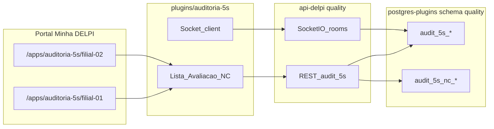
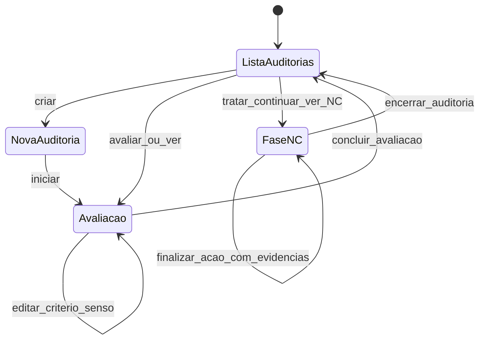
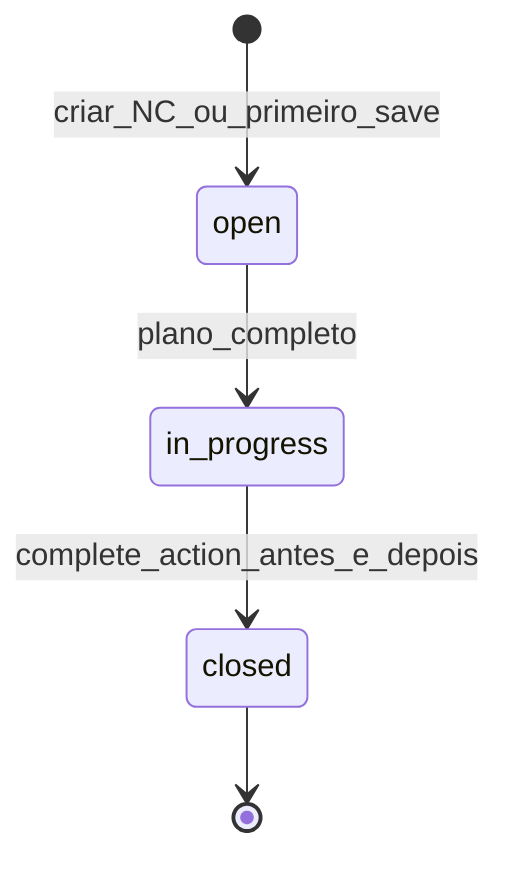

# Roadmap — Plugin Auditoria 5S

> **Arquivo:** `docs/12-roadmap-e-evolucao/auditoria-5s/ROADMAP.md`  
> **Status:** Fases 1–5 implementadas; **Fase 6 MVP implementada** (dashboard gerencial no plugin — validação manual pendente)  
> **Produto:** Minha DELPI  
> **Escopo:** plano de entrega do plugin `auditoria-5s` + rotas em `api-delpi` + persistência em `postgres-plugins`  
> **Branch de trabalho:** `plugin-5s`

---

## Status atual (dev — 2026-05-28)

| Fase | Situação | Observação |
|------|----------|------------|
| **0** | Documentação OK | Falta `ESPECIFICACAO-PLUGIN.md` e walkthrough formal com qualidade |
| **1** | **Concluída** | Script `check-auditoria-5s.sh` — smoke MFE + migrations + 48 critérios |
| **2** | **Validada em dev** | Script `check-audit-5s-api.sh` — área, auditoria, 48 notas, bloqueio 422, `evaluation_complete` 100% |
| **3** | **Piloto UI — quase completa** | Fluxo avaliação validado manualmente; UX refinada (hero, sensos, notas, % por senso); **foto critério adiada**; polling pendente |
| **4** | **Implementada** | Socket.IO api-delpi + hook `useAudit5sRealtime`; validar com 2 usuários |
| **5** | **Implementada** | Tela NC dedicada; plano com auto-save; workflow 3 etapas; fotos antes/depois; finalização explícita com evidências |
| **6** | **MVP implementado** | Dashboard gerencial no plugin; API `GET /analytics/dashboard`; gráficos Recharts |
| **7** | Pendente | RBAC produção, OpenAPI |

### Resumo do que já funciona (piloto dev)

| Área | Entregue | Validação |
|------|----------|-----------|
| Lista de auditorias | Código, status pt-BR, badges, ações Avaliar / Tratar NC | Manual ✅ |
| Nova auditoria | Data, área (select + cadastro inline), responsável, turno | Manual ✅ |
| Avaliação 48 critérios | Por senso, notas Ruim/Médio/Bom/N/A, observação, conclusão | Manual ✅ |
| Scores em tempo real | % por senso (cards) + % geral + barra de progresso | Manual ✅ |
| NC | Tela dedicada; plano (causa, ação, prioridade); auto-save; workflow 3 etapas | Manual ✅ |
| Evidências NC (antes/depois) | Upload JPG/PNG/WEBP; finalização só com as duas fotos | Implementado — validar |
| Encerramento auditoria | Exige todas NCs com status `closed` | Implementado — validar |
| Colaboração realtime | Socket.IO na avaliação e eventos de NC | Pendente validação 2 usuários |
| Foto por critério (avaliação) | Upload JPG/PNG/WEBP na nota 1/3; reuso como evidência `before` da NC | Implementado — validar |
| Dashboard gerencial | Botão na lista; filtros; KPIs; 4 gráficos; tabela paginada (PG) | Implementado — validar |
| RBAC filial (não-superadmin) | Manifesto OK | Pendente Keycloak |

### Homologação automatizada (scripts)

Validação técnica executada via scripts bash em dev (branch `plugin-5s`):

| Script | Fase | O que valida |
|--------|------|--------------|
| `scripts/homologacao/check-auditoria-5s.sh` | 1 | `remoteEntry.js` 200; catálogo 48 critérios via API |
| `scripts/homologacao/check-audit-5s-api.sh` | 2 | CRUD área/auditoria; 48 respostas; bloqueio 422 sem notas; `complete-evaluation` → 100% |
| `scripts/homologacao/check-audit-5s-dashboard.sh` | 6 | Contrato analytics dashboard (summary + charts + items) |
| `scripts/ci/build-auditoria-5s.sh` | 1 | Build de produção do MFE |

**Como rodar (WSL):**

```bash
# Fase 1 — smoke plugin + catálogo
export TOKEN="<jwt>"
bash ./scripts/homologacao/check-auditoria-5s.sh

# Fase 2 — API operacional ponta a ponta
bash ./scripts/homologacao/check-audit-5s-api.sh
```

Fases 3 e 5 (UI) complementam os scripts com **validação manual no Portal** (fluxos de avaliação e NC). Ainda não há script E2E de browser.

**Validado em dev (Fase 1 — script):**

- `GET /apps/auditoria-5s/assets/remoteEntry.js` → 200
- Migrations `V022`, `V023` aplicadas (`run_plugins_migrations.py up --plugin quality`)
- `GET /apps/api-delpi/quality/audit-5s/criteria` → 48 critérios (JWT)
- Manifesto registrado; menu Filial 01/02 visível (superadmin)
- Build plugin: `./scripts/ci/build-auditoria-5s.sh`

**Correções operacionais registradas:**

- Gateway: reiniciar após recriar `core-api` / `api-delpi` (`docker restart delpi-gateway`); health deve retornar `Api rodando!`, não `online`
- `api-delpi`: serialização JSON de UUID em `success_response` (`jsonable_encoder`)
- Criar auditoria 422: UI não envia `auditors: []`; router adiciona usuário logado
- Erros API na UI: `formatApiError` em `httpClient.ts` (evita `[object Object]`)
- `postgres-plugins`: imagem `linux/amd64` se `exec format error` no WSL
- Migrations **V024** / **V025**: aplicar via `docker exec delpi-api-delpi python scripts/run_plugins_migrations.py up --plugin quality` (não interromper com Ctrl+C)
- `docker compose`: sempre a partir de `infra/` — o arquivo `docker-compose.dev.yml` **não** existe em `plugins/auditoria-5s/`
- Pool PG plugins: `rollback` em `fetch_one` / `fetch_all` após erro SQL (evita 500 em cascata)
- Upload NC: dependência `python-multipart` na `api-delpi`; storage em `AUDIT_5S_NC_UPLOAD_DIR` (padrão `/app/data/audit-5s-nc`)

---

## 1. Objetivo

Disponibilizar no Portal uma **aplicação operacional de auditoria 5S** para a equipe de qualidade, permitindo:

- realizar **auditorias em grupo** nas filiais **01** e **02**, com acesso separado por rota;
- avaliar os **5 sensos** (Utilização, Ordenação, Limpeza, Padronização, Disciplina) critério a critério;
- calcular **percentuais por senso** e **nota geral** com escala **1 / 3 / 5 / NA**;
- registrar **observações e fotos** por critério;
- concluir a avaliação e, em seguida, abrir a **fase de Não Conformidades (NC)** para critérios abaixo da nota máxima;
- acompanhar **NCs com responsável, prazo, evidência e histórico de ações**;
- evoluir depois para **dashboards analíticos** com os dados coletados.

**Fonte de dados (MVP):** persistência própria no schema `quality` do banco `postgres-plugins`. O endpoint analítico legado via Google Sheets (`GET /quality/audit-5s/summary`) permanece até a Fase 6.

---

## 2. Requisitos de negócio (mapeamento)

Requisitos levantados com a equipe de qualidade:

| Tema | Requisito | Tratamento no produto |
|------|-----------|------------------------|
| **Filial** | Filiais 01 e 02 com acesso distinto | Duas rotas no Portal; RBAC por filial; API sempre filtra por `branch_code` |
| **Colaboração** | Vários auditores editando a mesma auditoria simultaneamente | Sala Socket.IO por `audit_id` na `api-delpi` |
| **Sensos** | 5 sensos fixos na ordem 1→5 | Catálogo `audit_5s_sensos` |
| **Notas** | 1 Ruim, 3 Médio, 5 Bom, NA não impacta cálculo | Enum `score`; NA excluído do numerador e denominador |
| **Cálculo por senso** | Soma das notas ÷ (qtd critérios aplicáveis × 5) × 100 | Ex.: 5 critérios → max 25 pts; soma 5 → **20%** |
| **Nota geral** | Média dos percentuais dos 5 sensos | Sensos sem critério aplicável ficam fora da média |
| **Critério** | Observação opcional + foto | `audit_5s_responses` + `audit_5s_response_attachments` |
| **Turno** | 1º, 2º, 3º, administrativo | Enum fixo no cabeçalho — ver [REGRAS-NEGOCIO.md](./REGRAS-NEGOCIO.md) |
| **Área auditada** | Cadastro conforme necessidade | Tabela `audit_5s_areas` por filial; seleção na auditoria |
| **Validação avaliação** | Todos os critérios devem ter nota | 48/48 com 1, 3, 5 ou NA antes de `evaluation_complete` |
| **Cabeçalho** | Data, área (cadastrada), auditores, responsável, turno, código serial | `audit_5s_audits` + `audit_5s_auditors` + FK `area_id` |
| **Código serial** | Gerado automaticamente, sequencial por filial | Formato **`01-000123`** / **`02-000045`** |
| **Fluxo** | (1) Avaliação completa → (2) NC | Status: `draft` → `evaluation_complete` → `nc_in_progress` → `closed` |
| **NC** | Critérios com nota &lt; 5; plano (causa, ação, responsável, prazo); evidências **antes/depois**; finalização explícita | Tabelas `audit_5s_nonconformities` + `audit_5s_nc_attachments` + eventos |
| **Dashboards** | Após coleta de dados | Fase 6 (fora do MVP operacional) |
| **Catálogo** | 48 critérios (8+10+10+10+10) — versão 1 | [CRITERIOS-CATALOGO.md](./CRITERIOS-CATALOGO.md); `catalog_version=1` na criação da auditoria |

### 2.1 Sensos e critérios

| Ordem | Nome | Critérios | Pontuação máx. (todos aplicáveis) |
|-------|------|-----------|-----------------------------------|
| 1 | Utilização | 8 | 40 pts |
| 2 | Ordenação | 10 | 50 pts |
| 3 | Limpeza | 10 | 50 pts |
| 4 | Padronização | 10 | 50 pts |
| 5 | Disciplina | 10 | 50 pts |
| **Total** | | **48** | **240 pts** |

Catálogo completo (versão 1): [CRITERIOS-CATALOGO.md](./CRITERIOS-CATALOGO.md).

### 2.2 Escala de notas

| Valor | Rótulo | Significado | Impacto no cálculo |
|-------|--------|-------------|-------------------|
| **1** | Ruim | Não atende ao requisito | Entra no numerador; elegível para NC |
| **3** | Médio | Atende parcialmente; há oportunidade de melhoria | Entra no numerador; elegível para NC |
| **5** | Bom | Atende ao requisito de forma adequada | Entra no numerador; **não** gera NC |
| **NA** | Não se aplica | Não impacta o percentual | Excluído do numerador e denominador |

### 2.3 Fórmulas (backend como fonte da verdade)

```text
percentual_senso = (Σ notas aplicáveis) / (qtd_criterios_aplicaveis × 5) × 100

percentual_geral = média(percentual_senso_1 … percentual_senso_5)
                   // apenas sensos com ao menos 1 critério aplicável (não-NA)

critério_elegível_NC = score IN (1, 3)
```

**Exemplo:** 5 critérios no senso Utilização, todos aplicáveis, soma das notas = 5 → percentual = 5/25 × 100 = **20%**.

---

## 3. Decisões de arquitetura

| Decisão | Escolha | Motivo |
|---------|---------|--------|
| Tipo de plugin | `microfrontend` + `renderMode: federated` | Padrão plugins operacionais no monorepo |
| API dedicada (`*-api`) | **Não** | Domínio qualidade já pertence à **api-delpi** |
| Backend de dados | Rotas em `api-delpi` módulo **Qualidade** | Mesmo router de `audit-5s/summary` (legado) |
| Persistência | **Sim** — `postgres-plugins`, schema `quality` | CRUD, NC, fotos, histórico, colaboração |
| Rotas Portal | `/apps/auditoria-5s/filial-01` e `/apps/auditoria-5s/filial-02` | Direcionamento por filial conforme solicitado |
| Código serial | Sequencial **por filial** (`01-000123`) | Decisão de negócio (Fase 0) |
| Modelo de NC | **NC dedicada 5S** (não reutilizar `internal_nc` no MVP) | Fluxo específico a partir de critérios avaliados |
| Colaboração realtime | **Socket.IO** na `api-delpi` | Gateway já expõe `/apps/api-delpi/socket.io/` |
| Conflitos de edição | Coluna `version` + `updated_at` em respostas | Broadcast após commit; aviso na UI se versão divergir |
| Fotos | Upload multipart; storage igual `internal_nc_attachments` | Reaproveitar infra de anexos do schema `quality` |
| Referência de UI | `plugins/eficiencia-fabril` | MFE federado, JWT, manifesto, CI |
| Referência de backend | Módulo NC interna + `document_sequences` | Padrões de migrations, anexos e sequencial |

### 3.1 Fluxo técnico

```text
Portal → MFE auditoria-5s (filial-01 | filial-02)
  → REST /apps/api-delpi/quality/audit-5s/*
  → Socket.IO room audit:{uuid}  (colaboração)
  → postgres-plugins (schema quality, tabelas audit_5s_*)
```



### 3.2 Fluxo operacional (UX)

Avaliação e NC são **telas distintas**. A lista é o hub: após concluir a avaliação, o usuário retorna à lista e acessa **Tratar NC**.



**Views do MFE (`Audit5sPage`):**

| View | Conteúdo |
|------|----------|
| `list` | Tabela de auditorias; botões **Avaliar** / **Ver avaliação** e **Tratar NC** |
| `new` | Formulário nova auditoria |
| `audit` | Hero + cards % por senso + critérios (sem NC) |
| `nc` | Hero + KPIs + `AuditNcPanel` (plano, evidências, finalização) |

### 3.3 Fluxo de tratamento de NC (3 etapas)

Salvar o plano **não** finaliza a NC. O status `closed` só é atingido via **Finalizar ação com evidências**.

| Etapa | Status NC | Rótulo UI | Condição |
|-------|-----------|-----------|----------|
| 1 | `open` | Plano em registro | Campos parciais; auto-save ao sair de cada campo |
| 2 | `in_progress` | Aguardando evidências | Plano completo (descrição, causa, ação corretiva, responsável, prazo) — promoção automática |
| 3 | `closed` | Ação finalizada | Plano completo + foto **antes** + foto **depois** + botão **Finalizar ação com evidências** |

**Encerramento da auditoria:** `POST /audits/{id}/close` exige **todas** as NCs candidatas registradas e com `status=closed`.



**Progresso na UI:** KPIs e barra contam NCs **finalizadas** (`closed`), não apenas campos preenchidos.

## 4. Modelo de dados (visão)

Tabelas previstas em `api-delpi/migrations/plugins/quality/`:

| Tabela | Propósito |
|--------|-----------|
| `audit_5s_areas` | Cadastro de áreas auditadas por filial (`name`, `active`) |
| `audit_5s_sensos` | Catálogo dos 5 sensos |
| `audit_5s_criteria` | Critérios por senso (`code`, `description`, `sort_order`, `active`, `catalog_version`) |
| `audit_5s_audits` | Cabeçalho, status, scores calculados, `branch_code`, `audit_code` |
| `audit_5s_auditors` | Auditores vinculados à auditoria |
| `audit_5s_responses` | Nota, observação, `version`, `updated_by` |
| `audit_5s_response_attachments` | Foto por critério |
| `audit_5s_nonconformities` | NC ligada a `response_id`; descrição, causa, ação corretiva, responsável, prazo, prioridade, status |
| `audit_5s_nc_attachments` | Evidência foto **antes** / **depois** (1 slot por tipo por NC) |
| `audit_5s_nc_actions` | Ações do plano de tratamento |
| `audit_5s_nc_events` | Histórico imutável (auditoria de alterações) |

**Migrations adicionais (Fase 5):**

| Migration | Conteúdo |
|-----------|----------|
| `V024__audit_5s_nc_extra_fields.sql` | Colunas `root_cause`, `corrective_action`, `priority` em `audit_5s_nonconformities` |
| `V025__create_audit_5s_nc_attachments.sql` | Tabela `audit_5s_nc_attachments` + índice + unique `(nonconformity_id, attachment_type)` |

**Sequencial:** chaves `audit_5s_branch_01` e `audit_5s_branch_02` em `quality.document_sequences` (padrão existente em `V002__create_quality_document_sequences.sql`).

**Versionamento de catálogo:** ao criar auditoria, gravar `catalog_version` para preservar critérios históricos mesmo se o catálogo evoluir.

---

## 5. API REST (contratos alvo)

Base: `/apps/api-delpi/quality/audit-5s`

| Método | Rota | Uso |
|--------|------|-----|
| GET | `/areas?branch=01&active=true` | Áreas cadastradas da filial |
| POST | `/areas` | Cadastrar nova área |
| PATCH | `/areas/{id}` | Renomear ou desativar área |
| GET | `/criteria` | Catálogo por senso |
| GET | `/audits?branch=01&status=` | Listagem por filial |
| POST | `/audits` | Inicia auditoria (gera serial, status `draft`) |
| GET | `/audits/{id}` | Detalhe + respostas + scores |
| PATCH | `/audits/{id}` | Cabeçalho / transição de fase |
| PUT | `/audits/{id}/responses/{criterionId}` | Upsert nota/observação (com `version`) |
| GET | `/audits/{id}/responses/{criterionId}/attachments` | Metadado da foto do critério |
| POST | `/audits/{id}/responses/{criterionId}/attachments` | Upload foto (nota 1/3; auditoria `draft`) |
| GET | `/audits/{id}/responses/{criterionId}/attachments/{id}/file` | Preview/download da foto do critério |
| DELETE | `/audits/{id}/responses/{criterionId}/attachments/{id}` | Remover foto do critério |
| GET | `/audits/{id}/nc-candidates` | Critérios com score 1 ou 3 |
| POST | `/audits/{id}/nonconformities` | Cria NC a partir do critério |
| PATCH | `/nonconformities/{ncId}` | Atualiza plano (sem alterar `status` diretamente) |
| GET | `/audits/{id}/nc-attachments` | Lista evidências de todas NCs da auditoria |
| GET | `/nonconformities/{ncId}/attachments` | Evidências de uma NC |
| POST | `/nonconformities/{ncId}/attachments` | Upload foto `before` ou `after` (multipart) |
| GET | `/nonconformities/{ncId}/attachments/{id}/file` | Download da evidência |
| POST | `/nonconformities/{ncId}/complete-action` | Finaliza ação (exige plano + fotos antes/depois) |
| POST | `/nonconformities/{ncId}/actions` | Registra ação no histórico |
| POST | `/audits/{id}/close` | Encerra auditoria (exige NCs finalizadas) |
| GET | `/nonconformities?branch=` | Consulta NCs |

**Transição para fase NC:** `PATCH /audits/{id}` com `status=evaluation_complete` somente quando:

- **todos** os critérios do catálogo da auditoria tiverem nota (1, 3, 5 ou **NA**);
- cabeçalho completo (data, `area_id`, turno, responsável, ≥1 auditor).

Detalhes: [REGRAS-NEGOCIO.md](./REGRAS-NEGOCIO.md#4-validação--conclusão-da-avaliação).

**Legado (mantido até Fase 6):** `GET /quality/audit-5s/summary` — leitura Google Sheets para `dashboard-quality`.

---

## 6. Permissões

| Camada | Código | Observação |
|--------|--------|------------|
| Manifesto filial 01 | `auditoria-5s.view.filial-01` | Entrada no menu — filial 01 |
| Manifesto filial 02 | `auditoria-5s.view.filial-02` | Entrada no menu — filial 02 |
| Operação filial 01 | `auditoria-5s.audit.filial-01` | Criar/editar auditorias filial 01 |
| Operação filial 02 | `auditoria-5s.audit.filial-02` | Criar/editar auditorias filial 02 |
| NC (opcional) | `auditoria-5s.nc.manage` | Registrar NC e histórico (pode ser mesmo grupo dos auditores) |
| Legado | `api-delpi.access` | Compatibilidade perfis amplos |

A rota do plugin define a filial; a API valida `branch_code` da rota/JWT contra o registro.

Registro: `POST /core-api/admin/apps/register` — ver [registrar-plugin.md](../../10-guias-operacionais/registrar-plugin.md).

---

## 7. Fases de entrega

### Fase 0 — Alinhamento e especificação

**Objetivo:** fechar regras de negócio e catálogo antes do código de produção.

| Entrega | Detalhe | Status |
|---------|---------|--------|
| Roadmap (este documento) | Plano por fases | ✅ |
| Lista de critérios por senso | 48 critérios — [CRITERIOS-CATALOGO.md](./CRITERIOS-CATALOGO.md) v1 | ✅ |
| Definir enum de **turnos** | 1º, 2º, 3º, administrativo — [REGRAS-NEGOCIO.md](./REGRAS-NEGOCIO.md) | ✅ |
| Definir **área auditada** | Cadastro sob demanda por filial (`audit_5s_areas`) | ✅ |
| Regra **validação avaliação** | 100% critérios com nota antes da fase NC | ✅ |
| REGRAS-NEGOCIO.md | Fórmulas, turnos, áreas, validação, status | ✅ |
| ESPECIFICACAO-PLUGIN.md | Detalhamento funcional das telas | Pendente |
| Validação workflow com qualidade | Walkthrough do fluxo em homolog | Pendente |

**Critério de pronto:** critérios e regras de negócio documentados; equipe valida fluxo em mock ou protótipo.

---

### Fase 1 — Fundação técnica

**Objetivo:** plugin deployável, banco migrado, manifesto registrável.

**Status:** ✅ **Concluída em dev** (2026-05-29)

| Entrega | Detalhe | Status |
|---------|---------|--------|
| Pasta `plugins/auditoria-5s/` | Scaffold a partir de `eficiencia-fabril` | ✅ |
| Vite + Federation | `base: /apps/auditoria-5s/`, `remoteEntry.js` | ✅ |
| Migrations `audit_5s_*` | `V022__create_audit_5s_core.sql` — tabelas + índices + FKs | ✅ |
| Sequências filial 01/02 | `document_sequences` (`audit_5s_branch_01/02`) em V023 | ✅ |
| Cadastro de áreas | Tabela `audit_5s_areas` + endpoints list/create na API | ✅ |
| Seed critérios v1 | `V023__seed_audit_5s_catalog_v1.sql` (48 critérios) | ✅ |
| Manifesto(s) | `auditoria-5s.manifest.json` — rotas `filial-01` e `filial-02` | ✅ |
| Dockerfile + compose dev | Serviço `auditoria-5s` → `delpi-auditoria-5s` | ✅ |
| Script registro | `plugins/auditoria-5s/scripts/register-manifest.sh` | ✅ |
| CI / homologação | `build-auditoria-5s.sh`, `check-auditoria-5s.sh` | ✅ |
| Permissões Keycloak | Roles filial 01/02 atribuídas a perfis de qualidade | Pendente (superadmin OK em dev) |

**Critério de pronto:**

- [x] `curl -sI http://localhost/apps/auditoria-5s/assets/remoteEntry.js` → 200
- [x] Migrations aplicadas em dev (`postgres-plugins`)
- [x] Manifesto registrado; superadmin vê entradas no menu por filial

---

### Fase 2 — Backend domínio + REST

**Objetivo:** API completa para auditoria e avaliação (sem realtime).

**Status:** ✅ **Validada em dev** (2026-05-29) — `scripts/homologacao/check-audit-5s-api.sh`

| Entrega | Detalhe | Status |
|---------|---------|--------|
| Entidades e ports | Domínio `audit_5s` (legado Sheets); operacional via repositório | Parcial |
| Repositórios PostgreSQL | `postgres_audit_5s_repository.py` — audits, responses, NC | ✅ |
| Serviço de cálculo | `scoring_service.py` — percentuais por senso e geral | ✅ |
| Geração serial transacional | `01-000002` validado via homologação | ✅ |
| Use cases | Lógica no repositório + router (sem camada use case dedicada) | Parcial |
| Rotas FastAPI | `audit_5s_operational_router.py` — fluxo avaliação validado | ✅ |
| Upload de fotos (critério) | Multipart + storage | Pendente |
| Upload evidências NC | Multipart; `V025`; antes/depois | ✅ |
| Testes unitários | `test_audit_5s_scoring_service.py` — fórmulas | ✅ |
| Testes integração | Script homologação curl (substitui bateria manual) | ✅ |

**Critério de pronto:** `curl` autenticado cria auditoria, grava respostas, retorna scores corretos; testes passando.

**Homologação:** `./scripts/homologacao/check-audit-5s-api.sh` — audit `01-000002`, 48 notas, `% geral=100.0`, bloqueio 422 antes de concluir.

---

### Fase 3 — UI avaliação (MVP operacional sem realtime)

**Objetivo:** auditores conseguem conduzir auditoria completa na filial.

**Status:** 🔄 **Piloto UI — validação manual parcial** (2026-05-28)

| Entrega | Detalhe | Status |
|---------|---------|--------|
| Lista de auditorias | Por filial (código, data, área, %, status, badges pt-BR) | ✅ validado manual |
| Nova auditoria / cabeçalho | Data, área (select + cadastro), responsável, turno | ✅ validado manual |
| Cadastro de áreas | Incluir nova área na filial sem sair do fluxo | ✅ validado manual |
| Validação 100% notas | Bloqueio UI/API até 48/48 critérios avaliados | ✅ validado manual |
| Avaliação por senso | Cards com nomes reais (Utilização… Disciplina) | ✅ validado manual |
| Seletor de notas | Ruim / Médio / Bom / N/A; borda colorida no card | ✅ implementado |
| Observação por critério | Texto opcional (salva no blur) | ✅ validado manual |
| Hero / layout | Cabeçalho gradiente, KPIs, barra de progresso | ✅ implementado |
| % por senso em tempo real | Cards clicáveis (`AuditSensoScoreCards`) | ✅ implementado |
| Foto por critério | Câmera/upload na nota 1/3; seed automático do `before` na NC | ✅ implementado |
| Conclusão fase avaliação | Retorna à lista + alerta; status `evaluation_complete` | ✅ implementado |
| Polling fallback | Sync a cada 5–10s até Fase 4 | Pendente |
| Branch da rota | `filial-01` → `01`; sem seletor de filial | ✅ |

**Componentes UI (`plugins/auditoria-5s/src/`):**

| Componente | Função |
|------------|--------|
| `Audit5sPage.tsx` | Orquestra views `list` / `new` / `audit` / `nc` |
| `AuditPageHeader.tsx` | Hero principal da aplicação |
| `AuditDetailHero.tsx` | Resumo da auditoria (código, KPIs, progresso) |
| `AuditSensoScoreCards.tsx` | % por senso + navegação entre sensos |
| `CriterionScorePicker.tsx` | Botões Ruim / Médio / Bom / N/A |
| `utils/sensoScores.ts` | Cálculo client-side dos % por senso |

**Critério de pronto:** equipe piloto conclui auditoria fictícia de ponta a ponta; scores batem com planilha manual. **Parcialmente atendido** — falta walkthrough formal e foto.

---

### Fase 4 — Colaboração em tempo real

**Objetivo:** múltiplos auditores editando a mesma auditoria com sync imediato.

**Status:** ✅ **Implementada** (2026-05-28) — aguarda validação com dois usuários em dev

| Entrega | Detalhe | Status |
|---------|---------|--------|
| Socket.IO na `api-delpi` | `python-socketio` ASGI + JWT Keycloak (`validate_token`) | ✅ |
| Entrypoint uvicorn | `app.main:socket_app` (FastAPI + Socket.IO) | ✅ |
| Gateway | `/apps/api-delpi/socket.io/` (já configurado no nginx) | ✅ |
| Rooms por auditoria | `audit:{uuid}` via evento `audit5s.join` | ✅ |
| Eventos servidor → cliente | `audit5s.response.updated`, `audit5s.audit.updated`, `audit5s.presence.updated` | ✅ |
| Eventos cliente → servidor | `audit5s.join`, `audit5s.leave` | ✅ |
| Emissão pós-REST | Resposta, conclusão avaliação, NC criada, encerramento | ✅ |
| Hook MFE | `useAudit5sRealtime` + barra `AuditRealtimeBar` | ✅ |
| Reconexão e sync | `onResync` → `fetchAudit` ao conectar | ✅ |
| Resolução de conflito | API 422 versão + resync + mensagem na UI | ✅ |

**Arquivos principais:**

| Camada | Caminho |
|--------|---------|
| Socket server | `api-delpi/app/interface/socket/sio_server.py` |
| Handlers 5S | `api-delpi/app/interface/socket/audit_5s_handlers.py` |
| Publisher | `api-delpi/app/application/services/audit_5s/realtime_publisher.py` |
| Hook UI | `plugins/auditoria-5s/src/hooks/useAudit5sRealtime.ts` |
| Barra presença | `plugins/auditoria-5s/src/components/AuditRealtimeBar.tsx` |

**Contrato de eventos:**

| Evento | Direção | Payload resumido |
|--------|---------|------------------|
| `audit5s.join` | C→S | `{ auditId }` |
| `audit5s.leave` | C→S | `{ auditId }` |
| `audit5s.response.updated` | S→C | `{ audit_id, response, audit, actor_* }` |
| `audit5s.audit.updated` | S→C | `{ audit_id, audit, event_type, actor_* }` |
| `audit5s.presence.updated` | S→C | `{ audit_id, users[] }` |

**Critério de pronto:** dois usuários na mesma auditoria veem alterações em &lt; 2s; sem perda de dados em reconexão.

**Como validar (dev):**

```bash
# Rebuild api-delpi (nova dep python-socketio) + plugin
cd infra
docker compose -f docker-compose.dev.yml --env-file .env up -d --build api-delpi auditoria-5s
docker restart delpi-gateway
```

1. Abrir a mesma auditoria em **dois navegadores/usuários**
2. Conferir barra **Colaboração ativa** e nomes dos auditores
3. Alterar nota em um → o outro vê atualização em segundos
4. Simular conflito (dois salvando o mesmo critério) → mensagem de conflito + resync

---

### Fase 5 — Módulo NC 5S

**Objetivo:** fase pós-avaliação com registro, tratamento organizado e encerramento com evidências.

**Status:** ✅ **Implementada** (2026-05-28) — aguarda validação manual após migrations V024/V025

| Entrega | Detalhe | Status |
|---------|---------|--------|
| Tela dedicada NC | View `nc` (`AuditNcView`) — layout dashboard, hero, KPIs, sidebar | ✅ |
| Acesso pela lista | Botões Tratar NC / Continuar NC / Ver NC conforme status | ✅ |
| Listagem NC candidatas | Critérios com score 1 ou 3 | ✅ |
| Plano de ação completo | Descrição, causa, ação corretiva, responsável, prazo, prioridade | ✅ |
| Auto-save | Salva ao sair de cada campo; **sem** botão “Salvar rascunho” | ✅ |
| Workflow 3 etapas | `open` → `in_progress` → `closed` com indicadores visuais | ✅ |
| Evidências antes/depois | Upload JPG/PNG/WEBP (até 10 MB); 1 foto por tipo; substituível | ✅ |
| Finalizar ação | Botão explícito; valida plano + fotos; único caminho para `closed` | ✅ |
| Encerramento auditoria | Bloqueado até todas NCs `closed` | ✅ |
| Migration V024 | Campos extras do plano (`root_cause`, `corrective_action`, `priority`) | ✅ |
| Migration V025 | Tabela `audit_5s_nc_attachments` | ✅ |
| Storage anexos | `Audit5sNcAttachmentStorage` + `AUDIT_5S_NC_UPLOAD_DIR` | ✅ |
| Histórico de ações | `audit_5s_nc_actions` + registro na UI | ✅ (legado) |
| Realtime na tela NC | Eventos `nc_updated`, `nc_action_completed` | Parcial (barra presença) |
| Consulta NCs | Listagem/filtro por filial e status | Parcial (por auditoria) |
| Detalhe NC | Timeline completa | Parcial |

**Status da NC (rótulos UI):**

| Código | Rótulo |
|--------|--------|
| `open` | Plano em registro |
| `in_progress` | Aguardando evidências |
| `closed` | Ação finalizada |

**Componentes UI (`plugins/auditoria-5s/src/`):**

| Componente | Função |
|------------|--------|
| `AuditNcView.tsx` | Shell da tela NC (hero, resumo, painel, sidebar) |
| `AuditNcPanel.tsx` | Orquestra candidatos, save, upload, finalização, encerramento |
| `AuditNcSummary.tsx` | KPIs (registradas, em tratamento, finalizadas, progresso) |
| `AuditNcSidebar.tsx` | Boas práticas e legenda de prioridade |
| `AuditNcItemCard.tsx` | Acordeão por critério; steps 1-2-3; botão finalizar |
| `AuditNcEvidenceSection.tsx` | Upload e preview antes/depois |
| `NcAttachmentPreview.tsx` | Preview autenticado da imagem |
| `utils/auditNc.ts` | Stats, validação de plano, `canFinalizeNcAction`, workflow step |
| `utils/ncAttachments.ts` | Agrupamento e preview de anexos |

**Backend (`api-delpi`):**

| Peça | Caminho |
|------|---------|
| Router | `audit_5s_operational_router.py` — upload, list, download, `complete-action` |
| Repositório | `postgres_audit_5s_repository.py` — promoção `in_progress`, `complete_nc_action`, `upsert_nc_attachment` |
| Storage | `app/application/services/audit_5s/nc_attachment_storage.py` |

**Critério de pronto:** NC com plano salvo permanece em tratamento até finalização explícita; fotos antes/depois obrigatórias; auditoria só encerra com todas NCs finalizadas.

**Como validar (dev):**

```bash
cd ~/projetos/delpi-central/infra

# 1) Migrations (aguardar conclusão — não usar Ctrl+C)
docker exec delpi-api-delpi python scripts/run_plugins_migrations.py status --plugin quality
docker exec delpi-api-delpi python scripts/run_plugins_migrations.py up --plugin quality

# 2) Rebuild API + plugin
docker compose -f docker-compose.dev.yml up -d --build api-delpi auditoria-5s

# 3) Build MFE (se alterou só frontend)
cd ../plugins/auditoria-5s && npm run build
```

1. Lista → **Tratar NC** em auditoria `evaluation_complete` ou `nc_in_progress`
2. Preencher plano → status **Aguardando evidências** (não “Ação finalizada”)
3. Anexar foto **antes** e **depois**
4. **Finalizar ação com evidências** → status **Ação finalizada**
5. Repetir para todas NCs → **Concluir tratamento** habilitado

**Nota:** campos extras de NC (notificações, SLA, integração e-mail) permanecem para ciclo futuro com a qualidade.

---

### Fase 6 — Dashboards e integração analítica

**Objetivo:** visão gerencial dos resultados coletados.

**Status:** ✅ **MVP implementado** (2026-05-28) — aguarda validação manual

| Entrega | Prioridade | Detalhe | Status |
|---------|------------|---------|--------|
| Endpoint analytics PG | Alta | `GET /quality/audit-5s/analytics/dashboard` | ✅ |
| Dashboard no plugin operacional | Alta | Botão **Dashboard** na lista; view interna `dashboard` | ✅ |
| Filtros | Alta | Período, área, turno, status auditoria, granularidade | ✅ |
| KPIs | Alta | Auditorias, nota média %, NC total/pendentes/atraso | ✅ |
| Gráficos Recharts | Alta | Evolução temporal, por área, por senso, NC por status | ✅ |
| Tabela paginada | Média | Drill-down para auditoria/NC | ✅ |
| Script homologação | Média | `check-audit-5s-dashboard.sh` | ✅ |
| Evoluir `dashboard-quality` | Média | `Audit5sPage` legado ainda usa Google Sheets | Pendente |
| Export Excel/PDF | Baixa | A definir com qualidade | Pendente |
| Migração histórico Sheets | Baixa | Importação pontual se necessário | Pendente |

**Componentes UI:** `AuditDashboardPage`, `AuditDashboardFilters`, `AuditDashboardKpis`, `AuditDashboardCharts`, `AuditDashboardTable`.

**Backend:** `GetAudit5sDashboardUseCase`, agregações SQL em `postgres_audit_5s_repository.get_dashboard`.

**Critério de pronto:** líderes filtram dashboards por filial/período/área com dados do PG. **Parcialmente atendido** — falta walkthrough e migrar dashboard-quality.

---

### Fase 7 — RBAC, homologação e produção

**Objetivo:** entrega segura para usuários operacionais (não superadmin).

| Entrega | Detalhe | Status |
|---------|---------|--------|
| Roles por filial | Auditores filial 01 e 02 | Pendente |
| README do plugin | `plugins/auditoria-5s/README.md` | ✅ |
| Documentação OpenAPI | Entrada em `api-delpi/docs/api/` | Pendente |
| Smoke homologação | Script `check-auditoria-5s.sh` | ✅ |
| Deploy produção | Build imagem + migrations + manifesto | Pendente |
| Validação piloto | Auditoria real em homolog/prod | Pendente |

**Critério de pronto:** auditores em produção conduzem auditoria real; RBAC impede acesso cruzado entre filiais.

---

## 8. Dependências e riscos

| Dependência | Impacto |
|-------------|---------|
| `postgres-plugins` + `PLUGINS_DB_*` | Sem banco, CRUD indisponível |
| Migrations Flyway/Liquibase (padrão quality) | Tabelas não criadas |
| Keycloak + audience `delpi-central` | Login Portal |
| Storage de anexos | Fotos por critério e evidências NC |
| Lista de critérios (qualidade) | Bloqueia seed de produção |
| Socket.IO (Fase 4) | Gateway roteia path; implementação nova na api-delpi |

| Risco | Mitigação |
|-------|-----------|
| Socket.IO ainda não existe na api-delpi | Fase 3 com polling; realtime na Fase 4 |
| Edição simultânea conflitante | `version` otimista + aviso na UI |
| Critérios mudarem no tempo | `catalog_version` snapshot por auditoria |
| Duplicar complexidade de NC interna | Tabelas 5S dedicadas; reutilizar só storage e padrões |
| Acesso cruzado entre filiais | Rota + RBAC + validação API em toda operação |

---

## 9. Checklist de implantação (dev)

- [ ] Fase 0: critérios e regras validados com qualidade (walkthrough formal)
- [x] Fase 1: plugin no compose + migrations + manifesto (`check-auditoria-5s.sh`)
- [x] Fase 2: API REST funcional (`check-audit-5s-api.sh`)
- [x] Fase 3: UI avaliação (piloto manual — falta foto e polling)
- [x] Fase 4: colaboração realtime (implementada — validar 2 usuários)
- [x] Fase 5: módulo NC com workflow e evidências (implementada — validar manual + migrations V024/V025)
- [x] Fase 6: dashboard gerencial MVP (`check-audit-5s-dashboard.sh` + validação manual)
- [ ] Fase 7: RBAC + homologação + produção
- [x] `npm run build` OK no plugin
- [ ] PR / merge para homologação

### Pendências imediatas (próximo ciclo)

| Item | Prioridade | Notas |
|------|------------|-------|
| Aplicar migrations V024/V025 em dev | Alta | `run_plugins_migrations.py up --plugin quality` a partir de `infra/` |
| Validar fluxo NC completo (plano → fotos → finalizar → encerrar) | Alta | Walkthrough com equipe de qualidade |
| Walkthrough com equipe de qualidade | Alta | Fechar Fase 0 |
| Permissões Keycloak filial 01/02 | Alta | Hoje só superadmin em dev |
| Colaboração multi-auditor (Fase 4) | Média | Validar 2 usuários; sync de anexos entre abas |
| Foto por critério (avaliação) | Média | Implementado — validar walkthrough (nota baixa → foto → NC com `before` preenchido) |
| Polling fallback (Fase 3) | Média | Alternativa até realtime estável |
| `ESPECIFICACAO-PLUGIN.md` | Média | Documentar telas finais incluindo workflow NC |
| Script homologação Fase 5 | Baixa | Automatizar upload + `complete-action` via curl |

---

## 10. O que reaproveitar do monorepo

| Peça existente | Uso |
|----------------|-----|
| `plugins/eficiencia-fabril/` | Estrutura MFE, Federation, manifesto, CI |
| `api-delpi/migrations/plugins/quality/` | Padrão migrations + `document_sequences` |
| `quality.internal_nc_*` | Referência anexos, ações, eventos de histórico |
| `api-delpi/.../quality_router.py` | Onde registrar rotas (já tem `audit-5s/summary` legado) |
| `plugins/dashboard-quality/.../Audit5sPage.tsx` | Evoluir na Fase 6 para PG |
| `documentos/guia_consolidado_de_desenvolvimento_aplicacao_de_qualidade_delpi.md` | Visão macro do domínio qualidade |
| `docs/10-guias-operacionais/registrar-plugin.md` | Runbook operacional |
| `docs/10-guias-operacionais/configurar-keycloak.md` | Permissões por filial |

---

## 11. Documentos relacionados

- [README.md](./README.md) — índice do módulo
- [CRITERIOS-CATALOGO.md](./CRITERIOS-CATALOGO.md) — 48 critérios por senso (v1)
- [REGRAS-NEGOCIO.md](./REGRAS-NEGOCIO.md) — turnos, áreas, validação, fórmulas
- [../eficiencia-fabril/ROADMAP.md](../eficiencia-fabril/ROADMAP.md) — referência de formato
- [../../08-plugins/README.md](../../08-plugins/README.md) — inventário plugins
- [../../05-plugin-system/manifesto-plugin.md](../../05-plugin-system/manifesto-plugin.md) — contrato JSON
- [../../10-guias-operacionais/registrar-plugin.md](../../10-guias-operacionais/registrar-plugin.md) — registro

---

## 12. Histórico

| Data | Autor | Nota |
|------|-------|------|
| 2026-05-28 | Planejamento inicial | Roadmap criado a partir dos requisitos da equipe de qualidade; serial por filial; NC dedicada 5S; colaboração via Socket.IO |
| 2026-05-28 | Regras Fase 0 | Turnos fixos; áreas cadastráveis; validação 100% critérios com nota — REGRAS-NEGOCIO.md |
| 2026-05-29 | Fase 1 dev | Plugin deployável, migrations V022/V023, manifesto registrado, smoke OK; fix UUID JSON; nota gateway |
| 2026-05-29 | Fase 2 dev | `check-audit-5s-api.sh` OK — serial 01-000002, bloqueio 422, 48 notas, evaluation_complete 100% |
| 2026-05-28 | Fase 3 piloto UI | Lista, avaliação, observação, hero, sensos, % por senso, seletor de notas — validação manual |
| 2026-05-28 | Fase 4 realtime | Socket.IO na api-delpi; rooms `audit:{id}`; hook `useAudit5sRealtime`; presença e conflito de versão |
| 2026-05-28 | Fase 5 piloto UI | NC em tela separada (lista → Tratar NC); `AuditNcView` |
| 2026-05-28 | Fase 6 dashboard MVP | View `dashboard` no plugin; API analytics PG; Recharts; script homologação |
