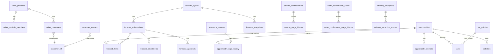

# Portal Comercial — modelo de dados (`commercial-api`)

> **Schema Postgres:** `commercial`  
> **Produto:** Portal Comercial (`id` técnico `commercial`)  
> **Status:** M1 aplicado (V001–V002); **M2 parcial** em `V003__tasks_activities.sql` (Wave G — só `tasks` + `activities`); **E5.1 multi-membro** em `V005__seller_portfolio_members.sql`; **grupos operacionais** em `V010__commercial_groups.sql` + `V011`; **tarefa↔grupo + concluído por** em `V012__task_assignee_groups_and_completed_by.sql`; **carteira name-first** em `V013__seller_portfolio_user_id_nullable.sql` (`user_id` nullable / órfã); **outbox + checkpoints** em `V014__integration_outbox_and_checkpoints.sql` (notif ready_to_invoice). **Sala de interação (P0):** `V019__interaction_rooms.sql` + `V020__task_source_interaction_message.sql` + `V021__interaction_wall_global_unique.sql` — § 8.1. Demais entidades deste doc = especificação futura.  
> **Playbook:** [PLAYBOOK-MODULO-COMERCIAL.md](./PLAYBOOK-MODULO-COMERCIAL.md) § 8  
> **Fronteiras:** [PLAYBOOK-01-fronteiras-api-delpi.md](./PLAYBOOK-01-fronteiras-api-delpi.md)  
> **ADR:** [adr/ADR-001-commercial-api.md](./adr/ADR-001-commercial-api.md)  
> **Cutover F2c / multi-membro:** [F2C-CUTOVER-RUNBOOK.md](./F2C-CUTOVER-RUNBOOK.md)

**Fora deste documento:** tabelas TOTVS (SC5/SC6/SA1/AD*…). Pedidos, propostas e cadastro de cliente continuam na api-delpi; aqui só há **referências** (`customer_code`+`customer_store`, `order_branch`+`order_number`+`line_item`, etc.). Censo CRM Protheus (volumes, funis, joins): [crm-sigatec.md](../../../../api-delpi/docs/api/padroes-totvs/crm-sigatec.md). Colunas/índices SX3: [playbook-crm-totvs-dicionario.md](../../../../api-delpi/docs/api/padroes-totvs/playbooks/playbook-crm-totvs-dicionario.md). **Não** importar tarefa/agenda TOTVS (`AD8`/`AD7`/`AD5` vazios nesta base).

---

## 1. Convenções

| Regra | Valor |
|-------|--------|
| Nomes de tabela/coluna | **English** snake_case |
| PK | `UUID` · `gen_random_uuid()` (extensão `pgcrypto`) |
| Tempo | `TIMESTAMPTZ` em **UTC** |
| Usuário | `user_id` / `*_user_id` = Keycloak `sub` (`TEXT`) |
| Cliente TOTVS | `customer_code` + `customer_store` (trim); chave lógica `code\|store` |
| Pedido TOTVS | `order_branch` + `order_number` + `line_item` (quando linha) |
| Concorrência | `version INT NOT NULL DEFAULT 1` em entidades editáveis (optimistic lock) |
| Soft delete | `deleted_at TIMESTAMPTZ NULL` quando histórico obrigatório |
| Motivo sensível | `reason_code` (FK lógica → `reference_reasons.code`) + `reason_note TEXT` |
| JSON flexível | `JSONB` só para metadados/extensões — campos de filtro ficam tipados |
| Money | `NUMERIC(18,2)` |
| Percentuais | `NUMERIC(5,2)` (0–100) ou `NUMERIC(7,4)` se probabilidade 0–1 — ver coluna |
| Binários | metadado na tabela + arquivo em volume Compose (`persistent-upload-storage`) |
| **Escalabilidade** | Índices nas chaves de lista/filtro desde M1; outbox para side-effects; sem denormalizar TOTVS em massa — ver playbook § 14 |

### Ondas de migration

| Onda | Fase | Tabelas |
|------|------|---------|
| **M1** | F2 | Carteira + avatars (+ `audit_log` mínimo) |
| **M1+** | E5.1 | `seller_portfolio_members` (N:N) — `V005` |
| **M1++** | E5 groups | `commercial_groups` + `commercial_group_members` — `V010` (tabelas) + `V011` (remove seeds; gestor cria) |
| **M2** | F5 | Tasks, activities (+ Wave G `V003`); `task_assignees`/`task_customers` (`V007`); `task_assignee_groups` + `completed_by_user_id` (`V012`); **outbox/checkpoints** (`V014`); visits leves / task_deps = futuro |
| **M3** | F6 | Opportunities, pipeline refs, forecast |
| **M4** | F7 | Samples, order confirmations, delivery exceptions |
| **M5** | Admin | `reference_*`, `sla_policies`, account plans, data quality |

---

## 2. Diagrama de relacionamentos (núcleo)

`customer_ref` não é tabela — é o par TOTVS referenciado.  
Membership canônico: `seller_portfolio_members` (owner + members). `seller_portfolios.user_id` espelha o owner (legado / denormalizado).

---

## 3. Onda M1 — Carteira e avatar (F2)

Origem legada: schema `pedidos_venda_abertos` (`sellers`, `seller_customers`, `customer_avatars`).  
No alvo: schema `commercial`, nomes EN alinhados ao playbook.

### 3.1 `seller_portfolios`

Carteira compartilhada (antes: `pedidos_venda_abertos.sellers`). Uma carteira = uma lista de clientes (`seller_customers`) + N usuários (`seller_portfolio_members`).

| Coluna | Tipo | Constraints / notas |
|--------|------|---------------------|
| `id` | UUID | PK, default `gen_random_uuid()` |
| `user_id` | TEXT | NULL após **V013** — **owner denormalizado** (espelho do membro `role=owner`). NULL = carteira órfã (create só com `display_name`). **Não** é UNIQUE global após `V005` (mesmo usuário pode ser owner/membro em várias carteiras; a unicidade de membership está em `seller_portfolio_members`) |
| `display_name` | TEXT | NOT NULL — nome exibido (seletor de escopo / filtros) |
| `active` | BOOLEAN | NOT NULL, default `TRUE` |
| `created_by_user_id` | TEXT | NULL |
| `created_at` | TIMESTAMPTZ | NOT NULL, default `NOW()` |
| `updated_at` | TIMESTAMPTZ | NOT NULL, default `NOW()` |
| `version` | INT | NOT NULL, default `1` |
| `deleted_at` | TIMESTAMPTZ | NULL — soft deactivate preferencial via `active=false`; `deleted_at` se purge lógico |

**Índices:** `(active)`; `(user_id)` — índice não único após `V005` (constraint `seller_portfolios_user_id_key` removida).

**Fonte de verdade de membership:** tabela `seller_portfolio_members` (§ 3.1b). Manter `user_id` alinhado ao owner ao criar/trocar responsável. **V013:** create name-first permite `user_id` NULL; o 1º `add_member` promove a `owner` e sincroniza `user_id`.

**Migration V013:** `ALTER … user_id DROP NOT NULL` (+ índice/comentário). Sem backfill.

**Migração:** `INSERT … SELECT` de `pedidos_venda_abertos.sellers` → mapear `id` preservado se possível (mesmo UUID). Multi-membro: `V005__seller_portfolio_members.sql`.

### 3.1b `seller_portfolio_members` (E5.1 — `V005`)

Membership N:N — usuários compartilham a **mesma** lista de clientes da carteira.

| Coluna | Tipo | Constraints / notas |
|--------|------|---------------------|
| `id` | UUID | PK, default `gen_random_uuid()` |
| `seller_portfolio_id` | UUID | NOT NULL, FK → `seller_portfolios(id)` ON DELETE CASCADE |
| `user_id` | TEXT | NOT NULL — Keycloak sub |
| `role` | TEXT | NOT NULL, default `member` — check `IN ('owner', 'member')` |
| `created_at` | TIMESTAMPTZ | NOT NULL, default `NOW()` |

**Único:** `(seller_portfolio_id, user_id)`.  
**Índices:** `(user_id)`; `(seller_portfolio_id)`.  
**Um owner por carteira:** unique parcial `WHERE role = 'owner'` em `(seller_portfolio_id)`.

**Backfill (`V005`):** cada `seller_portfolios.user_id` vira linha `role='owner'`.  
**Produto:** usuário pode aparecer em N carteiras; filtro «Todas as carteiras» = união dedupe dos clientes; chip Escopo no shell = identidade (`N carteiras` se >1), não filtro.

### 3.1c `commercial_groups` / `commercial_group_members` (V010 + V011)

Grupos **operacionais** do Portal — **sem seeds fixos**; o gestor cria, exclui e gerencia membros. **Não** são papéis RBAC nem carteiras.

| Tabela | Colunas-chave |
|--------|----------------|
| `commercial_groups` | `id`, `kind` (UNIQUE EN, derivado do nome), `name` (PT UI), `active`, `sort_order` |
| `commercial_group_members` | `group_id`, `user_id` — UNIQUE `(group_id, user_id)` |

**API:** `GET/POST /groups`, `DELETE /groups/{id}`, membros add/remove/replace; roster `GET /administration/team-roster`; perfil `groups[]` (summary sem lista de membros).  
**Permissão:** `commercial.seller-portfolios.manage`.  
**V011:** remove seeds legados (`sellers` / `sales_assistants` / `billing` / `estimators`).

### 3.2 `seller_customers`

Vínculo carteira ↔ cliente TOTVS (antes: `seller_customers`).

| Coluna | Tipo | Constraints / notas |
|--------|------|---------------------|
| `id` | UUID | PK |
| `seller_portfolio_id` | UUID | NOT NULL, FK → `seller_portfolios(id)` ON DELETE CASCADE |
| `customer_code` | TEXT | NOT NULL |
| `customer_store` | TEXT | NOT NULL |
| `customer_name` | TEXT | NULL — cache de exibição; fonte canônica TOTVS |
| `created_at` | TIMESTAMPTZ | NOT NULL, default `NOW()` |
| `created_by_user_id` | TEXT | NULL |

**Único:** `(seller_portfolio_id, customer_code, customer_store)`.  
**Índices:** `(seller_portfolio_id)`; `(customer_code, customer_store)`.

### 3.3 `customer_avatars`

Metadado do logo; bytes no volume (ex.: `/app/data/commercial-avatars/{code}_{store}`).

| Coluna | Tipo | Constraints / notas |
|--------|------|---------------------|
| `id` | UUID | PK |
| `customer_code` | TEXT | NOT NULL |
| `customer_store` | TEXT | NOT NULL |
| `file_name` | TEXT | NOT NULL — nome original |
| `storage_key` | TEXT | NOT NULL — path relativo no volume (novo vs legado) |
| `content_type` | TEXT | NOT NULL |
| `byte_size` | BIGINT | NULL |
| `uploaded_by_user_id` | TEXT | NULL |
| `created_at` | TIMESTAMPTZ | NOT NULL, default `NOW()` |
| `updated_at` | TIMESTAMPTZ | NOT NULL, default `NOW()` |
| `version` | INT | NOT NULL, default `1` |

**Único:** `(customer_code, customer_store)`.  
**Índice:** `(customer_code, customer_store)`.

> Legado V002 não tinha `storage_key`/`byte_size` — preencher no backfill (`storage_key` = convenção antiga do path).

### 3.4 `audit_log` (mínimo M1; expandido depois)

Trilha imutável (append-only).

| Coluna | Tipo | Constraints / notas |
|--------|------|---------------------|
| `id` | UUID | PK |
| `occurred_at` | TIMESTAMPTZ | NOT NULL, default `NOW()` |
| `actor_user_id` | TEXT | NOT NULL |
| `action` | TEXT | NOT NULL — ex.: `seller_portfolio.transfer_customers` |
| `entity_type` | TEXT | NOT NULL — ex.: `seller_portfolio` |
| `entity_id` | TEXT | NOT NULL — UUID ou chave composta |
| `branch` | TEXT | NULL |
| `payload` | JSONB | NOT NULL, default `{}` — antes/depois resumido |
| `reason_code` | TEXT | NULL |
| `reason_note` | TEXT | NULL |
| `correlation_id` | TEXT | NULL |
| `ip` | TEXT | NULL — se disponível |

**Índices:** `(entity_type, entity_id, occurred_at DESC)`; `(actor_user_id, occurred_at DESC)`; `(occurred_at DESC)`.

**Proibido:** UPDATE/DELETE em runtime de aplicação.

---

## 4. Onda M2 — Worklist, atividades, visitas (F5)

### 4.1 `tasks`

| Coluna | Tipo | Notas |
|--------|------|--------|
| `id` | UUID PK | |
| `title` | TEXT NOT NULL | |
| `description` | TEXT | Observação livre · **Wave G+:** coluna e API create; **UI Meu dia ainda não expõe** — backlog P0 em [UX-E-TASKS-EVOLUTION.md](./UX-E-TASKS-EVOLUTION.md) |
| `task_type` | TEXT NOT NULL | `follow_up` \| `call` \| `email` \| `visit` \| `internal` \| `other` |
| `status` | TEXT NOT NULL | `open` \| `done` \| `cancelled` \| `deferred` |
| `priority` | TEXT NOT NULL | `low` \| `normal` \| `high` \| `critical` · default `normal` |
| `due_at` | TIMESTAMPTZ | |
| `completed_at` | TIMESTAMPTZ | |
| `completed_by_user_id` | TEXT NULL | **V012:** quem concluiu (tarefas de grupo / multi-assignee) |
| `assignee_user_id` | TEXT NOT NULL | Espelho do **primeiro** responsável (`task_assignees`); legado + índice |
| `created_by_user_id` | TEXT NOT NULL | |
| `customer_code` / `customer_store` | TEXT | Espelho do **primeiro** cliente (`task_customers`); opcional |
| `opportunity_id` | UUID NULL | FK → `opportunities` (nullable até M3; criar FK na M3) |
| `prospect_id` | UUID NULL | FK → `prospects` (M2/M3) |
| `related_entity_type` / `related_entity_id` | TEXT | polimórfico leve · sala: tipo `interaction_room` + id da sala |
| `source_interaction_message_id` | UUID NULL | **V020:** mensagem que originou a tarefa (`create_task_from_interaction_message`) |
| `sla_policy_id` | UUID NULL | FK → `sla_policies` |
| `sla_due_at` | TIMESTAMPTZ | |
| `defer_reason_code` / `defer_note` | TEXT | |
| `version` | INT NOT NULL DEFAULT 1 | |
| `created_at` / `updated_at` | TIMESTAMPTZ NOT NULL | |
| `deleted_at` | TIMESTAMPTZ | |

**Índices:** `(assignee_user_id, status, due_at)`; `(customer_code, customer_store)`; `(due_at) WHERE status = 'open'`; `(source_interaction_message_id)` WHERE NOT NULL (**V020**).

**Multi responsável / cliente (V007):** junções abaixo (máx. 20 cada na API). Qualquer assignee conclui; só o criador edita/exclui/adia.

### 4.1b `task_assignees` / `task_customers`

| Tabela | Colunas | Notas |
|--------|---------|--------|
| `task_assignees` | `task_id`, `user_id`, `sort_order`, `created_at` | PK `(task_id, user_id)`; primeiro espelha `tasks.assignee_user_id` |
| `task_customers` | `task_id`, `customer_code`, `customer_store`, `sort_order`, `created_at` | PK `(task_id, customer_code, customer_store)`; primeiro espelha colunas legado |
| `task_assignee_groups` | `task_id`, `group_id` | **V012:** amarração a `commercial_groups` (sem expandir cópias em `task_assignees`); visibilidade por membership atual. **XOR com** `task_assignees` na API (não ambos no mesmo create/update). |

### 4.2 `task_dependencies`

| Coluna | Tipo | Notas |
|--------|------|--------|
| `id` | UUID PK | |
| `task_id` | UUID NOT NULL | FK → `tasks` ON DELETE CASCADE |
| `depends_on_task_id` | UUID NOT NULL | FK → `tasks` ON DELETE CASCADE |
| `created_at` | TIMESTAMPTZ NOT NULL | |

**Único:** `(task_id, depends_on_task_id)`.  
Check: `task_id <> depends_on_task_id`.

### 4.3 `activities`

Registro imutável de interação (timeline).

| Coluna | Tipo | Notas |
|--------|------|--------|
| `id` | UUID PK | |
| `activity_type` | TEXT NOT NULL | `call` \| `email` \| `meeting` \| `visit` \| `note` \| `system` |
| `subject` | TEXT | |
| `body` | TEXT | |
| `occurred_at` | TIMESTAMPTZ NOT NULL | |
| `actor_user_id` | TEXT NOT NULL | |
| `customer_code` / `customer_store` | TEXT | |
| `prospect_id` | UUID NULL | |
| `opportunity_id` | UUID NULL | |
| `task_id` | UUID NULL | FK → `tasks` |
| `visit_id` | UUID NULL | FK → `visits` |
| `metadata` | JSONB NOT NULL DEFAULT `{}` | |
| `created_at` | TIMESTAMPTZ NOT NULL | |

**Índices:** `(customer_code, customer_store, occurred_at DESC)`; `(opportunity_id, occurred_at DESC)`; `(prospect_id, occurred_at DESC)`.

### 4.4 `prospects`

| Coluna | Tipo | Notas |
|--------|------|--------|
| `id` | UUID PK | identificador interno estável pré-TOTVS |
| `legal_name` | TEXT NOT NULL | |
| `trade_name` | TEXT | |
| `document_id` | TEXT | CNPJ/CPF normalizado (busca) |
| `origin_code` | TEXT | catálogo configurável |
| `status` | TEXT NOT NULL | `new` \| `in_contact` \| `qualified` \| `nurturing` \| `converted` \| `disqualified` \| `lost` |
| `owner_user_id` | TEXT NOT NULL | |
| `team_key` | TEXT | |
| `branch` | TEXT | filial comercial |
| `territory_code` | TEXT | |
| `segment_code` | TEXT | |
| `subsegment_code` | TEXT | |
| `potential_amount` | NUMERIC(18,2) | |
| `potential_qty` | NUMERIC(18,4) | |
| `next_action_at` | TIMESTAMPTZ | |
| `next_action_summary` | TEXT | |
| `converted_customer_code` / `converted_customer_store` | TEXT | preenchidos na conversão |
| `converted_at` | TIMESTAMPTZ | |
| `converted_by_user_id` | TEXT | |
| `disqualify_reason_code` | TEXT | |
| `tags` | TEXT[] | ou JSONB |
| `version` | INT NOT NULL DEFAULT 1 | |
| `created_at` / `updated_at` | TIMESTAMPTZ NOT NULL | |
| `deleted_at` | TIMESTAMPTZ | |

**Índices:** `(owner_user_id, status)`; `(document_id)`; `(next_action_at) WHERE status NOT IN ('converted','disqualified','lost')`.

### 4.5 `prospect_contacts`

| Coluna | Tipo | Notas |
|--------|------|--------|
| `id` | UUID PK | |
| `prospect_id` | UUID NOT NULL | FK CASCADE |
| `full_name` | TEXT NOT NULL | |
| `role_title` | TEXT | |
| `email` | TEXT | |
| `phone` | TEXT | |
| `is_primary` | BOOLEAN NOT NULL DEFAULT FALSE | |
| `created_at` / `updated_at` | TIMESTAMPTZ NOT NULL | |

### 4.6 `visits`

| Coluna | Tipo | Notas |
|--------|------|--------|
| `id` | UUID PK | |
| `customer_code` / `customer_store` | TEXT | XOR com prospect |
| `prospect_id` | UUID NULL | |
| `scheduled_start_at` / `scheduled_end_at` | TIMESTAMPTZ | |
| `status` | TEXT NOT NULL | `planned` \| `done` \| `cancelled` \| `no_show` |
| `objective` | TEXT | |
| `agenda` | TEXT | |
| `outcome_summary` | TEXT | |
| `owner_user_id` | TEXT NOT NULL | |
| `participants` | JSONB NOT NULL DEFAULT `[]` | `[{user_id, name}]` |
| `version` | INT NOT NULL DEFAULT 1 | |
| `created_at` / `updated_at` | TIMESTAMPTZ NOT NULL | |
| `deleted_at` | TIMESTAMPTZ | |

### 4.7 `integration_outbox`

| Coluna | Tipo | Notas |
|--------|------|--------|
| `id` | UUID PK | |
| `event_type` | TEXT NOT NULL | ex.: `commercial.task.overdue` |
| `aggregate_type` / `aggregate_id` | TEXT NOT NULL | |
| `payload` | JSONB NOT NULL | |
| `created_at` | TIMESTAMPTZ NOT NULL | |
| `available_at` | TIMESTAMPTZ NOT NULL DEFAULT `NOW()` | |
| `published_at` | TIMESTAMPTZ | NULL = pendente |
| `attempts` | INT NOT NULL DEFAULT 0 | |
| `last_error` | TEXT | |

**Índice:** `(available_at) WHERE published_at IS NULL`.

### 4.8 `integration_checkpoints`

| Coluna | Tipo | Notas |
|--------|------|--------|
| `id` | UUID PK | |
| `source_key` | TEXT NOT NULL UNIQUE | ex.: `api-delpi.open-orders` |
| `cursor_value` | TEXT | |
| `last_success_at` | TIMESTAMPTZ | |
| `metadata` | JSONB NOT NULL DEFAULT `{}` | |
| `updated_at` | TIMESTAMPTZ NOT NULL | |

---

## 5. Onda M3 — Oportunidades e forecast (F6)

### 5.1 `pipeline_definitions`

| Coluna | Tipo | Notas |
|--------|------|--------|
| `id` | UUID PK | |
| `code` | TEXT NOT NULL UNIQUE | |
| `name` | TEXT NOT NULL | label pt-BR pode ir em content/i18n; aqui nome operacional |
| `active` | BOOLEAN NOT NULL DEFAULT TRUE | |
| `created_at` / `updated_at` | TIMESTAMPTZ NOT NULL | |

### 5.2 `pipeline_stages`

| Coluna | Tipo | Notas |
|--------|------|--------|
| `id` | UUID PK | |
| `pipeline_id` | UUID NOT NULL | FK → `pipeline_definitions` |
| `code` | TEXT NOT NULL | |
| `name` | TEXT NOT NULL | |
| `sort_order` | INT NOT NULL | |
| `default_probability` | NUMERIC(5,2) | 0–100 |
| `is_won` / `is_lost` | BOOLEAN NOT NULL DEFAULT FALSE | |
| `active` | BOOLEAN NOT NULL DEFAULT TRUE | |

**Único:** `(pipeline_id, code)`.

### 5.3 `opportunities`

| Coluna | Tipo | Notas |
|--------|------|--------|
| `id` | UUID PK | |
| `title` | TEXT NOT NULL | |
| `pipeline_id` | UUID NOT NULL | FK |
| `stage_id` | UUID NOT NULL | FK → `pipeline_stages` |
| `status` | TEXT NOT NULL | `open` \| `won` \| `lost` \| `cancelled` \| `deferred` |
| `customer_code` / `customer_store` | TEXT | cliente convertido |
| `prospect_id` | UUID NULL | FK → `prospects` |
| `owner_user_id` | TEXT NOT NULL | |
| `branch` | TEXT | |
| `amount` | NUMERIC(18,2) | |
| `quantity` | NUMERIC(18,4) | |
| `probability` | NUMERIC(5,2) | override manual opcional |
| `expected_close_on` | DATE | |
| `next_action_at` | TIMESTAMPTZ | |
| `next_action_summary` | TEXT | |
| `won_at` / `lost_at` | TIMESTAMPTZ | |
| `close_reason_code` | TEXT | |
| `close_reason_note` | TEXT | |
| `external_proposal_key` | TEXT | `branch\|number\|revision` — ADY: filial do cabeçalho pode estar vazia; desambiguar com OV |
| `external_order_key` | TEXT | `branch\|order\|item` ou cabeçalho |
| `external_opportunity_key` | TEXT | TOTVS `AD1`: `filial\|nropor` (**obrigatório** incluir filial — o número colide entre 01 e 02) |
| `totvs_process_code` | TEXT | `AD1_PROVEN` — `000001` COMPONENTES (maior volume) ≠ `000002`/`000003` LMP |
| `entered_stage_at` | TIMESTAMPTZ NOT NULL | para aging |
| `version` | INT NOT NULL DEFAULT 1 | |
| `created_at` / `updated_at` | TIMESTAMPTZ NOT NULL | |
| `deleted_at` | TIMESTAMPTZ | |

**Índices:** `(owner_user_id, status)`; `(stage_id)`; `(expected_close_on)`; `(customer_code, customer_store)`.

### 5.4 `opportunity_stage_history`

| Coluna | Tipo | Notas |
|--------|------|--------|
| `id` | UUID PK | |
| `opportunity_id` | UUID NOT NULL | FK CASCADE |
| `from_stage_id` | UUID NULL | |
| `to_stage_id` | UUID NOT NULL | |
| `changed_at` | TIMESTAMPTZ NOT NULL | |
| `changed_by_user_id` | TEXT NOT NULL | |
| `reason_code` / `reason_note` | TEXT | |
| `duration_seconds` | INT | calculado na saída do estágio anterior |

### 5.5 `opportunity_products`

| Coluna | Tipo | Notas |
|--------|------|--------|
| `id` | UUID PK | |
| `opportunity_id` | UUID NOT NULL | FK CASCADE |
| `product_code` | TEXT | TOTVS |
| `family_code` | TEXT | |
| `description` | TEXT | |
| `quantity` | NUMERIC(18,4) | |
| `unit_amount` | NUMERIC(18,2) | |
| `line_amount` | NUMERIC(18,2) | |
| `created_at` | TIMESTAMPTZ NOT NULL | |

### 5.6 `forecast_cycles`

| Coluna | Tipo | Notas |
|--------|------|--------|
| `id` | UUID PK | |
| `code` | TEXT NOT NULL UNIQUE | ex.: `2026-08` |
| `period_start` / `period_end` | DATE NOT NULL | |
| `status` | TEXT NOT NULL | `draft` \| `open` \| `locked` \| `closed` |
| `opens_at` / `closes_at` | TIMESTAMPTZ | |
| `created_at` / `updated_at` | TIMESTAMPTZ NOT NULL | |

### 5.7 `forecast_submissions`

| Coluna | Tipo | Notas |
|--------|------|--------|
| `id` | UUID PK | |
| `cycle_id` | UUID NOT NULL | FK |
| `owner_user_id` | TEXT NOT NULL | |
| `scope` | TEXT NOT NULL | `own` \| `team` \| `branch` |
| `branch` | TEXT | |
| `status` | TEXT NOT NULL | `draft` \| `submitted` \| `approved` \| `rejected` |
| `submitted_at` | TIMESTAMPTZ | |
| `version` | INT NOT NULL DEFAULT 1 | |
| `created_at` / `updated_at` | TIMESTAMPTZ NOT NULL | |

**Único sugerido:** `(cycle_id, owner_user_id, scope)` para rascunho ativo (parcial único com `WHERE status IN (...)` se necessário).

### 5.8 `forecast_items`

| Coluna | Tipo | Notas |
|--------|------|--------|
| `id` | UUID PK | |
| `submission_id` | UUID NOT NULL | FK CASCADE |
| `category` | TEXT NOT NULL | `pipeline` \| `best_case` \| `commit` \| `closed` |
| `opportunity_id` | UUID NULL | |
| `external_order_key` | TEXT | |
| `amount` | NUMERIC(18,2) NOT NULL | |
| `quantity` | NUMERIC(18,4) | |
| `note` | TEXT | |
| `created_at` / `updated_at` | TIMESTAMPTZ NOT NULL | |

### 5.9 `forecast_adjustments`

| Coluna | Tipo | Notas |
|--------|------|--------|
| `id` | UUID PK | |
| `submission_id` | UUID NOT NULL | FK CASCADE |
| `category` | TEXT NOT NULL | mesma enum de items |
| `delta_amount` | NUMERIC(18,2) NOT NULL | |
| `justification` | TEXT NOT NULL | |
| `adjusted_by_user_id` | TEXT NOT NULL | |
| `created_at` | TIMESTAMPTZ NOT NULL | |

### 5.10 `forecast_approvals`

| Coluna | Tipo | Notas |
|--------|------|--------|
| `id` | UUID PK | |
| `submission_id` | UUID NOT NULL | FK CASCADE |
| `decision` | TEXT NOT NULL | `approved` \| `rejected` |
| `decided_by_user_id` | TEXT NOT NULL | |
| `decided_at` | TIMESTAMPTZ NOT NULL | |
| `comment` | TEXT | |

### 5.11 `forecast_snapshots`

| Coluna | Tipo | Notas |
|--------|------|--------|
| `id` | UUID PK | |
| `cycle_id` | UUID NOT NULL | FK |
| `captured_at` | TIMESTAMPTZ NOT NULL | |
| `scope_key` | TEXT NOT NULL | user/team/branch |
| `totals` | JSONB NOT NULL | pipeline/best_case/commit/closed/realized |
| `accuracy` | JSONB | preenchido pós-ciclo |

---

## 6. Onda M4 — Amostras, confirmação, exceções (F7)

### 6.1 `sample_developments`

| Coluna | Tipo | Notas |
|--------|------|--------|
| `id` | UUID PK | |
| `title` | TEXT NOT NULL | |
| `customer_code` / `customer_store` | TEXT | |
| `prospect_id` / `opportunity_id` | UUID NULL | |
| `product_code` | TEXT | |
| `status` | TEXT NOT NULL | `open` \| `paused` \| `done` \| `cancelled` \| `rejected` |
| `current_stage_code` | TEXT NOT NULL | |
| `owner_user_id` | TEXT NOT NULL | |
| `area_code` | TEXT | área atual |
| `started_at` / `due_at` / `completed_at` | TIMESTAMPTZ | |
| `pause_reason_code` | TEXT | |
| `version` | INT NOT NULL DEFAULT 1 | |
| `created_at` / `updated_at` | TIMESTAMPTZ NOT NULL | |

### 6.2 `sample_stage_history`

| Coluna | Tipo | Notas |
|--------|------|--------|
| `id` | UUID PK | |
| `sample_id` | UUID NOT NULL | FK CASCADE |
| `stage_code` | TEXT NOT NULL | |
| `entered_at` / `exited_at` | TIMESTAMPTZ | |
| `owner_user_id` | TEXT | |
| `area_code` | TEXT | |
| `note` | TEXT | |

### 6.3 `order_confirmation_cases`

| Coluna | Tipo | Notas |
|--------|------|--------|
| `id` | UUID PK | |
| `order_branch` | TEXT NOT NULL | |
| `order_number` | TEXT NOT NULL | |
| `line_item` | TEXT | NULL = cabeçalho |
| `customer_code` / `customer_store` | TEXT | |
| `status` | TEXT NOT NULL | `received` \| `in_review` \| `confirmed` \| `rejected` \| `cancelled` |
| `current_stage_code` | TEXT NOT NULL | |
| `requested_delivery_on` | DATE | |
| `confirmed_delivery_on` | DATE | |
| `owner_user_id` | TEXT | vendas |
| `current_area_code` | TEXT | |
| `sla_due_at` | TIMESTAMPTZ | |
| `version` | INT NOT NULL DEFAULT 1 | |
| `created_at` / `updated_at` | TIMESTAMPTZ NOT NULL | |

**Único:** `(order_branch, order_number, COALESCE(line_item,''))`.

### 6.4 `order_confirmation_stage_history`

| Coluna | Tipo | Notas |
|--------|------|--------|
| `id` | UUID PK | |
| `case_id` | UUID NOT NULL | FK CASCADE |
| `stage_code` | TEXT NOT NULL | |
| `area_code` | TEXT | |
| `entered_at` / `exited_at` | TIMESTAMPTZ | |
| `actor_user_id` | TEXT | |
| `note` | TEXT | |

### 6.5 `delivery_exceptions`

| Coluna | Tipo | Notas |
|--------|------|--------|
| `id` | UUID PK | |
| `order_branch` / `order_number` / `line_item` | TEXT | |
| `customer_code` / `customer_store` | TEXT | |
| `exception_type` | TEXT NOT NULL | `late` \| `partial` \| `invoiced_not_shipped` \| `other` |
| `status` | TEXT NOT NULL | `open` \| `in_progress` \| `resolved` \| `accepted` |
| `cause_code` | TEXT | internal/customer/material/capacity/transport |
| `detected_at` | TIMESTAMPTZ NOT NULL | |
| `resolved_at` | TIMESTAMPTZ | |
| `owner_user_id` | TEXT | |
| `summary` | TEXT | |
| `version` | INT NOT NULL DEFAULT 1 | |
| `created_at` / `updated_at` | TIMESTAMPTZ NOT NULL | |

### 6.6 `delivery_exception_actions`

| Coluna | Tipo | Notas |
|--------|------|--------|
| `id` | UUID PK | |
| `exception_id` | UUID NOT NULL | FK CASCADE |
| `action_type` | TEXT NOT NULL | `justification` \| `plan` \| `note` \| `resolve` |
| `body` | TEXT NOT NULL | |
| `due_at` | TIMESTAMPTZ | |
| `assignee_user_id` | TEXT | |
| `created_by_user_id` | TEXT NOT NULL | |
| `created_at` | TIMESTAMPTZ NOT NULL | |

### 6.7 `approvals`

Aprovação genérica (desconto, margem, exceção).

| Coluna | Tipo | Notas |
|--------|------|--------|
| `id` | UUID PK | |
| `approval_type` | TEXT NOT NULL | `discount` \| `margin` \| `exception` \| `other` |
| `status` | TEXT NOT NULL | `pending` \| `approved` \| `rejected` \| `cancelled` |
| `subject_type` / `subject_id` | TEXT NOT NULL | |
| `requested_by_user_id` | TEXT NOT NULL | |
| `decided_by_user_id` | TEXT | |
| `payload` | JSONB NOT NULL DEFAULT `{}` | |
| `requested_at` / `decided_at` | TIMESTAMPTZ | |
| `comment` | TEXT | |
| `created_at` / `updated_at` | TIMESTAMPTZ NOT NULL | |

---

## 7. Onda M5 — Conta, referências, SLA, qualidade

### 7.1 `account_plans`

| Coluna | Tipo | Notas |
|--------|------|--------|
| `id` | UUID PK | |
| `customer_code` / `customer_store` | TEXT NOT NULL | |
| `version_number` | INT NOT NULL | |
| `status` | TEXT NOT NULL | `draft` \| `active` \| `archived` |
| `objectives` | TEXT | |
| `risks` | TEXT | |
| `strategy` | TEXT | |
| `owner_user_id` | TEXT NOT NULL | |
| `created_at` / `updated_at` | TIMESTAMPTZ NOT NULL | |

**Único:** `(customer_code, customer_store, version_number)`.

### 7.2 `account_plan_actions`

| Coluna | Tipo | Notas |
|--------|------|--------|
| `id` | UUID PK | |
| `account_plan_id` | UUID NOT NULL | FK CASCADE |
| `title` | TEXT NOT NULL | |
| `assignee_user_id` | TEXT | |
| `due_at` | TIMESTAMPTZ | |
| `status` | TEXT NOT NULL | `open` \| `done` \| `cancelled` |
| `created_at` / `updated_at` | TIMESTAMPTZ NOT NULL | |

### 7.2b `commercial_user_profiles`

Extensão Commercial do usuário do diretório (foto + cargo). Migration `V008`.

| Coluna | Tipo | Notas |
|--------|------|--------|
| `user_id` | TEXT PK | sub Minha Delpi |
| `job_title` | TEXT | editável self ou portfolio manager |
| `photo_storage_key` / `photo_file_name` / `photo_content_type` / `photo_byte_size` | | volume `COMMERCIAL_USER_AVATAR_UPLOAD_DIR` |
| `created_at` / `updated_at` | TIMESTAMPTZ NOT NULL | |

### 7.3 `account_contacts`

Contatos locais da Conta (migration `V009`). O contato **TOTVS** (SA1: `A1_CONTATO` / `A1_TEL` / `A1_EMAIL`) é só leitura via BFF `GET .../contacts-bundle` — **não** grava nesta tabela.

| Coluna | Tipo | Notas |
|--------|------|--------|
| `id` | UUID PK | |
| `customer_code` / `customer_store` | TEXT NOT NULL | |
| `full_name` | TEXT NOT NULL | |
| `role_title` | TEXT | |
| `channel` | TEXT NOT NULL | `phone` \| `mobile` \| `email` \| `whatsapp` \| `other` |
| `email` | TEXT | |
| `phone_e164` | TEXT | E.164 leve para `tel:` / `wa.me` |
| `is_whatsapp` | BOOLEAN NOT NULL DEFAULT FALSE | |
| `is_primary` | BOOLEAN NOT NULL DEFAULT FALSE | no máx. 1 por conta (índice único parcial) |
| `source` | TEXT NOT NULL DEFAULT `manual` | |
| `deleted_at` | TIMESTAMPTZ | soft delete |
| `created_at` / `updated_at` | TIMESTAMPTZ NOT NULL | |
| `created_by_user_id` | TEXT NOT NULL | |

**RBAC:** mesmo escopo de leitura da Conta. WhatsApp: deep link `wa.me` no MFE (saudação `{full_name}` em `content/whatsapp.json`) — sem inbox.

### 7.4 `reference_reasons`

| Coluna | Tipo | Notas |
|--------|------|--------|
| `id` | UUID PK | |
| `domain` | TEXT NOT NULL | `opportunity_won` \| `opportunity_lost` \| `disqualify` \| `delay` \| `pause` \| `cancel` \| … |
| `code` | TEXT NOT NULL | |
| `label_pt` | TEXT NOT NULL | texto ao usuário (exceção: conteúdo PT na tabela de catálogo) |
| `active` | BOOLEAN NOT NULL DEFAULT TRUE | |
| `sort_order` | INT NOT NULL DEFAULT 0 | |
| `created_at` / `updated_at` | TIMESTAMPTZ NOT NULL | |

**Único:** `(domain, code)`.

### 7.5 `reference_segments` / `reference_customer_groups` / `reference_product_families`

Padrão comum:

| Coluna | Tipo | Notas |
|--------|------|--------|
| `id` | UUID PK | |
| `code` | TEXT NOT NULL UNIQUE | |
| `name` | TEXT NOT NULL | |
| `parent_code` | TEXT | hierarquia opcional |
| `source` | TEXT NOT NULL | `totvs` \| `manual` \| `import` |
| `active` | BOOLEAN NOT NULL DEFAULT TRUE | |
| `valid_from` / `valid_to` | DATE | |
| `metadata` | JSONB NOT NULL DEFAULT `{}` | |
| `created_at` / `updated_at` | TIMESTAMPTZ NOT NULL | |
| `updated_by_user_id` | TEXT | |

`reference_customer_groups`: incluir `group_kind` (`weg_subgroup` \| `economic_group` \| `other`).

### 7.6 `sla_policies`

| Coluna | Tipo | Notas |
|--------|------|--------|
| `id` | UUID PK | |
| `code` | TEXT NOT NULL UNIQUE | |
| `name` | TEXT NOT NULL | |
| `applies_to` | TEXT NOT NULL | `task` \| `sample` \| `order_confirmation` \| `offer_stage` |
| `duration_hours` | INT NOT NULL | |
| `calendar_code` | TEXT | útil vs corrido |
| `active` | BOOLEAN NOT NULL DEFAULT TRUE | |
| `created_at` / `updated_at` | TIMESTAMPTZ NOT NULL | |

### 7.7 `data_quality_issues`

| Coluna | Tipo | Notas |
|--------|------|--------|
| `id` | UUID PK | |
| `issue_type` | TEXT NOT NULL | |
| `severity` | TEXT NOT NULL | `info` \| `warning` \| `critical` |
| `entity_type` / `entity_id` | TEXT NOT NULL | |
| `message` | TEXT NOT NULL | |
| `status` | TEXT NOT NULL | `open` \| `resolved` \| `ignored` |
| `detected_at` | TIMESTAMPTZ NOT NULL | |
| `resolved_at` | TIMESTAMPTZ | |
| `resolved_by_user_id` | TEXT | |
| `payload` | JSONB NOT NULL DEFAULT `{}` | |

---

## 8. Anexos genéricos (opcional M2+)

### `attachments`

| Coluna | Tipo | Notas |
|--------|------|--------|
| `id` | UUID PK | |
| `owner_type` / `owner_id` | TEXT NOT NULL | V004: `task` \| `customer` \| `activity`. **V019** acrescenta `room_message` (não editar V004). |
| `file_name` | TEXT NOT NULL | |
| `storage_key` | TEXT NOT NULL | volume persistente `commercial-attachments` |
| `content_type` | TEXT NOT NULL | |
| `byte_size` | BIGINT | |
| `uploaded_by_user_id` | TEXT NOT NULL | |
| `created_at` | TIMESTAMPTZ NOT NULL | |

**Índice:** `(owner_type, owner_id)`.  
**Sala:** `owner_type=room_message`, `owner_id` = `interaction_messages.id`. Path no disco `{base}/room_message/{id}/`.

### 8.1 Sala de interação (P2-SALA — V019–V021 · P0 entregue)

Histórico operacional ancorado em registro (`kind`: `entity` \| `process` \| `wall`). Sem DM (`direct` fora do P0). Nomes EN; PT só em JSON/UI.

**Migrations:** `V019` (tabelas da sala) · `V020` (`tasks.source_interaction_message_id`) · `V021` (único mural global sem `group_id`).

#### `interaction_rooms`

| Coluna | Tipo | Constraints / notas |
|--------|------|---------------------|
| `id` | UUID | PK, default `gen_random_uuid()` |
| `kind` | TEXT | NOT NULL — check `IN ('entity', 'process', 'wall')` |
| `entity_type` | TEXT | NULL — kind do catálogo de menções (`order`, `customer`, …) quando `kind=entity` |
| `entity_key` | TEXT | NULL — chave estável (ex. `01\|102942`, `000123\|01`) |
| `group_id` | UUID | NULL — FK lógica → `commercial_groups(id)` quando `kind=wall` por grupo |
| `title` | TEXT | NOT NULL — rótulo de inbox |
| `created_by_user_id` | TEXT | NOT NULL |
| `created_at` | TIMESTAMPTZ | NOT NULL, default `NOW()` |
| `updated_at` | TIMESTAMPTZ | NOT NULL, default `NOW()` |
| `deleted_at` | TIMESTAMPTZ | NULL — soft delete |

**Único parcial:** `(kind, entity_type, entity_key)` WHERE `kind='entity'` AND `deleted_at IS NULL`.  
**Único parcial wall por grupo:** `(kind, group_id)` WHERE `kind='wall'` AND `group_id IS NOT NULL` AND `deleted_at IS NULL`.  
**Único mural global (V021):** `(kind)` WHERE `kind='wall'` AND `group_id IS NULL` AND `deleted_at IS NULL` (`uq_commercial_interaction_rooms_wall_global`).  
**Índices:** `(updated_at DESC)`; `(kind, entity_type, entity_key)`.

#### `interaction_room_members`

Estado por usuário (**não** ACL): `last_read_at` (cursor de inbox; upsert em `mark_read`), participantes que abriram a sala (`resolve`) ou foram adicionados explicitamente. Acesso à sala = `commercial.access` na borda HTTP/WS.

| Coluna | Tipo | Constraints / notas |
|--------|------|---------------------|
| `id` | UUID | PK |
| `room_id` | UUID | NOT NULL, FK → `interaction_rooms(id)` ON DELETE CASCADE |
| `user_id` | TEXT | NOT NULL — Keycloak sub |
| `role` | TEXT | NOT NULL, default `member` — check `IN ('member', 'watcher')` |
| `last_read_at` | TIMESTAMPTZ | NULL |
| `muted` | BOOLEAN | NOT NULL, default `FALSE` |
| `created_at` | TIMESTAMPTZ | NOT NULL, default `NOW()` |

**Único:** `(room_id, user_id)`. **Índice:** `(user_id)`.

#### `interaction_messages`

| Coluna | Tipo | Constraints / notas |
|--------|------|---------------------|
| `id` | UUID | PK |
| `room_id` | UUID | NOT NULL, FK → `interaction_rooms` ON DELETE CASCADE |
| `parent_id` | UUID | NULL — FK → `interaction_messages(id)` (thread) |
| `author_user_id` | TEXT | NULL quando `message_kind=system` |
| `message_kind` | TEXT | NOT NULL — check `IN ('text', 'system', 'task_ref', 'pin')`; JSON reserva `otd_event`, `confirmation_event`, `wall_post` |
| `body_text` | TEXT | NOT NULL, default `''` — **markdown** (nunca HTML); preview de inbox = texto plano |
| `edited_at` | TIMESTAMPTZ | NULL |
| `deleted_at` | TIMESTAMPTZ | NULL — soft delete |
| `created_at` | TIMESTAMPTZ | NOT NULL, default `NOW()` |

**Índices:** `(room_id, created_at DESC)`; `(parent_id)` WHERE `parent_id IS NOT NULL`.

**Contrato API:** POST/PATCH rejeitam HTML cru (422); PATCH `mentions[]` = replace; anexos da mensagem ≤ 10 × 20 MB (`room_message`).

#### `interaction_mentions`

| Coluna | Tipo | Constraints / notas |
|--------|------|---------------------|
| `id` | UUID | PK |
| `message_id` | UUID | NOT NULL, FK → `interaction_messages` ON DELETE CASCADE |
| `mention_kind` | TEXT | NOT NULL — id do catálogo `interaction_mention_kinds.json` |
| `ref` | JSONB | NOT NULL — payload do objeto (`user_id`, `customer_code`+`store`, …) |
| `label` | TEXT | NOT NULL — snapshot para render |

**Índice:** `(mention_kind)`; GIN `(ref)` se busca por objeto.

#### `interaction_reactions`

| Coluna | Tipo | Constraints / notas |
|--------|------|---------------------|
| `message_id` | UUID | NOT NULL, FK → `interaction_messages` ON DELETE CASCADE |
| `user_id` | TEXT | NOT NULL |
| `code` | TEXT | NOT NULL — emoji id / código do conjunto |
| `created_at` | TIMESTAMPTZ | NOT NULL, default `NOW()` |

**PK:** `(message_id, user_id, code)`. **Regra de negócio:** no máximo **uma** reação por usuário por mensagem — `set_reaction` remove outros `code` do mesmo `(message_id, user_id)` antes do upsert.

#### `interaction_pins`

| Coluna | Tipo | Constraints / notas |
|--------|------|---------------------|
| `id` | UUID | PK |
| `room_id` | UUID | NOT NULL, FK → `interaction_rooms` ON DELETE CASCADE |
| `message_id` | UUID | NOT NULL, FK → `interaction_messages` ON DELETE CASCADE |
| `pinned_by_user_id` | TEXT | NOT NULL |
| `created_at` | TIMESTAMPTZ | NOT NULL, default `NOW()` |

**Único:** `(room_id, message_id)`.

---

## 9. Mapa legado → alvo (F2)

| Legado (`pedidos_venda_abertos`) | Alvo (`commercial`) |
|---------------------------------|---------------------|
| `sellers` | `seller_portfolios` |
| `sellers.user_id` (1:1 UNIQUE) | `seller_portfolios.user_id` (owner denormalizado) + `seller_portfolio_members` (N:N canônico, `V005`) |
| `seller_customers.seller_id` | `seller_customers.seller_portfolio_id` |
| `customer_avatars` | `customer_avatars` (+ `storage_key`, `byte_size`) |

Preservar UUIDs no cutover quando possível para não quebrar favoritos/logs.  
Multi-membro **não** cabe no schema PVA (`sellers.user_id UNIQUE`) — ver [F2C-CUTOVER-RUNBOOK.md](./F2C-CUTOVER-RUNBOOK.md).

---

## 10. O que **não** vira tabela Delpi

| Dado | Onde fica |
|------|-----------|
| Pedido / item / saldo / entrega | TOTVS via api-delpi |
| NF saída / billing series | api-delpi |
| Proposta OV / AD1 / ADY / AIJ | api-delpi (leitura viva; não clonar) |
| Funil TOTVS (`AC1`/`AC2`) | api-delpi — três processos; COMPONENTES ≠ LMP |
| Tarefa / agenda / visita SIGATEC | **não há dado** (`AD8`/`AD7`/`AD5` = 0) — Meu Dia só commercial-api |
| Prospect / contato TOTVS | api-delpi (`SUS`/`AC8`); não clonar SA1 |
| ROL / OTD / hit rate | api-delpi (+ SI metas) |
| Cadastro SA1 completo | TOTVS |

---

## 11. Checklist antes da primeira migration M1

1. [ ] Schema `commercial` no Postgres plugins (runner próprio da `commercial-api`, não misturar com `run_plugins_migrations` da api-delpi sem ADR).
2. [ ] Volume avatars nos dois composes.
3. [ ] Teste de backfill contagem `sellers` = `seller_portfolios`.
4. [ ] Dual-read até cutover MFE/Portal Comercial.
5. [ ] Nunca `reset` em produção.

---

## 12. Referências

- Censo SIGATEC: [crm-sigatec.md](../../../../api-delpi/docs/api/padroes-totvs/crm-sigatec.md)
- SQL legado: `api-delpi/migrations/plugins/pedidos-venda-abertos/V001__*.sql`, `V002__*.sql`
- Multi-membro: `commercial-api/migrations/V005__seller_portfolio_members.sql`
- Estilo documental: [delpi-reports/SCHEMA.md](../delpi-reports/SCHEMA.md)
- Wireframes: [WIREFRAMES.md](./WIREFRAMES.md) (WF-05R / D / ORG)
