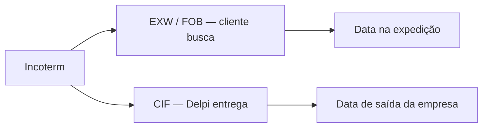

# Glossário de termos relacionados — Portal Comercial

> **Catálogo ao usuário (definição + onde aparece):** Ajuda no Portal (`/apps/commercial/help` → **Catálogo de termos**). Fonte: `plugins/commercial/src/content/userManualTermCatalog.ts` (reusa `CM_HELP`).  
> **Espelho:** [MANUAL-USUARIO-PORTAL-COMERCIAL.md](./MANUAL-USUARIO-PORTAL-COMERCIAL.md) § 7.

Este arquivo guarda as **relações** entre Incoterm e datas (não duplicar o catálogo inteiro).

---

## 1. Família Incoterm (quem busca × quem entrega)

**Incoterm** (*International Commercial Terms*) é a condição comercial do pedido. No dia a dia Delpi resume **quem paga o frete** e **o que a data de entrega representa** — não é a chegada física no endereço do cliente.

| Termo | Significado | Quem busca / entrega | O que a **Data de entrega** representa |
|-------|-------------|----------------------|----------------------------------------|
| **EXW** | *Ex Works* — na origem / na fábrica | **Cliente busca** | Data na **expedição** (pronta para retirada) |
| **FOB** | *Free On Board* — frete por conta do comprador | **Cliente busca** / assume o transporte | Data na **expedição** (pronta para retirada) |
| **CIF** | *Cost, Insurance and Freight* — frete por conta do vendedor | **Delpi entrega** | Data de **saída da empresa** |

Na proposta comercial (PDF), FOB aparece como «por conta do comprador» e CIF como «por conta do vendedor».

Não afirmar chegada ao cliente só porque a data de entrega chegou.

---

## 2. Datas da linha (não são a mesma coisa)

Campo de API permanece `data_entrega` / `data_despacho` / `previsao_entrega_op`. Só o **rótulo e o help** mudam.

| Termo na UI | Campo | Relaciona-se com | Não é |
|-------------|-------|------------------|-------|
| **Data de entrega** | `data_entrega` | Incoterm (tabela acima). Compromisso da linha; atraso e filtros de janela usam esta data. | Chegada no cliente; data da NF |
| **Data de despacho** | `data_despacho` | Saída **registrada** da fábrica. Pode estar vazia («Não informado»). | O compromisso (use Data de entrega) |
| **Previsão entrega (OP)** | `previsao_entrega_op` | Disponibilidade pela cobertura FIFO das OPs. O badge compara com a **Data de entrega**. | Compromisso comercial |
| **Data de faturamento** (OTD / NF) | DatFat / nota | Pontualidade OTD: faturamento real × prometida. ROL e série de faturamento. | A coluna de Meus Pedidos |

**Relação operacional**

1. A **OP** prevê quando o produto fica pronto.  
2. A **Data de entrega** é o compromisso comercial (lido pelo Incoterm).  
3. A **Data de despacho** registra a saída, quando houver.  
4. O **faturamento** (NF) é outro evento — usado em OTD, ROL e «Pronto para faturar».

---

## 3. Termos vizinhos (para não misturar)

| Termo | Relaciona-se com | Significado no Portal |
|-------|------------------|------------------------|
| **Pedido** | Linha em aberto, Data de entrega | Operação / fábrica |
| **OV** | Oportunidade | Proposta comercial (não é o pedido) |
| **Proposta (ADY)** | Documento + PDF | Pode citar FOB/CIF no frete |
| **FIFO** | Estoque alocado, Pode faturar | Fila de estoque entre linhas |
| **OTD** | Data prometida × DatFat | Pontualidade de faturamento |
| **ROL** | Faturamento no período | Indicador — não é carteira aberta |
| **Atraso (dias)** | Data de entrega | Dias desde o compromisso, com saldo em aberto |

---

## 4. Onde aparece no produto

| Superfície | O que o usuário vê |
|------------|--------------------|
| Meus Pedidos — coluna / help `?` | Data de entrega + Incoterm |
| Ficha da linha / timeline da OP | Mesmo rótulo e help |
| Conta 360 — linhas do pedido | Data de entrega |
| Manual / Ajuda | FAQ + glossário |
| OTD | «Data de faturamento» = NF (DatFat), distinta da coluna de Meus Pedidos |

Catálogo de help: `plugins/commercial/src/content/helpTooltips.ts` (`OPEN_ORDER_DELIVERY_DATE_HELP`).
