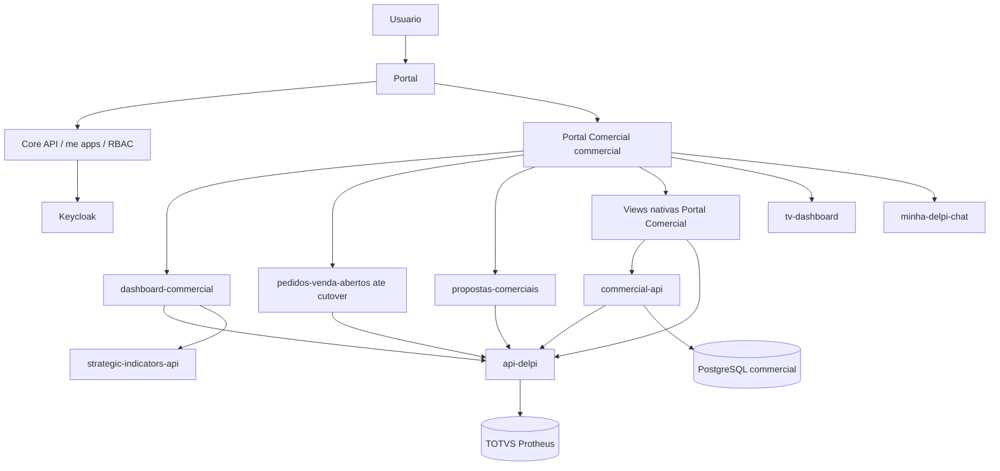
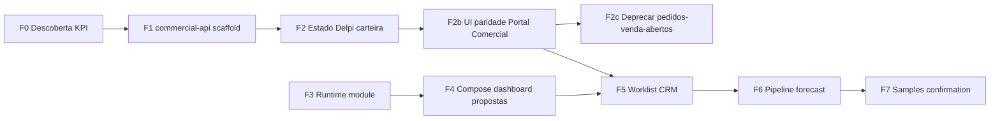

# PLAYBOOK — Portal Comercial (Minha DELPI)

> **Status:** playbook oficial do repositório  
> **Data:** 5 de agosto de 2026  
> **Nome ao usuário (pt-BR):** **Portal Comercial**  
> **Identificador técnico:** `commercial`  
> **Caminho:** `docs/12-roadmap-e-evolucao/commercial/PLAYBOOK-MODULO-COMERCIAL.md`  
> **Fonte funcional:** consolidação reunião 30/07/2026 + Demandas de TI + inventário do monorepo  
> **Complementos:** [INVENTARIO-ATIVOS.md](./INVENTARIO-ATIVOS.md) · [PLAYBOOK-01-fronteiras-api-delpi.md](./PLAYBOOK-01-fronteiras-api-delpi.md) · [API-ROUTES.md](./API-ROUTES.md) · [DATA-MODEL.md](./DATA-MODEL.md) · [WIREFRAMES.md](./WIREFRAMES.md) · [adr/ADR-001-commercial-api.md](./adr/ADR-001-commercial-api.md)

---

## 1. Propósito

Este playbook é o plano mestre de **produto, arquitetura e implementação** do **Portal Comercial**. Define o que o usuário poderá fazer, onde cada capacidade vive na plataforma e a ordem de entrega, alinhado às regras `.cursor` e ao código existente.

O nome **Portal Comercial** (pt-BR) sinaliza ao usuário que a aplicação **abrange várias funcionalidades** do domínio comercial (carteira, pedidos, análises, CRM, etc.), não um único relatório.

Não autoriza implementação indiscriminada. Prioriza fases com gates. É uma **nova aplicação** da Minha DELPI. O plugin `pedidos-venda-abertos` (Portal do Vendedor) será **depreciado somente após paridade funcional completa** no Portal Comercial — ver § 2.1.

### 1.1 Pilares funcionais

1. **Meu dia** — follow-ups, tarefas, propostas paradas, pedidos críticos, SLAs.
2. **Prospects** — cadastro, qualificação, cadência, conversão, histórico.
3. **Conta 360** — visão contínua prospect/cliente, carteira, propostas, pedidos, visitas.
4. **Oportunidades e pipeline** — etapas, aging, probabilidade, motivos, cobertura de meta.
5. **Ofertas e propostas** — produtividade, SLA por área, hit rate, emissão (plugin existente).
6. **Forecast** — pipeline / melhor caso / commit / realizado, versões, aprovação.
7. **Pedidos e entregas** — abertos, confirmação, OTD, parciais, faturado não embarcado.
8. **Amostras e novos negócios** — etapas, prazos, conversão.
9. **Visitas e relacionamento** — preparação, agenda, notas, ações.
10. **Análises gerenciais** — ROL, carteira, MTD/YTD, produtividade, rentabilidade autorizada.
11. **Gestão à Vista e GR** — painéis TV, justificativas, planos de ação.
12. **Administração** — carteiras, segmentos, SLAs, motivos, metas, auditoria.

### 1.2 Matriz dores × cobertura

Fonte: síntese da reunião Comercial (jul/2026) + Demandas de TI.  
**Dor central:** o Comercial não possui visão única, confiável e rastreável do ciclo (prospecção → oferta → pedido → entrega) e depende de informações fragmentadas e controles manuais.

**Legenda de cobertura no playbook**

| Valor | Significado |
|-------|-------------|
| **Sim** | Dor endereçada no roadmap/catálogo com IDs ou contratos |
| **Parcial** | Coberto em parte (dado/UI existe ou só visão futura incompleta) |
| **Fora** | Não é dono o Portal Comercial — outro domínio; só consome/exceção/deep link |
| **Bloqueado** | Previsto, mas exige política/ficha/ADR antes de liberar |

| # | Dor | Cobertura | Onde no playbook / docs | Fase / prioridade | Lacuna residual |
|---|-----|-----------|-------------------------|-------------------|-----------------|
| S | Visão comercial única sem eliminar apps atuais | **Sim** | § 2.1 coexistência; Portal Comercial | F2b+ | — |
| 1 | Informações fragmentadas; página central (faturado, carteira, gap, ofertas, atenção, atrasos) | **Parcial** | § 1.1 pilares; KPI-\*; MOD-\*; [WIREFRAMES](./WIREFRAMES.md) WF-01 | F0 + cockpit + F2b | Home gestão ainda depende de fichas KPI e consolidado de carteira |
| 2 | Acompanhamento gerencial (ROL, carteira, ROL+carteira, MTD/YTD, ticket, amostras, pedidos…) | **Parcial** | § 7.2; § 10 dicionário; dashboard-commercial | F0 → evolução cockpit | Ticket, carteira futura, amostras no painel sem fórmula/rota fechada |
| 3 | Ofertas sem rastreabilidade de etapa/SLA/gargalo/follow-up; preservar hit rate | **Parcial** | OFF-\*; settings SLA; propostas existentes | P0 hit rate; P1 SLA etapas | Stage history multiárea e SLA entre áreas ainda novos (F6+) |
| 4 | Carteira e projeções pouco claras; diferença carteira Comercial × PCP | **Parcial** | KPI-002, KPI-008–010; FCT-\* | P0/P1 + F6 forecast | Visualização consolidada mês/ano e vs PCP sem contrato; postergações a modelar |
| 5 | Visão rápida do vendedor (Conta 360: faturamento, carteira, pedidos, ofertas, follow-up, forecast) | **Parcial** | CLI-\*; WF-03/04; accounts 360 ([API-ROUTES](./API-ROUTES.md)) | F2b paridade; F5+ 360 completo | Ofertas/follow-up/forecast na conta após F5 |
| 6 | Cadastro/segmentação (segmento, família, vendedor, WEG) | **Parcial** | ADM-\*; `reference_*` ([DATA-MODEL](./DATA-MODEL.md) M5) | M5 + ADR fonte | Fonte TOTVS vs cadastro complementar indefinida |
| 7 | Indicadores de cliente (ativo, novo, recuperado, ticket, frequência) | **Parcial** | § 10; novos clientes nas rotas `/commercial` | F0 obrigatório | Regras de classificação não formalizadas |
| 8 | Prazo e ciclo de amostras | **Sim** | SMP-\*; DATA-MODEL M4; API `/samples` | F7 / P1 | Sem wireframe dedicado; sem dado em produção |
| 9 | Confirmação de pedidos lenta e pouco mensurada | **Sim** | ORD-004–007; `order_confirmation_*` | F7 / P1 | Workflow novo; depende de adesão das áreas |
| 10 | OTD e rastreabilidade ponta a ponta + causas | **Parcial** | ORD-008–011; OTD api-delpi | OTD parcial hoje; causas/timeline P1 | Distinção atraso interno/cliente/transporte incompleta |
| 11 | Faturado e não embarcado + justificativa 24h | **Parcial** | ORD-012–013; API-ROUTES § 6 condicional | F7 + rota TOTVS nova | **Sem operationId** ainda na api-delpi |
| 12 | Código de barras / inventário / conferência expedição (000697) | **Fora** | Integração / outro domínio | — | Comercial só consome status/exceção; não implementa WMS |
| 13 | Problemas de entrega sem histórico gerencial / GR | **Sim** | `delivery_exceptions`; GAV-\* | F7 + TV | Painéis Comercial no tv-dashboard a definir |
| 14 | Capacidade produtiva para negociar volume/prazo | **Parcial** | ORD-015–016 | P2–P3 | Read model; dono = Produção/PCP |
| 15 | Rentabilidade sem acesso/regra clara | **Bloqueado** | FIN-\*; profitability API | P2 após política | Sem liberação sem FIN-004 + auditoria |
| 16 | Boletos/operações com alçada e auditoria | **Sim** (previsto) | FIN-007–008; `approvals` | P1 | Contrato TOTVS + alçadas pendentes |
| 17 | Limitações TOTVS/CRM → Delpi + banco próprio | **Sim** | ADR-001; [PLAYBOOK-01](./PLAYBOOK-01-fronteiras-api-delpi.md) | F1+ | — |
| 18 | Gestão à Vista e GR automatizados | **Parcial** | GAV-\*; tv-dashboard | P1–P2 | TV existe; painéis + justificativa persistente a construir |

**Prioridade acordada (reunião):** começar pela **visão gerencial**, mapeando o que já existe e centralizando inicialmente **carteira, projeções e indicadores principais** (F0 → evolução cockpit + F2/F2b), sem esperar CRM completo (F5+).

**Atualização:** esta matriz deve ser revisada ao fechar cada gate de fase (F0, F2b, F7, GAV).

---

## 2. Decisões irrevogáveis

### 2.1 Identidade, coexistência e depreciação

| Camada | Valor |
|--------|--------|
| `id` / `basePath` técnico | `commercial` / `/apps/commercial` |
| Nome no launcher e manifests (pt-BR) | **Portal Comercial** |
| Escopo de produto | Hub de várias capacidades comerciais |

**Ordem de produto (obrigatória):**

1. **Implementar primeiro** no Portal Comercial (UI + `commercial-api` + reads api-delpi) **todas** as funcionalidades hoje cobertas por `pedidos-venda-abertos` (carteira, pedidos em aberto, check-up cliente, config de vendedores, avatars, etc.).
2. Manter `pedidos-venda-abertos` **ativo e suportado** em paralelo até o gate de paridade.
3. **Depreciar** `pedidos-venda-abertos` (ocultar do launcher / marcar deprecated / comunicar cutover) **somente** quando a checklist de paridade (§ 2.1.1) estiver 100% homologada.
4. Remoção definitiva do código/manifest fica em ADR posterior — depreciação ≠ delete imediato.

**Não autorizado antes da paridade:**

- Remover, desregistrar ou esconder `pedidos-venda-abertos` do launcher.
- Alterar `id` / `basePath` de `pedidos-venda-abertos` para forçar migração.
- Inventar runtime de módulo só para o Comercial.
- Remover `dashboard-commercial` ou `propostas-comerciais` neste playbook (permanecem compostos / coexistentes até decisão própria).

**Autorizado:**

- Entregar o Portal Comercial como entrada principal do domínio.
- Absorver UX e jornadas do Portal do Vendedor **dentro** do Portal Comercial (reimplementação no módulo, não fork do código do plugin antigo).
- Rotas de composição para dashboard/propostas enquanto fizer sentido.
- Acesso direto a `pedidos-venda-abertos` **até** o cutover de depreciação.

#### 2.1.1 Gate de paridade — `pedidos-venda-abertos` → Portal Comercial

Depreciação liberada só se **todas** as linhas estiverem ✅ (owner Comercial + QA):

| Capacidade do Portal do Vendedor | Evidência no Portal Comercial |
|----------------------------------|-------------------------------|
| Lista de pedidos em aberto (TOTVS) | Tela equivalente + mesmos filtros essenciais |
| Ops abertas / indicadores operacionais equivalentes | Equivalente ou superior documentado |
| Minha carteira / lista de clientes | Equivalente |
| Detalhe / check-up do cliente | Equivalente |
| Configuração de vendedores e carteiras (admin) | Equivalente via `commercial-api` |
| Avatar de cliente | Equivalente |
| Deep links `codigo`+`loja` | Preservados ou redirecionados |
| Permissões (access / admin) mapeadas | RBAC testado (403) |
| Favoritos / URLs antigas | Redirect ou período de convivência documentado |

Checklist viva: evoluir em `HOMOLOGACAO-PARIDADE-PEDIDOS.md` quando a implementação avançar.

### 2.2 Fronteira de backend (ADR-001)

| Serviço | Fica com |
|---------|----------|
| **api-delpi** | SQL TOTVS; KPIs `/commercial/*`; pedidos/propostas **read**; enrichment |
| **commercial-api** | Estado Delpi de carteira/avatar (migração F2, GET+CRUD); CRM; workflows; auditoria; outbox |
| **strategic-indicators-api** | Metas / catálogo de indicadores |
| **Core API** | Manifests, `/me/apps`, RBAC de apps |

Detalhe: [PLAYBOOK-01-fronteiras-api-delpi.md](./PLAYBOOK-01-fronteiras-api-delpi.md).

### 2.3 Frontend

- Plugins MFE + Module Federation.
- Componentes transversais em **`@delpi/plugin-ui`** (zero CSS de kit no MFE).
- Shell / app `plugins/commercial` (**Portal Comercial**) + views de workspace (carteira, pedidos, CRM).
- Modais contidos no host (`mfe-modal-host-contained`).
- Prioridade de entrega: **jornadas do Portal do Vendedor no Portal Comercial** antes de expandir CRM avançado além do necessário para paridade.

### 2.4 Naming

| Camada | Idioma / valor |
|--------|----------------|
| Paths, `operationId`, entities, tables, permission codes, `id` do app | **English** (`commercial`, `seller-portfolios`, …) |
| Labels de menu, launcher, mensagens ao usuário, help tooltips | **pt-BR** — produto = **Portal Comercial** |

Exemplos técnicos: `seller-portfolios`, `order-confirmations`, `commercial.opportunities.manage`.  
Exemplos ao usuário: «Portal Comercial», «Minha carteira», «Pedidos em aberto», «Oportunidades».

### 2.5 Runtime de módulo

Registrar `type: module` **somente** após o [roadmap plugin × módulo](../../05-plugin-system/roadmap-implementacao-plugin-modulo.md) (schema 1.1.0, `RouteDelegate`, `@delpi/module-runtime`). Até lá: o Portal Comercial pode existir como **plugin** (`type: microfrontend` / `plugin`) com as telas de paridade; composição de dashboard/propostas via links ou, depois, module runtime. F1–F2 (API) **não** dependem do runtime.

---

## 3. Diagnóstico (resumo)

Baseline detalhada: [INVENTARIO-ATIVOS.md](./INVENTARIO-ATIVOS.md).

| Ativo | Estado | Reuso |
|-------|--------|-------|
| `dashboard-commercial` | Em uso — ROL, OTD, conversão, propostas OV | Cockpit; compor no shell |
| `/commercial/*` api-delpi | ~19 GETs TOTVS | Permanecem |
| `pedidos-venda-abertos` | Portal do Vendedor + carteira | **Fonte de paridade** — ativo até cutover; estado Delpi → `commercial-api`; UX refeita no Portal Comercial |
| `propostas-comerciais` | Lista/detalhe/PDF | Compor (permanece) |
| SI comercial | Metas | Continua |
| `commercial` (**Portal Comercial**) / `commercial-api` | **Inexistentes** | Criar — priorizar paridade com pedidos |
| Runtime módulo 1.1.0 | Spec ok; código pendente | Bloqueia só shell F3–F4 |

---

## 4. Arquitetura alvo



### 4.1 Fluxo HTTP híbrido

```text
MFE analítico existente  → api-delpi → TOTVS
MFE workspace / CRUD     → commercial-api → Postgres
                         → commercial-api → api-delpi → TOTVS
```

### 4.2 Pacotes alvo

| Pacote | Papel |
|--------|--------|
| `commercial-api/` | Backend dedicado |
| `plugins/commercial/` | App **Portal Comercial** (shell + views de carteira/pedidos/CRM) |
| `plugins/plugin-ui` | Kit visual compartilhado |
| `pedidos-venda-abertos` | Legado ativo até gate § 2.1.1; depois depreciado |
| `dashboard-commercial`, `propostas-comerciais` | Permanecem; compostos quando útil |

Referência de scaffold: `transformometro-api` + [novo-plugin-mfe-checklist.md](../../05-plugin-system/novo-plugin-mfe-checklist.md).

> Nota: `commercial-workspace` como MFE separado é opcional; o default deste playbook é concentrar a UX do Portal Comercial em `plugins/commercial` (várias rotas internas), evitando fragmentar a paridade com o Portal do Vendedor.

### 4.3 Separação de responsabilidades

- Domain sem import de infra.
- Use case orquestra; ports + adapters implementam.
- Frontend não conhece tabelas TOTVS.
- commercial-api **não** duplica SQL canônico da api-delpi.
- api-delpi **não** recebe workflows CRM por conveniência.
- KPIs calculados no backend com fórmula, escopo e freshness.
- Módulo shell não importa código dos plugins filhos.

---

## 5. Personas e escopo de dados

| Persona | Necessidade | Escopo padrão |
|---------|-------------|---------------|
| Vendedor | Rotina, carteira, oportunidades, pedidos | `own` |
| Analista Comercial | Ofertas, qualidade, suporte | Filiais autorizadas |
| Supervisor | Equipe, forecast approve | `team` |
| Gerente / Diretor | Consolidado, rentabilidade autorizada | `branch` / `all` |
| Áreas de apoio | Filas atribuídas | Só casos da área |
| Admin funcional | Catálogos, SLAs | Config |
| Auditor | Trilha | Read audit |

A API valida: permissão funcional + filial + escopo (`own|team|branch|all`) + sensibilidade + atribuição. UI nunca é a única barreira.

---

## 6. Arquitetura de informação (IA)

```text
Comercial — Portal Comercial
├── Início — Meu dia, Cockpit, Alertas
├── Contas — Prospects, Carteira, Conta 360, Planos, Visitas
├── Pipeline — Oportunidades, Ofertas, Follow-ups, Forecast
├── Pedidos e entregas — Abertos, Confirmação, OTD, Exceções
├── Novos negócios — Amostras, Novos/recuperados
├── Análises — ROL/carteira, Produtividade, Rentabilidade, GAV
├── Ferramentas — Propostas, CX, Agenda, Relatórios, Chat
└── Administração — Carteiras, Segmentos, SLAs, Motivos, Auditoria
```

`menuStrategy: mixed` — home por papel; menu lateral por domínio; detalhe oculto do menu; `onDenied: hide`.

Wireframes de tela: [WIREFRAMES.md](./WIREFRAMES.md).

---

## 7. Catálogo de funcionalidades (com estado)

Legenda de prioridade: **P0** fundação · **P1** operação · **P2** evolução · **P3** futuro/IA.

Legenda de **Estado:** `existente` · `parcial` · `novo` · `outro domínio` · `plataforma`.

### 7.1 Shell e composição

| ID | Funcionalidade | Pri | Estado |
|----|----------------|-----|--------|
| MOD-001 | Entrada **Portal Comercial** no launcher | P0 | novo |
| MOD-002 | Home por papel | P0 | novo |
| MOD-003 | Rotas declarativas plugin/view | P0 | plataforma / novo |
| MOD-004 | Preservar filtros entre rotas | P0 | novo |
| MOD-005 | Deep links / refresh | P0 | novo |
| MOD-006 | RBAC módulo + destino | P0 | novo |
| MOD-007 | Menu agrupado / hide denied | P0 | novo |
| MOD-008 | Breadcrumb retorno ao módulo | P0 | novo |
| MOD-012 | Indisponibilidade parcial | P0 | novo |
| MOD-013 | Apps atuais acessíveis **até** cutover de depreciação | P0 | existente |
| MOD-014 | Aliases `/apps/commercial/*` | P0 | novo |
| MOD-015 | Acesso direto legado + contextual Portal Comercial | P0 | existente / novo |
| MOD-016 | Rotas novas só para gaps (após paridade pedidos) | P0 | novo |
| MOD-018 | Paridade funcional vs `pedidos-venda-abertos` (§ 2.1.1) | P0 | novo |
| MOD-019 | Depreciação de `pedidos-venda-abertos` **após** paridade | P0 | novo (só pós-gate) |
| MOD-009–011, 017 | Telemetria, flags, favoritos, label destino | P1 | novo |

### 7.2 Cockpit gerencial

| ID | Funcionalidade | Pri | Estado |
|----|----------------|-----|--------|
| KPI-001–005 | ROL, carteira, ROL+carteira, MTD/YTD, comparação anos | P0 | parcial (ROL/séries existem; carteira consolidada a formalizar) |
| KPI-006–007 | Projeção e gap vs meta | P0 | parcial (SI + dashboard) |
| KPI-011–012 | Dimensões + freshness | P0 | parcial |
| KPI-008–010, 013–014 | Bruto/líquido, PCP, drill-down, cenários | P1 | parcial / novo |
| KPI-015 | Alertas deterioração | P2 | novo |

**Dono de dados:** api-delpi + `dashboard-commercial` (+ SI). Não mover SQL para commercial-api.

### 7.3 Worklist

| ID | Funcionalidade | Pri | Estado |
|----|----------------|-----|--------|
| WRK-001–009 | Fila, follow-ups, ações, delegar | P1 | novo → commercial-api |
| WRK-010–012 | Cadências, NBA, digest | P2 | novo |

### 7.4 Prospects

| ID | Funcionalidade | Pri | Estado |
|----|----------------|-----|--------|
| PRO-001–006, 010–012, 018–020 | Cadastro, status, contatos, fila, conversão | P0 | novo |
| PRO-007–009, 014–017, 021–023, 025–026 | Qualificação, funil, Conta 360 pré-cliente | P1 | novo |
| PRO-013, 024 | Cadências, import | P2 | novo |

### 7.5 Conta 360 e carteira

| ID | Funcionalidade | Pri | Estado |
|----|----------------|-----|--------|
| CLI-001–005 | Identidade, minha carteira, busca, faturamento, pedidos | P0 | parcial (Portal do Vendedor) |
| CLI-006–011, 016–017 | Ofertas/oportunidades, timeline, contatos, transferência | P1 | parcial / novo |
| CLI-012–015, 018 | Plano, saúde, CX, mapa influência, duplicidade | P2–P3 | novo / outro domínio |

**Carteira / avatar Delpi:** migrar **todas** as rotas não-TOTVS (GET `sellers/*` + writes + avatars) para commercial-api (F2). Ver [INVENTARIO § 3.2](./INVENTARIO-ATIVOS.md).

### 7.6 Oportunidades

| ID | Funcionalidade | Pri | Estado |
|----|----------------|-----|--------|
| OPP-001–012 | Cadastro, pipeline, aging, motivos, cobertura | P1 | novo |
| OPP-013–014 | Alterações, score regras | P2 | novo |
| OPP-015 | Score preditivo | P3 | novo |

### 7.7 Ofertas / propostas

| ID | Funcionalidade | Pri | Estado |
|----|----------------|-----|--------|
| OFF-001–003, 010, 012 | Contagens, hit rate, PDF plugin | P0 | parcial |
| OFF-004–009, 011 | Valor, tempos, SLA, follow-up, revisões | P1 | parcial / novo |
| OFF-013–016, 019 | Templates, preço, aprovação, conversão pedido | P2 | novo |
| OFF-017–018 | CPQ assistido, cross-sell | P3 | novo |

### 7.8 Forecast

| ID | Funcionalidade | Pri | Estado |
|----|----------------|-----|--------|
| FCT-001–008 | Ciclos, categorias, submit/approve, acurácia | P1 | novo |
| FCT-009–012 | Slippage, simulação, quotas, alertas | P2 | novo |

### 7.9 Pedidos e entrega

| ID | Funcionalidade | Pri | Estado |
|----|----------------|-----|--------|
| ORD-001–003 | Lista aberta, por cliente/carteira, saldos | P0 | existente / parcial |
| ORD-008 | OTD | P0/P1 | parcial (KPI/painel existem) |
| ORD-004–007, 009–014 | Confirmação, SLA, parciais, causas, faturado n/embarcado | P1 | novo (workflow) + dados TOTVS |
| ORD-015–017 | Capacidade, ATP, WEG | P2–P3 | novo / outro domínio |

### 7.10 Amostras, visitas, rentabilidade, GAV, admin, NTF, IA

Resumo — detalhamento completo no documento de consolidação de produto; IDs preservados:

| Faixa | Pri dominante | Estado |
|-------|---------------|--------|
| SMP-001–010 | P1–P2 | novo |
| VIS-001–009 | P1–P3 | parcial (CX) / novo |
| FIN-001–010 | P0 política antes de liberar; P1–P3 features | novo |
| GAV-001–010 | P1–P2 | parcial (`tv-dashboard`) |
| ADM-001–014 | P0–P2 | parcial (carteira) / novo |
| NTF-001–009 | P1–P2 | novo |
| AI-001–010 | P3 | novo — só via Minha DELPI Chat + contratos |

---

## 8. Modelo conceitual commercial-api (núcleo)

| Área | Entidades (EN) |
|------|----------------|
| CRM | `opportunities`, `opportunity_stage_history`, `opportunity_products`, `activities`, `tasks` |
| Conta | `account_plans`, `account_plan_actions`, `visits` |
| Forecast | `forecast_cycles`, `forecast_submissions`, `forecast_items`, `forecast_approvals`, `forecast_snapshots` |
| Operações | `sample_developments`, `order_confirmation_cases`, `delivery_exceptions` |
| Admin | `reference_*`, `sla_policies`, `audit_log`, `integration_outbox` |
| Carteira (F2) | `seller_portfolios`, `seller_customers`, `customer_avatars` |

**Estrutura física (colunas, tipos, FKs, ondas M1–M5):** [DATA-MODEL.md](./DATA-MODEL.md).  
**Rotas HTTP (commercial-api + api-delpi):** [API-ROUTES.md](./API-ROUTES.md).

Regras: migrations imutáveis; sem reset em prod; UTC; soft delete quando histórico; optimistic locking; anexos em volume persistente.

---

## 9. Permissões (proposta)

### 9.1 Módulo / commercial-api

```text
commercial.access
commercial.home.view
commercial.worklist.view
commercial.accounts.view
commercial.accounts.manage
commercial.pipeline.view
commercial.opportunities.manage
commercial.followups.manage
commercial.forecast.view
commercial.forecast.submit
commercial.forecast.approve
commercial.samples.view
commercial.samples.manage
commercial.order-confirmation.view
commercial.order-confirmation.manage
commercial.delivery-exceptions.view
commercial.profitability.view
commercial.profitability.export
commercial.settings.manage
commercial.audit.view
commercial.seller-portfolios.manage
```

### 9.2 Plugins filhos (preservados)

```text
dashboard-commercial.view
pedidos-venda-abertos.access
pedidos-venda-abertos.admin
propostas-comerciais.view
```

`commercial.access` **não** concede acesso automático aos destinos.

---

## 10. Dicionário de indicadores (obrigatório antes de codificar como definitivo)

Cada KPI crítico precisa de ficha: código, fórmula, fontes, inclusões/exclusões, owner, freshness, versão, rota/`operationId`.

| Indicador | Decisões pendentes típicas | Estado técnico |
|-----------|----------------------------|----------------|
| ROL | Impostos, devoluções, competência | Rotas `/commercial` existem |
| Carteira | Fonte, cancelados, bruto/líquido | A formalizar |
| Hit rate | Universo elegível, revisões | Rota closing-rate existe |
| OTD | Solicitado/confirmado, parciais | Painel/série existem |
| Cliente ativo/novo/recuperado | Janelas de evento | Parcial |
| Ticket médio | Unidade de contagem | Pendente |

**Gate F0:** nenhuma métrica P0 sem owner + fórmula + fonte.

---

## 11. Roadmap de implementação



| Fase | Objetivo | Gate |
|------|----------|------|
| **F0** | Owners, fichas KPI, inventário validado, ADR-001 aceito | Métricas P0 com fórmula/fonte |
| **F1** | Scaffold `commercial-api`, Compose, health, OpenAPI, auth | Smoke health + JWT |
| **F2** | Migrar **todas** rotas Delpi de `pedidos-venda-abertos` (GET sellers + CRUD + avatars) para `commercial-api` | Dual-read OK → cutover API; § 3.2 deprecado na api-delpi |
| **F2b** | Entregar no **Portal Comercial** (`plugins/commercial`) a **paridade UX** do Portal do Vendedor (pedidos, carteira, check-up, admin) | Checklist § 2.1.1 100% ✅ |
| **F2c** | Depreciar `pedidos-venda-abertos` (launcher / comunicação / redirects) | Só após F2b; ADR de cutover |
| **F3** | Runtime plugin×módulo plataforma (Core + Portal) | Fixture module compõe plugin real |
| **F4** | Compor dashboard / propostas no Portal Comercial (quando runtime pronto) | Sem regressão das rotas originais desses apps |
| **F5** | Worklist: tasks, activities, timeline, audit, outbox | Task own/team com auditoria |
| **F6** | Opportunities + forecast | Fluxo completo + RBAC |
| **F7** | Samples + order confirmation + exceções entrega | Caso com SLA e timeline |
| **F8+** | Rentabilidade, GAV, territórios, WEG, IA | Política + dados maduros |

**Prioridade:** F1 → F2 → **F2b** (lógica e telas no Portal Comercial) **antes** de expandir CRM avançado (F5+) além do necessário à paridade. **F2c** nunca antecipa F2b.

**Cockpit analítico** evolui em paralelo em `dashboard-commercial` + api-delpi.

### Sequência executável imediata

1. Homologar este playbook + F0 com Comercial.
2. Scaffold `commercial-api` (F1).
3. Migrar estado Delpi carteira/avatar (F2).
4. Implementar jornadas do Portal do Vendedor **no Portal Comercial** (F2b).
5. Só então depreciar `pedidos-venda-abertos` (F2c).
6. Em paralelo quando possível: runtime de módulo (F3–F4).
7. CRM avançado (F5+).

---

## 12. Gates `.cursor` (obrigatórios)

| Tema | Regra / doc |
|------|-------------|
| Índice | `development-standards-index.mdc` |
| Rota TOTVS nova | `new-api-route-checklist.mdc`, `api-delpi-openapi-route-standards.mdc`, `api-delpi-response-contract.mdc` |
| Clean Architecture | `clean-architecture-chat-api.mdc` (padrão de camadas), `clean-code-architecture-guardrails.mdc` |
| Fronteira / causa raiz | `centralized-rules-first.mdc`, `root-cause-generalized-fix.mdc` |
| UI kit | `plugins-reusable-components.mdc`, `plugins-visual-design-system.mdc` |
| Modal | `mfe-modal-host-contained.mdc` |
| Upload | `persistent-upload-storage.mdc` |
| Migrations | `migrations-immutable-checksum.mdc`, `plugins-migrations-no-reset-prod.mdc` |
| Deploy | `infra-sequential-container-startup.mdc` |
| Chat/TV apresentação | `schema-first-presentation-delivered.mdc` (só quando rota for consumida) |
| SQL TOTVS | `sql-query-development.mdc`, `totvs-product-patterns.mdc` |
| Doc plugin | `plugins-documentation.mdc` |
| Teste | `test-and-commit.mdc` |

### Checklist por PR (API ou MFE Comercial)

1. Fronteira respeitada (TOTVS só api-delpi)?
2. Nomes técnicos EN; PT só usuário?
3. Permissão validada na API?
4. Teste de regressão / smoke?
5. UI via `plugin-ui` (sem CSS kit no MFE)?
6. Migration nova (nunca edit de aplicada)?
7. Volume Compose se houver upload?
8. Documentação da pasta `commercial/` ou do plugin atualizada?
9. Escalabilidade (§ 14): paginação, sem N+1 TOTVS, feature isolada, sem god class?

---

## 13. Testes

### 13.1 APIs

- Unidade domínio; use cases com fakes; SQL só na api-delpi.
- Contrato HTTP envelope + `operationId`.
- 401/403/404/409/422; escopo own/team/branch/all.
- Idempotência; concorrência; auditoria; reconciliação pós-migração F2.

### 13.2 Frontend

- Rotas e permissões; filtros/URL; empty/loading/error parcial.
- Tema claro/escuro; modal contido; build federado `remoteEntry.js`.

### 13.3 E2E prioritários

1. Vendedor → Comercial → Cliente 360 → pedido atrasado.
2. Criar oportunidade → follow-up → forecast submit.
3. Supervisor aprova forecast.
4. Cutover carteira: admin cria portfolio na commercial-api; listagens TOTVS intactas.
5. Sem rentabilidade → 403 API e UI.
6. Filial A não lê filial B.
7. Plugin filho indisponível → demais rotas ok.
8. Manifest rollback restaura navegação.

### 13.4 Deploy

Scripts sequenciais: `infra/scripts/up-dev-sequential.sh` / `up-prod-sequential.sh` — nunca `compose up --build` em lote sem perfil.

---

## 14. Escalabilidade, resiliência e performance

O Portal Comercial deve nascer **escalável por desenho**, não por refactor tardio. Esta seção é obrigatória em qualquer PR de fundação (F1–F2b) e nas expansões F5+.

### 14.1 Princípios

| Princípio | Aplicação |
|-----------|-----------|
| **Separação de bounded contexts** | TOTVS só na api-delpi; workflows Delpi só na `commercial-api`; MFE sem regra de cálculo |
| **API stateless** | `commercial-api` horizontalmente escalável; sessão só via JWT; sem estado em memória de processo |
| **Crescimento por fase** | Entregar fatias (F2 carteira → F5 CRM → F6 pipeline → F7 operações); feature flags por capacidade |
| **Contratos estáveis** | `operationId` imutável; evolução com versionamento de campo/`dataVersion`, não breaking silencioso |
| **Paginação e filtros no servidor** | Listas grandes (pedidos, carteira, audit, opportunities) nunca “trazer tudo” para o browser |
| **Sem N+1 TOTVS** | Gateway com batch/`enrich` e cache TTL onde o dashboard repete a mesma chave |
| **Read models para painéis** | Home/cockpit não disparam dezenas de SQL síncronos; preferir agregados/cache invalidável |
| **Outbox / eventos** | Side-effects (notificação, GR, SI) via `integration_outbox`, não acoplados ao request |
| **Degradação parcial** | Falha de um domínio (ex.: OTD) não derruba Início nem carteira (MOD-012) |
| **RBAC na API** | Escopo `own\|team\|branch\|all` resolvido no backend — escala de usuários sem “filtro só no front” |
| **Migrations forward-only** | Schema `commercial` cresce por ondas M1–M5; sem reset em prod |
| **UI modular no MFE** | `plugins/commercial` com features por pasta; extrair MFE só se bundle/federação exigir (ADR) |
| **Kit compartilhado** | `@delpi/plugin-ui` — não duplicar chrome; escala de telas sem explodir CSS |
| **Observabilidade** | `correlation_id`, `operation_id`, latência, tamanho de outbox; orçamento de latência por jornada |

### 14.2 Anti-padrões (proibidos)

- Copiar SQL Protheus para `commercial-api` “porque é mais rápido”.
- God class / use case único para todo o Comercial.
- Carregar carteira + todos os pedidos + NF no mount da home.
- Polling agressivo sem cache/ETag em rotas TOTVS pesadas.
- Tabela sem índice nas chaves de filtro (`assignee_user_id+due_at`, `customer_code+store`, outbox pendente).
- Anexos só no filesystem do container (sem volume).
- Expandir `pedidos-venda-abertos` em paralelo ao Portal Comercial após F2b iniciado (divergência).

### 14.3 Escala de dados e carga (orçamento inicial)

| Jornada | Orçamento alvo (p95, homolog) | Nota |
|---------|-------------------------------|------|
| Lista open-orders (página) | &lt; 2,5 s frio; melhor com cache se aplicável | Medir SQL (console Saúde) |
| Minha carteira + enrich | &lt; 1,5 s | Batch enrich |
| Conta 360 (F5) | &lt; 3 s com seções paralelas | `allSettled`; seções independentes |
| Worklist `/me` | &lt; 500 ms | Só Postgres commercial |
| Home gestão (KPIs) | degradável; cards independentes | Não bloquear em um KPI |

Revisar orçamentos após primeiras medições reais (F2b homologação).

### 14.4 Escala de produto (muitos módulos)

```text
plugins/commercial/src/
  features/
    home/
    open-orders/
    customers/
    seller-portfolios/
    my-day/          # F5
    prospects/       # F5
    opportunities/   # F6
    forecast/        # F6
    samples/         # F7
  shared/            # http clients, auth, formatters
```

```text
commercial-api/
  …/domain/          # por agregado (portfolio, opportunity, forecast…)
  …/application/     # use cases finos
  …/infrastructure/  # repos, gateways, outbox worker
  …/interfaces/http/ # routers por domínio (handler fino)
```

Novas capacidades = **novo pacote de feature + migration + rotas no [API-ROUTES](./API-ROUTES.md)**, não “mais um if” no router único.

### 14.5 Segurança e operação

- Menor privilégio; rentabilidade com permissão + auditoria + bloqueio TV.
- Logs: `correlation_id`, `user_sub`, `operation_id`, `branch`, `scope`, `latency_ms`, `delegated_from` — sem margem/tokens.
- Cache/read models para painéis; paginação server-side; timeouts no gateway; retries só idempotentes; degradação parcial.
- IA só após dados maduros; confirmação humana; canal Chat existente.
- Deploy: scripts sequenciais (`infra-sequential-container-startup`).

---

## 15. Definition of Ready / Done

**Ready:** persona, regra, fonte/owner, permissão/escopo, contrato, estados/erros, aceite, dependências, auditoria, wireframe suficiente.

**Done:** Clean Architecture; contrato API↔MFE; sem regra duplicada; 403 testado; testes verdes; migrations seguras; docs atualizadas; owner homologou; rollback/flag definido; **princípios de escalabilidade § 14 respeitados**.

---

## 16. Riscos

| Risco | Mitigação |
|-------|-----------|
| Monólito frontend ou API | Features por pasta + routers por domínio (§ 14) |
| Carga TOTVS / N+1 | Gateway batch, cache, read models (§ 14) |
| Escopo «CRM completo» | Gates P0–P3 e fases |
| CRUD crescer na api-delpi | ADR-001 + PLAYBOOK-01 |
| Fórmulas não aprovadas | F0 fichas versionadas |
| Frontend filtrar sem API | Testes 403 |
| Plugin filho fora | Isolamento de erro no shell |
| Upload efêmero | Volume Compose obrigatório |

---

## 17. Governança

| Papel | Responsável sugerido |
|-------|----------------------|
| Owner de negócio | Junior Cesar Pedersetti |
| Validação processos | Junior + Laércio Augusto Koch |
| Arquitetura | Robério Teixeira de Oliveira |
| Data owners KPI | A confirmar por ficha (F0) |

ADRs mínimos: este ADR-001; fonte segmentos/famílias; regra ROL/carteira; escrita TOTVS; rentabilidade; e-mail/calendário; IA; WEG.

---

## 18. Estrutura documental

```text
docs/12-roadmap-e-evolucao/commercial/
├── README.md
├── PLAYBOOK-MODULO-COMERCIAL.md    ← mestre (§ 1.2 matriz dores × cobertura)
├── PLAYBOOK-01-fronteiras-api-delpi.md
├── API-ROUTES.md
├── DATA-MODEL.md
├── WIREFRAMES.md
├── INVENTARIO-ATIVOS.md
└── adr/
    └── ADR-001-commercial-api.md
```

Código alvo (futuro): `commercial-api/`, `plugins/commercial/`, `plugins/commercial-workspace/`.

---

## 19. Referências

### Plataforma

- `docs/05-plugin-system/plugin-vs-module.md`
- `docs/05-plugin-system/manifest-schema-1.1.0.md`
- `docs/05-plugin-system/roadmap-implementacao-plugin-modulo.md`
- `docs/05-plugin-system/novo-plugin-mfe-checklist.md`

### Domínio existente

- `docs/12-roadmap-e-evolucao/pedidos-venda-abertos/`
- `docs/12-roadmap-e-evolucao/propostas-comerciais/`
- `plugins/dashboard-commercial/docs/`
- `api-delpi/docs/api/06-modulos-departamentais.md`
- `strategic-indicators-api/docs/COMMERCIAL_INDICATORS.md`

### Padrões irmãos

- `docs/12-roadmap-e-evolucao/maintenance/PLAYBOOK-01-fronteiras-api-delpi.md`
- `docs/12-roadmap-e-evolucao/transformometro-app/README.md`

### Regras Cursor

Índice: `.cursor/rules/development-standards-index.mdc`.

---

## 20. Conclusão

A Minha DELPI já cobre boa parte da **análise** comercial e o Portal do Vendedor cobre a operação de carteira/pedidos. O caminho sustentável e **escalável** é:

1. Formalizar KPIs (F0).
2. Criar **commercial-api** e migrar estado Delpi de carteira (F1–F2).
3. Entregar o **Portal Comercial** com **paridade completa** do Portal do Vendedor (F2b), com features modulares e API stateless (§ 14).
4. **Depreciar** `pedidos-venda-abertos` somente após o gate § 2.1.1 (F2c).
5. Ampliar CRM, forecast e workflows (F5–F7); depois rentabilidade, GAV, integrações e IA.

Sem SQL TOTVS fora da api-delpi; naming técnico em inglês; ao usuário, o produto chama-se **Portal Comercial**; crescimento por fase e contrato, não por monólito.
