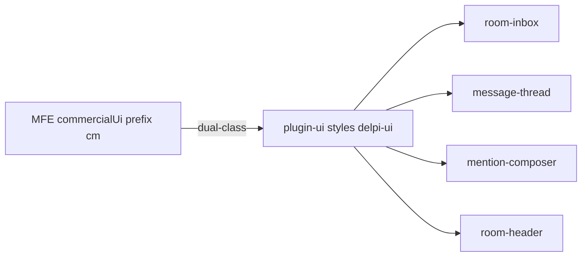
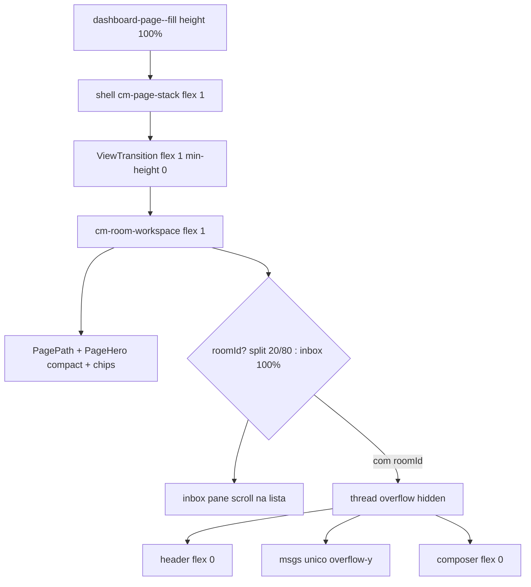
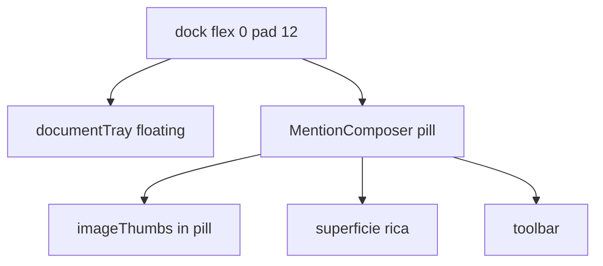
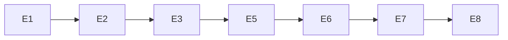

# Portal Comercial — roadmap da Sala de interação

> **Status:** **roadmap sala concluído** (E1–E8). **Extensões:** imagens `attachment:` (ago/2026); identidade Unidade + vista Shared + Find-in-chat (ago/2026).  
> **Relacionados:** [WIREFRAMES.md](./WIREFRAMES.md) WF-SALA · [API-ROUTES.md](./API-ROUTES.md) § 3.21 · [DATA-MODEL.md](./DATA-MODEL.md) § 8.1 · [SCOPE-OWNERSHIP.md](./SCOPE-OWNERSHIP.md) · [plugins/commercial/README.md](../../../plugins/commercial/README.md) · [commercial-api/docs/README.md](../../../commercial-api/docs/README.md)

Documento canônico do **backlog de implementação** da sala (MFE `plugins/commercial` + `commercial-api`). Cada subetapa lista **Front (plugin-ui / kit)**, **Front (MFE commercial)** e **Backend (commercial-api)**. Se a camada não muda, o texto é **nenhum** e o motivo. Sem api-delpi e sem `minha-delpi-ai-api` em qualquer S*. Persistência de mensagem = markdown em `body_text` (coluna TEXT já existe).

Homologação futura usa [`infra/scripts/up-dev-sequential.sh`](../../../infra/scripts/up-dev-sequential.sh) só nos serviços tocados — **não** `docker compose up --build` em lote.

---

## Problema

O visual atual falha porque o split **não herda altura do viewport**, o **Contexto compete com o chat** (até 40vh no fluxo), os filtros **imitam uma segunda TopBar**, e o avatar da lista cai no título «Pedido…» em vez do **cliente**.

## Dono

| Pacote | Papel |
|--------|--------|
| `plugins/commercial` | UX da sala; **nunca** chama `/apps/api-delpi` |
| `commercial-api` | Contrato HTTP, membership, anexos, WS `room.*` |
| `plugins/plugin-ui` | Família colaboração (`MessageThread`, `MentionComposer`, …) |

## Decisões travadas

- **TopBar do módulo** continua em [`PluginShell.tsx`](../../../plugins/commercial/src/app/PluginShell.tsx) (Início / Visão geral / Sala…). Não mover. O que parece «topbar deslocada» é o `UnderlineNav` no hero — **sai**. Filtros da inbox = `CommercialScopeChipBar` no `children` do PageHero, igual Meu Dia / OTD.
- **PagePath:** lista = Início → Sala de interação. Com sala aberta = Sala de interação → **título da sala** (nunca `Sala / Sala`).
- **Contexto:** `RoomSidePanel` à direita da thread (título **Neste chat**). Chat e composer **encolhem**. Sem overlay, sem X no painel; só o ícone `PanelRight` no header faz toggle. `CommercialHostDrawer` permanece só no painel da ficha. Participantes no `RoomHeader` permanecem.
- **Avatar lista (conversa)** = **cliente** (`CustomerAvatar` + `customer_name`; sem código, iniciais do nome do cliente, nunca de «Pedido 10…»).
- **Avatar mensagem** = **usuário autor** (`nameFor` + `InitialsAvatar` do kit) — sem `CustomerAvatar` no thread.
- **Um scroller:** só `.cm-room-thread__msgs`. Kit `message-thread.css`: `overflow: visible` no root da lista (o host rola).
- **Bolhas:** `max-width` na **bolha**, não na row inteira a 75%.
- **Fill:** modificador só nas views da sala (`dashboard-page--fill`), sem mudar o scroll de página do Meu Dia / carteira.
- **Header da conversa (uma linha):** `RoomHeader` `align-items: center`. Visível: **título** · **chave** `02|002573` · **AvatarStack** · **ícone Neste chat** (`PanelRight`, `aria-label` = `contextToggle`). Sem chip «order». Sobre / participantes / pins ficam no painel direito.
- **Feedback pin/erro:** não `StateBanner` acima do título. Só `CommercialAlertQueue` overlay no host `.dashboard-commercial` (não `position:fixed` no `body`), auto-dismiss 4s, tom `info` se a fila não tiver `success`.
- **Sem sala selecionada:** a **lista de conversas ocupa 100%** da área abaixo do hero. Sem split, sem coluna vazia «Selecione uma sala». `ResizableColumns` **só** existe com `roomId`.
- **Ritmo espacial da sala (tokens existentes):** `--cm-gap-xs` 8px, `--cm-gap-sm` 12px. No `--fill`: página `padding: 16px`; stack chrome `gap: 12px` (não 24px); Hero `density="compact"`; Path `margin: 0`; inbox/header/dock padding 12px; lista/msgs padding horizontal 8px. Proibido margin entre Path/Hero/workspace; padding 24px na página fill.
- Kit-first dual-class `cm-` + `delpi-ui-*`. Sem `.delpi-ui-*` no CSS do MFE. Textos PT em `interactionRoomsContent.ts` / `InteractionRoomContentService`.
- Cada **E*.S*** de código/doc = testes + commit PT + **push** `origin/main`.
- **Fecho de cada etapa En:** containers (script sequencial) → corrigir → commit + push **antes** de En+1.
- **Documentação (E8.S1–S3):** depois de E7 e **antes** do verify. Não misturar parágrafo de README em cada S* de código.
- **Composer E6:** UX Teams — WYSIWYG compacto; **não** montar `RichTextEditor` de deck. Persistência = **markdown em `body_text`**. Subconjunto: `**negrito**` `*itálico*` `~~riscado~~` `` `código` `` cerca ` ``` ` listas `-`/`1.` quote `>` link `[texto](url)`. Imagens **inline** (colar no caret): `` / draft `attachment:pending:{clientId}` — URLs externas em `` rejeitadas. Imagens **anexo** (clip): thumbs na pílula + `belowBody` sem token no markdown. Sem H1–H3, tabela, cor. Mentions `@` = token no markdown + payload `mentions`. Envio: HTML do editor → `richTextHtmlToMarkdown`. Bolha: markdown → HTML sanitizado. POST rejeita HTML cru. Preview da inbox = texto plano.
- **Altura do input:** pílula cresce; `min-height: 2.75rem`; `max-height: min(40vh, 16rem)`; scroll interno depois do teto. Toolbar não entra no scroller. Dock `flex-shrink: 0`.
- **Enter:** Enter envia; Shift+Enter quebra; Ctrl/Cmd+Enter envia. Menu `@` aberto: Enter escolhe o hit (`submitOnEnter`).
- **Colar:** WYSIWYG na superfície; HTML sanitizado; no Send vira markdown; banco não guarda HTML.
- **Emoji:** popover `EmojiInsertMenu` + catálogo JSON no kit (~40). Sem emoji-mart/GIF.
- **Ações da mensagem:** barra flutuante **acima** da bolha (hover/focus), fora do `<article>`.
- **Edição in-place:** só `mine`; dock desliga; PATCH `body_text` + substituir `mentions[]`. Anexos da mensagem não entram na edição.
- **Teto de anexos:** 10 arquivos por mensagem; 20 MB cada. Recusar no host e 422 na API (content JSON).
- **Anexos enviados:** imagens thumbs na bolha; PDF/office chips; lightbox `FilePreviewModal`.
- **Responder:** faixa no dock + POST `parent_id`.
- **Excluir:** autor; `CommercialHostDialog` + `ConfirmModalPanel`; DELETE `deleteInteractionMessage`. Sem `window.confirm`.
- **Reações:** `ReactionBar` + rotas já existentes.
- **Unfurl:** manter `EntityUnfurlCard`; gap 8px.
- **Inbox:** título + subtitle cliente + preview plano + hora + badge. Empty/Loading do kit.
- **Contexto da thread:** painel **Neste chat** (`RoomSidePanel`) à direita; Sobre / Participantes / Fixadas.
- **Anexos no composer:** imagens = thumbs na pílula; documentos = bandeja overlay `__document-tray`.
- **Modernização visual (E5):** só CSS da família colaboração no kit. Sem caixa 1px; seleção barra 3px; bolha sem border; composer pílula; send circular. Tokens `--delpi-ui-*`.

## Inventário (o que já existe)

- Workspace: `InteractionRoomWorkspace.tsx` + `ResizableColumns`.
- Thread: header / `__body` (`__main` + `RoomSidePanel`) / msgs / dock em `InteractionRoomPage.tsx`.
- Inbox: `InteractionRoomsInboxPage.tsx` já usa `CustomerAvatar` no `leading`, mas o fallback de nome é o **título da sala**.
- Cadeia de altura quebrada: `.dashboard-page` só `min-height: 100%`; `ViewTransition` e o `cm-page-stack` **não** são `flex: 1`.

## Pesquisa (referência)

Slack/Teams: lista + reading pane **preenchem** a altura; contexto da **página da sala** é coluna **Neste chat** à direita (sem overlay, sem X). Drawer host-contained permanece na **ficha**. WhatsApp: bolha com teto de largura. Sem conversa: lista em tela cheia.

Composer: Teams compacto + Formatar; Slack WYSIWYG (não copiar mrkdwn); Discord markdown visível; GitHub Preview rejeitado. Kit já tem `richTextMarkdown.ts` — reusar no composer de chat, não no editor de deck.

Anexos: split Teams/iMessage (imagens na pílula; documentos flutuando acima). Slack bandeja única e WhatsApp prévia tela cheia — rejeitados.

## Mapa plugin-ui (Sala)

Factory em `commercialUi.ts` (`createDashboard*` + prefix `cm`). CSS canônico = arquivo do kit.

**Família colaboração (E5):** `room-inbox.css`, `message-thread.css`, `mention-composer.css`, `room-header.css`. `AttachmentPreviewStrip` só documentos na bandeja (E6.S7).

**Chrome de página (E1–E3):** PagePath, PageHero compact, ScopeChipBar, ResizableColumns só com `roomId`, HostContainedDrawer **na ficha**, `RoomSidePanel` **Neste chat** **na thread**.

**Fora do kit:** `CustomerAvatar` no MFE (foto API).



## Fluxo de altura (alvo)



## Wireframes de tela (após — ritmo 16 / 12 / 8)

Padding da página = 16px. Entre Path, Hero e split = 12px. Sem margem extra.

### Tela A — nenhuma conversa selecionada (lista em tela cheia)

```text
+==============================================================================+
| pad 16                                                                       |
|  TopBar (inalterada)                                                         |
|  <- Inicio / Sala de interacao                                               |
|                                              gap 12                          |
|  +---------------------------------------------------------------------+    |
|  | Hero compact + busca + chips                                        |    |
|  +---------------------------------------------------------------------+    |
|                                              gap 12                          |
|  +-- LISTA DE CONVERSAS  100% largura x 100% altura restante ----------+    |
|  | SCROLL unico nesta area  pad 12 / laterais 8px                      |    |
|  | [AV cliente] Pedido 101731     BUHLER              agora            |    |
|  | [AV cliente] BUHLER            Entidade            14:02            |    |
|  +---------------------------------------------------------------------+    |
| pad 16                                                                       |
+==============================================================================+
```

Clique no card → navega `/:roomId` → Tela B (split 20/80).

### Tela B — sala aberta (chat)

```text
+==============================================================================+
| pad 16                                                                       |
|  TopBar (igual)                                                              |
|  <- Sala de interacao / Pedido 101731                  Path = titulo sala    |
|                                              gap 12                          |
|  +---------------------------------------------------------------------+    |
|  | Hero compact + chips (igual tela A)                                 |    |
|  +---------------------------------------------------------------------+    |
|                                              gap 12                          |
|  +-- inbox 20% --+-------------------- thread 80% ---------------------+    |
|  | * Pedido      | HEADER pad 12 uma linha                              |    |
|  |   101731      |  Pedido 101731  01|101731   [JC][RO]  [ctx icon]    |    |
|  |   [cli AV]    |-----------------------------------------------------|    |
|  |   BUHLER      | CARD Contexto colapsável (sem overlay)              |    |
|  |               |-----------------------------------------------------|    |
|  |               | MSGS  <-- UNICO SCROLL  pad-inline 8px              |    |
|  |               |           barra hover ACIMA da bolha                |    |
|  |               |-----------------------------------------------------|    |
|  |               | DOCK pad 12 (nao rola) — pilula + clip + send       |    |
|  +---------------+-----------------------------------------------------+    |
| pad 16                                                                       |
+==============================================================================+
```

Avatar **lista** = cliente. Avatar **mensagem** = usuario autor.

### Componente — input de mensagem (dock)

Kit: `MentionComposer.tsx` + `mention-composer.css`. Host: `InteractionRoomMessageComposer.tsx`. E5 = CSS da pílula. E6 = superfície rica (contenteditable do **chat**, não `RichTextEditor` de deck). Envio continua markdown em `body_text`.

Layout compacto (Formatar fechado — default): thumbs de imagem na pílula; documentos em bandeja overlay acima; superfície cresce até `min(40vh, 16rem)`; clip + Formatar + send circular.

Formatar aberto: toolbar B/I/S lista código quote link emoji **dentro** da pílula.

Menu `@` em portal. Enter (sem menu) envia; Shift+Enter nova linha; Ctrl/Cmd+Enter envia.



### Tela C — Contexto (Neste chat)

O split inbox 20/80 **não ganha terceira coluna**. Abaixo do header, a thread vira row: `__main` (msgs + dock) + `RoomSidePanel` visível. Chat **encolhe**. Sem overlay nem clique na conversa para fechar. Empty «Selecione uma sala» **não existe** na Tela A. Drawer host-contained só no **painel da ficha**.

---

## Custo das etapas

Escala (uma **E*.S*** não passa de **G**):

- **P** — ~0,5–1 h, 1 pacote, poucos arquivos
- **M** — ~1–3 h, um comportamento, 1–2 pacotes
- **G** — ~3–5 h, superfície nova; teto. Se estourar, parar e fatiar de novo.

Ordem: **E1 → E2 → E3 → E5 → E6 → E7 → E8**. Não há **E4**. Última S* de E1/E2/E3/E5/E6/E7 = **fecho de etapa** (containers). E8.S4 = fecho final.

- **E1** ~M+M+M (~6 h) incl. fecho
- **E2** ~P+P (~2 h)
- **E3** ~P+M+P+M+M+M (~9 h)
- **E5** ~P×3+M+M (~7 h)
- **E6** ~2G+6M+M (~22 h)
- **E7** ~M×4+P+M (~11 h)
- **E8** ~M+M+P+M (~8 h) — docs + verify (já inclui containers)

Soma nominal: **~9 P + 24 M + 2 G ≈ 60–66 h** (rebuilds de etapa inclusos). Docs **não** no meio de E1–E7.



Cada seta só depois do **fecho** (containers + correção + push).

## Fecho de etapa (padrão)

Repetir na última S* de E1, E2, E3, E5, E6, E7. **Não** após cada S* interna.

1. Da raiz: [`infra/scripts/up-dev-sequential.sh`](../../../infra/scripts/up-dev-sequential.sh) **só** nos serviços tocados (tabela abaixo).
2. Smoke: abrir Sala no Portal; console/network; o que a etapa prometeu.
3. Corrigir causa raiz no módulo canônico (não patch no MFE se o kit quebrou).
4. Testes do pacote tocado → commit PT → **push** `origin/main`. Sem commit vazio.

| Após etapa | Containers (`--build`) |
|---|---|
| E1 | `--fase remote --build plugin-ui` depois `--fase mfe --build commercial` |
| E2 | `--fase mfe --build commercial` |
| E3 | `--fase mfe --build commercial`; se E3.S5 alterou CSS do kit: remote `plugin-ui` **antes** |
| E5 | remote `plugin-ui` depois mfe `commercial` |
| E6 | remote `plugin-ui` depois mfe `commercial` depois `--fase api --build commercial-api` |
| E7 | mfe `commercial`; `commercial-api` só se a etapa tocou a API |
| E8 | E8.S1–S3 sem Docker; **E8.S4** = remote + mfe + api se a API mudou no plano |

---

## E1 — Altura e um scroller

### E1.S1 — Fill + ritmo 16/12/8 — custo M

- **Front (plugin-ui / kit):** nenhum (não mudar `view-transition.css` global se o fill do MFE basta; só se o `ViewTransition--page` impedir `flex: 1` — aí ajuste mínimo no kit, documentado).
- **Front (MFE commercial):** [`PluginShell.tsx`](../../../plugins/commercial/src/app/PluginShell.tsx) classe `dashboard-page--fill` só em `interaction_rooms` | `interaction_room_detail`. CSS [`shell.css`](../../../plugins/commercial/src/styles/shell.css) + [`index.css`](../../../plugins/commercial/src/index.css): height 100%, overflow hidden, flex column, padding 16px; stack + ViewTransition `flex: 1; min-height: 0`; workspace `gap: 12px`; insets 12/8. **Não** mudar layout `!roomId` (E3.S2).
- **Backend (commercial-api):** nenhum — altura é CSS/layout.
- **Testes:** vitest commercial (classes fill). Sem pytest de rota.
- **Não fazer:** fill no Meu Dia / carteira; px soltos fora dos tokens.

### E1.S2 — Scroller `__msgs` + teto da bolha — custo M

- **Front (plugin-ui / kit):** [`message-thread.css`](../../../plugins/plugin-ui/src/styles/message-thread.css): lista sem `overflow-y`; `max-width` em `__bubble`; row sem 75% na linha.
- **Front (MFE commercial):** host `__msgs` único scroller; tirar `overflow: hidden` que compete. [`index.css`](../../../plugins/commercial/src/index.css) da thread.
- **Backend (commercial-api):** nenhum — scroll é CSS.
- **Testes:** vitest kit MessageThread + build plugin-ui.
- **Não fazer:** dois overflow-y (página + msgs); teto na row inteira.

### E1.S3 — Fecho E1 — custo M

- **Front (plugin-ui / kit):** nenhum de produto.
- **Front (MFE commercial):** nenhum de produto.
- **Backend (commercial-api):** nenhum de produto.
- **Ops:** `./infra/scripts/up-dev-sequential.sh --fase remote --build plugin-ui` depois `--fase mfe --build commercial`. Smoke altura + um scroller. Corrigir → commit+push.

## E2 — Avatares

### E2.S1 — Lista = cliente — custo P

- **Front (plugin-ui / kit):** nenhum (`CustomerAvatar` já existe no MFE; `InitialsAvatar` no thread permanece).
- **Front (MFE commercial):** [`InteractionRoomsInboxPage.tsx`](../../../plugins/commercial/src/features/interaction-rooms/InteractionRoomsInboxPage.tsx): `name` = `customer_name` (não `dto.title`). Thread: `nameFor` inalterado.
- **Backend (commercial-api):** nenhum — DTO já traz `customer_name` (enrichment inbox). Se o campo faltar no JSON, **não** inventar rota: corrigir enrichment existente **só** se o teste provar ausência (fora do happy path desta S*).
- **Testes:** vitest estrutural inbox.
- **Não fazer:** iniciais de «Pedido 10…»; `CustomerAvatar` nas bolhas.

### E2.S2 — Fecho E2 — custo P

- **Front (plugin-ui / kit):** nenhum de produto.
- **Front (MFE commercial):** nenhum de produto.
- **Backend (commercial-api):** nenhum de produto.
- **Ops:** `./infra/scripts/up-dev-sequential.sh --fase mfe --build commercial`. Smoke avatar = cliente.

## E3 — Chrome da página

### E3.S1 — ScopeChipBar no hero — custo P

- **Front (plugin-ui / kit):** nenhum (`ScopeChipBar` já no kit).
- **Front (MFE commercial):** [`InteractionRoomWorkspace.tsx`](../../../plugins/commercial/src/features/interaction-rooms/InteractionRoomWorkspace.tsx): chips no hero; **remover** `UnderlineNav`. Sem mudar split.
- **Backend (commercial-api):** nenhum — filtros já são query da `list_interaction_rooms`.
- **Testes:** vitest workspace.
- **Não fazer:** segunda TopBar; mover `PluginShell` TopBar.

### E3.S2 — Lista 100% sem sala — custo M

- **Front (plugin-ui / kit):** nenhum (`ResizableColumns` já existe).
- **Front (MFE commercial):** workspace: `!roomId` → só inbox `flex: 1`; `roomId` → split. Sem empty «Selecione uma sala».
- **Backend (commercial-api):** nenhum — lista já vem de `list_interaction_rooms`.
- **Testes:** vitest: `ResizableColumns` só com sala.
- **Não fazer:** coluna vazia à direita; split 20/80 sem `roomId`.

### E3.S3 — PagePath — custo P

- **Front (plugin-ui / kit):** nenhum.
- **Front (MFE commercial):** Path lista = Início → Sala; aberta = Sala → título. Sem `Sala / Sala`. Título via inbox loaded / sala atual.
- **Backend (commercial-api):** nenhum (título já no GET room / list).
- **Testes:** vitest Path.

### E3.S4 — Painel Neste chat — custo M

- **Front (plugin-ui / kit):** `RoomSidePanel` (sem X); `RoomContextPanel` `embedded` + `flush` (sem `border-bottom` de seção).
- **Front (MFE commercial):** [`InteractionRoomPage.tsx`](../../../plugins/commercial/src/features/interaction-rooms/InteractionRoomPage.tsx): `__body` flex + `__main` + `CommercialRoomSidePanel`; sem `CommercialSectionCard` nesta página; sem `CommercialHostDrawer`. Sobre / participantes / pins.
- **Backend (commercial-api):** nenhum — pins/membros já em `list_interaction_room_pins` / members.
- **Testes:** vitest side panel + panel da ficha ainda com drawer.
- **Não fazer:** terceira coluna no split da inbox; overlay/backdrop sobre `__msgs`; X no painel.

### E3.S5 — Header uma linha + AlertQueue — custo M

- **Front (plugin-ui / kit):** [`room-header.css`](../../../plugins/plugin-ui/src/styles/room-header.css) + [`RoomHeader.tsx`](../../../plugins/plugin-ui/src/components/collaboration/RoomHeader.tsx): uma linha, ellipsis, Contexto só ícone + `aria-label`. Avatar mensagem `sm`.
- **Front (MFE commercial):** chips vazios; subtitle = `entity_key` (link `resolveRoomEntityHref`); `CommercialAlertQueue` no host, 4s; sem `StateBanner` no título.
- **Backend (commercial-api):** nenhum — pin/unpin já existem (`pin_interaction_message` / `unpin_interaction_message`); só o canal de feedback muda.
- **Testes:** vitest header + host.
- **Não fazer:** `position:fixed` no `body`; chip «order» duplicando o tipo.

### E3.S6 — Fecho E3 — custo M

- **Front (plugin-ui / kit):** nenhum de produto.
- **Front (MFE commercial):** nenhum de produto.
- **Backend (commercial-api):** nenhum de produto.
- **Ops:** `--fase mfe --build commercial`; remote `plugin-ui` se S5 tocou o kit. Smoke chips, lista full, Path, painel Neste chat, header, toast.

## E5 — Visual kit (CSS / DOM leve)

### E5.S1 — CSS inbox — custo P

- **Front (plugin-ui / kit):** [`room-inbox.css`](../../../plugins/plugin-ui/src/styles/room-inbox.css): sem borda full; selected barra 3px + fill.
- **Front (MFE commercial):** nenhum (herda remote).
- **Backend (commercial-api):** nenhum — visual da lista.
- **Testes:** vitest/contrato CSS kit.
- **Não fazer:** `.delpi-ui-*` no CSS commercial.

### E5.S2 — CSS bolha — custo P

- **Front (plugin-ui / kit):** [`message-thread.css`](../../../plugins/plugin-ui/src/styles/message-thread.css): sem border; radius; mine mix 28%. Não reabrir scroller.
- **Front (MFE commercial):** nenhum.
- **Backend (commercial-api):** nenhum.
- **Testes:** kit.

### E5.S3 — CSS pílula / send — custo P

- **Front (plugin-ui / kit):** [`mention-composer.css`](../../../plugins/plugin-ui/src/styles/mention-composer.css): radius 1.25rem; focus box-shadow; send círculo 36px.
- **Front (MFE commercial):** nenhum.
- **Backend (commercial-api):** nenhum.
- **Testes:** kit.

### E5.S4 — Barra hover acima da bolha — custo M

- **Front (plugin-ui / kit):** [`MessageThread.tsx`](../../../plugins/plugin-ui/src/components/collaboration/MessageThread.tsx): `__actions` fora do `<article>`, absolute acima, direita. CSS hover/focus.
- **Front (MFE commercial):** ligar as mesmas ações (tarefa/pin) na nova barra — sem lógica nova de API.
- **Backend (commercial-api):** nenhum — `create_task_from_interaction_message` e pin já existem.
- **Testes:** vitest DOM kit + host.
- **Não fazer:** ações no rodapé interno da bolha.

### E5.S5 — Fecho E5 — custo M

- **Front (plugin-ui / kit):** nenhum de produto.
- **Front (MFE commercial):** nenhum de produto.
- **Backend (commercial-api):** nenhum de produto.
- **Ops:** remote `plugin-ui` depois mfe `commercial`. Smoke visual + barra hover.

## E6 — Composer rico e contrato markdown

### E6.S1 — Superfície + markdown + @ — custo G

- **Front (plugin-ui / kit):** [`MentionComposer.tsx`](../../../plugins/plugin-ui/src/components/collaboration/MentionComposer.tsx) contenteditable; `value`/`onChange` markdown; atalhos `**` `*` `~~` `` ` `` listas quote link; `mentionComposerCaret.ts`; submit `richTextMarkdown.ts`. Sem Formatar/emoji/Enter/grow. Sem `RichTextEditor` de deck.
- **Front (MFE commercial):** `InteractionRoomMessageComposer` continua passando `draft` string (sem HTML).
- **Backend (commercial-api):** nenhum nesta S* (persistência markdown já é TEXT em `body_text`; rejeição HTML é E6.S6).
- **Testes:** vitest round-trip + menu `@`.
- **Não fazer:** HTML no banco; editor de deck no dock.

### E6.S2 — Enter + auto-grow — custo M

- **Front (plugin-ui / kit):** Enter envia; Shift+Enter quebra; Ctrl/Cmd+Enter envia; `@` aberto = hit. Grow `min(40vh, 16rem)` + scroll interno.
- **Front (MFE commercial):** nenhum além de props se o kit exigir `submitOnEnter`.
- **Backend (commercial-api):** nenhum.
- **Testes:** vitest teclado + altura.

### E6.S3 — Formatar + colar HTML — custo M

- **Front (plugin-ui / kit):** `formatToggle` + B I S lista código quote link. Colar: HTML sanitizado na superfície; markdown só no submit (`stripDangerousRichTextTags`).
- **Front (MFE commercial):** label `formatToggleAriaLabel` em [`interactionRoomsContent.ts`](../../../plugins/commercial/src/content/interactionRoomsContent.ts).
- **Backend (commercial-api):** nenhum.
- **Testes:** vitest paste + toolbar (não monta toolbar de deck).

### E6.S4 — EmojiInsertMenu — custo M

- **Front (plugin-ui / kit):** `EmojiInsertMenu` + catálogo JSON (~40); popover na faixa Formatar.
- **Front (MFE commercial):** export no `commercialUi` se o host montar o menu.
- **Backend (commercial-api):** nenhum (emoji vai no markdown de `body_text`).
- **Testes:** vitest kit.
- **Não fazer:** emoji-mart / GIF.

### E6.S5 — Bolha markdown + preview inbox — custo M

- **Front (plugin-ui / kit):** `MessageThread` corpo markdown sanitizado + `MentionText`; CSS `pre/code/ul` na bolha.
- **Front (MFE commercial):** helper `markdownToPlainPreview` no preview da inbox.
- **Backend (commercial-api):** nenhum (lê `body_text` já TEXT).
- **Testes:** vitest kit + inbox.

### E6.S6 — API HTML + teto anexo — custo M

- **Front (plugin-ui / kit):** nenhum obrigatório.
- **Front (MFE commercial):** recusar >10 arquivos / >20 MB **antes** do POST (banner `interactionRoomsContent`); mapear 422.
- **Backend (commercial-api):** POST/PATCH `post_interaction_message` / `update_interaction_message`: rejeitar HTML cru; teto 10 / 20 MB; textos em `InteractionRoomContentService` (JSON). Sem migration.
- **Testes:** pytest `test_interaction_message_routes`.
- **Não fazer:** número mágico no use case; coluna HTML.

### E6.S7 — Pendentes: thumbs + bandeja — custo M

- **Front (plugin-ui / kit):** thumbs na pílula; overlay `__document-tray`; `resolveFilePreviewKind`; `revokeObjectURL`.
- **Front (MFE commercial):** [`InteractionRoomMessageComposer.tsx`](../../../plugins/commercial/src/features/interaction-rooms/InteractionRoomMessageComposer.tsx): tirar footer único; upload pós-POST inalterado (`owner_type=room_message`).
- **Backend (commercial-api):** nenhum além do teto já em S6 — anexos continuam rotas `/attachments` existentes.
- **Testes:** vitest composer.
- **Não fazer:** bandeja única Slack; prévia tela cheia WhatsApp.

### E6.S8 — Editar in-place + PATCH mentions — custo G

- **Front (plugin-ui / kit):** `MessageThread` `editingId` / slot composer na bolha.
- **Front (MFE commercial):** ação Editar (`mine`); composer modo `edit`; dock disabled; chamar `updateInteractionMessage`; `edited_at` no meta.
- **Backend (commercial-api):** PATCH `update_interaction_message`: aceitar `mentions[]` e **substituir** (vazio limpa), como o POST. Use case + schema. 422 HTML (S6). Sem migration.
- **Testes:** vitest host + pytest update com `@` e markdown.
- **Não fazer:** editar `system` / `task_ref` / deletada; PATCH de arquivos nesta S*.

### E6.S9 — Fecho E6 — custo M

- **Front (plugin-ui / kit):** nenhum de produto.
- **Front (MFE commercial):** nenhum de produto.
- **Backend (commercial-api):** nenhum de produto.
- **Ops:** plugin-ui → commercial → `commercial-api` (`up-dev-sequential.sh`). Smoke markdown, Enter, Formatar, emoji, 422, thumbs, editar.

## E7 — Resto da página

### E7.S1 — Anexos enviados + lightbox — custo M

- **Front (plugin-ui / kit):** `FilePreviewModal` já existe; thumbs/chips via kind.
- **Front (MFE commercial):** `belowBody` a partir do DTO de attachments da mensagem.
- **Backend (commercial-api):** nenhum — listagem já no GET messages / attachments `room_message`.
- **Testes:** vitest host.

### E7.S2 — Responder — custo M

- **Front (plugin-ui / kit):** indent `__item--reply` já existe; faixa de reply no composer (API do kit se faltar slot).
- **Front (MFE commercial):** ação hover; faixa no dock; POST `parent_id` em `post_interaction_message`.
- **Backend (commercial-api):** nenhum se `parent_id` já no schema POST; senão estender schema + use case **nesta S*** (verificar contrato § 3.21). Sem rota nova se o campo já existir.
- **Testes:** vitest + pytest se schema mudou.

### E7.S3 — Excluir — custo M

- **Front (plugin-ui / kit):** nenhum (`ConfirmModalPanel` no kit).
- **Front (MFE commercial):** `commercialUi` + `CommercialHostDialog`; `deleteInteractionMessage`; bolha deletada (content JSON).
- **Backend (commercial-api):** nenhum — `delete_interaction_message` já existe; só autor.
- **Testes:** vitest host.
- **Não fazer:** `window.confirm`; drawer para confirmar.

### E7.S4 — Reações — custo M

- **Front (plugin-ui / kit):** `ReactionBar`; «+» reusa `EmojiInsertMenu`.
- **Front (MFE commercial):** `belowBody` + toggle API já tipada.
- **Backend (commercial-api):** nenhum — `set_interaction_message_reaction` / `clear_interaction_message_reaction` já existem.
- **Testes:** vitest host.

### E7.S5 — Inbox empty / loading / preview — custo P ✅

- **Front (plugin-ui / kit):** `EmptyState` / `LoadingCard` já existem.
- **Front (MFE commercial):** `CommercialLoadingCard` + `CommercialEmptyState`; preview via `markdownToPlainPreview`; badge `unread_count`.
- **Backend (commercial-api):** nenhum.
- **Testes:** `interactionRoomsInbox.structural.test.ts` (empty/loading/preview/unread).

### E7.S6 — Fecho E7 — custo M ✅ (ops adiado)

- **Front (plugin-ui / kit):** nenhum de produto.
- **Front (MFE commercial):** nenhum de produto.
- **Backend (commercial-api):** nenhum de produto.
- **Ops (quando Docker voltar):**
  ```bash
  ./infra/scripts/up-dev-sequential.sh --fase remote --build plugin-ui
  ./infra/scripts/up-dev-sequential.sh --fase mfe --build commercial
  ```
  Smoke: anexos na bolha, reply, delete, reações, inbox empty/loading/preview.
- **Nota:** fecho documental feito com daemon offline; rebuild não bloqueia E8 docs.

## E8 — Documentação (após o código)

### E8.S1 — UX: WF-SALA + README MFE — custo M ✅

- **Front (plugin-ui / kit):** nenhum de código.
- **Front (MFE commercial):** docs [`WIREFRAMES.md`](./WIREFRAMES.md) WF-SALA-01…08 + [`plugins/commercial/README.md`](../../../plugins/commercial/README.md).
- **Backend (commercial-api):** nenhum de código; gate `test_interaction_rooms_wireframes_doc.py`.
- **Não fazer:** reescrever WF no meio de E1–E7.

### E8.S2 — Contrato API + DATA-MODEL — custo M ✅

- **Front (plugin-ui / kit):** nenhum de código.
- **Front (MFE commercial):** nenhum de código.
- **Backend (commercial-api):** docs [`API-ROUTES.md`](./API-ROUTES.md) § 3.21 (`body_text` markdown, 422 HTML, PATCH mentions, 10/20 MB, `parent_id`); [`DATA-MODEL.md`](./DATA-MODEL.md) § 8.1; [`commercial-api/docs/README.md`](../../../commercial-api/docs/README.md). Sem migration.
- **Testes:** `test_interaction_rooms_api_routes_doc.py` + `test_interaction_rooms_data_model_doc.py`.

### E8.S3 — Catálogo kit — custo P ✅

- **Front (plugin-ui / kit):** docs [`component-catalog.md`](../../../plugins/plugin-ui/docs/component-catalog.md) família collaboration (`MentionComposer` contenteditable + markdown; `EmojiInsertMenu`; `formatToggle`; `__document-tray`; ações fora do `<article>`; `submitOnEnter`).
- **Front (MFE commercial):** nenhum.
- **Backend (commercial-api):** nenhum.

### E8.S4 — Verify — custo M ✅

- **Front (plugin-ui / kit):** nenhum de produto salvo fix de regressão.
- **Front (MFE commercial):** grep zero `.delpi-ui-` no CSS — removidos seletores kit em favoritos (`[role="menuitem"]`) e ROL (só `.cm-chart-view-shell`).
- **Backend (commercial-api):** nenhum de produto salvo fix de regressão.
- **Ops (2026-08-20):** grep zero `.delpi-ui-` no CSS commercial; vitest kit collaboration (114) + commercial interaction-rooms (81); pytest `test_interaction_*` + task-from-message (110) com `PYTHONPATH` shared; `npx vite build` plugin-ui e commercial; sequential `--fase remote --build plugin-ui` + `--fase mfe --build commercial`.

---

## Critérios de pronto

*(Verificados em E8.S4 — 2026-08-20.)*

- Inbox + thread preenchem a altura abaixo do hero; composer colado no fundo da coluna **quando há sala**.
- Sem conversa selecionada: lista em **tela cheia** abaixo do hero (sem split / empty).
- Scrollbar da conversa só em `__msgs`; o composer pode ter scroll **interno** depois do teto `min(40vh, 16rem)`.
- Pílula cresce com texto grande até o teto; clip/Formatar/send permanecem visíveis.
- Lista: avatar do cliente (nome BUHLER, não «P1» de Pedido). Mensagem: avatar do autor (RO / UC).
- Filtros = chips, TopBar do módulo intacta.
- Header da conversa: uma linha (título · chave · avatares · ícone Neste chat); feedback de pin em toast, não no título.
- Path sem «Sala / Sala».
- Página da sala: padding 16px, gap chrome 12px, insets 12/8; sem gap 24px entre Path, Hero e split.
- Família colaboração no kit: bolha/inbox sem caixa 1px; seleção com barra; composer pílula; send circular. Zero `.delpi-ui-*` no CSS commercial.
- Composer: WYSIWYG compacto + Formatar (B/I/S/lista/código/link/emoji); Enter envia; Shift+Enter quebra; HTML colado sanitizado até o Send; `body_text` markdown; POST rejeita HTML; sem `RichTextEditor` de deck.
- Pendentes: thumbs na pílula; documentos **overlay** (não empurram `__msgs`); máx. 10 arquivos / 20 MB.
- Tarefa/pin/Editar: barra flutuante **acima** da bolha (hover), não no rodapé interno.
- Editar: na bolha do autor (WYSIWYG); dock desligado; PATCH texto + mentions; anexos da mensagem intactos.
- Bolha enviada: imagens thumbs + PDF chips + lightbox; unfurl; reações.
- Responder (faixa no dock + `parent_id`).
- Excluir: autor; `CommercialHostDialog` + `ConfirmModalPanel` (não cobre sidebar).
- Inbox: preview plano, empty/loading do kit; Contexto da thread = painel **Neste chat** à direita.
- AlertQueue no host (pin/erro), não banner no título.
- Documentação alinhada ao entregue: WF-SALA, § 3.21, DATA-MODEL `body_text`, README commercial + commercial-api, catálogo kit; testes `test_interaction_rooms_*_doc.py` verdes.
- Cada etapa E1–E7 fechada com containers atualizados, erros corrigidos e push **antes** da etapa seguinte.

## Apêndice — imagens anexo + coladas no caret (ago/2026)

Dois caminhos: **clip/drop-thread** → thumbs + `belowBody`; **colar/drop na superfície** → **span inline no parágrafo** (modelo Word «Alinhado com o texto») → `attachment:pending:` → upload → PATCH `attachment:{uuid}`. Policy rejeita `http(s)|data|blob` em ``. Dedup: id no body não aparece de novo na strip. Rascunho: Files inline no IndexedDB (sobrevivem F5) — `pendingId` no markdown = File `role:inline` no IDB.

**Cola uma vez:** `uniqueClipboardImageFiles` — se `files` tem imagem, **não** lê `items` (Chromium duplicava a captura); HTML-only só extrai `data:` uma vez. Insert: **`Range.insertNode`** (`insertComposerInlineImageAtCaret`) — **proibido** `execCommand("insertHTML")` para imagem (liftava o span para fora do `<p>`).

**Fluxos no mesmo motor:** compose dock · edit dock (`mode=edit`, sem `editingId` in-place) · bolha (`messageBodyHtmlFromMarkdown`) · F5 draft · reply (herda compose). Clip (paperclip) continua fora do parágrafo.

**Alinhamento (Word-like, imagem no parágrafo):** toolbar Formatar Align L/C/R/J aplica **só** `text-align` no bloco (`<p>`); texto e imagem andam juntos. CSS: wrapper `inline-block` + `img { display: inline; vertical-align: baseline }`. Sem `data-align` na imagem e sem title `"align=…"` no markdown (legado `align=` no title migra para `text-align` no enhance). Persistência: `` **inline** na linha + HTML island `<p style="text-align:…">` quando ≠ left. Parser canônico no kit (`parseMarkdownImages`) separa href do title. Edit: `resolveAttachmentImageSrc` hidrata `src` no span; strip só com anexos **fora** do body. **Supersede:** plano figure-bloco + `data-align` (ago/2026). Sem float mid-palavra.

## Apêndice — identidade, Shared e Find (ago/2026)

- **Identidade:** `formatRoomEntityPresentation` + `formatOperationalUnitCode` — chip/campo **Unidade** = Santa Catarina / Espírito Santo; nunca `filial|pedido` nem «Filial 02» na UI. Header: chip + ícone Abrir pedido; ABOUT estruturado (`entityPrimary` / `entityFields`).
- **Vista Shared:** `roomView` Chat|Compartilhado (`UnderlineNav` **só** no chrome da thread — proibido no workspace/inbox). `GET /interaction-rooms/{id}/shared-items?kind=&q=` na **commercial-api**; UI Recentes/Arquivos/Links + filtro + Carregar → attach existente.
- **Find:** `sidePanelMode` `context` \| `find` \| `null` (exclusivo); `RoomMessageFindPanel` no kit; lupa + Ctrl/Cmd+F; `messages?q=` debounce; jump via `scrollThreadMessageIntoView` (força vista chat); Esc fecha.

## Fora do escopo

Virtualização, typing, presence, emoji-mart/GIF, paginação de mensagens antigas, date separators, api-delpi, patch MF, rebuild de todos os MFEs, mudar TopBar/`PageHero` globais, restyle profundo de `EntityUnfurlCard`, mover `CustomerAvatar` para o kit, headings/tabelas/cor no chat, Loop do Teams, aba Preview estilo GitHub, coluna HTML no banco, prévia tela cheia estilo WhatsApp, bandeja única estilo Slack para imagem+pdf, ``, float mid-palavra, filtros avançados Find (data/autor/tipo), menu `…` / lote Shared, Shared/Find full no painel embutido da ficha.

## Impacto

- **plugin-ui:** `MessageThread`, `MentionComposer`, `RoomHeader`, `RoomInboxList`, CSS colaboração — qualquer MFE que já use esses exports herda o visual (hoje: Portal Comercial). Conferir demo do kit no build.
- **commercial MFE:** workspace, página da sala, `commercialUi` (confirm, alert queue). CSS só fill/stack de página.
- **commercial-api:** PATCH mentions, rejeição HTML, teto anexo 10/20 MB + textos JSON. Sem api-delpi, sem chat AI.
- Rebuild **remote `plugin-ui` antes** do MFE `commercial` (script sequencial). `RichTextEditor` de deck inalterado.
- **Docs (E8.S1–S3):** WIREFRAMES, API-ROUTES, DATA-MODEL, README MFE/API, `component-catalog.md`.
