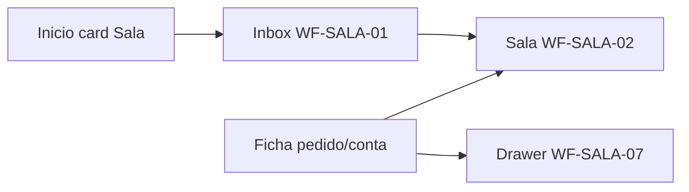

# Wireframes — Portal Comercial

> **Produto ao usuário:** Portal Comercial  
> **Id técnico:** `commercial` · `basePath` `/apps/commercial`  
> **UI kit:** `@delpi/plugin-ui` · modais contidos no host  
> **Status:** IA hub 2026 — top nav Início · Visão geral · Sala de interação · Minhas tarefas · Meus pedidos · Minha Carteira · Administração  
> **Design:** [DESIGN-IA-COMERCIAL.md](./DESIGN-IA-COMERCIAL.md) · [GESTAO-A-VISTA.md](./GESTAO-A-VISTA.md)

## Convenções

| Símbolo | Significado |
|---------|-------------|
| `[Botão]` | Ação primária/secundária |
| `·····` | Campo de busca / input |
| `│ ░░░ │` | Skeleton / loading |
| `⚠` | Estado de atenção |
| `†` | Gate de permissão |

**Layout:** sidebar Minha DELPI à esquerda. Root MFE `.dashboard-commercial`.

**Rotas (EN paths, labels pt-BR):**

| Rota | Label | Top? | Capacidade |
|------|-------|------|------------|
| `/apps/commercial` | Início | sim | accounts.view |
| `/apps/commercial/overview` | Visão geral | sim | analytics.view |
| `/apps/commercial/my-tasks` | Minhas tarefas | sim | worklist.view |
| `/apps/commercial/my-day` | (alias → my-tasks) | — | worklist.view |
| `/apps/commercial/users/:userId` | Perfil de usuário | — | accounts.view |
| `/apps/commercial/open-orders` | Meus pedidos | sim | accounts.view |
| `/apps/commercial/customers` | Minha Carteira | sim | membership/team/manage |
| `/apps/commercial/customers/:code/:store` | Conta | — | idem |
| `/apps/commercial/customers/:code/:store/orders/:branch/:orderNumber` | Detalhe pedido (Conta) | — | idem |
| `/apps/commercial/administration` | Administração · Painel | sim† | manage |
| `/apps/commercial/administration/seller-portfolios` | Carteiras | Admin subnav | manage |
| `/apps/commercial/administration/seller-portfolios/:id` | Carteira detalhe | — | manage |
| `/apps/commercial/administration/team` | Equipe | Admin subnav | manage |
| `/apps/commercial/administration/groups` | Grupos | Admin subnav | manage |
| `/apps/commercial/seller-portfolios` | (alias → administration/…) | — | manage |
| `/apps/commercial/proposals` | Propostas ADY | launcher | proposals.view |
| `/apps/commercial/analytics` | (redirect → /overview) | — | analytics.view |
| `/apps/commercial/analytics/otd` | OTD | launcher Início | analytics.view |
| `/apps/commercial/analytics/team` | (redirect → administration) | — | — |
| `/apps/commercial/analytics/opportunities` | Oportunidades | launcher Início | analytics.view |

### Matriz rota × wireframe × status (ago/2026 — B-fecho)

Fonte de verdade das rotas: `plugins/commercial/src/app/pluginRoutes.ts`. Status = implementação no MFE vs ASCII do WF.

| Rota (relativa a `/apps/commercial`) | Wireframe | Status | Notas |
|--------------------------------------|-----------|--------|-------|
| `/` | WF-01R-L | **entregue** | Hub launcher + eventos |
| `/overview` | **WF-OV** | **entregue** | KPIs + share empresa‡ + carteira aberta + gap + horizon + ROL (+YoY/N anos) + tendência janela + ranking + funil |
| `/analytics` | — | **alias** | Redirect → `/overview` |
| `/gestao` | — | **alias** | Redirect → `/overview` |
| `/my-tasks` · `/my-day` | WF-TASKS / WF-06R | **entregue** | Alias my-day |
| `/users/:userId` | WF-USER | **entregue** | Perfil |
| `/open-orders` | WF-02R | **entregue** | Bancada |
| `/open-orders/:filial/:pedido/:linha` | WF-02R-D | **entregue** | Linha |
| `/open-orders/:filial/:pedido/:linha/op/:op` | WF-02R-D | **entregue** | OP |
| `/customers` | WF-03R / WF-03R-M | **entregue** | Minha Carteira |
| `/customers/:code/:store` | WF-04R / WF-04R-M | **entregue** | Conta 360 |
| `/customers/:code/:store/orders/:branch/:orderNumber` | WF-04R | **entregue** | Detalhe pedido Conta |
| `/customers/:code/:store/outbound-invoices/...` | WF-04R | **entregue** | Detalhe NF |
| `/proposals` · `/proposals/:id` | WF-PROP | **entregue** | ADY documento |
| `/analytics/otd` · `/analytics/otd/:b/:o/:l` | (OTD pages) | **entregue** | Via Início / drill |
| `/analytics/opportunities` · `/:n` | WF-OPP / WF-OV-D | **entregue** | Lista + ficha OV |
| `/analytics/team` | — | **alias** | Redirect → `/administration` |
| `/administration` | WF-ADM | **entregue** | Painel |
| `/administration/seller-portfolios` | WF-05R / ORG | **entregue** | Lista/org |
| `/administration/seller-portfolios/:id` | WF-05R-D | **entregue** | Detalhe carteira |
| `/administration/team` · `/members` | WF-05R-TEAM | **entregue** | Equipe |
| `/administration/groups` | WF-05R-GROUPS | **entregue** | Grupos |
| `/seller-portfolios` · `/:id` | WF-05R* | **alias** | → administration/… |
| (pipeline kanban) | WF-08 | **backlog** | Não implementado — não inventar UI |
| (forecast) | WF-09 | **backlog** | Não implementado — não inventar UI |
| (confirmação de pedidos) | **WF-CONF** | **stub** | Ata alinhamento 2 §9–10 — epico P2-CONF; sem UI inventada |
| (reunião Diretoria) | **WF-DIR** | **stub** | Ata alinhamento 2 §34 — aguardar modelo Junior/Laércio |
| `/interaction-rooms` · `/:roomId` | **WF-SALA-01…08** | **entregue** | Workspace 20/80 + 3 containers na thread; P2-SALA — kit + commercial-api § 3.21 |
| WF-G «Gestão» top nav | — | **supersedido** | Substituído por WF-OV + top «Visão geral» |

### Índice — refinamento ago/2026 (Conta · Propostas · Grupos · Tarefas)

## WF-HERO — Densidade vertical do PageHero (ago/2026)

> **Kit:** `PageHero` `density="comfortable" | "compact"` · CSS `--compact` em `plugin-ui`  
> **MFE:** `CommercialPageHero` default `compact` · **mantém** highlights / chips / filtros no `children` do hero  
> **Meta:** menos padding/gap vertical (cards KPI, body, FilterBar/chips densos) — não esvaziar o card

### WF-HERO-00 — Template lista (alvo)

```text
┌─ TopBar ─────────────────────────────────────────────────────────────┐
│ Início · Visão geral · …                              [avatar] Nome │
└──────────────────────────────────────────────────────────────────────┘
┌─ PagePath / SubNav (se houver) ─ altura mínima ──────────────────────┐
└──────────────────────────────────────────────────────────────────────┘
┌─ PageHero compact (padding ~12px, gap ~6px) ─────────────────────────┐
│ EYEBROW                                                              │
│ Título  [badge]                          [ações primárias] [Atualizar]│
│ Subtítulo 1 linha (muted, ~12.5px)                                   │
│ [kpi][kpi]…  ← highlights densos (padding ~6–8px)                    │
│ chips / período / FilterBar densos (body)                            │
└──────────────────────────────────────────────────────────────────────┘
┌─ Conteúdo (visível acima da dobra) ──────────────────────────────────┐
│ Indicadores / tabela / cards …                                       │
```

### WF-HERO-OV — Visão geral

```text
┌ Hero compact: título + IDD + Atualizar + AnalyticsFilters (body) ─┐
┌ Indicadores (KPIs) ─ visível sem scroll ──────────────────────────┐
```

### WF-HERO-08 — Pedidos em aberto

```text
┌ Hero compact: título · highlights (Linhas / Valor) · chips · FilterBar ┐
│ padding/gap reduzidos; cards KPI baixos (~36–44px)                     │
┌ Toolbar tabela + primeiras linhas VISÍVEIS ────────────────────────────┐
```

### WF-HERO-01R — Minha carteira

```text
┌ Hero compact: título · KPIs + Share empresa % · Foco/Tendência/busca ─┐
┌ [ Faturamento | Ranking | Clientes ]  ← SegmentToggle (?panel=) ──────┐
│  um painel ativo (sem collapsible)                                    │
└───────────────────────────────────────────────────────────────────────┘
```

### WF-HERO-05R — Admin Carteiras

```text
┌ Hero compact: título · 6 highlights densos · Lista|Org · Situação · Busca ┐
┌ Tabela Carteiras (visível) ───────────────────────────────────────────────┐
```

### WF-HERO-ADM — Equipe / Painel

```text
Equipe:
┌ Hero compact: Equipe · desc 1 linha · [Lista|Diagrama] [Atualizar] ┐
┌ Buscar | Grupo | Carteira | Online ────────────────────────────────┐
┌ Equipe (n) + tabela ───────────────────────────────────────────────┐

Painel:
┌ Hero compact: Painel · desc · [Atualizar] ─────────────────────────┐
┌ KPI cards (fora) · Ações rápidas ──────────────────────────────────┐
```

### Matriz PageHero × composição

| Página | density | Conteúdo no hero | Highlights |
|--------|---------|------------------|------------|
| PluginShell Home | compact | leve | ≤4 |
| Overview | compact | AnalyticsFilters | 0 |
| Open Orders | compact | chips + FilterBar | sim |
| Customers | compact | chips + busca | ≤4 |
| My Day | compact | título/highlights | ≤3 |
| Seller Portfolios | compact | chips + busca + KPIs | até 6 |
| Seller Portfolio Detail | compact | edição leve | ≤4 |
| Admin Home / Team / Groups | compact | título (filtros Team fora) | 0 |
| Proposals + details | compact | conforme | ≤4 |
| Analytics * | compact | AnalyticsFilters | 0–2 |
| Customer / Order / Invoice detail | compact | detalhe leve | ≤4 |
| User Profile | compact | n/a | 0 |

### Índice — refinamento ago/2026 (Conta · Propostas · Grupos · Tarefas)

| Tema | Wireframe / nota | Status implementação |
|------|------------------|----------------------|
| `returnTo` / `returnLabel` | PagePath em detalhes (pedido Conta, OV, proposta, linha) | helper `commercialNavigationReturn` |
| Conta pedidos | WF-04R: row click → detalhe; expand kit `renderExpandedRow` (linhas); sem modal | entregue |
| Histórico NF | WF-04R: MetricCard + tabela; row click → página detalhe NF (sem modal itens) | entregue |
| OV → ADY | WF-OPP / WF-PROP: CTA Abrir proposta (atalho documento) | em entrega |
| Proposta contato PDF | WF-PROP: select contatos salvos (sem inputs raw) | em entrega |
| Grupos empty/create | WF-ADM: card formulário sob demanda | em entrega |
| Equipe Lista\|Diagrama | WF-ADM: OrgMembershipFlow kind `group` | em entrega |
| Presença Equipe | replay snapshot WS no subscribe | entregue |
| Tarefa × grupo | WF-TASKS: `task_assignee_groups` + XOR Usuários\|Grupos + strip anexos | entregue (V012 + E10) |

### Shell comum

```text
┌─ Host Minha Delpi (sidebar) ─┬─ Portal Comercial ────────────────────────────┐
│                              │ Escopo: Carteira: {nome}            [?]       │
│                              │ Início│Visão geral│Minhas tarefas│Meus pedidos│
│                              │ Minha Carteira│Administração†                 │
│                              │ ══════ (underline no ativo)                   │
│                              │ … conteúdo da rota …                          │
└──────────────────────────────┴───────────────────────────────────────────────┘
† seller-portfolios.manage · Minhas tarefas oculto sem worklist.view
  Visão geral oculto sem analytics.view · Minha Carteira sem canAccessMyPortfolio
```

---

## IA hub 2026 — wireframes detalhados

### WF-01R-L — Início `/`

**Objetivo:** hub operacional (caminhos + eventos). **Não** replica BI.  
**Stack (topo → base):** Eventos **ou** chip «Fila em dia» → Busca → Favoritos → Recentes → grid de seções.

```text
┌─ PageHero ──────────────────────────────────────────────────────────────────┐
│ PORTAL COMERCIAL · Boa tarde, {nome} · Escopo badge                         │
│ Highlights: Follow-ups | Valor em aberto | Atrasos                          │
│ [CTA contextual opcional — atrasos / tarefas]                               │
└─────────────────────────────────────────────────────────────────────────────┘
┌─ Top nav 6 ──────────────────────────────────────────────── Escopo ─────────┐
│ (Ctrl/Cmd+K → CommandPalette)                                               │

┌─ Eventos (se houver) ───────────────────────────────────────────────────────┐
│ Alertas + worklist preview · [Atualizar] [Abrir Minhas tarefas]             │
└─────────────────────────────────────────────────────────────────────────────┘
  — ou chip «Fila em dia» (nunca empty SectionCard grande) —

┌─ Caminhos e funcionalidades ────────────────────────────────────────────────┐
│ [CatalogSearchBar  ?q=  ]                                                   │
│ Favoritos (pin) · Últimos acessos                                           │
│ ┌ Operação ┐ ┌ Gestão à vista ┐ ┌ Documentos ┐ ┌ Administração ┐           │
│ │ rotas…   │ │ Visão / OTD…   │ │ Propostas  │ │ Painel…       │           │
│ └──────────┘ └────────────────┘ └────────────┘ └───────────────┘           │
│ (SectionRouteCard kit · badges overdue/today/late · pin favorito)           │
└─────────────────────────────────────────────────────────────────────────────┘
```

Seções canônicas: **Operação · Gestão à vista · Documentos · Administração**.  
Catálogo: `pluginRouteCatalog.ts` (só `viewId` + `search`, sem URL absoluta).

#### Polish kit (ago/2026) — busca, Eventos, RouteChip, pin create

Stack **inalterada**.

**WF-SEARCH — busca (borda só no field)**

```text
Idle / Focus: [🔍 Buscar…]  ← só borda do __field (accent no focus)
              sem outline/ring no <input>
```

**WF-EVENTS — ícones**

```text
[TriangleAlert] linhas em atraso …     [Ver atrasos]
[ClipboardList] entregas deste mês …   [Ver mês]     ← deep link date_start/date_end
[BarChart3]     gap vs meta / horizonte … [Abrir Overview]  ← só analytics.view
[CircleAlert]   follow-ups atrasados … [Abrir…]
Fila [Clock Atrasadas n] [Sun Hoje n] [Arrow Depois n]
[ClipboardList] título tarefa …        [Abrir]
```

**WF-B — linha de rota + pin (depois)**

```text
┌─ Operação ─────────────────────────────────────┐
│ [tile] Operação                                │
│ ┌──────────────────────────────────┬──────┐    │
│ │ Minhas tarefas                   │ [★]  │
│ │ Nova tarefa (create)             │ [☆]  │ ← pin liberado
│ └──────────────────────────────────┴──────┘    │
└────────────────────────────────────────────────┘
```

**WF-CHIP-B — Favoritos / Recentes (RouteChip)**

```text
Favoritos
[★ Minhas tarefas ×]  [★ Nova tarefa ×]
Últimos acessos
[◇ Oportunidades]  [◇ Pontualidade (OTD)] …
```

**Backlog:** ícone por rota no SectionRouteCard; subtítulos Alertas/Tarefas; polish CommandPalette.

### WF-OV — Visão geral `/overview`

**Objetivo:** dashboard BI do período (filtros + KPIs + séries + funil). **Sem** Aprofundar / prévia OV.  
**Entregue (Onda A/B):** presets de período, KPI carteira aberta (snapshot ≠ PCP), série hit rate, overlay YoY (mesmo período −1a) em ROL e conversão — todas as granularidades.  
**Chart View Shell (kit `plugin-ui`):** toolbar densificada — type switcher (column|line|area), overlays YoY/tendência com **HelpTooltip** (sem parágrafo sob checkbox), preferências em `localStorage`, export CSV/XLS/PDF. Doc: [`chart-view-shell.md`](../../../plugins/plugin-ui/docs/chart-view-shell.md).  
**MVP temporal (KPI-CARTEIRA-HORIZON):** 1× `GET /analytics/open-portfolio-horizon`; card **Gap vs meta** (`max(meta_SI − ROL, 0)`); painel **Carteira no tempo** com chips → deep link Meus pedidos (`focus=late` / `date_start`–`date_end`). **Fora:** soma ROL+carteira; F6.  
**Comparativos (KPI-PORTFOLIO-SHARE + T4/T5):** card **Share empresa** (RBAC analytics/team/manage); tendência com janela 7/30/90/custom; ranking delta % (gestor); presets + até 3 anos de overlay nas séries.

```text
┌─ PageHero «Visão geral» ────────────────────────────── [Atualizar] ─┐
┌─ Filtros + atalhos de período (hoje…12m) + Unidade + Segmento + Carteira† ┐
┌─ KPIs (≤8): ROL · Share empresa‡ · Carteira aberta · Gap · Hit rate · OTD · … ─┐
│  Gap: buraco vs meta ROL · ao lado valor do mês corrente (contexto, sem soma) │
│  Share: portfolioRol ÷ companyRol (mesmo período) · ‡ só analytics/team/manage │
┌─ Tendência faturamento [7d|30d|90d|Custom] · sparkline / Δ% ─────────────────┐
┌─ Carteira no tempo (chips) → Meus pedidos (atraso / mês / 1–3m / depois) ──┐
┌─ Evolução ROL [Dia–Ano] [▮|╱|░] [YoY(?)] [Tend.(?)] [CSV|Excel|PDF] ┬─ Funil ─┐
│ ChartViewShell · tipo persistido · overlays compactos · drill só atual       │
┌─ Evolução hit rate [Dia–Ano] [▮|╱|░] [YoY(?)] [Export] ──────┐
│ mesmas regras de shell · séries SC/ES (+ prior)                           │
┌─ Ranking crescimento/queda (cliente; vendedor se team/manage) + Excel ─────┐
† SellerScopeFilter se canFilterPortfolios
```

**Export:** ROL, funil, hit rate, OTD insight bars, detalhe OP (cobertura/prazo) e séries de faturamento/conta — inventário fechado no gate `chartExcelCoverage.structural.test.mjs`.  
**YoY / N anos:** chamadas adicionais aos BFF de séries com `periodShift` (−1a…−3a) — **sem** rota por ano.  
**Share:** `GET /analytics/portfolio-billing-share`.

### WF-TASKS — Minhas tarefas `/my-tasks`

```text
┌─ PageHero ─ highlights Atrasadas / Hoje / Depois ───────────── [Atualizar] ─┐
│ MINHAS TAREFAS                                                              │
│ [Atrasadas] [Hoje] [Depois] [Concluídas]                                    │
│ Fila: título · prioridade · prazo · cliente · [Concluir][Adiar][Abrir conta]│
│ Card: anexos em strip preview (só abrir)                                    │
├─ Nova / Editar tarefa ──────────────────────────────────────────────────────┤
│ Título* | Prazo* | Prioridade | Cliente | Tipo | Observação                 │
│ Responsável: [ Usuários | Grupos ]  ← SegmentToggle XOR (limpa o outro)     │
│   Usuários → UserDirectoryPicker · Grupos → MultiSelect grupos              │
│ Anexos: dropzone + strip manage [thumb][x] … (kit AttachmentPreviewStrip)   │
│                                                    [Criar / Salvar]         │
└─────────────────────────────────────────────────────────────────────────────┘
```

API: create/update rejeita `assignee_user_ids` **e** `assignee_group_ids` juntos (422 / ValueError).
### WF-ADM — Administração

```text
[Subnav] Painel · Carteiras · Membros
Painel: cards cobertura/ativas + [Nova carteira] [Transferência] [Carteiras] [Membros]
Carteiras: lista/org (WF-05R) sob /administration/seller-portfolios
Membros: roster pessoa × carteiras → detalhe
```

### Deep pages (launcher Início)

| WF | Path | Notas |
|----|------|-------|
| WF-02R | `/open-orders` | Chip Atraso = pontualidade operacional |
| WF-03R / WF-04 | `/customers` · Conta | Aba Oportunidades = lista OV do cliente; clique linha→Conta |
| WF-PROP | `/proposals` | Escopo chrome ≠ filtro ADY |
| WF-OTD | `/analytics/otd` | % + série SC/ES + insights (recorrência/top 10) + linhas server-side; entrada Início |
| WF-OPP | `/analytics/opportunities` | OV global; entrada Início |
| WF-EQ | `/analytics/team` | **Redirect → /administration** |

---

## Mapa de navegação

```text
Portal Comercial
├── Início                         /
├── Visão geral                    /overview
├── Minhas tarefas                 /my-tasks
├── Meus pedidos                   /open-orders
├── Minha Carteira                 /customers
│   └── Conta                      /customers/:code/:store  (aba oportunidades)
├── Administração†
│   ├── Painel                     /administration
│   ├── Carteiras                  /administration/seller-portfolios
│   ├── Carteira detalhe           /administration/seller-portfolios/:id
│   ├── Equipe                     /administration/team  (alias /members)
│   └── Grupos                     /administration/groups
└── (launcher Início) Propostas, OTD, Oportunidades
    (Equipe analytics → redirect Admin)
```

---

## Wave G+ — shell (legado histórico)

Nav secundária = **UnderlineNav**. Chip Escopo = identidade.

### WF-00 — Shell (atualizado IA hub)

```text
┌─ plugin ────────────────────────────────────────────────────────────────────┐
│ Portal Comercial [?]          Escopo: Carteira: Sul                         │
│ Início  Visão geral  Minhas tarefas (3)  Meus pedidos  Minha Carteira  Adm† │
│ ═══════                                                                     │
└─────────────────────────────────────────────────────────────────────────────┘
```

### WF-01R — Início (legado — substituído por WF-01R-L acima)

O wireframe operacional antigo (Atenção → Seus números → Gestão teaser) foi **supersedido** por WF-01R-L (launcher + eventos).

### WF-06R — Minhas tarefas (ex-Meu dia)

Ver WF-TASKS. Labels «Minhas tarefas»; path `/my-tasks`.

---

## WF-G — Visão geral (histórico)

**Supersedido** por **WF-OV** (`/overview`) — ver matriz rota × WF. Não há mais item top «Gestão» nem subnav global Visão geral · OTD · …. O ASCII abaixo é legado (pré–IA hub / pré–cockpit C1) e **não** descreve o produto atual.

---

```text
┌─ HERO ──────────────────────────────────────────────────────────────────────┐
│ Bom dia · {escopo/carteira}                                   [Atualizar]   │
│ “Aqui está o que precisa da sua atenção hoje.”                              │
│ Chips: Pedidos abertos · Follow-ups · Atrasos                               │
└─────────────────────────────────────────────────────────────────────────────┘
┌─ PRECISA DE ATENÇÃO (AlertQueue) ──────────────────────────────────────────┐
│ ⚠ N atrasos [Ver pedidos]  │  ⚠ M follow-ups [Meu dia]                     │
│ empty → EmptyState + CTA · loading/erro por card (allSettled)               │
└─────────────────────────────────────────────────────────────────────────────┘
┌─ SEUS NÚMEROS (accounts.view) ──────────────────────────────────────────────┐
│ Linhas │ Valor │ Pode faturar │ Atrasos │ Tarefas* (worklist.view)          │
└─────────────────────────────────────────────────────────────────────────────┘
┌─ GESTÃO (seller-portfolios.manage) ─────────────────────────────────────────┐
│ ROL · Conversão · OTD + tabela equipe                                       │
└─────────────────────────────────────────────────────────────────────────────┘
┌─ ATALHOS ───────────────────────────────────────────────────────────────────┐
│ Meu dia* · Meus pedidos · Minha Carteira · Carteiras†                       │
└─────────────────────────────────────────────────────────────────────────────┘
```

### WF-06R — Meu dia (CRM mínimo)

```text
┌─ Filtros in-page ─ [Atrasadas] [Hoje] [Depois] ─ [Atualizar] ───────────────┐
│ item: título · prioridade · prazo · cliente                                 │
│        [Concluir] [Adiar] [Abrir conta]                                     │
├─ Nova tarefa ───────────────────────────────────────────────────────────────┤
│ Título* | Prazo* (default hoje EOD) | Prioridade | Cliente | Tipo           │
│                                                    [Criar tarefa]           │
└─────────────────────────────────────────────────────────────────────────────┘
```

Conta 360: CTA **Agendar follow-up** → Meu dia com `customer_code`/`store` pré-preenchidos.

---

## WF-01 — Shell + Início (home por papel)

**Rota:** `/apps/commercial`  
**Objetivo:** entrada única; atalhos e pendências; sem regra de negócio pesada na home.

### Vendedor

```
┌─ Portal (shell Minha DELPI) ────────────────────────────────────────────────┐
│ [sidebar]  │ Portal Comercial                              [Período ▾] [↻] │
│            ├──────────────────────────────────────────────────────────────┤
│ Comercial  │ Início                                                         │
│  · Início  │                                                                │
│  · Pedidos │ Olá, {nome} · Escopo: Carteira: Sul · Atualizado há 4 min      │
│  · Carteira│                                                                │
│  · …       │ ┌─ Precisa de atenção ─────────────────────────────────────┐ │
│            │ │  ⚠ 3 pedidos atrasados     [Ver pedidos]                   │ │
│            │ │  ⚠ 2 clientes sem contato   [Ver carteira]                 │ │
│            │ │  · 1 follow-up hoje         [Meu dia]  ← F5 (oculto se N/A)│ │
│            │ └────────────────────────────────────────────────────────────┘ │
│            │                                                                │
│            │ ┌─ Atalhos ─────────────┐  ┌─ Resumo da carteira ──────────┐ │
│            │ │ [Meus pedidos]        │  │ Clientes     42               │ │
│            │ │ [Minha Carteira]      │  │ Valor em aberto  R$ 1,2 mi    │ │
│            │ │ [Propostas]           │  │ Atrasados     5               │ │
│            │ │   (página nativa)     │  │ Próxima entrega  08/08        │ │
│            │ └───────────────────────┘  └───────────────────────────────┘ │
│            │                                                                │
│            │ ┌─ Recentes ───────────────────────────────────────────────┐ │
│            │ │ Cliente 01001-01  ACME Ltda          há 12 min   [Abrir] │ │
│            │ │ Pedido 000123 / 01                   há 1 h     [Abrir] │ │
│            │ └──────────────────────────────────────────────────────────┘ │
└────────────┴────────────────────────────────────────────────────────────────┘
```

### Gestão (supervisor / gerente)

```
┌─ Portal Comercial · Início (gestão) ────────────────────────────────────────┐
│ Filtros: [Filial ▾] [Equipe/Vendedor ▾] [Período ▾]              [Atualizar]│
│                                                                             │
│ ┌ KPI ROL MTD ┐ ┌ Carteira ┐ ┌ Gap meta ┐ ┌ Pedidos atrasados ┐            │
│ │ R$ …        │ │ R$ …     │ │ R$ …     │ │ 18                 │            │
│ │ vs meta …%  │ │          │ │          │ │ [Abrir OTD/pedidos]│            │
│ └─────────────┘ └──────────┘ └──────────┘ └────────────────────┘            │
│                                                                             │
│ ┌─ Equipe — atenção ──────────────────────────────────────────────────────┐│
│ │ Vendedor     Atrasados  Valor aberto  Follow-ups vencidos   [Drill]     ││
│ │ Ana Silva         4      R$ 210 mil              2                      ││
│ │ …                                                                       ││
│ └─────────────────────────────────────────────────────────────────────────┘│
│                                                                             │
│ Atalhos: [Dashboard Comercial →] [Propostas →] [Carteiras admin]            │
└─────────────────────────────────────────────────────────────────────────────┘
```

**Estados:** loading por card (`Promise.allSettled`); erro parcial não derruba a home; sem permissão de KPI → card omitido (não 403 na página inteira).

---

## WF-02R — Pedidos em aberto (bancada operacional)

**Rota:** `/apps/commercial/open-orders`  
**Paridade:** `OpenOrdersPage` / `OpenOrdersPageImpl`  
**Dados:** api-delpi `GET /pedidos-venda-abertos/` (+ ops abertas)  
**Papel:** bancada de linhas (achar → entender entrega → agir). Home = atenção; Gestão = KPIs de período.  
**Kit:** `cm-*` — PageHero (`actions`/`children`), ScopeChipBar, FilterBar, DataTable / Cards, InlineMeter.
**Evoluções:** WF-02R-H (Hero), WF-02R-T (tabela visual), WF-02R-C (cards), WF-02R-D (página de detalhe). MultiSelect do kit usa o mesmo checkbox moderno das Colunas.

```
┌─ PageHero (card único) ───────────────────────────────────────────────────┐
│ PEDIDOS · highlights Linhas / Valor / Após filtros         [↻ Atualizar] │
│ Atenção + Concentrar (mesma linha) · FilterBar (Carteira | busca/…)    │
│ chips usam deliveryHorizon do BFF                                       │
└───────────────────────────────────────────────────────────────────────────┘
┌─ SectionCard ─ [Tabela|Cards] ─ Excel · Fonte · Colunas ──────────────────┐
│ Tabela: Cobertura (InlineMeter) · Prev. OP + badge · Status · Atraso badge│
│ Cards: mesmos campos visíveis · Ordenar por + direção · Detalhe → página  │
└───────────────────────────────────────────────────────────────────────────┘
┌─ Página nativa (Detalhe da linha) — ver WF-02R-D ─────────────────────────┐
│ Status fabril · KPIs · charts · bloco OP+timeline · tabela OP · Ver OP/OV │
└───────────────────────────────────────────────────────────────────────────┘
```

**Colunas default:** Cliente, Pedido, Produto, Cobertura, Entrega, Prev. OP, Status, Valor, Atraso.  
**Clique:** linha / Prev. OP / card → página nativa da linha; ação
da OP → página SPA nativa `/open-orders/:filial/:pedido/:linha/op/:op`.
**URLs internas compartilháveis:** busca, filial, clientes, datas, estoque/atenção,
`seller_id`, sort/direção e página formam o estado canônico da lista. Valores são
allowlisted, defaults são omitidos, `popstate` restaura a bancada e filtros/escopo/
sort resetam a página. `seller_id` só é aceito com `team_scope` e portfolio id
válido. O `replaceState` roda apenas na rota exata `/open-orders`; linha e OP
preservam o estado completo no retorno. O legado `?pedido=&linha=&filial=` é
migrado após localizar a linha. Home pode emitir `?focus=late` / `?stock=…`.
Concentrar (MVP temporal) usa `deliveryHorizon` do envelope e deep links
`buildOpenOrdersHorizonListHref` (`focus=late` ou `date_start`/`date_end`).

**Mobile (≤768px):** default Cards na 1ª visita; hero e página de detalhe empilham.

**Histórico:** WF-02 (KPI cards + tabela densa + modal OP) → WF-02R → H/T/C/D.

### WF-OPEN-ORDERS-KANBAN — Board por etapa (ago/2026)

**Status:** entregue (read-only)  
**Toggle:** Tabela | Cards | **Board** (persistido em `commercial:open-orders:layout`)  
**Kit:** `KanbanBoard` / `CommercialKanbanBoard` — zero CSS de board no MFE  
**Estágios (BFF `kanbanStage`):** `upcoming` · `in_progress` · `ready_to_invoice` (+ coluna `completed` via rota recently-closed). Contagens `kanbanStageCounts` usam **FIFO** (`estoque_alocado`) — mesma regra do chip «Pode faturar» e do badge «Meus pedidos».  
**Deep link:** `?view=board&stage=ready_to_invoice` (`buildOpenOrdersBoardHref`)  
**Não é:** WF-08 Kanban de oportunidades; sem drag-and-drop / escrita Protheus

```
[Filtros] [Atenção] [Tabela|Cards|Board]
+ Próximos + Em andamento + Pronto faturar + Concluídos +
| n · R$   | n · R$         | n · R$           | n · R$ (30d)  |
| [card]   | [card]         | [card]           | [card]        |
+----------+----------------+------------------+---------------+
```

### WF-02R-D — Páginas nativas da linha e da OP

**Domínio:** SC5/SC6 + OP SC2 (não misturar com OV AD*).  
**APIs extras ao abrir:** `/products/{code}/factory-status?branch=`, `/production/orders/by-op/{op}`, `/production/appointments/by-op` (agregado), opcional `/products/{code}/structure`.  
**OV (AD1_NROPOR):** se a lista PVA trouxer `proposal_number`, usa direto; senão `GET /commercial/proposals?search={pedido}&branch=` e match por filial+cliente (limiar). **Não** chamar `GET /proposals/{pedido}` — path é OV, não `C5_NUM`. Sem vínculo SC5↔AD1 estável documentado no PVA, enriquecimento na lista é opcional.

```
┌─ Página linha · PagePath Pedidos / Pedido-linha ─────────────────────────┐
│ Pedido · Linha · Produto · Cliente                                       │
├──────────────────────────────────────────────────────────────────────────┤
│ Status fabril (+ chips MP: PA produzível, MP limitante, MPs sem estoque) │
│ KPIs locais da linha (não bloqueados pelo loading dos extras)            │
│ Charts compactos: cobertura · prazo (+ Excel tabular no header)          │
│ Produção/OPs: SegmentToggle · meter · Prazo OTD + tabela PI densa        │
│   Timeline · apontamentos agregados · prefetch até 12 OPs (+ on-demand)  │
│   Labels: «data de faturamento» (não «data de entrega do pedido») — P0-RENAME │
│   Status fabril e OTD da OP via BFF (sem CTA para dashboard-production)      │
│ Tabela OP rica — clique sincroniza OP selecionada                        │
│ Estrutura do produto (BOM: empty/erro/loading visíveis)                  │
│ [Abrir página OP] [Copiar pedido] [Ver OV n] [Abrir conta]               │
└──────────────────────────────────────────────────────────────────────────┘
┌─ Página OP nativa · PagePath Pedidos / Pedido-linha / Produto / OP ──────┐
│ PageHero · mesmo OpenOrdersProductionDetailContent integral da linha      │
│ loading / erro / 404 / retry · troca OP na URL · sem CTA para a própria OP│
└───────────────────────────────────────────────────────────────────────────┘
```

**Nomenclatura (ata alinhamento 2 §14–15):** na timeline/ficha OP, o marco que hoje
aparece como «entrega do pedido» deve ser **«data de faturamento»** (P0-RENAME).
Distinto de data de entrega física / expedição (irmão ou futuro).

**Entrada por contexto de pedido:** `?pedido=&linha=&filial=` localiza a linha e
substitui o endereço pela rota nativa `/open-orders/:filial/:pedido/:linha`.

**Página OP:** busca a linha exata por filial+pedido+linha no escopo `seller_id`
validado contra `PortfolioScope.canUseTeamScope` e ids carregados, e
confirma a OP em `opsUtilizadas`; não usa iframe, import ou URL de outro MFE.
As páginas compartilham hook, cálculos, componentes e conteúdo operacional.
Ao trocar entre múltiplas OPs, a própria rota SPA é atualizada; ao voltar, todo o
estado canônico da bancada é herdado, e a OP retorna à rota da linha.

**Fora do detalhe de pedido:** KPI/processo AD1, tabela ADJ multi-item, timeline AIJ, export OV → **WF-OV-D**.

### WF-OV-D — Página Detalhe da OV (Gestão)

**Rota:** analytics opportunity detail (`AnalyticsOpportunityDetailPage`)  
**Paridade:** dashboard-commercial `CommercialDetailPage`  
**APIs:** `GET /commercial/proposals/{n}` + `/history/events` + `/products/{code}/structure` por item.

```
┌─ Página · OV n ──────────────────────────────────────────────────────────┐
│ PagePath Oportunidades / OV n                              [Atualizar]    │
│ KPI: Status · Abertura · Fechamento                                      │
│ Cards: Proposta | Cliente e vendedor                                     │
│ Produtos ADJ (grupo, tipo, qtd PI)                                       │
│ BOM por produto                                                          │
│ Histórico: [Linha do tempo | Tabela] via /history/events                 │
└──────────────────────────────────────────────────────────────────────────┘
```

**Mapa:** OV exclusivamente nesta página, aberta por
`navigateAnalyticsOpportunityDetail`; não existe modal de OV. O PagePath retorna
a `/analytics/opportunities` preservando apenas filtros allowlisted presentes.
Produtos, histórico em modo tabela e detalhe de OP usam `DataTable` no desktop e
`DataRecordCard` no mobile.
Pedido+OP permanece nas páginas nativas WF-02R-D.


---

## WF-03R — Minha Carteira (desktop)

**Rota:** `/apps/commercial/customers`  
**Papel:** listar **todos** os clientes vinculados à(s) carteira(s) do escopo
(membership); métricas de pedido em aberto são overlay. Não é dump SA1.
**Fonte BFF:** `GET /customers/in-scope` (+ `GET /open-orders/` só para lines/contagens).
**Estado URL:** somente `q`, `focus`, `trend`, `seller_id`, `sort`, `dir` e
`page` allowlisted; presets fixos agora, saved views customizadas depois.
Valores inválidos são normalizados e defaults são omitidos. `focus=growth`
legado vira `trend=up`; `focus=inactive` vira `all`.
Filtro «Todas as carteiras» = união dedupe quando o usuário participa de N carteiras
(ou gestão com team scope).

```text
┌─ PageHero · Minha Carteira ── [Ver atrasos (n)] [Atualizar] ──────────────┐
│ Clientes · Valor aberto · Com atraso · Após filtros · Share empresa % ‡ │
│ Atualizado 09:04 · CTA atrasos → /open-orders?focus=late                 │
│ Foco + Tendência (mesma linha) · Dias da janela + Buscar | Carteira     │
│ ‡ Share só com analytics.view | accounts.team.view | seller-portfolios.manage │
└─────────────────────────────────────────────────────────────────────────┘
┌─ [ Faturamento | Ranking | Clientes ]  (?panel=billing|ranking|customers) ─┐
│ default: Clientes · sem chevron collapsible                               │
└────────────────────────────────────────────────────────────────────────────┘
┌─ Painel Faturamento — {preset} ──────────────────── Cliente [Todos ▾] ───┐
│ PeriodCompareControls · colunas agrupadas (+ YoY) · ☑ Linha de tendência │
└────────────────────────────────────────────────────────────────────────────┘
┌─ Painel Ranking crescimento/queda + Excel ─────────────────────────────────┐
│ Cliente|Vendedor · Maiores altas|quedas · Top N · período                 │
└────────────────────────────────────────────────────────────────────────────┘
┌─ Painel Clientes da carteira ─────────────────────── [Colunas] ────────┐
│ Cliente · Vendedor · Última venda · Fat.12m · Tendência · …            │
└─────────────────────────────────────────────────────────────────────────┘
┌─ SectionCard colapsável · Histórico da carteira (padrão fechado) ───────┐
│ [Carteira do histórico ▾] (só com «Todas» + N carteiras) · timeline    │
└─────────────────────────────────────────────────────────────────────────┘
```

**Share / ranking:** Share no hero (`usePortfolioBillingShare`); BFF `portfolio-billing-share` e `portfolio-billing-ranking`; Conta `?secao=historico` espelha YoY no painel NF.
**Painéis:** `?panel=` no deep link da lista (`customersListDeepLink`).
**Realtime (carteiras):** mutações auditadas emitem `portfolio.changed` para
salas `user:{memberId}`. Auth WS: `accounts.view` **ou** `worklist.view`.
Admin (lista/detalhe) refetch silencioso; membro vê Histórico em Minha Carteira.

**Componentes importados de `@delpi/plugin-ui`:** `PageHero`,
`ScopeChipBar`, `FilterBarShell`, `TextField`, `SelectField`, `DateField`,
`SectionCard`, `ChartToolbar`, `DataTable`, `TableColumnVisibilityMenu`,
`DataRecordCard`, `CompactPagination`, `StatusBadge`, `KpiCard`, `StateBanner`,
`EmptyState` e `LoadingActivityCard`.

**Composições de domínio no `commercial`:** `CustomersPage`,
`SellerScopeFilter`, `CustomersTable`, `MyPortfolioAuditSection`,
`CustomerBillingSeriesChart` e o mapper `CustomerSummary → DataRecordCard`.
O MFE mantém apenas layout/responsividade e regra comercial; não replica CSS do kit.

**Colunas default:** Cliente, Última venda, Fat. 12 meses, Tendência, Status,
Em aberto, Atrasos e Próxima entrega. Vendedor é default apenas para escopo de
equipe; Cidade / UF começa oculta. O usuário pode persistir visibilidade, ordem
e largura localmente.

**Cobertura:** a lista base é o membership do escopo (não paginado na origem).
Pedidos em aberto enriquecem valor/atraso/linhas quando existirem; a tela permanece
utilizável se open-orders, enrichment ou faturamento falharem parcialmente. O MFE
divide enrichment e billing em lotes determinísticos de até 200 clientes e
agrega a cobertura. Campo derivado sem lote coberto mostra
`Dado indisponível`; export deixa a célula vazia, sem converter ausência em zero.
Filtro por produto (ADR-003) continua dependendo das linhas do overlay open-orders.

### WF-03R-M — Minha Carteira (mobile)

```text
┌ Minha Carteira                         [↻] ┐
│ 24 clientes · R$ 1,9 mi                    │
│ Atualizado 09:04                            │
│ Carteira [Todas ▾]                         │
│ Foco [Todos][Atenção]… · Tendência [Todas][Alta]… → │
│ Dias da janela [7d|30d|90d|Custom] · [Buscar____]  │
│ Carteira [Todas ▾]                                 │
└─────────────────────────────────────────────┘
┌ [avatar] ACME                    [Atenção] ┐
│ 01001 · Loja 01                            │
│ Última venda 01/08 · Em aberto R$ 90k     │
│ Atrasos 2 · Próxima entrega 15/08         │
│ Próxima ação: tratar atraso                │
└─────────────────────────────────────────────┘
                1 2 3 ›
[Análise da carteira]
```

No mobile, `DataRecordCard` usa o mesmo conjunto filtrado, ordenado e paginado
da `DataTable`; não existe segundo pipeline nem segundo fetch.

---

## WF-04R — Conta 360 (desktop)

**Rota:** `/apps/commercial/customers/:code/:store`  
**PagePath:** `← Minha Carteira / {cliente}`, com retorno determinístico para a
lista e preservação de `q`, `focus`, `trend` e `seller_id`.
**Estado URL:** `?secao=resumo|pedidos|historico|oportunidades|atividades`;
`faturamento` e `contatos` permanecem aliases legados.

```text
← Minha Carteira   /   ACME
┌─ PageHero · Conta ────────────── [Follow-up] [Propostas] [Atualizar] ─┐
│ ACME  [Atenção]                                                      │
│ 000006 · Loja 01 · cidade/UF · vendedor · atualizado                 │
│ Fat. 12m  │  Em aberto  │  Pedidos  │  Próx. entrega                 │
│ Próxima ação: Tratar atraso                                          │
└──────────────────────────────────────────────────────────────────────┘
 [Visão geral] [Pedidos 3] [Histórico] [Oportunidades] [Atividades]
┌─ tabpanel full-width ────────────────────────────────────────────────┐
│ Pontos para conversa · Evolução · preview pedidos/atividades         │
└──────────────────────────────────────────────────────────────────────┘
```

**Abas:** Pedidos — clique na linha/item (atenção, preview Visão geral, tabela) abre
detalhe (`…/orders/…`); na tabela, chevron expande `CustomerOrderLines` inline via
`DataTable` `expandedRowKey`/`renderExpandedRow` (sem modal «Ver linhas» / «Abrir pedido»).
Histórico — SectionCard **Filtros** colapsável (`defaultOpen`); gráfico de
faturamento via **ChartViewShell** (column|line|area + YoY / tendência com tooltip;
preferências em `localStorage`; Excel); aviso de NF
canceladas **no card do gráfico**; KPIs + tabela; clique na linha abre
detalhe NF (`…/outbound-invoices/{branch}/{n}/{s}`); sem modal de itens. YoY no
filtro compara colunas do ano anterior e delta nos cards. Oportunidades — OV tipográfico, StatusBadge por `status_category`, coluna Proposta
`interactive`; CTA ADY só com `analytics.view` / `proposals.view`. Atividades carrega
timeline real e permite follow-up somente com `worklist.view + followups.manage`.
Cada fonte mantém loading, erro, vazio, retry e atualização independentes.

```text
Histórico — layout
┌─ SectionCard Filtros ▾ (colapsável, aberto) ─────────────────────────────┐
│ presets · datas · situação · busca · ☑ Comparar ano anterior             │
├─ SectionCard Faturamento · [▮|╱|░] · ☑ Tend.(?) · [CSV|Excel|PDF] ──────┤
│ ChartViewShell · tipo persistido · hint NF canceladas                    │
├─ KPI cards · tabela NFs ─────────────────────────────────────────────────┤
```

```text
Pedidos — tabela
[>] Unidade | Pedido | … | Valor
    └─ (expandido) CustomerOrderLines …
(clique na linha → detalhe pedido; chevron stopPropagation)
```

**Componentes importados de `@delpi/plugin-ui`:** `PagePath`, `PageHero`,
`InitialsAvatar`, `StatusBadge`, `UnderlineNav` em modo tabs, `DetailCard`,
`DetailFieldGrid`, `SectionCard`, `KpiCard`, `ChartCard`, `Timeline`,
`DataTable`, `DataRecordCard`, `ActionButton`, `StateBanner`, `EmptyState` e
`LoadingActivityCard`.

**Composições de domínio no `commercial`:** `CustomerDetailHeader`,
`CustomerDetailSections`, `CustomerOverviewSection`,
`CustomerOrdersTable`, `CustomerBillingPanel`,
`CustomerPurchaseEvolutionChart` e `CustomerActivityTimelinePanel`.

### WF-04R-M — Conta 360 (mobile)

```text
← Minha Carteira / ACME
┌─ PageHero · Conta ─────────────────────────┐
│ ACME [Atenção]                             │
│ código · loja · vendedor · atualizado      │
│ Fat. 12m · Em aberto · Pedidos · Entrega   │
│ Próxima ação: Tratar atraso                │
│ [Follow-up] [Atualizar]                    │
└────────────────────────────────────────────┘
Tabs com scroll horizontal →
┌ tabpanel em uma coluna ┐
│ pontos / evolução      │
│ tabelas → cards        │
└────────────────────────┘
```

O kit empilha os highlights do `PageHero`; não há accordion nem coluna sticky.
Nenhum conteúdo crítico depende de hover.

### Fronteira de integração

Minha Carteira, Conta, OP e OV são páginas SPA nativas do `commercial`. Nenhuma
delas hospeda plugin externo, usa iframe, monta remote irmão ou oferece URL de
fallback para outro MFE. Dados de produção, pedidos, faturamento e oportunidades
são projeções próprias consumidas por HTTP da `api-delpi`/`commercial-api`.

---

## WF-05R — Administração de carteiras (lista full-page)

**Rota:** `/apps/commercial/administration/seller-portfolios` (alias legado `/seller-portfolios`)  
**URL:** `q`, `filter=all|active|inactive`, `view=list|org`, `axis=portfolio|person` (só com `view=org`). Defaults omitidos. **Sem** `?id=` — detalhe é rota própria (WF-05R-D).  
**Dados:** commercial-api `seller-portfolios` (+ `members[]`)  
**Permissão:** `commercial.seller-portfolios.manage` (CRUD). Gestor com só `accounts.team.view` **não** vê esta tela — só filtro de carteira nas bancadas.  
**Modelo:** carteira compartilhada = 1 owner + N members; mesma lista de clientes. Usuário pode estar em N carteiras.  
**Kit:** `PagePath`, `PageHero`, `ScopeChipBar`, `FilterBarShell`, `SegmentToggle`, `DataTable`, `DataRecordCard` / `InteractiveDataCard`, `HostContainedDialog` / `CommercialConfirmModal`, `UserDirectoryPicker`. Subnav Administração: Painel · Carteiras · Equipe · Grupos.

```
← Portal Comercial / Administração / Carteiras

┌─ PageHero · Carteiras ──────────────── [+ Nova carteira] [Atualizar] ─┐
│ 3 carteiras │ 2 ativas │ 1 inativa │ 48 clientes                       │
│ Visão [Lista] [Organização]                                            │
│ Situação [Todas 3] [Ativas 2] [Inativas 1]                             │
│ Buscar nome, usuário ou membro [________________]                      │
└────────────────────────────────────────────────────────────────────────┘

┌─ Carteiras (3) ── [Tabela|Cards] ──────────────────────────────────────┐
│ Carteira        Owner / membros     Cli   Status                       │
│ Sul ●           Ana (+2)             18   Ativa    → clique abre detalhe│
│ Norte ●         Bruno (+1)           22   Ativa                        │
│ Especial ●      Carla                8    Inativa                      │
└────────────────────────────────────────────────────────────────────────┘
```

Linha / card → `/administration/seller-portfolios/:id` (preserva `q`/`filter`/`view`/`axis` no retorno via PagePath). Sem painel split. Sem coluna Ações na lista.

**Card da lista (mobile / modo Cards):** nome, owner, contagem de membros, clientes, `StatusBadge`. O card inteiro navega ao detalhe.

**Dialog Nova carteira** — só **nome** (`CommercialHostDialog` + TextField). Sem picker de usuários no create.  
**Detalhe órfã** — banner + empty state «Sem responsável»; `UserDirectoryPicker` «Adicionar responsável»; o 1º usuário vira `owner` (API/repo).  
**Dialog Transferir** — na página de detalhe (WF-05R-D).  
**Inativar / Excluir** — no detalhe.

### WF-05R-D — Detalhe da carteira

**Rota:** `/apps/commercial/administration/seller-portfolios/:id` (alias legado `/seller-portfolios/:id`)  
**PagePath:** `← Administração / Carteiras / {nome}` (volta à lista com estado URL allowlisted).  
**Permissão:** `seller-portfolios.manage`.

```
← Carteiras   /   Sul

┌─ PageHero · Sul ─────────── [Ativa] [Editar nome] [Atualizar] … ──────┐
│ Responsável · N usuários · N clientes (highlights)                     │
│ (só ao editar) Nome [Sul____] [Cancelar] [Salvar]                      │
│ Ações: [Inativar|Reativar] [Transferir clientes] [Excluir]             │
└────────────────────────────────────────────────────────────────────────┘

┌─ Usuários (N) ─────────────────────────────────────────────────────────┐
│ (órfã) Banner: carteira sem responsável                                │
│ UserDirectoryPicker [avatars] chips · [Adicionar selecionados]         │
│ Empty: Sem responsável — 1º usuário vira owner                         │
│ ─ ou, com membros ─                                                    │
│ [avatar] Nome     Papel     Ações                                      │
│ Ana Silva         owner     (já é responsável)                         │
│ Pedro Costa       member    [Tornar responsável] [Remover]             │
│ Lia Mendes        member    [Tornar responsável] [Remover]             │
└────────────────────────────────────────────────────────────────────────┘

┌─ Clientes ─────────────────────────────────────────────────────────────┐
│ CustomerSearchPicker [avatars] chips · [Vincular selecionados]         │
│ Vinculados: filtrar · [☑ Selecionar todos filtrados] · Limpar seleção  │
│ Tabela: [☑] Código · [avatar] Nome · Cobertura · Remover               │
│ Toolbar: N selecionados · [Desvincular selecionados]                   │
└────────────────────────────────────────────────────────────────────────┘
```

**Regras:** mesma lista de clientes para todos os membros; trocar owner mantém membership N:N; remover membro não apaga clientes; picker de diretório filtra quem **não** tem app `commercial`; vínculo/desvínculo de clientes e inclusão de usuários em **lote sequencial** (sem rota BFF bulk); já vinculados/membros ficam fora da seleção do picker.

### WF-05R-TEAM — Equipe

**Rota:** `/administration/team` (alias `/administration/members`)  
**UI:** `GET /administration/team-roster` + WS `presence.updated` (`onlineUserIds`); toggle **Lista | Diagrama** (`?view=org`); diagrama `OrgMembershipFlow` kind `group` → `person` via `buildCommercialGroupsOrgFlowModel`.  
**Colunas (lista):** Pessoa · Status Online · E-mail · Grupos · Carteiras · Ver perfil  
**Filtros:** busca, grupo, carteira, presença (Todos/Online/Offline).

### WF-05R-GROUPS — Grupos

**Rota:** `/administration/groups` (`?view=list|org`; default lista omite `view`)  
**API:** `GET/POST /groups`, `PATCH /groups/{id}` `{ name }` (kind imutável), `DELETE /groups/{id}`, add/remove members  
**UI:**
- Empty só com botão → card **Novo grupo** sob demanda (input full-width; **Criar** inferior direito)
- Toggle **Lista | Diagrama** (`CommercialSegmentToggle` + `?view=`)
- **Lista:** grid de cards; **Renomear** inline; seção **Membros** `CommercialSectionCard` `collapsible` `defaultOpen={false}` com `CommercialAvatarStack` no header; `UserDirectoryPicker`; Excluir grupo
- **Diagrama:** `CommercialOrgMembershipFlow` grupo → pessoa (`buildCommercialGroupsOrgFlowModel`)
- Sem grupos padrão — o gestor cria. Grupos ≠ RBAC.

```
┌─ Grupos ────────────── [Lista|Diagrama] [Criar] [Atualizar] ─┐
│ Lista:                                                       │
│ ┌─ Equipe Sul ── [Ativo] [Renomear] [Excluir] ─────────────┐ │
│ │ ┌─ Membros (3) ── [avatars] [v] ───────────────────────┐ │ │
│ │ │ (colapsado por padrão)                               │ │ │
│ │ └──────────────────────────────────────────────────────┘ │ │
│ └──────────────────────────────────────────────────────────┘ │
│ Diagrama (?view=org): canvas OrgMembershipFlow group→person  │
└──────────────────────────────────────────────────────────────┘
```

### WF-05R-ORG — Visão Organização

**Rota:** mesma lista com `?view=org&axis=portfolio|person`
**Toggle shell:** Lista | Organização. **Eixo:** Por carteira | Por pessoa.

```
┌─ Organização ──────────────────────────────────────────────────────────┐
│ Eixo [Por carteira] [Por pessoa]                                       │
│                                                                        │
│ ┌─ canvas (pan / zoom / fit) ────────────────────────────────────────┐ │
│ │   [📁 Sul]                                                         │ │
│ │      │                                                             │ │
│ │      ├── [👤 Ana Silva]                                            │ │
│ │      └── [👤 Pedro Costa]                                          │ │
│ │   subtítulo KPI no nó: 18 cli · — · Atenção — · 3 membros          │ │
│ │                                                                    │ │
│ │ (Por pessoa inverte raiz↔filhos: pessoa no topo, carteiras abaixo) │ │
│ └────────────────────────────────────────────────────────────────────┘ │
│ Controles: zoom +/- · fit · minimap · tela cheia · pan (arrastar)      │
│ Tema: claro/escuro via data-theme Delpi                                 │
└────────────────────────────────────────────────────────────────────────┘
```

**Canvas:** `OrgMembershipFlow` (`@delpi/plugin-ui`) + `@xyflow/react` — não é árvore HTML nem editor BPMN.
**Tela cheia:** `DiagramFullscreenFrame` no kit (botão acima do canvas).
**E6.2 — KPIs de carga:** snippet no subtítulo do nó (`cli · valor aberto · Atenção · membros|carteiras`).
`customer_count` / `member_count` vêm de `GET /seller-portfolios/load-summary` (Postgres).
`open_value` / `attention_count` ficam `null` (UI «—») até agregação TOTVS barata
(`totvs_metrics.available=false`, reason `open_orders_aggregation_not_wired`).

Clique no nó **carteira** → WF-05R-D. Empty + CTA Nova carteira se filtro zerar o dataset.

### Escopo operacional (bancadas)

Filtro de página em Meus pedidos / Minha Carteira:

| Opção | Efeito |
|-------|--------|
| Todas as carteiras | União dos clientes das carteiras visíveis (dedupe `code\|store`) |
| Carteira X | Só clientes daquela carteira |
| (gestão) carteira de outro | Requer `accounts.team.view` ou `seller-portfolios.manage` |

Chip Escopo no shell = **só identidade** (ver WF-00).

### Mercado E6 (entregue)

| Item | Nota |
|------|------|
| **E6.1** — Overlapping | Chip «Com overlapping»; aviso soft ao vincular; gap `filter=uncovered` (universo open-orders) |
| **E6.2** — KPIs de carga | `load-summary` com `open_value` / `attention_count` via agregação TOTVS (fallback «—» se falhar) |
| **E6.3** — Timeline | Histórico no detalhe **e** em Minha Carteira (membro); WS `portfolio.changed` |
| **E6.4** — Badge Conta | «Compartilhado» + «Também em» (`POST /customer-coverage`) |
| **E6.5** — Bulk + Excel | Wizard transfer + export matriz org |

### Auditoria tabelas P0 — refino Conta/Propostas (ago/2026)

Checklist pós E0–E6 (padrão: wrappers `Commercial*` + DataTable/toolbar/cards + `returnTo` nos detalhes).

| Superfície | Status | Notas |
|---|---|---|
| Conta pedidos | OK | Row click → detalhe; expand kit inline; sem modal linhas |
| Conta histórico NF | OK | MetricCards + row → página detalhe NF |
| Oportunidades | OK | OV tipográfico + badge por status + Proposta interactive |
| Detalhe OV | OK | CTA Abrir proposta + `resolvePagePathBack` |
| Propostas lista | OK | Toolbar Tabela\|Cards + paginação |
| Proposta detalhe | OK | Select contatos + `returnTo` |
| Equipe lista/diagrama | OK | SegmentToggle + OrgMembershipFlow `group` |
| Grupos / Perfil | OK | Empty+create card; AvatarStack; seção grupos |
| Minhas tarefas | OK | XOR Usuários\|Grupos; anexos strip manage (create/edit) + preview no card |
| Detalhe OV wrappers | OK | `CommercialSectionCard` / Empty / SegmentToggle (E7.S2) |
| PagePath returnTo | OK | Helper canônico + detalhes do escopo (sweep E7.S3) |
| Gaps kit | OK | AvatarStack + Org `group` + SegmentToggle factory |

**Sweep E7.S3 / pedidos ago/2026:** pedido Conta, linha/OP, OV, proposta → `resolvePagePathBack`; listas → `currentLocationAsReturnTo`; Conta pedidos = expand canônico + row click. Testes: `returnToSweep.structural.test.mjs`, `tableAudit.structural.test.mjs`.

### Verify E8.S1 (ago/2026)

Smoke estrutural do refino (via `npx tsx --test`):

- `commercialNavigationReturn.test.mjs`
- `returnToSweep.structural.test.mjs`
- `tableAudit.structural.test.mjs`
- `proposalReturnNav.structural.test.mjs`
- `opportunityAdyShortcut.structural.test.mjs` (inclui trava `../../../app/commercialUi`)

Backend worklist (E6): `pytest tests/test_worklist_routes_rbac.py` + use case — ver E8.S2 se fixtures RBAC.

### Verify E11.S1 (ago/2026)

Smoke do escopo Conta/Admin/MyDay (via `npx tsx --test`):

- `tableAudit` / `returnToSweep` / `customerDetail` / `tableRowNav` / `customerBilling`
- `myDayTaskGroups` (XOR + strip manage)
- `proposalPdfContacts` / `administrationHub` / `sellerPortfoliosPage`
- `noDirectApiDelpi`
- kit: `AttachmentPreviewStrip` + `DataTable.interactions`
- `tsc --noEmit` commercial

**P0 residual:** `tsc` do `plugin-ui` ainda tem erros pré-existentes em testes BPMN/charts (fora do escopo).

**P0 residual (higiene wrappers):** páginas fora do núcleo do refino ainda usam `SectionCard`/`EmptyState` diretos do kit (ex.: Analytics OTD/Team) — fora do escopo de gaps P0 desta auditoria; migrar em onda própria.

### E7 — backlog futuro (não implementar neste ciclo)

Fora do MVP E1–E6. Detalhe em [UX-E-TASKS-EVOLUTION.md](./UX-E-TASKS-EVOLUTION.md) § 6.

```text
WF-05R-MAP (futuro)   Mapa/território · polígonos · carve assistido
WF-05R-ROT (futuro)   Rotação automática de leads / round-robin
WF-06-INBOX (futuro)  Inbox compartilhado (e-mail) ≠ Meu dia atual
```

| Item | Intenção | Não confundir com |
|------|----------|-------------------|
| Mapa de territórios | Visualizar/editar cobertura geográfica | Org Lista\|Organização (E4.3) |
| AI carve | Sugestão de redistribuição de clientes | Transfer bulk manual (E6.5) |
| Rotate de leads | Atribuição automática periódica | Owner/membros estáticos (E1) |
| Inbox e-mail | Caixa compartilhada da carteira | Meu dia / worklist (Wave G+) |

---

## WF-06 — Meu dia (F5)

**Rota:** `/apps/commercial/my-day`  
**Dados:** commercial-api worklist  
**Wave G+:** ver **WF-06R** acima (form com prazo/prioridade/cliente; Adiar/Abrir).

```
┌─ Portal Comercial · Meu dia ────────────────────────────────────────────────┐
│ Filtros: [Hoje ▾] [Tipo ▾] [Criticidade ▾]                                  │
│                                                                             │
│ Segmentos: (•) Vencidos (4)  ( ) Hoje (6)  ( ) Semana (11)                  │
│                                                                             │
│ ┌─────────────────────────────────────────────────────────────────────────┐│
│ │ ⚠ Follow-up  ACME 01001-01   Venceu ontem   [Concluir] [Adiar] [Abrir] ││
│ │ · Pedido atrasado 000123     há 3 dias      [Abrir pedido]             ││
│ │ · Proposta parada OV-992     12 dias        [Abrir propostas →]        ││
│ │ · Oportunidade sem ação      …              [Abrir]                    ││
│ └─────────────────────────────────────────────────────────────────────────┘│
│ Ordenação explicável: criticidade = atraso SLA > valor > data               │
└─────────────────────────────────────────────────────────────────────────────┘
```

---

## WF-07 — Prospects (pós-paridade / P0 CRM)

**Rota:** `/apps/commercial/prospects`

```
┌─ Portal Comercial · Prospects ──────────────────────────────────────────────┐
│ [+ Novo prospect]  Busca ·····  Status [▾]  Origem [▾]  Responsável [▾]    │
│                                                                             │
│ ┌─ Funil (contagens) ─ Novo (8) · Em contato (12) · Qualificado (5) · … ─┐│
│ └─────────────────────────────────────────────────────────────────────────┘│
│                                                                             │
│ Tabela: Nome · Origem · Status · Responsável · Próx. ação · Follow-up       │
│ Linha → /prospects/:id                                                      │
└─────────────────────────────────────────────────────────────────────────────┘
```

**Detalhe prospect (esboço):** dados cadastrais · contatos · timeline · [Converter em cliente] (fluxo controlado).

---

## WF-08 — Oportunidades / pipeline (F6)

**Rota:** `/apps/commercial/opportunities`

```
┌─ Portal Comercial · Oportunidades ──────────────────────────────────────────┐
│ Visão: (•) Kanban  ( ) Lista     Pipeline [Padrão ▾]   [+ Oportunidade]    │
│                                                                             │
│ ┌ Qualificação ┐ ┌ Proposta ┐ ┌ Negociação ┐ ┌ Fechamento ┐                │
│ │ ┌──────────┐ │ │ ┌──────┐ │ │            │ │            │                │
│ │ │ ACME     │ │ │ │ Beta │ │ │            │ │            │                │
│ │ │ R$ 90 mil│ │ │ │ …    │ │ │            │ │            │                │
│ │ │ 12d stage│ │ │ └──────┘ │ │            │ │            │                │
│ │ └──────────┘ │ │          │ │            │ │            │                │
│ └──────────────┘ └──────────┘ └────────────┘ └────────────┘                │
│ Arrastar card = stage-transition (API) + motivo se ganho/perda              │
└─────────────────────────────────────────────────────────────────────────────┘
```

---

## WF-09 — Forecast (F6)

**Rota:** `/apps/commercial/forecast`

```
┌─ Portal Comercial · Forecast ───────────────────────────────────────────────┐
│ Ciclo: Ago/2026 · Status: Em edição                                         │
│ Visão: (•) Meu  ( ) Equipe                                                  │
│                                                                             │
│ ┌ Pipeline ┐ ┌ Melhor caso ┐ ┌ Commit ┐ ┌ Realizado ┐ ┌ Meta ┐             │
│ │ R$ …     │ │ R$ …        │ │ R$ …   │ │ R$ …      │ │ R$ …│             │
│ └──────────┘ └─────────────┘ └────────┘ └───────────┘ └──────┘             │
│                                                                             │
│ Itens do forecast (oportunidades / pedidos) · categoria · valor             │
│ [Adicionar item]                                                            │
│                                                                             │
│ [Salvar rascunho]  [Submeter]     Supervisor: [Aprovar] [Rejeitar]          │
└─────────────────────────────────────────────────────────────────────────────┘
```

---

## WF-10 — Estados transversais

### Loading

```
┌─ Seção ─────────────────┐
│ ░░░░░░░░░░░░░░░░░░░░░░░ │
│ ░░░░░░░░░  ░░░░░░░░░░░░ │
└─────────────────────────┘
```

### Erro parcial

```
┌─ Pedidos em aberto ─────────────────────────────⚠─┐
│ Não foi possível carregar a lista.                 │
│ [Tentar novamente]                                 │
│ (KPIs da home / outras seções seguem visíveis)     │
└────────────────────────────────────────────────────┘
```

### Sem permissão

```
┌─ Carteiras ────────────────────────────────────────┐
│ Você não tem permissão para administrar carteiras. │
│ Solicite commercial.seller-portfolios.manage       │
└────────────────────────────────────────────────────┘
```

### Plugin / API parcial

Home e menu permanecem; card da capacidade indisponível mostra estado de erro isolado (MOD-012).

---

## Matriz wireframe × paridade § 2.1.1

| Capacidade Portal do Vendedor | Wireframe | Rota Portal Comercial |
|-------------------------------|-----------|------------------------|
| Lista pedidos em aberto | WF-02R | `/open-orders` |
| Detalhe linha (OP + fabril) | WF-02R-D | `/open-orders/:filial/:pedido/:linha` + `/open-orders/:filial/:pedido/:linha/op/:op` |
| Detalhe OV (paridade dashboard) | WF-OV-D | `/analytics/opportunities/:n` |
| Minha Carteira | WF-03R / WF-03R-M | `/customers` |
| Conta 360 | WF-04R / WF-04R-M | `/customers/:code/:store` |
| Detalhe pedido (Conta) | WF-04R + índice ago/2026 | `/customers/:code/:store/orders/:branch/:orderNumber` |
| Detalhe NF (Conta) | WF-04R Histórico | `/customers/:code/:store/outbound-invoices/:branch/:invoiceNumber/:invoiceSeries` |
| Config vendedores / carteiras multi-membro | WF-05R / D / ORG | `/administration/seller-portfolios` (+ alias legado) |
| Avatar | WF-04R + WF-05 | commercial-api |
| URL interna código+loja | WF-04R | idem |
| Home / Visão geral / Administração | WF-01R-L / WF-OV / WF-ADM-* | `/` · `/overview` · `/administration/*` |
| Visão geral (cockpit C1 + YoY) | WF-OV | `/overview` — KPIs, carteira aberta, ROL+hit series, YoY, funil |
| Minhas tarefas | WF-06R | `/my-tasks` (alias `/my-day`) |

---

## Componentes `@delpi/plugin-ui` sugeridos

| Área | Preferir do kit |
|------|-----------------|
| KPIs | `KpiCard` / dual-class `delpi-ui` |
| Filtros | `FilterBarShell` |
| Tabelas | `DataTable` + paginação |
| Loading | `LoadingActivityCard` |
| Seções | `SectionCard` |
| Ajuda | `HelpTooltip` / `FieldLabel` |
| Caminho de detalhe | `PagePath` |
| Equivalência mobile | `DataRecordCard` |
| Modal transferir | shell host-contained (`HostContainedDialog`) |

CSS de kit: **zero** no MFE — só tokens `--delpi-ui-*` + layout de página.

---

## WF-USER — Perfil usuário `/users/:userId`

```text
┌─ PagePath: Portal / Usuário / {nome} ───────────────────────────────────────┐
┌─ PageHero: Nome · e-mail · cargo · badges Commercial / carteiras ───────────┐
┌─ Identidade | Atalhos ──────────────────────────────────────────────────────┐
│ [Avatar + overlay Trocar foto]  Cargo · ID · e-mail                         │
│ Atalhos: Início · Tarefas · Carteira · Visão geral · Admin                  │
└─────────────────────────────────────────────────────────────────────────────┘
┌─ Acesso: capacidades sessão + lista commercial.* (só self) ─────────────────┐
┌─ Carteiras · Sobre ─────────────────────────────────────────────────────────┘
```

BFF: `GET/PATCH /users/{id}/profile` · `PUT/DELETE .../photo` · volume `commercial-user-avatars`.
Permissões RBAC via `/core-api/me` no próprio perfil.

---

## WF-ACCOUNT-CONTACTS — Aba Contatos da Conta 360

```text
┌─ UnderlineNav: … | Contatos | Atividades ───────────────────────────────────┐
┌─ SectionCard: Contato do cadastro TOTVS (read-only) ────────────────────────┐
│ DataRecordCard · badge TOTVS · tel/e-mail + IconButton copiar               │
│ ActionButton: Ligar · E-mail · WhatsApp †                                   │
└─────────────────────────────────────────────────────────────────────────────┘
┌─ SectionCard: Contatos locais [Adicionar contato] ──────────────────────────┐
│ SectionCard colapsável: Novo/Editar (sem modal) · Salvar / Cancelar         │
│ EmptyState ou DataRecordCard (Principal/WhatsApp) · Editar / Remover        │
└─────────────────────────────────────────────────────────────────────────────┘
```

† WhatsApp só com celular BR + marcação WhatsApp; saudação via `whatsapp.json`.

BFF: `GET .../contacts-bundle` · `POST/PATCH/DELETE .../contacts`.

---

## WF-TASK-LINKS — Links no card da tarefa (após perfil + Contatos)

```text
┌─ TaskDetailCard ────────────────────────────────────────────────────────────┐
│ Responsável: [chip Ana → /users/:id] [chip João → /users/:id]               │
│ Cliente:     [chip ACME · 000123/01 → Conta ?secao=contatos]                │
│ Ações: … [Abrir conta] (primeiro cliente → Contatos)                        │
└─────────────────────────────────────────────────────────────────────────────┘
```

---

## WF-ENTITY-LINKS — Identificadores com href real (ago/2026)

Avatares, nomes, Pedido, OP, OV, NF, perfil e carteira usam `<a href>` via
`CommercialEntityLink` / `InitialsAvatar.href` / `ActionButton.href` (kit
`InlineNavLink`). Hover nativo com `title` do catálogo `entityLinkHints`
(padrão «Abrir…»). Clique esquerdo same-tab (SPA); Ctrl/middle-click e copiar
URL são nativos. Path de Perfil e Conta honram `returnTo` / `returnLabel`.

```text
┌─ célula ────────────────────────────────────────┐
│ [Avatar a]  Nome a   ← title «Abrir conta de …» │
│ Pedido 102942/01     ← title «Abrir pedido …»   │
│ OP 00118901001       ← title «Abrir página da OP»│
└─────────────────────────────────────────────────┘
```

---

## Stubs — ata alinhamento 2

### WF-SALA — Sala de interação (P2)

**Status:** **Existe** (P0) — chrome só `@delpi/plugin-ui` (`MessageThread`, composer, room header).  
**Rotas:** `/apps/commercial/interaction-rooms` · `/apps/commercial/interaction-rooms/:roomId`.  
**API:** [API-ROUTES.md](./API-ROUTES.md) § 3.21 · migrations V019–V021.  
**Fonte:** ATA-2 §11–12 · Follow-up T10 (**P0 Feito**; Graph/T11 fora).

Rotas UI EN; labels pt-BR. Sidebar do Portal **sempre visível**.



#### WF-SALA-01 — Inbox + sala (desktop)

Split ~**20% lista / 80% thread** (`ResizableColumns`, colapsar, persistência). Não é layout de três colunas **da inbox**. A conversa tem header de largura total e, abaixo, `__main` (scroll de mensagens + composer) + painel **Neste chat** à direita quando o ícone do header está aberto. O painel **não** é coluna Slack no workspace.

```text
+-- Portal ---------------------------------------------------------------+
| [sidebar Minha Delpi] | Inicio  Visao geral  Sala  Tarefas  Pedidos …  |
|                       +--------+----------------------------------------+
|                       | Inbox  | HEADER  titulo  chave  [RC][UC] [icon] |
|                       | ~20%   | +-- main ------------+-- Neste chat --+|
|                       | toolbar| | msgs (bolhas)      | Sobre          ||
|                       | filtros| |                    | Participantes  ||
|                       | busca  | | dock composer      | Fixadas        ||
|                       | scroll | +--------------------+----------------+|
|                       | cards  |                                        |
|                       +--------+----------------------------------------+
+-------------------------------------------------------------------------+
```

Chrome da inbox: filtros (`ScopeChipBar`) + busca na **toolbar do pane** (não PageHero). Retry só no `StateBanner` («Tentar de novo»).

Abaixo de 900px: lista **ou** detalhe. Painel Neste chat só com o toggle do header; fechado, o chat ocupa 100% da coluna. Pin → `scrollIntoView`. Sem X no painel.

Clique no card navega `/:roomId` (query `filter`/`q` preservada).

#### WF-SALA-02 — Mensagens (tipos no thread)

```text
+-- MessageThread ------------------------------------------------------+
| -- segunda-feira, 18 de agosto --------------------------------------|
|  [system]  Engenharia recebeu a OV 4412 · 09:12                      |
|  [Ana avatar]  Ana Silva · 09:41 · editado                           |
|  Preciso que o @Joao Costa (Compras) confirme o                      |
|  @produto 90AAAA01 neste @pedido 102942.                             |
|  +----------------------------------------------+                    |
|  | EntityUnfurlCard  Produto 90AAAA01           |                    |
|  +----------------------------------------------+                    |
|  AttachmentPreviewStrip / lightbox: [proposta.pdf] [foto.jpg]        |
|  ReactionBar  [👍 2] [+]  → EmojiInsertMenu                          |
|  acoes: Responder · Editar · Criar tarefa · Fixar · Excluir          |
|    [Joao] reply · OP 00118901001                                     |
|  [task_ref]  Tarefa criada · [Abrir Meu Dia]                         |
|  -- soft-delete: bolha «Mensagem excluída» (sem acoes) ------------- |
+----------------------------------------------------------------------+

Composer com replyTo (faixa citação + cancelar):
+-- MentionComposer ----------------------------------------+
|  Respondendo a Ana · Preciso que o @Joao…        [x]     |
|  contenteditable markdown · @ · anexos · Enviar          |
|  · clip = anexo (thumbs pílula / belowBody)               |
|  · colar imagem no caret = bloco inline no body           |
|  · markdown `` após upload         |
+-----------------------------------------------------------+

Edicao in-place (editingId + renderEditSlot no mesmo item):
+-- MessageThread item --editing --------------------------------------+
|  MentionComposer (seed body + mentions) · Salvar / Cancelar          |
+----------------------------------------------------------------------+
```

Ações do autor: Editar / Excluir (`danger` + confirm host-contained). Responder preenche `parent_id` no POST. Reações: PUT/DELETE no código emoji.
#### WF-SALA-03 — Menu `@` (MentionMenu)

Composer aberto; menu ancorado (`AnchoredPanelPortal`), agrupado pessoa / objeto.

```text
+-- MentionComposer ----------------------------------------+
|  @jo                                                @  [Enviar] |
+-----------------------------------------------------------+
| MentionMenu  Pessoas / Objetos (pedido, produto, OP, carteira) |
+-----------------------------------------------------------+
```

#### WF-SALA-04 — Unfurl sem acesso

```text
+-- EntityUnfurlCard (sem permissao) --+
|  Sem acesso a este registro          |
|  (sem botao Abrir, sem valor)        |
+--------------------------------------+
```

#### WF-SALA-05 — Vazio

**Inbox (sem salas):** `CommercialEmptyState` + `CommercialLoadingCard` no carregamento; preview da lista = `markdownToPlainPreview(last_message_preview)` + badge `unread_count`.

**Thread (sem mensagens):**

```text
EmptyState: Nenhuma mensagem. A conversa deste pedido fica registrada aqui.
[Escrever a primeira mensagem] + MentionComposer
```

#### WF-SALA-06 — Embed na ficha

`SectionCard` na ficha de pedido/conta/OV/OP; `[Abrir sala]` → `/:roomId`. Mesmo `InteractionRoomPanel`.

#### WF-SALA-07 — Drawer (viewport estreita)

`createHostContainedDrawerShell` — **não** cobre a sidebar do Portal.

#### WF-SALA-08 — Card no Início

`SectionRouteCard` Operação: item «Sala de interação» + badge não lidas.

**Mapa tela → kit:** `ResizableColumns`, `ScopeChipBar`, `CatalogSearchBar`, `RoomInboxList`, `RoomHeader`, `RoomSidePanel`, `RoomContextPanel`, `MessageThread` (`mine`, `editingId` / `renderEditSlot`), `MentionComposer` (`replyTo`, markdown contenteditable), `ConversationFileDropLayer`, `MentionMenu`, `MentionText`, `EntityUnfurlCard`, `ReactionBar` (`emojiAdd` → `EmojiInsertMenu`), `EmptyState`, `LoadingActivityCard`, `SectionRouteCard`, drawer host-contained.

**Fora P0:** mural kanban, DM 1:1, call/vídeo, tela OTD nova.

### WF-CONF — Confirmação de pedidos (P2)

**Status:** stub — **não** inventar UI até spec do epico.  
**Fonte:** [ATA-ALINHAMENTO-AGO2026-2.md](./ATA-ALINHAMENTO-AGO2026-2.md) §9–10 · API placeholder §3.13.  
**Intenção:** digitalizar Apoio→PCP→cliente; dois momentos (recebimento + data firme); SLA formal ainda Comercial+áreas.

### WF-DIR — Reunião Diretoria (P2)

**Status:** stub — aguardar modelo Junior/Laércio.  
**Fonte:** ATA-2 §34 · [GESTAO-A-VISTA.md](./GESTAO-A-VISTA.md) nav futuro.  
**Intenção:** nova superfície no Portal após o modelo; não confundir com GR (TV).

---

## Próximos artefatos

| Artefato | Quando |
|----------|--------|
| `HOMOLOGACAO-PARIDADE-PEDIDOS.md` | Checklist QA F2b |
| Wireframes mobile detalhados | Antes do build F2b se UX mobile for critério de aceite |
| Fluxos convert prospect / forecast approve | Ao iniciar F5–F6 |
| WF-CONF / WF-DIR detalhados | Após spec confirmação / modelo Diretoria (ata alinhamento 2) |
| High-fi no design system | Opcional; wireframe ASCII basta para implementação |

---

## Referências

- [PLAYBOOK-MODULO-COMERCIAL.md](./PLAYBOOK-MODULO-COMERCIAL.md) § 2.1, § 6, § 11  
- [ATA-ALINHAMENTO-AGO2026-2.md](./ATA-ALINHAMENTO-AGO2026-2.md)  
- [PORTAL-VENDEDOR-ESPECIFICACAO.md](../pedidos-venda-abertos/PORTAL-VENDEDOR-ESPECIFICACAO.md)  
- [PLAYBOOK-01-fronteiras-api-delpi.md](./PLAYBOOK-01-fronteiras-api-delpi.md)  
- Padrão ASCII: `plugins/transformometro/docs/wireframes/`  
