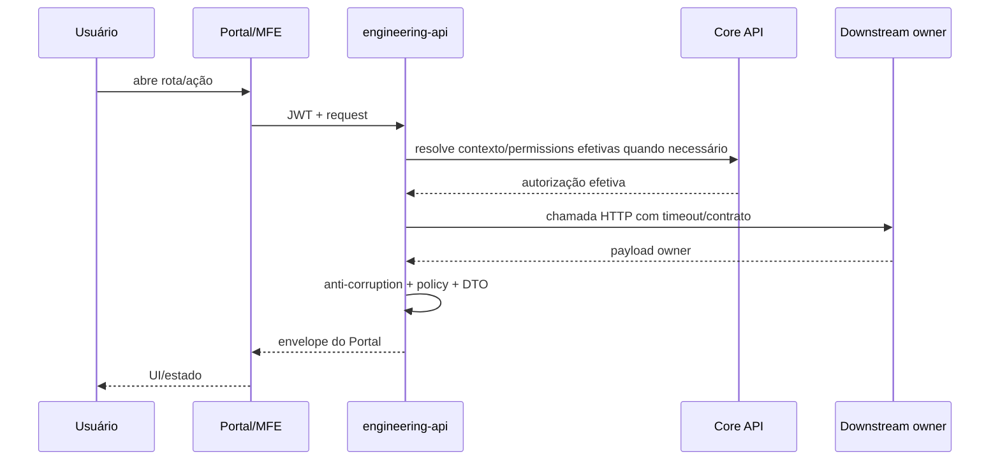

# Portal de Engenharia — arquitetura alvo

> **Status:** arquitetura de referência para implementação.  
> **Data:** 2026-09-11.  
> **Regra:** revalidar runtime, schemas e contratos no E0 antes de criar código.

## 1. Current

Hoje a experiência de Engenharia está distribuída em múltiplas superfícies:

```text
Portal Minha DELPI
├── dashboard-engineering
├── dashboard-lmps
├── controle-mp / my-requests
├── Transformômetro
├── Strategic Indicators
└── api-delpi
```

Não existe na baseline um `plugins/engineering` nem `engineering-api` canônicos.

## 2. Target

```text
Browser
  │
  ▼
Gateway / Reverse Proxy
  │
  ▼
Portal Minha DELPI
  │ Module Federation + JWT
  ▼
plugins/engineering
  │ HTTP/realtime somente pelo BFF
  ▼
engineering-api
  ├── Core API
  ├── api-delpi
  ├── strategic-indicators-api
  ├── requests-api
  ├── transformometro-api
  ├── PostgreSQL próprio
  └── adapters de storage allowlisted
```

### Dependency direction

```text
MFE → engineering-api → contratos externos
```

Nunca:

```text
MFE → api-delpi
MFE → commercial-api
engineering-api → import de domain/use case de outro serviço
```

## 3. Bounded context do Portal

O `engineering-api` é owner apenas de capacidades que pertencem ao produto Portal Engenharia:

- composição do Início;
- composição da Visão geral;
- normalização da worklist;
- Sala de interação;
- preferências específicas, se não houver owner transversal;
- configuração/índice derivado de bibliotecas técnicas quando aprovado;
- adapters e anti-corruption DTOs.

Não é owner de produto, LMP/TOTVS, Controle MP, TRANSFORMA+, indicadores estratégicos ou RBAC.

## 4. Backend — Clean Architecture

Estrutura alvo conceitual:

```text
engineering-api/
├── engineering_app/
│   ├── domain/
│   │   ├── rooms/
│   │   ├── tasks/
│   │   └── documents/
│   ├── application/
│   │   ├── use_cases/
│   │   ├── ports/
│   │   └── dto/
│   ├── interface/
│   │   └── http/
│   ├── infrastructure/
│   │   ├── persistence/
│   │   ├── gateways/
│   │   ├── storage/
│   │   └── realtime/
│   ├── composition/
│   └── main.py
├── migrations/
└── tests/
```

Responsabilidades:

- **domain:** regras próprias da Sala/documentos, sem Flask;
- **application:** casos de uso e ports;
- **interface:** validação HTTP, mapeamento status/envelope, sem regra de negócio;
- **infrastructure:** PostgreSQL, Core, api-delpi, SI, requests, Transformômetro, FILESERVER/storage;
- **composition:** DI/wiring.

## 5. Frontend — Clean Architecture

Estrutura alvo conceitual:

```text
plugins/engineering/src/
├── app/                 # shell, routes, session, navigation
├── api/                 # client do engineering-api
├── content/             # labels, help, route catalog
├── features/
│   ├── home/
│   ├── overview/
│   ├── rooms/
│   ├── tasks/
│   ├── lmps/
│   ├── products/
│   ├── drawings/
│   ├── documents/
│   └── help/
├── pages/
└── engineeringUi.ts     # façade @delpi/plugin-ui
```

Regras:

- HTTP não fica em components/pages;
- regras de autorização não são reimplementadas no React;
- presentation labels/help ficam centralizados;
- `@delpi/plugin-ui` é fonte de primitives/factories;
- CSS local só para layout/skin do módulo, sem sobrescrever `.delpi-ui-*`.

## 6. Fluxo de request



## 7. Autenticação e autorização

- autenticação via Keycloak/OIDC;
- JWT validado em cada serviço: assinatura, issuer, audience, exp;
- JWT carrega identidade/contexto, não é fonte final de permissions DELPI;
- authorization efetiva vem do Core por contrato vigente no runtime;
- o E0 deve revalidar endpoints Core atuais e não hardcodar path documental antigo;
- backend aplica capability + resource scope + regra do owner;
- frontend apenas omite/organiza UX com capabilities já resolvidas; ocultar botão não é segurança.

## 8. Persistência

PostgreSQL próprio do contexto, schema lógico `engineering`, apenas para estado do Portal.

P0 persistente provável:

- rooms;
- participants;
- messages;
- mentions/reactions;
- read state;
- attachments metadata;
- auditoria funcional onde não houver mecanismo transversal;
- preferências específicas se aprovadas.

Dados TOTVS/SI/requests/Transformômetro permanecem nos owners.

## 9. Sala de interação e realtime

A experiência deve seguir a maturidade do Comercial, mas o runtime é independente.

Fluxo alvo:

```text
POST mensagem
→ authorize room/member
→ persist transaction
→ commit
→ publish event
→ sockets inscritos recebem
→ inbox/read state atualizam
→ menção offline pode gerar notificação Core
```

Requisitos:

- subscribe/unsubscribe por sala;
- validação fail-closed da sala;
- isolamento entre rooms;
- reconnect/keepalive;
- anti-eco por client id quando adotado;
- persist-before-publish;
- eventos tipados/versionáveis;
- fallback/polling somente se explicitamente documentado como degradação.

A tecnologia realtime deve ser compatível com Flask e infraestrutura vigente; não trocar framework do serviço apenas por conveniência.

## 10. Integrações

| Downstream | Motivo | Regra |
|---|---|---|
| Core API | identidade, apps, RBAC, usuários/notificações | fail-closed para AuthZ |
| api-delpi | Engenharia/LMP/Produtos/desenhos/TOTVS | HTTP adapter |
| Strategic Indicators | metas/realizado/score | não recalcular no Portal |
| requests-api | Controle MP/work items | owner do workflow |
| transformometro-api | TRANSFORMA+ | owner do produto |
| FILESERVER/storage | documentos técnicos | backend-only, allowlist |

## 11. FILESERVER

Arquitetura segura:

```text
client envia library_id + document_id opaco
→ engineering-api valida permission
→ adapter resolve raiz allowlisted
→ normalize/resolve containment
→ valida extensão/tamanho
→ stream/download/preview
```

Proibido aceitar path arbitrário do request ou expor path/credencial de rede ao frontend.

## 12. Module Federation

- MFE `engineering` registrado no Core;
- `@delpi/plugin-ui` compartilhado conforme padrão vigente;
- React/runtime compartilhados de acordo com federation config canônica;
- remoteEntry sob gateway;
- standalone dev permitido apenas como auxílio, sem divergir do comportamento federado;
- smoke federado obrigatório antes de fechar cada grande onda de shell/rotas.

## 13. Gateway e runtime

Infra alvo deve incluir:

- serviço `engineering-api`;
- serviço/MFE `engineering`;
- rotas Nginx/Gateway para `/apps/engineering/` e `/apps/engineering-api/`;
- Upgrade/Connection para realtime quando path exigir;
- health/readiness;
- startup sequencial conforme scripts vigentes;
- envs documentadas sem segredo em repo.

## 14. Erros e degradação

Composições de leitura podem retornar estado parcial quando semanticamente seguro.

Exemplo:

```json
{
  "success": true,
  "data": {},
  "meta": {
    "partial": true,
    "partial_sources": ["transforma"]
  }
}
```

Não usar parcial para authorization, mutações ou quando dado ausente tornaria decisão enganosa.

## 15. Observabilidade

- request/correlation id;
- logs estruturados sem token/path sensível;
- métricas por downstream: latência, erro, timeout;
- contagem de conexões/reconnect realtime;
- audit trail para ações administrativas e downloads sensíveis;
- health ≠ readiness;
- readiness deve refletir somente dependências realmente necessárias para aceitar tráfego.

## 16. Segurança adicional

- rate limit no gateway/endpoints sensíveis;
- CORS restritivo;
- CSP/headers da plataforma;
- proteção IDOR em room/document/LMP;
- upload com MIME/tamanho/filename allowlist;
- download com autorização no request atual, nunca URL permanente pública;
- SQL parametrizado nos owners;
- sem segredo hardcoded;
- sem informação financeira/custo sem permission/policy adequada.

## 17. Rollout

Portal nasce em coexistência. Dashboard legado continua até paridade comprovada.

```text
new target disponível
→ personas de homologação
→ paridade funcional/dados/deep links
→ soft cutover (menu/CTA)
→ observação
→ redirect compatível
→ hard cutover
→ rollback window encerrada
```

Nenhum hard cutover na mesma mudança que cria a primeira versão da página substituta.
