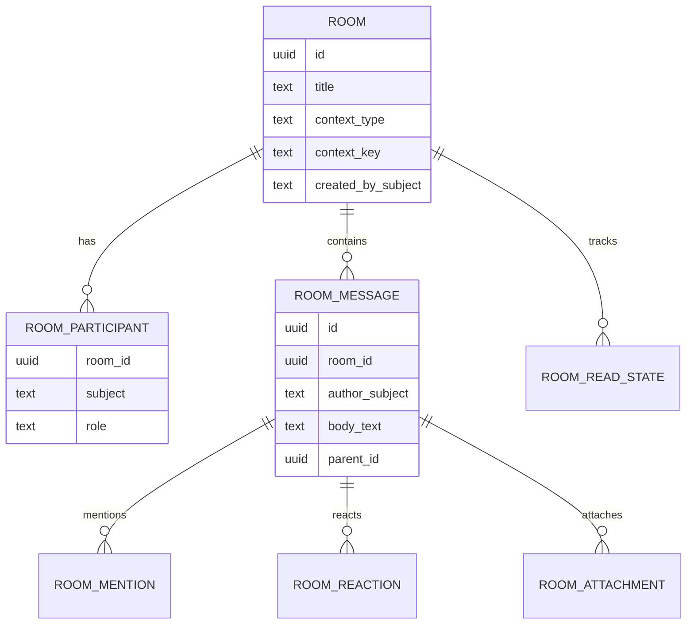

# Portal de Engenharia — modelo de dados alvo

> **Status:** planejamento arquitetural.  
> **Implementação:** não autorizada por este documento.  
> **Nota:** nomes físicos finais devem ser revalidados contra convenções/migrations vigentes antes de implementação.

## 1. Princípio

O `engineering-api` deve persistir apenas dados próprios do Portal de Engenharia. Dados mestres ou estados de outros bounded contexts não devem ser copiados como nova fonte de verdade.

Persistir localmente apenas o que o Portal realmente possui, como:

- Sala de interação;
- participantes e estado de leitura;
- anexos/metadados próprios da Sala;
- preferências específicas do módulo, se não houver owner transversal;
- índices/metadados derivados de bibliotecas FILESERVER, caso um índice persistente seja adotado futuramente.

Não persistir como owner:

- produto/TOTVS;
- LMP/TOTVS;
- workflow de Controle MP;
- processos TRANSFORMA+;
- scores Strategic Indicators;
- RBAC da plataforma.

## 2. Schema recomendado

Usar schema dedicado no banco operacional apropriado do domínio/plugins, conforme padrão vigente no momento da implementação. Nome conceitual:

```text
engineering
```

Nunca usar `postgres-core` para dados operacionais da Sala ou documentos de Engenharia.

## 3. Sala de interação

### `engineering.rooms`

| Campo | Tipo conceitual | Regra |
|---|---|---|
| `id` | UUID | PK |
| `title` | text | título visível |
| `room_type` | text/enum | `general`, `contextual` |
| `context_type` | text nullable | `product`, `lmp`, `project`, `nonconformity`, `raw_material_request` |
| `context_key` | text nullable | chave externa opaca para o contexto |
| `created_by_subject` | text | `sub` Keycloak |
| `created_at` | timestamptz | obrigatório |
| `updated_at` | timestamptz | obrigatório |
| `archived_at` | timestamptz nullable | soft archive |

Índice lógico único recomendado para salas contextuais ativas:

```text
(context_type, context_key, archived_at IS NULL)
```

A implementação deve decidir se haverá uma única sala canônica por contexto ou múltiplas salas por contexto. Essa decisão precisa estar travada no ADR antes da migration.

### `engineering.room_participants`

| Campo | Papel |
|---|---|
| `room_id` | FK room |
| `subject` | Keycloak `sub` |
| `role` | `member`, `owner`, `moderator` se necessário |
| `joined_at` | entrada |
| `left_at` | saída opcional |

Chave canônica de identidade = Keycloak `sub`; não copiar senha/role local.

### `engineering.room_messages`

| Campo | Papel |
|---|---|
| `id` | UUID PK |
| `room_id` | FK |
| `author_subject` | Keycloak `sub` |
| `body_text` | markdown/texto persistido |
| `parent_id` | reply opcional |
| `created_at` | timestamp |
| `edited_at` | nullable |
| `deleted_at` | soft delete |

Regra: persistir antes de publicar evento realtime.

### `engineering.room_message_mentions`

| Campo | Papel |
|---|---|
| `message_id` | FK mensagem |
| `mentioned_subject` | usuário mencionado |

### `engineering.room_message_reactions`

| Campo | Papel |
|---|---|
| `message_id` | FK |
| `subject` | autor da reação |
| `reaction` | token permitido |
| `created_at` | timestamp |

### `engineering.room_read_states`

| Campo | Papel |
|---|---|
| `room_id` | FK |
| `subject` | usuário |
| `last_read_message_id` | última mensagem lida, quando modelo permitir |
| `last_read_at` | timestamp |

### `engineering.room_attachments`

| Campo | Papel |
|---|---|
| `id` | UUID |
| `room_id` | FK |
| `message_id` | FK nullable durante draft, se suportado |
| `uploaded_by_subject` | autor |
| `original_filename` | nome amigável |
| `storage_key` | chave interna, nunca path arbitrário do cliente |
| `media_type` | MIME validado |
| `size_bytes` | tamanho |
| `created_at` | timestamp |
| `deleted_at` | soft delete |

Armazenamento físico deve seguir regra de upload persistente vigente. Não guardar arquivo binário na tabela sem justificativa arquitetural.

## 4. Minhas tarefas

A worklist **não precisa de tabela própria como fonte de verdade** no MVP. Preferir composição on-demand/cache técnico de respostas dos owners.

Se futuramente houver read model persistente/event-driven, documentar ADR específico com:

- evento fonte;
- idempotência;
- replay;
- staleness/freshness;
- chave externa;
- estratégia de correção;
- garantia de que o read model não vira workflow owner.

## 5. Produtos e LMPs

Não criar tabelas espelho para produto/LMP somente para facilitar UI.

Permitido:

- cache técnico com TTL;
- projection/read model justificado por performance;
- índices temporários/derivados com origem/freshness explícitos.

Proibido:

- CRUD local concorrente com TOTVS;
- dual-write;
- persistir estado derivado e tratá-lo como verdade sem estratégia de sincronização.

## 6. Documentos técnicos / FILESERVER

### Opção MVP recomendada: índice em memória/on-demand

Primeira entrega pode listar diretamente as bibliotecas allowlisted por adapter read-only, sem criar catálogo persistente, desde que performance medida suporte.

### Evolução opcional: índice persistente

Se a escala exigir busca mais rápida, criar índice derivado, não fonte de verdade.

Tabela conceitual:

### `engineering.document_index`

| Campo | Papel |
|---|---|
| `id` | UUID/opaque id |
| `library_id` | biblioteca lógica |
| `relative_key_hash` | identidade sem expor path |
| `display_name` | nome do arquivo |
| `extension` | extensão |
| `size_bytes` | tamanho |
| `modified_at` | modificação do FILESERVER |
| `context_type` | contexto inferido/normalizado se comprovado |
| `context_key` | chave associada |
| `indexed_at` | freshness |
| `exists_at_source` | estado derivado |

O path real, se necessário internamente, deve ser resolvido por adapter/configuração e não exposto em DTO público.

## 7. Auditoria

Ações que podem exigir trilha:

- criação/arquivamento de sala;
- inclusão/remoção de participante;
- upload/delete de anexo;
- downloads de documento técnico sensível, conforme política;
- ações administrativas.

Usar mecanismos de auditoria vigentes; não inventar segunda plataforma de auditoria no módulo.

## 8. Migrations

- migrations imutáveis/checksum conforme regra vigente;
- sem reset de banco em produção;
- migrations pequenas e reversibilidade/rollback documentados quando aplicável;
- seed de dados somente quando canônico e idempotente;
- nenhum segredo/path absoluto em migration.

## 9. Retenção

Definir antes de produção:

- retenção de mensagens;
- retenção de anexos;
- política de soft delete;
- política de documentos indexados;
- limpeza de cache;
- tratamento de usuário desativado.

A ausência dessas decisões não impede o protótipo documental, mas bloqueia produção da Sala/attachments.

## 10. Diagrama conceitual



## 11. Gates antes de criar schema físico

- ADR de `engineering-api` aprovado;
- decisão uma sala vs múltiplas por contexto;
- política de membership;
- retenção de mensagens/anexos;
- storage de anexos definido;
- eventos realtime definidos;
- migrations e banco alvo confirmados;
- testes de autorização/IDOR previstos.
