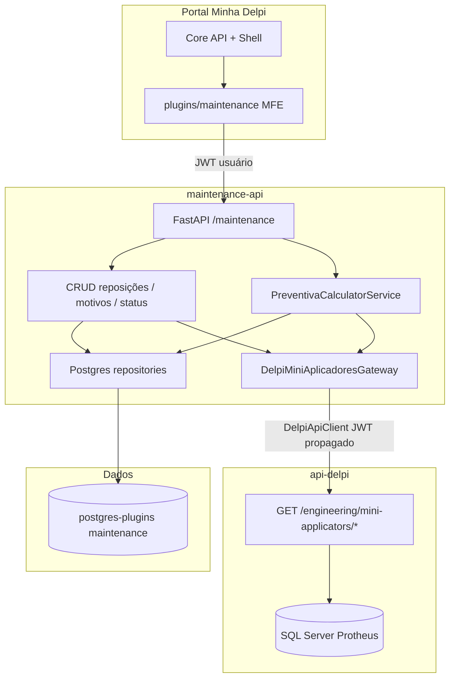
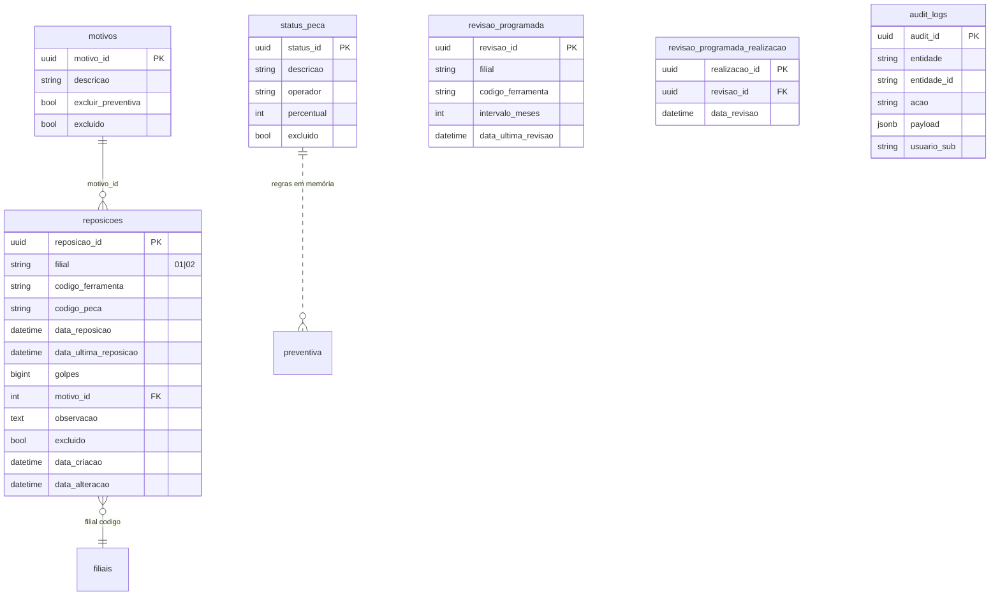

# Arquitetura — Manutenção

**Última atualização:** jun/2026 (revisão programada + auditoria da ferramenta)

## Diagrama de contexto



## Fronteiras de responsabilidade

| Dado / operação | Onde vive | Quem consome |
|-----------------|-----------|--------------|
| Reposições, motivos, status, revisão programada, auditoria | Postgres `maintenance` | MFE → API dedicada |
| Média de golpes, últimas reposições | Postgres (agregação SQL ou service) | API dedicada |
| Cadastro ferramentas/peças (SB1010, SG1010) | TOTVS via **api-delpi** | Gateway na API dedicada |
| Golpes no período (SD4/SHY/SH4/SH6) | TOTVS via **api-delpi** | Gateway na API dedicada |
| Estoque / árvore de componentes | TOTVS via **api-delpi** | Gateway na API dedicada |
| Filiais operacionais (01, 02) | Postgres ou api-delpi `/quality/branches` (avaliar reuse) | API dedicada |

**Regra:** a `maintenance-api` **nunca** importa driver SQL Server nem copia SQL Protheus do legado WinForms.

## Camadas (`maint_app`)

Espelha `tm_app` e `si_app`:

```text
maint_app/
  interface/http/           → rotas FastAPI, schemas Pydantic, envelope { success, message, data }
  application/services/     → orquestração (ReposicaoService, PreventivaService)
  domain/
    entities/               → POCOs (ou reutilizar Entities espelhadas do legado)
    services/               → regras puras (validação reposição, classificação status)
    ports/                  → IReposicaoRepository, IMiniApplicatorsTotvsPort, ...
  infrastructure/
    persistence/            → repositórios Postgres
    gateways/               → delpi_mini_applicators_gateway.py (DelpiApiClient)
  composition/              → DI / composer
  main.py
```

### Controllers no MFE

O WinForms legado usa `UI/Controllers` finos. No MFE, o equivalente são **hooks + api clients** em `src/data/api/` — sem lógica de negócio duplicada.

### Apresentação de dados (MFE)

| Componente | Responsabilidade |
|------------|------------------|
| `DataTableSection` | Seção com título, toolbar, tabela, paginação e ordenação |
| `DataTable` | Renderização tabular; cabeçalhos ordenáveis |
| `Pagination` | Navegação Anterior / Página N de M / Próxima |
| `MultiSelectField` | Filtro multi-valor (peça, motivo, status) com painel compacto |
| `BrDateInput` / `BrDatetimeInput` | Entrada de data/hora em pt-BR (`dd/mm/aaaa`, 24h); valor interno ISO |
| `FilterBar` | Barra de filtros com ações Limpar / Buscar |
| `useServerTable` | Estado de paginação/ordenação sincronizado com query params da API |
| `listQuery.appendListQuery` | Montagem de query string (`page`, `page_size`, `sort_by`, `sort_dir`, arrays) |
| `ReposicoesGolpesChart` | Gráfico de golpes por reposição no detalhe da ferramenta |
| `FerramentaReposicaoIndicadores` | KPIs ao lado do gráfico (média, última troca, etc.) |
| `FerramentaRevisaoProgramadaSection` | Agenda de revisão por tempo, marcar feito, histórico editável |
| `FerramentaAuditoriaSection` | Timeline de mutações (reposição + revisão) por ferramenta |
| `PreventivaDetailPanel` | Detalhe preventivo + gráficos Recharts |
| `StateBox` | Feedback inline (sucesso/erro) dismissível; `--dm-section-gap` abaixo |

Padrão alinhado ao Transformômetro — **não** duplicar paginação/ordenação em páginas individuais.

## Modelo de domínio — mini-aplicadores (Postgres)

Migrado do Access `MiniAplicadoresBD`:



Entidades TOTVS (`Ferramenta`, `Peca`, `FerramentaPeca`, `Componente`) **não** são persistidas no Postgres — são DTOs retornados pela api-delpi.

## Integração HTTP com api-delpi

Padrão **Strategic Indicators** (consumidor), não Transformômetro (exportador):

1. Port de domínio `IMiniApplicatorsTotvsPort` define o que o módulo precisa do ERP.
2. `DelpiMiniAplicadoresGateway` implementa o port usando `shared/delpi_api_client`.
3. JWT do usuário propagado via `bearer_authorization_from_context()`.
4. Rotas novas na api-delpi registradas em `route_contract_registry.py` + doc OpenAPI.

Detalhe das rotas propostas: [PLAYBOOK-01-fronteiras-api-delpi.md](./PLAYBOOK-01-fronteiras-api-delpi.md) e [integration-contracts.md](../../../maintenance-api/docs/integration-contracts.md).

### Variáveis de ambiente (API dedicada)

| Variável | Default | Descrição |
|----------|---------|-----------|
| `MAINT_API_ROOT_PATH` | `/apps/maintenance-api` | Prefixo gateway |
| `MAINT_RUN_MIGRATIONS_ON_STARTUP` | `true` (dev) | Flyway-style runner |
| `DELPI_API_URL` | `http://delpi-api-delpi:8000` | Base api-delpi |
| `DELPI_API_TIMEOUT` | `30` | Timeout HTTP |
| `PLUGINS_DB_*` | — | Postgres plugins |

## Envelope e erros

- API dedicada: mesmo envelope `{ success, message, data [, meta] }` dos plugins maduros.
- MFE: client tipado em `src/data/api/maintenanceApi.ts`.
- Textos PT de status/erro amigável: JSON de conteúdo ou chaves centralizadas (seguir evolução do chat quando integrar agente).

## Segurança

| Fluxo | Auth |
|-------|------|
| MFE → maintenance-api | JWT usuário (Keycloak) |
| maintenance-api → api-delpi | JWT propagado do request |
| Consumidor externo → dados operacionais | **Não** expor Postgres direto; futura fachada api-delpi se necessário (padrão Transforma+) |

RBAC por filial: permissões explícitas no manifesto (`maintenance.mini-applicators.view.filial-XX`, `manage.filial-XX`). Escopo resolvido em `FilialAccessScopeService` — ver `maintenance_permissions.py` e testes `test_filial_access_scope_service.py`.

### Auditoria operacional

Padrão alinhado ao Transformômetro (`audit_logs` nas mutações):

| Camada | Arquivo |
|--------|---------|
| Repositório | `infrastructure/persistence/repositories/audit_repository.py` |
| Helper HTTP | `interface/http/audit_http.py` → `log_ferramenta_audit()` |
| Actor JWT | `core/auth_actor.py` → `actor_sub_from_request()` |
| Rotas | `operational_routes.py` (write); `mini_applicators_routes.py` (read timeline) |

Falha ao gravar audit **não bloqueia** a mutação — log de warning apenas.

## Referências no monorepo

| Padrão | Referência |
|--------|------------|
| API + Postgres + MFE | `transformometro-api`, `plugins/transformometro` |
| Gateway api-delpi | `si_app/infrastructure/gateways/delpi_production_gateway.py` |
| Contratos integração | `transformometro-api/docs/integration-contracts.md` |
| Playbook envelope | `minha-delpi-ai-api/docs/roadmap/playbook-10-contrato-respostas-api-delpi.md` |
