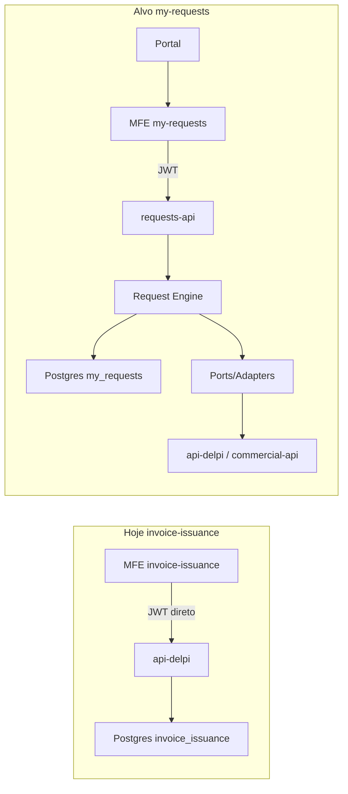
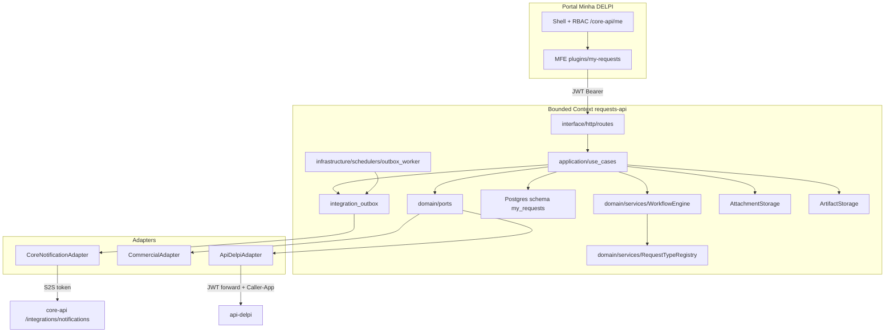
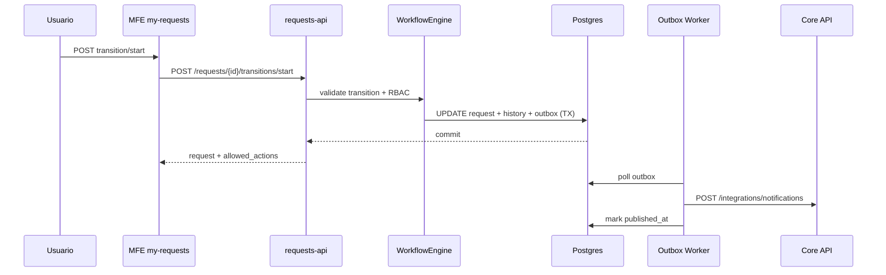
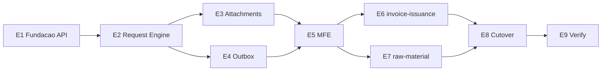

# Playbook técnico — Minhas Solicitações (`my-requests`)

> **Plugin:** `my-requests`  
> **API:** `/apps/requests-api/v1`  
> **Status:** discovery concluído — playbook executável para implementação  
> **Referência legado:** [`invoice-issuance`](../invoice-issuance/README.md)

---

## 1. Overview

**Minhas Solicitações** centraliza múltiplos tipos de solicitação corporativa (emissão de NF, criação de matéria-prima, cadastros, fluxos comerciais/administrativos) em um único microfrontend e uma **Requests API** dedicada, sem criar um MFE por tipo nem um monólito de `if request_type == ...` no motor central.

North star:

- Solicitante cria e acompanha solicitações em `/apps/my-requests`.
- Área responsável atende via fila de trabalho unificada.
- Workflow, timeline, comentários, anexos e artefatos são **transversais**.
- Integrações externas (TOTVS via api-delpi, Portal Comercial, etc.) ocorrem por **ports/adapters** e **outbox transacional**.
- Primeiro vertical: paridade com `invoice-issuance` (dual-run até cutover).
- Segundo vertical: `raw-material-creation` schema-driven — prova de plugabilidade sem alterar o Request Engine.

Arquitetura alvo:

```text
Portal → MFE my-requests → requests-api → Request Engine → Postgres my_requests
                                              ↓ ports/adapters
                                         api-delpi / commercial-api / core-api
```

---

## 2. Diagnóstico do código atual

### 2.1 O que existe no repositório

| Área | Evidência | Implicação |
|------|-----------|------------|
| **invoice-issuance (referência)** | MFE [`plugins/invoice-issuance/`](../../../plugins/invoice-issuance/) + rotas [`api-delpi/.../invoice_issuance/`](../../../api-delpi/app/interface/http/routes/invoice_issuance/) + schema Postgres `invoice_issuance` (V001–V004) | Template funcional de fila/workflow; **não** copiar acoplamento MFE→api-delpi |
| **Sem BFF dedicado (legado)** | [`docs/08-plugins/README.md`](../../08-plugins/README.md) — backend `api-delpi` para invoice-issuance | Desvio aceito no legado; `my-requests` **deve** ter `requests-api` ([`mfe-own-api-no-direct-api-delpi.mdc`](../../../.cursor/rules/mfe-own-api-no-direct-api-delpi.mdc)) |
| **allowed_actions server-side** | [`invoice_issuance_use_cases.py`](../../../api-delpi/app/application/use_cases/invoice_issuance/invoice_issuance_use_cases.py) L66–86 | Generalizar via `WorkflowEngine` + RBAC por RequestType |
| **Histórico append-only** | Tabela `invoice_issuance_history` | `request_status_history` + `request_events` |
| **Anexos incompletos** | Tabela + [`attachment_storage.py`](../../../api-delpi/app/application/services/invoice_issuance/attachment_storage.py); **zero rotas HTTP** | Playbook exige rotas upload/download antes do cutover |
| **Notificações síncronas** | [`invoice_issuance_portal_notification_service.py`](../../../api-delpi/app/application/services/invoice_issuance_portal_notification_service.py) — httpx fire-and-forget | Outbox transacional (padrão [`commercial-api` V014](../../../commercial-api/migrations/V014__integration_outbox_and_checkpoints.sql)) |
| **API própria canônica** | [`maintenance-api`](../../../maintenance-api/docs/ARCHITECTURE.md), [`commercial-api`](../../../commercial-api/commercial_app/composition/commercial_composer.py) | Modelo de pastas, composer, gateway, migrations checksum |
| **Outbox + retry** | `commercial.integration_outbox` + scheduler | Replicar em `my_requests.integration_outbox` |
| **Storage persistente** | [`persistent-upload-storage.mdc`](../../../.cursor/rules/persistent-upload-storage.mdc) | Dois volumes: attachments + artifacts |
| **S2S auth** | [`shared/delpi_auth/service_token.py`](../../../shared/delpi_auth/service_token.py) | Core notifications + adapters |
| **Manifest 1.0.0** | [`manifesto-plugin.md`](../../05-plugin-system/manifesto-plugin.md) | Tile único no menu; subrotas internas ao MFE ([`maintenance.manifest.json`](../../../plugins/maintenance/maintenance.manifest.json)) |
| **raw-material-creation** | **Não existe** módulo; só rotas TOTVS de catálogo MP | Segundo vertical = greenfield schema-driven |
| **purchase-requests-api** | Painel compras TOTVS — **não** é workflow genérico | Reutilizar só padrões de API/migrations |
| **requests-api / my-requests** | **Não existe** | Bounded context novo na raiz do monorepo |

### 2.2 Gap arquitetural



### 2.3 Decisões arquiteturais travadas

| # | Decisão | Escolha |
|---|---------|---------|
| D1 | Bounded context | `requests-api` novo pacote na raiz — domínio **fora** core-api e api-delpi |
| D2 | MFE → HTTP | Somente `/apps/requests-api/*` |
| D3 | TOTVS / lookups | `ApiDelpiAdapter` via `DelpiApiClient` + `X-Delpi-Caller-App: requests-api` |
| D4 | Postgres | Schema `my_requests` em `postgres-plugins`; migrations checksum V001+ |
| D5 | Identidade | Colunas canônicas explícitas + `payload JSONB` para dados do tipo |
| D6 | Workflow | State machine declarativa JSON por RequestType; **sem BPMN** |
| D7 | allowed_actions | Calculado no Request Engine; MFE render-only |
| D8 | RequestType plugável | Registry DB + JSON schemas; specialized feature no MFE |
| D9 | Attachments ≠ Artifacts | Tabelas, storage, MIME e RBAC distintos |
| D10 | Integrações | `RequestDestinationPort` + outbox na mesma transação |
| D11 | Notificações | Outbox → worker → `POST /core-api/integrations/notifications` |
| D12 | Idempotência | Header `Idempotency-Key` + tabela `idempotency_keys` |
| D13 | Manifest | 1 rota menu `/apps/my-requests`; demais rotas internas MFE |
| D14 | RBAC | `my-requests.access`, `.view-all`, `.manage` + `my-requests.{type}.create/process` |
| D15 | Filial | Opcional por RequestType (`required|optional|none`) |
| D16 | Primeiro vertical | `invoice-issuance`; plugin legado permanece até cutover |
| D17 | Segundo vertical | `raw-material-creation` schema-driven only |
| D18 | Framework API | FastAPI |
| D19 | Textos PT | `requests_app/content/pt-BR/*.json` |
| D20 | Ajuda | `helpTooltips.ts` + Manual espelho ([`feature-help-sync.mdc`](../../../.cursor/rules/feature-help-sync.mdc)) |

---

## 3. Inventário completo do `invoice-issuance`

### 3.1 MFE — `plugins/invoice-issuance/` (68 arquivos)

**Raiz / build / infra**

| Arquivo |
|---------|
| `invoice-issuance.manifest.json` |
| `package.json`, `package-lock.json` |
| `vite.config.ts`, `tsconfig.json`, `tsconfig.app.json`, `eslint.config.js` |
| `index.html`, `Dockerfile`, `nginx.conf`, `.gitignore` |
| `README.md` |

**Bootstrap**

| Arquivo |
|---------|
| `src/main.tsx`, `src/bootstrap.tsx`, `src/vite-env.d.ts`, `src/index.css` |
| `src/App.tsx`, `src/App.test.tsx` |

**Domain**

| Arquivo |
|---------|
| `src/domain/types.ts` |
| `src/domain/status.ts`, `status.test.ts` |
| `src/domain/permissions.ts`, `permissions.test.ts` |
| `src/domain/reviewChecklist.ts`, `reviewChecklist.test.ts` |
| `src/domain/stockWriteOff.ts`, `stockWriteOff.test.ts` |
| `src/domain/openSalesOrders.ts`, `openSalesOrders.test.ts` |
| `src/domain/issuanceSheet.ts`, `issuanceSheet.test.ts` |

**Application**

| Arquivo |
|---------|
| `src/application/IssuancePermissionsContext.tsx` |
| `src/application/issuancePermissionsContextValue.ts` |
| `src/application/useIssuancePermissions.ts` |

**Data / API**

| Arquivo |
|---------|
| `src/data/api/httpClient.ts` |
| `src/data/api/invoiceIssuanceApi.ts` |
| `src/data/api/meApi.ts` |

**UI — pages**

| Arquivo |
|---------|
| `src/ui/pages/QueuePage.tsx`, `QueuePage.test.tsx` |
| `src/ui/pages/IssuanceWizardPage.tsx`, `IssuanceWizardPage.test.tsx` |
| `src/ui/pages/RequestDetailPage.tsx`, `RequestDetailPage.test.tsx` |

**UI — components**

| Arquivo |
|---------|
| `src/ui/components/PartySearch.tsx` |
| `src/ui/components/ProductSearch.tsx` |
| `src/ui/components/CarrierSearch.tsx`, `CarrierSearch.test.tsx` |
| `src/ui/components/OpenSalesOrderPicker.tsx`, `OpenSalesOrderPicker.test.tsx` |
| `src/ui/components/QuantityInput.tsx`, `QuantityInput.test.tsx` |
| `src/ui/components/StatusBadge.tsx`, `StatusBadge.test.tsx` |
| `src/ui/components/CopyableValue.tsx`, `CopyableValue.test.tsx` |
| `src/ui/components/IssuanceProtheusSheet.tsx` |
| `src/ui/components/PageHeader.tsx` |

**UI — util / kit / content**

| Arquivo |
|---------|
| `src/ui/format.ts`, `format.test.ts` |
| `src/ui/kit.ts` |
| `src/constants/branch.ts`, `branch.test.ts` |
| `src/content/helpTooltips.ts` |
| `src/test/pluginUiMock.tsx` |

### 3.2 API — `api-delpi/` (~35 arquivos relacionados)

**HTTP**

| Arquivo |
|---------|
| `app/interface/http/routes/invoice_issuance/__init__.py` |
| `app/interface/http/routes/invoice_issuance/invoice_issuance_router.py` |
| `app/interface/http/routes/invoice_issuance/invoice_issuance_branch_access.py` |

**Application**

| Arquivo |
|---------|
| `app/application/use_cases/invoice_issuance/__init__.py` |
| `app/application/use_cases/invoice_issuance/invoice_issuance_use_cases.py` |
| `app/application/services/invoice_issuance_portal_notification_service.py` |
| `app/application/services/invoice_issuance/__init__.py` |
| `app/application/services/invoice_issuance/attachment_storage.py` |

**Domain**

| Arquivo |
|---------|
| `app/domain/services/invoice_issuance/__init__.py` |
| `app/domain/services/invoice_issuance/constants.py` |
| `app/domain/services/invoice_issuance/exceptions.py` |
| `app/domain/services/invoice_issuance/review_checklist.py` |
| `app/domain/services/invoice_issuance/carrier_contact.py` |
| `app/domain/services/invoice_issuance/open_sales_orders.py` |

**Infrastructure**

| Arquivo |
|---------|
| `app/infrastructure/persistence/plugins/repositories/invoice_issuance/__init__.py` |
| `app/infrastructure/persistence/plugins/repositories/invoice_issuance/postgres_invoice_issuance_repository.py` |
| `app/infrastructure/persistence/totvs/invoice_issuance_repositories/__init__.py` |
| `app/infrastructure/persistence/totvs/invoice_issuance_repositories/totvs_invoice_issuance_lookup_repository.py` |

**Composition / wiring**

| Arquivo |
|---------|
| `app/composition/invoice_issuance_composer.py` |

**Config / RBAC / registry (trechos)**

| Arquivo | Papel |
|---------|-------|
| `app/config.py` | `INVOICE_ISSUANCE_UPLOAD_DIR`, `INVOICE_ISSUANCE_NOTIFICATIONS_ENABLED` |
| `app/application/security/api_delpi_permissions.py` | Constantes + listas compostas |
| `app/interface/http/route_contract_registry.py` | 14 `operationId`s |
| `app/main.py` | `include_router(invoice_issuance_router.router)` |

### 3.3 Migrations

| Arquivo | Conteúdo |
|---------|----------|
| `api-delpi/migrations/plugins/invoice-issuance/V001__create_invoice_issuance_core.sql` | Schema + 4 tabelas core |
| `V002__add_sales_order_to_items.sql` | PV em aberto nos itens |
| `V003__add_carrier_code.sql` | `carrier_code` |
| `V004__add_carrier_contact.sql` | Snapshot SA4 |

### 3.4 Testes

**API (10 arquivos):**

| Arquivo |
|---------|
| `api-delpi/tests/test_invoice_issuance_use_cases.py` |
| `api-delpi/tests/test_invoice_issuance_contracts.py` |
| `api-delpi/tests/test_invoice_issuance_migration.py` |
| `api-delpi/tests/test_invoice_issuance_branch_access.py` |
| `api-delpi/tests/test_invoice_issuance_notifications.py` |
| `api-delpi/tests/test_invoice_issuance_review_checklist.py` |
| `api-delpi/tests/test_invoice_issuance_lookup_sql.py` |
| `api-delpi/tests/test_invoice_issuance_open_sales_orders.py` |
| `api-delpi/tests/test_invoice_issuance_carrier_contact.py` |
| `api-delpi/tests/test_invoice_issuance_attachment_storage.py` |

**MFE (17 arquivos `*.test.ts/tsx`)**

### 3.5 Infra / Core / docs satélites

| Arquivo | Papel |
|---------|-------|
| `infra/docker-compose.yml`, `docker-compose.dev.yml` | Serviço MFE + volume upload |
| `infra/env.local.example` | `INVOICE_ISSUANCE_UPLOAD_DIR` |
| `infra/README-ambiente.md` | Paths persistentes |
| `core-api/app/content/notification_catalog.json` | Categoria `invoice_issuance` |
| `api-delpi/docs/api/invoice-issuance.md` | Doc API |
| `docs/12-roadmap-e-evolucao/invoice-issuance/` | Roadmap legado |
| `plugins/guias-procedimentos/.../emissao-nota-fiscal.ts` | Guia → `/apps/invoice-issuance` |

### 3.6 Rotas HTTP ativas (14)

| Método | Rota | operationId |
|--------|------|-------------|
| GET | `/invoice-issuance/parties` | `search_invoice_issuance_parties` |
| GET | `/invoice-issuance/products` | `search_invoice_issuance_products` |
| GET | `/invoice-issuance/products/{code}/warehouse-01-balance` | `get_invoice_issuance_warehouse_01_balance` |
| GET | `/invoice-issuance/open-sales-orders` | `list_invoice_issuance_open_sales_orders` |
| GET | `/invoice-issuance/carriers` | `search_invoice_issuance_carriers` |
| POST | `/invoice-issuance/requests` | `create_invoice_issuance_request` |
| GET | `/invoice-issuance/requests` | `list_invoice_issuance_requests` |
| GET | `/invoice-issuance/requests/{id}` | `get_invoice_issuance_request` |
| PATCH | `/invoice-issuance/requests/{id}` | `update_invoice_issuance_request` |
| POST | `/invoice-issuance/requests/{id}/resubmit` | `resubmit_invoice_issuance_request` |
| POST | `/invoice-issuance/requests/{id}/start` | `start_invoice_issuance_request` |
| POST | `/invoice-issuance/requests/{id}/return` | `return_invoice_issuance_request` |
| POST | `/invoice-issuance/requests/{id}/issue` | `issue_invoice_issuance_request` |
| POST | `/invoice-issuance/requests/{id}/cancel` | `cancel_invoice_issuance_request` |

### 3.7 Status e allowed_actions (legado)

**Status:** `pending`, `in_progress`, `issued`, `returned`, `cancelled`

**Transições:**

```text
pending → in_progress → issued | returned | cancelled
returned → (PATCH + resubmit) → pending
```

**allowed_actions** (server-side):

| Action | Condição |
|--------|----------|
| `view` | Dono OU `can_view_all` |
| `edit` | `returned` + dono + `create` |
| `resubmit` | idem |
| `start` | `pending` + process/manage |
| `return` | `in_progress` + process/manage |
| `issue` | `in_progress` + process/manage |
| `cancel` | (create+owner+pending) OU (manage+non-terminal) OU (process+in_progress) |

---

## 4. Componentes generalizáveis

| Padrão legado | Generalização em `my-requests` |
|---------------|-------------------------------|
| Solicitação + fila + atendimento | `Request` + `list_work_queue_requests` |
| `allowed_actions(request, actor)` | `WorkflowEngine.compute_allowed_actions()` |
| Histórico append-only | `request_status_history` + `request_events` |
| RBAC multi-filial | `branch_scope` por RequestType + gate API |
| Notificações Core | `PortalNotificationAdapter` + outbox |
| `IssuancePermissionsContext` | `RequestsPermissionsContext` |
| Deep link `?requestId=` | Query `?id=` no MFE shell |
| Composition root + use cases | `requests_composer.py` |
| Postgres schema isolado + migrations | Schema `my_requests` |
| Storage upload (PDF) | `AttachmentStorage` + rotas HTTP completas |
| Assignee em transição `start` | `request_assignments` |
| Comentários / justificativas | `request_comments` + campos canônicos (`return_reason`) |

---

## 5. Componentes que permanecem específicos

| Componente NF | Destino |
|---------------|---------|
| Tipos NF (`sale`, `return`, `sample`, …) | `payload.invoice_type` + validador registrado no type |
| Lookups SA1/SA2/SB1/SB2/SA4 | `ApiDelpiAdapter` — rotas extension `invoice-issuance/lookups/*` |
| PV em aberto, stock write-off | Payload + domain validators no type plugin |
| `review_checklist`, `IssuanceProtheusSheet` | MFE `features/invoice-issuance/` |
| Colunas party/freight/carrier no Postgres | Migradas para `payload` na migração E8 |
| Status aliases `issued`/`returned` | `workflow_definition.statusAliases` |
| Artifact NF PDF/XML | `request_artifacts` com `artifact_kind` |
| Permissões `invoice-issuance.*` | Coexistem até cutover; novas: `my-requests.invoice-issuance.*` |

---

## 6. Arquitetura proposta

### 6.1 Responsabilidades por camada

| Camada | Responsabilidade | Não faz |
|--------|------------------|---------|
| **Core API** | SSO, RBAC, apps, manifestos, notificações plataforma | Domínio de solicitações |
| **requests-api** | Request Engine, workflow, persistência, outbox | SQL TOTVS direto |
| **api-delpi** | TOTVS, lookups operacionais | Regra de workflow de solicitação (pós-cutover) |
| **MFE my-requests** | UI, render-only de `allowed_actions` | State machine no frontend; **primitivos de UI locais** |

### 6.1.1 UI kit-first (obrigatório)

O MFE **não** inventa botão/card/tabela/campo próprio. Tudo via `@delpi/plugin-ui` (Federation) + factories em [`plugins/my-requests/src/ui/mrUi.tsx`](../../../plugins/my-requests/src/ui/mrUi.tsx).

| Fazer | Não fazer |
|-------|-----------|
| `ActionButton`, `DataTable`, `SectionCard`, `TextField`, `SelectField`, `FieldLabel`, … | `<button class="…__btn">`, tabelas/painéis BEM locais |
| Tokens + layout de página em `index.css` | CSS que espelha `.delpi-ui-*` no MFE |
| Teste `mrUi.kitFirst.test.ts` | Aceitar chrome primitivo “só nesta tela” |

Regra Cursor: `plugins-reusable-components.mdc`. Doc plugin: [`plugins/my-requests/README.md`](../../../plugins/my-requests/README.md) § UI kit-first. **Wireframes + catálogo de componentes (em uso e previstos):** [`WIREFRAMES.md`](./WIREFRAMES.md).

### 6.2 Bounded context

```text
requests-api/
  Dockerfile
  migrations/
  tests/
  requests_app/
    main.py
    config.py
    composition/requests_composer.py
    core/
    domain/
      entities/
      services/workflow_engine.py, request_type_registry.py
      ports/
    application/
      use_cases/
      services/attachment_storage.py, artifact_storage.py
      security/requests_permissions.py
    infrastructure/
      persistence/repositories/
      gateways/api_delpi_adapter.py, commercial_adapter.py, core_notification_adapter.py
      schedulers/outbox_worker.py
    interface/http/routes/
    content/pt-BR/

plugins/my-requests/
  my-requests.manifest.json
  src/
    bootstrap.tsx, App.tsx
    application/RequestsPermissionsContext.tsx
    data/api/
    domain/
    features/
      core/
      invoice-issuance/
      raw-material-creation/
    content/helpTooltips.ts
```

### 6.3 Referências canônicas no monorepo

| Necessidade | Referência |
|-------------|------------|
| Clean architecture API | [`maintenance-api/docs/ARCHITECTURE.md`](../../../maintenance-api/docs/ARCHITECTURE.md) |
| Composer / use cases | [`commercial_composer.py`](../../../commercial-api/commercial_app/composition/commercial_composer.py) |
| Outbox | [`commercial-api` V014](../../../commercial-api/migrations/V014__integration_outbox_and_checkpoints.sql) |
| Attachment storage | [`commercial_app/.../attachment_storage.py`](../../../commercial-api/commercial_app/application/services/attachment_storage.py) |
| MFE scaffold | [`novo-plugin-mfe-checklist.md`](../../05-plugin-system/novo-plugin-mfe-checklist.md) |
| Migrations checksum | [`migrations-immutable-checksum.mdc`](../../../.cursor/rules/migrations-immutable-checksum.mdc) |
| S2S token | [`shared/delpi_auth/service_token.py`](../../../shared/delpi_auth/service_token.py) |

---

## 7. Diagrama Mermaid

### 7.1 Contexto



### 7.2 Fluxo de transição



---

## 8. Modelo de domínio

### 8.1 RequestType

| Campo | Tipo | Descrição |
|-------|------|-----------|
| `id` | UUID | PK |
| `code` | string | Único (`invoice-issuance`, `raw-material-creation`) |
| `name` | string | Rótulo UI |
| `description` | text | |
| `category` | string | Agrupamento menu/filtros |
| `icon` | string | lucide icon name |
| `active` | bool | |
| `version` | int | Incremento em mudança de schema/workflow |
| `presentation_mode` | enum | `schema_driven` \| `specialized` |
| `branch_scope` | enum | `required` \| `optional` \| `none` |
| `form_schema` | JSONB | JSON Schema (schema-driven) |
| `ui_schema` | JSONB | UI Schema (schema-driven) |
| `workflow_definition` | JSONB | State machine declarativa |
| `destination_config` | JSONB | `{ "adapter": "api_delpi", "capabilities": [...] }` |
| `permission_prefix` | string | Ex.: `my-requests.invoice-issuance` |

### 8.2 Request

| Campo | Tipo | Descrição |
|-------|------|-----------|
| `id` | UUID | PK |
| `request_number` | string | `REQ-YYYY-NNNNNN` (sequence global) |
| `request_type_id` | UUID | FK |
| `status` | string | Status canônico do workflow |
| `priority` | enum | `normal` \| `high` \| `urgent` |
| `branch_code` | string(2)? | Quando `branch_scope` exige |
| `created_by_user_id` | string | |
| `created_by_name` | string | Snapshot |
| `payload` | JSONB | Dados específicos do tipo |
| `return_reason` | text? | Quando status = `needs_information` |
| `version` | int | Optimistic lock / outbox |
| `created_at` | timestamptz | |
| `updated_at` | timestamptz | |
| `completed_at` | timestamptz? | |
| `cancelled_at` | timestamptz? | |
| `cancel_justification` | text? | |

### 8.3 RequestStatusHistory

Append-only: `id`, `request_id`, `from_status`, `to_status`, `action`, `actor_user_id`, `actor_name`, `justification`, `changes JSONB`, `created_at`.

### 8.4 RequestAssignment

`id`, `request_id`, `role` (`processor`|`queue`), `assignee_user_id?`, `queue_code?`, `assigned_at`, `released_at?`.

### 8.5 RequestComment

`id`, `request_id`, `author_user_id`, `author_name`, `body`, `created_at`, `updated_at?`.

### 8.6 RequestAttachment (entrada)

Metadado de arquivo fornecido pelo solicitante. Binário em volume `my-requests-attachments`.

### 8.7 RequestArtifact (saída)

Resultado do atendimento/sistema (NF PDF, XML, planilha). Binário em volume `my-requests-artifacts`. Campos: `artifact_kind`, `produced_by_user_id`, `produced_by_name`, `checksum_sha256`.

### 8.8 RequestEvent

Timeline enriquecida: `event_type` (`created`, `transition`, `commented`, `attachment_added`, `artifact_added`, `integration_failed`, …), `payload JSONB`, `created_at`.

### 8.9 IntegrationOutbox

Espelho commercial-api + `request_id`, `request_version`, `dedupe_key`, `next_retry_at`, `dead_letter_at`.

---

## 9. Modelo de banco

Schema Postgres: **`my_requests`**

### 9.1 V001 — schema_migrations

Padrão checksum runner (igual `purchase-requests-api`, `maintenance-api`).

### 9.2 V002 — core domain (outline SQL)

```sql
CREATE SCHEMA IF NOT EXISTS my_requests;

CREATE TABLE my_requests.request_types (
    id UUID PRIMARY KEY DEFAULT gen_random_uuid(),
    code VARCHAR(80) NOT NULL UNIQUE,
    name VARCHAR(200) NOT NULL,
    description TEXT,
    category VARCHAR(80) NOT NULL DEFAULT 'general',
    icon VARCHAR(80) NOT NULL DEFAULT 'file-text',
    active BOOLEAN NOT NULL DEFAULT TRUE,
    version INT NOT NULL DEFAULT 1,
    presentation_mode VARCHAR(20) NOT NULL
        CHECK (presentation_mode IN ('schema_driven', 'specialized')),
    branch_scope VARCHAR(20) NOT NULL DEFAULT 'optional'
        CHECK (branch_scope IN ('required', 'optional', 'none')),
    form_schema JSONB NOT NULL DEFAULT '{}'::jsonb,
    ui_schema JSONB NOT NULL DEFAULT '{}'::jsonb,
    workflow_definition JSONB NOT NULL,
    destination_config JSONB NOT NULL DEFAULT '{}'::jsonb,
    permission_prefix VARCHAR(120) NOT NULL,
    created_at TIMESTAMPTZ NOT NULL DEFAULT NOW(),
    updated_at TIMESTAMPTZ NOT NULL DEFAULT NOW()
);

CREATE SEQUENCE my_requests.request_number_seq;

CREATE TABLE my_requests.requests (
    id UUID PRIMARY KEY DEFAULT gen_random_uuid(),
    request_number VARCHAR(32) NOT NULL UNIQUE,
    request_type_id UUID NOT NULL REFERENCES my_requests.request_types(id),
    status VARCHAR(40) NOT NULL,
    priority VARCHAR(20) NOT NULL DEFAULT 'normal'
        CHECK (priority IN ('normal', 'high', 'urgent')),
    branch_code VARCHAR(2),
    created_by_user_id VARCHAR(100) NOT NULL,
    created_by_name VARCHAR(200) NOT NULL,
    payload JSONB NOT NULL DEFAULT '{}'::jsonb,
    return_reason TEXT,
    cancel_justification TEXT,
    version INT NOT NULL DEFAULT 1,
    created_at TIMESTAMPTZ NOT NULL DEFAULT NOW(),
    updated_at TIMESTAMPTZ NOT NULL DEFAULT NOW(),
    completed_at TIMESTAMPTZ,
    cancelled_at TIMESTAMPTZ
);

CREATE INDEX ix_requests_type_status_created
    ON my_requests.requests (request_type_id, status, created_at DESC);
CREATE INDEX ix_requests_created_by
    ON my_requests.requests (created_by_user_id);
CREATE INDEX ix_requests_branch_status
    ON my_requests.requests (branch_code, status)
    WHERE branch_code IS NOT NULL;

-- request_status_history, request_assignments, request_comments,
-- request_attachments, request_artifacts, request_events,
-- integration_outbox, idempotency_keys — ver migrations V002–V004 na implementação E1–E4
```

### 9.3 V003 — outbox + idempotency

Tabela `integration_outbox` (campos: `event_type`, `aggregate_type`, `aggregate_id`, `payload`, `request_id`, `request_version`, `dedupe_key`, `available_at`, `published_at`, `attempts`, `last_error`, `next_retry_at`, `dead_letter_at`).

Tabela `idempotency_keys` (`key`, `route`, `actor_user_id`, `response_snapshot JSONB`, `created_at`, UNIQUE por janela).

### 9.4 V004 — seeds RequestType

Seeds: `invoice-issuance` (specialized), `raw-material-creation` (schema_driven).

---

## 10. Contratos REST iniciais

**Base:** `/apps/requests-api/v1`  
**Auth:** JWT Bearer (Keycloak) — permissões via claims + resolução Core API no MFE.  
**Envelope:** `{ success, message, data, meta? }` — padrão FastAPI `requests_app/core/responses.py`.

### 10.1 Request types

| Método | Path | operationId | Permissão |
|--------|------|-------------|-----------|
| GET | `/request-types` | `list_request_types` | `my-requests.access` |
| GET | `/request-types/{code}` | `get_request_type` | `my-requests.access` |

**Response `get_request_type`:**

```json
{
  "code": "invoice-issuance",
  "presentation_mode": "specialized",
  "branch_scope": "required",
  "form_schema": {},
  "ui_schema": {},
  "workflow_definition": { "...": "..." },
  "capabilities": ["lookups.parties", "lookups.products"]
}
```

### 10.2 Requests CRUD + filas

| Método | Path | operationId | Permissão |
|--------|------|-------------|-----------|
| POST | `/requests` | `create_request` | `{type}.create` |
| GET | `/requests/mine` | `list_my_requests` | `my-requests.access` |
| GET | `/requests/work-queue` | `list_work_queue_requests` | `{type}.process` ou `view-all` |
| GET | `/requests/{id}` | `get_request` | owner / view-all / process |
| POST | `/requests/{id}/transitions/{action}` | `transition_request` | derivado de `allowed_actions` |

**Headers mutantes:** `Idempotency-Key: <uuid>` (obrigatório em POST create e transitions).

**Response `get_request` (campos essenciais):**

```json
{
  "id": "...",
  "request_number": "REQ-2026-000042",
  "type_code": "invoice-issuance",
  "status": "in_progress",
  "branch_code": "01",
  "payload": {},
  "allowed_actions": ["view", "return", "complete", "cancel"],
  "assignments": [],
  "created_by_name": "...",
  "created_at": "..."
}
```

### 10.3 Timeline, comentários, arquivos

| Método | Path | operationId |
|--------|------|-------------|
| GET | `/requests/{id}/events` | `list_request_events` |
| GET | `/requests/{id}/comments` | `list_request_comments` |
| POST | `/requests/{id}/comments` | `create_request_comment` |
| GET | `/requests/{id}/attachments` | `list_request_attachments` |
| POST | `/requests/{id}/attachments` | `create_request_attachment` |
| GET | `/attachments/{id}/download` | `download_request_attachment` |
| GET | `/requests/{id}/artifacts` | `list_request_artifacts` |
| POST | `/requests/{id}/artifacts` | `create_request_artifact` |
| GET | `/artifacts/{id}/download` | `download_request_artifact` |

### 10.4 Extensões type-specific (invoice-issuance)

Sub-router: `/v1/types/invoice-issuance/lookups/*` — **fora** do engine core.

| Método | Path | operationId |
|--------|------|-------------|
| GET | `/types/invoice-issuance/parties` | `search_invoice_issuance_parties` |
| GET | `/types/invoice-issuance/products` | `search_invoice_issuance_products` |
| GET | `/types/invoice-issuance/carriers` | `search_invoice_issuance_carriers` |
| GET | `/types/invoice-issuance/open-sales-orders` | `list_invoice_issuance_open_sales_orders` |

Implementação: delega para `ApiDelpiAdapter` (proxy para rotas api-delpi existentes durante transição; depois pode inlined).

---

## 11. Estratégia de Request Types

### 11.1 Dois níveis plugáveis

| Modo | Quando | API | MFE |
|------|--------|-----|-----|
| **schema_driven** | Formulários simples (raw-material) | `form_schema` + validação JSON Schema | Renderer genérico `@delpi/plugin-ui` |
| **specialized** | Fluxos complexos (invoice-issuance) | Lookups extension + payload validators registrados | Feature module dedicada |

### 11.2 Registro de tipo (sem alterar engine)

1. Migration seed em `request_types`.
2. Validadores opcionais em `requests_app/domain/plugins/{code}/validators.py` — carregados por registry, **não** import no `WorkflowEngine`.
3. MFE: lazy route `features/{code}/`.
4. Permissões: `my-requests.{code}.create`, `my-requests.{code}.process`.

### 11.3 Critério de plugabilidade (E7)

Adicionar `raw-material-creation` exige:

- Zero alteração em `workflow_engine.py` (salvo bug genérico comprovado).
- Zero `if request_type ==` em use cases centrais.
- Apenas seed JSON + MFE schema form + testes.

---

## 12. Estratégia de workflows

### 12.1 State machine declarativa

Estados genéricos de referência:

`draft`, `submitted`, `assigned`, `in_progress`, `needs_information`, `completed`, `rejected`, `cancelled`

Cada RequestType declara subset em `workflow_definition.statuses`. Nem todo tipo usa todos.

### 12.2 Exemplo invoice-issuance (paridade legado)

```json
{
  "initialStatus": "submitted",
  "terminalStatuses": ["completed", "cancelled", "rejected"],
  "statusAliases": {
    "submitted": "pending",
    "needs_information": "returned",
    "completed": "issued"
  },
  "transitions": [
    {
      "action": "start",
      "from": ["submitted"],
      "to": "in_progress",
      "requires": { "permissions": ["process"], "assignSelf": true }
    },
    {
      "action": "return",
      "from": ["in_progress"],
      "to": "needs_information",
      "requires": { "permissions": ["process"], "fields": ["return_reason"] }
    },
    {
      "action": "resubmit",
      "from": ["needs_information"],
      "to": "submitted",
      "requires": { "permissions": ["create"], "ownership": true }
    },
    {
      "action": "complete",
      "from": ["in_progress"],
      "to": "completed",
      "requires": { "permissions": ["process"] },
      "actionAlias": "issue"
    },
    {
      "action": "cancel",
      "from": ["submitted", "in_progress", "needs_information"],
      "to": "cancelled",
      "requires": { "permissionsAny": ["create", "process", "manage"], "fields": ["cancel_justification"] }
    }
  ]
}
```

### 12.3 Exemplo raw-material-creation (simples)

```json
{
  "initialStatus": "submitted",
  "terminalStatuses": ["completed", "rejected", "cancelled"],
  "transitions": [
    { "action": "start", "from": ["submitted"], "to": "in_progress", "requires": { "permissions": ["process"] } },
    { "action": "complete", "from": ["in_progress"], "to": "completed", "requires": { "permissions": ["process"] } },
    { "action": "reject", "from": ["in_progress"], "to": "rejected", "requires": { "permissions": ["process"] } },
    { "action": "cancel", "from": ["submitted"], "to": "cancelled", "requires": { "permissions": ["create"], "ownership": true } }
  ]
}
```

### 12.4 WorkflowEngine (responsabilidades)

- `can_transition(request, action, actor)` → bool + reason code
- `apply_transition(...)` → new status + history row
- `compute_allowed_actions(request, actor)` → `string[]`
- Respeita `version` optimistic lock
- Emite eventos outbox configurados por transição (`onEnter`, `notify`)

**Proibido:** BPMN, engine externa, regras de transição hardcoded por type no engine.

---

## 13. Estratégia de attachments/artifacts

### 13.1 Attachments (entrada)

| Aspecto | Valor |
|---------|-------|
| Quem envia | Solicitante (status não terminal) |
| MIME | PDF, JPEG, PNG, WEBP, TXT, DOC/DOCX, XLS/XLSX (lista commercial-api) |
| Tamanho max | 25 MB |
| Storage env | `MY_REQUESTS_ATTACHMENT_UPLOAD_DIR` → `/app/data/my-requests-attachments` |
| Volume host | `${DELPI_DATA_HOST_DIR}/my-requests-attachments` |
| Path disco | `{request_id}/{uuid}{ext}` |
| DB | `request_attachments`: `original_name`, `stored_name`, `mime_type`, `size_bytes`, `checksum_sha256`, `created_by_user_id` |
| Download | GET autenticado; audit em `request_events` |

### 13.2 Artifacts (saída)

| Aspecto | Valor |
|---------|-------|
| Quem produz | Processador ou sistema (outbox worker) |
| MIME | PDF, XML (`application/xml`, `text/xml`), XLSX |
| Tamanho max | 50 MB |
| Storage env | `MY_REQUESTS_ARTIFACT_UPLOAD_DIR` |
| Volume host | `${DELPI_DATA_HOST_DIR}/my-requests-artifacts` |
| Path disco | `{request_id}/artifacts/{artifact_kind}/{uuid}{ext}` |
| DB | `request_artifacts`: `artifact_kind`, `produced_by_*`, metadata NF opcional |
| Visibilidade | Solicitante + processadores + view-all |

### 13.3 Segurança

- Filename sanitizado (`_SAFE_PART` regex — padrão commercial-api).
- Path traversal guard no storage service.
- Content-Type validado; magic bytes opcional fase 2.
- Nunca servir arquivo sem checagem RBAC na request pai.

---

## 14. Estratégia de integração

### 14.1 Ports (domain)

```python
# requests_app/domain/ports/request_destination_port.py
class RequestDestinationPort(ABC):
    @abstractmethod
    def deliver(self, *, request: Request, event_type: str, payload: dict) -> DeliveryResult: ...

# requests_app/domain/ports/operational_lookup_port.py
class OperationalLookupPort(ABC):
    @abstractmethod
    def search_parties(self, **kwargs) -> list[dict]: ...
    # capabilities declaradas em destination_config

# requests_app/domain/ports/portal_notification_port.py
class PortalNotificationPort(ABC):
    @abstractmethod
    def enqueue_notification(self, *, outbox_row: IntegrationOutboxRow) -> None: ...
```

### 14.2 Adapters (infrastructure)

| Adapter | Destino | Uso inicial |
|---------|---------|-------------|
| `ApiDelpiAdapter` | `/apps/api-delpi/*` | Lookups TOTVS invoice-issuance |
| `CommercialAdapter` | `/apps/commercial-api/*` | Stub — futuras solicitações comerciais |
| `CoreNotificationAdapter` | `/core-api/integrations/notifications` | Sino portal |

### 14.3 Regras

- Use cases centrais dependem de **ports**, não de httpx.
- Registry mapeia `destination_config.adapter` → factory no composer.
- **Proibido** escrever em banco de outro serviço.
- Falha no destino **não** invalida commit da solicitação (outbox retry).

---

## 15. Outbox / retry / idempotência

### 15.1 Fluxo transacional

```text
BEGIN
  UPDATE requests SET status=..., version=version+1
  INSERT request_status_history
  INSERT request_events
  INSERT integration_outbox (event_type, payload, dedupe_key, request_version)
COMMIT
→ worker poll available_at <= now() AND published_at IS NULL
→ adapter.deliver / CoreNotificationAdapter
→ UPDATE published_at OR attempts++, last_error, next_retry_at
→ após N tentativas: dead_letter_at
```

### 15.2 Campos outbox

| Campo | Descrição |
|-------|-----------|
| `event_id` | UUID (= outbox.id) |
| `request_id` | FK lógica |
| `request_version` | Versão da request no enqueue |
| `dedupe_key` | Ex.: `request:{id}:transition:complete:v3` |
| `attempts` | Contador |
| `next_retry_at` | Backoff exponencial (30s, 2m, 10m, 1h, 6h) |
| `processed_at` | = `published_at` |
| `last_error` | Texto truncado |
| `dead_letter_at` | Após 8 tentativas |

### 15.3 Idempotência HTTP

- Header `Idempotency-Key` em POST `/requests`, POST transitions, POST attachments/artifacts.
- Tabela `idempotency_keys`: retorna snapshot cached em replay (24h TTL).
- Adapters externos: repassar `Idempotency-Key` quando API destino suportar (CEC pattern).

### 15.4 Referência implementação

Copiar estrutura de:

- [`commercial-api/.../integration_outbox_repository_port.py`](../../../commercial-api/commercial_app/domain/ports/integration_outbox_repository_port.py)
- [`integration_jobs_scheduler.py`](../../../commercial-api/commercial_app/infrastructure/schedulers/integration_jobs_scheduler.py)

---

## 16. RBAC

### 16.1 Permissões base (manifest)

| Código | Uso |
|--------|-----|
| `my-requests.access` | Abrir MFE |
| `my-requests.view-all` | Ver todas solicitações (ambas filiais / todos tipos visíveis) |
| `my-requests.manage` | Admin tipos, cancelamentos excepcionais |

### 16.2 Permissões por RequestType

| Código | Uso |
|--------|-----|
| `my-requests.invoice-issuance.create` | Criar/corrigir próprias devolvidas |
| `my-requests.invoice-issuance.process` | Atender fila NF |
| `my-requests.raw-material-creation.create` | Criar solicitação MP |
| `my-requests.raw-material-creation.process` | Atender fila MP |

Filial (quando `branch_scope=required`):

| Código | Uso |
|--------|-----|
| `my-requests.view.filial-01` | Escopo SC |
| `my-requests.view.filial-02` | Escopo ES |

Gate API: `requests_branch_access.py` — espelho [`invoice_issuance_branch_access.py`](../../../api-delpi/app/interface/http/routes/invoice_issuance/invoice_issuance_branch_access.py).

### 16.3 Regras

- JWT **não** contém lista completa de permissões — MFE usa `/core-api/me`.
- WorkflowEngine recebe `Actor` com flags derivadas das permissões resolvidas.
- Permissões legado `invoice-issuance.*` permanecem até cutover E8.

---

## 17. Arquitetura frontend

### 17.1 Stack

- React + Vite + Module Federation
- `@delpi/plugin-ui` via `preparePluginUiRemote()`
- Design system: [`plugins-visual-design-system.mdc`](../../../.cursor/rules/plugins-visual-design-system.mdc)
- Auth: token do Portal via props `getAccessToken`

### 17.2 Rotas MFE (internas — manifest só tile raiz)

| Path | Página |
|------|--------|
| `/apps/my-requests` | Redirect → `/mine` ou dashboard |
| `/apps/my-requests/mine` | Minhas solicitações |
| `/apps/my-requests/work-queue` | Fila de atendimento |
| `/apps/my-requests/new` | Picker de tipo |
| `/apps/my-requests/new/:typeCode` | Create (schema ou specialized) |
| `/apps/my-requests/requests/:id` | Detalhe + timeline |
| `/apps/my-requests/admin` | Admin tipos (read-only fase 1) |

Deep link: `/apps/my-requests/requests/{id}` ou `?id={uuid}`.

### 17.3 Camadas MFE

```text
src/
  bootstrap.tsx          # MF + mount
  App.tsx                # router pathname interno
  application/
    RequestsPermissionsContext.tsx
  data/api/
    httpClient.ts        # X-Delpi-Caller-App: my-requests
    requestsApi.ts
    meApi.ts
  domain/
    types.ts             # espelho contratos API
    statusLabels.ts
  features/
    core/
      RequestListPage.tsx
      RequestDetailPage.tsx
      WorkQueuePage.tsx
      TimelinePanel.tsx
      CommentsPanel.tsx
      AttachmentsPanel.tsx
      ArtifactsPanel.tsx
      ActionBar.tsx        # render-only allowed_actions
    invoice-issuance/
      IssuanceWizardPage.tsx  # port do legado
      components/...
    raw-material-creation/
      SchemaFormPage.tsx
  content/helpTooltips.ts
```

### 17.4 Regras frontend

- **Não** reimplementar state machine — consumir `allowed_actions`.
- **Não** chamar api-delpi direto — só `requests-api`.
- Textos PT em `content/helpTooltips.ts`.
- CSS: escopo `.dashboard-my-requests`; zero CSS de componentes kit.

---

## 18. Fluxos

### 18.1 Matriz fluxo × superfície

| Fluxo | Superfície | Caminho | P0 |
|-------|------------|---------|-----|
| Criar solicitação schema | MFE new/:type | POST /requests | Sim |
| Criar NF specialized | MFE wizard | POST /requests + lookups | Sim |
| Listar minhas | MFE mine | GET /requests/mine | Sim |
| Fila atendimento | MFE work-queue | GET /requests/work-queue | Sim |
| Iniciar atendimento | Detalhe action bar | POST .../transitions/start | Sim |
| Devolver p/ correção | Detalhe | POST .../transitions/return | Sim |
| Reenviar | Wizard edit | POST .../transitions/resubmit | Sim |
| Concluir | Detalhe | POST .../transitions/complete | Sim |
| Upload anexo | Detalhe | POST .../attachments | Sim |
| Upload artifact NF | Detalhe processador | POST .../artifacts | Sim |
| Download artifact | Detalhe solicitante | GET /artifacts/{id}/download | Sim |
| Notificação nova solicitação | Core sino | outbox → Core API | Sim |
| Comentário | Detalhe | POST .../comments | Sim |
| Admin tipos | MFE admin | GET /request-types | Herança |
| Dual-run legado | Menu Financeiro | invoice-issuance antigo | Homologação |
| Ajuda | Tooltips + Manual | helpTooltips.ts | Sim |
| Idempotência replay | API | Idempotency-Key | Sim |
| Paridade pytest | CI | tests/parity/ | Sim |

### 18.2 Fluxo feliz — emissão NF (pós-migração)

```text
Solicitante → /new/invoice-issuance (wizard)
  → POST /requests { type_code, branch_code, payload }
  → outbox: request.created → notifica processadores
Faturamento → /work-queue?type=invoice-issuance
  → POST .../transitions/start
  → POST .../transitions/complete
  → POST .../artifacts (PDF NF)
  → outbox: request.completed → notifica solicitante
Solicitante → /requests/{id} → download artifact
```

### 18.3 Fluxo feliz — matéria-prima (schema-driven)

```text
Solicitante → /new/raw-material-creation (form JSON Schema)
  → POST /requests
Engenharia → work-queue → start → complete
Sem alteração no WorkflowEngine
```

---

## 19. Wireframes e catálogo de UI

**Canônico:** [`WIREFRAMES.md`](./WIREFRAMES.md) — inventário de componentes `@delpi/plugin-ui` (em uso + previstos), matriz tela×kit, ASCII WF-01…WF-07 e checklist de mudança de UI.

Resumo das superfícies P0:

| WF | Rota | Kit principal |
|----|------|---------------|
| WF-01 | `/mine` | DataTable, StatusBadge, SectionCard |
| WF-02 | `/work-queue` | DataTable |
| WF-03 | `/new` | SelectField, ActionButton |
| WF-04 | wizard NF | SegmentToggle, TextField, SelectField, FormActions |
| WF-05 | `/requests/:id` | DetailFields, ActionBar, Timeline, painéis |
| WF-07 | MP schema | SchemaForm (E7 — previsto) |

Factories: [`plugins/my-requests/src/ui/mrUi.tsx`](../../../plugins/my-requests/src/ui/mrUi.tsx). **Proibido** chrome primitivo local.

---

## 20. Estratégia de migração do `invoice-issuance`

### 20.1 Fases

| Fase | Ação |
|------|------|
| **1 — Engine** | RequestType seed + ApiDelpiAdapter + REST genérico |
| **2 — Paridade** | Suite `tests/parity/test_invoice_issuance_parity.py` |
| **3 — Dual-run** | Menus coexistem: «Emissão NF (legado)» + «Minhas Solicitações» |
| **4 — Homologação** | Checklist P0 abaixo — operadores validam lado a lado |
| **5 — Migração dados** | Script one-shot `invoice_issuance` → `my_requests` |
| **6 — Cutover** | Guia procedimentos → my-requests; banner depreciação no legado |
| **7 — Descomissionar** | Remover rotas api-delpi após janela (release major) |

### 20.2 Mapeamento de dados (E8)

| Legado `invoice_issuance.*` | Destino `my_requests.*` |
|-----------------------------|-------------------------|
| `invoice_issuance_requests` | `requests` + `payload` |
| `invoice_issuance_request_items` | `payload.items[]` |
| `invoice_issuance_history` | `request_status_history` + `request_events` |
| `invoice_issuance_attachments` | `request_attachments` (+ copy files volume) |
| status `pending/in_progress/...` | status canônico + aliases |

### 20.3 Checklist paridade P0

| Caso | Legado | Novo |
|------|--------|------|
| Criar solicitação venda 1 item | POST requests | POST /requests |
| Listar fila pending | GET requests?status=open | GET work-queue |
| start → issue | POST start, issue | transitions |
| return → edit → resubmit | PATCH + resubmit | transitions + payload update |
| cancel pending (owner) | POST cancel | transition cancel |
| cancel in_progress (process) | POST cancel | transition cancel |
| allowed_actions por papel | get detail | get detail |
| Gate filial 403 | branch_access | branch_access |
| Notificação create | Core sino | outbox → Core |
| Lookup parties/products | GET parties | adapter lookup |

### 20.4 O que NÃO remover na fase inicial

- Plugin `invoice-issuance` intacto até E8.S2.
- Schema `invoice_issuance` intacto até migração validada.
- Permissões `invoice-issuance.*` intactas.

---

## 21. Matriz de impacto transversal

| Superfície | Impacto | Etapa |
|------------|---------|-------|
| `requests-api/` (novo) | Pacote completo FastAPI | E1–E4, E6–E8 |
| `plugins/my-requests/` (novo) | MFE federado | E5–E7 |
| `infra/docker-compose*.yml` | Serviços + 2 volumes + env | E1, E3 |
| Gateway nginx | `/apps/requests-api`, `/apps/my-requests` | E1, E5 |
| `infra/env.local.example` | `MY_REQUESTS_*_UPLOAD_DIR`, tokens | E1, E3 |
| `infra/README-ambiente.md` | Tabela paths | E3 |
| Core API manifest register | Permissões + app | E5 |
| `core-api/.../notification_catalog.json` | Categoria `my_requests` | E4 |
| `docs/08-plugins/README.md` | Inventário | E5 |
| `plugins/guias-procedimentos` | Link pós-cutover | E8 |
| `api-delpi` invoice-issuance | Depreciação futura | E8 |
| Chat / TV | Fora escopo fase 1 | — |
| CI | pytest requests-api + vitest + build MFE | E9 |

---

## 22. Riscos

| Risco | Probabilidade | Impacto | Mitigação |
|-------|---------------|---------|-----------|
| Duplicidade UX dual-run | Alta | Médio | Labels distintos; comunicação RH/TI |
| Manifest 1.0.0 sem submenus | Certa | Baixo | Rotas internas MFE (maintenance) |
| Paridade NF lookups TOTVS | Média | Alto | Adapter + testes SQL espelhados |
| Outbox worker parado | Baixa | Médio | Dead-letter + monitoramento; request já persistida |
| Escopo creep raw-material | Média | Médio | MVP 3 campos; workflow mínimo |
| Migração dados perda anexos | Baixa | Alto | Copy volume + checksum verify |
| Performance fila unificada | Média | Médio | Índices + paginação + filtro type |

---

## 23. Fora de escopo

- BPMN ou engine externa (Camunda, etc.)
- Chat intelligence / roteamento operacional minha-delpi-ai-api
- Admin UI CRUD completa de RequestType
- Integração CommercialAdapter além de stub
- Schema manifest 1.1.0 (`plugin`/`module`) até Core adotar
- Descomissionamento imediato do plugin `invoice-issuance`
- Rotas TV Dashboard para filas de solicitação
- WebSocket realtime na fila (fase 2 — avaliar padrão commercial worklist)

---

## 24. Roadmap executável

Formato [`plan-construction.mdc`](../../../.cursor/rules/plan-construction.mdc): etapas `E*` + subetapas `E*.S*` com receita completa.

### Matriz de fluxos transversais (satélites)

| Satélite | Etapa |
|----------|-------|
| Ajuda in-app (`helpTooltips.ts` + MANUAL) | E5.S3 |
| Compose volumes persistentes | E3.S1 |
| Catálogo notificações Core | E4.S2 |
| Inventário plugins docs | E5.S1 |
| Paridade dual-run | E6.S3, E9 |
| Guia procedimentos cutover | E8.S2 |



---

### E1 — Fundação Requests API

**Objetivo:** Pacote `requests-api` bootável com migrations, auth JWT, compose, gateway.

#### E1.S1 — Scaffold API + compose

| Campo | Conteúdo |
|-------|----------|
| **Objetivo** | Container `delpi-requests-api` responde health |
| **Fazer** | 1. Criar `requests-api/Dockerfile` (padrão maintenance-api). 2. `requests_app/main.py` FastAPI + `/health`. 3. `middleware/auth_middleware.py` com `delpi_auth`. 4. `migrations/V001__schema_migrations.sql`. 5. Entrada em `infra/docker-compose.yml` e `docker-compose.dev.yml`: `REQUESTS_API_ROOT_PATH=/apps/requests-api`, `DELPI_API_CALLER_APP=requests-api`. 6. Gateway path `/apps/requests-api/`. |
| **Não fazer** | Domínio solicitações; alterar invoice-issuance; lógica TOTVS |
| **Teste** | `pytest requests-api/tests/test_health.py -q` |
| **Pronto quando** | `curl -s http://localhost/apps/requests-api/health` → 200 |
| **Commit** | `requests-api: scaffold FastAPI e wiring de infraestrutura` |

#### E1.S2 — Migrations runner + schema core

| Campo | Conteúdo |
|-------|----------|
| **Objetivo** | Tabelas core persistidas |
| **Fazer** | 1. `V002__core_domain.sql` (request_types, requests, history, assignments, comments). 2. `startup/run_migrations_on_startup.py` + `migrations_runner.py` (checksum). 3. `config.py` DATABASE_URL postgres-plugins. |
| **Não fazer** | Rotas de negócio; seeds de tipos |
| **Teste** | `pytest requests-api/tests/test_migrations.py -q` |
| **Pronto quando** | `docker exec delpi-requests-api python -m requests_app.startup.run_migrations_on_startup status` mostra V002 |
| **Commit** | `requests-api: schema core my_requests e runner de migrations` |

---

### E2 — Request Engine

#### E2.S1 — WorkflowEngine + RequestTypeRegistry

| Campo | Conteúdo |
|-------|----------|
| **Objetivo** | Transições declarativas + `allowed_actions` |
| **Fazer** | 1. `domain/services/workflow_engine.py`. 2. `domain/services/request_type_registry.py`. 3. `content/pt-BR/workflows/invoice_issuance.json` (loader). 4. Testes matriz allowed_actions vs legado. |
| **Não fazer** | `if type_code ==` no engine; BPMN |
| **Teste** | `pytest requests-api/tests/test_workflow_engine.py -q` |
| **Pronto quando** | 100% casos allowed_actions invoice-issuance passam |
| **Commit** | `requests-api: motor de workflow declarativo e allowed_actions` |

#### E2.S2 — Use cases CRUD + transitions REST

| Campo | Conteúdo |
|-------|----------|
| **Objetivo** | Endpoints genéricos create/list/get/transition |
| **Fazer** | 1. Ports + `PostgresRequestRepository`. 2. Use cases: create, list_mine, list_work_queue, get, transition. 3. `composition/requests_composer.py`. 4. Routes `/v1/requests/*`. 5. Middleware Idempotency-Key. |
| **Não fazer** | Lookups TOTVS inline |
| **Teste** | `pytest requests-api/tests/test_request_use_cases.py -q` |
| **Pronto quando** | POST create + transition start retorna `allowed_actions` coerentes |
| **Commit** | `requests-api: use cases genéricos de solicitação e REST v1` |

---

### E3 — Attachments, Artifacts, Timeline

#### E3.S1 — Storage + rotas upload/download

| Campo | Conteúdo |
|-------|----------|
| **Objetivo** | Upload/download persistente attachments e artifacts |
| **Fazer** | 1. `V003__attachments_artifacts.sql`. 2. `attachment_storage.py`, `artifact_storage.py`. 3. Volumes Compose. 4. Rotas HTTP + RBAC. 5. `infra/README-ambiente.md` + `env.local.example`. |
| **Não fazer** | Tabela única attachments/artifacts |
| **Teste** | `pytest requests-api/tests/test_attachment_artifact_storage.py -q` |
| **Pronto quando** | Upload PDF sobrevive `docker compose force-recreate requests-api` |
| **Commit** | `requests-api: anexos e artefatos com storage persistente` |

#### E3.S2 — Comments + events timeline

| Campo | Conteúdo |
|-------|----------|
| **Objetivo** | Thread comentários + timeline paginada |
| **Fazer** | Use cases comment + list_events; rotas GET/POST comments, GET events |
| **Não fazer** | Comentários só no payload |
| **Teste** | `pytest requests-api/tests/test_request_timeline.py -q` |
| **Pronto quando** | Detalhe request inclui events ordenados |
| **Commit** | `requests-api: comentários e timeline de eventos` |

---

### E4 — Outbox e notificações

#### E4.S1 — Outbox transacional + worker

| Campo | Conteúdo |
|-------|----------|
| **Objetivo** | Side-effects confiáveis pós-commit |
| **Fazer** | 1. `integration_outbox` migration. 2. Port/repo (copiar commercial). 3. Enqueue em transition use case (mesma TX). 4. `outbox_worker.py` scheduler asyncio. 5. `CoreNotificationAdapter`. |
| **Não fazer** | httpx síncrono fire-and-forget no use case |
| **Teste** | `pytest requests-api/tests/test_integration_outbox.py -q` |
| **Pronto quando** | Transition create enfileira e worker publica mock Core |
| **Commit** | `requests-api: outbox de integração e worker de notificações` |

#### E4.S2 — Catálogo Core + RequestDestinationPort stub

| Campo | Conteúdo |
|-------|----------|
| **Objetivo** | Contratos integração registrados |
| **Fazer** | 1. Entrada `my_requests` em `core-api/.../notification_catalog.json`. 2. `RequestDestinationPort` + registry no composer. 3. `ApiDelpiAdapter` stub (health ping). |
| **Não fazer** | Lógica commercial real |
| **Teste** | `pytest requests-api/tests/test_destination_port_registry.py -q` |
| **Pronto quando** | Catálogo Core validado; adapter resolvido por config |
| **Commit** | `requests-api: ports de destino e catálogo de notificações Core` |

---

### E5 — MFE my-requests

#### E5.S1 — Scaffold MF + manifest + RBAC

| Campo | Conteúdo |
|-------|----------|
| **Objetivo** | MFE federado registrável |
| **Fazer** | 1. Scaffold [`novo-plugin-mfe-checklist.md`](../../05-plugin-system/novo-plugin-mfe-checklist.md). 2. `my-requests.manifest.json` tile `/apps/my-requests`. 3. Permissões base + por type. 4. Compose `delpi-my-requests`. 5. `docs/08-plugins/README.md`. |
| **Não fazer** | COPY plugin-ui; chamada api-delpi |
| **Teste** | `cd plugins/my-requests && npm run build`; `curl -sI .../remoteEntry.js` |
| **Pronto quando** | Build verde + manifest validável |
| **Commit** | `my-requests: scaffold MFE federado e manifesto` |

#### E5.S2 — Shell rotas + features/core

| Campo | Conteúdo |
|-------|----------|
| **Objetivo** | Páginas core operacionais |
| **Fazer** | mine, work-queue, detail, ActionBar (allowed_actions), TimelinePanel; `requestsApi.ts` |
| **Não fazer** | State machine no TS |
| **Teste** | `cd plugins/my-requests && npm test` |
| **Pronto quando** | Fluxo create→list→detail navegável com API mock/real |
| **Commit** | `my-requests: shell e páginas core de solicitações` |

#### E5.S3 — Ajuda in-app

| Campo | Conteúdo |
|-------|----------|
| **Objetivo** | Ajuda sincronizada ([`feature-help-sync.mdc`](../../../.cursor/rules/feature-help-sync.mdc)) |
| **Fazer** | 1. `content/helpTooltips.ts`. 2. `docs/12-roadmap-e-evolucao/my-requests/MANUAL-USUARIO.md` espelho. 3. README plugin. |
| **Não fazer** | Textos hardcoded em componentes |
| **Teste** | Teste estrutural chaves help |
| **Pronto quando** | Tooltips cobrem mine, work-queue, new, detail |
| **Commit** | `my-requests: ajuda in-app do módulo Minhas Solicitações` |

---

### E6 — Vertical invoice-issuance (paridade)

#### E6.S1 — RequestType seed + ApiDelpiAdapter lookups

| Campo | Conteúdo |
|-------|----------|
| **Objetivo** | Tipo NF com lookups TOTVS via adapter |
| **Fazer** | 1. Seed migration V004 invoice-issuance. 2. `ApiDelpiAdapter` parties/products/carriers/open-sales-orders. 3. Sub-router lookups. 4. Payload validator plugin. |
| **Não fazer** | SQL TOTVS direto em requests-api |
| **Teste** | `pytest requests-api/tests/test_invoice_issuance_lookups.py -q`; espelhar `test_invoice_issuance_lookup_sql.py` |
| **Pronto quando** | Lookups retornam mesmo shape que api-delpi |
| **Commit** | `requests-api: tipo invoice-issuance e lookups TOTVS via adapter` |

#### E6.S2 — Feature MFE specialized wizard

| Campo | Conteúdo |
|-------|----------|
| **Objetivo** | Wizard NF portado para features/invoice-issuance |
| **Fazer** | Port componentes de `plugins/invoice-issuance/src/ui/`; apontar API para requests-api |
| **Não fazer** | Duplicar permissions context — reusar RequestsPermissionsContext |
| **Teste** | vitest wizard; checklist manual paridade |
| **Pronto quando** | Wizard cria request via POST /requests |
| **Commit** | `my-requests: wizard specialized de emissão de NF` |

#### E6.S3 — Testes de paridade dual-run

| Campo | Conteúdo |
|-------|----------|
| **Objetivo** | Suite comparativa legado vs novo |
| **Fazer** | `tests/parity/test_invoice_issuance_parity.py` + matriz P0 documentada §20.3 |
| **Não fazer** | Assertar comportamento errado para passar CI |
| **Teste** | `pytest requests-api/tests/parity/ -q` |
| **Pronto quando** | Matriz P0 100% verde |
| **Commit** | `requests-api: suite de paridade com invoice-issuance legado` |

---

### E7 — Vertical raw-material-creation (plugabilidade)

#### E7.S1 — RequestType schema-driven seed

| Campo | Conteúdo |
|-------|----------|
| **Objetivo** | Adicionar type sem alterar WorkflowEngine |
| **Fazer** | Migration seed com form_schema/ui_schema/workflow simples; permissões `raw-material-creation.*` |
| **Não fazer** | Editar `workflow_engine.py` |
| **Teste** | `pytest requests-api/tests/test_raw_material_type_plugability.py -q` (assert git diff engine vazio) |
| **Pronto quando** | CRUD create/list funciona para raw-material |
| **Commit** | `requests-api: tipo raw-material-creation schema-driven` |

#### E7.S2 — Form MFE schema-driven

| Campo | Conteúdo |
|-------|----------|
| **Objetivo** | Renderer genérico JSON Schema |
| **Fazer** | `SchemaFormPage.tsx` em `features/raw-material-creation/`; consome GET request-type |
| **Não fazer** | Wizard custom para MP |
| **Teste** | vitest schema form validation |
| **Pronto quando** | Usuário cria MP end-to-end |
| **Commit** | `my-requests: formulário schema-driven de criação de matéria-prima` |

---

### E8 — Cutover invoice-issuance

#### E8.S1 — Script migração dados + doc operação

| Campo | Conteúdo |
|-------|----------|
| **Objetivo** | Migrar histórico legado |
| **Fazer** | `scripts/migrate_invoice_issuance_to_my_requests.py`; doc runbook em `docs/12-roadmap-e-evolucao/my-requests/MIGRATION-RUNBOOK.md` |
| **Não fazer** | Cutover prod sem homologação dual-run |
| **Teste** | Dry-run em staging; contagem registros = |
| **Pronto quando** | Staging migrado com checksum anexos OK |
| **Commit** | `requests-api: script de migração invoice_issuance para my_requests` |

#### E8.S2 — Deprecação plugin legado

| Campo | Conteúdo |
|-------|----------|
| **Objetivo** | Comunicar transição |
| **Fazer** | Banner MFE legado; atualizar `guias-procedimentos/.../emissao-nota-fiscal.ts`; README invoice-issuance |
| **Não fazer** | Remover código legado nesta subetapa |
| **Teste** | Link guia aponta my-requests |
| **Pronto quando** | Operadores instruídos via guia |
| **Commit** | `invoice-issuance: depreciação em favor de my-requests` |

---

### E9 — Verify final

| Campo | Conteúdo |
|-------|----------|
| **Objetivo** | Stack merge-ready |
| **Fazer** | 1. `./infra/scripts/up-dev-sequential.sh --fase remote --build plugin-ui`. 2. `--fase mfe --build my-requests`. 3. Rebuild requests-api. 4. pytest requests-api + vitest. 5. Checklist §20.3 manual. |
| **Não fazer** | Commit sem regressão |
| **Teste** | Tabela pass/fail no PR |
| **Pronto quando** | Dual-run homologado; CI verde |
| **Commit** | Somente se fix de regressão |

---

## Apêndice A — Tabela componente × destino (consolidada)

| Componente atual | Específico NF | Generalizável | Destino futuro |
|------------------|---------------|---------------|----------------|
| manifest filial-menu | Parcial | RBAC + filial | tile único my-requests |
| App.tsx + deep link | Parcial | Sim | MFE shell core |
| IssuancePermissionsContext | Não | Sim | RequestsPermissionsContext |
| allowed_actions() | Parcial | Sim | WorkflowEngine |
| Status/transições | Sim | Máquina | workflow_definition JSON |
| invoice_issuance_history | Não | Sim | status_history + events |
| invoice_issuance_attachments | Não | Sim | request_attachments + HTTP |
| NF PDF emitida | Sim | Conceito | request_artifacts |
| Lookups TOTVS | Sim | Port | ApiDelpiAdapter |
| reviewChecklist, ProtheusSheet | Sim | — | features/invoice-issuance |
| open_sales_orders, stockWriteOff | Sim | — | payload + validators |
| portal notification service | Parcial | Canal | outbox + CoreNotificationAdapter |
| Schema invoice_issuance | Sim | — | payload + migração E8 |
| 14 rotas api-delpi | Sim | REST genérico | requests-api v1 |
| 27 testes | Parcial | Fixtures | tests/parity |

---

## Apêndice B — Referências

- [invoice-issuance API](../../../api-delpi/docs/api/invoice-issuance.md)
- [invoice-issuance README plugin](../../../plugins/invoice-issuance/README.md)
- [maintenance-api ARCHITECTURE](../../../maintenance-api/docs/ARCHITECTURE.md)
- [manifesto plugin](../../05-plugin-system/manifesto-plugin.md)
- [novo plugin MFE checklist](../../05-plugin-system/novo-plugin-mfe-checklist.md)
- [infra README ambiente](../../../infra/README-ambiente.md)
- [commercial outbox V014](../../../commercial-api/migrations/V014__integration_outbox_and_checkpoints.sql)

---

**Status:** `DISCOVERY CONCLUÍDO`  
**Próximo passo:** executar E1.S1 após aprovação do time.
