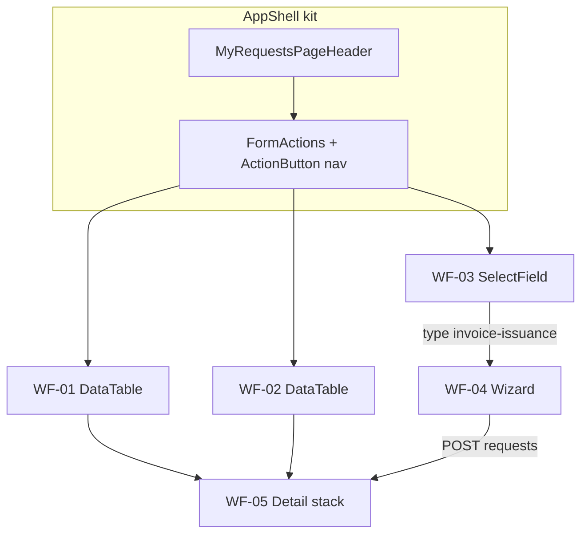

# Wireframes — Minhas Solicitações

> **Produto:** Minhas Solicitações  
> **Id técnico:** `my-requests` · `basePath` `/apps/my-requests`  
> **API:** `/apps/requests-api` (nunca api-delpi no browser)  
> **UI kit:** `@delpi/plugin-ui` via Module Federation · factories em [`plugins/my-requests/src/ui/mrUi.tsx`](../../../plugins/my-requests/src/ui/mrUi.tsx)  
> **Regras:** `plugins-reusable-components.mdc`, `plugins-visual-design-system.mdc`, `plan-construction.mdc`  
> **Status:** E5 shell + E6 vertical invoice-issuance (kit-first)

## Convenções

| Símbolo | Significado |
|---------|-------------|
| `[Botão]` | `ActionButton` (primary / ghost / link) |
| `·····` | `TextField` / busca |
| `[Select v]` | `SelectField` |
| `( A \| B )` | `SegmentToggle` |
| `│ ░░░ │` | `MyRequestsLoadingState` |
| `⚠` | `MyRequestsStateBanner` error |
| `∅` | `MyRequestsEmptyState` |
| `†` | Gate de permissão |

**Layout:** sidebar Minha DELPI à esquerda. Root MFE `.dashboard-my-requests.dashboard-page`.

**Chrome comum (todas as telas):**

```text
┌─ MyRequestsPageHeader ──────────────────────────────────────────────┐
│ Título                                                              │
│ Subtitle (opcional)                                                 │
└─────────────────────────────────────────────────────────────────────┘
┌─ MyRequestsFormActions (nav) ───────────────────────────────────────┐
│ [Minhas] [Fila] [Nova†]                                             │
└─────────────────────────────────────────────────────────────────────┘
┌─ my-requests-page-stack ────────────────────────────────────────────┐
│ (conteúdo da rota — SectionCards)                                   │
└─────────────────────────────────────────────────────────────────────┘
```

---

## 1. Catálogo de componentes `@delpi/plugin-ui`

Fonte de verdade do binding: `src/ui/mrUi.tsx` + imports diretos. **Proibido** primitivo local (`button`/`table`/`panel` BEM).

### 1.1 Em uso (P0 — entregue)

| Export / factory | Alias MFE | Onde |
|------------------|-----------|------|
| `createDashboardPageHeader` | `MyRequestsPageHeader` | AppShell |
| `createDashboardFormActions` | `MyRequestsFormActions` | Nav, ActionBar, wizard, forms |
| `createDashboardSectionCard` | `MyRequestsSectionCard` | Todas as seções |
| `createDashboardStateBanner` | `MyRequestsStateBanner` | Erros |
| `createDashboardEmptyState` | `MyRequestsEmptyState` | Listas/painéis vazios |
| `createDashboardLoadingState` | `MyRequestsLoadingState` | Mine, fila, detalhe |
| `createDashboardStatusBadge` | `MyRequestsStatusBadge` | Coluna status |
| `createTimeline` | `MyRequestsTimeline` | Painel timeline |
| `createDashboardTextField` | `TextField` | Wizard NF |
| `createDashboardSelectField` | `SelectField` | Nova + wizard |
| `createDashboardSegmentToggle` | `SegmentToggle` | Wizard (party type, frete) |
| `createDashboardDetailFieldGrid` | `DetailFields` | Detalhe + payload NF |
| `ActionButton` | — | Nav, ações, links de linha |
| `DataTable` + `dataTableBemClasses` | `mrDataTableClassNames` | `/mine`, `/work-queue` |
| `FieldLabel` | — | Comentários, observação NF |
| `NativeTextAreaControl` | — | Comentários, observação NF |

### 1.2 Previstos (próximas etapas — não inventar UI ad hoc)

| Export / factory | Uso planejado | Etapa |
|------------------|---------------|-------|
| `createDashboardFiltersKit` | Filtros Tipo / Status / Filial / busca em Mine e Fila | pós-E6 (UX fila) |
| `CompactPagination` | Paginação de listas | quando API page size > default |
| `createDashboardFileDropzone` | Upload de anexos no detalhe | E3 UI upload (hoje list-only) |
| `createHostContainedModalShell` | Confirmar return/cancel (substituir `window.prompt`) | polish |
| `createDashboardCreatableMultiSelectField` | Tags / multi-seleção futura | backlog |
| Schema form renderer (MFE `SchemaFormPage`) | `raw-material-creation` schema-driven | **entregue E7** |
| `AnchoredPanelPortal` / menus | Menus flutuantes se surgirem | sob demanda |

Ao adicionar item da tabela 1.2: registrar factory em `mrUi.tsx` (se factory), wireframe abaixo, Ajuda se user-facing.

### 1.3 Matriz tela × componentes

| Tela | Rota | Componentes kit |
|------|------|-----------------|
| Shell | * | PageHeader, FormActions, ActionButton |
| Minhas | `/mine` | SectionCard, StateBanner, Loading, Empty, DataTable, StatusBadge, ActionButton(link) |
| Fila | `/work-queue` | idem Mine |
| Nova (genérico) | `/new` | SectionCard, SelectField×2, FormActions, ActionButton |
| Wizard NF | `/new` → specialized | SectionCard, SegmentToggle, TextField, SelectField, FieldLabel, NativeTextArea, FormActions, ActionButton, StateBanner |
| Detalhe | `/requests/:id` | SectionCard, DetailFields, ActionBar→ActionButton, Timeline, painéis |
| Payload NF | detalhe | SectionCard, DetailFields |
| Comentários | detalhe | SectionCard, FieldLabel, NativeTextArea, ActionButton |
| Anexos / Artefatos | detalhe | SectionCard, Empty, ActionButton(link) |
| Schema MP | `/new` type MP | SchemaFormPage + SectionCard + kit fields | **entregue E7** |

---

## 2. Matriz rota × wireframe × status

| Rota | Wireframe | Status | Notas |
|------|-----------|--------|-------|
| `/apps/my-requests` → `/mine` | WF-01 | **entregue** | Lista DataTable |
| `/work-queue` | WF-02 | **entregue** | Fila processador |
| `/new` | WF-03 | **entregue** | Select tipo/filial |
| `/new` + `invoice-issuance` | WF-04 | **entregue** | Wizard 6 passos |
| `/new` + `raw-material-creation` | WF-07 | **entregue** | SchemaFormPage |
| `/requests/:id` | WF-05 | **entregue** | Stack de SectionCards |
| `/admin` | WF-06 | **fora P0** | Playbook — não implementar sem etapa |

---

## 3. Wireframes ASCII

### WF-01 — Minhas solicitações (`/mine`)

```text
┌─ PageHeader: Minhas solicitações ───────────────────────────────────┐
└─────────────────────────────────────────────────────────────────────┘
┌─ Nav: [Minhas] [Fila] [Nova†] ──────────────────────────────────────┐
└─────────────────────────────────────────────────────────────────────┘
┌─ SectionCard «Lista» ───────────────────────────────────────────────┐
│ ⚠ StateBanner (se erro)                                             │
│ │ ░░░ Loading │                                                     │
│ ∅ Empty «Você ainda não criou…»                                     │
│                                                                     │
│ DataTable                                                           │
│  Número (link) │ Tipo │ StatusBadge │ Filial                        │
│  REQ-…042      │ NF   │ pending     │ 01                            │
└─────────────────────────────────────────────────────────────────────┘
```

**Kit:** DataTable · StatusBadge · Empty/Loading/Banner · ActionButton link  
**Previsto:** FiltersKit + CompactPagination (1.2)

### WF-02 — Fila de trabalho (`/work-queue`)

```text
┌─ PageHeader: Fila de trabalho ──────────────────────────────────────┐
└─────────────────────────────────────────────────────────────────────┘
┌─ Nav … ─────────────────────────────────────────────────────────────┐
└─────────────────────────────────────────────────────────────────────┘
┌─ SectionCard «Pendências» ──────────────────────────────────────────┐
│ DataTable (mesmas colunas WF-01)                                    │
│ Clique no número → /requests/:id (allowed_actions no detalhe)       │
└─────────────────────────────────────────────────────────────────────┘
```

**Kit:** idem WF-01  
**Previsto:** Segment/chips por tipo + filtro filial (FiltersKit)

### WF-03 — Nova solicitação genérica (`/new`)

```text
┌─ PageHeader: Nova solicitação ──────────────────────────────────────┐
└─────────────────────────────────────────────────────────────────────┘
┌─ SectionCard «Criar» ───────────────────────────────────────────────┐
│ SelectField  Tipo     [invoice-issuance v]                          │
│ SelectField  Filial   [01 v]                                        │
│ FormActions  [Abrir wizard de NF | Criar]                           │
└─────────────────────────────────────────────────────────────────────┘
```

Se tipo = `invoice-issuance` → abre **WF-04** (não POST genérico).

### WF-04 — Wizard emissão NF (6 passos)

```text
┌─ PageHeader: Nova emissão de NF                                     │
│ subtitle: Filial 01 · passo N/6: <label>                            │
└─────────────────────────────────────────────────────────────────────┘
┌─ SectionCard «Wizard de emissão» ───────────────────────────────────┐
│ FormActions steps:                                                  │
│ [1.Dest] [2.Tipo] [3.Itens] [4.Transp] [5.Adic] [6.Conf]            │
│                                                                     │
│ ── passo 1 Destinatário ──                                          │
│ SegmentToggle ( Cliente | Fornecedor )                              │
│ TextField busca ·····  [Buscar]                                     │
│ lista hits (ActionButton link) → seleção                            │
│                                                                     │
│ ── passo 2 Tipo NF ──                                               │
│ SelectField tipo · TextField «outro» se other                       │
│                                                                     │
│ ── passo 3 Itens ──                                                 │
│ TextField busca produto [Buscar] · hits · linhas qtd/preço          │
│                                                                     │
│ ── passo 4 Transporte ──                                            │
│ SegmentToggle ( CIF | FOB ) · TextField transportadora [Buscar]    │
│                                                                     │
│ ── passo 5 Adicionais ──                                            │
│ TextField peso · volumes · FieldLabel+NativeTextArea observação    │
│                                                                     │
│ ── passo 6 Conferência ──                                           │
│ checklist ✓/○ · [Enviar solicitação]                                │
│                                                                     │
│ FormActions: [Voltar] [Anterior] [Próximo]                          │
└─────────────────────────────────────────────────────────────────────┘
```

**API:** lookups `GET …/request-types/invoice-issuance/lookups/*` · create `POST /v1/requests`  
**Ajuda:** `helpTooltips.invoiceWizard`

### WF-05 — Detalhe (`/requests/:id`)

```text
┌─ PageHeader: REQ-2026-000042 ───────────────────────────────────────┐
└─────────────────────────────────────────────────────────────────────┘
┌─ SectionCard «Solicitação» ─────────────────────────────────────────┐
│ DetailFields: Tipo · Status · Filial · Solicitante                  │
│ FormActions / ActionBar: [start] [return] [issue] … (API only)      │
└─────────────────────────────────────────────────────────────────────┘
┌─ SectionCard «Dados da emissão» † type=invoice-issuance ────────────┐
│ DetailFields destinatário/tipo/frete · lista itens                  │
└─────────────────────────────────────────────────────────────────────┘
┌─ SectionCard «Linha do tempo» ── Timeline ──────────────────────────┐
└─────────────────────────────────────────────────────────────────────┘
┌─ SectionCard «Comentários» ── lista · TextArea · [Enviar] ─────────┐
└─────────────────────────────────────────────────────────────────────┘
┌─ SectionCard «Anexos» ── links ActionButton ────────────────────────┐
└─────────────────────────────────────────────────────────────────────┘
┌─ SectionCard «Artefatos» ── links ActionButton ─────────────────────┐
└─────────────────────────────────────────────────────────────────────┘
```

**Regra:** botões = `allowed_actions` da API (render-only).  
**Previsto:** ModalShell para return/cancel; FileDropzone upload.

### WF-06 — Admin tipos (fora P0)

Lista `RequestTypes` read-only — ver Playbook §19.5. Sem UI até etapa explícita.

### WF-07 — Schema MP (E7 — entregue)

```text
┌─ PageHeader: Criação de Matéria-prima ──────────────────────────────┐
└─────────────────────────────────────────────────────────────────────┘
┌─ SectionCard «Formulário» ──────────────────────────────────────────┐
│ TextField Descrição                                                  │
│ SelectField Unidade [UN|KG|M]                                       │
│ FieldLabel + NativeTextArea Observações                             │
│ FormActions [Voltar] [Criar solicitação]                            │
└─────────────────────────────────────────────────────────────────────┘
```

**Kit:** TextField · SelectField · NativeTextArea · FormActions · ActionButton  
**Fonte:** `form_schema` / `ui_schema` do RequestType via GET `/v1/request-types`

---

## 4. Fluxo mermaid (chrome compartilhado)



---

## 5. Checklist ao mudar UI

1. Componente existe no kit / catálogo §1? Se não → estender `plugin-ui`, não BEM local.
2. Atualizar §1.1 ou §1.2 + matriz §1.3 + ASCII da tela.
3. Ajuda (`helpTooltips` + Manual) se user-facing (`feature-help-sync.mdc`).
4. `mrUi.kitFirst.test.ts` continua verde (sem `__btn`/`__panel`/`__table`).

Espelho resumido no Playbook §19 → aponta para este arquivo.
