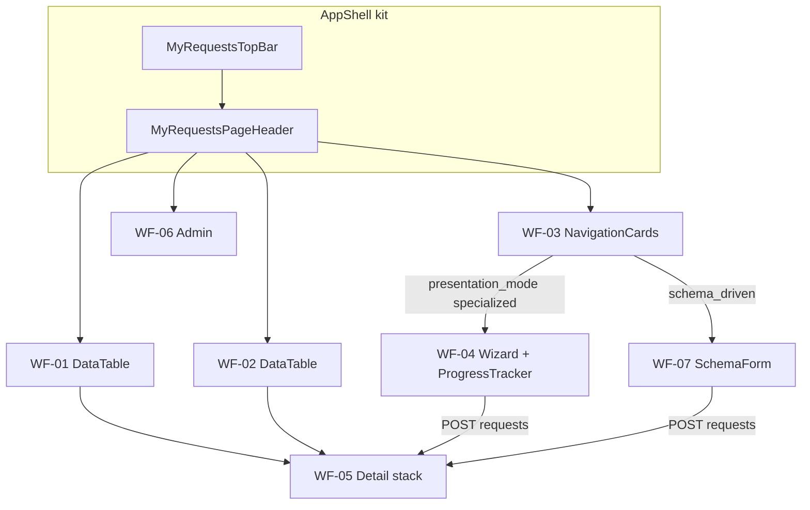

# Wireframes — Minhas Solicitações

> **Produto:** Minhas Solicitações  
> **Id técnico:** `my-requests` · `basePath` `/apps/my-requests`  
> **API:** `/apps/requests-api` (nunca api-delpi no browser)  
> **UI kit:** `@delpi/plugin-ui` via Module Federation · factories em [`plugins/my-requests/src/ui/mrUi.tsx`](../../../plugins/my-requests/src/ui/mrUi.tsx)  
> **Regras:** `plugins-reusable-components.mdc`, `plugins-visual-design-system.mdc`, `plan-construction.mdc`  
> **Status:** E5–E23 (wizard NF ProgressTracker + responsivo + EntityDirectoryPicker avatar/badge)  
> **Tempo real:** listas/detalhe atualizam via WS (`MyRequestsRealtimeProvider`) sem F5 — ver [realtime-requests.md](../../../requests-api/docs/architecture/realtime-requests.md)

## Convenções

| Símbolo | Significado |
|---------|-------------|
| `[Botão]` | `ActionButton` (primary / ghost / link) |
| `·····` | `TextField` / busca |
| `[Select v]` | `SelectField` |
| `( A \| B )` | `SegmentToggle` |
| `│ ░░░ │` | `MyRequestsLoadingState` |
| `⚠` | `MyRequestsStateBanner` error |
| `∅` | `MyRequestsEmptyState` |
| `†` | Gate de permissão |
| `✓` | Etapa concluída |
| `●` | Etapa atual |
| `○` | Etapa futura / disponível |
| `!` | Etapa com erro |

**Layout:** sidebar Minha DELPI à esquerda. Root MFE `.dashboard-my-requests.dashboard-page`.

**Chrome comum (todas as telas):**

```text
┌─ MyRequestsTopBar (createDashboardTopBar) ──────────────────────────┐
│ [Minhas] [Fila] [Nova†] [Admin†]     · collapse hamburger / overflow │
└─────────────────────────────────────────────────────────────────────┘
┌─ MyRequestsPageHeader ──────────────────────────────────────────────┐
│ Título da tela                                                      │
│ Subtitle (opcional)                                                 │
└─────────────────────────────────────────────────────────────────────┘
┌─ my-requests-page-stack ────────────────────────────────────────────┐
│ (conteúdo da rota — SectionCards; labels PT-BR via presentationLabels)│
└─────────────────────────────────────────────────────────────────────┘
```

---

## 1. Catálogo de componentes `@delpi/plugin-ui`

Fonte de verdade do binding: `src/ui/mrUi.tsx` + imports diretos. **Proibido** primitivo local (`button`/`table`/`panel` BEM).

### 1.1 Em uso (P0 — entregue)

| Export / factory | Alias MFE | Onde |
|------------------|-----------|------|
| `createDashboardTopBar` | `MyRequestsTopBar` | AppShell (nav do módulo) |
| `createDashboardPageHeader` | `MyRequestsPageHeader` | AppShell (título contextual) |
| `createDashboardFormActions` | `MyRequestsFormActions` | ActionBar, wizard, forms (não nav/stepper) |
| `createDashboardNavigationCard` | `MyRequestsNavigationCard` | Grid de tipos em `/new` |
| `createDashboardSectionCard` | `MyRequestsSectionCard` | Todas as seções |
| `createDashboardStateBanner` | `MyRequestsStateBanner` | Erros |
| `createDashboardEmptyState` | `MyRequestsEmptyState` | Listas/painéis vazios |
| `createDashboardLoadingState` | `MyRequestsLoadingState` | Mine, fila, detalhe |
| `createDashboardStatusBadge` | `MyRequestsStatusBadge` | Coluna status |
| `createTimeline` | `MyRequestsTimeline` | Painel timeline |
| `createDashboardTextField` | `TextField` | Wizard NF |
| `createDashboardSelectField` | `SelectField` | Nova + wizard |
| `createDashboardSegmentToggle` | `SegmentToggle` | Wizard (party type, frete) |
| `createDashboardDetailFieldGrid` | `DetailFields` | Detalhe + payload NF |
| `createDashboardFiltersKit` | `MyRequestsFiltersRow` / `FilterSelectField` / `FilterInputField` | Mine + Fila |
| `createCompactPagination` | `MyRequestsCompactPagination` | Mine + Fila |
| `createHostContainedModalShell` | `MyRequestsModal` | Detalhe return/cancel |
| `createDashboardFileDropzone` | `MyRequestsFileDropzone` | Staging de anexos/artefatos (salvar depois) |
| `FilePreviewModal` | `RequestFilePreviewModal` | Prévia + baixar autenticado (blob) |
| `ActionButton` | — | Nav, ações, links de linha |
| `DataTable` + `dataTableBemClasses` | `mrDataTableClassNames` | `/mine`, `/work-queue` |
| `FieldLabel` | — | Observação NF |
| `NativeTextAreaControl` | — | Observação NF |
| `createDashboardMessageThread` | `MyRequestsMessageThread` | Conversa no detalhe |
| `createDashboardMentionComposer` | `MyRequestsMentionComposer` | Composer da conversa |
| `createDashboardRoomConversationShell` | `MyRequestsRoomPanel` / `ChatColumn` | Frame da conversa embutida |
| `HintAction` | — | Help por botão de ação |

### 1.2 Previstos / propostos — não inventar UI ad hoc

| Export / factory | Uso planejado | Etapa |
|------------------|---------------|-------|
| `createDashboardProgressTracker` | Jornada linear do wizard NF: concluída/atual/futura/erro/bloqueada | **entregue E21** (`MyRequestsProgressTracker`) |
| `JourneyProgressBar` / `ProgressSummaryBar` | Percentual geral da jornada; sem semântica de loading | **entregue E21** (`MyRequestsJourneyProgressBar`) |
| `ReviewSummaryCard` | Conferência final com resumo + `Alterar` | **E21:** composição `SectionCard` + `DetailFields` + `Alterar` (sem card novo) |
| `SelectionSummaryCard` | Destinatário/transportadora selecionados | **E21:** `DetailFields` + ações (sem card novo) |
| `WizardStepLayout` | Header/body/footer de etapa | **E21:** `SectionCard` + `FormActions` (sem layout novo) |
| `createDashboardCreatableMultiSelectField` | Tags / multi-seleção futura | backlog |
| Schema form renderer (MFE `SchemaFormPage`) | `raw-material-creation` schema-driven | **entregue E7** |
| `AnchoredPanelPortal` / menus | Menus flutuantes se surgirem | sob demanda |
| Busca texto (`q` API) | `FilterInputField` nas listas Mine/Fila | **entregue E11** |

> **Nota E21:** `InlineLoadingProgress` já existe no `plugin-ui`, mas é componente de loading/status bar. Não usar como stepper nem como componente principal de progresso da jornada. O wizard precisa de semântica própria de preenchimento humano.

Ao adicionar item da tabela 1.2: registrar factory em `mrUi.tsx` (se factory), atualizar catálogo/demo/testes do `plugin-ui`, wireframe abaixo e Ajuda se user-facing.

### 1.3 Matriz tela × componentes

| Tela | Rota | Componentes kit |
|------|------|-----------------|
| Shell | * | TopBar, PageHeader |
| Minhas | `/mine` | SectionCard, FiltersKit (incl. busca), CompactPagination, StateBanner, Loading, Empty, DataTable, StatusBadge, ActionButton(link) |
| Fila | `/work-queue` | idem Mine |
| Admin | `/admin` | SectionCard, DataTable, StatusBadge, StateBanner (gate manage) | **E14 + E20 labels** |
| Nova (genérico) | `/new` | SectionCard + grid `NavigationCard` (sem Filial no shell); filial só no form do tipo |
| Wizard NF | `/new` → specialized | **entregue E21:** ProgressTracker, JourneyProgressBar, SectionCard, SegmentToggle, TextField, SelectField, FormActions (footer), ActionButton, StateBanner, DetailFields (seleção/conferência) |
| Detalhe | `/requests/:id` | Fases solicitação→atendimento→histórico; ProgressTracker+JourneyProgressBar; ActionBar; Comments; Attachments/Artifacts com PreviewStrip |
| Edição | `/requests/:id/edit` | Wizard/form em modo edit (`PATCH` + Idempotency-Key) |
| Payload NF | detalhe (fase solicitação) | SectionCard, DetailFields com hint |
| Comentários / Conversa | detalhe (fase atendimento) | MessageThread + MentionComposer; full-width abaixo das ações (`capabilities.can_comment` no composer) |
| Ações disponíveis | detalhe (fase atendimento) | SectionCard full-width; ActionButton + ícone + HintAction |
| Documentos pedido | detalhe (fase solicitação) | PreviewStrip + modal autenticado; staging → Salvar se `can_upload_attachment` |
| Documentos atendimento | detalhe (fase atendimento) | PreviewStrip + modal autenticado; staging → Salvar se `can_upload_artifact` |
| Schema MP | `/new` type MP | SchemaFormPage + SectionCard + kit fields | **entregue E7** |

---

## 2. Matriz rota × wireframe × status

| Rota | Wireframe | Status | Notas |
|------|-----------|--------|-------|
| `/apps/my-requests` → `/mine` | WF-01 | **entregue** | Lista DataTable |
| `/work-queue` | WF-02 | **entregue** | Fila processador |
| `/new` | WF-03 | **entregue E19** | Grid NavigationCard; filial no form |
| `/new` + `invoice-issuance` | WF-04 | **entregue E21; responsivo E22** | Wizard 6 passos + ProgressTracker + JourneyProgressBar + Conferência; layout fluido + progresso sequencial |
| `/new` + `raw-material-creation` | WF-07 | **entregue** | SchemaFormPage |
| `/requests/:id` | WF-05 | **entregue (jornada IA + edit + anexos)** | Solicitação → Atendimento → Histórico; edit em `/edit` |
| `/requests/:id/edit` | WF-05b | **entregue** | Corrigir payload + anexos quando devolvida |
| `/admin` | WF-06 | **entregue E14** | RequestTypes read-only (`manage`) |

---

## 3. Wireframes ASCII

### WF-01 — Minhas solicitações (`/mine`)

```text
┌─ PageHeader: Minhas solicitações ───────────────────────────────────┐
└─────────────────────────────────────────────────────────────────────┘
┌─ Nav: [Minhas] [Fila] [Nova†] ──────────────────────────────────────┐
└─────────────────────────────────────────────────────────────────────┘
┌─ SectionCard «Lista» ───────────────────────────────────────────────┐
│ FiltersKit: Busca · Tipo · Status · Filial · [Limpar]               │
│ ⚠ StateBanner (se erro)                                             │
│ │ ░░░ Loading │                                                     │
│ ∅ Empty «Você ainda não criou…» / «filtros…»                        │
│                                                                     │
│ DataTable                                                           │
│  Número (link) │ Tipo │ StatusBadge │ Filial                        │
│  REQ-…042      │ NF   │ pending     │ 01                            │
│ CompactPagination                                                   │
└─────────────────────────────────────────────────────────────────────┘
```

**Kit:** FiltersKit (FilterInputField + selects) · CompactPagination · DataTable · StatusBadge · Empty/Loading/Banner · ActionButton link

### WF-02 — Fila de trabalho (`/work-queue`)

```text
┌─ PageHeader: Fila de trabalho ──────────────────────────────────────┐
└─────────────────────────────────────────────────────────────────────┘
┌─ Nav … ─────────────────────────────────────────────────────────────┐
└─────────────────────────────────────────────────────────────────────┘
┌─ SectionCard «Pendências» ──────────────────────────────────────────┐
│ FiltersKit (busca, tipo, status, filial) + filtro Minhas            │
│   Minhas: Todas | Concluídas por mim | Atribuídas a mim             │
│ DataTable: Número · Tipo · Status · Filial · Concluída por          │
│ Clique no número → /requests/:id (allowed_actions no detalhe)       │
│ CompactPagination                                                   │
└─────────────────────────────────────────────────────────────────────┘
```

**Kit:** idem WF-01 · filtro `mine_scope` só nesta tela

### WF-03 — Nova solicitação (`/new`)

> **Entregue E19:** [PROMPT-nova-solicitacao-type-cards.md](./PROMPT-nova-solicitacao-type-cards.md) — cards de tipo; filial **não** no shell.

```text
┌─ PageHeader: Nova solicitação ──────────────────────────────────────┐
└─────────────────────────────────────────────────────────────────────┘
┌─ SectionCard «Escolha o tipo» ──────────────────────────────────────┐
│ Grid de NavigationCards (ícone + name):                             │
│ [📄 Emissão de NF]  [📦 Criação de matéria-prima]  …               │
│ Clique → abre form do tipo (wizard / schema / genérico).            │
│ Sem Filial neste shell.                                             │
└─────────────────────────────────────────────────────────────────────┘
```

Unidade/filial só **dentro** do form do tipo (`branch_scope`: `required` | `optional` | `none`).

Deep link: `/apps/my-requests/new?type=invoice-issuance` (também `type_code`) **abre** o form do tipo. Bookmarks `/apps/invoice-issuance/*` redirecionam no gateway para my-requests (E12–E13).

### WF-04 — Wizard emissão NF (6 passos) — E21 + responsivo E22

> **Especificação detalhada:** [DESIGN-wizard-emissao-nf.md](./DESIGN-wizard-emissao-nf.md).  
> **Breakpoints canônicos E22:** 1440 · 1024 · 768 · 390.  
> **Progresso (E22):** apenas o **prefixo sequencial** conta para `%` e checkmarks (defaults de tipo/frete/peso **não** antecipam etapas futuras).

#### 3.4.1 Princípio

```text
ProgressTracker = navegação e estado das etapas
JourneyProgressBar = resumo percentual da completude (prefixo sequencial)
SectionCard = conteúdo da etapa atual
FormActions = apenas Voltar / Próximo / Continuar / Enviar
Conferência = SectionCard + DetailFields + Alterar
Layout = 100% da largura útil da página (wizard-stack fluido)
```

Estados do tracker:

```text
✓ complete   = etapa no prefixo sequencial válido (editável)
● current    = etapa aberta agora
○ available  = próxima liberada (index ≤ maxUnlocked)
○ locked     = futura bloqueada (não focável)
! error      = precisa correção
```

#### 3.4.2 Matriz viewport × chrome

| Viewport | TopBar | Tracker | Form | Footer |
|----------|--------|---------|------|--------|
| **1440** | itens + labels | horizontal labels; wrap suave sem scroll-x | stack 100% até ~60rem | Voltar + CTA alinhados end |
| **1024** | idem | horizontal (pode wrap 2 linhas) | 100% útil | end |
| **768** | colapsa / hamburger | `density=compact` + disclosure | 100%; padding ↓ | botões flex full-width (kit) |
| **390** | hamburger | compact obrigatório | full-bleed; itens empilhados | Voltar / Próximo 100% |

#### 3.4.3 Shell — 1440 / 1024 (Destinatário vazio)

```text
┌─ TopBar ─────────────────────────────────────────────────────────────────────┐
│ Minhas solicitações | Fila de trabalho | Nova solicitação | Administração  │
└──────────────────────────────────────────────────────────────────────────────┘
┌─ PageHeader ─────────────────────────────────────────────────────────────────┐
│ Nova emissão de NF                                                           │
│ Filial 01 · Etapa 1 de 6: Destinatário                                       │
└──────────────────────────────────────────────────────────────────────────────┘

Filial [ 01 v ]

Progresso da solicitação                                                  0%
░░░░░░░░░░░░░░░░░░░░░░░░░░░░░░░░
0 de 6 etapas concluídas

● Destinatário ── ○ Tipo de NF ── ○ Itens ── ○ Transporte ── ○ Adicionais ── ○ Conferência
   atual            locked          locked     locked           locked           locked

┌─ SectionCard «Destinatário» ─────────────────────────────────────────────────┐
│ ( ● Cliente | ○ Fornecedor )                                                 │
│ EntityDirectoryPicker · typeahead ≥2 chars · chip com avatar                 │
│                                                                              │
│ [Voltar]                                                         [Próximo]   │
└──────────────────────────────────────────────────────────────────────────────┘
```

#### 3.4.4 Shell — 768 / 390 (compact)

```text
┌─ TopBar colapsada ──────────────────┐
│ ☰  Minhas solicitações              │
├─────────────────────────────────────┤
│ Nova emissão de NF                  │
│ Filial 01 · Etapa 1 de 6            │
│ Filial [ 01 v ]                     │
│ Progresso                      0%   │
│ ░░░░░░░░░░░░░░░░░░░░░               │
│ 0 de 6 etapas concluídas            │
│ Etapa atual: Destinatário           │
│ [Ver etapas ▾]                      │
├─────────────────────────────────────┤
│ SectionCard «Destinatário»          │
│ (Cliente|Fornecedor)                │
│ Typeahead + avatar chip             │
│                                     │
│ [Voltar]                            │
│ [Próximo]                           │
└─────────────────────────────────────┘
```

Painel compacto aberto:

```text
● Destinatário     Atual
○ Tipo de NF       Bloqueada
○ Itens            Bloqueada
○ Transporte       Bloqueada
○ Adicionais       Bloqueada
○ Conferência      Bloqueada
```

#### 3.4.5 Etapa 1 — Destinatário (conteúdo; todos viewports) — E23

**Vazio**

```text
( ● Cliente | ○ Fornecedor )
EntityDirectoryPicker (maxSelected=1)
  [ digite nome, código ou CNPJ… ]   ← typeahead ≥2 chars, debounce
  (sem botão Buscar)
[Voltar]  [Próximo desabilitado]
```

**Com seleção** (chip + avatar; autoavanço → Tipo NF)

```text
[🟢 AL] ACME Indústria · 001/01  [×]
```

#### 3.4.6 Etapa 2 — Tipo de NF

```text
Tipo de NF [ Venda                    v ]
Se Outros: Descreva o tipo [············]
[Voltar]  [Próximo]
```

**1024+:** select confortável. **390:** select + campo other full-width.

#### 3.4.7 Etapa 3 — Itens — E23

```text
EntityDirectoryPicker (multi, max 20)
  [ digite código ou descrição… ]
  chips pendentes: [🟢 P1 Produto A ×] [🟢 P2 … ×]
  [Adicionar selecionados (N)]

Itens anexados (editáveis):
  P1 — Produto A · Qtd [1] · Preço [10] · [Remover]
∅ Nenhum item se lista vazia
[Voltar]  [Próximo]
```

#### 3.4.8 Etapa 4 — Transporte — E23

```text
( ● CIF | ○ FOB )  [?]
EntityDirectoryPicker (maxSelected=1, opcional)
  [ digite código ou nome… ]
  chip: [🟢 T01 Transportadora XYZ ×]
[Voltar]  [Próximo]   ← completo sem carrier
```

#### 3.4.9 Etapa 5 — Adicionais

```text
Peso (kg) [····]
Volumes   [····]
Observação (opcional)
[ text area .............. ]
[Voltar]  [Próximo]
```

#### 3.4.10 Etapa 6 — Conferência

```text
┌ Destinatário              [Alterar] ┐  DetailFields
┌ Tipo de nota fiscal       [Alterar] ┐
┌ Itens                     [Alterar] ┐  + lista resumida
┌ Transporte                [Alterar] ┐
┌ Informações adicionais    [Alterar] ┐
[Voltar]  [Enviar]
```

**390:** cada bloco SectionCard full-width; Alterar no header; Enviar full-width.

**Após Alterar:** `returnToReview` → edita etapa → [Continuar] volta à Conferência se ainda completa.

#### 3.4.11 Progresso sequencial (E22)

```text
percentual = (maior k com etapas 0..k-1 todas isStepComplete) / 6 × 100
```

- Destinatário vazio + defaults sale/cif/peso → **0%**, sem ✓ em Tipo/Frete/Adicionais.
- Após party + sale → prefixo 2 → ~33% (Destinatário + Tipo).
- Invalidar Tipo (`other` sem texto) → % volta ao prefixo válido (só Destinatário).

Não usar `stepAtual/6` nem contar flags futuras fora do prefixo.

#### 3.4.12 Desktop — jornada parcial (Itens)

```text
Progresso                                                         33%
██████████░░░░░░░░░░░░░░░░░░░░░░
2 de 6 etapas concluídas

✓ Destinatário ── ✓ Tipo de NF ── ● Itens ── ○ Transporte ── ○ Adicionais ── ○ Conferência
```

Regras: reabrir complete; dados preservados; locked não clicável; F5 perde rascunho (in-memory).

#### 3.4.13 Componentes kit (E21 entregue; E22 polish)

| Componente | Status |
|------------|--------|
| `ProgressTracker` | entregue E21; polish wrap/compact/dark E22 |
| `JourneyProgressBar` | entregue E21; polish E22 |
| Review/Selection/WizardStepLayout | **não** criar — composição SectionCard + DetailFields |

Zero CSS chrome do kit no MFE; layout de página só em `index.css` (`.my-requests-wizard-stack`).

#### 3.4.14 Ajuda

`helpTooltips.invoiceWizard`: section, progress, recipient, invoiceType, items, freight, extras, review, partySearch, productSearch, carrierSearch, partyType, itemQuantity, itemUnitPrice, weightKg, volumeCount, observation.

#### 3.4.15 Acessibilidade

- `aria-label` / `aria-current="step"` / locked não tabbable  
- progressbar valuemin/max/now  
- foco no heading ao mudar etapa  
- sem scroll-x em 390  
- FormActions touch ≥44px (kit)

**API:** lookups + `POST /v1/requests` · **Ajuda:** `invoiceWizard` · **Design:** [DESIGN-wizard-emissao-nf.md](./DESIGN-wizard-emissao-nf.md)

### WF-05 — Detalhe (`/requests/:id`)

```text
┌─ PageHeader: REQ-2026-000042                    [StatusBadge] ──────┐
└─────────────────────────────────────────────────────────────────────┘

┌─ Motivo da devolução † (se return_reason) ──────────────────────────┐
│ texto em destaque · [Corrigir dados]† se allowed_actions tem edit   │
└─────────────────────────────────────────────────────────────────────┘

  O QUE FOI SOLICITADO
┌─ Dados da solicitação (DetailFields+hints) ─────────────────────────┐
└─────────────────────────────────────────────────────────────────────┘
┌─ Dados da emissão † type=invoice-issuance ──────────────────────────┐
└─────────────────────────────────────────────────────────────────────┘
┌─ Documentos da solicitação (AttachmentPreviewStrip) ────────────────┐
│ dropzone† só se capabilities.can_upload_attachment (devolvida)      │
└─────────────────────────────────────────────────────────────────────┘

  ATENDIMENTO
┌─ Progresso (ProgressTracker desktop / compact ≤768 + JourneyBar %) ─┐
│ Fonte: journey_progress · compactSummary = «Etapa N de M · label»   │
└─────────────────────────────────────────────────────────────────────┘
┌─ Ações disponíveis (full-width · ícone + HintAction) ───────────────┐
│ ActionBar (allowed_actions → resolveActionPresentation)             │
└─────────────────────────────────────────────────────────────────────┘
┌─ Conversa sobre a solicitação (MessageThread + MentionComposer) ────┐
│ RoomPanel · avatares Core via BFF · is_mine · can_comment no dock   │
└─────────────────────────────────────────────────────────────────────┘
┌─ Documentos gerados no atendimento (PreviewStrip + kind†) ──────────┐
└─────────────────────────────────────────────────────────────────────┘

  HISTÓRICO
┌─ Linha do tempo (último bloco funcional) ───────────────────────────┐
└─────────────────────────────────────────────────────────────────────┘
```

Desktop/mobile: Atendimento em stack full-width (Progresso → Ações → Conversa → Documentos gerados).  
Tracker: `default` em desktop; `compact` ≤768px.  
**Regra:** botões = `allowed_actions`; uploads/composer = `capabilities` (API).  
`edit` → `/requests/:id/edit` (não é toast).  
**Kit:** ProgressTracker · JourneyProgressBar · MessageThread · MentionComposer · RoomPanel · AttachmentPreviewStrip · ModalShell · FileDropzone · HintAction · DetailFields.hint  
**Ajuda:** `helpTooltips.detail.*` / `actions.*` / `attachments` / `artifacts` / `comments` / `timeline`  
**Avatar:** MFE → `GET /apps/requests-api/v1/participants/{user_id}/avatar` → Core S2S person-profile (sem storage no my_requests).

### WF-05b — Corrigir (`/requests/:id/edit`)

```text
┌─ Wizard NF / SchemaForm / Generic (mode=edit) ──────────────────────┐
│ Prefill do payload · PATCH + Idempotency-Key · anexos manage        │
│ Sucesso → volta ao detalhe; Reenviar permanece na ActionBar         │
└─────────────────────────────────────────────────────────────────────┘
```

### WF-06 — Admin tipos (E14 — entregue; labels E20)

```text
┌─ TopBar: … [Admin†] ────────────────────────────────────────────────┐
└─────────────────────────────────────────────────────────────────────┘
┌─ PageHeader: Tipos de solicitação ──────────────────────────────────┐
└─────────────────────────────────────────────────────────────────────┘
┌─ SectionCard «Catálogo de tipos» ───────────────────────────────────┐
│ DataTable: Código │ Nome │ Ativo │ Filial │ Formulário              │
│ Sem CRUD — leitura via GET /request-types                           │
│ Sem permissão → banner amigável (sem código de permissão cru)       │
└─────────────────────────────────────────────────────────────────────┘
```

**Kit:** SectionCard · DataTable · StatusBadge · StateBanner  
**Ajuda:** `helpTooltips.admin`

### WF-07 — Schema MP (E7 — entregue)

```text
┌─ PageHeader: Criação de Matéria-prima ──────────────────────────────┐
└─────────────────────────────────────────────────────────────────────┘
┌─ SectionCard «Formulário» ──────────────────────────────────────────┐
│ TextField Descrição                                                  │
│ SelectField Unidade [UN|KG|M]                                       │
│ FieldLabel + NativeTextArea Observações                             │
│ FormActions [Voltar] [Criar solicitação]                            │
└─────────────────────────────────────────────────────────────────────┘
```

**Kit:** TextField · SelectField · NativeTextArea · FormActions · ActionButton  
**Fonte:** `form_schema` / `ui_schema` do RequestType via GET `/v1/request-types`

---

## 4. Fluxo mermaid (chrome compartilhado)



---

## 5. Checklist ao mudar UI

1. Componente existe no kit / catálogo §1? Se não → estender `plugin-ui`, não BEM local.
2. Atualizar §1.1 ou §1.2 + matriz §1.3 + ASCII da tela.
3. Ajuda (`helpTooltips` + Manual) se user-facing (`feature-help-sync.mdc`).
4. `mrUi.kitFirst.test.ts` continua verde (sem `__btn`/`__panel`/`__table`).
5. Para wizard multietapa, conferir [DESIGN-wizard-emissao-nf.md](./DESIGN-wizard-emissao-nf.md) antes de criar stepper/progress local.

Espelho resumido no Playbook §19 → aponta para este arquivo.
