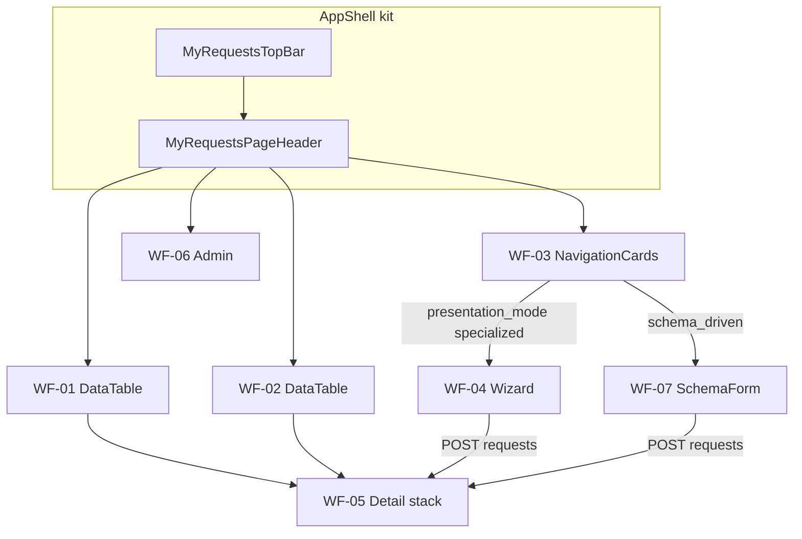

# Wireframes — Minhas Solicitações

> **Produto:** Minhas Solicitações  
> **Id técnico:** `my-requests` · `basePath` `/apps/my-requests`  
> **API:** `/apps/requests-api` (nunca api-delpi no browser)  
> **UI kit:** `@delpi/plugin-ui` via Module Federation · factories em [`plugins/my-requests/src/ui/mrUi.tsx`](../../../plugins/my-requests/src/ui/mrUi.tsx)  
> **Regras:** `plugins-reusable-components.mdc`, `plugins-visual-design-system.mdc`, `plan-construction.mdc`  
> **Status:** E5–E20 (TopBar canônica + PT-BR + Ajuda; kit-first)

## Convenções

| Símbolo | Significado |
|---------|-------------|
| `[Botão]` | `ActionButton` (primary / ghost / link) |
| `·····` | `TextField` / busca |
| `[Select v]` | `SelectField` |
| `( A \| B )` | `SegmentToggle` |
| `│ ░░░ │` | `MyRequestsLoadingState` |
| `⚠` | `MyRequestsStateBanner` error |
| `∅` | `MyRequestsEmptyState` |
| `†` | Gate de permissão |

**Layout:** sidebar Minha DELPI à esquerda. Root MFE `.dashboard-my-requests.dashboard-page`.

**Chrome comum (todas as telas):**

```text
┌─ MyRequestsTopBar (createDashboardTopBar) ──────────────────────────┐
│ [Minhas] [Fila] [Nova†] [Admin†]     · collapse hamburger / overflow │
└─────────────────────────────────────────────────────────────────────┘
┌─ MyRequestsPageHeader ──────────────────────────────────────────────┐
│ Título da tela                                                      │
│ Subtitle (opcional)                                                 │
└─────────────────────────────────────────────────────────────────────┘
┌─ my-requests-page-stack ────────────────────────────────────────────┐
│ (conteúdo da rota — SectionCards; labels PT-BR via presentationLabels)│
└─────────────────────────────────────────────────────────────────────┘
```

---

## 1. Catálogo de componentes `@delpi/plugin-ui`

Fonte de verdade do binding: `src/ui/mrUi.tsx` + imports diretos. **Proibido** primitivo local (`button`/`table`/`panel` BEM).

### 1.1 Em uso (P0 — entregue)

| Export / factory | Alias MFE | Onde |
|------------------|-----------|------|
| `createDashboardTopBar` | `MyRequestsTopBar` | AppShell (nav do módulo) |
| `createDashboardPageHeader` | `MyRequestsPageHeader` | AppShell (título contextual) |
| `createDashboardFormActions` | `MyRequestsFormActions` | ActionBar, wizard, forms (não nav) |
| `createDashboardNavigationCard` | `MyRequestsNavigationCard` | Grid de tipos em `/new` |
| `createDashboardSectionCard` | `MyRequestsSectionCard` | Todas as seções |
| `createDashboardStateBanner` | `MyRequestsStateBanner` | Erros |
| `createDashboardEmptyState` | `MyRequestsEmptyState` | Listas/painéis vazios |
| `createDashboardLoadingState` | `MyRequestsLoadingState` | Mine, fila, detalhe |
| `createDashboardStatusBadge` | `MyRequestsStatusBadge` | Coluna status |
| `createTimeline` | `MyRequestsTimeline` | Painel timeline |
| `createDashboardTextField` | `TextField` | Wizard NF |
| `createDashboardSelectField` | `SelectField` | Nova + wizard |
| `createDashboardSegmentToggle` | `SegmentToggle` | Wizard (party type, frete) |
| `createDashboardDetailFieldGrid` | `DetailFields` | Detalhe + payload NF |
| `createDashboardFiltersKit` | `MyRequestsFiltersRow` / `FilterSelectField` / `FilterInputField` | Mine + Fila |
| `createCompactPagination` | `MyRequestsCompactPagination` | Mine + Fila |
| `createHostContainedModalShell` | `MyRequestsModal` | Detalhe return/cancel |
| `createDashboardFileDropzone` | `MyRequestsFileDropzone` | Upload anexos e artefatos no detalhe |
| `ActionButton` | — | Nav, ações, links de linha |
| `DataTable` + `dataTableBemClasses` | `mrDataTableClassNames` | `/mine`, `/work-queue` |
| `FieldLabel` | — | Comentários, observação NF |
| `NativeTextAreaControl` | — | Comentários, observação NF |

### 1.2 Previstos (próximas etapas — não inventar UI ad hoc)

| Export / factory | Uso planejado | Etapa |
|------------------|---------------|-------|
| `createDashboardCreatableMultiSelectField` | Tags / multi-seleção futura | backlog |
| Schema form renderer (MFE `SchemaFormPage`) | `raw-material-creation` schema-driven | **entregue E7** |
| `AnchoredPanelPortal` / menus | Menus flutuantes se surgirem | sob demanda |
| Busca texto (`q` API) | `FilterInputField` nas listas Mine/Fila | **entregue E11** |

Ao adicionar item da tabela 1.2: registrar factory em `mrUi.tsx` (se factory), wireframe abaixo, Ajuda se user-facing.

### 1.3 Matriz tela × componentes

| Tela | Rota | Componentes kit |
|------|------|-----------------|
| Shell | * | TopBar, PageHeader |
| Minhas | `/mine` | SectionCard, FiltersKit (incl. busca), CompactPagination, StateBanner, Loading, Empty, DataTable, StatusBadge, ActionButton(link) |
| Fila | `/work-queue` | idem Mine |
| Admin | `/admin` | SectionCard, DataTable, StatusBadge, StateBanner (gate manage) | **E14 + E20 labels** |
| Nova (genérico) | `/new` | SectionCard + grid `NavigationCard` (sem Filial no shell); filial só no form do tipo |
| Wizard NF | `/new` → specialized | SectionCard, SegmentToggle, TextField, SelectField (incl. Filial se `branch_scope`), FieldLabel, NativeTextArea, FormActions, ActionButton, StateBanner |
| Detalhe | `/requests/:id` | SectionCard, DetailFields, ActionBar→ActionButton (label PT), ModalShell (return/cancel), Timeline, painéis |
| Payload NF | detalhe | SectionCard, DetailFields |
| Comentários | detalhe | SectionCard, FieldLabel, NativeTextArea, ActionButton |
| Anexos / Artefatos | detalhe | SectionCard, FileDropzone (anexos + artefatos se process/manage), SelectField (kind), Empty, ActionButton(link) |
| Schema MP | `/new` type MP | SchemaFormPage + SectionCard + kit fields | **entregue E7** |

---

## 2. Matriz rota × wireframe × status

| Rota | Wireframe | Status | Notas |
|------|-----------|--------|-------|
| `/apps/my-requests` → `/mine` | WF-01 | **entregue** | Lista DataTable |
| `/work-queue` | WF-02 | **entregue** | Fila processador |
| `/new` | WF-03 | **entregue E19** | Grid NavigationCard; filial no form |
| `/new` + `invoice-issuance` | WF-04 | **entregue** | Wizard 6 passos |
| `/new` + `raw-material-creation` | WF-07 | **entregue** | SchemaFormPage |
| `/requests/:id` | WF-05 | **entregue** | Stack de SectionCards |
| `/admin` | WF-06 | **entregue E14** | RequestTypes read-only (`manage`) |

---

## 3. Wireframes ASCII

### WF-01 — Minhas solicitações (`/mine`)

```text
┌─ PageHeader: Minhas solicitações ───────────────────────────────────┐
└─────────────────────────────────────────────────────────────────────┘
┌─ Nav: [Minhas] [Fila] [Nova†] ──────────────────────────────────────┐
└─────────────────────────────────────────────────────────────────────┘
┌─ SectionCard «Lista» ───────────────────────────────────────────────┐
│ FiltersKit: Busca · Tipo · Status · Filial · [Limpar]               │
│ ⚠ StateBanner (se erro)                                             │
│ │ ░░░ Loading │                                                     │
│ ∅ Empty «Você ainda não criou…» / «filtros…»                        │
│                                                                     │
│ DataTable                                                           │
│  Número (link) │ Tipo │ StatusBadge │ Filial                        │
│  REQ-…042      │ NF   │ pending     │ 01                            │
│ CompactPagination                                                   │
└─────────────────────────────────────────────────────────────────────┘
```

**Kit:** FiltersKit (FilterInputField + selects) · CompactPagination · DataTable · StatusBadge · Empty/Loading/Banner · ActionButton link

### WF-02 — Fila de trabalho (`/work-queue`)

```text
┌─ PageHeader: Fila de trabalho ──────────────────────────────────────┐
└─────────────────────────────────────────────────────────────────────┘
┌─ Nav … ─────────────────────────────────────────────────────────────┐
└─────────────────────────────────────────────────────────────────────┘
┌─ SectionCard «Pendências» ──────────────────────────────────────────┐
│ FiltersKit (idem WF-01, incl. busca `q`)                            │
│ DataTable (mesmas colunas WF-01)                                    │
│ Clique no número → /requests/:id (allowed_actions no detalhe)       │
│ CompactPagination                                                   │
└─────────────────────────────────────────────────────────────────────┘
```

**Kit:** idem WF-01

### WF-03 — Nova solicitação (`/new`)

> **Entregue E19:** [PROMPT-nova-solicitacao-type-cards.md](./PROMPT-nova-solicitacao-type-cards.md) — cards de tipo; filial **não** no shell.

```text
┌─ PageHeader: Nova solicitação ──────────────────────────────────────┐
└─────────────────────────────────────────────────────────────────────┘
┌─ SectionCard «Escolha o tipo» ──────────────────────────────────────┐
│ Grid de NavigationCards (ícone + name):                             │
│ [📄 Emissão de NF]  [📦 Criação de matéria-prima]  …               │
│ Clique → abre form do tipo (wizard / schema / genérico).            │
│ Sem Filial neste shell.                                             │
└─────────────────────────────────────────────────────────────────────┘
```

Unidade/filial só **dentro** do form do tipo (`branch_scope`: `required` | `optional` | `none`).

Deep link: `/apps/my-requests/new?type=invoice-issuance` (também `type_code`) **abre** o form do tipo. Bookmarks `/apps/invoice-issuance/*` redirecionam no gateway para my-requests (E12–E13).

### WF-04 — Wizard emissão NF (6 passos)

```text
┌─ PageHeader: Nova emissão de NF                                     │
│ subtitle: Filial 01 · passo N/6: <label>                            │
└─────────────────────────────────────────────────────────────────────┘
┌─ SectionCard «Wizard de emissão» ───────────────────────────────────┐
│ FormActions steps:                                                  │
│ [1.Dest] [2.Tipo] [3.Itens] [4.Transp] [5.Adic] [6.Conf]            │
│                                                                     │
│ ── passo 1 Destinatário ──                                          │
│ SegmentToggle ( Cliente | Fornecedor )                              │
│ TextField busca ·····  [Buscar]                                     │
│ lista hits (ActionButton link) → seleção                            │
│                                                                     │
│ ── passo 2 Tipo NF ──                                               │
│ SelectField tipo · TextField «outro» se other                       │
│                                                                     │
│ ── passo 3 Itens ──                                                 │
│ TextField busca produto [Buscar] · hits · linhas qtd/preço          │
│                                                                     │
│ ── passo 4 Transporte ──                                            │
│ SegmentToggle ( CIF | FOB ) · TextField transportadora [Buscar]    │
│                                                                     │
│ ── passo 5 Adicionais ──                                            │
│ TextField peso · volumes · FieldLabel+NativeTextArea observação    │
│                                                                     │
│ ── passo 6 Conferência ──                                           │
│ checklist ✓/○ · [Enviar solicitação]                                │
│                                                                     │
│ FormActions: [Voltar] [Anterior] [Próximo]                          │
└─────────────────────────────────────────────────────────────────────┘
```

**API:** lookups `GET …/request-types/invoice-issuance/lookups/*` · create `POST /v1/requests`  
**Ajuda:** `helpTooltips.invoiceWizard`

### WF-05 — Detalhe (`/requests/:id`)

```text
┌─ PageHeader: REQ-2026-000042 ───────────────────────────────────────┐
└─────────────────────────────────────────────────────────────────────┘
┌─ SectionCard «Solicitação» ─────────────────────────────────────────┐
│ DetailFields: Tipo · Status · Filial · Solicitante · Criada em      │
│ ActionBar: [Iniciar…] [Devolver…] … (label PT; código API intacto)  │
└─────────────────────────────────────────────────────────────────────┘
┌─ SectionCard «Dados da emissão» † type=invoice-issuance ────────────┐
│ DetailFields destinatário/tipo/frete · lista itens                  │
└─────────────────────────────────────────────────────────────────────┘
┌─ SectionCard «Linha do tempo» ── Timeline ──────────────────────────┐
└─────────────────────────────────────────────────────────────────────┘
┌─ SectionCard «Comentários» ── lista · TextArea · [Enviar] ─────────┐
└─────────────────────────────────────────────────────────────────────┘
┌─ SectionCard «Anexos» ── FileDropzone · links ActionButton ─────────┐
└─────────────────────────────────────────────────────────────────────┘
┌─ SectionCard «Arquivos do atendimento» ── Select kind† · Dropzone† ─┐
│ † upload só se process/manage · kind em PT-BR                       │
└─────────────────────────────────────────────────────────────────────┘
```

**Regra:** botões = `allowed_actions` da API (render-only).  
**Kit:** ModalShell (return/cancel) · FileDropzone (anexos + artefatos) · SelectField (tipo do artefato)

### WF-06 — Admin tipos (E14 — entregue; labels E20)

```text
┌─ TopBar: … [Admin†] ────────────────────────────────────────────────┐
└─────────────────────────────────────────────────────────────────────┘
┌─ PageHeader: Tipos de solicitação ──────────────────────────────────┐
└─────────────────────────────────────────────────────────────────────┘
┌─ SectionCard «Catálogo de tipos» ───────────────────────────────────┐
│ DataTable: Código │ Nome │ Ativo │ Filial │ Formulário              │
│ Sem CRUD — leitura via GET /request-types                           │
│ Sem permissão → banner amigável (sem código de permissão cru)       │
└─────────────────────────────────────────────────────────────────────┘
```

**Kit:** SectionCard · DataTable · StatusBadge · StateBanner  
**Ajuda:** `helpTooltips.admin`

### WF-07 — Schema MP (E7 — entregue)

```text
┌─ PageHeader: Criação de Matéria-prima ──────────────────────────────┐
└─────────────────────────────────────────────────────────────────────┘
┌─ SectionCard «Formulário» ──────────────────────────────────────────┐
│ TextField Descrição                                                  │
│ SelectField Unidade [UN|KG|M]                                       │
│ FieldLabel + NativeTextArea Observações                             │
│ FormActions [Voltar] [Criar solicitação]                            │
└─────────────────────────────────────────────────────────────────────┘
```

**Kit:** TextField · SelectField · NativeTextArea · FormActions · ActionButton  
**Fonte:** `form_schema` / `ui_schema` do RequestType via GET `/v1/request-types`

---

## 4. Fluxo mermaid (chrome compartilhado)



---

## 5. Checklist ao mudar UI

1. Componente existe no kit / catálogo §1? Se não → estender `plugin-ui`, não BEM local.
2. Atualizar §1.1 ou §1.2 + matriz §1.3 + ASCII da tela.
3. Ajuda (`helpTooltips` + Manual) se user-facing (`feature-help-sync.mdc`).
4. `mrUi.kitFirst.test.ts` continua verde (sem `__btn`/`__panel`/`__table`).

Espelho resumido no Playbook §19 → aponta para este arquivo.
