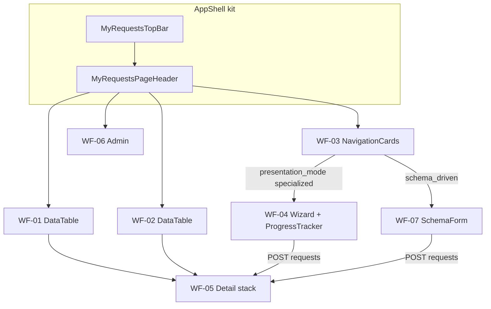

# Wireframes — Minhas Solicitações

> **Produto:** Minhas Solicitações  
> **Id técnico:** `my-requests` · `basePath` `/apps/my-requests`  
> **API:** `/apps/requests-api` (nunca api-delpi no browser)  
> **UI kit:** `@delpi/plugin-ui` via Module Federation · factories em [`plugins/my-requests/src/ui/mrUi.tsx`](../../../plugins/my-requests/src/ui/mrUi.tsx)  
> **Regras:** `plugins-reusable-components.mdc`, `plugins-visual-design-system.mdc`, `plan-construction.mdc`  
> **Status:** E5–E21 (TopBar canônica + PT-BR + Ajuda + redesign do wizard NF; kit-first)

## Convenções

| Símbolo | Significado |
|---------|-------------|
| `[Botão]` | `ActionButton` (primary / ghost / link) |
| `·····` | `TextField` / busca |
| `[Select v]` | `SelectField` |
| `( A \| B )` | `SegmentToggle` |
| `│ ░░░ │` | `MyRequestsLoadingState` |
| `⚠` | `MyRequestsStateBanner` error |
| `∅` | `MyRequestsEmptyState` |
| `†` | Gate de permissão |
| `✓` | Etapa concluída |
| `●` | Etapa atual |
| `○` | Etapa futura / disponível |
| `!` | Etapa com erro |

**Layout:** sidebar Minha DELPI à esquerda. Root MFE `.dashboard-my-requests.dashboard-page`.

**Chrome comum (todas as telas):**

```text
┌─ MyRequestsTopBar (createDashboardTopBar) ──────────────────────────┐
│ [Minhas] [Fila] [Nova†] [Admin†]     · collapse hamburger / overflow │
└─────────────────────────────────────────────────────────────────────┘
┌─ MyRequestsPageHeader ──────────────────────────────────────────────┐
│ Título da tela                                                      │
│ Subtitle (opcional)                                                 │
└─────────────────────────────────────────────────────────────────────┘
┌─ my-requests-page-stack ────────────────────────────────────────────┐
│ (conteúdo da rota — SectionCards; labels PT-BR via presentationLabels)│
└─────────────────────────────────────────────────────────────────────┘
```

---

## 1. Catálogo de componentes `@delpi/plugin-ui`

Fonte de verdade do binding: `src/ui/mrUi.tsx` + imports diretos. **Proibido** primitivo local (`button`/`table`/`panel` BEM).

### 1.1 Em uso (P0 — entregue)

| Export / factory | Alias MFE | Onde |
|------------------|-----------|------|
| `createDashboardTopBar` | `MyRequestsTopBar` | AppShell (nav do módulo) |
| `createDashboardPageHeader` | `MyRequestsPageHeader` | AppShell (título contextual) |
| `createDashboardFormActions` | `MyRequestsFormActions` | ActionBar, wizard, forms (não nav/stepper) |
| `createDashboardNavigationCard` | `MyRequestsNavigationCard` | Grid de tipos em `/new` |
| `createDashboardSectionCard` | `MyRequestsSectionCard` | Todas as seções |
| `createDashboardStateBanner` | `MyRequestsStateBanner` | Erros |
| `createDashboardEmptyState` | `MyRequestsEmptyState` | Listas/painéis vazios |
| `createDashboardLoadingState` | `MyRequestsLoadingState` | Mine, fila, detalhe |
| `createDashboardStatusBadge` | `MyRequestsStatusBadge` | Coluna status |
| `createTimeline` | `MyRequestsTimeline` | Painel timeline |
| `createDashboardTextField` | `TextField` | Wizard NF |
| `createDashboardSelectField` | `SelectField` | Nova + wizard |
| `createDashboardSegmentToggle` | `SegmentToggle` | Wizard (party type, frete) |
| `createDashboardDetailFieldGrid` | `DetailFields` | Detalhe + payload NF |
| `createDashboardFiltersKit` | `MyRequestsFiltersRow` / `FilterSelectField` / `FilterInputField` | Mine + Fila |
| `createCompactPagination` | `MyRequestsCompactPagination` | Mine + Fila |
| `createHostContainedModalShell` | `MyRequestsModal` | Detalhe return/cancel |
| `createDashboardFileDropzone` | `MyRequestsFileDropzone` | Upload anexos e artefatos no detalhe |
| `ActionButton` | — | Nav, ações, links de linha |
| `DataTable` + `dataTableBemClasses` | `mrDataTableClassNames` | `/mine`, `/work-queue` |
| `FieldLabel` | — | Comentários, observação NF |
| `NativeTextAreaControl` | — | Comentários, observação NF |

### 1.2 Previstos / propostos — não inventar UI ad hoc

| Export / factory | Uso planejado | Etapa |
|------------------|---------------|-------|
| `createDashboardProgressTracker` | Jornada linear do wizard NF: concluída/atual/futura/erro/bloqueada | **E21 P0 — criar no plugin-ui se continuar ausente** |
| `JourneyProgressBar` / `ProgressSummaryBar` | Percentual geral da jornada; sem semântica de loading | **E21 P0 — criar no plugin-ui se continuar ausente** |
| `ReviewSummaryCard` | Conferência final com resumo + `Alterar` | **E21 P0 — criar ou reutilizar equivalente do catálogo** |
| `SelectionSummaryCard` | Destinatário/transportadora selecionados | **E21 P1 — criar somente se não houver equivalente** |
| `WizardStepLayout` | Header/body/footer de etapa | **E21 P1 — opcional; só com reuso real** |
| `createDashboardCreatableMultiSelectField` | Tags / multi-seleção futura | backlog |
| Schema form renderer (MFE `SchemaFormPage`) | `raw-material-creation` schema-driven | **entregue E7** |
| `AnchoredPanelPortal` / menus | Menus flutuantes se surgirem | sob demanda |
| Busca texto (`q` API) | `FilterInputField` nas listas Mine/Fila | **entregue E11** |

> **Nota E21:** `InlineLoadingProgress` já existe no `plugin-ui`, mas é componente de loading/status bar. Não usar como stepper nem como componente principal de progresso da jornada. O wizard precisa de semântica própria de preenchimento humano.

Ao adicionar item da tabela 1.2: registrar factory em `mrUi.tsx` (se factory), atualizar catálogo/demo/testes do `plugin-ui`, wireframe abaixo e Ajuda se user-facing.

### 1.3 Matriz tela × componentes

| Tela | Rota | Componentes kit |
|------|------|-----------------|
| Shell | * | TopBar, PageHeader |
| Minhas | `/mine` | SectionCard, FiltersKit (incl. busca), CompactPagination, StateBanner, Loading, Empty, DataTable, StatusBadge, ActionButton(link) |
| Fila | `/work-queue` | idem Mine |
| Admin | `/admin` | SectionCard, DataTable, StatusBadge, StateBanner (gate manage) | **E14 + E20 labels** |
| Nova (genérico) | `/new` | SectionCard + grid `NavigationCard` (sem Filial no shell); filial só no form do tipo |
| Wizard NF | `/new` → specialized | **E21 alvo:** ProgressTracker, JourneyProgressBar, SectionCard, SegmentToggle, TextField, SelectField, DataTable quando aplicável, ReviewSummaryCard, HelpTooltip, FormActions, ActionButton, StateBanner |
| Detalhe | `/requests/:id` | SectionCard, DetailFields, ActionBar→ActionButton (label PT), ModalShell (return/cancel), Timeline, painéis |
| Payload NF | detalhe | SectionCard, DetailFields |
| Comentários | detalhe | SectionCard, FieldLabel, NativeTextArea, ActionButton |
| Anexos / Artefatos | detalhe | SectionCard, FileDropzone (anexos + artefatos se process/manage), SelectField (kind), Empty, ActionButton(link) |
| Schema MP | `/new` type MP | SchemaFormPage + SectionCard + kit fields | **entregue E7** |

---

## 2. Matriz rota × wireframe × status

| Rota | Wireframe | Status | Notas |
|------|-----------|--------|-------|
| `/apps/my-requests` → `/mine` | WF-01 | **entregue** | Lista DataTable |
| `/work-queue` | WF-02 | **entregue** | Fila processador |
| `/new` | WF-03 | **entregue E19** | Grid NavigationCard; filial no form |
| `/new` + `invoice-issuance` | WF-04 | **base entregue; redesign E21 especificado** | Wizard 6 passos + progress tracker + Conferência editável |
| `/new` + `raw-material-creation` | WF-07 | **entregue** | SchemaFormPage |
| `/requests/:id` | WF-05 | **entregue** | Stack de SectionCards |
| `/admin` | WF-06 | **entregue E14** | RequestTypes read-only (`manage`) |

---

## 3. Wireframes ASCII

### WF-01 — Minhas solicitações (`/mine`)

```text
┌─ PageHeader: Minhas solicitações ───────────────────────────────────┐
└─────────────────────────────────────────────────────────────────────┘
┌─ Nav: [Minhas] [Fila] [Nova†] ──────────────────────────────────────┐
└─────────────────────────────────────────────────────────────────────┘
┌─ SectionCard «Lista» ───────────────────────────────────────────────┐
│ FiltersKit: Busca · Tipo · Status · Filial · [Limpar]               │
│ ⚠ StateBanner (se erro)                                             │
│ │ ░░░ Loading │                                                     │
│ ∅ Empty «Você ainda não criou…» / «filtros…»                        │
│                                                                     │
│ DataTable                                                           │
│  Número (link) │ Tipo │ StatusBadge │ Filial                        │
│  REQ-…042      │ NF   │ pending     │ 01                            │
│ CompactPagination                                                   │
└─────────────────────────────────────────────────────────────────────┘
```

**Kit:** FiltersKit (FilterInputField + selects) · CompactPagination · DataTable · StatusBadge · Empty/Loading/Banner · ActionButton link

### WF-02 — Fila de trabalho (`/work-queue`)

```text
┌─ PageHeader: Fila de trabalho ──────────────────────────────────────┐
└─────────────────────────────────────────────────────────────────────┘
┌─ Nav … ─────────────────────────────────────────────────────────────┐
└─────────────────────────────────────────────────────────────────────┘
┌─ SectionCard «Pendências» ──────────────────────────────────────────┐
│ FiltersKit (idem WF-01, incl. busca `q`)                            │
│ DataTable (mesmas colunas WF-01)                                    │
│ Clique no número → /requests/:id (allowed_actions no detalhe)       │
│ CompactPagination                                                   │
└─────────────────────────────────────────────────────────────────────┘
```

**Kit:** idem WF-01

### WF-03 — Nova solicitação (`/new`)

> **Entregue E19:** [PROMPT-nova-solicitacao-type-cards.md](./PROMPT-nova-solicitacao-type-cards.md) — cards de tipo; filial **não** no shell.

```text
┌─ PageHeader: Nova solicitação ──────────────────────────────────────┐
└─────────────────────────────────────────────────────────────────────┘
┌─ SectionCard «Escolha o tipo» ──────────────────────────────────────┐
│ Grid de NavigationCards (ícone + name):                             │
│ [📄 Emissão de NF]  [📦 Criação de matéria-prima]  …               │
│ Clique → abre form do tipo (wizard / schema / genérico).            │
│ Sem Filial neste shell.                                             │
└─────────────────────────────────────────────────────────────────────┘
```

Unidade/filial só **dentro** do form do tipo (`branch_scope`: `required` | `optional` | `none`).

Deep link: `/apps/my-requests/new?type=invoice-issuance` (também `type_code`) **abre** o form do tipo. Bookmarks `/apps/invoice-issuance/*` redirecionam no gateway para my-requests (E12–E13).

### WF-04 — Wizard emissão NF (6 passos) — redesign E21

> **Especificação detalhada:** [DESIGN-wizard-emissao-nf.md](./DESIGN-wizard-emissao-nf.md).  
> **Referências de mercado documentadas no design:** Atlassian Progress Tracker · IBM Carbon Progress Indicator · GOV.UK Question Pages + Check Answers.

#### 3.4.1 Princípio

O wizard deve deixar de usar os seis passos como `FormActions`/`ActionButton` e adotar:

```text
ProgressTracker = navegação e estado das etapas
JourneyProgressBar = resumo percentual da completude
SectionCard = conteúdo da etapa atual
FormActions = apenas ações Voltar / Próximo / Salvar / Enviar
ReviewSummaryCard = Conferência final
```

Estados do tracker:

```text
✓ complete   = etapa concluída e editável
● current    = etapa aberta agora
○ available  = próxima etapa já liberada
○ locked     = etapa futura ainda bloqueada
! error      = etapa que precisa de correção
```

A barra de progresso avança automaticamente conforme a completude real. O índice visual atual não é a fonte do percentual.

#### 3.4.2 Desktop — etapa Destinatário

```text
┌─ MyRequestsTopBar ───────────────────────────────────────────────────────────┐
│ Minhas solicitações | Fila de trabalho | Nova solicitação | Administração  │
└──────────────────────────────────────────────────────────────────────────────┘
┌─ PageHeader ─────────────────────────────────────────────────────────────────┐
│ Nova emissão de nota fiscal                                                 │
│ Filial 01 · Etapa 1 de 6                                                    │
└──────────────────────────────────────────────────────────────────────────────┘

Progresso da solicitação                                                17%
█████░░░░░░░░░░░░░░░░░░░░░░░░░░░
0 de 6 etapas concluídas

● Destinatário ── ○ Tipo de NF ── ○ Itens ── ○ Transporte ── ○ Adicionais ── ○ Conferência

┌─ SectionCard «Destinatário» ─────────────────────────────────────────────────┐
│ Informe quem receberá a nota fiscal.                                  [?]   │
│                                                                              │
│ Tipo de destinatário                                                         │
│ ( ● Cliente | ○ Fornecedor )                                                 │
│                                                                              │
│ Buscar destinatário                                                          │
│ [ Código, nome ou CNPJ.................................................... ] │
│ [Buscar]                                                                     │
│                                                                              │
│ Resultados                                                                   │
│ ┌──────────────────────────────────────────────────────────────────────────┐ │
│ │ ACME Indústria Ltda.                                                     │ │
│ │ Código 001234 · Loja 01 · CNPJ XX.XXX.XXX/XXXX-XX                       │ │
│ │                                                        [Selecionar]      │ │
│ └──────────────────────────────────────────────────────────────────────────┘ │
│                                                                              │
│ [Voltar]                                                       [Próximo →]  │
└──────────────────────────────────────────────────────────────────────────────┘
```

**Comportamento:** selecionar um destinatário válido marca a etapa como concluída e libera a próxima. Autoavanço da tela é opcional somente nesse tipo de decisão única e explícita; etapas com múltiplos campos devem apenas habilitar `Próximo` após validação.

#### 3.4.3 Desktop — etapas já preenchidas editáveis

```text
Progresso da solicitação                                                33%
██████████░░░░░░░░░░░░░░░░░░░░░░
2 de 6 etapas concluídas

✓ Destinatário ── ✓ Tipo de NF ── ● Itens ── ○ Transporte ── ○ Adicionais ── ○ Conferência
   editável          editável        atual       bloqueada       bloqueada       bloqueada
```

Regras:

- clicar em etapa concluída reabre os dados preenchidos;
- não perder valores ao voltar;
- salvar alteração revalida a etapa;
- se uma alteração impactar outra etapa, invalidar apenas dependências reais;
- etapas futuras bloqueadas não são clicáveis;
- browser back/forward deve preservar estado coerente.

#### 3.4.4 Mobile

Não comprimir seis labels horizontalmente.

```text
┌──────────────────────────────┐
│ TopBar colapsada             │
├──────────────────────────────┤
│ Nova emissão de NF           │
│ Filial 01 · Etapa 3 de 6     │
│                              │
│ Progresso               33%  │
│ █████░░░░░░░░░░░░            │
│ 2 de 6 concluídas            │
│                              │
│ Etapa atual: Itens           │
│ [Ver etapas preenchidas ▾]   │
├──────────────────────────────┤
│ Conteúdo da etapa            │
│ campos / resultados          │
│ validações                   │
├──────────────────────────────┤
│ [Voltar]        [Próximo]    │
└──────────────────────────────┘
```

Painel compacto de etapas:

```text
✓ Destinatário        [Alterar]
✓ Tipo de NF          [Alterar]
● Itens               Atual
○ Transporte          Bloqueada
○ Adicionais          Bloqueada
○ Conferência         Bloqueada
```

O modo compacto deve pertencer ao componente compartilhado `ProgressTracker`, não a uma implementação paralela no MFE.

#### 3.4.5 Etapa 1 — Destinatário

```text
Cliente / Fornecedor
→ busca
→ resultados
→ selecionar
→ SelectionSummaryCard do selecionado
→ concluir etapa
→ liberar Tipo de NF
```

**Kit:** `SegmentToggle`, `TextField`, `ActionButton`, loading/empty/error, `HelpTooltip`.  
**Proposto:** `SelectionSummaryCard` se nenhum card atual tiver semântica adequada.

#### 3.4.6 Etapa 2 — Tipo de NF

```text
Tipo de nota fiscal
[SelectField ou escolha visual adequada do kit]

Se "Outro":
[Descreva o tipo...................................]
```

Critério de conclusão: tipo válido; quando `other`, descrição obrigatória preenchida.

#### 3.4.7 Etapa 3 — Itens

```text
Buscar item
[........................................................] [Buscar]

Resultados de busca
...

Itens adicionados
┌────────┬────────────────────┬────────────┬──────────────┬─────────┐
│ Código │ Descrição          │ Quantidade │ Preço unit.  │ Ações   │
├────────┼────────────────────┼────────────┼──────────────┼─────────┤
│ 100100 │ Produto A          │ [ 4 ]      │ [ R$ ... ]   │ [x]     │
└────────┴────────────────────┴────────────┴──────────────┴─────────┘
```

Preferir `DataTable`/componente do kit para lista densa. Remoção com `IconButton tone="danger"` se aplicável. Números e moeda em PT-BR.

Critério de conclusão: pelo menos um item válido + campos obrigatórios de cada item válidos.

#### 3.4.8 Etapa 4 — Transporte

```text
Modo de frete
( CIF | FOB ) [?]

Transportadora (opcional quando permitido)
[........................................................] [Buscar]

SelectionSummaryCard — transportadora selecionada
```

`CIF`/`FOB` podem permanecer como siglas, acompanhadas de help em linguagem de negócio.

#### 3.4.9 Etapa 5 — Informações adicionais

```text
Peso (kg)          [................]
Volumes            [................]
Observação         [...............................................]
                   [...............................................]
```

Usar `FieldLabel`/hint; campos opcionais devem ser identificados como `(opcional)` quando aplicável.

#### 3.4.10 Etapa 6 — Conferência

A Conferência deixa de ser checklist de chaves técnicas e vira revisão por seções.

```text
┌─ SectionCard «Conferência» ──────────────────────────────────────────────────┐
│ Revise os dados antes de enviar a solicitação.                         [?]  │
│                                                                            │
│ ✓ Destinatário                                                [Alterar]    │
│   ACME Indústria Ltda.                                                     │
│   Cliente · Código 001234 · Loja 01                                       │
│                                                                            │
│ ✓ Tipo de nota fiscal                                        [Alterar]    │
│   Venda                                                                    │
│                                                                            │
│ ✓ Itens                                                     [Alterar]      │
│   3 itens · quantidade total 12                                            │
│   100100 · Produto A · 4 UN · R$ ...                                      │
│   100200 · Produto B · 8 UN · R$ ...                                      │
│                                                                            │
│ ✓ Transporte                                                 [Alterar]     │
│   CIF · Transportadora XYZ                                                  │
│                                                                            │
│ ✓ Informações adicionais                                    [Alterar]     │
│   Peso 120 kg · 4 volumes · observação ...                                  │
│                                                                            │
│ [Voltar]                                             [Enviar solicitação]   │
└────────────────────────────────────────────────────────────────────────────┘
```

`Alterar` abre a etapa correspondente com os valores atuais. Ao concluir a edição iniciada pela Conferência, retornar para a Conferência.

#### 3.4.11 Modelo de progresso

O MFE pode manter um view model de apresentação do wizard, sem criar state machine paralela de domínio:

```ts
type WizardStepState = "complete" | "current" | "available" | "locked" | "error";

type WizardStepViewModel = {
  id: string;
  label: string;
  state: WizardStepState;
  completion?: number;
};
```

Primeira implementação recomendada:

```text
percentual = número de etapas válidas / 6 × 100
```

Não usar simplesmente `stepAtual / 6`, pois voltar e invalidar uma etapa precisa recalcular a completude.

#### 3.4.12 Componentes novos no `plugin-ui`

Criar somente após nova checagem do catálogo vigente:

1. **`ProgressTracker` / `createDashboardProgressTracker` — P0**  
   Estados `complete/current/available/locked/error`, interativo opcional, keyboard, desktop/mobile e aria.
2. **`JourneyProgressBar` / `ProgressSummaryBar` — P0**  
   `value 0..100`, label, summary `N de 6 etapas concluídas`, sem semântica de loading.
3. **`ReviewSummaryCard` — P0**  
   título, pares label/valor, status opcional e ação `Alterar`.
4. **`SelectionSummaryCard` — P1**  
   resumo de entidade selecionada; criar somente se `NavigationCard`/`WorklistItem`/outro componente atual não servir sem distorção.
5. **`WizardStepLayout` — P1 opcional**  
   só extrair se `SectionCard + FormActions` não forem suficientes e houver reuso transversal real.
6. **`InlineValidationSummary` — P2 opcional**  
   apenas se múltiplas pendências de etapa justificarem; não criar se mensagens inline + `StateBanner` resolverem.

**Regra:** qualquer novo componente visual transversal nasce em `plugins/plugin-ui`, com CSS canônico `delpi-ui-*`, testes, demo e catálogo. Zero CSS espelho em `my-requests`.

#### 3.4.13 Ajuda obrigatória

Cobertura mínima em `helpTooltips.invoiceWizard`:

```text
section
progress
recipient
invoiceType
items
freight
extras
review
partySearch
productSearch
carrierSearch
```

Ajuda em linguagem de usuário; não citar `lookup`, `requests-api`, `WorkflowEngine`, state machine ou detalhes internos.

#### 3.4.14 Acessibilidade

- tracker com `aria-label`;
- etapa atual com semântica equivalente a `aria-current="step"`;
- etapas bloqueadas não focáveis;
- etapas concluídas editáveis por teclado;
- barra com `role="progressbar"` e valores aria;
- foco vai para heading da etapa ao navegar;
- erro não depende apenas de cor;
- mobile sem scroll horizontal involuntário.

**API:** lookups `GET …/request-types/invoice-issuance/lookups/*` · create `POST /v1/requests`  
**Ajuda:** `helpTooltips.invoiceWizard`  
**Design detalhado:** [DESIGN-wizard-emissao-nf.md](./DESIGN-wizard-emissao-nf.md)

### WF-05 — Detalhe (`/requests/:id`)

```text
┌─ PageHeader: REQ-2026-000042 ───────────────────────────────────────┐
└─────────────────────────────────────────────────────────────────────┘
┌─ SectionCard «Solicitação» ─────────────────────────────────────────┐
│ DetailFields: Tipo · Status · Filial · Solicitante · Criada em      │
│ ActionBar: [Iniciar…] [Devolver…] … (label PT; código API intacto)  │
└─────────────────────────────────────────────────────────────────────┘
┌─ SectionCard «Dados da emissão» † type=invoice-issuance ────────────┐
│ DetailFields destinatário/tipo/frete · lista itens                  │
└─────────────────────────────────────────────────────────────────────┘
┌─ SectionCard «Linha do tempo» ── Timeline ──────────────────────────┐
└─────────────────────────────────────────────────────────────────────┘
┌─ SectionCard «Comentários» ── lista · TextArea · [Enviar] ─────────┐
└─────────────────────────────────────────────────────────────────────┘
┌─ SectionCard «Anexos» ── FileDropzone · links ActionButton ─────────┐
└─────────────────────────────────────────────────────────────────────┘
┌─ SectionCard «Arquivos do atendimento» ── Select kind† · Dropzone† ─┐
│ † upload só se process/manage · kind em PT-BR                       │
└─────────────────────────────────────────────────────────────────────┘
```

**Regra:** botões = `allowed_actions` da API (render-only).  
**Kit:** ModalShell (return/cancel) · FileDropzone (anexos + artefatos) · SelectField (tipo do artefato)

### WF-06 — Admin tipos (E14 — entregue; labels E20)

```text
┌─ TopBar: … [Admin†] ────────────────────────────────────────────────┐
└─────────────────────────────────────────────────────────────────────┘
┌─ PageHeader: Tipos de solicitação ──────────────────────────────────┐
└─────────────────────────────────────────────────────────────────────┘
┌─ SectionCard «Catálogo de tipos» ───────────────────────────────────┐
│ DataTable: Código │ Nome │ Ativo │ Filial │ Formulário              │
│ Sem CRUD — leitura via GET /request-types                           │
│ Sem permissão → banner amigável (sem código de permissão cru)       │
└─────────────────────────────────────────────────────────────────────┘
```

**Kit:** SectionCard · DataTable · StatusBadge · StateBanner  
**Ajuda:** `helpTooltips.admin`

### WF-07 — Schema MP (E7 — entregue)

```text
┌─ PageHeader: Criação de Matéria-prima ──────────────────────────────┐
└─────────────────────────────────────────────────────────────────────┘
┌─ SectionCard «Formulário» ──────────────────────────────────────────┐
│ TextField Descrição                                                  │
│ SelectField Unidade [UN|KG|M]                                       │
│ FieldLabel + NativeTextArea Observações                             │
│ FormActions [Voltar] [Criar solicitação]                            │
└─────────────────────────────────────────────────────────────────────┘
```

**Kit:** TextField · SelectField · NativeTextArea · FormActions · ActionButton  
**Fonte:** `form_schema` / `ui_schema` do RequestType via GET `/v1/request-types`

---

## 4. Fluxo mermaid (chrome compartilhado)



---

## 5. Checklist ao mudar UI

1. Componente existe no kit / catálogo §1? Se não → estender `plugin-ui`, não BEM local.
2. Atualizar §1.1 ou §1.2 + matriz §1.3 + ASCII da tela.
3. Ajuda (`helpTooltips` + Manual) se user-facing (`feature-help-sync.mdc`).
4. `mrUi.kitFirst.test.ts` continua verde (sem `__btn`/`__panel`/`__table`).
5. Para wizard multietapa, conferir [DESIGN-wizard-emissao-nf.md](./DESIGN-wizard-emissao-nf.md) antes de criar stepper/progress local.

Espelho resumido no Playbook §19 → aponta para este arquivo.
