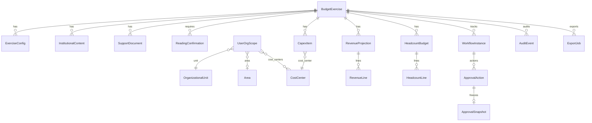

# 03 — Modelo de domínio (conceitual)

> Sem migrations nesta fase. Identificadores preliminares em UUID salvo indicação.

## Diagrama de relacionamentos

---

## Entidades

### 1. Exercício orçamentário (`BudgetExercise`)

| Aspecto | Proposta |
|---------|----------|
| Responsabilidade | Ciclo anual (ex.: 2027); guarda-chuva de todos os módulos |
| Campos | `id`, `year`, `title`, `status`, `opens_at`, `closes_at`, `locked_at`, `created_by`, timestamps |
| Relacionamentos | 1:N configs, conteúdos, projeções, headcount, capex, workflows, auditoria |
| Integridade | Negócio decide se há um único exercício aberto por ano |
| Versionamento | Status + eventos; não versionar o exercício a cada tecla |
| Exclusão | Soft-archive; nunca hard-delete após submissões |

### 2. Configuração anual (`ExerciseConfig`)

Parâmetros: colunas de referência pessoal, listas CAPEX, flags de módulos, obrigatoriedade de confirmação. Campos: `exercise_id`, `key`, `value` (JSON), `updated_by`.

### 3. Conteúdo institucional (`InstitutionalContent`)

Mensagem da Diretoria versionada: `version`, `title`, `body`, `published_at`, `published_by`, `checksum`. Confirmações amarradas à versão.

### 4. Documento de apoio (`SupportDocument`)

Anexos com `storage_path` em volume persistente (`persistent-upload-storage`).

### 5. Confirmação de leitura (`ReadingConfirmation`)

Única por (`user_sub`, `exercise_id`, `content_version`). Sem confirmação da versão vigente → edição bloqueada.

### 6. Escopo organizacional do usuário (`UserOrgScope`)

Amarração `user_sub` → `unit_code` / `area_code?` / `cost_center_codes[]` + `role_in_scope` (owner/editor/viewer). Enforcement **sempre** na API junto com RBAC.

### 7. Unidade (`OrganizationalUnit`)

`code` / `name`. Mapear para filiais TOTVS `01`/`02` com decisão de negócio (Jaraguá × ES).

### 8. Área (`Area`)

Códigos como PRODUCAO, VENDAS, ADMINISTRACAO. Subtipos MOD/MOI como `HeadcountLine.category`.

### 9. Centro de custo (`CostCenter`)

`code`, `name`, `unit_code?`, `active`. Fonte preferencial: distintos da view `vw_fin_despesas_centro_custo` até CTT nativo ser confirmado. **Não inventar CTT010.**

### 10–12. Receita (`RevenueProjection`, `RevenueLine`, Prospect/Projeto)

Cabeçalho por unidade/exercício + linhas (`customer_code?`, valores, `source` erp_baseline/manual). Shape detalhado **pendente** do material de Previsão de Receita.

### 13–14. Pessoal (`HeadcountBudget`, `HeadcountLine`)

**MVP (planilha):** área + category + colunas dez/out/previsto/ano.  
**Alternativa (Carta):** CC + cargo + série mensal.  
**Decisão necessária** — ver `10-riscos-pendencias-e-decisoes.md`.

### 15. CAPEX (`CapexItem`)

Campos alinhados à planilha: prioridade, CC, responsável, conta, descrição, fornecedor, turno, valor, data, classificação, observações; opcional `origin` nacional/importado (Carta). Soft-delete em draft; bloqueado se approved/locked.

### 16–18. Workflow / Aprovação / Comentário

`WorkflowInstance` por subject (`revenue` \| `headcount` \| `capex_bundle` \| `unit_package`). `ApprovalAction` com comentário obrigatório em reject/changes_requested. Thread opcional por item CAPEX.

### 19–20. Histórico e snapshot

`revision_number` + snapshot JSON imutável em submit/approve (padrão PAC). Diff campo-a-campo = fase 2.

### 21. Auditoria (`AuditEvent`)

`actor_sub`, `action`, `entity_type`, `entity_id`, `before`, `after`, `request_id`, `created_at`. Sem tokens/secrets.

### 22. Exportação (`ExportJob`)

`format` xlsx|pdf, filtros de escopo, `storage_path`, expiração, criador.

---

## Políticas transversais

| Tema | Política preliminar |
|------|---------------------|
| IDs | UUID v4 |
| Exclusão | Soft-delete / archive |
| Concorrência | `revision_number` / `expected_revision` |
| Totais | Calculados no servidor |
