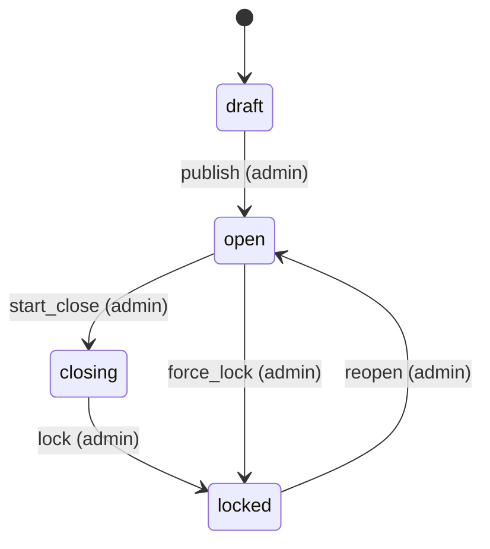
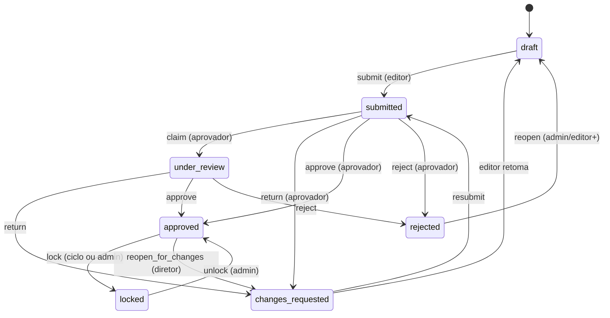

# 04 — Fluxos e estados

Estados candidatos do brief foram **revisados**. Nem todos são necessários em todas as máquinas.

## Princípios

1. Máquinas **separadas** por subject (exercício ≠ item CAPEX ≠ pacote de unidade).
2. Transições só na API; MFE apenas dispara intenções.
3. Comentário obrigatório em `changes_requested` e `rejected`.
4. `locked` é terminal operacional do ciclo (reopen só admin auditável).
5. `in_progress` pode colapsar com `draft` se não houver diferença de regra — **recomendação:** usar `draft` (editável) e `submitted` em diante.

Estados **descartados como obrigatórios globais:** `in_progress` (redundante com draft+atividade); manter só se UX precisar de “começou a preencher”.

---

## 1. Exercício orçamentário

Estados: `draft` → `open` → `closing` → `locked` → `archived` (com `reopen` excepcional locked→open).

> **Fase 1 (implementado):** `published`/`closed` do brief mapeiam para ação `publish`→`open` e `closing`/`locked`. Ver `12-fase-1-implementacao.md`.

| Transição | Ator | Validações | Comentário | Bloqueio | Auditoria | Notificação | Reversão |
|-----------|------|------------|------------|----------|-----------|-------------|----------|
| draft→open | admin | Carta publicada; prazos; listas config | opcional | habilita edição | sim | sim (início ciclo) | não (criar novo draft) |
| open→closing | admin | — | opcional | novas criações limitadas | sim | sim | admin→open |
| closing→locked | admin | workflows críticos aprovados ou waiver | obrigatório se waiver | tudo RO | sim + snapshot consolidado | sim | reopen |
| locked→open | admin | justificativa | **obrigatório** | desbloqueia | sim | sim | — |

---

## 2. Projeção de receita / Orçamento por área (pessoal) / Pacote CAPEX

Mesma máquina para subjects `RevenueProjection`, `HeadcountBudget`, `CapexBundle` (itens de um CC ou unidade).

Estados adotados: `draft`, `submitted`, `under_review`, `changes_requested`, `rejected`, `approved`, `locked`.

`reopened` = transição approved/locked → draft (admin/diretor), não estado persistente separado.

| Transição | Ator | Validações | Comentário | Efeito |
|-----------|------|------------|------------|--------|
| →submitted | editor no escopo | leitura confirmada; campos obrigatórios; revision | opcional (justificativa) | snapshot pré-submit; RO parcial |
| →changes_requested | aprovador escopo+ | subject submitted/under_review | **obrigatório** | reabre edição; notifica |
| →rejected | aprovador | idem | **obrigatório** | bloqueia até reopen |
| →approved | aprovador | regras mínimas; sem conflitos revision | opcional | snapshot aprovação |
| →locked | sistema/admin | exercício closing/lock | — | imutável |
| reopen | admin/diretor | | **obrigatório** | nova revision |

**Capex item individual:** pode permanecer `draft` enquanto o **bundle** do CC não foi submetido; ou cada item herda status do bundle (recomendado no MVP: status no bundle + itens editáveis só em draft/changes_requested).

---

## 3. Item CAPEX (opcional fino)

Se negócio exigir aprovação linha a linha: mesmos estados, porém MVP recomenda **bundle por CC**.

---

## 4. Eventos de notificação (preliminar)

| Evento | Destinatários |
|--------|---------------|
| submit | aprovadores do escopo |
| changes_requested / rejected | submitter + editores do escopo |
| approved | submitter; consolidadores |
| exercise open/lock | todos com `.access` |
| reading content updated | quem ainda não confirmou a nova versão |

Canal: reutilizar infraestrutura de notificações da plataforma se disponível; senão e-mail/fase 2.
