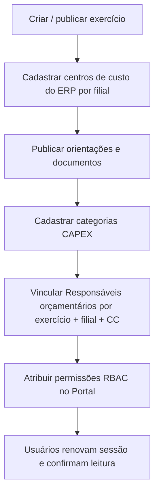
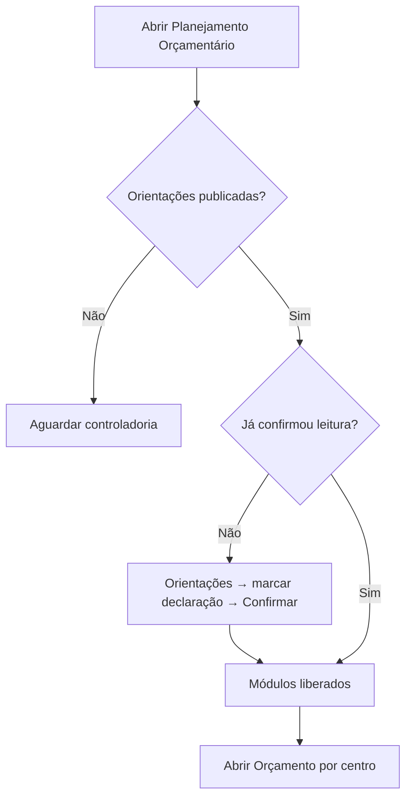
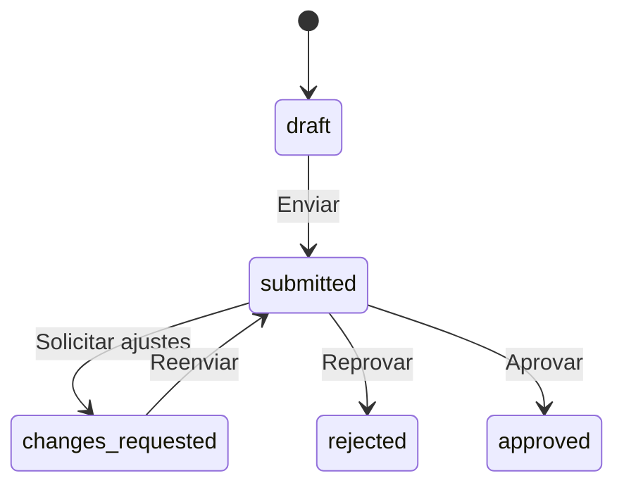

# Playbook do usuário — Planejamento Orçamentário (V1)

**Versão do manifesto:** `0.4.0`  
**Base path:** `/apps/planejamento-orcamentario`  
**Público:** administradores do ciclo, responsáveis de elaboração, aprovadores e consolidadores  
**Objetivo:** explicar, em linguagem operacional, como o plugin funciona na primeira versão — conceitos, papéis, fluxos, telas e erros comuns.

Documentos técnicos complementares: [`34-release-primeira-versao.md`](./34-release-primeira-versao.md) e fases `12`–`33` nesta pasta.

---

## 1. O que é o plugin

O **Planejamento Orçamentário** é o app da Minha Delpi onde a empresa:

1. abre um **exercício** (ex.: 2027);
2. publica **orientações** institucionais;
3. exige que cada colaborador **confirme a leitura**;
4. libera a elaboração de **CAPEX** (investimentos) e **Pessoal** (headcount);
5. conduz **aprovação** desses planos;
6. permite **consolidação** e **exportação Excel** do CAPEX.

Tudo passa pelo Portal (login Keycloak). A API está em `/apps/api-delpi/planejamento-orcamentario`.

---

## 2. Conceitos que todo mundo precisa entender

### 2.1 Exercício

Ciclo anual (ex.: «Planejamento Orçamentário Delpi - 2027»). Tem prazos de abertura e encerramento. Só há um ciclo “vigente” na prática do dia a dia.

### 2.2 Orientações + aceite

A controladoria publica a carta, premissas, cronograma e documentos.  
**Ninguém elabora CAPEX/Pessoal sem confirmar a leitura** das orientações vigentes.

### 2.3 Filial + centro de custo

- Filiais Delpi/TOTVS: **01** e **02**.
- Centros de custo vêm do **ERP** e são cadastrados no planejamento **por filial**.
- Regra de ouro:

```text
Filial 01 + CC 0205  ≠  Filial 02 + CC 0205
```

São centros distintos. Sempre escolha a filial correta.

### 2.4 Duas dimensões de acesso

| Dimensão | O que controla | Exemplo |
|----------|----------------|---------|
| **Permissão (RBAC)** | O que o menu e a API permitem fazer | `capex.submit`, `personnel.approve` |
| **Responsabilidade** | Em quais centros a pessoa trabalha | Fabiano · Filial 02 · 0205 |

Ter permissão **não** lista centros sozinha.  
Ter vínculo em **Escopos** **não** libera elaboração.  
Para elaborar, use **Responsáveis orçamentários** (cria CAPEX **e** Pessoal no mesmo centro).

### 2.5 Escopos × Responsáveis (atenção)

| Tela admin | Serve para | Aparece em Orçamento por centro? |
|------------|------------|----------------------------------|
| **Escopos** | Cadastro auxiliar de vínculos | **Não** |
| **Responsáveis orçamentários** | Quem elabora cada centro (CAPEX + Pessoal) | **Sim** |

### 2.6 Elaboração unificada (V1.1)

CAPEX e Pessoal são elaborados **juntos** no mesmo centro:

```text
/apps/planejamento-orcamentario/centros
/apps/planejamento-orcamentario/centros?unit_id=02&cost_center_id=0205
```

Na tela do centro há duas seções: investimentos CAPEX e grade de Pessoal.  
O **envio para aprovação** ainda é **por módulo** (plano CAPEX e plano Pessoal separados).

- **CAPEX:** o **plano** do centro reúne vários **investimentos** (itens) + anexos. O envio é do **plano**; a **aprovação/reprovação é de cada investimento**.
- **Pessoal:** o **plano** do centro tem **linhas** (cargo digitado + headcounts). O workflow ainda é do **plano**.

### 2.7 Versão (concorrência)

Cada plano/linha tem um número de **versão**. Se duas pessoas alteram ao mesmo tempo, a API devolve conflito: **recarregue** e não force o envio antigo.

---

## 3. Papéis e o que cada um faz

### 3.1 Matriz rápida

| Papel | Precisa (permissões típicas) | Faz |
|-------|------------------------------|-----|
| Qualquer usuário do app | `access` (+ `guidance.view`) | Home, ler orientações, confirmar leitura |
| Responsável CAPEX | `access` + `capex.submit` (+ guidance) | Ver só seus centros, criar/editar investimentos, anexar, submeter |
| Aprovador / Diretoria | `access` + `capex.approve` e/ou `personnel.approve` (+ ideal `capex.consolidation.view`) | **Gestão de aprovações** (cockpit) e filas |
| Consolidação CAPEX | `capex.consolidation.view` (+ `capex.export` se baixar Excel) | Visão gerencial e exportação |
| Responsável Pessoal | `personnel.view` + `personnel.edit` + `personnel.submit` | Headcount, autosave, submeter |
| Aprovador Pessoal (fila) | `personnel.approve` | Fila clássica de Pessoal |
| Administrador | `admin` (+ `scopes.manage`, `guidance.manage` conforme tarefa) | Exercício, orientações, centros ERP, responsáveis, categorias |

Códigos oficiais do manifesto (`0.4.0`):

```text
planejamento-orcamentario.access
planejamento-orcamentario.guidance.view
planejamento-orcamentario.guidance.manage
planejamento-orcamentario.scopes.manage
planejamento-orcamentario.admin
planejamento-orcamentario.capex.submit
planejamento-orcamentario.capex.approve
planejamento-orcamentario.capex.consolidation.view
planejamento-orcamentario.capex.export
planejamento-orcamentario.personnel.view
planejamento-orcamentario.personnel.edit
planejamento-orcamentario.personnel.submit
planejamento-orcamentario.personnel.approve
```

Após atribuir permissões no Portal: **renovar a sessão** (sair e entrar).

---

## 4. Mapa de telas (V1)

| Rota | Quem usa | O que é |
|------|----------|---------|
| `/apps/planejamento-orcamentario` | Todos | Home / launchpad do ciclo |
| `…/orientacoes` | Todos | Carta, docs, confirmação de leitura |
| `…/centros` | Responsável | Lista unificada + workspace CAPEX + Pessoal do CC |
| `…/capex` e `…/pessoal` | — | Redirecionam para `…/centros` (links antigos) |
| `…/capex/investimentos/novo` e `…/:id` | Responsável CAPEX | Criar/editar investimento |
| `…/gestao-aprovacoes` | Diretoria / aprovador | Cockpit: KPIs, lista de CC, decisão no centro |
| `…/gestao-aprovacoes?unit_id=&cost_center_id=` | Diretoria / aprovador | Workspace do CC (CAPEX + Pessoal) |
| `…/capex/aprovacoes` | Aprovador CAPEX | Fila avançada |
| `…/capex/aprovacoes/:planId` | Aprovador CAPEX | Detalhe (fora do menu) |
| `…/capex/consolidacao` | Consolidação | KPIs, agrupamentos, Excel |
| `…/pessoal/aprovacoes` | Aprovador Pessoal | Fila |
| `…/pessoal/aprovacoes/:planId` | Aprovador Pessoal | Detalhe (fora do menu) |
| `…/admin` | Admin | Hub administrativo |
| `…/admin/exercicios` | Admin | Ciclos |
| `…/admin/orientacoes` | Admin / guidance.manage | Publicar orientações |
| `…/admin/centros-de-custo` | scopes.manage | Importar CC do ERP |
| `…/admin/escopos` | scopes.manage | Escopos (não libera elaboração) |
| `…/admin/responsaveis` | scopes.manage | **Responsáveis orçamentários** (CAPEX + Pessoal) |
| `…/admin/categorias-capex` | scopes.manage | Categorias de investimento |

**Receita** aparece na home como «Em breve» — fora da V1.

---

## 5. Fluxo do administrador (preparar o ciclo)

Ordem recomendada:



### 5.1 Exercício

1. Administração → Exercícios  
2. Criar o ciclo (ano, nome, datas)  
3. Publicar / deixar **aberto** para elaboração  

### 5.2 Centros de custo

1. Administração → Centros de Custo  
2. Consultar ERP **por filial** (01 ou 02)  
3. Incluir no catálogo do planejamento (sem digitar código “na mão”)  

### 5.3 Orientações

1. Administração → Orientações  
2. Editar rascunho (texto, premissas, cronograma)  
3. Anexar documentos permitidos  
4. **Publicar** nova versão  

Sem publicação, a home mostra «aguardando orientações».

### 5.4 Categorias CAPEX

Cadastre as categorias usadas no formulário de investimento (ativas).

### 5.5 Responsáveis orçamentários (obrigatório para elaboração)

1. Administração → **Responsáveis orçamentários**  
2. Novo vínculo:  
   - exercício vigente  
   - usuário do diretório (sub real)  
   - filial → centro de custo  
   - tipo (responsável / colaborador)  
3. Ao salvar, o sistema cria **dois** registros (`capex` e `personnel`) para o mesmo CC  
4. Repita para cada centro que a pessoa deve ver  

Sem esse vínculo, «Orçamento por centro» fica sem centros (mesmo com permissão RBAC).

### 5.6 Escopos

Use só se a operação ainda mantiver esse cadastro auxiliar. **Não substitui Responsáveis orçamentários.**

### 5.7 RBAC no Portal

Importar manifesto `0.4.0` (se ainda não estiver) e atribuir permissões aos perfis. Depois: logout/login.

---

## 6. Fluxo do colaborador (qualquer módulo)



### 6.1 Home

Mostra o ano do exercício, status (liberado / leitura pendente / encerrado) e o atalho **Orçamento por centro** (além de filas/consolidação conforme permissão).

### 6.2 Confirmar leitura

1. Menu **Orientações orçamentárias** (ou CTA da home)  
2. Ler carta e documentos  
3. Marcar a declaração  
4. Confirmar  

Só então a elaboração por centro desbloqueia.

---

## 7. Fluxo CAPEX — responsável (seção no workspace do centro)

### 7.1 Pré-requisitos

- Permissão `capex.submit`  
- Responsabilidade orçamentária ativa (módulo CAPEX) no exercício + filial + CC  
- Leitura das orientações confirmada  

### 7.2 Passo a passo

1. Home → **Orçamento por centro** (ou rota `…/centros`)  
2. Abra o centro desejado  
3. Na seção **CAPEX**: **Novo investimento** (categoria, valores, prioridade, origem, textos)  
4. Salvar; anexar arquivos se necessário  
5. Repetir para os demais itens do centro  
6. No painel do **plano CAPEX**, **Enviar para aprovação**  
   - Só com plano completo  
   - Confirme: após o envio a grade CAPEX fica **somente leitura**  

O envio de Pessoal é **independente** (seção Pessoal na mesma tela).

### 7.3 Se pedirem ajustes

Status **Ajustes solicitados**:

1. Leia o comentário do aprovador  
2. Corrija investimentos  
3. **Reenvie** para aprovação  

### 7.4 O que o responsável não faz

- Não aprova o próprio plano (segregação de funções)  
- Não vê centros de outros responsáveis  
- Não edita plano em `submitted` / `rejected` / `approved`  

---

## 8. Fluxo do diretor — gestão de aprovações

### 8.1 Pré-requisitos

- `capex.approve` e/ou `personnel.approve` no Portal  
- Idealmente `capex.consolidation.view` para KPIs R$ completos  

**Não** é necessário cadastrar o diretor em Responsáveis orçamentários.

### 8.2 Passo a passo

1. Home → **Gestão de aprovações** (ou menu)  
2. Veja KPIs (R$ em análise / aprovado) e a lista de centros com pendência  
3. **Abrir gestão** no centro desejado  
4. Na seção CAPEX: abra os **detalhes** de cada investimento (observações, justificativa, anexos) e **Aprovar / Reprovar item a item**  
   - Para devolver o centro inteiro ao responsável, use **Solicitar ajustes** no rodapé  
5. Na seção Pessoal: revise headcount e decida (plano separado)  
6. Use **Atualizar** no overview para ver o consolidado refletir as decisões  

As filas «Fila CAPEX» / «Fila Pessoal» continuam disponíveis como visão avançada.

### 8.3 Fluxo CAPEX — aprovador (fila clássica)

#### Pré-requisitos

- Permissão `capex.approve`  

#### Passo a passo (fila)

1. Menu **Fila CAPEX**  
2. Filtre exercício / filial / status conforme necessário  
3. **Analisar** o plano (grade de investimentos com detalhes e observações)  
4. **Aprove ou reprove cada investimento.** O plano encerra quando todos tiverem decisão:  

| Ação | Comentário | Efeito |
|------|------------|--------|
| Aprovar (item) | Opcional | Marca o investimento como aprovado |
| Reprovar (item) | **Obrigatório** | Marca o investimento como reprovado |
| Solicitar ajustes (conjunto) | **Obrigatório** | Devolve o plano ao responsável (`changes_requested`) |

Quando **todos** os itens tiverem decisão: se houver ao menos um aprovado o plano fica `approved`; se todos forem reprovados, `rejected`. Itens reprovados **não** entram no valor aprovado da consolidação.

### 8.4 Segregação

Quem **submeteu** o plano **não** pode decidir sobre ele. A API bloqueia com código de segregação.

---

## 9. Consolidação e Excel CAPEX

1. Menu **Consolidação de Investimentos** (`capex.consolidation.view`)  
2. Filtre e analise KPIs / agrupamentos  
3. Se tiver `capex.export`, baixe a planilha Excel  

Não substitui a fila de aprovação; é visão gerencial.

---

## 10. Fluxo Pessoal — responsável

### 10.1 Pré-requisitos

- `personnel.view` + `personnel.edit` (+ `personnel.submit` para enviar)  
- Responsabilidade de módulo **pessoal** no centro  
- Leitura confirmada  

### 10.2 Passo a passo

1. Home → **Orçamento por centro** → abra o CC  
2. Na seção **Pessoal**, inclua linhas com **cargo digitado livremente** (não há catálogo de cargos na V1)  
3. Preencha os headcounts (colunas do ciclo) e observações  
4. Autosave grava alterações; aguarde «salvo» antes de enviar  
5. **Enviar para aprovação** (painel do plano Pessoal — independente do CAPEX)  
   - Plano incompleto: a API lista linhas e campos pendentes  

### 10.3 Após ajustes

Corrija o comentário do aprovador e **reenvie**.

---

## 11. Fluxo Pessoal — aprovador

Igual ao CAPEX, na rota **Aprovações de Pessoal**:

- Fila → detalhe (somente leitura) → solicitar ajustes / reprovar / aprovar  
- Comentário obrigatório em ajustes e reprovação  
- Segregação: quem submeteu não decide  

---

## 12. Estados do plano (CAPEX e Pessoal)

```text
draft  →  submitted  →  changes_requested | rejected | approved
```

| Código | Label (UI) | Editável? |
|--------|------------|-----------|
| `draft` | Rascunho | Sim |
| `submitted` | Enviado para aprovação | Não |
| `changes_requested` | Ajustes solicitados | Sim |
| `rejected` | Reprovado | Não (até política de reopen; V1: bloqueado) |
| `approved` | Aprovado | Não |



---

## 13. Checklist por persona

### Administrador

- [ ] Exercício aberto  
- [ ] Centros ERP cadastrados (01 e 02 conforme uso)  
- [ ] Orientações publicadas  
- [ ] Categorias CAPEX ativas  
- [ ] Responsáveis orçamentários corretos (não só Escopos)  
- [ ] Permissões RBAC atribuídas; usuários renovaram sessão  

### Responsável (CAPEX + Pessoal no mesmo centro)

- [ ] Confirmou leitura  
- [ ] Vê os centros certos em «Orçamento por centro»  
- [ ] Na tela do CC: investimentos CAPEX + anexos; grade Pessoal  
- [ ] Enviou o plano CAPEX e o plano Pessoal (ainda separados)  
- [ ] Se ajustes: corrigiu e reenviou o módulo solicitado  

### Aprovador CAPEX

- [ ] Fila carrega planos `submitted`  
- [ ] Decisão registrada com comentário quando exigido  
- [ ] Não tenta aprovar plano que ele mesmo submeteu  

### Aprovador Pessoal

- [ ] Fila própria de Pessoal  
- [ ] Mesma segregação (não aprova o que submeteu)  

---

## 14. Erros e dúvidas frequentes

| Situação | Causa provável | O que fazer |
|----------|----------------|-------------|
| Centro errado / não mostra 0205 | Vínculo só em **Escopos** ou responsável antigo | Cadastrar/ajustar em **Responsáveis orçamentários**; desativar vínculo inválido |
| «Sem centros atribuídos» | Sem responsabilidade no exercício | Admin cria vínculo |
| Módulos bloqueados | Não confirmou leitura | Ir em Orientações |
| Não aparece o app no Portal | Manifesto / permissão `access` | Importar manifesto e atribuir RBAC; renovar sessão |
| Botão de enviar some | Sem `submit` ou status não editável / autosave pendente | Checar permissão e status do plano |
| Conflito de versão | Outra pessoa salvou antes | Recarregar; reaplicar a alteração |
| Plano incompleto ao enviar | Campos obrigatórios faltando | Completar linhas apontadas pela API |
| Segregação / forbidden | Aprovador = quem submeteu | Outro aprovador decide |
| 401 | Sessão expirada | Login de novo |
| 403 | Sem permissão ou fora do escopo | Pedir RBAC/vínculo à admin |

---

## 15. O que **não** entra na V1

- Consolidação / Excel de **Pessoal**  
- Notificações automáticas (e-mail/push)  
- Salários, benefícios, encargos  
- Catálogo de cargos / sync de cargos com ERP  
- Módulo de **Receita**  
- Reabertura livre de planos aprovados  
- Importação em massa  

Backlog e retomada: ver [`34-release-primeira-versao.md`](./34-release-primeira-versao.md).

---

## 16. Glossário

| Termo | Significado |
|-------|-------------|
| Exercício | Ciclo orçamentário anual |
| Orientações | Carta + premissas + docs oficiais |
| Aceite / acknowledge | Confirmação de leitura |
| Responsabilidade | Vínculo usuário ↔ exercício ↔ módulo ↔ filial ↔ CC |
| Escopo (tela admin) | Cadastro auxiliar; **não** autoriza CAPEX |
| Plano CAPEX | Pacote de investimentos de um CC |
| Investimento | Item individual de CAPEX |
| Plano de Pessoal | Grade de headcount de um CC |
| Submeter | Enviar plano à fila de aprovação |
| Consolidação | Visão gerencial agregada (CAPEX) |

---

## 17. Contatos operacionais (preencher na homologação)

| Papel | Nome / área |
|-------|-------------|
| Dono do processo (Controladoria) | _a definir_ |
| Admin do Portal / RBAC | _a definir_ |
| Suporte técnico Minha Delpi | _a definir_ |

---

## 18. Referências

| Documento | Conteúdo |
|-----------|----------|
| [`34-release-primeira-versao.md`](./34-release-primeira-versao.md) | Escopo V1, permissões, checklist de homologação |
| [`15-fase-2a1-responsabilidades-backend.md`](./15-fase-2a1-responsabilidades-backend.md) | Modelo de responsáveis |
| [`22-fase-2c1-workflow-capex-backend.md`](./22-fase-2c1-workflow-capex-backend.md) / [`23-fase-2c2-workflow-capex-frontend.md`](./23-fase-2c2-workflow-capex-frontend.md) | Workflow CAPEX |
| [`32-fase-3c1-workflow-pessoal-backend.md`](./32-fase-3c1-workflow-pessoal-backend.md) / [`33-fase-3c2-workflow-pessoal-frontend.md`](./33-fase-3c2-workflow-pessoal-frontend.md) | Workflow Pessoal |
| [`30-fase-3b1-1-cargo-livre.md`](./30-fase-3b1-1-cargo-livre.md) | Cargo livre (sem catálogo) |
| `plugins/planejamento-orcamentario/README.md` | Notas técnicas do MFE |

---

*Playbook alinhado à V1.2 (manifesto 0.4.0) — elaboração por centro + cockpit de gestão de aprovações; envio/aprovação ainda por módulo.*
