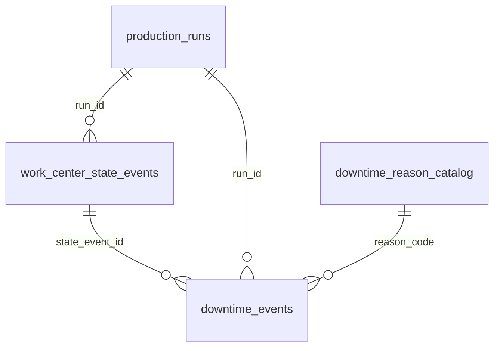

# MES — estados operacionais e paradas (fundação)

> **Status:** Etapa 01 implementada (set/2026) — fundação de domínio e persistência.
> **Owner do domínio MES:** `production-control-api`
> **Owner da telemetria:** `production-pulse-api` (apenas hardware/counter/epoch/saúde)
> **Runtime de transição (Pause/Resume → estados):** Etapa 02 — *não implementado ainda*

Documento canônico do modelo MES de estados do centro de trabalho e paradas.
A contagem de peças Pulse → run permanece documentada em
[MES-PULSE-COUNTING.md](MES-PULSE-COUNTING.md) e **não depende** destas tabelas.

---

## 1. Objetivo

Persistir **fatos** que permitam reconstruir a timeline operacional de cada
centro de trabalho: quando estava livre, produzindo ou parado, por qual motivo,
vinculado a qual run/OP/operação — base auditável para Disponibilidade,
Performance, Qualidade e OEE futuros.

## 2. Três conceitos que não se confundem

| Conceito | Owner | Valores |
|---|---|---|
| Ciclo de vida do run | `production_runs.status` | `running`, `paused`, `completed`, `aborted` |
| Estado operacional do CT | `work_center_state_events.state` | `idle`, `setup`, `producing`, `stopped`, `planned_stop` |
| Saúde da telemetria | Pulse (`device.online`/`status`) | `online`, `stale`, `offline` |

**Device offline ≠ máquina parada.** Telemetria e estado produtivo são
dimensões independentes; nenhuma regra do modelo lê `device.online` para
resolver estado operacional.

## 3. Modelo



### `downtime_reason_catalog`

Catálogo governado de motivos. `code` é a identidade estável; `label` pode
mudar sem perder histórico. `active=false` desativa sem apagar (FK RESTRICT).

| Campo | Tipo | Nota |
|---|---|---|
| `code` | VARCHAR(40) PK | identidade estável |
| `label` | VARCHAR(120) | texto visual |
| `category` | VARCHAR(40) | agrupamento |
| `default_planned` | BOOLEAN NULL | NULL = classificação OEE não governada |
| `default_counts_as_availability_loss` | BOOLEAN NULL | idem |
| `requires_note` | BOOLEAN | ex.: `other` exige observação |
| `active`, `sort_order` | | catálogo ordenado, soft-delete |
| `created_at`, `updated_at` | TIMESTAMPTZ | |

Seeds (idempotentes, `ON CONFLICT DO NOTHING`): `machine_mechanical`,
`machine_electrical`, `tool`, `raw_material`, `quality`, `setup`,
`maintenance`, `no_operator`, `logistics`, `break`, `cleaning`,
`other` (`requires_note`). Todos com classificação OEE **NULL** — nenhuma
fonte canônica do repo define ainda quais motivos são planejados ou contam
como perda de disponibilidade; inventar contaminaria indicadores futuros.

### `work_center_state_events`

Fatos temporais do estado operacional. `ended_at IS NULL` = estado aberto
(atual). `run_id` nullable — estados sem run (ex.: `idle`, `planned_stop`)
serão legítimos na Etapa 02+. `source`: `operator` | `system` | `recovery` |
`integration`.

### `downtime_events`

A parada MES. Nasce **sem motivo** (`reason_code NULL`, `confirmed=false`) —
no Pause o operador classifica depois. `planned` e
`counts_as_availability_loss` são **snapshots da classificação no momento da
aplicação**: mudança futura no catálogo não reinterpreta histórico.

`state_event_id` vincula explicitamente a parada ao evento `stopped`
(opcional; sem relacionamento circular — a parada referencia o estado).

Duração **não é persistida**: deriva-se de `ended_at − started_at`
(`NOW() − started_at` enquanto aberta). Persistir fatos, derivar indicadores.

## 4. Invariantes (banco + domínio)

| Invariante | Onde |
|---|---|
| ≤ 1 estado aberto por `(branch, work_center)` | índice parcial `UNIQUE ... WHERE ended_at IS NULL` + `MesStateConflict` |
| ≤ 1 parada aberta por `(branch, work_center)` | índice parcial `UNIQUE ... WHERE ended_at IS NULL` + `DowntimeConflict` |
| `ended_at >= started_at` | CHECK + validação de domínio |
| `confirmed` exige `reason_code` + `confirmed_at` | CHECKs + `validate_downtime_event` |
| `confirmed_at` só existe com `confirmed` | CHECK + domínio |
| FKs protegem histórico | `ON DELETE RESTRICT` (run, state event, reason) |
| Timestamps absolutos | TIMESTAMPTZ + domínio rejeita naive |

**Sem backfill inventado:** a migration cria estruturas e o catálogo, e deixa
as tabelas de eventos **vazias**. Runs históricos não viram `producing`
retroativos — a timeline MES só registra o que ela observar a partir da
Etapa 02.

## 5. Camadas

| Camada | Arquivo |
|---|---|
| Estados/origens/validações | `domain/services/mes_operational_state.py` |
| Erros | `domain/errors.py` (`InvalidMesEvent`, `MesStateConflict`, `DowntimeConflict`, `DowntimeNotFound`) |
| Ports | `domain/ports/work_center_state_repository.py`, `downtime_event_repository.py`, `downtime_reason_repository.py` |
| Adapter | `infrastructure/persistence/postgres_mes_repository.py` |
| Migration | `migrations/V010__mes_state_and_downtime_foundation.sql` |

**Transações:** o adapter usa `get_connection()` autocommit-off como os demais
repositories. Os métodos de escrita aceitam `conn` opcional para que, na
Etapa 02, o Pause execute *fecha PRODUCING + abre STOPPED + cria parada +
pausa run* numa única transação — sem estado intermediário inconsistente.
Hoje não há wiring no `pc_composer` (dead wiring evitado).

**Concorrência:** o índice único parcial é a última barreira; violações são
convertidas em `MesStateConflict`/`DowntimeConflict` (nunca erro cru do
Postgres para a camada HTTP).

## 6. O que NÃO foi feito (escopo da etapa)

- nenhuma mudança em Play/Pause/Resume/Stop;
- nenhum endpoint HTTP novo;
- nenhum cálculo de OEE/disponibilidade/performance;
- nenhum backfill de histórico;
- nenhuma alteração no Production Pulse;
- nenhuma máquina de transição completa (só invariantes estruturais);
- nenhuma mudança visual no cockpit.

## 7. Pré-visualização da Etapa 02

```text
PLAY   → PRODUCING aberto (run_id vinculado)
PAUSE  → fecha PRODUCING → abre STOPPED → cria downtime (motivo NULL)
RESUME → encerra downtime → fecha STOPPED → abre PRODUCING
STOP   → encerra estado/downtime abertos → run completed
```

Tudo em transação única por transição, com eventos WS existentes
(`run_started`, `run_paused`, …) continuando a alimentar o cockpit.
