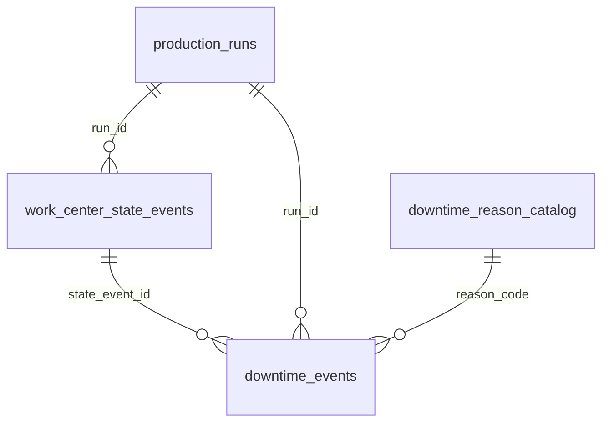

# MES — estados operacionais e paradas (fundação)

> **Status:** Etapa 04 implementada — timer realtime da parada + timeline do run.
> **Owner do domínio MES:** `production-control-api`
> **Owner da telemetria:** `production-pulse-api` (apenas hardware/counter/epoch/saúde)
> **Robustez/recuperação/auditoria/integridade:** Etapa 05 implementada (§9). Homologação industrial: `MES-PHASE-01-HOMOLOGATION.md`.

Documento canônico do modelo MES de estados do centro de trabalho e paradas.
A contagem de peças Pulse → run permanece documentada em
[MES-PULSE-COUNTING.md](MES-PULSE-COUNTING.md) e **não depende** destas tabelas.

---

## 1. Objetivo

Persistir **fatos** que permitam reconstruir a timeline operacional de cada
centro de trabalho: quando estava livre, produzindo ou parado, por qual motivo,
vinculado a qual run/OP/operação — base auditável para Disponibilidade,
Performance, Qualidade e OEE futuros.

## 2. Três conceitos que não se confundem

| Conceito | Owner | Valores |
|---|---|---|
| Ciclo de vida do run | `production_runs.status` | `running`, `paused`, `completed`, `aborted` |
| Estado operacional do CT | `work_center_state_events.state` | `idle`, `setup`, `producing`, `stopped`, `planned_stop` |
| Saúde da telemetria | Pulse (`device.online`/`status`) | `online`, `stale`, `offline` |

**Device offline ≠ máquina parada.** Telemetria e estado produtivo são
dimensões independentes; nenhuma regra do modelo lê `device.online` para
resolver estado operacional.

## 3. Modelo



### `downtime_reason_catalog`

Catálogo governado de motivos. `code` é a identidade estável; `label` pode
mudar sem perder histórico. `active=false` desativa sem apagar (FK RESTRICT).

| Campo | Tipo | Nota |
|---|---|---|
| `code` | VARCHAR(40) PK | identidade estável |
| `label` | VARCHAR(120) | texto visual |
| `category` | VARCHAR(40) | agrupamento |
| `default_planned` | BOOLEAN NULL | NULL = classificação OEE não governada |
| `default_counts_as_availability_loss` | BOOLEAN NULL | idem |
| `requires_note` | BOOLEAN | ex.: `other` exige observação |
| `active`, `sort_order` | | catálogo ordenado, soft-delete |
| `created_at`, `updated_at` | TIMESTAMPTZ | |

Seeds (idempotentes, `ON CONFLICT DO NOTHING`): `machine_mechanical`,
`machine_electrical`, `tool`, `raw_material`, `quality`, `setup`,
`maintenance`, `no_operator`, `logistics`, `break`, `cleaning`,
`other` (`requires_note`). Todos com classificação OEE **NULL** — nenhuma
fonte canônica do repo define ainda quais motivos são planejados ou contam
como perda de disponibilidade; inventar contaminaria indicadores futuros.

### `work_center_state_events`

Fatos temporais do estado operacional. `ended_at IS NULL` = estado aberto
(atual). `run_id` nullable — estados sem run (ex.: `idle`, `planned_stop`)
serão legítimos na Etapa 02+. `source`: `operator` | `system` | `recovery` |
`integration`.

### `downtime_events`

A parada MES. Nasce **sem motivo** (`reason_code NULL`, `confirmed=false`) —
no Pause o operador classifica depois. `planned` e
`counts_as_availability_loss` são **snapshots da classificação no momento da
aplicação**: mudança futura no catálogo não reinterpreta histórico.

`state_event_id` vincula explicitamente a parada ao evento `stopped`
(opcional; sem relacionamento circular — a parada referencia o estado).

Duração **não é persistida**: deriva-se de `ended_at − started_at`
(`NOW() − started_at` enquanto aberta). Persistir fatos, derivar indicadores.

## 4. Invariantes (banco + domínio)

| Invariante | Onde |
|---|---|
| ≤ 1 estado aberto por `(branch, work_center)` | índice parcial `UNIQUE ... WHERE ended_at IS NULL` + `MesStateConflict` |
| ≤ 1 parada aberta por `(branch, work_center)` | índice parcial `UNIQUE ... WHERE ended_at IS NULL` + `DowntimeConflict` |
| `ended_at >= started_at` | CHECK + validação de domínio |
| `confirmed` exige `reason_code` + `confirmed_at` | CHECKs + `validate_downtime_event` |
| `confirmed_at` só existe com `confirmed` | CHECK + domínio |
| FKs protegem histórico | `ON DELETE RESTRICT` (run, state event, reason) |
| Timestamps absolutos | TIMESTAMPTZ + domínio rejeita naive |

**Sem backfill inventado:** a migration cria estruturas e o catálogo, e deixa
as tabelas de eventos **vazias**. Runs históricos não viram `producing`
retroativos — a timeline MES só registra o que ela observar a partir da
Etapa 02.

## 5. Camadas

| Camada | Arquivo |
|---|---|
| Estados/origens/validações | `domain/services/mes_operational_state.py` |
| Erros | `domain/errors.py` (`InvalidMesEvent`, `MesStateConflict`, `DowntimeConflict`, `DowntimeNotFound`) |
| Ports | `domain/ports/work_center_state_repository.py`, `downtime_event_repository.py`, `downtime_reason_repository.py` |
| Orquestração | `application/services/mes_run_lifecycle_service.py` |
| Adapter | `infrastructure/persistence/postgres_mes_repository.py` |
| Migration | `migrations/V010__mes_state_and_downtime_foundation.sql` |

**Transações:** os adapters aceitam `conn` opcional; quando fornecida, não
fazem commit próprio. O `PostgresProductionRunRepository` expõe
`transaction()` (contextmanager: commit ao sair, rollback em exceção) e
`lock_run()` (`SELECT ... FOR UPDATE`). Toda transição do run abre **uma**
transação compartilhada cobrindo run + segmentos + fatos MES.

**Concorrência:** `lock_run` serializa Pause/Resume/Stop do mesmo run; os
índices únicos parciais continuam a última barreira e violações viram erros
de domínio. `update_run_pieces` só atualiza runs `running` — um tick do
poller concorrente nunca sobrescreve a contagem consolidada por uma
transição. A leitura HTTP ao Pulse acontece **antes** de abrir a transação
(nenhum I/O externo dentro dela).

## 6. Lifecycle implementado (Etapa 02)

```text
PLAY   → cria run + segmento → abre PRODUCING (source=operator, run_id)
PAUSE  → consolida peças → fecha segmento → run=paused
         → fecha PRODUCING → abre STOPPED → cria downtime (motivo NULL)
RESUME → encerra downtime → fecha STOPPED → abre PRODUCING
         → reabre segmento (nova âncora Pulse) → run=running
STOP   → consolida peças (se running) → fecha segmento → run=completed
         → encerra downtime/estado abertos do run
```

Cada transição usa um único timestamp de transição (`at`) para todos os
fatos criados juntos. Orquestração em
`application/services/mes_run_lifecycle_service.py` (`MesRunLifecycleService`),
composta no `pc_composer` junto ao `ProductionRunService`. Nenhum endpoint
novo; o contrato WS (`run_started`/`run_paused`/`run_resumed`/`run_stopped`/
`pieces_updated`) e o poller de 500 ms permanecem inalterados.

### Política para dados legados e inconsistências

- **Run criado antes da Etapa 02** (sem nenhum evento de estado observado):
  o Pause/Stop passa a gravar fatos reais a partir daquele instante
  (`stopped` + `downtime` no Pause são fatos novos, não backfill); o Resume
  de um run pausado "pré-MES" apenas abre `producing` — o que o MES não
  observou, não é inventado.
- **Inconsistência observada** (estado aberto de outro run, parada ausente
  quando o `stopped` existe, estado diferente do esperado para a transição):
  erro de domínio controlado (`InvalidMesEvent`/`MesStateConflict`/
  `DowntimeConflict`) e rollback completo. Nunca sobrescrever nem inventar.

## 7. Classificação do motivo (Etapa 03)

A parada nasce no Pause com `reason_code = NULL`, `confirmed = false` — o
`started_at` da Etapa 02 continua sendo a fonte oficial do início. A
classificação apenas confirma o motivo, **sem alterar o início**.

### Endpoints públicos do cockpit

| Rota | Descrição |
|---|---|
| `GET /public/machine-load/{token}/mes/downtime-reasons` | Catálogo ativo: `{ items: [{ code, label, category, requiresNote }] }`. Frontend usa `code` como identidade, `label` só para exibição. |
| `POST /public/machine-load/{token}/runs/{run_id}/downtime/classify` | Confirma **ou altera** o motivo da parada aberta. Body: `{ reasonCode, note }` + `X-Delpi-Bench-Session`. Nunca cria outra parada. |
| `GET /public/machine-load/{token}/runs/active` | Snapshot do run agora inclui `downtime` (view da parada aberta com `reasonCode`, `reasonLabel`, `confirmed`), cobrindo reload/navegação/reconexão sem endpoint extra. |

`MesDowntimeClassificationService` (application) valida sessão, vínculo
run↔parada, motivo existente e ativo, `requires_note`, e aplica os snapshots
`planned` / `counts_as_availability_loss` a partir do catálogo — o cliente
nunca envia esses campos nem `confirmed_at`/`confirmed_by_ref`
(`confirmed_by_ref` = `operator_code` da sessão).

Após classificar, é emitido `production_run_updated` com
`reason = "downtime_classified"` no WebSocket existente, permitindo que
outros cockpits do mesmo CT sincronizem sem polling novo.

### Guarda de qualidade do dado

Com parada MES **observada e aberta**:

- `Resume`/`Stop` exigem `reason_code != NULL` e `confirmed = true`; caso
  contrário `DowntimeClassificationRequired` (409 — "Informe o motivo da
  parada antes de continuar.");
- runs **legados** (sem downtime MES observado) não são bloqueados — a
  política de não inventar histórico da Etapa 02 é preservada.

### Distinção: parada MES × parada TOTVS

`downtime_events` = fato MES realtime desta produção (classificável aqui).
`/performance/downtime-items` = histórico/indicador de horas improdutivas do
ecossistema TOTVS — conceito diferente, **não reutilizado** para classificação.

## 8. Timer e timeline (Etapa 04)

### Princípio

```text
PERSISTIR FATOS → DERIVAR TEMPOS E INDICADORES
```

Nenhum `duration_seconds`, tempo acumulado ou OEE é persistido. Toda duração
é derivada de `started_at`/`ended_at` no momento da leitura.

### Endpoint

`GET /public/machine-load/{token}/runs/{run_id}/timeline`
(header `X-Delpi-Bench-Session`)

Contrato:

```json
{
  "runId": "...",
  "branch": "01",
  "workCenter": "CT-35",
  "status": "paused",
  "referenceAt": "2026-09-28T23:20:00+00:00",
  "summary": {
    "elapsedSeconds": 3600,
    "producingSeconds": 3200,
    "stoppedSeconds": 400,
    "stopCount": 2
  },
  "items": [
    {
      "id": "...",
      "state": "stopped",
      "startedAt": "...",
      "endedAt": null,
      "durationSeconds": 245,
      "source": "operator",
      "downtime": {
        "id": "...",
        "reasonCode": "raw_material",
        "reasonLabel": "Falta de material",
        "category": "material",
        "confirmed": true,
        "note": null
      }
    }
  ]
}
```

- `MesRunTimelineService` (application) monta: eventos de estado do run +
  downtimes associados por `state_event_id`, ordenados cronologicamente.
- `referenceAt` = relógio do backend; eventos abertos (`endedAt = null`) usam
  `referenceAt` na duração. O frontend estima o "agora" do servidor com o
  offset `referenceAt − Date.now()` — o relógio local do operador não distorce
  o timer, e a aba em background nunca perde tempo.
- `summary` deriva apenas producing/stopped/stopCount — sem OEE.
- `stopped` sem downtime (inconsistência histórica) não quebra a UI
  ("Motivo não disponível").

### Frontend

- `DowntimeElapsedTimer`: `elapsed = serverNow() − startedAt`, tick visual de
  1 s recalculando sempre do timestamp oficial; formato `HH:MM:SS` sem limite.
- `useRunTimeline`: fetch inicial + reconciliação por WS
  (`run_started`/`run_paused`/`run_resumed`/`run_stopped`/`downtime_classified`),
  single-flight com coalescing; `pieces_updated` **não** recarrega a timeline;
  reconnect faz uma única reconciliação HTTP.
- `ProductionRunTimeline`: faixa proporcional compacta + histórico legível em
  seção expansível "Linha do tempo" dentro de `ProductionRunControls` — mesmo
  componente no card e no detalhe.

Sem polling periódico de timeline; o trecho aberto evolui localmente.

## 9. Robustez, auditoria e integridade (Etapa 05)

### Política de falha do Production Pulse

Telemetria indisponível **não** é máquina parada e nunca cria downtime. A
validação do snapshot é centralizada em
`domain/services/pulse_snapshot.py` → `classify_pulse_snapshot`, com estados
`usable | offline | invalid | unavailable`; nenhum caminho converte
counter/counterEpoch ausentes para `0`.

- **Play**: exige snapshot `usable` (device único do CT, counter/epoch válidos,
  online e sem staleness > 3× `pollIntervalMs`). Rejeita com erro claro ao
  operador.
- **Resume**: exige snapshot `usable` — cria a nova âncora do contador. Sem
  Pulse: run permanece `paused`, downtime aberto, nenhum segmento falso.
- **Pause**: funciona degradado — usa somente o último `pieces_total`
  persistido e as peças já conhecidas do segmento aberto, fecha o segmento sem
  inventar contagem, abre `stopped` + downtime e registra
  `telemetry_fallback_used`.
- **Stop running**: mesma estratégia do Pause (consolida com snapshot
  confiável ou fecha com último valor conhecido e completa em modo degradado).
- **Stop paused**: não depende do Pulse.
- **Poller**: snapshot inválido/offline mantém a última contagem e o segmento
  aberto inalterados; não gera epoch artificial; retenta no próximo ciclo.
- **`get_active`**: falha de telemetria devolve `device.online=false` no
  payload sem derrubar a leitura do run.

`counterEpoch` alterado fecha o segmento com o último valor conhecido e abre
nova âncora — auditado como `counter_epoch_changed` com
`{previousEpoch, newEpoch}`.

### Auditoria MES (V011 `mes_audit_events`)

Tabela append-only: `id, branch, work_center, run_id, action, actor_type,
actor_ref, occurred_at, details JSONB, created_at`. Sem tokens/JWT/segredos.

Ações registradas: `run_started`, `run_paused`, `run_resumed`, `run_stopped`,
`downtime_classified`, `downtime_reason_changed` (com previous/new no
`details`), `counter_epoch_changed`, `telemetry_fallback_used`,
`automatic_downtime_started` (details: `thresholdSeconds`,
`lastCountActivityAt`, `detectedAt`, `idleSecondsAtDetection`) e
`automatic_downtime_ended` (details: `downtimeId`, `endedAt`).
`actor_type=operator` com `actor_ref` = código do operador da sessão;
`system` para eventos sem operador — incluindo as transições automáticas.

A auditoria participa da **mesma transação** da transição: se estado/downtime
faz rollback, nenhuma linha de audit "falso-sucesso" sobrevive. A
classificação (`downtime classify`) também é atômica com sua auditoria via
`conn` compartilhada.

### Integrity check (`MesRuntimeIntegrityService`)

Executado no startup: migrations → integrity check → poller. Somente-leitura;
**nunca auto-repara** (auto-repair inventaria história industrial). Saída:
issues `{severity, issue_code, run_id, branch, work_center}` logadas de forma
estruturada. A API **continua subindo** mesmo com inconsistências — o serviço
precisa estar disponível para diagnóstico/recuperação.

Regras: `running` observado pelo MES exige segmento aberto e OU
`producing` aberto sem downtime OU — desde a detecção automática — `stopped`
aberto com **exatamente uma** parada aberta `source='system'` (parada
automática por inatividade); `running + stopped` com parada de operador, sem
parada ou com `producing` simultâneo continua `CRITICAL`. `paused` exige
`stopped` + downtime aberto e nenhum segmento aberto; `completed/aborted` não podem ter segmento/estado/
downtime abertos; fatos abertos de run A em CT cujo ativo é B = `CRITICAL`
cross-run; run sem nenhum evento MES = `WARNING` legado. Anomalias detectadas
incluem `paused_with_open_producing`, `running_with_open_stopped`,
`open_downtime_of_other_run`, `finished_with_open_state`, entre outras.

### Recuperação após restart

Run/segmento/estados/downtime são fatos persistidos: restart de API,
navegador ou container não cria run novo, não duplica `producing`/`stopped`,
não duplica downtime e não move a âncora. O poller retoma os runs `running`
do banco. O timer volta pelo `startedAt` persistido; o cockpit reconcilia via
HTTP no reconnect do WebSocket (single-flight) — sem polling de timeline.

### Telemetria offline na UI

`device.online === false` exibe o banner "Contador sem comunicação — última
contagem conhecida mantida", visual e semanticamente distinto de "Produção
parada". Pausar/Encerrar seguem disponíveis; o contador congela no último
valor confiável.

## 10. O que NÃO foi feito (fica para fases seguintes)

- abertura de `idle` ao finalizar run — não necessária nesta fase;
- administração do catálogo de motivos;
- nenhum cálculo de OEE/disponibilidade/performance;
- nenhum backfill de histórico;
- nenhuma alteração no Production Pulse;
- threshold dinâmico por ciclo/OP e supervisório consolidado de máquinas
  (a detecção automática existe — ver § 11 — mas sem tuning por item);
- integração da parada MES com TOTVS.

Homologação industrial formal: `MES-PHASE-01-HOMOLOGATION.md`.

## 11. Detecção automática de parada por ausência de peças (extensão da Fase 01)

Enquanto `run.status = running` + estado operacional `producing` + telemetria
Pulse `usable`, o MES observa `last_count_activity_at` do run — o instante do
**último incremento real** de peças (ou o Play, como baseline inicial).

Configuração: `PC_MES_AUTO_DOWNTIME_SECONDS` (default `120`; `0` desabilita).
Definida em `production-control-api/config.py`, propagada pelos exemplos de
ambiente e pelos compose — nunca hardcoded.

### Detecção

A detecção roda dentro do `ProductionRunPollerService` existente (~500 ms),
sem worker extra. A cada tick:

- snapshot Pulse **não `usable`** (offline/invalid/unavailable/stale) → nada
  muda — falha de Wi-Fi/ESP32 **não** é parada de máquina;
- incremento real de peças → `update_run_pieces(..., activity_at=agora)` e, se
  houver parada automática aberta, auto-resume;
- sem incremento → compara `agora − last_count_activity_at` com o threshold.

`last_count_activity_at` é coluna persistida (`V012`), criada no Play
(`NOW()`) e atualizada **somente** quando há incremento — nunca a cada tick.
Runs legados com `NULL`: o primeiro tick com snapshot válido grava o baseline
e só então a janela começa — nenhuma parada retroativa é inventada.

### Abertura da parada automática

Quando o threshold é atingido, em transação + `lock_run()` (revalidando o
baseline depois do lock):

- `producing` fecha em `started_at = last_count_activity_at` — a parada conta
  desde o último golpe, não desde a detecção;
- `stopped` abre com `source='system'`;
- `downtime_event` abre com `source='system'`, `reason_code=NULL`,
  `confirmed=false`;
- auditoria `automatic_downtime_started` (`actor_type='system'`) na mesma tx;
- WS `production_run_updated` + `reason='automatic_downtime_started'` com
  `operationalState='stopped'` e o `downtime`.

Estado resultante: `run.status='running'` + `stopped` + parada aberta — o
cockpit mostra "Produção parada" + cronômetro desde `startedAt` e permite
Informar motivo enquanto parada segue aberta. `paused` continua reservado ao
Pause explícito.

Ticks seguintes são idempotentes: parada já aberta → nenhum fato/evento novo.

### Retorno automático

Novo incremento real em `running` + `stopped` automático, com um único `at`:

- `downtime.ended_at = at`; `stopped` fecha; `producing` reabre
  (`source='system'`); `last_count_activity_at = at`;
- auditoria `automatic_downtime_ended`; WS `automatic_downtime_ended` com
  `operationalState='producing'`.

O run nunca sai de `running`; nenhum Resume manual é exigido. `paused`
**nunca** auto-resume — o poller só processa `running`.

### Interações

- **Pause durante auto-stop**: `record_run_paused` reutiliza o `stopped` +
  parada abertos (só muda `run.status`) — sem fatos duplicados.
- **Stop durante auto-stop**: exige classificação da parada aberta
  (`DowntimeClassificationRequired`); os fatos são validados **antes** de
  mutar `run.status`, dentro da mesma transação.
- **Decaimento/correção do contador** não é golpe: atualiza `pieces_total` e
  emite `pieces_updated`, mas não mexe no baseline nem auto-resume.

### Snapshot e classificação

`get_active` passa a expor `operationalState` (estado aberto do run),
`pendingDowntime` (parada mais antiga sem classificação, aberta ou já
encerrada — `list_pending_classification`, limite 5) e
`pendingDowntimeCount`. Após o auto-resume, uma parada encerrada sem motivo
reaparece como pendência — inclusive após F5/reconnect — e o cockpit abre o
modal "Por que a produção parou?" sem bloquear a produção.

Classificação: o endpoint legado `POST /runs/{id}/downtime/classify`
continua classificando a parada **aberta**. O novo
`POST /runs/{id}/downtimes/{downtime_id}/classify` classifica uma parada
específica do run — inclusive já encerrada — validando `run_id`, filial/posto
e sessão. `requires_note` e auditoria de operador se aplicam igualmente.

Timeline: os trechos `stopped` automáticos surgem naturalmente
(`source='system'` no item e na parada); durações seguem derivadas de
timestamps — nada de `duration_seconds` persistido.
