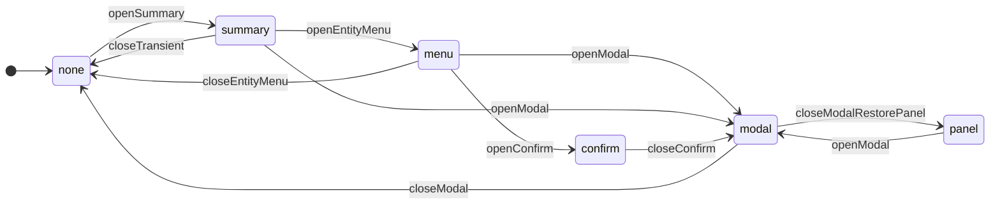
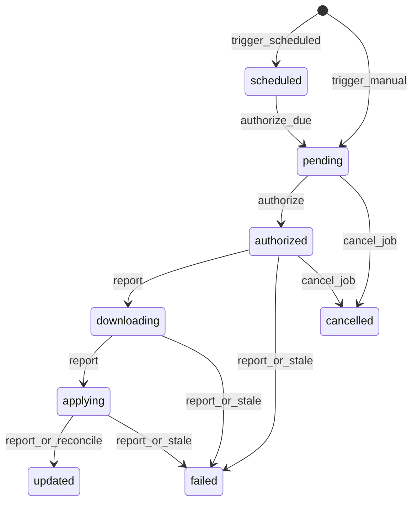

# Admin Hub + OTA — estabilização (state machines e feedback)

Documento vigente após estabilização Admin Hub / feedback / Avulso / OTA recovery.
Não substitui [SCHEMA.md](./SCHEMA.md) nem [API-ROUTES-AND-BUSINESS-RULES.md](./API-ROUTES-AND-BUSINESS-RULES.md).

## Admin Hub — layers

Owner: `plugins/production-pulse/src/utils/adminHubLayerTransitions.ts` + `FirmwareLinksPage`.

### URL vs efêmero

| Layer | Entra na URL? | Notas |
|-------|---------------|-------|
| `panel` | `panel=` | shareable (`devices`/`firmwares`/`jobs`/`drivers`/…) |
| `modal` | `modal=` (+ `entity=` quando relevante) | canônico; inclui `driver-create` / `driver-detail` |
| `summary` / `menu` | **não** | âncora DOM + `popoverAnchorId`; fechar limpa entity URL |
| `confirm` | **não** | sobrevive a hydrate URL que ainda carrega `modal=` |
| Link Mode | **não** | efêmero na página |
| FloatingNotice | **não** | nunca altera `openLayer` |

### Tipo de driver vs Família OTA

| Termo UI | Campo | Cadastro |
|----------|-------|----------|
| Tipo de driver | `driver_key` | Painel Drivers (tabela `device_drivers`) |
| Família OTA | `firmware_key` | Novo firmware / catálogo de versões |

Não usar `firmwareKey` como label principal na UI.

### Invariantes

- Uma transição atômica via `transitionAdminHub` / `dispatch` — sem `sync=false` ad hoc.
- `graphReloading` limpa summary/menu antes de desmontar o canvas (âncora DOM stale).
- `hydrateFromUrl` **não** força `summary` a partir de `entity=` órfão.
- Job detail abre só com `openLayer === "modal" && modal === "job-detail"`.

## Feedback — 1 evento = 1 superfície

| Tipo | Superfície | Exemplos |
|------|------------|----------|
| Erro de campo | inline no form | IP inválido, label obrigatório |
| Ação transitória | `PpFloatingNotices` via `resolveProductionPulseError` | OTA recusada, vínculo incompatível |
| Estado estrutural | `PpStateBox` | falha ao carregar Admin / jobs |

Não empilhar StateBox + toast + banner para o mesmo evento operacional.

## Devices — Avulso (binding operacional)

- Novo IoT: default `anchorType = standalone` (Avulso) e **sempre** `PUT` binding no create.
- Edit: preserva binding existente; **não** converte `no_binding` legado automaticamente.
- Binding operacional ≠ vínculo OTA (`assignedFirmwareKey`). Independentes.

## OTA — state machine

### Concorrência

- Unique parcial: no máximo **um** target aberto por `device_id` (`pending|authorized|downloading|applying`).
- Jobs em **devices diferentes** podem correr em paralelo na mesma filial.
- Frontend pré-consulta `GET …/firmware-update-status` no IoT antes de criar job unitário.

### Recovery

| Mecanismo | Comportamento |
|-----------|---------------|
| Reconcile | Poll/observação: `installed_firmware_version == to_version` → target `updated` + `maybe_finish_job` |
| Stale | `PP_OTA_TARGET_STALE_SECONDS` (default 3600) sobre `updated_at` → `failed` / `ota_target_stale`, limpa artifact token |
| Report idempotente | Terminal + mesmo status → no-op sucesso; não ressuscita terminal |
| Firmware ACK | `reportTerminalWithRetry` ≤3 com backoff; restart mesmo se ACK falhar (BE reconcilia) |

**Lease:** `GET /device-ota/check` reemite `artifact_token` com `touch_activity=False` — **não** renova `updated_at`. Só transição/progresso (`transition_target` / report) renova o lease de stale.

### Observabilidade MFE

- Owner: `useProductionPulseOtaMonitor` (poll targets de jobs ativos → mapa por device).
- Taxonomia: `resolveOtaVisualState` + `OtaStatusIndicator` / `OtaTargetProgress`.
- Notices: IDs determinísticos (`ota-target-active:<deviceId>`, …); `pushResolvedProductionPulseNotice`.
- `applying` = indeterminate (sem % 95 sintético).
- Fases UI (híbrido): Avisando dispositivo / Avisado · aguardando consulta / Não avisou · aguardando pull / Aguardando consulta OTA / Offline / Baixando / Aplicando / Atualizado / Falhou / Interrompida.
- Wake é telemetria (`wake_*`); não confundir com falha OTA (`error_code` / `status=failed`).

### Troca de versão (upgrade + rollback)

- Job OTA **sempre** usa `firmwareId` explícito (`runFirmwareJob({ firmwareId })`). Não re-resolver por `firmwareKey` após a escolha.
- Upgrade e rollback compartilham o **mesmo** motor (`POST /firmware-update-jobs`); não existe `POST /rollback`.
- `onlyOutdated` = desigualdade de string (`installed != version`); downgrade SemVer é elegível.
- UX: `FirmwareVersionPicker` + confirmação (Atualização / Reversão); same/draft/archived desabilitados no picker.
- Pós-rollback: KPI “desatualizado” continua válido se `installed != latestPublished` — **comportamento conhecido**. Não há pin/`desiredFirmwareVersion` neste ciclo.
- Labels: Mais recente / Instalada / Selecionada / Publicada / Rascunho / Arquivada — sem « · atual » ambíguo.

### Scheduler

`DevicePollSchedulerService` no mesmo tick: authorize scheduled + stale + reconcile batch.
`PP_POLL_SCHEDULER_ENABLED` desliga o loop (testes). Multi-réplica: risco de authorize/stale duplicados (transições atômicas mitigam); documentado — sem lock distribuído neste ciclo.

### Env

| Variável | Papel |
|----------|-------|
| `PP_OTA_TARGET_STALE_SECONDS` | Timeout de target aberto sem progresso |
| `PP_POLL_SCHEDULER_ENABLED` | Liga scheduler (poll + OTA due + recovery) |
| `PP_FIRMWARE_ARTIFACT_TOKEN_TTL_SECONDS` | TTL do token de download |

## Diagnóstico DB DEV (2026-09-10)

Consultas readonly em `plugins_hub`: **0** targets abertos, **0** jobs running/scheduled no momento da estabilização (`INCONCLUSIVE` quanto a histórico produtivo antigo — ambiente limpo).

## Paridade ambiente (ciclo OTA final)

| Sinal | Valor típico DEV |
|-------|------------------|
| `SOURCE_COMMIT` | tip do git no host |
| `REMOTE_ENTRY` | `/apps/production-pulse/assets/remoteEntry.js` (hash SHA-256 do body) |
| `SCHEDULER` | `PP_POLL_SCHEDULER_ENABLED=true` |
| `STALE_SEC` | `3600` (default; env `PP_OTA_TARGET_STALE_SECONDS` se setado) |
| `API_BUILD` / `MFE_BUILD` | **gap** — sem metadata de commit no health/imagem |

Smoke OTA com ESP físico / produção: **PENDENTE**.
