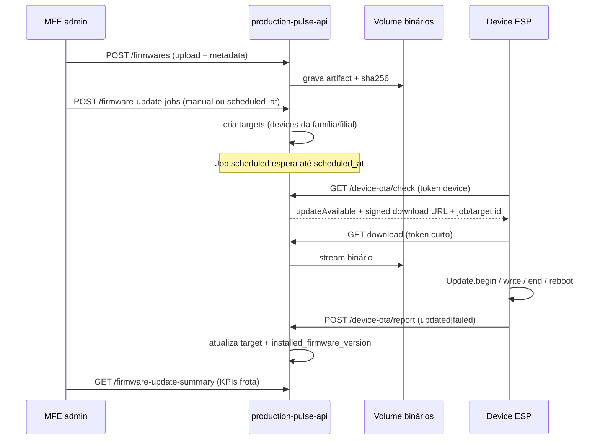

# P4 — Firmware OTA (gestão de frota ESP)

> **Status:** especificação (set/2026) — **não implementado**  
> **Roadmap:** [ROADMAP.md § P4](./ROADMAP.md#p4--firmware-ota-gestão-de-frota)  
> **Motivação (produto):** atualizar ESPs pela rede, sem notebook/USB por máquina; cadastro de firmwares por tipo; disparo manual ou agenda; painel de frota (atualizados / atualizando / falha).  
> **Bounded context:** só `production-pulse-api` + MFE Pulse + firmware ESP — **sem** api-delpi / Chat AI.

---

## 1. Leitura do pedido

| Item | Conteúdo |
|------|----------|
| **Objetivo** | OTA (Over-the-Air) integrado ao Minha DELPI / Pulso de Produção: publicar firmware uma vez e atualizar N devices do mesmo tipo |
| **Subobjetivos** | Identidade + versão instalada por device; catálogo de firmwares por tipo; associação tipo → artefato; disparo ou agenda; KPIs de frota OTA |
| **Restrições** | Identificadores EN; backend autoriza; secrets/tokens nunca no MFE; migration nova imutável; pull preferível a push bruto |
| **Dependências** | Devices + `driver_key` / registry já existentes; `firmwareVersion` já reportado em `/api/status` do contador ref.; `firmware_source` atual = sketch texto (ver §3 — **não** substitui OTA) |
| **Aceite** | Spec + schema + rotas + regras R52+ aprovados; implementação segue ROADMAP P4.S* |

---

## 2. Evidências vs hipóteses

| Achado | Estado |
|--------|--------|
| Contador ref. já expõe `firmwareVersion` em `/api/status` | CONFIRMADO_EM_DOCUMENTACAO_CANONICA (`firmware/esp8266_counter_v1/README.md`) |
| Coluna `devices.firmware_source` guarda sketch `.ino` para cópia no detalhe | CONFIRMADO_NO_CODIGO (`V006__device_firmware_source.sql`) — **não** é canal OTA |
| `driver_key` + registry tipam protocolo/métricas/comandos | CONFIRMADO_NO_CODIGO |
| Endpoint ESP de download OTA / `Update` Arduino | AUSENTE no sketch atual — **HIPOTESE_A_VALIDAR** na implementação firmware |
| Escala ~100 devices / VLAN industrial | INFERENCIA de produto — desenho assume frota multi-device |

---

## 3. O que já existe (não confundir)

| Conceito hoje | Papel | Relação com P4 |
|---------------|-------|----------------|
| `driver_key` | Protocolo HTTP + métricas + `operatorSurface` | **Permanece** — OTA amarra artefato ao **mesmo** `driver_key` (ou `firmware_family` 1:1 no MVP) |
| `controller_code` | ID estável do chip | Identidade do device na frota |
| `firmware_source` | Texto do `.ino` no Postgres | Continua opcional para auditoria/cópia; **binário OTA** vive em storage + tabela `firmwares` |
| Probe/poll | Lê `firmwareVersion` do status | P4 **persiste** versão instalada reportada e compara com alvo |

---

## 4. Decisões travadas

| Tema | Decisão |
|------|---------|
| Arquitetura OTA | **Pull autorizado:** ESP consulta a API (ou URL assinada) e baixa quando houver update **autorizado** — Minha DELPI **não** faz push TCP bruto do binário para a LAN |
| Orquestração | API registra **campanha** (`firmware_update_jobs`); device só aplica se job `pending`/`scheduled` no seu escopo **ou** política `auto_when_newer` explícita por família |
| Disparo | Dois modos: **manual** (botão «Atualizar frota / device») e **agendado** (`scheduled_at`) — mesmo modelo de job |
| Tabela canônica | `firmwares` (catálogo versionado de artefatos) + `firmware_update_jobs` (campanhas) + `firmware_update_targets` (por device) |
| Tipo de device | Alinhado a `driver_key` / família (`firmware_family`) — exemplos de produto: leitor de ciclo, sensor externo, temp/umidade, relé → cada um = família + driver |
| Storage do binário | Volume persistente da API (mesmo padrão de uploads do monorepo) + metadata em Postgres; URL de download **assinada / tokenizada** e de curta validade |
| Auth download | Device autentica com `X-Device-Token` (já usado no firmware) + job id / artifact token — **não** JWT de usuário no chip |
| RBAC | Publicar/disparar OTA = `production-pulse.devices.manage` (ou `.admin`); ver status = `devices.view`; operador **não** dispara OTA |
| Compatibilidade | Semântica version (`semver`); `min_hardware_rev` opcional; recusar downgrade salvo flag `allow_downgrade` |
| Idioma contrato | EN: `firmwareKey`, `version`, `artifactSha256`, `updateStatus`, `scheduledAt` |
| Chat / api-delpi | Fora — OTA é domínio Pulse |

---

## 5. Modelo de dados (alvo)

### `firmwares`

Catálogo: **uma linha = uma versão publicada** de uma família.

| Coluna | Tipo | Notas |
|--------|------|-------|
| `id` | `uuid` PK | |
| `firmware_key` | `varchar(64)` | Estável — ex.: `machine_cycle_reader`, `temp_humidity_v1` (EN) |
| `driver_key` | `varchar(40)` | FK lógica ao registry — devices elegíveis |
| `version` | `varchar(32)` | Semver `1.3.0` |
| `display_name` | `varchar(120)` | Rótulo UI (PT ok) — «Leitor de máquina» |
| `artifact_path` | `text` | Path no volume (não URL pública crua) |
| `artifact_sha256` | `char(64)` | Integridade |
| `artifact_size_bytes` | `bigint` | |
| `release_notes` | `text` | Opcional |
| `min_compatible_version` | `varchar(32)` | Opcional — bloqueia salto inseguro |
| `published_at` | `timestamptz` | Null = rascunho |
| `created_by` / `created_at` | … | |

**Unique:** `(firmware_key, version)`.

### `devices` — colunas OTA (migration nova)

| Coluna | Tipo | Notas |
|--------|------|-------|
| `firmware_key` | `varchar(64)` | Família associada (default = derivada do `driver_key`) |
| `installed_firmware_version` | `varchar(32)` | Última reportada pelo chip |
| `target_firmware_version` | `varchar(32)` | Alvo desejado (nullable = seguir última publicada da família) |
| `firmware_reported_at` | `timestamptz` | Quando o status reportou a versão |

`firmware_source` (sketch) **permanece** independente.

### `firmware_update_jobs`

Campanha (manual ou agendada).

| Coluna | Tipo | Notas |
|--------|------|-------|
| `id` | `uuid` PK | |
| `firmware_id` | `uuid` FK → `firmwares` | Artefato alvo |
| `branch` | `varchar(2)` | Escopo filial |
| `trigger` | `varchar(20)` | `manual` \| `scheduled` |
| `scheduled_at` | `timestamptz` | Obrigatório se `scheduled` |
| `status` | `varchar(20)` | `draft` \| `scheduled` \| `running` \| `completed` \| `cancelled` \| `failed` |
| `filter` | `jsonb` | Ex.: `{ "firmwareKey", "deviceIds?", "onlyOutdated": true }` |
| `created_by` / timestamps | … | |

### `firmware_update_targets`

Uma linha por device na campanha.

| Coluna | Tipo | Notas |
|--------|------|-------|
| `id` | `uuid` PK | |
| `job_id` | `uuid` FK | |
| `device_id` | `uuid` FK | |
| `status` | `varchar(20)` | `pending` \| `authorized` \| `downloading` \| `applying` \| `updated` \| `failed` \| `skipped` |
| `from_version` / `to_version` | `varchar(32)` | |
| `error_code` | `varchar(64)` | Código EN; mensagem PT via content JSON |
| `authorized_at` / `started_at` / `finished_at` | `timestamptz` | |

**Índices:** `(job_id, status)`, `(device_id, status)` partial WHERE open.

---

## 6. Fluxo canônico



**Por que pull:** o chip controla janela de escrita flash; a API só **autoriza** e serve artefato; falha de rede não deixa a API “empurrando” TCP longo na VLAN.

---

## 7. Contrato HTTP (planejado)

### Admin (JWT + `X-Delpi-Caller-App`)

| Método | Path | Permissão | Efeito |
|--------|------|-----------|--------|
| `GET` | `/firmwares` | `devices.view` | Lista catálogo (filtro `firmwareKey`, `driverKey`) |
| `POST` | `/firmwares` | `devices.manage` | Publica versão (multipart ou upload pré-assinado) |
| `GET` | `/firmwares/{id}` | `devices.view` | Detalhe + sha |
| `GET` | `/firmware-update-jobs` | `devices.view` | Campanhas |
| `POST` | `/firmware-update-jobs` | `devices.manage` | Cria job `manual` ou `scheduled` |
| `POST` | `/firmware-update-jobs/{id}/cancel` | `devices.manage` | Cancela pendentes |
| `GET` | `/firmware-update-jobs/{id}/targets` | `devices.view` | Status por device |
| `GET` | `/firmware-update-summary` | `devices.view` | KPIs: total, updated, updating, failed (escopo filial + família) |
| *(enrich)* | `GET /devices`, detalhe | `devices.view` | Inclui `installedFirmwareVersion`, `targetFirmwareVersion`, `firmwareKey`, `updateStatus` |

### Device channel (token de device — **sem** JWT usuário)

| Método | Path | Auth | Efeito |
|--------|------|------|--------|
| `GET` | `/device-ota/check` | `X-Device-Token` + identidade (`controllerCode` / device id) | Se há target autorizado → metadata + URL assinada |
| `GET` | `/device-ota/artifacts/{artifactToken}` | token curto one-time/TTL | Stream binário |
| `POST` | `/device-ota/report` | `X-Device-Token` | `updated` / `failed` + `errorCode` |

Paths EN kebab-case sob `/apps/production-pulse-api`.

---

## 8. Regras de negócio (R52+)

| Id | Regra |
|----|--------|
| **R52** | Artefato OTA só é servido se existir `firmware_update_targets.status ∈ {authorized, downloading, applying}` **ou** política explícita documentada; publish sozinho **não** libera download. |
| **R53** | Job `scheduled` só autoriza targets quando `now >= scheduled_at` e status do job → `running`. |
| **R54** | Disparo manual: botão cria job `trigger=manual` e autoriza targets imediatamente (ou após confirmação UI). |
| **R55** | Um device tem no máximo **um** target OTA aberto (`pending|authorized|downloading|applying`). |
| **R56** | `installed_firmware_version` atualiza só via report do device ou probe/status confiável — MFE não inventa versão. |
| **R57** | KPIs do summary: `updated` = installed == target publicado da campanha; `updating` = downloading/applying; `failed` = failed na janela da campanha. |
| **R58** | Download exige `artifact_sha256` verificado no chip quando o firmware implementar check; API sempre envia sha no check. |
| **R59** | `firmware_source` (texto) **não** participa do pipeline OTA. |
| **R60** | Família nova = novo `firmware_key` + entrada registry/`driver_key` — sem hardcode de tipo no MFE. |

---

## 9. UI (MFE) — o que documentar na implementação

| Superfície | Conteúdo |
|------------|----------|
| Painel / KPIs OTA | Total · Atualizados · Atualizando · Falha (WF novo ou strip no painel) |
| Catálogo Firmwares | Lista por família/versão; upload; notas |
| Detalhe device | Versão instalada × disponível; botão «Atualizar este device» |
| Campanhas | Criar (agora / agendar); progresso por target; cancelar |
| Helps | `PP_HELP` novas chaves — sync Ajuda obrigatório (`feature-help-sync`) |

Wireframes ASCII: incluir em [WIREFRAMES.md](./WIREFRAMES.md) na subetapa P4.S5 (admin), não nesta spec isolada.

Exemplo de card de frota (produto):

```text
Total de dispositivos: 100
Atualizados: 96
Atualizando: 2
Falha na atualização: 2
```

Exemplo de associação (produto → contrato EN):

```text
Device: NODE-023          → controllerCode / name
Tipo: Leitor de máquina   → firmwareKey + displayName (+ driverKey)
Firmware associado: …     → firmwareKey
Versão instalada: 1.2.0   → installedFirmwareVersion
Versão disponível: 1.3.0  → latest published / targetFirmwareVersion
```

---

## 10. Firmware ESP (obrigatório no P4)

Além da API/MFE:

1. Endpoint de check periódico (intervalo conservador, ex. 5–15 min; backoff em falha).
2. Download + `ESP8266HTTPUpdate` / `Update` com verificação de tamanho/sha quando viável.
3. Report de sucesso/falha **antes** e/ou após reboot (estratégia dual: report pré-reboot + versão no próximo `/api/status`).
4. Não aplicar OTA se bateria/heap críticos (quando aplicável); respeitar token.
5. Documentar no README do sketch — **sem** embutir URL de produção hardcoded; base URL configurável (EEPROM/`POST /api/config`).

Sketch atual do contador **não** tem OTA — P4.S6 é a entrega de firmware.

---

## 11. Matriz de fluxos

| Fluxo | Superfície | Caminho | P4 | Fora |
|-------|------------|---------|----|------|
| Publicar binário | Admin | `POST /firmwares` | sim | — |
| Disparo agora | Admin botão | job `manual` | sim | — |
| Agenda | Admin | job `scheduled` | sim | cron externo |
| Check + download | ESP | `/device-ota/*` | sim | push TCP |
| KPI frota | Painel | `/firmware-update-summary` | sim | — |
| Auto sem campanha | — | — | opcional P4b | default off no MVP |
| OTA pelo Chat | — | — | — | sim |
| Assinatura criptográfica de fabricante | — | — | P4b | MVP usa sha256 + token |

---

## 12. Fora do escopo (P4)

- Push UDP/MQTT “force flash” sem consentimento do chip  
- Store em S3 obrigatório (volume local da API basta no MVP)  
- Code signing com PKI corporativa (pode ser P4b)  
- Atualização via cabo/USB orquestrada pela UI  
- Substituir `driver_key` / registry por “tipo” paralelo em português  
- Chat AI como canal de disparo  

---

## 13. Critérios de pronto (pacote)

- [ ] Tables `firmwares`, jobs, targets + colunas OTA em `devices`  
- [ ] Upload + check + download + report ponta a ponta em lab  
- [ ] Botão disparo + job agendado cobertos por teste  
- [ ] Summary KPIs coerentes com targets  
- [ ] RBAC manage vs view  
- [ ] Helps + WIREFRAMES admin OTA  
- [ ] Contador (ou device lab) aplica 1.x → 1.y sem USB  
- [ ] Regras R52–R60 no canônico de rotas  

---

## 14. Referências

- [ROADMAP.md](./ROADMAP.md) § P4  
- [SCHEMA.md](./SCHEMA.md) (entidades OTA)  
- [API-ROUTES-AND-BUSINESS-RULES.md](./API-ROUTES-AND-BUSINESS-RULES.md)  
- [DEVICE-DRIVERS.md](./DEVICE-DRIVERS.md)  
- [firmware/esp8266_counter_v1/README.md](./firmware/esp8266_counter_v1/README.md)  
- ADR-002 (LAN / poll) — OTA usa o mesmo princípio: API alcança VLAN; device puxa artefato  
