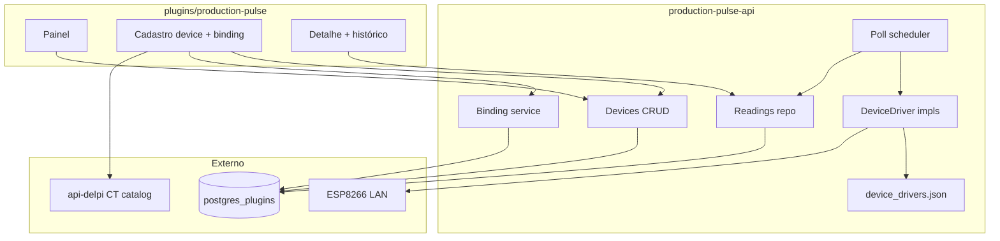
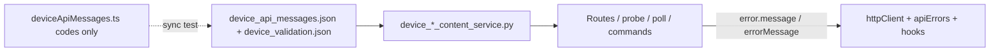
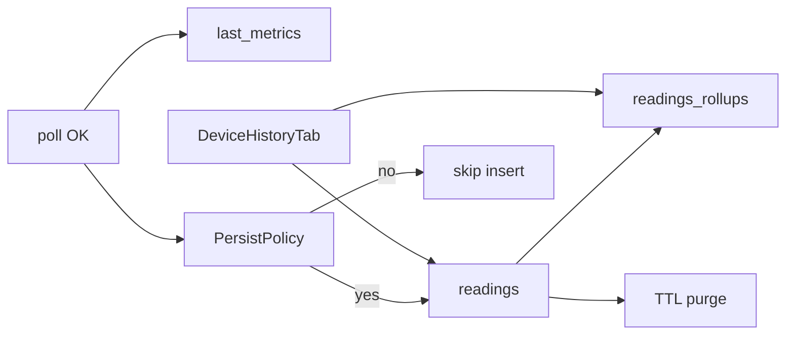

# Roadmap — Production Pulse

> **Status:** implementado em dev (set/2026) — **homologação live E6.S2 pendente** (ESP `192.168.20.2` / VLAN)  
> **Escopo:** `production-pulse-api` + `plugins/production-pulse`  
> **Piloto:** ESP8266 em `192.168.20.2`

---

## Estado da execução (set/2026)

| Etapa | Status | Evidência |
|-------|--------|-----------|
| E1 — Fundação API + infra | ✅ Feito | health via gateway; compose + `network_mode: host` |
| E2 — CRUD + binding + catálogo CT | ✅ Feito | pytest CRUD/binding; proxy work-centers |
| E3 — Drivers + leituras + scheduler | ✅ Feito | counter + gauge; test-probe; scheduler |
| E4 — RBAC | ✅ Feito | `test_permissions.py`; ADR-003 |
| E5 — MFE (painel, form, detalhe, operador) | ✅ Feito | vitest + build; remoteEntry 200 |
| E6.S1 — Docs + smoke | ✅ Feito | `check-production-pulse.sh` 8/8 OK |
| **E6.S2 — Verify live ESP piloto** | ⏳ **Pendente** | WSL não alcança `192.168.20.2`; checklist UI §3–5 |
| P1 (gauge, KPI delta, reset HW, thresholds) | ✅ Feito | commits em `main` pós-MVP |
| **E7 — Alinhamento `.cursor` (conteúdo + kit)** | ✅ **Concluído** | E7.S0–S5 em `main` |
| **E8 — Layout responsivo (formulários + superfícies)** | 🔄 **Em curso** | E8.S0–S3 ✅ commit `11378d221`; S4 verify pendente |
| **P3 — Persistência telemetria (mercado)** | 📋 **Especificado** | [TELEMETRY-PERSISTENCE-P3.md](./TELEMETRY-PERSISTENCE-P3.md) — R46–R51; implementação pendente |

Smoke dev: `bash ./scripts/homologacao/check-production-pulse.sh`  
Live (quando na VLAN): `PP_LIVE_ESP=1 PP_LIVE_ESP_IP=192.168.20.2 bash ./scripts/homologacao/check-production-pulse.sh` — ver [HOMOLOGACAO-E6-S2.md](./HOMOLOGACAO-E6-S2.md).

**E7.S0 entregue (set/2026):** poll/live 422 + `device_api_messages.json`; test-probe `errorMessage`; HTTP 404/409 no JSON; MFE `resolveDeviceActionError` — commits `56c3c7606`, `4c7a3fe13`.

**E7.S1 entregue (set/2026):** `commandErrors` + `validationErrors` no JSON; `ContentCodedError`; comandos/validação HTTP via loader; drivers retornam `error_code` — commit `1c91f052d`.

**E7.S2 entregue (set/2026):** `DeviceDriverError` code-first; HTTP compartilhado em `device_http_support`; `last_error` grava código; mensagem PT só no boundary JSON — commit `d7e6675fa`.

**E7.S3 entregue (set/2026):** `device_validation_content.json` + loader API; MFE `deviceValidationContent.ts` com sync test; formulário consome limites/regex/mensagens do JSON — commit `c02aee745`.

**E7.S4 entregue (set/2026):** `PpHostContainedDialog` + migração de modais; teste estrutural anti-ModalShell — commit `98e58f0a6`.

**E7.S5 entregue (set/2026):** `SegmentToggle` width/column no kit; toolbar filtros via `filterToolbarRowBemClasses`; zero `.delpi-ui-*` no `index.css` do MFE; teste estrutural — commit `d645243f5`.

**E8.S0–S3 entregue (set/2026):** tokens viewport + `data-pp-viewport`; form grade 2 col + footer sticky compact; painel/detalhe/operador responsive — commit `11378d221`.

**E8.S1+ (form kit):** `ppFormFields.tsx` + `createDashboardNativeFormFields`; cadastro 2 col desktop (1200px); CT via busca+select TOTVS — commit `2c15a1491`.

---

## E8 — Layout responsivo (formulários + superfícies)

Complementa E5 (wireframes WF-PP-01/02/03/OP). Objetivo: **todas as páginas** legíveis em mobile (≤768px), tablet (769–1100px) e desktop — formulários com grade, touch targets e footers sticky onde couber.

### Decisões travadas (E8)

| Tema | Decisão |
|------|---------|
| Breakpoints | Mobile ≤768 · tablet ≤1100 · desktop >1100 — `resolveViewportBucket` + `data-pp-viewport` no shell |
| Form cadastro | `max-width: 720px`; grade 2 col (nome+filial, poll+ativo) ≥769px; footer sticky mobile+tablet |
| Campos compact | `min-height: 44px`, `font-size: 16px` em inputs ≤1100px (evita zoom iOS) |
| Painel | KPI 4→2→1 col; tabela compacta tablet; cards só mobile |
| Detalhe | Overview 2 col ≥901px; hero actions empilhadas mobile; nav horizontal scroll |
| Operador | Hub filtros coluna ≤600px; grid 1→2→3→4 col por breakpoint |
| CSS kit | Sem override `.delpi-ui-*` — só tokens `--pp-*` e seletores `.pp-*` |

### Matriz de fluxos (E8)

| Fluxo | Superfície | Caminho | E8 |
|-------|------------|---------|-----|
| Cadastro device + binding | Form | `DeviceFormPage` | S1 |
| Filtros histórico | Detalhe aba history | `DeviceHistoryTab` | S2 |
| Hero ações poll/editar | Detalhe | `DeviceDetailPage` | S2 |
| Lista painel | Painel | `PanelPage` | S2 |
| Hub operador filtros | Tablet | `OperatorPlacementHub` | S3 |
| Contador / gauge | Tablet | `CounterPadSurface`, `GaugeReadoutSurface` | S3 + **S5** (WF-PP-OP-08 shell) |

### Etapas

#### E8.S0 — Tokens viewport + shell ✅

- **Objetivo:** Uma fonte de breakpoints e `data-pp-viewport` no root do MFE.
- **Fazer:** `--pp-form-max-width`, `--pp-breakpoint-*` em `index.css`; `App.tsx` + `viewportLayout.ts` + testes.
- **Pronto quando:** vitest `viewportLayout.test.ts` verde; grep `data-pp-viewport` no shell.

#### E8.S1 — Formulário cadastro (WF-PP-02) ✅

- **Objetivo:** Grade 2 col desktop/tablet; sticky footer compact; IP row + teste full-width ≤1100px.
- **Fazer:** `DeviceForm.tsx` (`pp-form-grid--pair`); `DeviceBindingSection` TOTVS pair; `DeviceFormPage` `isCompactViewport`.
- **Pronto quando:** form legível ≤768px e max-w 720px tablet; teste estrutural cadastro.

#### E8.S2 — Painel + detalhe (WF-PP-01/03) ✅

- **Objetivo:** Hero detalhe, nav abas, filtros histórico e painel adaptados a mobile/tablet.
- **Fazer:** CSS `pp-panel-page`, `pp-device-detail__hero-actions`, `pp-detail-history__filters`; helpers `isMobileViewport` nos tabs.
- **Pronto quando:** vitest estrutural + build MFE; sem regressão KPI/tablet compact table.

#### E8.S3 — Operador hub (WF-PP-OP) ✅

- **Objetivo:** Filtros hub empilham em celular; toggles largura total.
- **Fazer:** CSS `pp-operator-hub__filters` ≤600px; herda grid cards E5.
- **Pronto quando:** hub 1 col mobile · 2–3 col tablet (grid existente).

#### E8.S5 — Superfícies operador responsivas (WF-PP-OP-08) ✅

- **Objetivo:** Contador e gauge legíveis em mobile, tablet e desktop — shell flex, pad CSS grid, gauge 2 col ≥901px.
- **Fazer:** `CounterPadSurface` markup único + `pp-counter-pad__workspace`; tokens `--pp-operator-content-max` por `data-pp-viewport`; wireframe WF-PP-OP-08.
- **Pronto quando:** vitest estrutural OP-08; build MFE; pad empilhado ≤768px sem branch TS.

#### E8.S4 — Verify visual + homologação tablet ⏳

- **Objetivo:** Checklist manual WF-PP em 375px / 768px / 1024px antes de E6.S2 live.
- **Fazer:** Rodar `npm test && npm run build`; smoke portal dev; anotar pass/fail em HOMOLOGACAO-E6-S2 § UI.
- **Pronto quando:** checklist tablet preenchido ou issues abertas documentadas.
- **Commit:** só se fix de regressão visual.

### Critérios de pronto (E8)

- [x] E8.S0 — tokens + `data-pp-viewport`
- [x] E8.S1 — form grade + footer compact
- [x] E8.S2 — painel + detalhe responsive
- [x] E8.S3 — operador hub filtros mobile
- [x] E8.S5 — superfícies operador responsivas (WF-PP-OP-08)
- [ ] E8.S4 — verify visual tablet (pré E6.S2 live)

### Fora do escopo (E8)

- Modo quiosque fullscreen (`?kiosk=1`) — ADR-001 P1
- Rename `FilialSwitcher` → EN
- Breakpoints diferentes do resto do Portal (1100px alinhado a maintenance/controle-retrabalhos)

### Protocolo de execução (E8)

E8.S0–S3 = **um commit** com escopo responsive (testes incluídos). E8.S4 = verify-only; commit só se fix.

---

## Decisões travadas

| Tema | Decisão |
|------|---------|
| Nome | `production-pulse` / `production-pulse-api` |
| CT ↔ dispositivo | **Âncora flexível** — `anchor_type`: CT, máquina, equipamento, área, avulso; CT TOTVS **opcional** |
| Online/offline | Grace **2× poll_interval** (min 60 s, max 600 s) — [ADR-002](./ADR-002-poll-scheduler-and-lan.md) |
| Teste conexão create | **`POST /devices/test-probe`** antes do save — [ADR-002](./ADR-002-poll-scheduler-and-lan.md) |
| Scheduler | Per-device `next_poll_at` + jitter ±10% + semáforo 10 — [ADR-002](./ADR-002-poll-scheduler-and-lan.md) |
| LAN Docker dev | `network_mode: host` no `production-pulse-api` — [ADR-002](./ADR-002-poll-scheduler-and-lan.md) |
| RBAC operador | `operator` basta para comandos na rota operador — [ADR-003](./ADR-003-rbac-mvp.md) |
| Rotas legado | MFE/BFF redirect **308** — canônico `placement_key` — [ADR-004](./ADR-004-routes-and-legacy-aliases.md) |
| Filial no hero | **`FilialSwitcher`** (padrão maintenance) — não ScopeChipBar no MVP |
| Cardinalidade | 1 device → 1 binding; 1 âncora → N devices |
| CRUD | Completo na API desde MVP |
| RBAC | Estrutura manifest + gates na API; matriz fina na Fase 4 |
| Histórico | Tabela `readings` + poll background — **P3** evolui para persistência seletiva + rollups + retenção ([TELEMETRY-PERSISTENCE-P3.md](./TELEMETRY-PERSISTENCE-P3.md)) |
| TOTVS | Lookup CT via gateway api-delpi — **sem** SQL no BFF |
| MFE | Module Federation + `preparePluginUiRemote()` |
| Driver | Registry JSON + port `DeviceDriver`; MVP `esp8266_counter_v1` |
| Leituras | `metrics` JSONB genérico — contador, rotação, temperatura, … |
| Papéis | `role_key` derivado do driver (`pulse_counter`, `process_gauge`, …) |
| Operador | Superfície UI por `operatorSurface` — contador MVP; gauge P1 ✅ |

---

## Matriz de fluxos

| Fluxo | Superfície | Caminho | Prioridade |
|-------|------------|---------|------------|
| Listar dispositivos | Painel | `GET /devices` | P0 |
| Filtrar/agrupar por CT | Painel | `GET /devices?workCenter=` ou vista agrupada | P0 |
| Cadastrar dispositivo | Form | `POST /devices` + `driver_key` | P0 |
| Escolher driver / papel | Form | `GET /catalog/drivers` | P0 |
| Filtrar por papel | Painel | `GET /devices?role=` | P0 |
| Amarrar objeto (CT/máq/equip.) | Form binding | `PUT /devices/{id}/binding` + `anchor_type` | P0 |
| Poll automático | API background | scheduler → driver → `readings` | P0 |
| Poll manual | Painel / detalhe | `POST /devices/{id}/poll` | P0 |
| Contador ao vivo | Detalhe | `GET /devices/{id}/live` | P0 |
| Histórico gráfico/tabela | Detalhe | `GET /devices/{id}/readings` | P0 |
| Reset remoto | Detalhe | `POST .../commands/reset` | P0 |
| Autocomplete CT | Form | `GET /catalog/work-centers` | P0 |
| Testar conexão | Form | `POST /devices/test-probe` (novo) · `POST /devices/{id}/test` (edit) | P0 |
| Hub operador (placements) | Tablet | `GET /operator/placements` | P0 |
| Superfície contador | Tablet | `counter_pad` + commands | P0 |
| Superfície sensor | Tablet | `gauge_readout` read-only | P1 ✅ |
| Comando capability-gated | API | 422 se driver não suporta | P0 |
| RBAC filial | API + menu | manifest + `branch_access` | P0 |
| Delta turno/dia KPI (contador) | Painel | agregação `delta_metrics.counter` | P1 ✅ |
| Driver gauge ESP8266 | API + tablet | `esp8266_gauge_v1` + WF-PP-OP-GAUGE | P1 ✅ |
| Detecção reset hardware | readings | meta `counter_reset` | P1 ✅ |
| Cockpit PCP embed | production-control | HTTP entre BFFs | Fora |

---

## Diagrama

---

## E1 — Fundação API + schema

#### E1.S1 — Scaffold production-pulse-api

- **Objetivo:** API sobe com health, migrations e auth JWT.
- **Fazer:**
  1. Copiar esqueleto de `travel-expenses-api/` → `production-pulse-api/`
  2. Pacote `production_pulse_app/`, `main.py`, `config.py`, middleware auth
  3. `migrations/V001__create_production_pulse_schema.sql` (ver [SCHEMA.md](./SCHEMA.md))
  4. `GET /health`
- **Não fazer:** rotas de domínio ainda; chamar api-delpi do MFE.
- **Teste:** `pytest production-pulse-api/tests/test_health.py -q`
- **Pronto quando:** container `delpi-production-pulse-api` responde health via gateway.
- **Commit:** `feat(production-pulse): fundação da API dedicada`

#### E1.S2 — Infra + gateway

- **Objetivo:** Compose e nginx roteiam `/apps/production-pulse-api/`.
- **Fazer:**
  1. Serviços em `infra/docker-compose.dev.yml` + prod
  2. **`network_mode: host`** no `production-pulse-api` (dev) — [ADR-002](./ADR-002-poll-scheduler-and-lan.md)
  3. `gateway/nginx.conf` + `nginx.dev.conf`
  4. `infra/env.production-pulse.example` (`PP_POLL_MAX_CONCURRENT`, grace envs)
  5. Entrada em `up-dev-sequential.sh` / `up-prod-sequential.sh` (fase `api`)
- **Teste:** `curl -s http://localhost/apps/production-pulse-api/health`
- **Pronto quando:** health 200 via gateway.
- **Commit:** `chore(infra): production-pulse-api no compose e gateway`

---

## E2 — Domínio dispositivos + binding

#### E2.S1 — CRUD devices

- **Objetivo:** CRUD completo de dispositivos.
- **Fazer:** repository + use cases + routes `GET/POST/GET/PUT/PATCH/DELETE /devices`
- **Teste:** `pytest production-pulse-api/tests/test_devices_crud.py -q`
- **Pronto quando:** round-trip JSON com filial e IP.
- **Commit:** `feat(production-pulse): CRUD de dispositivos IoT`

#### E2.S2 — Binding com anchor_type

- **Objetivo:** Amarração N devices → mesma âncora (CT, máquina, equipamento, …).
- **Fazer:** `device_bindings` com `anchor_type`, `placement_label`, campos condicionais; validação R27–R32; histórico `effective_to`
- **Teste:** ventilador `equipment` sem CT OK; `work_center` sem CT → 422; dois devices mesma máquina OK
- **Commit:** `feat(production-pulse): amarração flexível por tipo de objeto`

#### E2.S3 — Catálogo work-centers (proxy TOTVS / SHB010)

- **Objetivo:** Autocomplete de CT no cadastro — **todos** os centros cadastrados no Protheus da filial.
- **Fazer:** gateway HTTP → api-delpi **`GET /production/appointments/work-centers`** (`list_production_appointment_work_centers`) — **não** machine-load (só CTs com OP alocada). Ver [INTEGRATIONS-TOTVS.md](./INTEGRATIONS-TOTVS.md).
- **Fazer:** `GET /catalog/work-centers?branch=&search=` no BFF; validação CT no `PUT /binding`; cache TTL opcional.
- **Teste:** mock gateway + smoke com JWT; CT inexistente → 422 no binding.
- **Pronto quando:** MFE autocomplete lista CT da SHB010 via BFF.
- **Commit:** `feat(production-pulse): catálogo de centros de trabalho via api-delpi`

---

## E3 — Registry de drivers + leituras

#### E3.S0 — Registry + port DeviceDriver

- **Objetivo:** Catálogo declarativo de drivers (métricas, comandos, superfície operador).
- **Fazer:** `device_drivers.json`, `DeviceDriverRegistryService`, port domain `DeviceDriver`, `GET /catalog/drivers`; schema `role_key`, `last_metrics`, `readings.metrics`
- **Teste:** registry carrega; POST device com driver inválido → 422; capabilities expostas no GET device
- **Pronto quando:** trocar driver no JSON adiciona entrada sem migration SQL
- **Commit:** `feat(production-pulse): registry de drivers e leituras genéricas`

#### E3.S1 — Driver esp8266_counter_v1

- **Objetivo:** Ler golpes e enviar increment/decrement/reset ao IP LAN.
- **Fazer:** impl HTTP GET `/api/contador`, POST reset/increment/decrement; normaliza `metrics.counter`
- **Teste:** unit mock; opcional live `192.168.20.2`
- **Pronto quando:** driver retorna `{ metrics: { counter: int } }` ou erro timeout
- **Commit:** `feat(production-pulse): driver ESP8266 contador de golpes`

#### E3.S2 — Readings + poll manual + test-probe

- **Objetivo:** Histórico, poll manual, test-probe pré-save, status online/offline.
- **Fazer:** `readings` repo; **`POST /devices/test-probe`**; `POST /devices/{id}/poll`; `GET /live`; `GET /readings`; `DeviceConnectivityStatusService` (R9–R12) — [ADR-002](./ADR-002-poll-scheduler-and-lan.md)
- **Teste:** delta contador; test-probe não grava reading; grace 2× interval
- **Pronto quando:** painel KPI online/offline alinhado a `last_seen_at`.
- **Commit:** `feat(production-pulse): leituras, test-probe e conectividade`

#### E3.S3 — Scheduler + comandos auditados

- **Objetivo:** Poll automático per-device + comandos capability-gated.
- **Fazer:** `DevicePollSchedulerService` (jitter, semáforo); `POST /commands/{key}`; `device_commands`; Compose dev **`network_mode: host`** — [ADR-002](./ADR-002-poll-scheduler-and-lan.md)
- **Teste:** increment gauge → 422; reset → audit; scheduler skip in-flight
- **Pronto quando:** `last_seen_at` atualiza no intervalo; `curl` LAN ok from container.
- **Commit:** `feat(production-pulse): scheduler de poll e auditoria de comandos`

---

## E4 — RBAC

#### E4.S1 — Permissões manifest + gates API

- **Objetivo:** Matriz MVP [ADR-003](./ADR-003-rbac-mvp.md) ligada nas rotas.
- **Fazer:**
  1. `production-pulse.manifest.json` com permissões
  2. `production_pulse_permissions.py` (padrão travel-expenses)
  3. Gates por rota + `branch_access` middleware
- **Teste:** `test_permissions.py` — operador comanda sem `devices.view`; viewer não comanda; 403 filial
- **Pronto quando:** matriz ADR-003 coberta por testes.
- **Commit:** `feat(production-pulse): RBAC por filial e ação`

---

## E5 — Plugin MFE

#### E5.S1 — Scaffold MF federado

- **Objetivo:** Plugin carrega no Portal.
- **Fazer:** checklist `novo-plugin-mfe-checklist.md`, manifest, register script, tokens `index.css` (ver [DESIGN-FRONTEND.md](./DESIGN-FRONTEND.md))
- **Teste:** `npm run build`; curl `remoteEntry.js`
- **Pronto quando:** tile vazio abre sem erro MF.
- **Commit:** `feat(production-pulse): scaffold MFE federado`

#### E5.S2 — Painel operacional (WF-PP-01)

- **Objetivo:** Lista + vista agrupada por CT, KPI strip, filtros URL-sync.
- **Fazer:** `PanelPage`, `DeviceKpiStrip`, `DeviceFiltersBar`, `DeviceTable`, `DeviceGroupedByWorkCenter`, **`DeviceCard` mobile** — wireframes WF-PP-01 + **WF-PP-01 mobile**
- **Teste:** vitest parse URL + contrato API mock; viewport ≤768 (cards); **769–1100 (KPI 2×2, tabela compacta)**
- **Pronto quando:** lista reflete API; toggle agrupado; empty/loading/error; mobile cards + **tablet compact table**
- **Commit:** `feat(production-pulse): painel operacional com vista por CT`

#### E5.S3 — Cadastro + amarração (WF-PP-02)

- **Objetivo:** Form create/edit, test connection, binding CT autocomplete.
- **Fazer:** `DeviceFormPage`, `DeviceBindingSection`, modais test, **sticky footer + segmented vertical mobile** — wireframes WF-PP-02 + mobile
- **Pronto quando:** cadastrar `192.168.20.2` e amarrar CT de teste; form usável em ≤768px e **max-w 720px em tablet**
- **Commit:** `feat(production-pulse): cadastro de dispositivo e vínculo com CT`

#### E5.S4 — Detalhe abas (WF-PP-03 + WF-PP-04)

- **Objetivo:** Overview + histórico gráfico/tabela + auditoria comandos + modal reset.
- **Fazer:** `DeviceDetailPage`, `UnderlineNav`, charts, modals, **`ReadingCard` / hero stack mobile** — wireframes WF-PP-03/04 + mobile
- **Pronto quando:** gráfico deltas; aba comandos; reset com confirmação; 3 abas legíveis em mobile; **overview 2 col ≥901px tablet**
- **Commit:** `feat(production-pulse): detalhe do dispositivo com histórico e comandos`

#### E5.S5 — Modo operador (hub + picker + superfícies)

- **Objetivo:** Jornada tablet: hub CT → picker (badge papel) → `OperatorDeviceSurface` (contador MVP).
- **Fazer:** `OperatorPlacementHub`, `OperatorDevicePicker`, `OperatorDeviceSurface`, `CounterPadSurface`, stub `GaugeReadoutSurface` (P1) — wireframes OP + **mobile hub/pick/gauge/contador portrait**
- **API:** `GET /operator/placements`; `placement_key` no binding
- **Teste:** vitest hub meta; fluxo contador vs mock gauge; ≤600px pad empilhado; **769–1100 hub 2–3 col**
- **Pronto quando:** operador escolhe placement e abre superfície correta; hub 1 col celular · **2–3 col tablet landscape**
- **Commit:** `feat(production-pulse): modo operador com superfícies por tipo de device`

---

## E6 — Documentação + verify

#### E6.S1 — Docs + inventário + homologação

- **Objetivo:** Pacote documentado e smoke script.
- **Fazer:**
  1. `plugins/production-pulse/README.md`
  2. `production-pulse-api/README.md`
  3. Linha em `docs/08-plugins/README.md`
  4. `scripts/homologacao/check-production-pulse.sh` (remoteEntry + health + CRUD smoke)
- **Teste:** script homologação verde em dev
- **Pronto quando:** checklist plugins-documentation.mdc completo.
- **Commit:** `docs(production-pulse): README, inventário e smoke de homologação`
- **Status:** ✅ concluído — smoke dev verde (set/2026).

#### E6.S2 — Verify live com ESP8266 piloto

- **Objetivo:** Fluxo ponta a ponta com `192.168.20.2`.
- **Checklist:** [HOMOLOGACAO-E6-S2.md](./HOMOLOGACAO-E6-S2.md) — smoke `PP_LIVE_ESP=1`, cadastro UI, poll, histórico, operador.
- **Fazer:** rebuild sequencial plugin-ui → api → mfe; seguir checklist §3–5.
- **Pronto quando:** contador do device aparece no painel após poll; operador abre superfície contador.
- **Commit:** só se fix de regressão.
- **Status:** ⏳ **pendente** — implementação pronta; bloqueio atual: host dev (WSL) sem rota à VLAN `192.168.20.x` (`curl` ESP timeout). Executar homologação a partir de máquina na LAN ou com WSL roteando à VLAN industrial.

---

## E7 — Alinhamento diretrizes `.cursor` (pós-MVP)

Complementa entregas de erro HTTP (E7.S0 ✅). Objetivo: **zero copy PT duplicada** fora de JSON/loaders; **zero override de kit** no MFE; modais **host-contained**.

### Decisões travadas (E7)

| Tema | Decisão |
|------|---------|
| Mensagens PT ao usuário | `production_pulse_app/content/*.json` + loaders (`*_content_service.py`) — regra `assistant-content-json.mdc` |
| Códigos de erro device | Lista canônica em `device_api_messages.json` → `deviceConnectivity.codes`; MFE espelha só códigos em `content/deviceApiMessages.ts` + teste sync |
| Mensagem final na UI | **API** (`error.message` / `errorMessage` no probe); MFE classifica device vs infra, não remapeia texto |
| Validação form | Um JSON compartilhado (limites, regex IPv4, labels) — loader API + cópia/sync documentada no MFE |
| Modais aviso/confirm | `createHostContainedModalShell` — regra `mfe-modal-host-contained.mdc` |
| CSS `.delpi-ui-*` no MFE | Proibido — fix no `plugin-ui`, rebuild fase `remote` antes do MFE |
| Identificadores legado PT | `FilialSwitcher` / `filiais` mantidos até ADR de rename — **código novo** só EN |

### Matriz de fluxos (E7)

| Fluxo | Superfície | Caminho | E7 |
|-------|------------|---------|-----|
| Poll/live falha LAN | Painel / detalhe | 422 + `device_api_messages` | S0 ✅ |
| Test-probe offline | Form modal | `errorMessage` no payload 200 | S0 ✅ |
| Comando falha (timeout/rede) | Detalhe / operador | `CommandResult.errorMessage` via JSON | S1 |
| Validação IP/intervalo | Form | API 422 + MFE inline mesmo catálogo | S3 |
| Modal test reset/operador | Form / detalhe / tablet | Host-contained dialog | S4 |
| Toggle agrupado / segment | Painel WF-PP-01 | Kit `plugin-ui`, sem override MFE | S5 |

### Diagrama (conteúdo canônico)

---

#### E7.S0 — Erros HTTP device vs infra ✅

- **Objetivo:** Poll/live/test-probe não confundem falha de ESP com API indisponível.
- **Status:** ✅ `main` — `56c3c7606`, `4c7a3fe13`.
- **Pronto quando:** pytest content/probe; vitest `apiErrors` + sync codes; painel aviso amarelo em poll offline.

#### E7.S1 — Catálogo JSON: comandos + validação HTTP ✅

- **Objetivo:** Comandos e erros de domínio expostos ao usuário saem do JSON, não de strings nos drivers/services.
- **Status:** ✅ `main` — commit `1c91f052d`.
- **Pronto quando:** pytest command/content/validation; grep zero `"Comando não suportado"` em `device_command_service.py`; assert mensagem PT vem do JSON.

#### E7.S2 — Drivers HTTP: códigos only ✅

- **Objetivo:** Drivers LAN levantam `DeviceDriverError(code=…)`; texto amigável só no loader JSON (poll/probe/command boundary).
- **Status:** ✅ `main` — commit `d7e6675fa`.
- **Fazer:**
  1. `esp8266_counter_driver.py`, `esp8266_gauge_driver.py`, `device_http_support.py` — mensagens técnicas EN ou código-only; sem PT ao usuário
  2. Garantir todos os `code` usados ∈ `deviceConnectivity.codes` ou `commandErrors`
  3. Audit `last_error` / audit log — guardar code + optional technical detail (log), não copy PT duplicada
- **Não fazer:** `re.compile` novo em driver; mudar protocolo HTTP do ESP.
- **Teste:** `pytest production-pulse-api/tests/test_esp8266_* -q`; assert poll/probe mapeiam code → JSON message
- **Pronto quando:** grep zero strings PT com pontuação em `infrastructure/drivers/` (exceto comentários)
- **Commit:** `refactor(production-pulse): drivers LAN emitem códigos canônicos sem copy PT`

#### E7.S3 — Validação form API ↔ MFE (content compartilhado) ✅

- **Objetivo:** Regex IPv4, limites poll 0.5–300 e labels de erro idênticos API e MFE via JSON.
- **Status:** ✅ `main` — commit `c02aee745`.
- **Fazer:**
  1. Criar `device_validation_content.json` (+ loader API)
  2. Refatorar `device_validation_service.py` — limites/regex do JSON
  3. MFE: `content/deviceValidationContent.ts` gerado ou espelhado + teste sync (padrão `deviceApiMessages.test.ts`)
  4. `deviceFormValidation.ts` — consumir content; remover regex/limites duplicados
- **Não fazer:** validar só no MFE; importar JSON da API no build Docker do MFE (copiar + doc sync no README)
- **Teste:** pytest validação; vitest form + sync JSON
- **Pronto quando:** alterar min poll no JSON reflete API e MFE; teste sync verde
- **Commit:** `refactor(production-pulse): validação de cadastro centralizada em content JSON`

#### E7.S4 — Modais host-contained ✅

- **Objetivo:** Modais do plugin não cobrem sidebar do portal.
- **Status:** ✅ `main` — commit `98e58f0a6`.
- **Fazer:**
  1. `plugins/production-pulse/src/app/productionPulseUi.tsx` — export `HostContainedDialog` via `createHostContainedModalShell({ containedLayout: "dialog" })`
  2. Migrar `TestConnectionModal`, `ResetCounterModal`, `OperatorClearCounterModal` (+ demais em `components/modals/`)
  3. Teste regressão: dialog dentro de `.dashboard-production-pulse`, sem overlay `inset:0` no body
- **Não fazer:** `window.alert`; `ModalShell` body-fixed para avisos
- **Teste:** vitest layout modal (padrão `ModalShell.test.tsx` do kit); smoke manual portal + sidebar clicável
- **Pronto quando:** grep zero `ModalShell` import direto de modais de aviso; sidebar navegável com modal aberto
- **Commit:** `fix(production-pulse): modais host-contained no plugin`

#### E7.S5 — Overrides `.delpi-ui-*` → plugin-ui

- **Objetivo:** WF-PP-01 toggle/agrupamento sem CSS de kit no MFE.
- **Fazer:**
  1. Inventariar overrides em `plugins/production-pulse/src/index.css` (§ WF-PP-01, segment toggle, …)
  2. Estender variant/props no `plugin-ui` (SegmentToggle, toolbar layout) — rebuild fase `remote`
  3. Remover blocos `.delpi-ui-*` do MFE; validar painel desktop + tablet
- **Não fazer:** patch local no MFE após merge no kit
- **Teste:** `cd plugins/plugin-ui && npx vite build`; `npm run build` production-pulse; screenshot/tablet checklist WF-PP-01
- **Pronto quando:** grep zero `.delpi-ui-` em `plugins/production-pulse/src/index.css`
- **Commit:** `refactor(plugin-ui): layout filtros painel; chore(production-pulse): remove overrides kit`

### Critérios de pronto (E7)

- [x] E7.S0 — poll/live/test-probe/404/409 no catálogo JSON; MFE device vs infra
- [x] E7.S1 — comandos + validação HTTP no JSON
- [x] E7.S2 — drivers sem copy PT ao usuário
- [x] E7.S3 — form validation content sync API/MFE
- [x] E7.S4 — modais host-contained
- [x] E7.S5 — zero override `.delpi-ui-*` no MFE

### Fora do escopo (E7)

- Rename `FilialSwitcher` → EN (exige ADR RBAC/menu)
- Migrar textos de `helpTooltips.ts` (helps hover) para JSON — baixo ROI
- Chat/apresentação — outro bounded context

### Protocolo de execução (E7)

Cada **E7.S1–S5** = implementar → testar escopo → **commit + push** separado (não agrupar subetapas). E7.S0 já commitado.

---

## Critérios de pronto (MVP)

Verificados em **dev** (pytest, vitest, `check-production-pulse.sh`). Itens marcados ⏳ dependem de **E6.S2 live** na VLAN.

- [x] CRUD dispositivo + amarração (`anchor_type`) via UI e API — smoke CRUD + testes binding
- [x] Registry drivers + `metrics` JSONB; comando 422 se capability ausente
- [x] Poll manual e automático gravam histórico
- [x] Detalhe com gráfico/tabela de readings
- [x] Reset remoto auditado (com permissão)
- [x] RBAC filial SC/ES
- [x] MFE federado no Portal; MFE não chama api-delpi
- [ ] ⏳ Piloto `192.168.20.2` operacional na rede dev — **E6.S2 live**
- [ ] ⏳ Jornada operador hub placements → contador (UI tablet na LAN) — **E6.S2 §5**
- [x] **Ventilador** equipment sem CT no painel — cenário binding validado em testes API (UI live opcional em E6.S2)

**MVP código:** fechado. **MVP operacional:** fecha após E6.S2.

---

## P2 — Superfícies operador avançadas (especificação)

> **Plano API + MFE:** [API-MFE-DEVICE-EVOLUTION.md](./API-MFE-DEVICE-EVOLUTION.md)  
> **UX:** [OPERATOR-SURFACES-P2.md](./OPERATOR-SURFACES-P2.md) · Wireframes WF-PP-OP-TEMP / ROTATION / COMBO / ALERT / GOAL / PCT

### Decisões

| Tema | Decisão |
|------|---------|
| Surfaces novas | `temperature_focus`, `rotation_ring`, `telemetry_stack`, board `placement_combo` |
| Alertas | API calcula `presentation.alertLevel` a partir de `thresholds` |
| Metas / % | API calcula `progress.pct`; MFE só renderiza |
| Contador | Mantém pad; meta como faixa abaixo do valor |
| Extensão | Checklist §7 do plano de evolução — sem `if driverKey` |

### Etapas (planejado) — mapear a E-API / E-MFE

| Etapa ROADMAP | Plano evolução | Objetivo |
|---------------|----------------|----------|
| P2.S0 | E-API.0 + E-API.1 | Capabilities-first + drivers temp/rotation + `alertLevel` |
| P2.S1 | E-MFE.0 + E-MFE.1 | Surfaces TEMP/ROTATION + overlays ALERT/GOAL |
| P2.S2 | E-API.2 + E-API.3 + E-MFE.2 | Goals/progress + board COMBO |
| P2.S3 | E-MFE.3–4 | Cadastro metas/thresholds + helps |
| P2.S4 | Homologação | Posto com ≥2 tipos no board |
| (depois) | E-API.4–5 | Monotônico genérico · Modbus/MQTT |

### Fora (P2)

Alarme push, OEE PCP oficial, Modbus write, wallboard TV.

---

## P3 — Persistência de telemetria (padrão de mercado)

> **Spec canônica:** [TELEMETRY-PERSISTENCE-P3.md](./TELEMETRY-PERSISTENCE-P3.md)  
> **Motivo:** R14 atual grava **todo** poll OK (mesmo `delta = 0`) → volume explosivo (ex.: ~58k leituras / device). Mercado: exception + heartbeat + rollups + TTL.  
> **Diretrizes:** bounded context Pulse; content JSON; serviço de domínio único; EN em contrato; migration nova imutável.

### Overview

Estado ao vivo continua em `last_metrics` a cada poll; **insert** em `readings` só com mudança (deadband) ou heartbeat; raw com retenção; rollups hour/day para histórico longo; MFE escolhe `resolution` conforme span.

### Decisões travadas (P3)

| Tema | Decisão |
|------|---------|
| Persistência poll | Mudança ≥ deadband **ou** heartbeat (default 30 s) — R46 |
| Estado ao vivo | Sempre atualiza `last_metrics` / `last_seen` no poll OK — R47 |
| Comandos | Sempre inserem reading — R48 |
| Raw TTL | 90 dias + job purge — R49 |
| Agregação | `readings_rollups` hour/day no Postgres — R50 (sem TSDB no P3) |
| MFE | Span longo → `resolution=hour\|day`; raw + R45 para curto — R51 |
| Config | `telemetry_persistence.json` + loader — sem magia no Python |
| Serviço | `DeviceReadingPersistPolicyService` — sem `if` no route |

### Matriz de fluxos transversais (P3)

| Fluxo | Superfície | Caminho | P3 |
|-------|------------|---------|-----|
| Scheduler poll estável | Background | `DevicePollScheduler` → `poll_and_persist` | S1 |
| Poll manual painel/detalhe | Admin | `POST /poll` | S1 |
| Live refresh | Detalhe / operador | `GET /live` | herança (não grava) |
| Comando +1/−1/reset | Operador / detalhe | `DeviceCommandService` | S1 (sempre insert) |
| Restore / continuity | Poll | R36–R38 | herança — valor ok; insert segue R46/R48 |
| Histórico tabela | Detalhe | `GET /readings` raw paginado | S5 |
| Histórico gráfico 7d–12m | Detalhe | `resolution` + presets | S4–S5 |
| Purge / rollup jobs | API boot ou cron interno | application services | S3–S4 |
| Helps copy | Detalhe | `PP_HELP.detail.*` | S5 |

### Etapas

#### P3.S0 — Spec + regras canônicas ✅ (doc)

- **Objetivo:** Travas e R46–R51 publicadas; inventário do pipeline atual.
- **Fazer:**
  1. Manter [TELEMETRY-PERSISTENCE-P3.md](./TELEMETRY-PERSISTENCE-P3.md) como fonte
  2. Registrar R46–R51 em [API-ROUTES-AND-BUSINESS-RULES.md](./API-ROUTES-AND-BUSINESS-RULES.md) § planejado
  3. Apontar ROADMAP/README
- **Não fazer:** mudar código de persistência nesta subetapa
- **Teste:** n/a (doc)
- **Pronto quando:** links cruzados README + ROADMAP + API-ROUTES
- **Commit:** `docs(production-pulse): especifica P3 persistência telemetria padrão mercado`

#### P3.S1 — Política change + heartbeat na API

- **Objetivo:** Poll OK deixa de inserir reading redundante; estado ao vivo intacto.
- **Fazer:**
  1. Criar `telemetry_persistence.json` + `TelemetryPersistenceContentService`
  2. Criar `domain/services/device_reading_persist_policy_service.py` (`should_persist_reading`)
  3. Ligar em `DevicePollService.poll_and_persist` — insert condicional; comandos inalterados (sempre insert)
  4. Testes: sequência estável → 1 insert + N skips; mudança counter → insert; heartbeat elapsed → insert
- **Não fazer:** alterar firmware; filtrar no MFE; `if "/readings"` no MFE
- **Teste:** `docker exec delpi-production-pulse-api python -m pytest tests/test_device_reading_persist_policy.py tests/test_device_poll.py -q`
- **Pronto quando:** poll 200 ms estável ≤ ~2–3 inserts/min com heartbeat 30 s
- **Commit:** `feat(production-pulse): persiste reading só com mudança ou heartbeat`

#### P3.S2 — Observabilidade de skip

- **Objetivo:** Operação enxerga `persisted` vs `skipped` sem poluir UI.
- **Fazer:**
  1. Meta opcional no response de poll (`meta.readingPersisted: bool`) — EN
  2. Log/métrica contador (application); textos PT só se mensagem usuário (JSON)
  3. Teste assert meta
- **Não fazer:** banner no MFE a cada skip
- **Teste:** pytest poll payload meta
- **Pronto quando:** poll skip documentado no contrato OpenAPI/docs rotas
- **Commit:** `feat(production-pulse): meta readingPersisted no poll`

#### P3.S3 — Retenção raw (purge)

- **Objetivo:** Apagar `readings` além de `rawRetentionDays`.
- **Fazer:**
  1. Migration se precisar índice `(recorded_at)` já existe parcial — confirmar
  2. `DeviceReadingRetentionService` + job no lifespan/scheduler tick raro
  3. Config `rawRetentionDays` no JSON; mensagem/ops no content se houver erro
- **Não fazer:** apagar rollups; `DELETE` sem limite de batch
- **Teste:** pytest com recorded_at antigo → removido; recente permanece
- **Pronto quando:** job idempotente; R49 no canônico como implementado
- **Commit:** `feat(production-pulse): purge de readings raw por retenção`

#### P3.S4 — Rollups hour/day

- **Objetivo:** Série longa sem varrer raw.
- **Fazer:**
  1. Migration `V0xx__readings_rollups.sql`
  2. Job/agregação a partir de raw (last + sum delta monotônico)
  3. `GET /readings?resolution=hour|day` no route + repo
- **Não fazer:** TSDB externo; rollup no MFE
- **Teste:** pytest agrega N raw → 1 bucket; list por resolution
- **Pronto quando:** R50 implementado; `--check` docs rotas
- **Commit:** `feat(production-pulse): rollups horários e diários de readings`

#### P3.S5 — MFE histórico + helps

- **Objetivo:** Presets longos usam rollup; copy explica retenção/amostragem.
- **Fazer:**
  1. `fetchDeviceReadings` + `DeviceHistoryTab` — `resolution` por span (R51)
  2. Atualizar `PP_HELP.detail.readingsTable` / `historyRangePresets`
  3. Espelhar docs `HELP-CONTENT` / content roadmap se houver cópia
  4. Vitest historyTimeRange / tab estrutural
- **Não fazer:** reimplementar deadband no browser
- **Teste:** `npm test -- --run src/utils/historyTimeRange.test.ts` (+ tab se houver)
- **Pronto quando:** 12 meses não dispara erro de sample; tabela raw continua paginada
- **Commit:** `feat(production-pulse): histórico longo via resolution rollup`

#### P3.S6 — Verify volume + regressão contador

- **Objetivo:** Homologar volume e continuidade do contador.
- **Fazer:**
  1. Script ou checklist: device poll curto 5 min → contar inserts
  2. Regression continuity/provenance pytest
  3. Rebuild API; smoke histórico UI
- **Não fazer:** reset schema prod
- **Teste:** pytest provenance + poll policy; checklist em HOMOLOGACAO ou anexo P3
- **Pronto quando:** tabela pass/fail; valor contador coerente com chip
- **Commit:** só se fix de regressão

### Critérios de pronto (P3)

- [x] P3.S0 — docs/regras
- [ ] P3.S1 — policy change/heartbeat
- [ ] P3.S2 — meta observabilidade
- [ ] P3.S3 — purge raw
- [ ] P3.S4 — rollups + query resolution
- [ ] P3.S5 — MFE + helps
- [ ] P3.S6 — verify

### Fora do escopo (P3)

- Influx/Timescale/PI; swinging-door; WebSocket; UI por-device de retenção; mudança de firmware

### Protocolo de execução (P3)

Cada **P3.S1–S5** = implementar → testar → **commit + push** separado. P3.S0 = commit de docs. P3.S6 = commit só com fix.

---

## Fora do escopo (MVP)

- Chat/agente, cockpit PCP embed, WebSocket, **alertas/metas operador (P2)**, **persistência seletiva/rollups (P3)**, sync TOTVS apontamento, Modbus/MQTT

---

## Referências

- [README.md](./README.md)
- [TELEMETRY-PERSISTENCE-P3.md](./TELEMETRY-PERSISTENCE-P3.md)
- [OPERATOR-SURFACES-P2.md](./OPERATOR-SURFACES-P2.md)
- [ESPECIFICACAO-PLUGIN.md](./ESPECIFICACAO-PLUGIN.md)
- [SCHEMA.md](./SCHEMA.md)
- `travel-expenses-api` — RBAC + CRUD
- `maintenance-api` — gateway api-delpi
- `plugins/controle-retrabalhos/` — MFE referência
