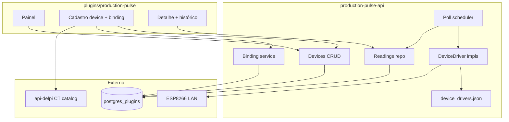

# Roadmap — Production Pulse

> **Status:** planejamento (set/2026)  
> **Escopo:** `production-pulse-api` + `plugins/production-pulse`  
> **Piloto:** ESP8266 em `192.168.20.2`

---

## Decisões travadas

| Tema | Decisão |
|------|---------|
| Nome | `production-pulse` / `production-pulse-api` |
| CT ↔ dispositivo | **Âncora flexível** — `anchor_type`: CT, máquina, equipamento, área, avulso; CT TOTVS **opcional** |
| Online/offline | Grace **2× poll_interval** (min 60 s, max 600 s) — [ADR-002](./ADR-002-poll-scheduler-and-lan.md) |
| Teste conexão create | **`POST /devices/test-probe`** antes do save — [ADR-002](./ADR-002-poll-scheduler-and-lan.md) |
| Scheduler | Per-device `next_poll_at` + jitter ±10% + semáforo 10 — [ADR-002](./ADR-002-poll-scheduler-and-lan.md) |
| LAN Docker dev | `network_mode: host` no `production-pulse-api` — [ADR-002](./ADR-002-poll-scheduler-and-lan.md) |
| RBAC operador | `operator` basta para comandos na rota operador — [ADR-003](./ADR-003-rbac-mvp.md) |
| Rotas legado | MFE/BFF redirect **308** — canônico `placement_key` — [ADR-004](./ADR-004-routes-and-legacy-aliases.md) |
| Filial no hero | **`FilialSwitcher`** (padrão maintenance) — não ScopeChipBar no MVP |
| Cardinalidade | 1 device → 1 binding; 1 âncora → N devices |
| CRUD | Completo na API desde MVP |
| RBAC | Estrutura manifest + gates na API; matriz fina na Fase 4 |
| Histórico | Tabela `readings` + poll background |
| TOTVS | Lookup CT via gateway api-delpi — **sem** SQL no BFF |
| MFE | Module Federation + `preparePluginUiRemote()` |
| Driver | Registry JSON + port `DeviceDriver`; MVP `esp8266_counter_v1` |
| Leituras | `metrics` JSONB genérico — contador, rotação, temperatura, … |
| Papéis | `role_key` derivado do driver (`pulse_counter`, `process_gauge`, …) |
| Operador | Superfície UI por `operatorSurface` — contador MVP; gauge P1 |

---

## Matriz de fluxos

| Fluxo | Superfície | Caminho | Prioridade |
|-------|------------|---------|------------|
| Listar dispositivos | Painel | `GET /devices` | P0 |
| Filtrar/agrupar por CT | Painel | `GET /devices?workCenter=` ou vista agrupada | P0 |
| Cadastrar dispositivo | Form | `POST /devices` + `driver_key` | P0 |
| Escolher driver / papel | Form | `GET /catalog/drivers` | P0 |
| Filtrar por papel | Painel | `GET /devices?role=` | P0 |
| Amarrar objeto (CT/máq/equip.) | Form binding | `PUT /devices/{id}/binding` + `anchor_type` | P0 |
| Poll automático | API background | scheduler → driver → `readings` | P0 |
| Poll manual | Painel / detalhe | `POST /devices/{id}/poll` | P0 |
| Contador ao vivo | Detalhe | `GET /devices/{id}/live` | P0 |
| Histórico gráfico/tabela | Detalhe | `GET /devices/{id}/readings` | P0 |
| Reset remoto | Detalhe | `POST .../commands/reset` | P0 |
| Autocomplete CT | Form | `GET /catalog/work-centers` | P0 |
| Testar conexão | Form | `POST /devices/test-probe` (novo) · `POST /devices/{id}/test` (edit) | P0 |
| Hub operador (placements) | Tablet | `GET /operator/placements` | P0 |
| Superfície contador | Tablet | `counter_pad` + commands | P0 |
| Superfície sensor | Tablet | `gauge_readout` read-only | P1 |
| Comando capability-gated | API | 422 se driver não suporta | P0 |
| RBAC filial | API + menu | manifest + `branch_access` | P0 |
| Delta turno/dia KPI (contador) | Painel | agregação `delta_metrics.counter` | P1 |
| Driver gauge ESP8266 | API + tablet | `esp8266_gauge_v1` + WF-PP-OP-GAUGE | P1 |
| Detecção reset hardware | readings | meta `counter_reset` | P1 |
| Cockpit PCP embed | production-control | HTTP entre BFFs | Fora |

---

## Diagrama

---

## E1 — Fundação API + schema

#### E1.S1 — Scaffold production-pulse-api

- **Objetivo:** API sobe com health, migrations e auth JWT.
- **Fazer:**
  1. Copiar esqueleto de `travel-expenses-api/` → `production-pulse-api/`
  2. Pacote `production_pulse_app/`, `main.py`, `config.py`, middleware auth
  3. `migrations/V001__create_production_pulse_schema.sql` (ver [SCHEMA.md](./SCHEMA.md))
  4. `GET /health`
- **Não fazer:** rotas de domínio ainda; chamar api-delpi do MFE.
- **Teste:** `pytest production-pulse-api/tests/test_health.py -q`
- **Pronto quando:** container `delpi-production-pulse-api` responde health via gateway.
- **Commit:** `feat(production-pulse): fundação da API dedicada`

#### E1.S2 — Infra + gateway

- **Objetivo:** Compose e nginx roteiam `/apps/production-pulse-api/`.
- **Fazer:**
  1. Serviços em `infra/docker-compose.dev.yml` + prod
  2. **`network_mode: host`** no `production-pulse-api` (dev) — [ADR-002](./ADR-002-poll-scheduler-and-lan.md)
  3. `gateway/nginx.conf` + `nginx.dev.conf`
  4. `infra/env.production-pulse.example` (`PP_POLL_MAX_CONCURRENT`, grace envs)
  5. Entrada em `up-dev-sequential.sh` / `up-prod-sequential.sh` (fase `api`)
- **Teste:** `curl -s http://localhost/apps/production-pulse-api/health`
- **Pronto quando:** health 200 via gateway.
- **Commit:** `chore(infra): production-pulse-api no compose e gateway`

---

## E2 — Domínio dispositivos + binding

#### E2.S1 — CRUD devices

- **Objetivo:** CRUD completo de dispositivos.
- **Fazer:** repository + use cases + routes `GET/POST/GET/PUT/PATCH/DELETE /devices`
- **Teste:** `pytest production-pulse-api/tests/test_devices_crud.py -q`
- **Pronto quando:** round-trip JSON com filial e IP.
- **Commit:** `feat(production-pulse): CRUD de dispositivos IoT`

#### E2.S2 — Binding com anchor_type

- **Objetivo:** Amarração N devices → mesma âncora (CT, máquina, equipamento, …).
- **Fazer:** `device_bindings` com `anchor_type`, `placement_label`, campos condicionais; validação R27–R32; histórico `effective_to`
- **Teste:** ventilador `equipment` sem CT OK; `work_center` sem CT → 422; dois devices mesma máquina OK
- **Commit:** `feat(production-pulse): amarração flexível por tipo de objeto`

#### E2.S3 — Catálogo work-centers (proxy TOTVS / SHB010)

- **Objetivo:** Autocomplete de CT no cadastro — **todos** os centros cadastrados no Protheus da filial.
- **Fazer:** gateway HTTP → api-delpi **`GET /production/appointments/work-centers`** (`list_production_appointment_work_centers`) — **não** machine-load (só CTs com OP alocada). Ver [INTEGRATIONS-TOTVS.md](./INTEGRATIONS-TOTVS.md).
- **Fazer:** `GET /catalog/work-centers?branch=&search=` no BFF; validação CT no `PUT /binding`; cache TTL opcional.
- **Teste:** mock gateway + smoke com JWT; CT inexistente → 422 no binding.
- **Pronto quando:** MFE autocomplete lista CT da SHB010 via BFF.
- **Commit:** `feat(production-pulse): catálogo de centros de trabalho via api-delpi`

---

## E3 — Registry de drivers + leituras

#### E3.S0 — Registry + port DeviceDriver

- **Objetivo:** Catálogo declarativo de drivers (métricas, comandos, superfície operador).
- **Fazer:** `device_drivers.json`, `DeviceDriverRegistryService`, port domain `DeviceDriver`, `GET /catalog/drivers`; schema `role_key`, `last_metrics`, `readings.metrics`
- **Teste:** registry carrega; POST device com driver inválido → 422; capabilities expostas no GET device
- **Pronto quando:** trocar driver no JSON adiciona entrada sem migration SQL
- **Commit:** `feat(production-pulse): registry de drivers e leituras genéricas`

#### E3.S1 — Driver esp8266_counter_v1

- **Objetivo:** Ler golpes e enviar increment/decrement/reset ao IP LAN.
- **Fazer:** impl HTTP GET `/api/contador`, POST reset/increment/decrement; normaliza `metrics.counter`
- **Teste:** unit mock; opcional live `192.168.20.2`
- **Pronto quando:** driver retorna `{ metrics: { counter: int } }` ou erro timeout
- **Commit:** `feat(production-pulse): driver ESP8266 contador de golpes`

#### E3.S2 — Readings + poll manual + test-probe

- **Objetivo:** Histórico, poll manual, test-probe pré-save, status online/offline.
- **Fazer:** `readings` repo; **`POST /devices/test-probe`**; `POST /devices/{id}/poll`; `GET /live`; `GET /readings`; `DeviceConnectivityStatusService` (R9–R12) — [ADR-002](./ADR-002-poll-scheduler-and-lan.md)
- **Teste:** delta contador; test-probe não grava reading; grace 2× interval
- **Pronto quando:** painel KPI online/offline alinhado a `last_seen_at`.
- **Commit:** `feat(production-pulse): leituras, test-probe e conectividade`

#### E3.S3 — Scheduler + comandos auditados

- **Objetivo:** Poll automático per-device + comandos capability-gated.
- **Fazer:** `DevicePollSchedulerService` (jitter, semáforo); `POST /commands/{key}`; `device_commands`; Compose dev **`network_mode: host`** — [ADR-002](./ADR-002-poll-scheduler-and-lan.md)
- **Teste:** increment gauge → 422; reset → audit; scheduler skip in-flight
- **Pronto quando:** `last_seen_at` atualiza no intervalo; `curl` LAN ok from container.
- **Commit:** `feat(production-pulse): scheduler de poll e auditoria de comandos`

---

## E4 — RBAC

#### E4.S1 — Permissões manifest + gates API

- **Objetivo:** Matriz MVP [ADR-003](./ADR-003-rbac-mvp.md) ligada nas rotas.
- **Fazer:**
  1. `production-pulse.manifest.json` com permissões
  2. `production_pulse_permissions.py` (padrão travel-expenses)
  3. Gates por rota + `branch_access` middleware
- **Teste:** `test_permissions.py` — operador comanda sem `devices.view`; viewer não comanda; 403 filial
- **Pronto quando:** matriz ADR-003 coberta por testes.
- **Commit:** `feat(production-pulse): RBAC por filial e ação`

---

## E5 — Plugin MFE

#### E5.S1 — Scaffold MF federado

- **Objetivo:** Plugin carrega no Portal.
- **Fazer:** checklist `novo-plugin-mfe-checklist.md`, manifest, register script, tokens `index.css` (ver [DESIGN-FRONTEND.md](./DESIGN-FRONTEND.md))
- **Teste:** `npm run build`; curl `remoteEntry.js`
- **Pronto quando:** tile vazio abre sem erro MF.
- **Commit:** `feat(production-pulse): scaffold MFE federado`

#### E5.S2 — Painel operacional (WF-PP-01)

- **Objetivo:** Lista + vista agrupada por CT, KPI strip, filtros URL-sync.
- **Fazer:** `PanelPage`, `DeviceKpiStrip`, `DeviceFiltersBar`, `DeviceTable`, `DeviceGroupedByWorkCenter`, **`DeviceCard` mobile** — wireframes WF-PP-01 + **WF-PP-01 mobile**
- **Teste:** vitest parse URL + contrato API mock; viewport ≤768 (cards); **769–1100 (KPI 2×2, tabela compacta)**
- **Pronto quando:** lista reflete API; toggle agrupado; empty/loading/error; mobile cards + **tablet compact table**
- **Commit:** `feat(production-pulse): painel operacional com vista por CT`

#### E5.S3 — Cadastro + amarração (WF-PP-02)

- **Objetivo:** Form create/edit, test connection, binding CT autocomplete.
- **Fazer:** `DeviceFormPage`, `DeviceBindingSection`, modais test, **sticky footer + segmented vertical mobile** — wireframes WF-PP-02 + mobile
- **Pronto quando:** cadastrar `192.168.20.2` e amarrar CT de teste; form usável em ≤768px e **max-w 720px em tablet**
- **Commit:** `feat(production-pulse): cadastro de dispositivo e vínculo com CT`

#### E5.S4 — Detalhe abas (WF-PP-03 + WF-PP-04)

- **Objetivo:** Overview + histórico gráfico/tabela + auditoria comandos + modal reset.
- **Fazer:** `DeviceDetailPage`, `UnderlineNav`, charts, modals, **`ReadingCard` / hero stack mobile** — wireframes WF-PP-03/04 + mobile
- **Pronto quando:** gráfico deltas; aba comandos; reset com confirmação; 3 abas legíveis em mobile; **overview 2 col ≥901px tablet**
- **Commit:** `feat(production-pulse): detalhe do dispositivo com histórico e comandos`

#### E5.S5 — Modo operador (hub + picker + superfícies)

- **Objetivo:** Jornada tablet: hub CT → picker (badge papel) → `OperatorDeviceSurface` (contador MVP).
- **Fazer:** `OperatorPlacementHub`, `OperatorDevicePicker`, `OperatorDeviceSurface`, `CounterPadSurface`, stub `GaugeReadoutSurface` (P1) — wireframes OP + **mobile hub/pick/gauge/contador portrait**
- **API:** `GET /operator/placements`; `placement_key` no binding
- **Teste:** vitest hub meta; fluxo contador vs mock gauge; ≤600px pad empilhado; **769–1100 hub 2–3 col**
- **Pronto quando:** operador escolhe placement e abre superfície correta; hub 1 col celular · **2–3 col tablet landscape**
- **Commit:** `feat(production-pulse): modo operador com superfícies por tipo de device`

---

## E6 — Documentação + verify

#### E6.S1 — Docs + inventário + homologação

- **Objetivo:** Pacote documentado e smoke script.
- **Fazer:**
  1. `plugins/production-pulse/README.md`
  2. `production-pulse-api/README.md`
  3. Linha em `docs/08-plugins/README.md`
  4. `scripts/homologacao/check-production-pulse.sh` (remoteEntry + health + CRUD smoke)
- **Teste:** script homologação verde em dev
- **Pronto quando:** checklist plugins-documentation.mdc completo.
- **Commit:** `docs(production-pulse): README, inventário e smoke de homologação`

#### E6.S2 — Verify live com ESP8266 piloto

- **Objetivo:** Fluxo ponta a ponta com `192.168.20.2`.
- **Fazer:** rebuild sequencial plugin-ui → api → mfe; cadastro manual; poll; histórico
- **Pronto quando:** contador do device aparece no painel após poll.
- **Commit:** só se fix de regressão.

---

## Critérios de pronto (MVP)

- [ ] CRUD dispositivo + amarração (`anchor_type`) via UI e API
- [ ] Registry drivers + `metrics` JSONB; comando 422 se capability ausente
- [ ] Poll manual e automático gravam histórico
- [ ] Detalhe com gráfico/tabela de readings
- [ ] Reset remoto auditado (com permissão)
- [ ] RBAC filial SC/ES
- [ ] MFE federado no Portal; MFE não chama api-delpi
- [ ] Piloto `192.168.20.2` operacional na rede dev
- [ ] Critérios MVP: **Jornada operador** hub placements → contador; **ventilador** equipment sem CT no painel

## Fora do escopo (MVP)

- Chat/agente, cockpit PCP embed, WebSocket, alertas limite temperatura/rpm, sync TOTVS apontamento, Modbus/MQTT

---

## Referências

- [README.md](./README.md)
- [ESPECIFICACAO-PLUGIN.md](./ESPECIFICACAO-PLUGIN.md)
- [SCHEMA.md](./SCHEMA.md)
- `travel-expenses-api` — RBAC + CRUD
- `maintenance-api` — gateway api-delpi
- `plugins/controle-retrabalhos/` — MFE referência
