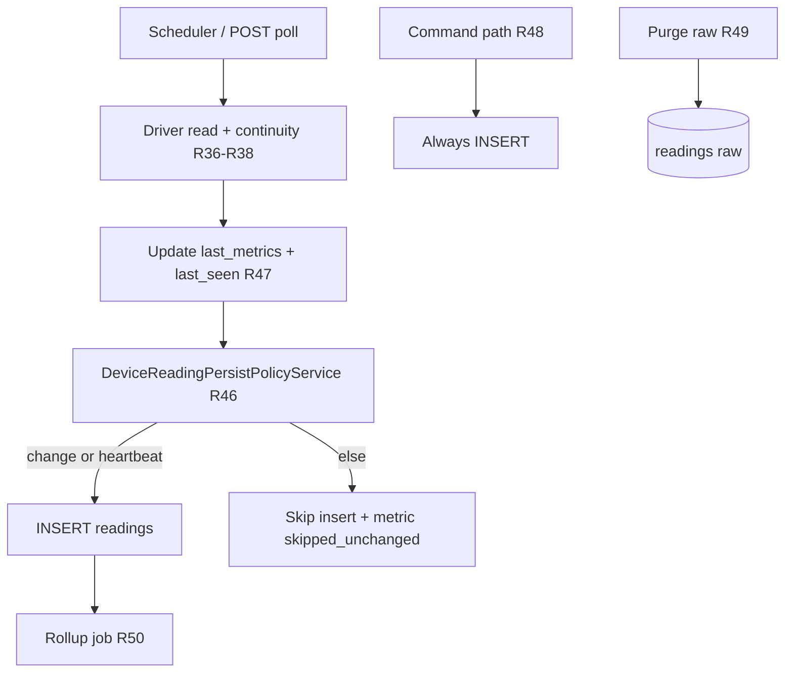

# P3 — Persistência de telemetria (padrão de mercado)

> **Status:** implementação **S0–S5 ✅** no código (set/2026); **S6 verify** pendente  
> **Roadmap:** [ROADMAP.md § P3](./ROADMAP.md#p3--persistência-de-telemetria-padrão-de-mercado)  
> **Regras:** R46–R51 em [API-ROUTES-AND-BUSINESS-RULES.md](./API-ROUTES-AND-BUSINESS-RULES.md) (marcadas ✅)  
> **Problema motivador (pré-P3):** poll rápido gravava **toda** leitura, inclusive `delta = 0` → volume explosivo; o **valor** do contador em `last_metrics` **não** era corrompido por isso.

---

## 1. Como o mercado resolve (referência)

| Padrão | Uso industrial / IIoT |
|--------|------------------------|
| **Estado vs histórico** | Valor ao vivo em cache; série temporal com política própria |
| **Exception / deadband** | Persiste só se mudou além de limiar |
| **Heartbeat** | Sem mudança, ainda assim 1 ponto a cada N ms (prova de vida) |
| **Poll ≠ persist** | Lê chip em alta frequência; grava em cadência menor |
| **Rollups** | Cru curto; 1 min / 1 h / 1 dia para janelas longas |
| **Hot / warm / cold + TTL** | Purge do cru; agregados vivem mais |
| **TSDB / historian** | PI, Influx, Timescale, SiteWise — opcional; Postgres + agregados basta no P3 |

Fontes típicas: AWS IoT SiteWise (tiers), Timescale continuous aggregates, exception reporting OPC/historians.

---

## 2. Diagnóstico no Pulse

### Antes de P3 (histórico — motivou a mudança)

| Camada | Comportamento |
|--------|----------------|
| `DevicePollService.poll_and_persist` | Sempre `readings.insert` após poll OK |
| Scheduler | `poll_interval_ms` curto → volume explosivo |
| Retenção | Nenhuma |
| Gráfico MFE | `sampleIntervalMs` (R45) mitigava só **leitura** |

### Depois de P3.S1–S5 (código vigente)

| Camada | Comportamento |
|--------|----------------|
| Persist policy | Insert só com mudança ≥ deadband **ou** heartbeat (`telemetry_persistence.json`) |
| `GET /live` | Não grava (inalterado) |
| Meta poll | `meta.readingPersisted` (skip observável) |
| Retenção | Purge raw por `rawRetentionDays` (`DeviceReadingRetentionService`) |
| Rollups | `readings_rollups` + `GET /readings?resolution=raw\|hour\|day` |
| MFE | `historyTimeRange` escolhe `resolution` (R51) |
| Pendente | **P3.S6** — verify volume + regressão contador em homologação |

---

## 3. Decisões travadas (P3)

| Tema | Decisão |
|------|---------|
| Bounded context | Só `production-pulse-api` + MFE Pulse — **sem** api-delpi / chat |
| Identificadores | EN: `heartbeatMs`, `persistPolicy`, `readings_rollups`, `rawRetentionDays` |
| Textos PT | `device_api_messages.json` / content novo `telemetry_persistence.json` + loader — **zero** string PT em domain |
| Módulo canônico | `DeviceReadingPersistPolicyService` (domain) — **proibido** `if delta==0` solto no use case/route |
| Config | JSON content (+ opcional override por `driver_key` / device) — não hardcode mágico |
| R14 | **Evolui:** poll OK **sempre** atualiza `last_seen_at` + `last_metrics` + online; **insert** em `readings` só se a política autorizar |
| Leituras `source=command` | **Sempre** persistem (auditoria operacional) |
| Deadband contador | Inteiro ≥ 1 golpe (default); gauge usa limiar float por métrica no registry |
| Heartbeat | Default **30 s** (content); independente do poll interval |
| Raw retention | Default **90 dias**; job de purge na API |
| Rollups | Postgres `readings_rollups` (hour + day) — **sem** migrar para TSDB no P3 |
| MFE | Render-only; períodos longos preferem rollup quando existir; presets já cobrem 12 meses |
| Observabilidade | Contadores internos / log: `persisted` vs `skipped_unchanged` (não spam UI) |

---

## 4. Regras de negócio alvo

| Id | Regra |
|----|--------|
| **R46** | Insert em `readings` (source poll/manual) só se: métrica monotônica/gauge mudou além do deadband **ou** elapsed ≥ `heartbeatMs` desde o último insert persistido. |
| **R47** | Poll OK sem insert **ainda** atualiza conectividade + `last_metrics` (estado ao vivo intacto). |
| **R48** | `source=command` (e resets/restores materializados) **sempre** geram reading. |
| **R49** | Purge de `readings` raw com `recorded_at` &lt; now − `rawRetentionDays` (job; config JSON). |
| **R50** | Rollups hour/day calculados na API; `GET /readings` ganha `resolution=raw\|hour\|day` (default raw compatível). |
| **R51** | MFE: span &gt; 7d usa `resolution=hour` (ou day se &gt; 90d) quando disponível; amostragem R45 permanece para raw denso. |

---

## 5. Contrato / schema (alvo)

### Content (`telemetry_persistence.json` — esboço)

```json
{
  "defaults": {
    "heartbeatMs": 30000,
    "rawRetentionDays": 90,
    "counterDeadband": 1,
    "rollupEnabled": true
  },
  "byRole": {
    "counter": { "heartbeatMs": 30000, "deadband": { "counter": 1 } },
    "sensor": { "heartbeatMs": 60000, "deadband": { "rpm": 5, "temperature_c": 0.5 } }
  }
}
```

### Tabela `readings_rollups` (migration nova)

| Coluna | Tipo | Notas |
|--------|------|-------|
| `device_id` | uuid | FK |
| `bucket_start` | timestamptz | início do bucket |
| `resolution` | `hour` \| `day` | |
| `metrics` | jsonb | last / min / max / sum_delta conforme métrica |
| `samples` | int | quantos raw entraram |

Índice `(device_id, resolution, bucket_start DESC)`.

### API

`GET /devices/{id}/readings?resolution=raw|hour|day&from&to&…`

---

## 6. Fluxo canônico (após P3)



---

## 7. Diretrizes `.cursor` (checklist de implementação)

- [ ] `application-bounded-context-decoupling` — regra só na Pulse API  
- [ ] `english-code-identifiers` — paths/params/migration EN  
- [ ] `assistant-content-json` (analog) — limites/textos em JSON + loader  
- [ ] `centralized-rules-first` / `root-cause-generalized-fix` — um serviço de política, não if no route  
- [ ] `clean-architecture-chat-api` spirit — domain puro; job em application; SQL em infrastructure  
- [ ] `migrations-immutable-checksum` — só migration **nova**  
- [ ] `test-and-commit` — pytest por subetapa; MFE vitest se tocar histórico  
- [ ] `mfe-own-api-no-direct-api-delpi` — inalterado  
- [ ] Helps: atualizar `PP_HELP.detail.readingsTable` / `historyRangePresets` (`feature-help-sync` se aplicável ao plugin)

---

## 8. Fora do P3

- Migrar storage para Influx/Timescale/PI  
- WebSocket push de telemetria  
- Compressão swinging-door avançada  
- UI admin de “editar retenção por device” (só global JSON no P3; override device = depois)  
- Alterar firmware ESP / OTA (ver [FIRMWARE-OTA-P4.md](./FIRMWARE-OTA-P4.md)) 

---

## 9. Critérios de pronto (pacote)

- [x] Poll estável → insert só com mudança/heartbeat (pytest policy + poll)  
- [x] Golpe / comando → insert imediato (R48)  
- [x] `last_metrics` e operador refletem valor ao vivo mesmo com skip (R47)  
- [x] Purge raw + rollups + `resolution` + MFE R51 no código  
- [x] Regras R46–R51 documentadas no canônico de rotas  
- [ ] **S6:** Poll 200 ms 5 min → volume ≤ ~2–3 inserts/min (heartbeat 30 s) em homologação  
- [ ] **S6:** Raw &gt; 90 d removido (dados de teste) + histórico “12 meses” sem estourar pageSize  
- [ ] **S6:** Continuity/provenance regressão de **valor** OK no contador piloto
