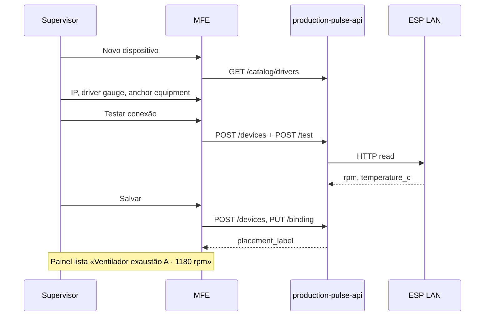
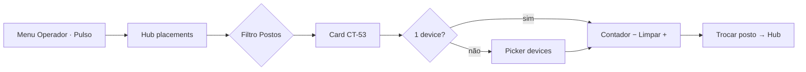

# Jornadas de usuário — Production Pulse

---

## J1 — Supervisor cadastra ventilador (sem CT)

---

## J2 — Operador usa contador no posto PCP

---

## J3 — Admin diagnostica offline

1. Painel → filtro Status **Offline**
2. Linha «ESP motor bomba» · badge vermelho · última métrica cacheada
3. Detalhe → aba Histórico — gap nas leituras
4. `POST /poll` manual → timeout → `last_error` visível
5. Opcional: `POST /test` no edit form após corrigir rede

---

## Matriz jornada × superfície

| Jornada | Admin painel | Form | Detalhe | Operador |
|---------|--------------|------|---------|----------|
| J1 ventilador | Lista + badge Equipamento | anchor equipment | Gráfico rpm/°C | Hub → gauge |
| J2 contador CT | Agrupado posto | anchor work_center | Delta + reset | counter_pad |
| J3 offline | Filtro offline | — | last_error | Pad desabilitado |
