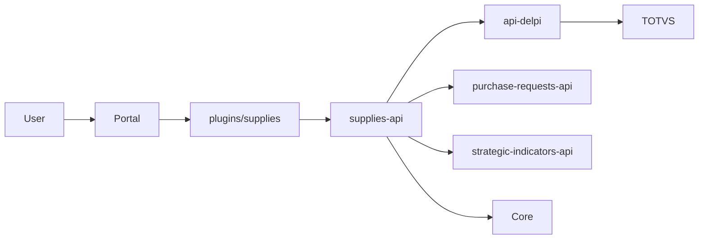

# IMPLEMENTATION-PLAN — Portal Suprimentos

> **Status:** plano executável · **set/2026** · **não implementar agora**  
> Obedece `plan-construction.mdc` + `evidence-driven-execution.mdc`.  
> Protocolo futuro: cada E\*.S\* = escopo único → teste → evidência → commit+push **somente se o PO autorizar**.

---

## Overview

Entregar o Portal Suprimentos (`plugins/supplies` + `supplies-api`) como hub capability-driven, BFF sem bypass de api-delpi, coexistência com os MFEs atuais, paridade e cutover só após homologação.

## Leitura do pedido

| Item | Conteúdo |
|------|----------|
| Objetivo | Mapear a experiência atual e projetar o Portal unificado (docs + plano) |
| Subobjetivos | Inventário, personas, BIs, APIs, RBAC, filiais, duplicidades, boundaries, IA, wireframes, contratos, data model, KPIs, roadmap E\*, paridade, cutover, Ajuda |
| Restrições | Não implementar produto; identificadores EN; MFE não chama api-delpi; sem espelho TOTVS; kit-first; Ajuda satélite |
| Dependências | api-delpi `/supplies/*`, purchase-requests-api, SI, Core, plugin-ui, padrão commercial |
| Entregável desta etapa | Pasta `docs/12-roadmap-e-evolucao/supplies/` |
| Aceite desta etapa | 30 perguntas do pedido respondíveis; ADRs sem Option A/B |

A **execução de código** (E2+) só começa com autorização explícita.

## Evidências e hipóteses

| Item | Estado |
|------|--------|
| MFEs dashboard-supplies, purchase-requests, estoque-seguranca | CONFIRMADO_NO_CODIGO |
| 30 ops `/supplies/*` + products purchase/parents | CONFIRMADO_NO_CONTRATO |
| Seis BIs/perms do PO ausentes do git | CONFIRMADO_NO_CODIGO (ausência) + CONFIRMADO_POR_EVIDENCIA_DO_PRODUCT_OWNER |
| `supplies-api` inexistente | CONFIRMADO_NO_CODIGO |
| CSS `.dashboard-supplies` legado | CONFIRMADO_NO_CODIGO |
| Comprador ES | HIPOTESE_A_VALIDAR |
| BI atraso = OTD | HIPOTESE_A_VALIDAR |
| Absorção SC C2 downtime | HIPOTESE_A_VALIDAR |

## Decisões travadas

| Decisão | Ref |
|---------|-----|
| id `supplies`, API `supplies-api`, CSS `.dashboard-supplies-portal` | ADR-004 |
| MFE só fala com supplies-api | ADR-001 |
| purchase-requests-api absorvida C0→C3, não BC eterno | ADR-002 |
| Cutover só após paridade | ADR-003 |
| BIs PO = dump Core | ADR-005 |
| Unidade ortogonal `supplies.unit.filial-{TOTVS}`; não inflar capabilities | ADR-006 · PERFIS |
| Home ≠ Overview; kit-first; sem fórmula inventada | DESIGN-IA / KPI |
| materiais-terceiros fora | INVENTARIO |
| Frete = deep link Financeiro | BOUNDARIES |
| Qualidade = projeção | BOUNDARIES |

## Matriz de fluxos transversais

| Fluxo | Superfície | API | Dados | RBAC | Ajuda | P0/Herança/Fora |
|-------|------------|-----|-------|------|-------|-----------------|
| Abrir Home | MFE `/` | `/home/attention` | composição | access | Início vs Overview | P0 |
| Filtrar filial | FiltersKit | query branch | TOTVS | unit 01/02 | o que é 01/02 | P0 |
| Abrir Overview | `/overview` | `/analytics/overview` | api-delpi+SI | analytics | fichas | P0 |
| Abrir fornecedor | `/suppliers/:c/:s` | supplier 360 | SA2+OTD | suppliers | 360 | P0 |
| Abrir produto | `/products/:code` | product 360 | products+ESTSEG | products | 360 | P0 |
| Consultar SC | `/purchase-requests` | PR-api C1 | SC1+escopo | PR.view+unit | fail-closed | P0 |
| Exportar SC | mesma | export | idem | PR.export | — | P0 |
| Consultar atraso | `/deliveries` | PO-OTD | SC7 | PO.view | vs BI | P0 UI / P1 paridade BI |
| Consultar estoque | `/inventory` | stock-value/balances | SB9/SB2 | inventory/analytics | vs ESTSEG | P0 |
| Abrir ESTSEG | `/safety-stock` | safety-stock | SBZ | inventory+unit | déficit | P0 |
| Histórico preço | 360 / WF-19 | price-history | SD1 | products | — | P0 no 360 |
| Abrir ajuda | `/help` | — | content | access | satélite | P0 **satélite** |
| Command Palette | shell | catálogo | rotas | caps | — | P0 |
| Favoritos | HubChipRow | Core | apps | access | — | Herança portal |
| Recentes | Hub | localStorage | — | access | — | Herança commercial |
| Deep link legado | gateway 302 | — | — | aliases | coexistência | E18 |
| 403 filial | qualquer | BFF | — | unit | FAQ 403 | P0 |
| Notif SC | Core inbox | jobs PR | eventos | subscriptions | — | Herança até C2 |
| Chat item | chat MFE | api-delpi direto pelo chat | parents | chat | — | Fora (não acoplar) |
| Frete | financial MFE | financial-api | SF8 | financial | — | Fora / deep link |
| Inspeções | qualidade MFE | api-delpi QE | views | inspecoes | — | Fora processo; P1 projeção |
| TV estoque | tv-dashboard | tv-api | SI/supplies | TV | — | Fora UI |
| Editar planilha IDD | Sheets | — | IDD | PO | — | Fora |
| Admin mapping | `/administration` | PR admin | PG | manage | mapping | P0 E15 |
| Criar follow-up | my-tasks / 360 | POST /tasks | PG supplies | access | tarefa vs TOTVS | P0 E13 |
| Dark/light | CSS | — | tokens | — | — | P0 E3 |
| Mobile tabela | todas listas | — | — | — | — | P0 por tela |



---

## Etapas

### E1 — Descoberta residual e contratos

#### E1.S1 Dump Core dos BIs

**Objetivo:** Identificar id, URL, tipo e perms reais dos 6 apps do PO.  
**Fazer:** 1) Com JWT admin, listar `/core-api/admin/apps` (ou SQL Core) filtrando labels Importações, Onde o item, Atraso, Alçada, Controle Estoques, IDD. 2) Anotar `basePath`, `type` iframe/microfrontend, permission codes. 3) Preencher INVENTARIO seção E e ADR-005.  
**Não fazer:** Inventar redirect; copiar code PT para manifest novo.  
**Evidência:** JSON/CSV do dump anexado na pasta (sem segredos).  
**Teste:** n/a código; checklist 6 linhas preenchidas ou `não encontrado`.  
**Pronto quando:** P-01 atualizado.  
**Commit:** `docs(supplies): registra dump Core dos BIs de Suprimentos`

#### E1.S2 Mapear papéis prod (SC vs ES)

**Objetivo:** Confirmar comprador ES e composição real dos grupos.  
**Fazer:** Exportar roles/groups com perms `dashboard-supplies`, `purchase-requests`, `estoque-seguranca` e codes do PO. Atualizar PERSONA-EXPERIENCE-MAP.  
**Não fazer:** Criar papéis no Core ainda.  
**Evidência:** tabela papel × codes.  
**Teste:** n/a.  
**Pronto quando:** P-02 resolvido.  
**Commit:** `docs(supplies): mapeia papéis reais SC e ES no Core`

#### E1.S3 Workshop fichas KPI

**Objetivo:** Assinar ou marcar BLOQUEADO as fichas PARCIAIS; decidir P-08 cobertura.  
**Fazer:** Reunião owner Suprimentos; atualizar KPI-FICHAS status; não mudar SQL.  
**Não fazer:** Inventar cobertura única sem escolha.  
**Evidência:** ata curta + fichas.  
**Teste:** n/a.  
**Pronto quando:** Overview P0 tem lista fechada de ≤8 KPIs.  
**Commit:** `docs(supplies): homologa fichas KPI do Overview`

#### E1.S4 Freeze de contratos

**Objetivo:** PO aceita ADRs 001–005 e catálogo de perms.  
**Fazer:** Review ADRs/PERFIS; GATE-ARCH.  
**Não fazer:** Começar scaffold antes do aceite se o PO exigir.  
**Evidência:** status ADR Aceito pelo PO.  
**Teste:** n/a.  
**Pronto quando:** GATE-ARCH.  
**Commit:** `docs(supplies): congela ADRs do Portal após aceite do PO`

---

### E2 — Fundação supplies-api

#### E2.S1 Scaffold pacote

**Objetivo:** Pacote Clean Architecture com health.  
**Fazer:** 1) Criar `supplies-api/` espelhando `commercial-api/` (domain/application/infrastructure/interface). 2) `GET /health`. 3) `ROOT_PATH=/apps/supplies-api`. 4) Compose serviço + gateway location. 5) Testes health.  
**Não fazer:** Rotas TOTVS; MFE; copiar SQL.  
**Evidência:** container sobe; curl health 200.  
**Teste:** `pytest supplies-api/tests/test_health.py -q`  
**Pronto quando:** health verde no Compose.  
**Commit:** `feat(supplies-api): adiciona fundação e health do BFF`

#### E2.S2 JWT e envelope

**Objetivo:** Auth igual irmãos.  
**Fazer:** middleware JWT; envelope success/error; 401 sem token em rota privada.  
**Não fazer:** Lista de perms no JWT.  
**Evidência:** teste 401.  
**Teste:** `pytest supplies-api/tests/test_auth.py -q`  
**Pronto quando:** JWT obrigatório fora health/ready.  
**Commit:** `feat(supplies-api): exige JWT e padroniza envelope`

#### E2.S3 Postgres schema mínimo

**Objetivo:** Schema `supplies` + preferences.  
**Fazer:** Alembic/V001 `supply_user_preferences`; runner imutável; sem reset.  
**Não fazer:** Tabelas TOTVS; tasks ainda (E13).  
**Evidência:** migration up.  
**Teste:** `pytest supplies-api/tests/test_migrations.py -q`  
**Pronto quando:** preferences upsert.  
**Commit:** `feat(supplies-api): persiste preferências do usuário do Portal`

#### E2.S4 Gateway api-delpi

**Objetivo:** Client HTTP com timeout e caller.  
**Fazer:** `DelpiApiClient`; timeout; `X-Delpi-Caller-App: supplies-api`; BFF `GET /analytics/cpv` proxy de `get_supplies_cpv` com perm analytics.  
**Não fazer:** Retry POST; regra CPV no BFF.  
**Evidência:** teste com httpx mock.  
**Teste:** `pytest supplies-api/tests/test_delpi_gateway.py -q`  
**Pronto quando:** GATE-API parcial (um GET).  
**Commit:** `feat(supplies-api): encaminha CPV à api-delpi via gateway`

#### E2.S5 Capabilities + catálogo de unidades

**Objetivo:** Eixo A (flags) e eixo B (`allowed_units`) no mesmo `/me/capabilities`, sem misturar.  
**Fazer:** 1) JSON catálogo unidades (`01`/`02` + permission + label). 2) DTO `{ capabilities, allowedUnits: ["01","02"] }`. 3) Testes: capability sem unit ⇒ sem dado; alias `estoque-seguranca.view.filial-sc` ⇒ `01`; futura `filial-03` só entra no catálogo.  
**Não fazer:** `if role`; `inventory.view.filial-01`; `manage` ⇒ todas as units.  
**Evidência:** tabela positivo / negativo / irmão (alias unit).  
**Teste:** `pytest supplies-api/tests/test_capabilities.py -q`  
**Pronto quando:** alias `dashboard-supplies.view` ⇒ analytics true **e** unit só pelo eixo B.  
**Commit:** `feat(supplies-api): separa capabilities de permissões de unidade`

---

### E3 — Shell MFE

#### E3.S1 Scaffold federado

**Objetivo:** `plugins/supplies` MF + checklist novo MFE.  
**Fazer:** vite, `preparePluginUiRemote()`, Dockerfile sem COPY plugin-ui, Compose `*plugin-ui-federated`, manifest id `supplies` basePath `/apps/supplies`, README plugin. Atualizar `docs/08-plugins/README.md` (fecha DRIFT purchase-requests também). Ajustar fixture `rbacAccessTree.test.ts`.  
**Não fazer:** CSS `.dashboard-supplies`.  
**Evidência:** `remoteEntry.js` 200.  
**Teste:** `cd plugins/supplies && npm run build`  
**Pronto quando:** GATE-MFE scaffold.  
**Commit:** `feat(supplies): adiciona MFE federado do Portal Suprimentos`

#### E3.S2 CSS root e tokens

**Objetivo:** `.dashboard-supplies-portal` + `--sp-*`.  
**Fazer:** index.css escopado; dark `data-theme`; zero body/:root/*.  
**Não fazer:** `.delpi-ui-*`.  
**Evidência:** grep selectors.  
**Teste:** grep CI local `grep -R "body {" plugins/supplies/src` vazio.  
**Pronto quando:** root canônico ADR-004.  
**Commit:** `feat(supplies): isola CSS do Portal da classe do dashboard legado`

#### E3.S3 Bind plugin-ui + shell

**Objetivo:** TopBar, UnderlineNav, CommandPalette host-contained.  
**Fazer:** `suppliesUi.ts` prefix `sp`, `portalScopeClassName=dashboard-supplies-portal`; nav capability-driven.  
**Não fazer:** copiar CSS kit; modal body-fixed.  
**Evidência:** rotas stub.  
**Teste:** `npm test` + build.  
**Pronto quando:** shell renderiza.  
**Commit:** `feat(supplies): monta shell kit-first capability-driven`

#### E3.S4 Cliente HTTP só BFF

**Objetivo:** zero api-delpi no MFE.  
**Fazer:** client `/apps/supplies-api`; grep gate `apiDelpiUrl|API_DELPI_BASE|/apps/api-delpi`.  
**Não fazer:** exceção KPI.  
**Evidência:** grep zero `src/`.  
**Teste:** `rg -n "api-delpi" plugins/supplies/src` vazio.  
**Pronto quando:** GATE-API MFE.  
**Commit:** `feat(supplies): consome apenas a supplies-api no browser`

---

### E4 — Home e navegação

#### E4.S1 Catálogo de rotas

**Objetivo:** `pluginRouteCatalog.ts` com caps.  
**Fazer:** cards WF DESIGN-IA; ocultar sem cap.  
**Não fazer:** hardcode comprador.  
**Evidência:** testes de filtro de catálogo.  
**Teste:** `plugins/supplies` unit catalog.  
**Pronto quando:** nav some sem cap.  
**Commit:** `feat(supplies): filtra o catálogo do Hub por capability`

#### E4.S2 Home attention

**Objetivo:** WF-01 com AlertQueue.  
**Fazer:** BFF `/home/attention` composição mínima (contagens ESTSEG déficit + OTD late + SC open se caps); PageHero; busca catálogo; favoritos Core se API portal permitir.  
**Não fazer:** 25 KPIs.  
**Evidência:** empty/loading.  
**Teste:** unit Home + pytest attention perm.  
**Pronto quando:** Home acionável.  
**Commit:** `feat(supplies): entrega a Home de ação do Portal`

#### E4.S3 Ajuda esqueleto

**Objetivo:** `/help` + tooltips Home.  
**Fazer:** userManualContent mínimo Quero→onde; teste chaves.  
**Não fazer:** copiar path técnico no help.  
**Evidência:** rota help.  
**Teste:** teste estrutural content.  
**Pronto quando:** satélite Ajuda P0.  
**Commit:** `feat(supplies): publica o esqueleto da Ajuda in-app`

---

### E5 — Visão Geral

#### E5.S1 BFF overview

**Objetivo:** 6–8 KPIs + meta SI.  
**Fazer:** `/analytics/overview`; gateway CPV/OTD/stock/giro/savings + SI; omitir coverage se P-08 aberto.  
**Não fazer:** fórmula nova.  
**Evidência:** testes mapping DTO.  
**Teste:** `pytest supplies-api/tests/test_overview.py -q`  
**Pronto quando:** payload = fichas.  
**Commit:** `feat(supplies-api): compõe o Overview com TOTVS e metas SI`

#### E5.S2 Página Overview

**Objetivo:** WF-02.  
**Fazer:** MetricKpiCard, charts tendência se série existir, drill links, filtros período/filial.  
**Não fazer:** worklist.  
**Evidência:** 403 sem analytics.  
**Teste:** unit + build.  
**Pronto quando:** ≤8 KPIs.  
**Commit:** `feat(supplies): adiciona a Visão Geral gerencial`

#### E5.S3 Help Overview

**Objetivo:** tooltips = fichas.  
**Fazer:** sync HELP.  
**Não fazer:** operationId no tooltip.  
**Evidência:** chaves.  
**Teste:** content test.  
**Pronto quando:** GATE-FEATURE Overview.  
**Commit:** `docs(supplies): explica os KPIs da Visão Geral na Ajuda`

---

### E6 — Solicitações de Compras (C1)

#### E6.S1 Gateway purchase-requests-api

**Objetivo:** BFF lista/detalhe sem duplicar CC.  
**Fazer:** HTTP PR-api; timeout; forward JWT; perms view+unit.  
**Não fazer:** chamar `/supplies/purchase-requests/lines` pulando escopo CC.  
**Evidência:** teste fail-closed mock.  
**Teste:** `pytest supplies-api/tests/test_purchase_requests_gateway.py -q`  
**Pronto quando:** empty sem CC.  
**Commit:** `feat(supplies-api): reutiliza o escopo de SC via purchase-requests-api`

#### E6.S2 Página lista SC

**Objetivo:** WF-04 paridade filtros.  
**Fazer:** FiltersKit, DataTable, URL state, empty fail-closed.  
**Não fazer:** path PT.  
**Evidência:** checklist HOMOLOGACAO seção 2 parcial.  
**Teste:** unit urlState + build.  
**Pronto quando:** filtros 0.2.  
**Commit:** `feat(supplies): incorpora a lista de solicitações no Portal`

#### E6.S3 Export e detalhe

**Objetivo:** export cap + modal/detalhe.  
**Fazer:** permission export 403; detalhe linked orders/receipts via BFF.  
**Não fazer:** export sem perm.  
**Evidência:** teste 403 export.  
**Teste:** pytest + unit.  
**Pronto quando:** paridade export.  
**Commit:** `feat(supplies): exporta SC só com a capability correta`

#### E6.S4 Evidência C2 (não migrar ainda)

**Objetivo:** Medir schema/jobs para P-10.  
**Fazer:** counts PG `purchase_requests.*`; documentar.  
**Não fazer:** mover schema.  
**Evidência:** números no ADR-002.  
**Teste:** n/a.  
**Pronto quando:** HIPOTESE C2 atualizada.  
**Commit:** `docs(supplies): registra evidência para absorver purchase-requests-api`

#### E6.S5 Help SC

**Objetivo:** resíduo, view-all, filial.  
**Fazer:** sync manual.  
**Não fazer:** —  
**Evidência:** Quero→onde SC.  
**Teste:** content.  
**Pronto quando:** Ajuda SC.  
**Commit:** `docs(supplies): documenta solicitações de compras na Ajuda`

---

### E7 — Estoques (controle)

#### E7.S1 BFF stock

**Objetivo:** Proxy stock-value + balances.  
**Fazer:** rotas portal; perm inventory|analytics; filial.  
**Não fazer:** misturar ESTSEG.  
**Evidência:** teste 403.  
**Teste:** pytest stock.  
**Pronto quando:** DTO igual api-delpi.  
**Commit:** `feat(supplies-api): expõe valor e saldos de estoque no BFF`

#### E7.S2 Página inventory

**Objetivo:** WF-15.  
**Fazer:** charts por local; tabela balances; mobile cards.  
**Não fazer:** CSS tabela kit.  
**Evidência:** paridade dashboard /stock.  
**Teste:** build + unit.  
**Pronto quando:** HOMOLOGACAO stock parcial.  
**Commit:** `feat(supplies): adiciona o controle de estoques no Portal`

#### E7.S3 Help estoque vs segurança

**Objetivo:** FAQ conceitos.  
**Fazer:** glossário.  
**Não fazer:** —  
**Evidência:** FAQ.  
**Teste:** content.  
**Pronto quando:** satélite.  
**Commit:** `docs(supplies): esclarece estoque físico versus estoque de segurança`

---

### E8 — Estoque de Segurança

#### E8.S1 BFF safety-stock

**Objetivo:** Proxy família ESTSEG.  
**Fazer:** summary/items/details/suppliers/price-history/filters; autorização AND capability inventory × eixo B (aliases sc/es só no resolver de unidade).  
**Não fazer:** gravar ESTSEG.  
**Evidência:** 403 filial cruzada.  
**Teste:** pytest safety_stock.rbac.  
**Pronto quando:** gate filial.  
**Commit:** `feat(supplies-api): encaminha estoque de segurança com RBAC de filial`

#### E8.S2 Páginas WF-16 e WF-17

**Objetivo:** Paridade plugin.  
**Fazer:** monitoramento + consumption-analysis EN path; alias doc para `/analise-consumo`.  
**Não fazer:** path PT novo.  
**Evidência:** simulação read-only.  
**Teste:** build.  
**Pronto quando:** HOMOLOGACAO seção 3 engenharia.  
**Commit:** `feat(supplies): porta o estoque de segurança e a análise de consumo`

#### E8.S3 Help ESTSEG

**Objetivo:** déficit, SC1 fora da projeção.  
**Fazer:** herdar README.  
**Não fazer:** vazar nomes de tabela no help.  
**Evidência:** tooltips.  
**Teste:** content.  
**Pronto quando:** GATE-FEATURE ESTSEG.  
**Commit:** `docs(supplies): explica o monitoramento de ESTSEG na Ajuda`

---

### E9 — Pedidos / entregas / OTD

#### E9.S1 Ler DTOs PO-OTD

**Objetivo:** Fechar fórmula KPI-PO-LATE e P-03.  
**Fazer:** Ler use cases `purchase_order_otd_*`; documentar campos na ficha; comparar dump BI se existir.  
**Não fazer:** SQL novo.  
**Evidência:** ficha CONFIRMADO ou PARCIAL.  
**Teste:** testes api-delpi já existentes não regressar.  
**Pronto quando:** UI não inventa coluna.  
**Commit:** `docs(supplies): documenta o contrato de OTD de pedidos de compra`

#### E9.S2 BFF + páginas WF-05/06/07/11

**Objetivo:** Lista PC, detalhe, entregas, OTD fornecedores.  
**Fazer:** proxy panel/series/otd; páginas kit.  
**Não fazer:** duplicar ranking em três telas sem drill.  
**Evidência:** 403.  
**Teste:** pytest + unit.  
**Pronto quando:** OTD dashboard paridade WF-11.  
**Commit:** `feat(supplies): entrega pedidos, atrasos e OTD no Portal`

#### E9.S3 Help OTD

**Objetivo:** universo MP/3019.  
**Fazer:** herdar help dashboard.  
**Não fazer:** —  
**Evidência:** tooltip.  
**Teste:** content.  
**Pronto quando:** Ajuda.  
**Commit:** `docs(supplies): documenta OTD de compras na Ajuda`

---

### E10 — Fornecedor 360

#### E10.S1 BFF composição

**Objetivo:** GET supplier 360.  
**Fazer:** SA2 + OTD recorte + PCs abertos + products SA5; notes PG.  
**Não fazer:** copiar SA2 para PG.  
**Evidência:** teste composição mock.  
**Teste:** pytest supplier_360.  
**Pronto quando:** payload por owner.  
**Commit:** `feat(supplies-api): compõe o Fornecedor 360 sem espelhar o TOTVS`

#### E10.S2 Página WF-09/10

**Objetivo:** busca + ficha.  
**Fazer:** seções; notas CUD; PagePath.  
**Não fazer:** iframe inspeções.  
**Evidência:** empty sem fornecedor.  
**Teste:** unit + build.  
**Pronto quando:** 360 navegável.  
**Commit:** `feat(supplies): adiciona busca e ficha Fornecedor 360`

#### E10.S3 Projeção qualidade (opcional cap)

**Objetivo:** Card pendências se P-11 permitir.  
**Fazer:** HTTP inspecoes **somente** se user tem perm qualidade; senão omitir.  
**Não fazer:** bypass RBAC qualidade.  
**Evidência:** teste negativo sem perm.  
**Teste:** pytest.  
**Pronto quando:** P-11.  
**Commit:** `feat(supplies-api): projeta inspeções no 360 só com permissão de Qualidade`

---

### E11 — Produto / MP 360

#### E11.S1 BFF product 360 + where-used

**Objetivo:** Compor item.  
**Fazer:** stock, last-purchase, purchases, suppliers, parents, ESTSEG summary item.  
**Não fazer:** nova rota TOTVS se ops bastam.  
**Evidência:** teste.  
**Teste:** pytest product_360.  
**Pronto quando:** um GET.  
**Commit:** `feat(supplies-api): compõe o Produto 360 a partir de contratos existentes`

#### E11.S2 Páginas WF-12/13/14/19

**Objetivo:** busca, 360, where-used, preço.  
**Fazer:** abas; deep ESTSEG.  
**Não fazer:** duplicar SQL parents.  
**Evidência:** 404 código inválido.  
**Teste:** unit.  
**Pronto quando:** fragmentação do comprador coberta.  
**Commit:** `feat(supplies): unifica a jornada de matéria-prima no Portal`

#### E11.S3 Help item

**Objetivo:** onde-usado + ESTSEG.  
**Fazer:** Quero→onde.  
**Não fazer:** —  
**Evidência:** links.  
**Teste:** content.  
**Pronto quando:** Ajuda item.  
**Commit:** `docs(supplies): ensina a consultar item e onde é usado`

---

### E12 — Negociações / savings

#### E12.S1 BFF + WF-18

**Objetivo:** Paridade savings.  
**Fazer:** proxy summary; meta SI; página.  
**Não fazer:** copiar planilha.  
**Evidência:** 403.  
**Teste:** pytest + unit.  
**Pronto quando:** HOMOLOGACAO savings.  
**Commit:** `feat(supplies): mostra economia de negociações via BFF`

#### E12.S2 Help Sheets vs SI

**Objetivo:** uma meta.  
**Fazer:** FAQ.  
**Não fazer:** segunda meta.  
**Evidência:** texto.  
**Teste:** content.  
**Pronto quando:** D6 explicado ao usuário.  
**Commit:** `docs(supplies): explica savings da planilha e meta SI`

---

### E13 — Minhas atividades / alertas

#### E13.S1 Decidir persistência de alertas

**Objetivo:** P0 on-read vs tabela events (P-alerta).  
**Fazer:** medir latência `/home/attention`; se OK, não criar `supply_alert_events`.  
**Não fazer:** tabela preventiva.  
**Evidência:** números.  
**Teste:** n/a ou bench.  
**Pronto quando:** DATA-MODEL atualizado.  
**Commit:** `docs(supplies): decide persistência de alertas com evidência de latência`

#### E13.S2 Tasks PG + API

**Objetivo:** `supply_tasks` + CRUD.  
**Fazer:** V002 migration; idempotência unique; list/create/complete.  
**Não fazer:** clone de PC.  
**Evidência:** testes concorrência.  
**Teste:** pytest tasks.  
**Pronto quando:** follow-up persiste.  
**Commit:** `feat(supplies-api): persiste follow-ups do Portal`

#### E13.S3 WF-03 + Home

**Objetivo:** worklist UI.  
**Fazer:** WorklistItem; aging SC se P-09 homologado senão sem buckets nomeados.  
**Não fazer:** threshold mágico.  
**Evidência:** empty.  
**Teste:** unit.  
**Pronto quando:** P0 worklist.  
**Commit:** `feat(supplies): adiciona Minhas atividades e follow-ups`

---

### E14 — Indicadores SI

#### E14.S1 Enrich meta no Overview já feito? completar

**Objetivo:** WF-20 + deep link SI.  
**Fazer:** página indicators; HTTP SI; não cadastrar meta no Portal.  
**Não fazer:** dual write meta.  
**Evidência:** 403.  
**Teste:** pytest si_gateway.  
**Pronto quando:** gestão lê meta canônica.  
**Commit:** `feat(supplies): liga indicadores do Portal às metas SI`

#### E14.S2 Help metas

**Objetivo:** quem cadastra meta.  
**Fazer:** FAQ.  
**Não fazer:** —  
**Evidência:** texto.  
**Teste:** content.  
**Pronto quando:** Ajuda.  
**Commit:** `docs(supplies): esclarece cadastro de metas no SI`

---

### E15 — Administração

#### E15.S1 Proxy admin SC

**Objetivo:** mappings e scopes no Portal.  
**Fazer:** WF-21; perm manage; C1 HTTP PR-api.  
**Não fazer:** reimplementar fail-closed.  
**Evidência:** 403 access-only.  
**Teste:** pytest admin.  
**Pronto quando:** admin SC no Portal.  
**Commit:** `feat(supplies): concentra a administração de SC no Portal`

#### E15.S2 Settings + auditoria

**Objetivo:** `portal_settings` se P-09 exigir.  
**Fazer:** só keys homologadas.  
**Não fazer:** textos PT no PG.  
**Evidência:** audit log CUD.  
**Teste:** pytest.  
**Pronto quando:** settings justificados.  
**Commit:** `feat(supplies-api): audita settings funcionais do Portal`

---

### E16 — Ajuda / onboarding completo

#### E16.S1 Manual completo

**Objetivo:** Quero→onde todas WF P0/P1 entregues.  
**Fazer:** userManual + MANUAL markdown espelho.  
**Não fazer:** help só no README.  
**Evidência:** cobertura rotas.  
**Teste:** teste links.  
**Pronto quando:** feature-help-sync.  
**Commit:** `docs(supplies): completa o Manual do Portal Suprimentos`

#### E16.S2 Glossário e FAQ

**Objetivo:** termos OTD ESTSEG SC PC CPV giro.  
**Fazer:** glossaryContent.  
**Não fazer:** códigos Protheus desnecessários.  
**Evidência:** página help.  
**Teste:** content.  
**Pronto quando:** FAQ P0.  
**Commit:** `docs(supplies): publica glossário e FAQ do Portal`

#### E16.S3 Cobertura helpTooltips

**Objetivo:** toda tela P0 com hint.  
**Fazer:** checklist HELP-COVERAGE analogia commercial.  
**Não fazer:** ícone ? solto fora do padrão FieldLabel.  
**Evidência:** tabela.  
**Teste:** snapshot keys.  
**Pronto quando:** cobertura.  
**Commit:** `feat(supplies): cobre tooltips de negócio em todas as telas P0`

---

### E17 — Paridade

#### E17.S1 Checklist dashboard

**Objetivo:** HOMOLOGACAO §1 engenharia.  
**Fazer:** linha a linha; gaps = ticket ou bloquear cutover.  
**Não fazer:** marcar ✅ sem evidência.  
**Evidência:** checklist.  
**Teste:** smoke E2E manual/roteiro.  
**Pronto quando:** engenharia ✅.  
**Commit:** `docs(supplies): registra paridade com o dashboard de suprimentos`

#### E17.S2 Checklist SC e ESTSEG

**Objetivo:** §2 e §3.  
**Fazer:** idem; incluir 403 e fail-closed.  
**Não fazer:** —  
**Evidência:** checklist.  
**Teste:** pytest rbac + smoke.  
**Pronto quando:** GATE-PARITY engenharia.  
**Commit:** `docs(supplies): registra paridade de SC e estoque de segurança`

#### E17.S3 Assinatura PO/QA

**Objetivo:** GATE-PARITY negócio.  
**Fazer:** assinar tabela HOMOLOGACAO.  
**Não fazer:** cutover.  
**Evidência:** nomes/datas.  
**Teste:** n/a.  
**Pronto quando:** PO GO condicionado.  
**Commit:** `docs(supplies): registra homologação de paridade pelo PO`

---

### E18 — Cutover

#### E18.S1 Snippet redirects (não ativo)

**Objetivo:** arquivo nginx pronto.  
**Fazer:** analogia commercial-f2c; paths CUTOVER-RUNBOOK.  
**Não fazer:** include em prod sem GO.  
**Evidência:** PR infra separado.  
**Teste:** nginx -t em staging.  
**Pronto quando:** snippet revisado.  
**Commit:** `feat(gateway): prepara redirects do cutover de Suprimentos`

#### E18.S2 Flip staging

**Objetivo:** 302 + aliases em staging.  
**Fazer:** runbook; smoke favoritos.  
**Não fazer:** unregister prod.  
**Evidência:** curl -I 302.  
**Teste:** smoke script.  
**Pronto quando:** staging OK.  
**Commit:** `feat(supplies): valida cutover de Suprimentos em staging`

#### E18.S3 Prod GO

**Objetivo:** executar runbook.  
**Fazer:** sequencial; rollback documentado.  
**Não fazer:** rm migrations; apagar api-delpi.  
**Evidência:** smoke prod.  
**Teste:** curls runbook.  
**Pronto quando:** GATE-CUTOVER.  
**Commit:** `feat(supplies): executa cutover do launcher legado para o Portal`

---

### E19 — Evoluções P2/P3

#### E19.S1 Scorecard / concentração / alçadas / importações

**Objetivo:** só itens com P-01/P-05/P-06 fechados e ficha.  
**Fazer:** backlog um a um com nova E\*.S\* se aprovado.  
**Não fazer:** ML preditivo; escrita TOTVS.  
**Evidência:** ADR extra se ownership mudar.  
**Teste:** conforme feature.  
**Pronto quando:** cada item com GATE-FEATURE.  
**Commit:** (por feature) `feat(supplies): ...`

#### E19.S2 C2 absorção schema (se P-10 ok)

**Objetivo:** supplies-api dona do schema purchase_requests.  
**Fazer:** dual-read; jobs; freeze PR-api; depois desligar.  
**Não fazer:** big-bang sem reconciliação.  
**Evidência:** counts iguais.  
**Teste:** integração.  
**Pronto quando:** ADR-002 C3.  
**Commit:** `feat(supplies-api): assume o estado Delpi de solicitações de compras`

---

### E20 — Verify final

#### E20.S1 Rebuild sequencial + smoke live

**Objetivo:** pipeline real.  
**Fazer:** `up-*-sequential.sh` supplies-api + supplies + plugin-ui se preciso; smoke fluxos matriz P0.  
**Não fazer:** commit se só docs.  
**Evidência:** tabela pass/fail.  
**Teste:** smoke + pytest + npm build.  
**Pronto quando:** objetivo original perceptível.  
**Commit:** só se fix de regressão `fix(supplies): corrige regressão encontrada no verify final`

#### E20.S2 Revisão objetivo original

**Objetivo:** 30 perguntas do pedido ainda verdadeiras.  
**Fazer:** atualizar README status.  
**Não fazer:** reabrir Option A/B.  
**Evidência:** seção OBJETIVO_ORIGINAL neste plano.  
**Teste:** n/a.  
**Pronto quando:** docs alinhados ao runtime.  
**Commit:** `docs(supplies): atualiza status pós-verify do Portal`

---

## Critérios de pronto (plano)

- ADRs sem alternativa aberta.
- Inventário com decisão por ativo.
- Matriz de fluxos com satélite Ajuda.
- Toda E\*.S\* com receita.
- YAML todos alinhado.
- Implementação de produto **não** feita nesta etapa.

## Fora do escopo (execução futura também, salvo ADR)

- Escrita no TOTVS.
- Absorver `materiais-terceiros`, Financeiro, Qualidade, PCP, Chat, TV.
- Runtime `type: module`.
- IA preditiva / e-mail automático a fornecedor.
- Remover plugins nesta etapa de documentação.

**Proibido** colocar Ajuda user-facing em fora de escopo.

## Protocolo de execução (quando o PO autorizar)

```text
cada E*.S*
  → implementar somente o escopo
  → testar
  → verificar evidência e pipeline real
  → commit
  → push
```

Não agrupar duas subetapas. Nesta tarefa atual: **NÃO COMMITAR CÓDIGO PRODUTIVO**. Docs podem existir no working tree.

## Verify final

Ver E20. Inclui revisão adversarial (BI fora? app sem a palavra compras? ownership? espelho TOTVS? paridade?).

---

## Todos YAML

```yaml
todos:
  - id: e1-s1-dump-core-bis
    status: pending
    dependsOn: []
  - id: e1-s2-map-prod-roles
    status: pending
    dependsOn: []
  - id: e1-s3-kpi-workshop
    status: pending
    dependsOn: []
  - id: e1-s4-freeze-adrs
    status: pending
    dependsOn:
      - e1-s1-dump-core-bis
      - e1-s2-map-prod-roles
      - e1-s3-kpi-workshop
  - id: e2-s1-scaffold-api
    status: pending
    dependsOn:
      - e1-s4-freeze-adrs
  - id: e2-s2-jwt-envelope
    status: pending
    dependsOn:
      - e2-s1-scaffold-api
  - id: e2-s3-postgres-preferences
    status: pending
    dependsOn:
      - e2-s2-jwt-envelope
  - id: e2-s4-delpi-gateway
    status: pending
    dependsOn:
      - e2-s2-jwt-envelope
  - id: e2-s5-capabilities
    status: pending
    dependsOn:
      - e2-s2-jwt-envelope
  - id: e3-s1-scaffold-mfe
    status: pending
    dependsOn:
      - e2-s1-scaffold-api
  - id: e3-s2-css-root
    status: pending
    dependsOn:
      - e3-s1-scaffold-mfe
  - id: e3-s3-shell-kit
    status: pending
    dependsOn:
      - e3-s2-css-root
      - e2-s5-capabilities
  - id: e3-s4-http-bff-only
    status: pending
    dependsOn:
      - e3-s1-scaffold-mfe
  - id: e4-s1-route-catalog
    status: pending
    dependsOn:
      - e3-s3-shell-kit
  - id: e4-s2-home-attention
    status: pending
    dependsOn:
      - e4-s1-route-catalog
      - e2-s4-delpi-gateway
  - id: e4-s3-help-skeleton
    status: pending
    dependsOn:
      - e4-s1-route-catalog
  - id: e5-s1-overview-bff
    status: pending
    dependsOn:
      - e2-s4-delpi-gateway
      - e1-s3-kpi-workshop
  - id: e5-s2-overview-page
    status: pending
    dependsOn:
      - e5-s1-overview-bff
      - e3-s3-shell-kit
  - id: e5-s3-overview-help
    status: pending
    dependsOn:
      - e5-s2-overview-page
  - id: e6-s1-pr-gateway
    status: pending
    dependsOn:
      - e2-s5-capabilities
  - id: e6-s2-pr-list
    status: pending
    dependsOn:
      - e6-s1-pr-gateway
      - e3-s3-shell-kit
  - id: e6-s3-pr-export-detail
    status: pending
    dependsOn:
      - e6-s2-pr-list
  - id: e6-s4-c2-evidence
    status: pending
    dependsOn:
      - e6-s1-pr-gateway
  - id: e6-s5-pr-help
    status: pending
    dependsOn:
      - e6-s2-pr-list
  - id: e7-s1-stock-bff
    status: pending
    dependsOn:
      - e2-s4-delpi-gateway
  - id: e7-s2-inventory-page
    status: pending
    dependsOn:
      - e7-s1-stock-bff
  - id: e7-s3-stock-help
    status: pending
    dependsOn:
      - e7-s2-inventory-page
  - id: e8-s1-safety-bff
    status: pending
    dependsOn:
      - e2-s5-capabilities
  - id: e8-s2-safety-pages
    status: pending
    dependsOn:
      - e8-s1-safety-bff
  - id: e8-s3-safety-help
    status: pending
    dependsOn:
      - e8-s2-safety-pages
  - id: e9-s1-po-otd-contract
    status: pending
    dependsOn:
      - e1-s1-dump-core-bis
  - id: e9-s2-po-pages
    status: pending
    dependsOn:
      - e9-s1-po-otd-contract
      - e2-s4-delpi-gateway
  - id: e9-s3-otd-help
    status: pending
    dependsOn:
      - e9-s2-po-pages
  - id: e10-s1-supplier-bff
    status: pending
    dependsOn:
      - e9-s2-po-pages
  - id: e10-s2-supplier-pages
    status: pending
    dependsOn:
      - e10-s1-supplier-bff
  - id: e10-s3-quality-projection
    status: pending
    dependsOn:
      - e10-s2-supplier-pages
  - id: e11-s1-product-bff
    status: pending
    dependsOn:
      - e8-s1-safety-bff
  - id: e11-s2-product-pages
    status: pending
    dependsOn:
      - e11-s1-product-bff
  - id: e11-s3-product-help
    status: pending
    dependsOn:
      - e11-s2-product-pages
  - id: e12-s1-savings
    status: pending
    dependsOn:
      - e5-s1-overview-bff
  - id: e12-s2-savings-help
    status: pending
    dependsOn:
      - e12-s1-savings
  - id: e13-s1-alert-persistence
    status: pending
    dependsOn:
      - e4-s2-home-attention
  - id: e13-s2-tasks-api
    status: pending
    dependsOn:
      - e2-s3-postgres-preferences
  - id: e13-s3-my-tasks-ui
    status: pending
    dependsOn:
      - e13-s2-tasks-api
      - e6-s2-pr-list
  - id: e14-s1-si-indicators
    status: pending
    dependsOn:
      - e5-s2-overview-page
  - id: e14-s2-si-help
    status: pending
    dependsOn:
      - e14-s1-si-indicators
  - id: e15-s1-admin-proxy
    status: pending
    dependsOn:
      - e6-s1-pr-gateway
  - id: e15-s2-settings-audit
    status: pending
    dependsOn:
      - e15-s1-admin-proxy
  - id: e16-s1-full-manual
    status: pending
    dependsOn:
      - e4-s3-help-skeleton
      - e11-s3-product-help
      - e8-s3-safety-help
  - id: e16-s2-glossary-faq
    status: pending
    dependsOn:
      - e16-s1-full-manual
  - id: e16-s3-tooltip-coverage
    status: pending
    dependsOn:
      - e16-s2-glossary-faq
  - id: e17-s1-parity-dashboard
    status: pending
    dependsOn:
      - e5-s2-overview-page
      - e9-s2-po-pages
      - e12-s1-savings
  - id: e17-s2-parity-sc-estseg
    status: pending
    dependsOn:
      - e6-s3-pr-export-detail
      - e8-s2-safety-pages
  - id: e17-s3-parity-signoff
    status: pending
    dependsOn:
      - e17-s1-parity-dashboard
      - e17-s2-parity-sc-estseg
  - id: e18-s1-nginx-snippet
    status: pending
    dependsOn:
      - e17-s3-parity-signoff
  - id: e18-s2-staging-flip
    status: pending
    dependsOn:
      - e18-s1-nginx-snippet
  - id: e18-s3-prod-go
    status: pending
    dependsOn:
      - e18-s2-staging-flip
  - id: e19-s1-p2-features
    status: pending
    dependsOn:
      - e17-s3-parity-signoff
  - id: e19-s2-c2-schema-move
    status: pending
    dependsOn:
      - e6-s4-c2-evidence
      - e18-s3-prod-go
  - id: e20-s1-rebuild-smoke
    status: pending
    dependsOn:
      - e18-s3-prod-go
  - id: e20-s2-objective-review
    status: pending
    dependsOn:
      - e20-s1-rebuild-smoke
```

---

## OBJETIVO_ORIGINAL (validação desta etapa docs)

Mapear a experiência atual e projetar o Portal com MFE + API própria no padrão Comercial.

| Requisito | Estado |
|-----------|--------|
| mapear apps atuais | ATENDIDO |
| mapear personas | ATENDIDO (comprador ES = pendente E1.S2) |
| mapear BIs | ATENDIDO como LEGADO_A_VALIDAR |
| mapear APIs | ATENDIDO |
| mapear RBAC | ATENDIDO (codes git + PO) |
| mapear filiais | ATENDIDO |
| detectar duplicidades | ATENDIDO |
| bounded contexts | ATENDIDO |
| architecture target | ATENDIDO |
| novas funcionalidades P0–P3 | ATENDIDO |
| IA | ATENDIDO |
| wireframes | ATENDIDO |
| contratos | ATENDIDO |
| data model | ATENDIDO |
| KPI fichas | ATENDIDO |
| roadmap E\* | ATENDIDO |
| plano E\*.S\* | ATENDIDO |
| paridade | ATENDIDO (checklist) |
| cutover | ATENDIDO (runbook) |
| Ajuda | ATENDIDO (satélite planejado) |
| implementar portal | FORA_DO_ESCOPO_COM_JUSTIFICATIVA (pedido explícito) |
