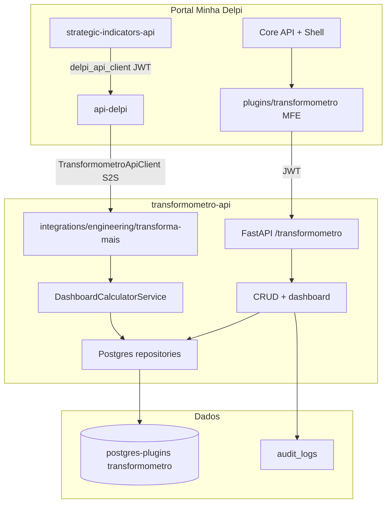
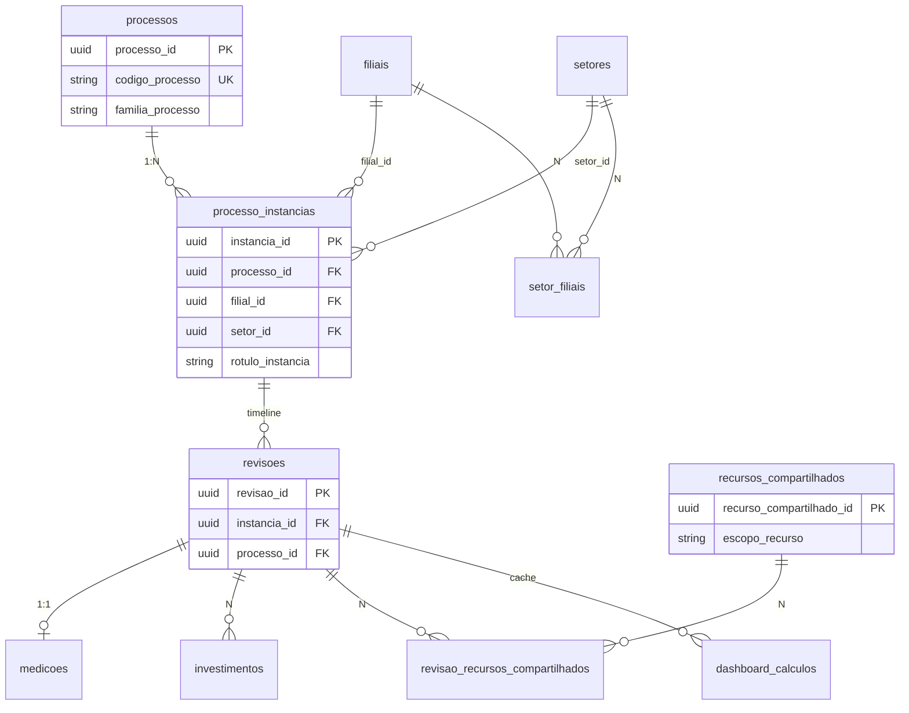

# Arquitetura — Transformômetro App

**Última atualização:** jun/2026 (Playbook 18 — instâncias, UUID, visões, RBAC filial)

## Diagrama de contexto



## Modelo de domínio (Playbook 18)



**Regra:** filial/setor **não** ficam em `processos` (V015). Toda revisão pertence a uma **instância**.

## Serviços canônicos (pós–Playbook 18)

| Serviço | Camada | Função |
|---------|--------|--------|
| `DashboardCalculatorService` | domain | Cálculo mensal por revisão/competência |
| `SharedResourceScopeService` | domain | Pool de rateio por `escopo_recurso` |
| `DashboardCacheDenormService` | domain | Denormaliza instância/filial/setor no cache |
| `DashboardViewScopeService` | application | Filtro `view=consolidated\|filial\|department` |
| `FilialAccessScopeService` | application | RBAC filial server-side + `access_scope` em `/options` |
| `InstanciaDuplicateService` | application | Replica timeline entre instâncias |
| `DashboardLiveService` | application | Dashboard em tempo real |
| `DashboardRecalcService` | application | Materializa `dashboard_calculos` |

## Estrutura de pastas (proposta)

```text
transformometro-api/
  tm_app/
    main.py
    config.py
    domain/
      entities/          # Processo, Revisao, Medicao, ...
      services/          # ProcessSummaryCalculator (migrado)
      ports/             # interfaces de repositório
    application/
      dto/
      use_cases/         # CreateProcesso, AtivarRevisao, RecalcularDashboard, ...
    infrastructure/
      persistence/
        postgres/        # implementações
      auth/              # JWT (shared delpi)
    interface/
      http/
        routes/          # routers por agregado
    migrations/          # V001__schema, V002__seed_catalogos, ...
  Dockerfile
  requirements.txt
  docs/

plugins/transformometro/
  transformometro.manifest.json
  src/
    bootstrap.tsx
    App.tsx
    data/api/            # clientes HTTP
    state/hooks/
    ui/
      pages/             # Processos, RevisaoDetalhe, Dashboard, Recursos
      components/
  vite.config.ts
  package.json
```

## Camadas da API

| Camada | Responsabilidade |
|--------|------------------|
| **interface/http** | Rotas REST, validação Pydantic, códigos HTTP, OpenAPI |
| **application** | Orquestração, transações, políticas (ativar revisão desativa outras) |
| **domain** | Entidades, calculador, regras de vigência e rateio |
| **infrastructure** | Postgres, auditoria, cache materializado opcional |

Sem regra de negócio em controllers; calculador **puro** (testável com fixtures da planilha).

## Modelo de dados (PostgreSQL)

Schema: **`transformometro`**. Migrations **V001–V018** (ver [migrations/README.md](../../../transformometro-api/migrations/README.md)).

### Catálogos e operacional

| Tabela | PK | Observação |
|--------|-----|------------|
| `filiais` | `filial_id` UUID | `codigo_filial` UNIQUE (V011) |
| `setores` | `setor_id` UUID | `codigo_setor` UNIQUE (V012) |
| `setor_filiais` | — | FKs UUID filial ↔ setor |
| `processos` | `processo_id` UUID | Mestre; sem filial/setor (V015) |
| `processo_instancias` | `instancia_id` UUID | UNIQUE `(processo_id, filial_id, setor_id)` (V013) |
| `revisoes` | `revisao_id` UUID | FK **`instancia_id`** NOT NULL (V014); unique `(instancia_id, versao_revisao)` (V018) |
| `medicoes` | `medicao_id` UUID | FK `revisao_id` |
| `investimentos` | `investimento_id` UUID | FK `revisao_id` |
| `recursos_compartilhados` | `recurso_compartilhado_id` UUID | `escopo_recurso` DEFAULT `empresa` (V016) |
| `revisao_recursos_compartilhados` | `vinculo_id` UUID | Rateio |
| `recurso_custos` | — | Histórico de `valor_mensal` |

Todas as cadastrais com `deletado`, `created_at`, `updated_at`.

### Cache dashboard (V017)

| Tabela | Chave | Conteúdo |
|--------|-------|----------|
| `dashboard_calculos` | `dashboard_calculo_id` UUID PK; unique `(revisao_id, competencia)` | Linhas calculadas + denorm `instancia_id`, `filial_id`, `setor_id`, `codigo_filial`, `codigo_setor` |
| `processo_competencia_snapshot` | view | Agregação processo × competência; alias `codigo_*` na resposta |

A tabela `dashboard_calculos` **não é a fonte primária da regra de negócio**. Ela é um cache materializado auxiliar. As rotas atuais do dashboard calculam os dados em tempo real a partir das tabelas cadastrais, usando `DashboardLiveService` + `DashboardCalculatorService`. Portanto, toda alteração de regra de cálculo deve ser implementada primeiro no cálculo em tempo real e, depois, refletida no recálculo materializado.

Regra obrigatória: o resultado gravado em `dashboard_calculos` deve bater com o resultado em tempo real para a mesma competência, revisão, processo, filtros e vigências. O `DashboardRecalcService` deve usar o mesmo `DashboardCalculatorService` e os mesmos patches/regras de vigência usados pelo fluxo live.

Recálculo do cache:

1. Carregar os dados cadastrais atuais via `DashboardDataRepository.load_raw()`.
2. Aplicar exatamente o mesmo calculador usado pelo dashboard em tempo real.
3. Respeitar vigência histórica das revisões: revisão descontinuada hoje ainda calcula nos meses em que estava vigente.
4. Preservar rateio global de recursos compartilhados, mesmo quando o recorte exibido é de apenas um processo/filtro.
5. Truncar/particionar competências afetadas, ou fazer upsert por `(revisao_id, competencia)`.
6. Persistir as linhas em `dashboard_calculos` apenas como cache.

Trigger operacional: `POST /transformometro/dashboard/recalcular` (admin/JWT) e/ou execução interna do serviço `DashboardRecalcService().recalculate()` no container. Após recálculo, validar a coerência do cache com a fórmula da economia líquida.

Validação mínima obrigatória após mudanças de regra:

```sql
SELECT
    competencia,
    ROUND(SUM(economia_liquida_mes), 2) AS liquida_gravada,
    ROUND(SUM(economia_bruta - investimento_unico_mes - custo_recorrente_mes - custo_recursos_compartilhados_mes), 2) AS liquida_calculada,
    ROUND(
        SUM(economia_liquida_mes)
        - SUM(economia_bruta - investimento_unico_mes - custo_recorrente_mes - custo_recursos_compartilhados_mes),
        2
    ) AS diferenca
FROM transformometro.dashboard_calculos
GROUP BY competencia
HAVING ABS(
    SUM(economia_liquida_mes)
    - SUM(economia_bruta - investimento_unico_mes - custo_recorrente_mes - custo_recursos_compartilhados_mes)
) > 0.05
ORDER BY competencia;
```

O esperado é retornar **0 linhas**. Qualquer diferença acima de R$ 0,05 indica que o cache está desalinhado com a regra de cálculo.

## API REST (prefixo gateway)

Base: `/apps/transformometro-api/transformometro`

Alinhada à [ESPECIFICACAO.md §15](./ESPECIFICACAO.md), com convenção Delpi:

| Grupo | Endpoints |
|-------|-----------|
| Filiais | `GET/POST /filiais`, `GET/PUT/DELETE /filiais/{id}` (UUID ou `codigo_filial`) |
| Setores | `GET/POST /setores`, `GET/PUT/DELETE /setores/{id}` |
| Processos | `GET/POST /processos`, `GET/PUT/DELETE /processos/{id}` |
| Instâncias | `GET/POST /processos/{id}/instancias`, `GET /instancias/{id}`, `POST /instancias/{id}/duplicar` |
| Revisões | `GET/POST /revisoes`, `PUT /revisoes/{id}`, `GET /processos/{id}/revisoes`, `POST /revisoes/{id}/ativar` |
| Medições | CRUD + `GET /revisoes/{id}/medicoes` |
| Investimentos | CRUD + cálculo `valor_total` |
| Recursos | CRUD + `escopo_recurso`; vínculos `revisao-recursos-compartilhados` |
| Dashboard | `GET /dashboard/*` com query `view`, `filial_id`, `setor_id`; `POST /recalcular` |
| Options | `GET /options` — catálogos + **`access_scope`** (RBAC filial) |
| Sistema | `GET /health` |
| Integrações S2S | `GET /integrations/engineering/transforma-mais/*` — **`id` = `instancia_id`** |

**Contrato público Transforma+** (SI, dashboard-engineering): `GET /engineering/transforma-mais/*` na **api-delpi** — ver [`transformometro-api/docs/integration-contracts.md`](../../../transformometro-api/docs/integration-contracts.md).

**URL interna (Docker):** `http://transformometro-api:8000/transformometro/...`  
**URL pública (nginx):** `/apps/transformometro-api/transformometro/...`

Respostas envelope (padrão api-delpi):

```json
{ "success": true, "message": "...", "data": { } }
```

## Serviço de cálculo

O serviço central é o `DashboardCalculatorService`. Ele é a fonte de verdade para:

| Método | Uso no app |
|--------|------------|
| `build_process_list` | Listagem com economia/dia |
| `build_summary` | Cards resumo + série mensal em tempo real |
| `build_dashboard_rows` | Linhas usadas pelo cache `dashboard_calculos` |
| `_calculate_review_month_result` | Cálculo mensal por revisão/competência |

Regras de cálculo que devem permanecer alinhadas entre tempo real e cache:

1. A competência é calculada pela vigência da revisão, não apenas por `revisao_ativa` atual.
2. Revisões descontinuadas devem calcular nos meses em que estavam vigentes.
3. Baseline serve como referência, mas não deve ser tratada como solução ativa.
4. O custo de recursos compartilhados deve respeitar a tabela de custos vigente e o rateio global dos vínculos elegíveis.
5. `investimento_unico_mes` entra no mês do investimento, ou é distribuído por `meses_vigencia` quando informado.
6. `custo_recorrente_mes` entra conforme recorrência e vigência.
7. `economia_bruta` mantém o ganho operacional antes dos investimentos da melhoria.
8. `economia_liquida_mes = economia_bruta - investimento_unico_mes - custo_recorrente_mes - custo_recursos_compartilhados_mes`.
9. O ROI/payback devem usar os mesmos componentes de investimento e economia líquida adotados no dashboard.
10. Toda mudança nessas regras exige teste do dashboard em tempo real e recálculo/validação do cache `dashboard_calculos`.

## Microfrontend

Manifesto `transformometro.manifest.json` (espelho do SI):

```json
{
  "id": "transformometro",
  "basePath": "/apps/transformometro",
  "entry": "/apps/transformometro/assets/remoteEntry.js",
  "backend": {
    "baseUrl": "/apps/transformometro-api/transformometro",
    "validateJwt": true
  },
  "ui": { "renderMode": "federated" }
}
```

### Telas (MFE)

| Rota UI | Função |
|---------|--------|
| `/apps/transformometro/dashboard` | KPIs, toggle **Consolidado / Filial / Departamento**, alertas, export, recalcular |
| `/apps/transformometro/processos` | Lista; create com primeira instância |
| `/apps/transformometro/processos/{id}` | Mestre + painel **Instâncias operacionais** + revisões filtradas |
| `/apps/transformometro/processos/{id}/instancias/{instanciaId}` | Instância selecionada |
| `/apps/transformometro/processos/{id}/instancias/{instanciaId}/revisoes/{revisaoId}` | URL **canônica** da revisão |
| `/apps/transformometro/processos/{id}/revisoes/{revisaoId}` | Legado → redirect para URL canônica |
| `/apps/transformometro/setores` | Catálogo setores (`codigo_setor` na UI) |
| `/apps/transformometro/recursos` | Catálogo global + campo **`escopo_recurso`** |
| `/apps/transformometro/dados` | Export/import backup JSON 1.1 (`filiais`, `processo_instancias`) |

Módulos MFE: `routeParser.ts`, `dashboardViewScope.ts`, `ProcessoInstanciasPanel.tsx`.

## Integração infra

Espelhar `strategic-indicators` em `infra/docker-compose.dev.yml`:

- Serviço `transformometro-api` (porta interna 8000, `TM_API_ROOT_PATH`)
- Serviço `transformometro` (Vite dev / build estático)
- Traefik/nginx: `/apps/transformometro` e `/apps/transformometro-api`
- Variáveis: `PLUGINS_DB_*`, `TM_RUN_MIGRATIONS_ON_STARTUP` (ver [DEPLOYMENT.md](../../../transformometro-api/docs/DEPLOYMENT.md))
- Registro Core API: `POST /core-api/admin/apps/register` com manifesto

## Auditoria

Tabela `audit_logs`:

- `entity_type`, `entity_id`, `action`, `user_id`, `payload_json`, `created_at`
- Gravada em PUT/POST/DELETE e em `recalcular`

Autenticação de usuários: **Keycloak** (sem tabela `usuarios` local, salvo cache de display name).

## Segurança

- JWT obrigatório em rotas de negócio
- Permissões globais no manifesto (`transformometro.view`, `transformometro.processes.manage`, …)
- **RBAC filial (S10):** permissões escopadas `transformometro.view.filial-01`, `transformometro.manage.filial-01`, `transformometro.view.consolidated`, … — filtro **server-side** via `FilialAccessScopeService`; `GET /options` → `access_scope`
- Rotas S2S e service token **não** aplicam RBAC filial
- Usuários só com permissões globais legadas permanecem sem restrição de filial até receberem escopos no Keycloak
