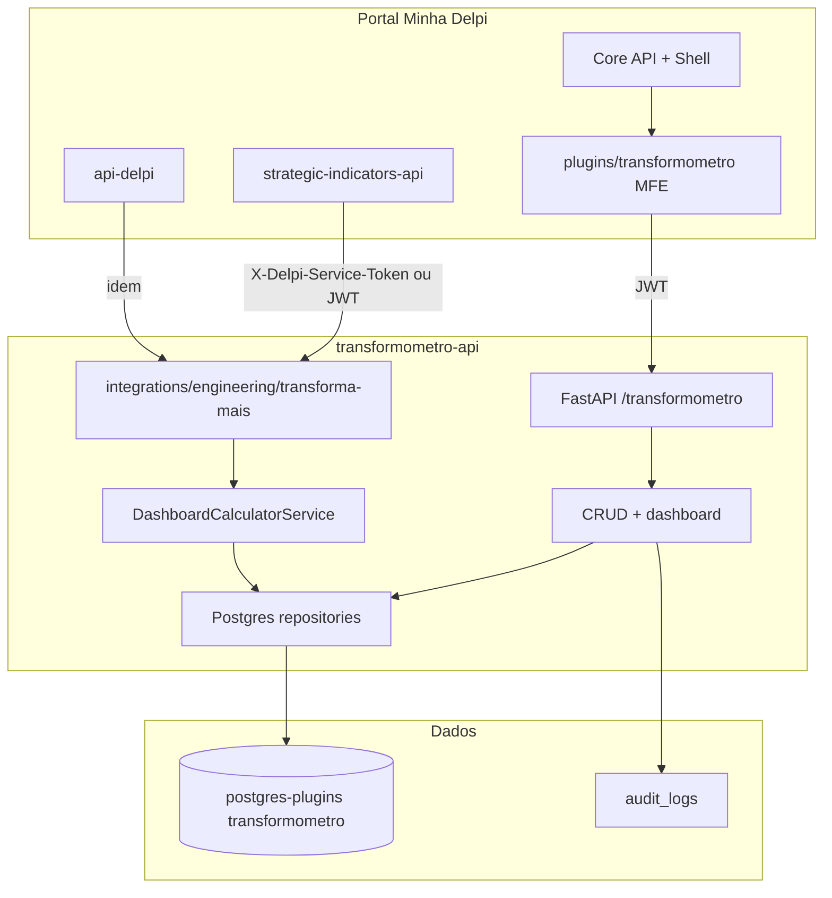

# Arquitetura — Transformômetro App

## Diagrama de contexto



## Estrutura de pastas (proposta)

```text
transformometro-api/
  tm_app/
    main.py
    config.py
    domain/
      entities/          # Processo, Revisao, Medicao, ...
      services/          # ProcessSummaryCalculator (migrado)
      ports/             # interfaces de repositório
    application/
      dto/
      use_cases/         # CreateProcesso, AtivarRevisao, RecalcularDashboard, ...
    infrastructure/
      persistence/
        postgres/        # implementações
      auth/              # JWT (shared delpi)
    interface/
      http/
        routes/          # routers por agregado
    migrations/          # V001__schema, V002__seed_catalogos, ...
  Dockerfile
  requirements.txt
  docs/

plugins/transformometro/
  transformometro.manifest.json
  src/
    bootstrap.tsx
    App.tsx
    data/api/            # clientes HTTP
    state/hooks/
    ui/
      pages/             # Processos, RevisaoDetalhe, Dashboard, Recursos
      components/
  vite.config.ts
  package.json
```

## Camadas da API

| Camada | Responsabilidade |
|--------|------------------|
| **interface/http** | Rotas REST, validação Pydantic, códigos HTTP, OpenAPI |
| **application** | Orquestração, transações, políticas (ativar revisão desativa outras) |
| **domain** | Entidades, calculador, regras de vigência e rateio |
| **infrastructure** | Postgres, auditoria, (opcional) job de recálculo |

Sem regra de negócio em controllers; calculador **puro** (testável com fixtures da planilha).

## Modelo de dados (PostgreSQL)

Schema sugerido: `transformometro`.

### Tabelas cadastrais

| Tabela | PK | Observação |
|--------|-----|------------|
| `processos` | `processo_id` UUID | `filial_id`, `versao_revisao` como `VARCHAR` |
| `revisoes` | `revisao_id` UUID | FK `processo_id`, unique `(processo_id, versao_revisao)` |
| `medicoes` | `medicao_id` UUID | FK `revisao_id`, 1:1 ou 1:N conforme evolução |
| `investimentos` | `investimento_id` UUID | `valor_total` calculado no backend |
| `recursos_compartilhados` | `recurso_compartilhado_id` UUID | |
| `revisao_recursos_compartilhados` | `vinculo_id` UUID | |

Todas com `deletado BOOLEAN DEFAULT false`, `created_at`, `updated_at` TIMESTAMPTZ.

### Tabela derivada

| Tabela | Chave lógica | Conteúdo |
|--------|--------------|----------|
| `dashboard_calculos` | `revisao_id` + `competencia` CHAR(7) | Colunas da spec §14 + índices por filial/setor/processo |

Recálculo:

1. Truncar/particionar competências afetadas, ou upsert por `(revisao_id, competencia)`
2. Gerar timeline de `min(data_inicio)` até mês atual
3. Para cada revisão elegível no mês, aplicar calculador com baseline resolvida
4. Persistir linha em `dashboard_calculos`

Trigger: `POST /transformometro/dashboard/recalcular` (admin) e/ou fila após mutações críticas (debounced).

## API REST (prefixo gateway)

Base: `/apps/transformometro-api/transformometro`

Alinhada à [ESPECIFICACAO.md §15](./ESPECIFICACAO.md), com convenção Delpi:

| Grupo | Endpoints |
|-------|-----------|
| Processos | `GET/POST /processos`, `GET/PUT/DELETE /processos/{id}` |
| Revisões | `GET/POST /revisoes`, `GET /processos/{id}/revisoes`, `POST /revisoes/{id}/ativar` |
| Medições | CRUD + `GET /revisoes/{id}/medicoes` |
| Investimentos | CRUD + cálculo `valor_total` |
| Recursos | CRUD recursos + vínculos |
| Dashboard | `GET /dashboard`, `/dashboard/resumo`, `/dashboard/evolucao`, `/dashboard/processos/{id}` |
| Catálogos | `GET /options/*` |
| Sistema | `GET /health` |
| Integrações | `GET /integrations/engineering/transforma-mais/processes`, `.../summary` |

**URL interna (Docker):** `http://transformometro-api:8000/transformometro/...`  
**URL pública (nginx):** `/apps/transformometro-api/transformometro/...`

Respostas envelope (padrão api-delpi):

```json
{ "success": true, "message": "...", "data": { } }
```

## Serviço de cálculo

Extrair e adaptar `ProcessSummaryCalculator`:

| Método atual | Uso no app |
|--------------|------------|
| `build_process_list` | Listagem com economia/dia (opcional cache) |
| `build_summary` | Cards resumo + série mensal |
| `_calculate_review_month_result` | Persistência em `dashboard_calculos` |

Ajustes para aderir à spec:

1. Incluir `economia_recursos_compartilhados` na economia bruta (delta baseline vs atual)
2. `economia_liquida_mes` sem subtrair custo compartilhado duas vezes
3. Investimento único só em ROI/payback acumulado na tabela derivada
4. Testes golden file com CSV exportado da planilha `193G5ff5...`

## Microfrontend

Manifesto `transformometro.manifest.json` (espelho do SI):

```json
{
  "id": "transformometro",
  "basePath": "/apps/transformometro",
  "entry": "/apps/transformometro/assets/remoteEntry.js",
  "backend": {
    "baseUrl": "/apps/transformometro-api/transformometro",
    "validateJwt": true
  },
  "ui": { "renderMode": "federated" }
}
```

### Telas (MVP → completo)

| Rota UI | Função |
|---------|--------|
| `/apps/transformometro` | Dashboard executivo (cards + gráficos + filtros) |
| `/apps/transformometro/processos` | Lista e filtros |
| `/apps/transformometro/processos/:id` | Detalhe: revisões, medições, investimentos, vínculos |
| `/apps/transformometro/recursos` | Cadastro recursos compartilhados |
| `/apps/transformometro/import` | (Fase 2) Import planilha |

Wizard sugerido no detalhe do processo: **Processo → Revisão → Medição → Investimentos → Vínculos**.

## Integração infra

Espelhar `strategic-indicators` em `infra/docker-compose.dev.yml`:

- Serviço `transformometro-api` (porta interna 8000, `TM_API_ROOT_PATH`)
- Serviço `transformometro` (Vite dev / build estático)
- Traefik/nginx: `/apps/transformometro` e `/apps/transformometro-api`
- Variáveis: `PLUGINS_DB_*`, `TM_DB_SCHEMA=transformometro`
- Registro Core API: `POST /core-api/admin/apps/register` com manifesto

## Auditoria

Tabela `audit_logs`:

- `entity_type`, `entity_id`, `action`, `user_id`, `payload_json`, `created_at`
- Gravada em PUT/POST/DELETE e em `recalcular`

Autenticação de usuários: **Keycloak** (sem tabela `usuarios` local, salvo cache de display name).

## Migração Sheets → Postgres

Script `scripts/migrate_transforma_mais_sheet.py`:

1. Export CSV por aba (mesmos GIDs de `infra/.env`)
2. Validar integridade referencial
3. Insert em transação
4. `POST /dashboard/recalcular`
5. Relatório de diff vs `dashboard_calculos` da planilha (se existir)

## Segurança

- JWT obrigatório em rotas de negócio
- Permissões por rota no manifesto
- `filial_id` opcional: filtrar dados por filial do usuário (fase posterior, igual SI `branch`)
