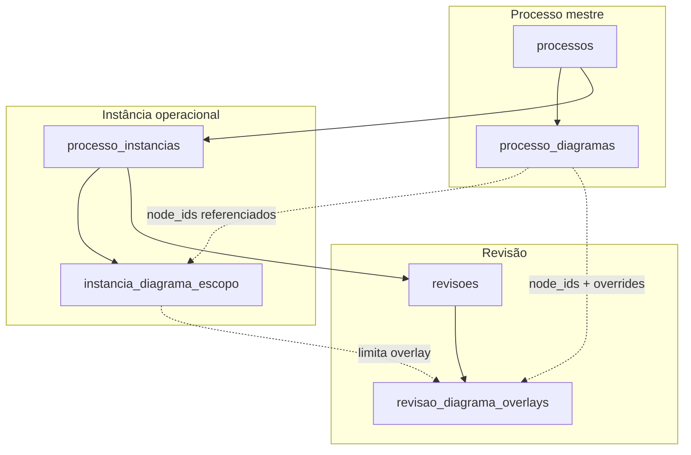
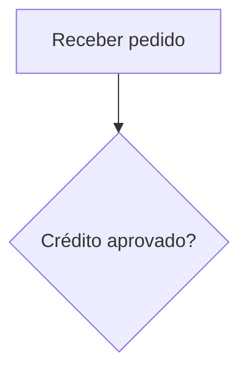

# Playbook 19 — Diagramas de processo (macro), escopo por instância e overlays por revisão

**Status:** entregue (jul/2026) — S0–S6 implementados · ver [playbook-19-implementation-status.md](../../../transformometro-api/docs/playbook-19-implementation-status.md)  
**Decisões fechadas (S0):**  
- **Diagrama-macro único por processo-mestre** — mapa canônico do fluxo end-to-end; nós com **ID estável**.  
- **Instância declara escopo** — subset de nós do macro (um ou mais subprocessos-chave).  
- **Revisão guarda overlay** — estado as-is / to-be **referenciando** nós do macro (override parcial ou visão completa do escopo).  
- **Formato canônico** — JSON estruturado (`flowchart_v1`, compatível com editor visual); **Mermaid derivado** (export/preview), não fonte única de edição no MVP.  
- **Editor MVP** — fluxograma estruturado (React Flow ou equivalente): formas padrão, textos, conexões; templates BPMN-lite.  

**Parent:** [`PLAYBOOK-MODELAGEM.md`](./PLAYBOOK-MODELAGEM.md) · [`PLAYBOOK-18-instancias-filial-setor-escopo.md`](./PLAYBOOK-18-instancias-filial-setor-escopo.md) · [`ARCHITECTURE.md`](./ARCHITECTURE.md)  
**Relacionado:** evidências V024 · `ChatMermaidBlock` (chat) · `IshikawaFishboneDiagram` (PAC — precedente de editor custom)

---

## 1. Problema observado

| Sintoma | Impacto |
|---------|---------|
| Revisão baseline/melhoria sem representação visual do fluxo | Usuário descreve as-is só em texto; difícil alinhar medição e investimento ao fluxo real |
| Macro-processo com várias instâncias (filial × departamento) | Cada instância trata **parte** do fluxo; não há mapa pai compartilhado |
| Evidências V024 aceitam PNG/PDF | Útil como anexo, mas **não editável**, sem referência entre revisões, sem diff estruturado |
| Duplicar processo para multi-unidade (legado) | Diagramas copiados manualmente; perde rastreio do «pedaço» do macro |
| Chat já renderiza Mermaid | Oportunidade de reutilizar preview; **não** substitui editor de negócio no Transformômetro |

**Princípio:** o **processo-mestre** possui o **diagrama-macro** (visão corporativa). Cada **instância** delimita **quais nós** do macro são relevantes naquele ambiente operacional. Cada **revisão** materializa o **estado do fluxo** (as-is na baseline, to-be na melhoria) como **overlay** sobre o macro/escopo — nunca um desenho órfão sem vínculo semântico.

---

## 2. Modelo de domínio alvo

### 2.1 Hierarquia lógica (diagramas)

```text
processo-mestre (processo_id)
  └── diagrama_macro (1 por processo; versão editável)
        ├── nodes[]  — id estável, tipo, rótulo, posição, metadados
        └── edges[]  — origem/destino, rótulo opcional

processo_instancias (instancia_id)
  └── escopo_diagrama
        └── node_ids[]  — subset de ids do macro (vazio = macro inteiro)

revisoes (revisao_id)
  └── diagrama_overlay
        ├── modo: full_scope | partial   — full = todos os nós do escopo da instância
        ├── node_overrides{}             — por node_id: rótulo, tipo, posição, estilo, removido?
        ├── edge_overrides{}             — adicionar/remover/alterar arestas locais à revisão
        ├── extra_nodes[] / extra_edges[] — só dentro do escopo da revisão (opcional S2+)
        └── mermaid_cached               — derivado; regerado no save
```

### 2.2 Grafo estendido (entidades cadastrais + diagramas)



### 2.3 Papéis e cardinalidade

| Artefato | Cardinalidade | Dono | Descrição |
|----------|---------------|------|-----------|
| **Diagrama macro** | 1:1 processo | `processo_id` | Mapa completo da iniciativa; editável por quem gerencia processos |
| **Escopo instância** | 1:1 instância | `instancia_id` | Lista de `node_id` do macro; default = todos os nós |
| **Overlay revisão** | 1:1 revisão | `revisao_id` | Estado visual as-is/to-be; herda escopo da instância |
| **Mermaid cache** | derivado | overlay/macro | Preview, export, integração; regerado server-side ou no save |

### 2.4 Regras de negócio

1. **`node_id` estável** — UUID ou slug técnico (`n_recebimento`, `n_aprovacao`); **nunca** reutilizar id após delete lógico (soft-disable no macro).
2. **Escopo instância** — todo `node_id` em escopo deve existir no macro do mesmo `processo_id`. Overlay de revisão **não** referencia nós fora do escopo da instância.
3. **Baseline** — overlay representa **as-is** (estado atual documentado). **Melhoria/automação/correção** — overlay representa **to-be** ou delta explícito vs baseline anterior (S3+).
4. **Alteração no macro** — se nó referenciado for desativado no macro, instâncias/revisões exibem aviso «nó removido do macro»; overlay preserva snapshot read-only até usuário reconciliar.
5. **Consolidado dashboard** — diagramas **não** entram no cálculo numérico; são documentação vinculada à revisão (como evidências).
6. **Auditoria** — create/update/delete de macro, escopo e overlay geram `audit_logs` (mesmo padrão V025).
7. **Backup JSON** — incluir macro + escopos + overlays no bundle (Playbook 18 I15); merge por UUID.

### 2.5 Tipos de nó (formas padrão — BPMN-lite)

| `tipo` | Forma UI | Uso |
|--------|----------|-----|
| `start` | Círculo / terminador | Início |
| `end` | Círculo duplo | Fim |
| `process` | Retângulo | Atividade |
| `decision` | Losango | Decisão |
| `document` | Documento | Entrada/saída documental |
| `data` | Paralelogramo | Dado/sistema |
| `subprocess` | Retângulo com + | Subfluxo (link futuro para outro macro) |
| `comment` | Nota | Texto livre ancorado |

Conexões: `edge` com `from_node_id`, `to_node_id`, `label` opcional (sim/não, condição).

---

## 3. Formato canônico (`flowchart_v1`)

### 3.1 Documento macro (exemplo reduzido)

```json
{
  "format": "flowchart_v1",
  "format_version": 1,
  "nodes": [
    {
      "id": "n_intake",
      "type": "process",
      "label": "Receber pedido",
      "position": { "x": 120, "y": 80 },
      "meta": { "sistema": "Protheus" }
    },
    {
      "id": "n_approve",
      "type": "decision",
      "label": "Crédito aprovado?",
      "position": { "x": 320, "y": 80 }
    }
  ],
  "edges": [
    { "id": "e1", "from": "n_intake", "to": "n_approve", "label": null }
  ]
}
```

### 3.2 Escopo instância

```json
{
  "node_ids": ["n_intake", "n_approve"],
  "inherit_all": false
}
```

`inherit_all: true` (default) = instância enxerga macro completo.

### 3.3 Overlay revisão

```json
{
  "format": "flowchart_overlay_v1",
  "node_overrides": {
    "n_intake": {
      "label": "Receber pedido (e-mail + planilha)",
      "highlight": "asis"
    }
  },
  "edge_overrides": {},
  "removed_node_ids": [],
  "removed_edge_ids": []
}
```

### 3.4 Mermaid (derivado)

Gerado por serviço transversal (`DiagramMermaidExportService`):



Regras de conversão:

- `decision` → `{}` no Mermaid; demais → `[]`.
- IDs Mermaid = `node_id` sanitizado (sem espaços).
- Overlay aplica **rótulos** do override antes de gerar.
- Escopo filtra nós/arestas não incluídos.

**Não** editar Mermaid manualmente no MVP como fonte primária — **jul/2026:** aba **Mermaid** no editor com preview ao vivo, edição de código e **Aplicar ao canvas** (round-trip best-effort via `flowchartToMermaid` / `mermaidToFlowchart` no MFE). JSON `flowchart_v1` permanece fonte de verdade.

---

## 4. UX / MFE (`plugins/transformometro`)

### 4.1 Onde aparece

| Tela | Seção | Modo |
|------|-------|------|
| `ProcessoDetailPage` | **Diagrama macro** (novo `EditableSectionCard`) | Editar mapa completo; templates «fluxo linear», «com decisão», «com documento» |
| `InstanciaDetailPage` | **Escopo no diagrama** | Multi-select de nós do macro (canvas com highlight); read-only preview do macro |
| `RevisaoCadastroPanel` | **Diagrama da revisão** | Canvas: macro/escopo em cinza + nós editáveis; toolbar formas padrão |

Posição sugerida na revisão: **após Vigência, antes de Medição** — contextualiza o cenário antes dos números.

### 4.2 Comportamento do editor (MVP)

- Paleta lateral: formas §2.5.
- Duplo clique no nó → editar texto.
- Arrastar nós; snap leve à grade.
- Conectar nós (handles).
- «Aplicar template» insere subgraph inicial.
- Modo leitura: SVG/canvas estático + botão «Exportar PNG» (opcional S1).
- Aba **Mermaid** — código derivado ao vivo + preview renderizado; **Aplicar ao canvas** / **Atualizar do canvas** (jul/2026)

### 4.3 Instância = parte do macro

Cenário típico:

- Macro: 12 nós (order-to-cash completo).
- Instância «Filial 01 × Engenharia»: escopo `{ n_design, n_release }`.
- Revisão baseline dessa instância: overlay as-is **só** nesses dois nós + arestas entre eles (e arestas de entrada/saída do escopo se marcadas «incluir fronteira»).

Flag opcional `include_boundary_edges` no escopo (S1): incluir arestas que cruzam a fronteira do subset.

### 4.4 Padrão de seção (alinhado ao cadastro atual)

Seguir [`RevisaoCadastroPanel`](../../../../plugins/transformometro/src/ui/pages/RevisaoCadastroPanel.tsx):

- `EditableSectionCard` + `useSectionEdit` (keys: `diagrama_macro`, `diagrama_escopo`, `diagrama_revisao`).
- Textos e hints em [`helpTooltips.ts`](../../../../plugins/transformometro/src/content/helpTooltips.ts) — **proibido** string PT no Python/TS de regra.
- Estilos em [`index.css`](../../../../plugins/transformometro/src/index.css) prefixo `.tm-diagram-*` (não patch local em página).

---

## 5. API e persistência (`transformometro-api`)

### 5.1 Migrations propostas

| Migration | Conteúdo |
|-----------|----------|
| **V026** | `processo_diagramas` (`processo_id` PK/FK, `conteudo` JSONB, `mermaid_cached` TEXT, timestamps) |
| **V027** | `instancia_diagrama_escopo` (`instancia_id` PK/FK, `node_ids` JSONB, `inherit_all` BOOL) |
| **V028** | `revisao_diagrama_overlays` (`revisao_id` PK/FK, `conteudo` JSONB, `mermaid_cached` TEXT) |

Sem volume em disco no MVP (JSONB Postgres). PNG exportado opcional → evidência V024 tipo `diagrama_export` (S2).

### 5.2 Endpoints REST

Prefixo `/transformometro` (mesmo envelope `ok` / `fail`):

| Método | Path | Descrição |
|--------|------|-----------|
| GET | `/processos/{id}/diagrama` | Macro; 404 → macro vazio |
| PUT | `/processos/{id}/diagrama` | Salva macro; regera Mermaid |
| GET | `/instancias/{id}/diagrama-escopo` | Escopo |
| PUT | `/instancias/{id}/diagrama-escopo` | Atualiza `node_ids` / `inherit_all` |
| GET | `/revisoes/{id}/diagrama` | Overlay **mesclado** (macro + escopo instância + overlay) para preview |
| GET | `/revisoes/{id}/diagrama/overlay` | Só overlay persistido |
| PUT | `/revisoes/{id}/diagrama/overlay` | Salva overlay |

Serviços:

- `ProcessoDiagramService` — validação `flowchart_v1`, merge, export Mermaid.
- `RevisaoDiagramMergeService` — compõe view final para UI e export.

Camadas: `routes/` fino → `application/services/` → `repositories/` (padrão evidências V024).

### 5.3 Validação

- JSON Schema interno ou validador Python para `flowchart_v1` / `flowchart_overlay_v1`.
- Rejeitar `node_id` duplicado, arestas para nós inexistentes, escopo com ids inválidos.
- Limite sugerido: 200 nós / 400 arestas por macro (configurável JSON catálogo).

---

## 6. Dependências frontend

| Pacote | Papel | Notas |
|--------|-------|-------|
| `@xyflow/react` (React Flow) | Editor + canvas | Lazy load na rota de diagrama (bundle MFE) |
| `mermaid` | Preview/export | Já usado no chat; alinhar versão major |
| (opcional S2) `html-to-image` | PNG client-side | Export rápido |

**Não** adicionar Excalidraw no MVP — escopo «desenho livre» conflita com referência por `node_id`; avaliar fase futura para anotações.

---

## 7. Integrações

| Consumidor | Contrato |
|------------|----------|
| **Backup JSON** | Seções `processo_diagramas`, `instancia_diagrama_escopos`, `revisao_diagrama_overlays` |
| **Audit timeline** | Eventos `diagram.macro.updated`, `diagram.scope.updated`, `diagram.overlay.updated` |
| **Evidências** | Export PNG do diagrama merged → upload opcional como evidência |
| **api-delpi / chat** | Fora do MVP; futuro: action OpenAPI retorna `mermaid_cached` da revisão ativa |
| **Comparativo revisões** | S2: diff visual entre overlays baseline vs melhoria (mesma instância) |

---

## 8. Roadmap por sprint

| Sprint | Entrega | Critério de pronto |
|--------|---------|-------------------|
| **S0 — Design lock** | Este playbook aprovado; JSON Schema `flowchart_v1` em `transformometro-api/docs/` | Product + engenharia assinam §2 e §3 |
| **S1 — Macro + API** | V026, CRUD macro, editor em `ProcessoDetailPage`, preview Mermaid, testes validação | I1, I2 |
| **S2 — Escopo instância** | V027, UI `InstanciaDetailPage`, merge parcial no GET revisão | I3, I4 |
| **S3 — Overlay revisão** | V028, seção `RevisaoCadastroPanel`, save/load overlay, merged preview | I5, I6 |
| **S4 — Backup + audit** | JSON import/export; audit; helpTooltips | I7, I8 |
| **S5 — Diff + export** | Comparativo baseline vs melhoria; PNG → evidência; templates extras | I9 | ✅ |
| **S6 — Editor BPMN-lite** | Swimlanes, tema claro/escuro, auto-layout, renomear/remover faixa, Delete | UX draw.io-like | ✅ |

**Dependências:** S1 → S2 → S3 linear; S4 após S3; S5 e S6 sobre S1.

### Editor visual (S6 — entregue)

| Recurso | Onde |
|---------|------|
| Paleta + templates (linear, decisão, BPMN + swimlanes) | Toolbar `FlowchartEditor` |
| Swimlanes (`lanes[]`, snap, faixa ativa) | `diagramSwimlanes.ts` + `FlowchartLaneNode` |
| Renomear / remover faixa | Toolbar + duplo clique no cabeçalho da faixa |
| Auto-layout por rank de fluxo | Botão «Auto-layout» |
| Tema claro/escuro | `useTransformometroDarkMode` + Mermaid `dark`/`neutral` |
| Excluir nó/aresta | `Delete` / `Backspace` |

**Fora de S6 (backlog):** swimlanes automáticas por unidade/departamento; import BPMN XML; layout colaborativo.

---

## 9. Critérios de aceite (I1–I9)

| ID | Cenário | Esperado |
|----|---------|----------|
| **I1** | Criar macro com 3 nós + 2 arestas | Persiste JSONB; Mermaid válido |
| **I2** | Editar rótulo de nó no macro | Revisões com overlay naquele nó exibem aviso «macro alterado» ou propagam conforme política (default: aviso) |
| **I3** | Instância escopo 2 de 5 nós | GET revisão merged só inclui subset |
| **I4** | Overlay altera rótulo de 1 nó | Preview revisão ≠ macro; overlay isolado preservado |
| **I5** | Baseline + melhoria mesma instância | Dois overlays distintos; comparativo S5 |
| **I6** | Instância multi-unidade (todas filiais) | Escopo independente por instância |
| **I7** | Export/import JSON | Macro + escopos + overlays round-trip |
| **I8** | Audit | Três operações registradas com `user_name` |
| **I9** | Template «fluxo linear» | Insere 4 nós conectados editáveis |

---

## 10. Mapa de arquivos (implementação)

### API

- `migrations/V026__processo_diagramas.sql`
- `migrations/V027__instancia_diagrama_escopo.sql`
- `migrations/V028__revisao_diagrama_overlays.sql`
- `tm_app/domain/diagram/flowchart_v1.py`
- `tm_app/application/services/diagram_mermaid_export_service.py`
- `tm_app/application/services/revisao_diagram_merge_service.py`
- `tm_app/infrastructure/persistence/repositories/processo_diagram_repository.py`
- `tm_app/infrastructure/persistence/repositories/instancia_diagram_escopo_repository.py`
- `tm_app/infrastructure/persistence/repositories/revisao_diagram_overlay_repository.py`
- `tm_app/interface/http/routes/diagram_routes.py`
- `tests/test_flowchart_v1.py`, `tests/test_diagram_mermaid_export_service.py`, `tests/test_revisao_diagram_merge_service.py`

Status detalhado: [playbook-19-implementation-status.md](../../../transformometro-api/docs/playbook-19-implementation-status.md).

### MFE

- `plugins/transformometro/src/components/diagram/FlowchartEditor.tsx` — editor canônico (lazy)
- `plugins/transformometro/src/components/diagram/FlowchartBpmnNode.tsx` — formas BPMN-lite
- `plugins/transformometro/src/components/diagram/FlowchartLaneNode.tsx` — swimlanes
- `plugins/transformometro/src/components/diagram/DiagramMermaidPreview.tsx`
- `plugins/transformometro/src/components/diagram/ProcessoDiagramSection.tsx`
- `plugins/transformometro/src/components/diagram/InstanciaDiagramEscopoSection.tsx`
- `plugins/transformometro/src/components/diagram/RevisaoDiagramSection.tsx`
- `plugins/transformometro/src/types/diagram.ts` — tipos + templates
- `plugins/transformometro/src/utils/diagramSwimlanes.ts`
- `plugins/transformometro/src/hooks/useTransformometroDarkMode.ts`
- `plugins/transformometro/src/data/api/transformometroDiagramApi.ts`

---

## 11. Riscos e mitigação

| Risco | Mitigação |
|-------|-----------|
| Macro editado quebra referências | IDs estáveis; soft-disable; aviso na UI; snapshot em overlay se necessário (S5) |
| Bundle MFE grande (React Flow) | Lazy route; chunk separado no Vite federation |
| Mermaid não expressa layout | Mermaid só preview; layout vive no JSON |
| Usuário quer desenho livre | Evidência PNG V024 paralela; Excalidraw fase futura |
| Conflito terminologia setor/departamento | UI já padronizada «Departamento»; diagramas agnósticos |
| Duplicação lógica merge API/MFE | **API** entrega merged view; MFE render-only |

---

## 12. Fora de escopo (este playbook)

- BPMN 2.0 XML import/export completo
- Simulação de tempos / capacity no diagrama
- Versionamento git-like do macro (branch/merge)
- Swimlanes **manuais** no editor (S6); swimlanes por filial/departamento **automáticas** (fase futura)
- Edição colaborativa tempo real
- LLM gerando diagrama a partir de texto (integração chat)

---

## 13. Referências

| Doc / módulo | Conteúdo |
|--------------|----------|
| [`PLAYBOOK-18`](./PLAYBOOK-18-instancias-filial-setor-escopo.md) | Instância × revisão |
| [`PLAYBOOK-MODELAGEM`](./PLAYBOOK-MODELAGEM.md) | Hierarquia mestre → instância → revisão |
| [`V024__revisao_evidencias.sql`](../../../../transformometro-api/migrations/V024__revisao_evidencias.sql) | Padrão anexo |
| [`revisao_evidence_routes.py`](../../../../transformometro-api/tm_app/interface/http/routes/revisao_evidence_routes.py) | Padrão rotas |
| [`RevisaoCadastroPanel.tsx`](../../../../plugins/transformometro/src/ui/pages/RevisaoCadastroPanel.tsx) | Padrão seções |
| [`ChatMermaidBlock.tsx`](../../../../plugins/minha-delpi-chat/src/ui/components/message/ChatMermaidBlock.tsx) | Preview Mermaid |

---

## 14. Resumo executivo

1. **Um diagrama-macro por processo** — mapa canônico com nós identificáveis.  
2. **Cada instância escolhe o subset** do macro que trata na operação.  
3. **Cada revisão persiste um overlay** (as-is / to-be) referenciando o macro/escopo — não um desenho isolado.  
4. **JSON estruturado é a fonte de verdade**; Mermaid é derivado para preview e integrações.  
5. **Implementar em 3 camadas** (macro → escopo → overlay) antes de diff, PNG e chat.  
6. **Editor S6** — swimlanes BPMN-lite, tema, auto-layout e gestão de faixas no MFE (`FlowchartEditor`).

**Próximo passo:** integração chat/api-delpi (Mermaid da revisão ativa) e swimlanes automáticas por cadastro — backlog pós-MVP.
