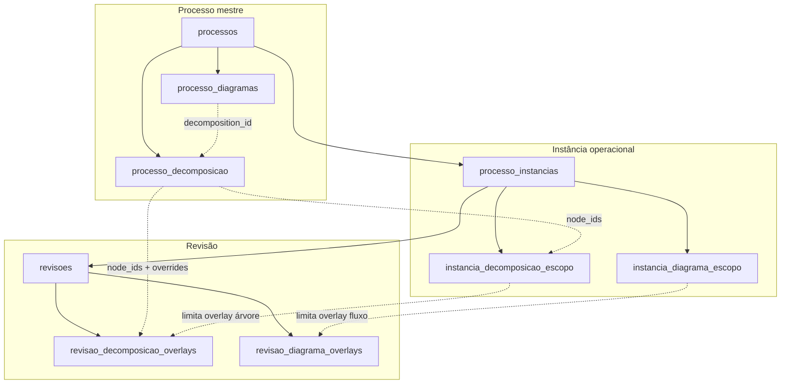

# Playbook 20 — Decomposição de processo (árvore), mapeamento tabular e vínculo com diagrama macro

**Status:** roadmap (jul/2026) — S0 design lock · S1–S6 pendentes  
**Decisões fechadas (S0):**  
- **Dois artefatos complementares por processo-mestre** — **árvore de decomposição** (`decomposition_tree_v1`, estrutura WBS) **+** **diagrama macro** (`flowchart_v1`, fluxo operacional — Playbook 19).  
- **Fonte de verdade da planilha de mapeamento** — árvore; export CSV/Excel é **derivado**, nunca editado manualmente como primário.  
- **Quatro níveis fixos sob o macroprocesso** — `processo_chave` → `tarefa` → `sub_tarefa` (departamento vem do cadastro; macroprocesso = processo-mestre).  
- **IDs estáveis** — cada nó da árvore possui `node_id` imutável; soft-disable ao remover; overlays e escopos referenciam por id.  
- **Vínculo opcional fluxo ↔ árvore** — nós do `flowchart_v1` referenciam nós da árvore via `meta.decomposition_id`; validação cruzada no save.  
- **Instância declara escopo na árvore** — subset de `processo_chave` (ou nós folha); revisão guarda overlay textual as-is/to-be sobre o escopo.  
- **Instâncias operacionais permanecem** (Playbook 18) — representam **as partes do macroprocesso onde a melhoria acontece** (unidade × departamento + timeline própria); árvore e fluxo no mestre **não substituem** instância/revisão/medição.  
- **Instância extensível** — além dos campos atuais (`rotulo`, escopos, setores), pode carregar **contexto operacional adicional** por instância (`instancia_contexto_v1`, JSONB) — responsáveis locais, observações de rollout, metadados por processo-chave no escopo, links, etc.  

**Parent:** [`PLAYBOOK-MODELAGEM.md`](./PLAYBOOK-MODELAGEM.md) · [`PLAYBOOK-18-instancias-filial-setor-escopo.md`](./PLAYBOOK-18-instancias-filial-setor-escopo.md) · [`PLAYBOOK-19-diagramas-processo-revisao-escopo.md`](./PLAYBOOK-19-diagramas-processo-revisao-escopo.md) · [`ARCHITECTURE.md`](./ARCHITECTURE.md)  
**Relacionado:** planilha legado de mapeamento (Departamento × Macroprocesso × Processo-chave × Sub-tarefas) · [`TUTORIAL-USUARIO.md`](./TUTORIAL-USUARIO.md)

---

## 1. Problema observado

| Sintoma | Impacto |
|---------|---------|
| Planilha de mapeamento mantida fora do sistema | Departamento, macroprocesso, processo-chave e sub-tarefas **desconectados** do cadastro, medições e revisões |
| Diagrama macro (Playbook 19) modela **fluxo**, não **decomposição** | Impossível gerar automaticamente a tabela «nº Processo-chave / Sub-tarefas» do print operacional |
| Nó `subprocess` no fluxo sem drill-down | Forma visual existe; **sem** árvore filha nem export tabular |
| Escopo de instância só por nó de fluxo | Difícil declarar «esta filial trata processos-chave 1, 3 e 5» em linguagem de negócio |
| Auditoria e backup | Mapeamento fora do JSON de backup; perde rastreio entre revisões |
| Medições futuras por etapa | Sem chave estável por processo-chave/sub-tarefa, ROI granular fica inviável (fase futura) |

**Princípio:** o **processo-mestre** (macroprocesso) possui **dois mapas canônicos**:

1. **Árvore de decomposição** — *o que* compõe o processo (estrutura, WBS, planilha de mapeamento).  
2. **Diagrama macro de fluxo** — *como* o trabalho flui (sequência, decisões, handoffs — Playbook 19).

Cada **instância** delimita **quais ramos** da árvore e **quais nós de fluxo** são relevantes **naquele ambiente operacional** — e concentra **baseline, melhorias, medições e investimentos** (Playbook 18). Cada **revisão** materializa **as-is / to-be** nos dois artefatos, sempre por referência a ids estáveis — nunca documentos órfãos.

> **Importante:** o Playbook 20 **adiciona** mapeamento e escopo semântico ao macroprocesso; **não elimina** instâncias. Uma instância continua sendo a unidade onde se declara *«esta unidade/departamento melhora estes processos-chave deste macro»*.

---

## 2. Modelo de domínio alvo

### 2.1 Hierarquia lógica (decomposição + fluxo)

```text
processo-mestre (processo_id) — macroprocesso
  ├── decomposicao (1 por processo; árvore editável)
  │     └── nodes[] — node_id, level, ordem, label, parent_id, meta
  │
  └── diagrama_macro (1 por processo — Playbook 19)
        └── nodes[].meta.decomposition_id → node_id da árvore (opcional)

processo_instancias (instancia_id) — parte operacional melhorada do macro
  ├── cadastro (filial, setores, rotulo, status — PB18)
  ├── instancia_contexto (opcional — metadados operacionais extras, JSONB)
  ├── escopo_decomposicao
  │     └── node_ids[] — quais processos-chave/sub-tarefas esta instância trata
  ├── escopo_diagrama (existente PB19)
  │     └── node_ids[] — subset do fluxo
  └── revisoes[] — timeline própria (baseline → melhorias)
        ├── decomposicao_overlay
        ├── diagrama_overlay
        ├── medicao / investimentos / recursos (PB18)
        └── ...
```

### 2.2 Grafo estendido



### 2.3 Papéis e cardinalidade

| Artefato | Cardinalidade | Dono | Descrição |
|----------|---------------|------|-----------|
| **Árvore de decomposição** | 1:1 processo | `processo_id` | WBS completa do macroprocesso |
| **Instância operacional** | N:1 processo | `instancia_id` | **Onde a melhoria acontece** — unidade × departamento(s); timeline de revisões; escopos na árvore e no fluxo |
| **Contexto instância** | 0:1 instância | `instancia_id` | Metadados operacionais extras (`instancia_contexto_v1` JSONB) — além de rotulo/status |
| **Escopo decomposição instância** | 1:1 instância | `instancia_id` | Subset de nós (tipicamente processos-chave) **desta** melhoria operacional |
| **Overlay decomposição revisão** | 1:1 revisão | `revisao_id` | Rótulos/descrições as-is/to-be na árvore |
| **Diagrama macro** | 1:1 processo | `processo_id` | Fluxo end-to-end (PB19) |
| **Export tabular** | derivado | árvore + instância | CSV/Excel no formato planilha operacional |
| **Export árvore** | derivado | árvore | JSON flat, Markdown outline, PNG (opcional S5) |

### 2.4 Níveis da árvore (vocabulário fixo)

| `level` | Rótulo UI | Coluna planilha legado | Exemplo (LMP / Engenharia) |
|---------|-----------|------------------------|----------------------------|
| — | *(raiz implícita)* | Macroprocesso | «LMP – Lançamento ou Modificação de Produto» |
| `processo_chave` | Processo-chave | Processo-Chave + nº | «Recebimento e qualificação da demanda via CRM» |
| `tarefa` | Tarefa | *(opcional na planilha)* | «Validar cadastro no CRM» |
| `sub_tarefa` | Sub-tarefa | Sub-tarefas + nº | «Receber notificação do CRM sobre nova demanda» |

**Regras estruturais:**

1. Raiz lógica = processo-mestre (não persiste nó `level=macro`; nome vem de `processos.nome_processo`).
2. Filhos de raiz = apenas `processo_chave` (`parent_id` null).
3. `tarefa` → filho de `processo_chave`; `sub_tarefa` → filho de `tarefa` **ou** diretamente de `processo_chave` (planilha legado omite nível tarefa).
4. **Profundidade máxima:** 3 níveis sob raiz (`processo_chave` → `tarefa` → `sub_tarefa`).
5. **`ordem`** — inteiro ≥ 1 **por irmãos** (mesmo `parent_id`); define colunas «nº Processo-chave» e «nº Sub-tarefa» no export.
6. **`node_id` estável** — slug ou UUID (`pk_recebimento`, `st_crm_notificacao`); soft-disable via `disabled: true`; nunca reutilizar id.

### 2.5 Regras de negócio

1. **Departamento no export** — vem do **setor da instância** (ou lista de setores vinculados); não duplicar na árvore salvo `meta.departamento_override` explícito (exceção multi-dept).
2. **Escopo instância** — todo `node_id` em escopo deve existir na árvore do mesmo `processo_id`. Incluir ancestral automaticamente na **view merged** (UI mostra caminho completo).
3. **Overlay revisão** — só altera nós dentro do escopo da instância; baseline = as-is; melhoria/automação/correção = to-be.
4. **Vínculo fluxo** — `flowchart_v1.nodes[].meta.decomposition_id` deve apontar para nó existente e não desabilitado; tipo sugerido: `subprocess` → `processo_chave`, `process` → `tarefa` ou `sub_tarefa` (warning se divergir, não block no MVP).
5. **Alteração na árvore** — nó desabilitado → aviso em escopos/overlays/fluxo vinculados; overlay preserva snapshot read-only até reconciliação.
6. **Dashboard** — árvore **não** entra no cálculo numérico na Fase 1 deste playbook (documentação; medição por etapa = backlog).
7. **Auditoria** — `decomposition.updated`, `decomposition.scope.updated`, `decomposition.overlay.updated`.
8. **Backup JSON** — incluir `processo_decomposicao`, escopos e overlays; merge por `node_id` / UUID.

### 2.6 Relação com Playbook 19 (fluxo)

| Pergunta de negócio | Artefato |
|---------------------|----------|
| Quais são os processos-chave e sub-tarefas? | **Árvore** |
| Em que ordem e com quais decisões o trabalho flui? | **Diagrama macro** |
| Qual filial executa quais processos-chave? | **Escopo decomposição** na instância |
| Como era / como ficará o fluxo? | **Overlay diagrama** na revisão |
| Como era / como ficará o mapeamento textual? | **Overlay decomposição** na revisão |

**Não** tentar derivar árvore completa só a partir do fluxo no MVP — heurística «agrupar por subprocess» fica como **assistente de rascunho** (S5 opcional), não fonte de verdade.

### 2.7 Instâncias operacionais — papel preservado e enriquecido (Playbook 18)

O macroprocesso descreve o **mapa corporativo completo** (árvore + fluxo). A **instância** descreve **qual fatia desse macro está sendo transformada** em um ambiente concreto e **como** essa transformação evolui no tempo.

```text
Macroprocesso LMP (processo-mestre)
  ├── árvore: processos-chave 1…11 + sub-tarefas
  └── fluxo: handoffs end-to-end

Instância «Engenharia — SC»     → escopo: PK 2, 4, 5 (BOM, desenho, revisão técnica)
Instância «Comercial — SC»       → escopo: PK 1 (CRM)
Instância «PCP — todas filiais»  → escopo: PK 8, 9 (roteiro, programação)
```

Cada instância mantém **timeline própria** de revisões, medições, investimentos e recursos — regra inalterada do Playbook 18. O dashboard e o ROI continuam calculados por **revisão** dentro da instância.

#### O que a instância passa a expressar (além do cadastro atual)

| Dimensão | Hoje (PB18) | Com Playbook 20 |
|----------|-------------|-----------------|
| Onde opera | `filial_id`, `setor_ids`, `todas_filiais_ativas` | Idem |
| Rótulo / status | `rotulo_instancia`, `status_instancia` | Idem |
| **O quê do macro** | *(implícito no escopo do fluxo PB19)* | **Escopo decomposição** — processos-chave explícitos |
| **Como flui localmente** | Escopo diagrama (PB19) | Idem; pode ser subset do escopo WBS |
| **Contexto operacional extra** | Limitado | **`instancia_contexto_v1`** (JSONB) — ver abaixo |
| Melhoria / números | Revisões → medição, investimentos | Idem; overlays WBS + fluxo por revisão |

#### Formato `instancia_contexto_v1` (extensão instância — S3+)

Documento opcional por instância — **não** duplica árvore nem substitui revisão; enriquece o **recorte operacional**:

```json
{
  "format": "instancia_contexto_v1",
  "format_version": 1,
  "observacoes_rollout": "Rollout Q3 — piloto Engenharia SC antes de ES.",
  "responsavel_local": "Coordenação Engenharia de Produto",
  "contato": "engenharia.sc@empresa.com.br",
  "node_notes": {
    "pk_bom_totvs": {
      "observacao": "Nesta filial BOM ainda parcialmente manual.",
      "responsavel": "Eng. Mecânica",
      "sistema_local": "TOTVS Protheus"
    }
  },
  "links": [
    { "titulo": "Wiki procedimento BOM", "url": "https://..." }
  ],
  "meta": {}
}
```

**Regras:**

1. Chaves em `node_notes` devem referenciar `node_id` **dentro do escopo decomposição** da instância.
2. Export planilha usa departamento/setor da instância + escopo — `node_notes` aparecem como colunas opcionais ou anexo (S2+).
3. Duplicar instância copia escopos + contexto (como revisões hoje); usuário ajusta filial/setor após duplicar.
4. Colaboração (PB29): seções `decomposicao_escopo`, `instancia_contexto` com trava soft independente.

#### Cenários típicos

| Cenário | Instâncias | Escopo WBS |
|---------|------------|------------|
| LMP completo em Engenharia | 1 instância multi-setor | Todos os PK ou subset |
| Rollout por departamento | N instâncias (Comercial, Eng., PCP…) | Cada uma com PK distintos |
| Mesma melhoria multi-filial idêntica | 1 instância `todas_filiais_ativas` | Mesmo escopo; dashboard consolidado multiplica economia operacional |
| Piloto em uma filial | Instância filial 01; depois duplicar para 02 | Escopo igual; contexto local diferente em `node_notes` |

#### O que **não** muda

- Cálculo financeiro por **revisão** (`revisao_id`) — instância continua agrupadora operacional, não unidade de cálculo alternativa.
- Processo-mestre **único** por iniciativa — não criar «sub-processos» cadastrais separados por processo-chave.
- RBAC por filial (PB18 S10) — instância respeita escopo de acesso existente.

---

## 3. Formato canônico (`decomposition_tree_v1`)

Schema: [`decomposition_tree_v1.schema.json`](../../../transformometro-api/docs/decomposition_tree_v1.schema.json)

### 3.1 Documento árvore (exemplo reduzido — LMP)

```json
{
  "format": "decomposition_tree_v1",
  "format_version": 1,
  "nodes": [
    {
      "id": "pk_recebimento_crm",
      "level": "processo_chave",
      "ordem": 1,
      "label": "Recebimento e qualificação da demanda via CRM",
      "parent_id": null,
      "descricao": "Entrada e triagem de demandas comerciais.",
      "meta": { "sistema": "CRM", "responsavel": "Comercial" }
    },
    {
      "id": "st_crm_notificacao",
      "level": "sub_tarefa",
      "ordem": 1,
      "label": "Receber notificação do CRM sobre nova demanda",
      "parent_id": "pk_recebimento_crm",
      "descricao": null
    },
    {
      "id": "st_crm_validar_campos",
      "level": "sub_tarefa",
      "ordem": 2,
      "label": "Validar se todas as informações obrigatórias foram preenchidas",
      "parent_id": "pk_recebimento_crm"
    },
    {
      "id": "pk_bom_totvs",
      "level": "processo_chave",
      "ordem": 2,
      "label": "Montagem da Estrutura (BOM) no TOTVS",
      "parent_id": null
    }
  ]
}
```

### 3.2 Escopo instância (decomposição)

```json
{
  "node_ids": ["pk_recebimento_crm", "pk_bom_totvs"],
  "inherit_all": false,
  "include_descendants": true
}
```

- `inherit_all: true` (default) = instância enxerga árvore completa.  
- `include_descendants: true` — ao selecionar processo-chave, inclui tarefas/sub-tarefas filhas no escopo efetivo.

### 3.3 Overlay revisão (decomposição)

```json
{
  "format": "decomposition_overlay_v1",
  "format_version": 1,
  "node_overrides": {
    "st_crm_notificacao": {
      "label": "Receber notificação automática do CRM (Power Automate)",
      "descricao": "As-is: e-mail manual do comercial.",
      "highlight": "tobe"
    }
  },
  "disabled_node_ids": []
}
```

### 3.4 Vínculo no fluxo (`flowchart_v1`)

```json
{
  "id": "n_intake",
  "type": "subprocess",
  "label": "Recebimento CRM",
  "position": { "x": 120, "y": 80 },
  "meta": {
    "decomposition_id": "pk_recebimento_crm"
  }
}
```

### 3.5 Export tabular derivado (flat row)

Serviço `DecompositionFlatExportService` — uma linha por **folha** (`sub_tarefa`) ou por **tarefa** se não houver filhos:

| Coluna | Origem |
|--------|--------|
| Departamento | `setores.nome` da instância (ou concatenado) |
| Macroprocesso | `processos.nome_processo` |
| nº Processo-chave | `ordem` do ancestral `processo_chave` |
| Processo-Chave | `label` merged do `processo_chave` |
| nº Sub-tarefa | `ordem` do nó folha (ou tarefa) |
| Sub-tarefas | `label` merged do nó folha |
| node_id | id técnico (coluna opcional export técnico) |
| revisao / highlight | overlay revisão se export contextual |

**Modo planilha legado (default):** omitir nível `tarefa` intermedário — folhas `sub_tarefa` ligadas direto ao `processo_chave` aparecem como no print.

---

## 4. UX / MFE (`plugins/transformometro`)

### 4.1 Onde aparece

| Tela | Seção | Modo |
|------|-------|------|
| `ProcessoDetailPage` | **Mapeamento do processo** (árvore) — novo card | Editor árvore + preview tabela + export CSV |
| `ProcessoDetailPage` | **Diagrama macro** (existente PB19) | Indicador visual se nó tem `decomposition_id` |
| `InstanciaDetailPage` | **Escopo no mapeamento** | Multi-select processos-chave (árvore compacta) |
| `InstanciaDetailPage` | **Contexto operacional** (S3+) | Observações de rollout, responsáveis, notas por processo-chave |
| `InstanciaDetailPage` | **Escopo no diagrama** (existente) | Mantido; banner se escopos WBS × fluxo divergirem |
| `RevisaoCadastroPanel` | **Mapeamento da revisão** | Árvore read-only + overrides de rótulo/descrição |
| `RevisaoCadastroPanel` | **Diagrama da revisão** (existente) | Link «ir para nó mapeado» quando `decomposition_id` |

Posição sugerida no processo-mestre: **Mapeamento** antes de **Diagrama macro** (estrutura antes do fluxo).

### 4.2 Editor de árvore (MVP)

Componente `DecompositionTreeEditor` (novo):

| Recurso | Comportamento |
|---------|---------------|
| Visualização | Árvore indentada **ou** org-chart vertical (React Flow tree layout / `@xyflow/react` com `layout: 'dagre'`) |
| Adicionar | Toolbar: + Processo-chave, + Tarefa, + Sub-tarefa (contexto = nó selecionado) |
| Editar | Inline no rótulo; painel lateral para descrição e meta |
| Reordenar | Drag-and-drop entre irmãos; recalcula `ordem` |
| Excluir | Soft-disable; confirma se há vínculo no fluxo |
| Ações | Mesma seção PB19: excluir, mover (reordenar), copiar, duplicar ramo |
| Preview | Aba «Planilha» — tabela flat sincronizada (read-only) |
| Export | Botões CSV e Excel (.xlsx client-side ou endpoint) |

**Não** usar planilha editável como fonte primária — tabela é **preview/export** somente.

### 4.3 Padrão de seção

- `EditableSectionCard` + `useCollaborativeSectionEdit` (keys: `decomposicao`, `decomposicao_escopo`, `decomposicao_revisao`).
- Textos em [`helpTooltips.ts`](../../../../plugins/transformometro/src/content/helpTooltips.ts).
- Estilos `.tm-decomposition-*` em [`index.css`](../../../../plugins/transformometro/src/index.css).

### 4.4 Assistente rascunho (S5 — opcional)

Botão «Sugerir mapeamento a partir do fluxo»:

1. Nós `type=subprocess` → candidatos a `processo_chave`.  
2. Nós `type=process` adjacentes → candidatos a `sub_tarefa`.  
3. Usuário **revisa e confirma** antes de persistir — nunca overwrite silencioso.

---

## 5. API e persistência (`transformometro-api`)

### 5.1 Migrations propostas

| Migration | Conteúdo |
|-----------|----------|
| **V030** | `processo_decomposicao` (`processo_id` PK/FK, `conteudo` JSONB, timestamps) |
| **V031** | `instancia_decomposicao_escopo` (`instancia_id` PK/FK, `node_ids` JSONB, `inherit_all`, `include_descendants`) |
| **V032** | `revisao_decomposicao_overlays` (`revisao_id` PK/FK, `conteudo` JSONB) |
| **V033** (S3+) | `processo_instancias.contexto` JSONB nullable — `instancia_contexto_v1` |

Sem volume em disco — JSONB Postgres (mesmo padrão V026–V028).

### 5.2 Endpoints REST

Prefixo `/transformometro`:

| Método | Path | Descrição |
|--------|------|-----------|
| GET | `/processos/{id}/decomposicao` | Árvore; 404 → árvore vazia |
| PUT | `/processos/{id}/decomposicao` | Salva árvore; valida schema |
| GET | `/processos/{id}/decomposicao/export.csv` | Export flat (query: `instancia_id`, `revisao_id` opcional) |
| GET | `/processos/{id}/decomposicao/export.xlsx` | Idem Excel (S2+) |
| GET | `/instancias/{id}/decomposicao-escopo` | Escopo WBS |
| PUT | `/instancias/{id}/decomposicao-escopo` | Atualiza escopo WBS |
| GET | `/instancias/{id}/contexto` | Contexto operacional extra (S3+) |
| PUT | `/instancias/{id}/contexto` | Atualiza `instancia_contexto_v1` |
| GET | `/revisoes/{id}/decomposicao` | Árvore **mesclada** (macro + escopo instância + overlay) |
| GET | `/revisoes/{id}/decomposicao/overlay` | Só overlay persistido |
| PUT | `/revisoes/{id}/decomposicao/overlay` | Salva overlay |
| POST | `/processos/{id}/decomposicao/validar-vinculos-fluxo` | Cruza `decomposition_id` do diagrama macro |

Serviços:

- `ProcessoDecompositionService` — CRUD, validação, ordenação.  
- `DecompositionFlatExportService` — gera CSV/Excel.  
- `RevisaoDecompositionMergeService` — view merged para UI.  
- `DecompositionFlowchartLinkValidator` — warnings cruzados PB19 ↔ PB20.

Camadas: routes fino → application/services → repositories.

### 5.3 Validação

- JSON Schema `decomposition_tree_v1` / `decomposition_overlay_v1`.  
- Rejeitar: `parent_id` inválido, ciclos, `level` inconsistente com pai, `ordem` duplicada entre irmãos.  
- Limites sugeridos: 50 processos-chave, 500 nós totais por processo (configurável em catálogo JSON).  
- Gate: `--check-decomposition` em script de audit (S4).

---

## 6. Dependências frontend

| Pacote | Papel | Notas |
|--------|-------|-------|
| `@xyflow/react` | Editor árvore (layout tree) **ou** componente tree table | Reutilizar chunk lazy do PB19 quando possível |
| `@tanstack/react-table` (opcional) | Preview planilha | Se já no monorepo; senão tabela DS nativa |
| `xlsx` / `sheetjs` (opcional S2) | Export Excel client-side | Avaliar peso bundle; preferir endpoint S2 |

**Não** embedar Excel/Google Sheets como editor.

---

## 7. Integrações

| Consumidor | Contrato |
|------------|----------|
| **Backup JSON** | Seções `processo_decomposicao`, `instancia_decomposicao_escopos`, `revisao_decomposicao_overlays` |
| **Audit timeline** | Eventos §2.5 |
| **Diagrama macro PB19** | `meta.decomposition_id`; tooltip no MFE «Processo-chave: …» |
| **Evidências V024** | Export CSV/Excel anexo opcional |
| **Chat / api-delpi** | Fora MVP; futuro: action retorna árvore merged da revisão ativa |
| **Medição por etapa** | Backlog — FK futura `medicao.processo_chave_node_id` |

---

## 8. Roadmap por sprint

| Sprint | Entrega | Critério de pronto |
|--------|---------|-------------------|
| **S0 — Design lock** | Este playbook + JSON Schema + ADR | Product + eng assinam §2–§3 |
| **S1 — Árvore + API** | V030, CRUD, editor árvore em `ProcessoDetailPage`, preview tabela | J1, J2 |
| **S2 — Export planilha** | CSV + Excel endpoint; botões no MFE | J3 |
| **S3 — Escopo instância + contexto** | V031, V033, UI instância (escopo WBS + contexto operacional), merge GET revisão | J4, J5, J11 |
| **S4 — Overlay revisão + backup** | V032, seção revisão, JSON import/export, audit | J6, J7 |
| **S5 — Vínculo fluxo + assistente** | Validação cruzada; sugestão rascunho a partir do fluxo; tooltip no editor fluxo | J8, J9 |
| **S6 — Colaboração + polish** | Trava soft PB29 nas novas seções; diff textual baseline vs melhoria | J10 |

**Dependências:** S1 → S2; S1 → S3 → S4 linear; S5 após S1 + PB19; S6 após S4 + colaboração existente.

---

## 9. Critérios de aceite (J1–J10)

| ID | Cenário | Esperado |
|----|---------|----------|
| **J1** | Cadastrar árvore LMP com 3 processos-chave e 8 sub-tarefas | Persiste JSONB; ordem correta |
| **J2** | Export CSV com `instancia_id` Engenharia | Colunas iguais ao print legado |
| **J3** | Instância escopo 2 de 5 processos-chave | Export e merged revisão só incluem subset + descendentes |
| **J4** | Overlay revisão altera rótulo sub-tarefa | Export contextual reflete to-be; overlay isolado preservado |
| **J5** | Nó fluxo com `decomposition_id` inválido | PUT diagrama retorna warning listável |
| **J6** | Soft-disable processo-chave referenciado no fluxo | UI aviso; export marca como «removido» |
| **J7** | Export/import JSON | Árvore + escopos + overlays round-trip |
| **J8** | Audit | Três operações com `user_name` |
| **J9** | Assistente rascunho a partir de fluxo com 2 subprocessos | Gera 2 processos-chave editáveis, não persiste sem confirmar |
| **J10** | Dois usuários editando mapeamento | Banner colaboração + resync WS (PB29) |
| **J11** | Instância Engenharia escopo 3 PK + `node_notes` | Export CSV filtra subset; contexto local visível na UI instância |

---

## 10. Mapa de arquivos (implementação prevista)

### API

- `migrations/V030__processo_decomposicao.sql`
- `migrations/V031__instancia_decomposicao_escopo.sql`
- `migrations/V032__revisao_decomposicao_overlays.sql`
- `tm_app/domain/decomposition/decomposition_tree_v1.py`
- `tm_app/application/services/processo_decomposition_service.py`
- `tm_app/application/services/decomposition_flat_export_service.py`
- `tm_app/application/services/revisao_decomposition_merge_service.py`
- `tm_app/application/services/decomposition_flowchart_link_validator.py`
- `tm_app/infrastructure/persistence/repositories/processo_decomposition_repository.py`
- `tm_app/infrastructure/persistence/repositories/instancia_decomposition_escopo_repository.py`
- `tm_app/infrastructure/persistence/repositories/revisao_decomposition_overlay_repository.py`
- `tm_app/interface/http/routes/decomposition_routes.py`
- `tests/test_decomposition_tree_v1.py`
- `tests/test_decomposition_flat_export_service.py`
- `tests/test_revisao_decomposition_merge_service.py`

Status: [`playbook-20-implementation-status.md`](../../../transformometro-api/docs/playbook-20-implementation-status.md)

### MFE

- `plugins/transformometro/src/components/decomposition/DecompositionTreeEditor.tsx`
- `plugins/transformometro/src/components/decomposition/DecompositionFlatPreview.tsx`
- `plugins/transformometro/src/components/decomposition/ProcessoDecompositionSection.tsx`
- `plugins/transformometro/src/components/decomposition/InstanciaDecompositionEscopoSection.tsx`
- `plugins/transformometro/src/components/decomposition/RevisaoDecompositionSection.tsx`
- `plugins/transformometro/src/types/decomposition.ts`
- `plugins/transformometro/src/data/api/transformometroDecompositionApi.ts`

---

## 11. Riscos e mitigação

| Risco | Mitigação |
|-------|-----------|
| Duplicar conceito «processo» (mestre vs processo-chave) | Vocabulário UI: **Macroprocesso** (mestre) vs **Processo-chave** (nível árvore) |
| Usuário editar só fluxo e ignorar árvore | Export planilha exige árvore; banner «mapeamento incompleto» se vazia |
| Árvore e fluxo divergem | Validador cruzado + assistente rascunho; não sync automático |
| Bundle MFE | Lazy load `DecompositionTreeEditor`; chunk separado |
| Planilha legado sem nível tarefa | Permitir `sub_tarefa` filha direta de `processo_chave` |
| Performance export grande | Paginação CSV; limite 500 nós |

---

## 12. Fora de escopo (este playbook)

- Medição/ROI **por processo-chave** (FK na medição — fase futura)
- SIPOC, RACI, matriz de responsabilidade automática
- Import direto de Excel legado como fonte primária (S2+ pode ter **import assistido** one-shot)
- Versionamento branch/merge da árvore
- LLM gerando árvore a partir de texto livre
- Substituir diagrama macro por árvore — **coexistem**

---

## 13. Referências

| Doc / módulo | Conteúdo |
|--------------|----------|
| [`PLAYBOOK-19`](./PLAYBOOK-19-diagramas-processo-revisao-escopo.md) | Diagrama macro, escopo fluxo, overlay fluxo |
| [`PLAYBOOK-18`](./PLAYBOOK-18-instancias-filial-setor-escopo.md) | Instância × departamento |
| [`adr-decomposicao-processo.md`](../../../transformometro-api/docs/adr-decomposicao-processo.md) | ADR técnico |
| [`decomposition_tree_v1.schema.json`](../../../transformometro-api/docs/decomposition_tree_v1.schema.json) | Schema árvore |
| [`TUTORIAL-USUARIO.md`](./TUTORIAL-USUARIO.md) | Guia operacional |

---

## 14. Resumo executivo

1. **Macroprocesso = processo-mestre** — mapa corporativo (árvore + fluxo).  
2. **Instância = onde a melhoria acontece** — unidade × departamento + escopos + timeline de revisões (**permanece** Playbook 18).  
3. **Árvore de decomposição** — fonte da planilha Departamento × Processo-chave × Sub-tarefas.  
4. **Diagrama macro (PB19)** — fluxo operacional; vincula-se à árvore por `decomposition_id`.  
5. **Instância escolhe ramos** (WBS + fluxo) e pode carregar **contexto operacional extra**; **revisão guarda as-is/to-be** nos dois artefatos.  
6. **Export tabular derivado** — atende o print operacional; filtrado por instância/escopo.  
7. **Implementar S1–S4** antes de vínculo fluxo, assistente heurístico e medição granular.

**Próximo passo:** aprovar S0 → publicar schema + ADR → V030 + editor árvore mínimo + export CSV.
