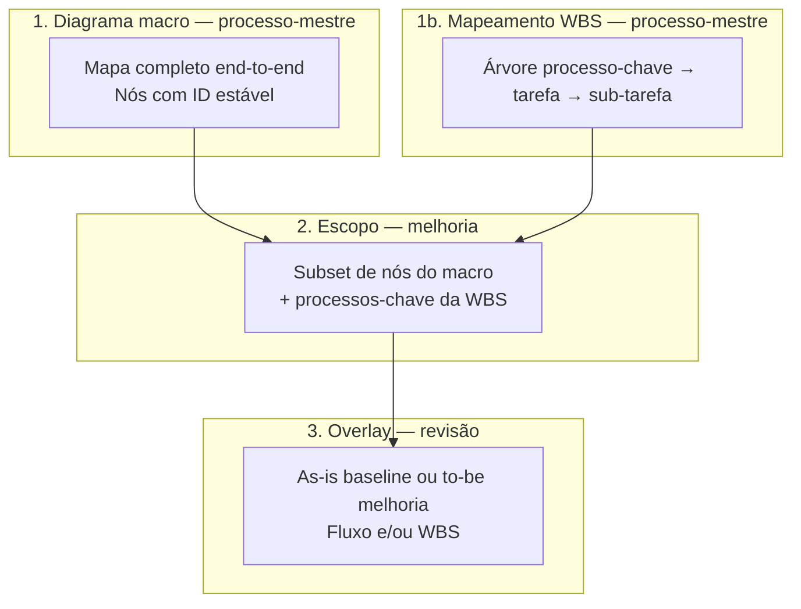

# Tutorial de uso — Transformômetro

**Público:** gestores, analistas de processo e usuários operacionais  
**Última atualização:** jul/2026 (workspace Processos + Configurações; subpastas de revisão; duplicar revisão; matriz impacto×esforço; referência entre revisões V035)  
**Acesso:** Minha Delpi → menu **Transformômetro** (`/apps/transformometro`)

Este guia explica **como cadastrar corretamente**, **como usar diagramas** (macro → escopo → revisão) e **como tirar proveito das demais funcionalidades** do app.

Documentação técnica complementar: [OVERVIEW.md](./OVERVIEW.md) · [PLAYBOOK-MODELAGEM.md](./PLAYBOOK-MODELAGEM.md) · [PLAYBOOK-19 — diagramas](./PLAYBOOK-19-diagramas-processo-revisao-escopo.md) · [PLAYBOOK-20 — decomposição/mapeamento](./PLAYBOOK-20-decomposicao-processo-arvore-mapeamento.md) · [PLAYBOOK-23 — macro composto / vigência](./PLAYBOOK-23-decomposicao-composicao-macro-data.md)

---

## 1. O que o Transformômetro faz

O Transformômetro registra **melhorias de processo** e responde, por revisão e por período:

- quanto a melhoria **economizou** (bruto e líquido);
- quanto **custou** implantar e manter;
- qual o **ROI** e em quanto tempo o investimento se paga.

Tudo gira em torno de uma **revisão** — cenário calculável (baseline, melhoria, automação ou correção) — sempre ligada a uma **melhoria operacional** (processo × unidade × departamento(s)). Na interface ela aparece como **Melhoria**; na API e nas URLs o identificador técnico continua sendo `instancia_id` / rota `/instancias/`.

---

## 2. Conceitos essenciais (leia antes de cadastrar)

| Conceito | O que é | Onde cadastra |
|----------|---------|---------------|
| **Unidade (filial)** | Planta ou site operacional (ex.: SC, ES) | **Configurações** → Unidades |
| **Departamento (setor)** | Área dentro da unidade (ex.: Engenharia, Qualidade) | **Configurações** → Departamentos |
| **Processo-mestre** | Iniciativa corporativa (ex.: «Automação do fechamento») | Menu **Processos** |
| **Melhoria operacional** | Aplicação do processo a **unidade + departamento(s)** — foco distinto de transformação | Detalhe do processo → painel **Melhorias** |
| **Revisão** | Cenário com vigência, medição e custos | Detalhe da melhoria → **Nova revisão** |
| **Diagrama macro** | Mapa canônico end-to-end do processo-mestre | Detalhe do processo → **Diagrama macro** |
| **Mapeamento (WBS)** | Árvore processo-chave → tarefa → sub-tarefa | Detalhe do processo → **Mapeamento do processo** |
| **Escopo no diagrama** | Quais nós do macro valem **nesta melhoria** | Detalhe da melhoria → **Escopo no diagrama** |
| **Escopo no mapeamento** | Quais processos-chave da WBS esta melhoria executa | Detalhe da melhoria → **Escopo no mapeamento** |
| **Overlay da revisão** | Estado visual **as-is** (baseline) ou **to-be** (melhoria) — fluxo e/ou WBS | Detalhe da revisão → **Diagrama** / **Mapeamento da revisão** |
| **Recurso compartilhado** | Licença/ferramenta rateada entre revisões | **Configurações** → Recursos + vínculo na revisão |

### Hierarquia recomendada

```text
Unidade + Departamento (catálogo)
        ↓
Processo-mestre (+ diagrama macro + mapeamento WBS)
        ↓
Melhoria (unidade × dept + escopos no diagrama e na WBS)
        ↓
Revisão (baseline → melhorias + overlays + medição + investimentos + recursos)
        ↓
Dashboard (KPIs consolidados ou por unidade/departamento)
```

---

## 3. Ordem correta de cadastro

Siga esta sequência na **primeira implantação** ou ao onboarding de uma nova unidade:

### Passo 1 — Unidades

1. Abra **Configurações** → pasta **Unidades** (ou clique em uma unidade na árvore).
2. Cadastre cada filial com **código TOTVS** (ex.: `01`, `02`) e nome.
3. Mantenha status **ativo** para aparecer em formulários e filtros.

> O código da unidade **não muda** após criado — é o identificador nas integrações.

### Passo 2 — Departamentos

1. Abra **Configurações** → pasta **Departamentos**.
2. Cadastre o código (ex.: `engenharia`) e o nome.
3. Marque **em quais unidades** o departamento existe.
4. Um departamento só pode ser usado em processos das unidades vinculadas.

### Passo 3 — Recursos compartilhados (opcional, mas cedo se houver licenças globais)

1. Abra **Configurações** → pasta **Recursos compartilhados**.
2. Cadastre licenças, assinaturas ou ferramentas compartilhadas.
3. Defina **escopo do recurso**:
   - **Empresa** — rateio entre todos os vínculos vigentes;
   - **Unidade** — só revisões da mesma unidade;
   - **Departamento** — só revisões do par unidade × departamento.
4. Informe histórico de **custo mensal** (reajustes por competência).

### Passo 4 — Processo-mestre

1. Abra **Processos** → **Novo processo**.
2. Preencha nome, família, gestor, objetivo e descrição.
3. Na criação, informe **unidade e departamento da primeira melhoria** — o sistema cria processo + melhoria juntos.
4. O código `PROC-XXXX` é gerado automaticamente.

### Passo 5 — Baseline na melhoria

1. Abra o processo e entre na **melhoria** (clique na linha da listagem ou no card).
2. Crie a revisão **baseline** (cenário `baseline`).
3. Preencha **vigência** e **medição** — a baseline é a referência «antes da melhoria».
4. **Não** marque baseline como revisão ativa operacional.

### Passo 6 — Primeira melhoria (cenário)

1. Na mesma melhoria, crie revisão **melhoria**, **automação** ou **correção**.
2. Em **Compara com**, escolha a revisão de referência (normalmente a **linha de base** na primeira melhoria; revisões posteriores podem comparar com a **revisão ativa anterior**).
3. Informe **data de implantação** (ou, no mínimo, início de vigência).
4. Cadastre **medição** da situação pós-melhoria.
5. Registre **investimentos** (únicos ou recorrentes).
6. Vincule **recursos** se aplicável.
7. Clique **Definir como ativa** — só **uma** revisão não-baseline fica ativa por melhoria.

**Revisões cotidianas (após ~1 ano):** ao registrar v3.0, v4.0…, compare com a versão imediatamente anterior (ex.: v2.0), não necessariamente com a baseline original — a economia passa a refletir o **incremento entre versões**.

### Passo 7 — Replicar em outra unidade ou foco (se necessário)

- No painel **Melhorias** do processo, use **Nova melhoria** ou **Duplicar** em melhoria existente.
- **Várias melhorias** podem usar a **mesma unidade e os mesmos departamentos** — diferencie pelo **Título**, resumo, fase e prioridade.
- Para clonar o processo inteiro (diagrama, WBS, melhorias, revisões, evidências), use **Duplicar** na lista de **Processos**.

---

## 4. Telas e navegação

| Aba / menu | Função |
|------------|--------|
| **Dashboard** | KPIs, gráficos, alertas, exportação, recalcular |
| **Processos** | Lista e **workspace** do processo-mestre (árvore lateral) |
| **Configurações** | Unidades, departamentos e recursos compartilhados (workspace com árvore) |
| **Exportar / Importar** | Backup e restauração JSON |

> As antigas abas **Unidades**, **Departamentos** e **Recursos** foram unificadas em **Configurações**. URLs legadas (`/filiais`, `/setores`, `/recursos`, `/cadastros/*`) continuam abrindo o mesmo conteúdo.

### Workspace de Processos

Ao abrir um processo, a tela divide-se em **barra lateral** (árvore) e **painel principal**:

```text
Processo PROC-0001
├── Visão geral
├── Dados do processo
├── Mapeamento
├── Diagrama macro
├── Arquivos
├── Melhorias
│   └── [cada melhoria]
│       └── [cada revisão]
│           ├── Matriz impacto × esforço   (#matriz — oculta na baseline)
│           ├── Vigência e identificação   (#vigencia)
│           ├── Mapeamento da revisão      (#mapeamento)
│           ├── Diagrama da revisão        (#diagrama)
│           ├── Medição operacional        (#medicao)
│           ├── Investimentos              (#investimentos)
│           ├── Recursos compartilhados    (#recursos)
│           └── Evidências                 (#evidencias)
└── Linha do tempo
```

| Recurso | Como usar |
|---------|-----------|
| **Pesquisa** | Filtra processos, melhorias e revisões na árvore |
| **Recolher / expandir** | Botão no topo da sidebar; largura redimensionável (arraste na borda) |
| **Badge na revisão** | Quadrante da matriz impacto × esforço (ex.: quick win) |
| **Subpastas** | Clique abre a seção correspondente no painel à direita |

### Workspace de Configurações

Mesmo padrão visual do workspace de Processos:

```text
Configurações
├── Unidades (N)
│   └── [cada filial]
├── Departamentos (N)
│   └── [cada setor]
└── Recursos compartilhados (N)
    └── [cada recurso]
        ├── Dados do recurso
        ├── Custos ao longo do tempo   (#custos)
        └── Processos vinculados       (#vinculos)
```

Botões **Nova unidade**, **Novo departamento** e **Novo recurso** ficam no rodapé da sidebar quando a pasta correspondente está selecionada.

### Como navegar e editar (jul/2026)

| Ação | Como fazer |
|------|------------|
| Abrir processo / melhoria / revisão | **Clique na linha** da tabela, no card ou no nó da **árvore lateral** |
| Ir a uma seção da revisão | Expanda a revisão na árvore e clique na subpasta (matriz, vigência, medição…) |
| Editar cadastro | Dentro do detalhe, clique **Editar** no card da seção (não há «Editar» na grade de listagem) |
| **Duplicar revisão** | Na listagem de revisões da melhoria, botão **Duplicar** — cria cópia inativa com medições, investimentos, vínculos, overlays e evidências; versão sugerida automaticamente |
| Campos de seleção | Listas suspensas customizadas (mesmo padrão visual do PAC); em listas longas (ex.: recurso do catálogo), use a **busca** no painel |
| Excluir / duplicar / substituir dados | **Modal de confirmação** dentro do app — não usa o diálogo nativo do navegador |
| Diagrama em tela cheia | Ícone de expandir no card do diagrama |

### URLs importantes

| Tela | Caminho |
|------|---------|
| Processo | `/apps/transformometro/processos/{processoId}` |
| Melhoria (instância) | `/apps/transformometro/processos/{processoId}/instancias/{instanciaId}` |
| Revisão | `/apps/transformometro/processos/{processoId}/instancias/{instanciaId}/revisoes/{revisaoId}` |
| Seção da revisão | Mesma URL + hash (`#matriz`, `#vigencia`, `#medicao`, …) |
| Configurações — unidades | `/apps/transformometro/configuracoes/unidades` |
| Configurações — departamentos | `/apps/transformometro/configuracoes/departamentos` |
| Configurações — recursos | `/apps/transformometro/configuracoes/recursos` |

> A rota contém `/instancias/` por compatibilidade técnica; na UI o rótulo é **Melhoria**.

---

## 5. Melhorias operacionais — boas práticas

> **Playbook 20:** cada **melhoria** é o ambiente onde a transformação acontece (baseline + cenários). O processo-mestre traz **diagrama macro** e **mapeamento WBS** completos; cada melhoria declara **qual parte** executa naquela unidade/departamento e pode ter **contexto operacional extra** (responsável local, fase, prioridade, notas por processo-chave).

### Uma melhoria = foco operacional (unidade × departamento(s) × fatia do macro/WBS)

- Cada cadastro de melhoria tem **baseline e cenários independentes**.
- **Várias melhorias** podem compartilhar a **mesma unidade e os mesmos departamentos** — use **Título**, resumo, fase e prioridade para distinguir (ex.: piloto Q1 vs rollout Q3).
- O dashboard **consolidado** agrega todas as melhorias do processo-mestre.
- **Escopo no mapeamento:** selecione quais **processos-chave** desta melhoria executa (ex.: Engenharia trata PK 2–5 do LMP).
- **Contexto local:** responsável, fase de rollout, data-alvo de go-live, observações por processo-chave.

### Campos da melhoria (cadastro)

| Campo | Uso |
|-------|-----|
| **Título** | Nome curto na listagem e linha do tempo (antes «Rótulo») |
| **Resumo** | Oportunidade ou objetivo desta melhoria |
| **Responsável local** | Gestor ou patrocinador da implantação |
| **Fase** | Planejado → Em piloto → Implantado → Encerrado |
| **Prioridade** | Baixa / Média / Alta — acompanhamento operacional |
| **Data-alvo de go-live** | Planejamento; a data efetiva fica na revisão |
| **Status** | Ativo / inativo — inativas não entram no dashboard |

### Melhoria multi-unidade («Todas as unidades ativas»)

Use quando o **mesmo cenário** vale para todas as filiais (mesma baseline, volumes e investimentos):

- Uma única timeline para todas as unidades.
- No dashboard **Consolidado**, economia bruta, líquida e horas são **multiplicadas** pelo número de unidades ativas.
- Investimentos e recursos compartilhados **não** multiplicam.

### Duplicar melhoria

- Copia revisões, medições, escopos e estrutura para acelerar rollout em outra unidade/departamento ou outro foco.
- Revise vigências, medições e vínculos após duplicar.
- Ao **editar** uma melhoria com revisões e trocar a unidade, o sistema pede **confirmação** — os números são reatribuídos ao novo destino.

---

## 6. Revisões — vigência, medição e ativação

Cada revisão possui seções editáveis (clique **Editar** no card):

| Seção | Conteúdo |
|-------|----------|
| **Matriz impacto × esforço** | Scatter de priorização (automático/híbrido/manual); oculta em baseline |
| **Vigência** | Versão, cenário, **Compara com** (referência), datas, descrição, revisão ativa |
| **Medição** | Volume, tempos, custos hora, erros, retrabalho |
| **Investimentos** | Itens únicos ou recorrentes da revisão |
| **Recursos** | Vínculos com recursos do catálogo + peso/rateio |
| **Evidências** | Anexos PDF/imagem ou links externos |
| **Diagrama** | Overlay visual as-is / to-be |

### Cenários (`cenario_tipo`)

Na interface, os cenários aparecem com **nomes amigáveis em português**; na API permanecem os slugs técnicos.

| Slug (API) | Nome na UI | Uso |
|------------|------------|-----|
| **baseline** | Linha de base (as-is) | Referência «como era» — **não** informa «Compara com»; não gera economia sozinha |
| **melhoria** | Melhoria de processo | Mudança de processo, ferramenta ou método |
| **automacao** | Automação | Automação relevante (RPA, integração, etc.) |
| **correcao** | Correção / estabilização | Correção de falha ou desperdício |

### Referência de comparação (`revisao_referencia_id`)

| Regra | Detalhe |
|-------|---------|
| **Baseline** | Sem referência — é o ponto zero da melhoria |
| **Demais cenários** | Campo **Compara com** obrigatório ao criar/editar |
| **Legado / vazio** | Cálculo usa a **baseline da instância** automaticamente |
| **Economia** | `custo_referência − custo_atual` (referência = revisão escolhida, não sempre baseline) |
| **Diffs diagrama/WBS** | Mesma referência da revisão |

### Regras importantes

1. **Baseline com medição** é obrigatória para calcular economia (ou uma revisão de referência com medição).
2. Revisão **encerrada** (`data_fim_vigencia`) não pode ser marcada como ativa.
3. **Data de implantação** da melhoria = primeira revisão não-baseline (usa `data_implantacao` ou `data_inicio_vigencia`).
4. Use **Comparativo** na melhoria para ver totais de cada versão lado a lado (cada uma já reflete sua referência no cálculo).
5. **Duplicar revisão** acelera uma nova versão: copia cadastro completo (medição, investimentos, recursos, diagrama, mapeamento, evidências); a cópia nasce **inativa** — ajuste versão, vigência e marque como ativa quando validar.

### Matriz impacto × esforço (Playbook 21)

Disponível na subpasta **Matriz impacto × esforço** de cada revisão comparável (não baseline):

- **Modo automático** — scores derivados de economia, ROI, investimentos e recursos já cadastrados.
- **Modo híbrido / manual** — ajustes qualitativos auditáveis (PUT na API).
- **Badge na árvore** — quadrante resumido (quick win, estratégico, etc.) no nó da revisão.
- **Scatter na melhoria** — visão de todas as revisões da mesma melhoria para priorização.

Documentação: [PLAYBOOK-21](./PLAYBOOK-21-matriz-impacto-esforco-revisao.md) · wireframe em `plugins/transformometro/docs/wireframes/matriz-impacto-esforco.md`.

### Diagnóstico de rateio

Na revisão, o sistema pode alertar se o **custo rateado de recursos** excede a **economia bruta** — sinal de revisar escopo do recurso ou peso dos vínculos.

---

## 7. Diagramas, mapeamento e fluxo — modelo em camadas

Os diagramas e o mapeamento WBS **não são cadastros soltos**: amarram do processo-mestre até cada revisão.



### 7.1 Diagrama macro (processo-mestre)

**Onde:** detalhe do processo → card **Diagrama macro** → **Editar**

**O que é:** mapa canônico do fluxo completo da iniciativa. Todos os ambientes operacionais **reutilizam os mesmos nós** (IDs estáveis).

**Como usar o editor:**

| Ação | Como fazer |
|------|------------|
| Adicionar nó | Clique no ícone na paleta (início, atividade, decisão, documento, etc.) |
| Mover | Arraste o nó no canvas |
| Conectar | Arraste de um ponto de ancoragem a outro |
| Editar texto | **Duplo clique** no rótulo (Enter confirma, Esc cancela) |
| Remover | Selecione e use **Excluir** na seção Ações, ou Delete/Backspace |
| Mover | Arraste no canvas; teclas ← ↑ → ↓ ou botão **Mover** (foco no canvas) |
| Copiar / Duplicar | Seção **Ações** — copia para área interna ou duplica com deslocamento |
| Faixas (swimlanes) | Adicione faixas para separar papéis (Comercial, Engenharia…) |
| Auto-layout | Reorganiza o fluxo automaticamente |
| Templates | Fluxo linear, com decisão ou com swimlanes — ponto de partida rápido |
| Tela cheia | Expandir o editor para trabalhar em área maior (modal dedicado) |

**Abas do editor:**

- **Canvas** — edição visual interativa (fonte de verdade: JSON `flowchart_v1`)
- **Mermaid** — código derivado **ao vivo** + preview renderizado; edite o texto e use **Aplicar ao canvas** (ou **Atualizar do canvas** para sincronizar). **Modelo inicial** disponível em diagrama vazio.

**Antes de salvar:**

1. Clique **Validar / simular** — verifica estrutura (início/fim, decisões, caminhos).
2. A simulação por token mostra caminhos **completos** e **interrompidos**.
3. Corrija erros listados; **Salvar diagrama** só aceita diagrama válido.

**Exportar / importar (macro):**

- **Exportar PNG** — imagem para apresentações
- **Exportar BPMN XML** — interoperabilidade (subset BPMN 2.0)
- **Importar BPMN XML** — substitui o diagrama atual (revise validação após importar)

> **Dica:** desenhe o macro e a WBS **antes** de abrir melhorias, se possível. Facilita escopos e overlays consistentes.

### 7.2 Mapeamento WBS (processo-mestre)

**Onde:** detalhe do processo → card **Mapeamento do processo** → **Editar**

**O que é:** árvore hierárquica **processo-chave → tarefa → sub-tarefa**, alinhada ao formato da planilha operacional de mapeamento.

| Ação | Como fazer |
|------|------------|
| Estruturar árvore | Abas **Árvore** (editor rico) ou **Planilha** (visualização tabular) |
| Adicionar nós | Botões + Processo-chave / + Tarefa / + Sub-tarefa |
| Exportar CSV | Download da planilha de mapeamento |
| Sugerir rascunho | **Sugerir do fluxo** — gera WBS a partir do diagrama macro (pede confirmação se já houver árvore) |

### 7.3 Escopo na melhoria (diagrama)

**Onde:** detalhe da melhoria → card **Escopo no diagrama** → **Editar**

**O que é:** define **quais nós do macro** esta melhoria opera.

| Opção | Significado |
|-------|-------------|
| **Usar diagrama macro completo** | Todos os nós (padrão) |
| Seleção parcial | Clique nos nós no canvas para incluir/excluir do escopo |
| **Incluir arestas na fronteira do escopo** | Mantém conexões que entram/saem do subset selecionado |

**Regra:** overlay de revisão **nunca referencia nós fora do escopo** da melhoria.

**Exemplo:** processo «Order to Cash» com 12 etapas; melhoria «Filial 01 — Financeiro» escolhe só «Faturamento» e «Cobrança».

### 7.4 Escopo no mapeamento (melhoria)

**Onde:** detalhe da melhoria → card **Escopo no mapeamento** → **Editar**

**O que é:** subset de **processos-chave** da WBS que esta melhoria executa ou transforma, mais contexto local (responsável, observações) por nó quando aplicável.

### 7.5 Overlay na revisão (diagrama)

**Onde:** detalhe da revisão → card **Diagrama da revisão** → **Editar**

**O que é:** estado visual da revisão sobre o escopo do diagrama:

- **Baseline** → documenta **as-is** (como funciona hoje)
- **Melhoria / automação / correção** → documenta **to-be** (como ficará ou ficou)

O editor da revisão usa os **mesmos controles** do diagrama macro (paleta, faixas, templates, validação, tela cheia).

1. Garanta **macro** e **WBS** no processo-mestre.
2. Ajuste **escopos** na melhoria (diagrama e/ou mapeamento).
3. Na revisão baseline, edite overlays para refletir o **estado atual**.
4. Na revisão de melhoria, edite para mostrar o **estado futuro** ou delta.
5. Clique **Salvar overlay** — o sistema grava diferenças em relação ao macro/escopo, não um desenho duplicado.

**Overlay de mapeamento (revisão):** card **Mapeamento da revisão** — rótulos e descrições as-is/to-be sobre o escopo WBS.

**Exportar da revisão:**

- **Exportar PNG** — download local
- **Salvar como evidência** — anexa PNG automaticamente às evidências da revisão (útil para auditoria)

### 7.6 Fluxo recomendado (diagrama + WBS)

```text
1. Processo-mestre     → Diagrama macro + mapeamento WBS + validar/salvar
2. Melhoria            → Escopos (diagrama e WBS) + contexto local
3. Revisão baseline    → Overlays as-is + salvar + (opcional) PNG como evidência
4. Revisão melhoria    → Overlays to-be + salvar + evidência
5. Comparativo         → Conferir números e artefatos na mesma melhoria
```

### 7.7 Erros comuns com diagramas e mapeamento

| Erro | Correção |
|------|----------|
| Desenhar só na revisão, sem macro/WBS | Crie macro e mapeamento no processo-mestre primeiro |
| Melhoria sem nós no escopo | Marque «macro completo» ou selecione nós/processos-chave |
| Overlay não salva | Verifique permissão de edição e se outro usuário está editando a seção |
| Validação falha | Adicione início/fim, conecte decisões, feche caminhos |
| Nó «sumiu» após mudança no macro | Nó desativado no macro — reconcilie escopo/overlay |
| WBS substituída por engano | «Sugerir do fluxo» pede confirmação se já existir árvore |

---

## 8. Colaboração em tempo real

Nas telas de detalhe (processo, melhoria, revisão, unidade, departamento, recurso):

- O banner mostra quem está **visualizando** ou **editando** cada seção.
- Ao clicar **Editar** em um card, você obtém **trava soft** da seção — outro usuário recebe aviso se tentar editar ao mesmo tempo.
- Alterações de outros usuários **atualizam a tela automaticamente** (WebSocket); não é necessário botão Atualizar.
- Se a conexão em tempo real cair, o sistema faz **resync silencioso** em background.

**Boas práticas:**

- Evite editar a **mesma seção** simultaneamente — coordene pelo banner.
- Após grande alteração feita por colega, aguarde o aviso de sincronização antes de salvar.

---

## 9. Recursos compartilhados e rateio

### Cadastro do recurso

1. Nome, fornecedor, recorrência, status.
2. **Escopo** (empresa / unidade / departamento).
3. **Critério de rateio:** igualitário, por revisões ativas ou por peso.
4. Histórico de **custos mensais** com reajuste por data.

### Vínculo na revisão

1. Na revisão → **Recursos** → selecione do catálogo ou cadastre novo.
2. Informe período de uso (`início` / `fim`), peso (se aplicável) e se está **ativo**.
3. O dashboard usa o custo **vigente na competência** e rateia conforme escopo + critério.

---

## 10. Dashboard

### Visões

| Visão | Quando usar |
|-------|-------------|
| **Consolidado** | Visão empresa ou processo inteiro (todas as melhorias) |
| **Unidade** | KPIs de uma ou mais filiais |
| **Departamento** | Recorte unidade × departamento |

### Filtros

- **Competência** — seleciona mês e preenche período automaticamente
- **Datas** — recorte customizado (competência fica em branco se meses diferirem)
- **Unidade / Departamento** — conforme visão selecionada

### KPIs principais

- **Economia líquida** — bruta menos investimentos e recursos rateados
- **Economia bruta** — ganho operacional antes de custos
- **Horas economizadas**
- **ROI** — economia líquida ÷ investimento
- **Alertas** — processos com 3+ meses consecutivos de economia líquida negativa

### Recalcular

Usuários com permissão podem **Recalcular** para materializar `dashboard_calculos` após alterações em cadastro. Em muitos fluxos o cálculo também reflete automaticamente.

---

## 11. Exportar e importar backup

**Menu Exportar / Importar:**

1. **Exportar** — gera JSON com unidades, departamentos, processos, melhorias, revisões, diagramas e mapeamentos.
2. **Importar** — preview mostra inserções/atualizações antes de aplicar; modo **Substituir** exige confirmação no modal.
3. Formatos aceitos: backup Playbook 18 (melhorias/instâncias) ou legado (detectado automaticamente).

Use para **ambiente de homologação**, migração inicial ou cópia entre ambientes — não substitui rotina diária de cadastro.

---

## 12. Permissões (resumo)

| Permissão | Permite |
|-----------|---------|
| `transformometro.view` | Dashboard e listagens |
| `transformometro.processes.manage` | Processos, unidades, departamentos |
| `transformometro.revisions.manage` | Revisões e ativação |
| `transformometro.measurements.manage` | Medições |
| `transformometro.investments.manage` | Investimentos |
| `transformometro.shared-resources.manage` | Recursos e vínculos |
| `transformometro.dashboard.recalculate` | Recalcular dashboard |
| `transformometro.data.transfer` | Export/import JSON |
| `transformometro.view.filial-XX` / `manage.filial-XX` | Leitura/escrita restrita à filial |

Usuários sem escopo de filial enxergam todos os dados (comportamento legado global).

---

## 13. Checklist — cadastro completo de uma melhoria

Use como roteiro de conferência:

- [ ] Unidade e departamento cadastrados e ativos
- [ ] Processo-mestre criado com metadados (família, gestor, objetivo)
- [ ] **Diagrama macro** desenhado, validado e salvo
- [ ] **Mapeamento WBS** estruturado (ou sugerido do fluxo)
- [ ] Melhoria operacional com unidade/departamento, **Título** e campos de rollout
- [ ] **Escopo do diagrama** e **escopo no mapeamento** definidos na melhoria
- [ ] Revisão **baseline** com vigência + **medição**
- [ ] Revisões de melhoria com **Compara com** definido (referência correta)
- [ ] Overlay **as-is** na baseline (fluxo e/ou WBS — recomendado)
- [ ] Revisão **melhoria** com implantação + vigência + **medição**
- [ ] Overlay **to-be** na melhoria
- [ ] **Investimentos** registrados (único/recorrente)
- [ ] **Recursos** vinculados com peso/período corretos
- [ ] **Evidências** anexadas (PDF, PNG do diagrama, links)
- [ ] Revisão de melhoria marcada como **ativa**
- [ ] Dashboard recalculado / conferido no recorte esperado

---

## 14. Perguntas frequentes

**Preciso duplicar o processo para cada filial?**  
Não. Crie **melhorias** no mesmo processo-mestre — uma timeline por foco operacional. Para clonar tudo de uma vez, use **Duplicar** na lista de processos.

**Posso ter duas melhorias na mesma unidade e departamento?**  
Sim. Desde jul/2026 o escopo é livre — use **Título**, resumo, fase e prioridade para diferenciá-las.

**Posso ter duas revisões ativas na mesma melhoria?**  
Não. Apenas **uma** revisão não-baseline ativa por melhoria.

**A baseline entra no ROI?**  
Não gera economia comparativa (economia = 0). Serve como referência padrão quando nenhuma revisão de comparação foi informada.

**O que é «Compara com»?**  
Revisão de referência para calcular economia e diffs visuais. Obrigatório em cenários não-baseline. Ex.: v3.0 comparando com v2.0 mede o **incremento** desde a versão anterior; sem referência explícita (legado), o sistema usa a **linha de base**.

**Preciso sempre comparar com a baseline?**  
Não. Após a primeira melhoria, revisões cotidianas podem referenciar a **revisão ativa anterior**. A baseline continua existindo como ponto zero histórico.

**O diagrama ou o mapeamento impactam o cálculo financeiro?**  
Não. São **documentação** vinculada ao processo/melhoria/revisão. KPIs vêm de medição, investimentos e recursos.

**Posso editar o macro depois de criar revisões?**  
Sim, mas prefira **não remover nós** referenciados em escopos/overlays. Desativar nó gera aviso nas melhorias/revisões afetadas.

**Onde vejo o histórico de alterações?**  
No detalhe do processo → **Linha do tempo** (audit log).

---

## 15. Referências rápidas

| Tema | Documento |
|------|-----------|
| Modelo de domínio | [PLAYBOOK-MODELAGEM.md](./PLAYBOOK-MODELAGEM.md) |
| Instâncias / melhorias e escopo | [PLAYBOOK-18-instancias-filial-setor-escopo.md](./PLAYBOOK-18-instancias-filial-setor-escopo.md) |
| Diagramas fluxo (técnico) | [PLAYBOOK-19-diagramas-processo-revisao-escopo.md](./PLAYBOOK-19-diagramas-processo-revisao-escopo.md) |
| Árvore / planilha mapeamento | [PLAYBOOK-20-decomposicao-processo-arvore-mapeamento.md](./PLAYBOOK-20-decomposicao-processo-arvore-mapeamento.md) |
| Macro composto / delta por revisão | [PLAYBOOK-23-decomposicao-composicao-macro-data.md](./PLAYBOOK-23-decomposicao-composicao-macro-data.md) |
| Status técnico Playbook 20 | [playbook-20-implementation-status.md](../../../transformometro-api/docs/playbook-20-implementation-status.md) |
| Fórmulas de cálculo | [regras-de-calculo.md](../../../transformometro-api/docs/regras-de-calculo.md) |
| Status técnico e deploy | [status-atual.md](./status-atual.md) |
| Deploy e migrations | [OPERATIONS.md](./OPERATIONS.md) |

---

*Dúvidas ou sugestão de melhoria neste tutorial: abra issue ou PR no repositório `delpi-central`.*
