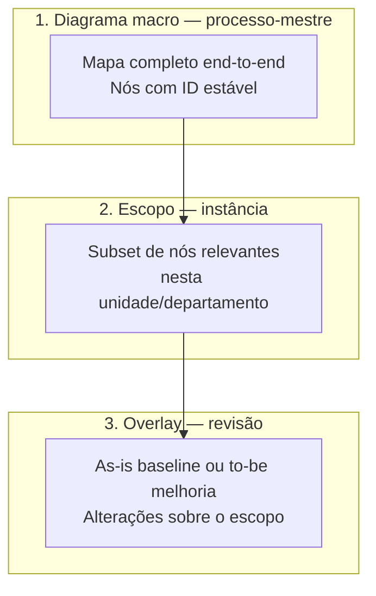

# Tutorial de uso — Transformômetro

**Público:** gestores, analistas de processo e usuários operacionais  
**Última atualização:** jul/2026  
**Acesso:** Minha Delpi → menu **Transformômetro** (`/apps/transformometro`)

Este guia explica **como cadastrar corretamente**, **como usar diagramas** (macro → escopo → revisão) e **como tirar proveito das demais funcionalidades** do app.

Documentação técnica complementar: [OVERVIEW.md](./OVERVIEW.md) · [PLAYBOOK-MODELAGEM.md](./PLAYBOOK-MODELAGEM.md) · [PLAYBOOK-19 — diagramas](./PLAYBOOK-19-diagramas-processo-revisao-escopo.md)

---

## 1. O que o Transformômetro faz

O Transformômetro registra **melhorias de processo** e responde, por revisão e por período:

- quanto a melhoria **economizou** (bruto e líquido);
- quanto **custou** implantar e manter;
- qual o **ROI** e em quanto tempo o investimento se paga.

Tudo gira em torno de uma **revisão** — cenário calculável (baseline, melhoria, automação ou correção) — sempre ligada a uma **instância operacional** (processo × unidade × departamento).

---

## 2. Conceitos essenciais (leia antes de cadastrar)

| Conceito | O que é | Onde cadastra |
|----------|---------|---------------|
| **Unidade (filial)** | Planta ou site operacional (ex.: SC, ES) | Menu **Unidades** |
| **Departamento (setor)** | Área dentro da unidade (ex.: Engenharia, Qualidade) | Menu **Departamentos** |
| **Processo-mestre** | Iniciativa corporativa (ex.: «Automação do fechamento») | Menu **Processos** |
| **Instância operacional** | O mesmo processo aplicado a **unidade + departamento(s)** | Detalhe do processo → painel **Instâncias** |
| **Revisão** | Cenário com vigência, medição e custos | Detalhe da instância → **Nova revisão** |
| **Diagrama macro** | Mapa canônico end-to-end do processo-mestre | Detalhe do processo → **Diagrama macro** |
| **Escopo do diagrama** | Quais nós do macro valem **nesta instância** | Detalhe da instância → **Escopo no diagrama** |
| **Overlay da revisão** | Estado visual **as-is** (baseline) ou **to-be** (melhoria) | Detalhe da revisão → **Diagrama da revisão** |
| **Recurso compartilhado** | Licença/ferramenta rateada entre revisões | Menu **Recursos** + vínculo na revisão |

### Hierarquia recomendada

```text
Unidade + Departamento (catálogo)
        ↓
Processo-mestre (+ diagrama macro)
        ↓
Instância (unidade × dept + escopo no diagrama)
        ↓
Revisão (baseline → melhorias + diagrama overlay + medição + investimentos + recursos)
        ↓
Dashboard (KPIs consolidados ou por unidade/departamento)
```

---

## 3. Ordem correta de cadastro

Siga esta sequência na **primeira implantação** ou ao onboarding de uma nova unidade:

### Passo 1 — Unidades

1. Abra **Unidades**.
2. Cadastre cada filial com **código TOTVS** (ex.: `01`, `02`) e nome.
3. Mantenha status **ativo** para aparecer em formulários e filtros.

> O código da unidade **não muda** após criado — é o identificador nas integrações.

### Passo 2 — Departamentos

1. Abra **Departamentos**.
2. Cadastre o código (ex.: `engenharia`) e o nome.
3. Marque **em quais unidades** o departamento existe.
4. Um departamento só pode ser usado em processos das unidades vinculadas.

### Passo 3 — Recursos compartilhados (opcional, mas cedo se houver licenças globais)

1. Abra **Recursos**.
2. Cadastre licenças, assinaturas ou ferramentas compartilhadas.
3. Defina **escopo do recurso**:
   - **Empresa** — rateio entre todos os vínculos vigentes;
   - **Unidade** — só revisões da mesma unidade;
   - **Departamento** — só revisões do par unidade × departamento.
4. Informe histórico de **custo mensal** (reajustes por competência).

### Passo 4 — Processo-mestre

1. Abra **Processos** → **Novo processo**.
2. Preencha nome, família, gestor, objetivo e descrição.
3. Na criação, informe **unidade e departamento da primeira instância** — o sistema cria processo + instância juntos.
4. O código `PROC-XXXX` é gerado automaticamente.

### Passo 5 — Baseline na instância

1. Entre na **instância** (pelo detalhe do processo).
2. Crie a revisão **baseline** (cenário `baseline`).
3. Preencha **vigência** e **medição** — a baseline é a referência «antes da melhoria».
4. **Não** marque baseline como revisão ativa operacional.

### Passo 6 — Primeira melhoria

1. Na mesma instância, crie revisão **melhoria**, **automação** ou **correção**.
2. Informe **data de implantação** (ou, no mínimo, início de vigência).
3. Cadastre **medição** da situação pós-melhoria.
4. Registre **investimentos** (únicos ou recorrentes).
5. Vincule **recursos** se aplicável.
6. Clique **Definir como ativa** — só **uma** revisão não-baseline fica ativa por instância.

### Passo 7 — Replicar em outra unidade (se necessário)

- No painel **Instâncias** do processo, crie nova instância ou use **Duplicar** em instância existente.
- Cada instância tem **timeline própria** de revisões — não duplique o processo-mestre inteiro salvo exceção legada.

---

## 4. Telas e navegação

| Aba / menu | Função |
|------------|--------|
| **Dashboard** | KPIs, gráficos, alertas, exportação, recalcular |
| **Processos** | Lista e cadastro mestre |
| **Unidades** | Catálogo de filiais |
| **Departamentos** | Catálogo de setores |
| **Recursos** | Licenças e ferramentas compartilhadas |
| **Exportar / Importar** | Backup e restauração JSON |

### URLs importantes

| Tela | Caminho |
|------|---------|
| Processo | `/apps/transformometro/processos/{processoId}` |
| Instância | `/apps/transformometro/processos/{processoId}/instancias/{instanciaId}` |
| Revisão | `/apps/transformometro/processos/{processoId}/instancias/{instanciaId}/revisoes/{revisaoId}` |

---

## 5. Instâncias operacionais — boas práticas

### Uma instância = unidade × departamento(s)

- Cada combinação operacional tem **baseline e melhorias independentes**.
- O dashboard **consolidado** soma todas as instâncias do processo-mestre.

### Instância multi-unidade («Todas as unidades ativas»)

Use quando o **mesmo cenário** vale para todas as filiais (mesma baseline, volumes e investimentos):

- Uma única timeline para todas as unidades.
- No dashboard **Consolidado**, economia bruta, líquida e horas são **multiplicadas** pelo número de unidades ativas.
- Investimentos e recursos compartilhados **não** multiplicam.

### Duplicar instância

- Copia revisões, medições e estrutura para acelerar rollout em outra unidade/departamento.
- Revise vigências, medições e vínculos após duplicar.

---

## 6. Revisões — vigência, medição e ativação

Cada revisão possui seções editáveis (clique **Editar** no card):

| Seção | Conteúdo |
|-------|----------|
| **Vigência** | Versão, cenário, datas, descrição, revisão ativa |
| **Medição** | Volume, tempos, custos hora, erros, retrabalho |
| **Investimentos** | Itens únicos ou recorrentes da revisão |
| **Recursos** | Vínculos com recursos do catálogo + peso/rateio |
| **Evidências** | Anexos PDF/imagem ou links externos |
| **Diagrama** | Overlay visual as-is / to-be |

### Cenários (`cenario_tipo`)

| Cenário | Uso |
|---------|-----|
| **baseline** | Referência «como era» — não gera economia sozinha |
| **melhoria** | Mudança de processo, ferramenta ou método |
| **automacao** | Automação relevante (RPA, integração, etc.) |
| **correcao** | Correção de falha ou desperdício |

### Regras importantes

1. **Baseline com medição** é obrigatória para calcular economia das melhorias.
2. Revisão **encerrada** (`data_fim_vigencia`) não pode ser marcada como ativa.
3. **Data de implantação** da instância = primeira revisão não-baseline (usa `data_implantacao` ou `data_inicio_vigencia`).
4. Use **Comparativo** na instância para ver baseline vs melhorias lado a lado.

### Diagnóstico de rateio

Na revisão, o sistema pode alertar se o **custo rateado de recursos** excede a **economia bruta** — sinal de revisar escopo do recurso ou peso dos vínculos.

---

## 7. Diagramas — modelo em três camadas

Os diagramas **não são desenhos soltos**: eles se **amarram** do processo-mestre até cada revisão.



### 7.1 Diagrama macro (processo-mestre)

**Onde:** detalhe do processo → card **Diagrama macro** → **Editar**

**O que é:** mapa canônico do fluxo completo da iniciativa. Todos os ambientes operacionais **reutilizam os mesmos nós** (IDs estáveis).

**Como usar o editor:**

| Ação | Como fazer |
|------|------------|
| Adicionar nó | Clique no ícone na paleta (início, atividade, decisão, documento, etc.) |
| Mover | Arraste o nó no canvas |
| Conectar | Arraste de um ponto de ancoragem a outro |
| Editar texto | **Duplo clique** no rótulo (Enter confirma, Esc cancela) |
| Remover | Selecione e use **Excluir** na seção Ações, ou Delete/Backspace |
| Mover | Arraste no canvas; teclas ← ↑ → ↓ ou botão **Mover** (foco no canvas) |
| Copiar / Duplicar | Seção **Ações** — copia para área interna ou duplica com deslocamento |
| Faixas (swimlanes) | Adicione faixas para separar papéis (Comercial, Engenharia…) |
| Auto-layout | Reorganiza o fluxo automaticamente |
| Templates | Fluxo linear, com decisão ou com swimlanes — ponto de partida rápido |

**Abas do editor:**

- **Canvas** — edição interativa
- **Preview Mermaid** — visualização derivada (somente leitura)

**Antes de salvar:**

1. Clique **Validar / simular** — verifica estrutura (início/fim, decisões, caminhos).
2. A simulação por token mostra caminhos **completos** e **interrompidos**.
3. Corrija erros listados; **Salvar diagrama** só aceita diagrama válido.

**Exportar / importar (macro):**

- **Exportar PNG** — imagem para apresentações
- **Exportar BPMN XML** — interoperabilidade (subset BPMN 2.0)
- **Importar BPMN XML** — substitui o diagrama atual (revise validação após importar)

> **Dica:** desenhe o macro **antes** de abrir instâncias, se possível. Facilita escopo e overlays consistentes.

### 7.2 Escopo na instância

**Onde:** detalhe da instância → card **Escopo no diagrama** → **Editar**

**O que é:** define **quais nós do macro** esta instância opera.

| Opção | Significado |
|-------|-------------|
| **Usar diagrama macro completo** | Todos os nós (padrão) |
| Seleção parcial | Clique nos nós no canvas para incluir/excluir do escopo |
| **Incluir arestas na fronteira do escopo** | Mantém conexões que entram/saem do subset selecionado |

**Regra:** overlay de revisão **nunca referencia nós fora do escopo** da instância.

**Exemplo:** processo «Order to Cash» com 12 etapas; instância «Filial 01 — Financeiro» escolhe só «Faturamento» e «Cobrança».

### 7.3 Overlay na revisão

**Onde:** detalhe da revisão → card **Diagrama da revisão** → **Editar**

**O que é:** estado visual da revisão sobre o escopo:

- **Baseline** → documenta **as-is** (como funciona hoje)
- **Melhoria / automação / correção** → documenta **to-be** (como ficará ou ficou)

**Como amarrar corretamente:**

1. Garanta **macro** desenhado no processo-mestre.
2. Ajuste **escopo** na instância (completo ou parcial).
3. Na revisão baseline, edite o overlay para refletir o **fluxo atual**.
4. Na revisão de melhoria, edite para mostrar o **fluxo futuro** ou **delta** (nós alterados, novos caminhos, automações).
5. Clique **Salvar overlay** — o sistema grava diferenças em relação ao macro/escopo, não um desenho duplicado.

**Exportar da revisão:**

- **Exportar PNG** — download local
- **Salvar como evidência** — anexa PNG automaticamente às evidências da revisão (útil para auditoria)

### 7.4 Fluxo recomendado (diagramas)

```text
1. Processo-mestre     → Desenhar macro + validar + salvar
2. Instância           → Confirmar escopo (completo ou subset)
3. Revisão baseline    → Overlay as-is + salvar + (opcional) PNG como evidência
4. Revisão melhoria    → Overlay to-be + salvar + evidência
5. Comparativo         → Conferir números e fluxos na mesma instância
```

### 7.5 Erros comuns com diagramas

| Erro | Correção |
|------|----------|
| Desenhar só na revisão, sem macro | Crie o macro no processo-mestre primeiro |
| Instância sem nós no escopo | Marque «macro completo» ou selecione nós |
| Overlay não salva | Verifique permissão de edição e se outro usuário está editando a seção |
| Validação falha | Adicione início/fim, conecte decisões, feche caminhos |
| Nó «sumiu» após mudança no macro | Nó desativado no macro — reconcilie escopo/overlay |

---

## 8. Colaboração em tempo real

Nas telas de detalhe (processo, instância, revisão, unidade, departamento, recurso):

- O banner mostra quem está **visualizando** ou **editando** cada seção.
- Ao clicar **Editar** em um card, você obtém **trava soft** da seção — outro usuário recebe aviso se tentar editar ao mesmo tempo.
- Alterações de outros usuários **atualizam a tela automaticamente** (WebSocket); não é necessário botão Atualizar.
- Se a conexão em tempo real cair, o sistema faz **resync silencioso** em background.

**Boas práticas:**

- Evite editar a **mesma seção** simultaneamente — coordene pelo banner.
- Após grande alteração feita por colega, aguarde o aviso de sincronização antes de salvar.

---

## 9. Recursos compartilhados e rateio

### Cadastro do recurso

1. Nome, fornecedor, recorrência, status.
2. **Escopo** (empresa / unidade / departamento).
3. **Critério de rateio:** igualitário, por revisões ativas ou por peso.
4. Histórico de **custos mensais** com reajuste por data.

### Vínculo na revisão

1. Na revisão → **Recursos** → selecione do catálogo ou cadastre novo.
2. Informe período de uso (`início` / `fim`), peso (se aplicável) e se está **ativo**.
3. O dashboard usa o custo **vigente na competência** e rateia conforme escopo + critério.

---

## 10. Dashboard

### Visões

| Visão | Quando usar |
|-------|-------------|
| **Consolidado** | Visão empresa ou processo inteiro (todas instâncias) |
| **Unidade** | KPIs de uma ou mais filiais |
| **Departamento** | Recorte unidade × departamento |

### Filtros

- **Competência** — seleciona mês e preenche período automaticamente
- **Datas** — recorte customizado (competência fica em branco se meses diferirem)
- **Unidade / Departamento** — conforme visão selecionada

### KPIs principais

- **Economia líquida** — bruta menos investimentos e recursos rateados
- **Economia bruta** — ganho operacional antes de custos
- **Horas economizadas**
- **ROI** — economia líquida ÷ investimento
- **Alertas** — processos com 3+ meses consecutivos de economia líquida negativa

### Recalcular

Usuários com permissão podem **Recalcular** para materializar `dashboard_calculos` após alterações em cadastro. Em muitos fluxos o cálculo também reflete automaticamente.

---

## 11. Exportar e importar backup

**Menu Exportar / Importar:**

1. **Exportar** — gera JSON com unidades, departamentos, processos, instâncias, revisões e diagramas.
2. **Importar** — preview mostra inserções/atualizações antes de aplicar.
3. Formatos aceitos: backup Playbook 18 (instâncias) ou legado (detectado automaticamente).

Use para **ambiente de homologação**, migração inicial ou cópia entre ambientes — não substitui rotina diária de cadastro.

---

## 12. Permissões (resumo)

| Permissão | Permite |
|-----------|---------|
| `transformometro.view` | Dashboard e listagens |
| `transformometro.processes.manage` | Processos, unidades, departamentos |
| `transformometro.revisions.manage` | Revisões e ativação |
| `transformometro.measurements.manage` | Medições |
| `transformometro.investments.manage` | Investimentos |
| `transformometro.shared-resources.manage` | Recursos e vínculos |
| `transformometro.dashboard.recalculate` | Recalcular dashboard |
| `transformometro.data.transfer` | Export/import JSON |
| `transformometro.view.filial-XX` / `manage.filial-XX` | Leitura/escrita restrita à filial |

Usuários sem escopo de filial enxergam todos os dados (comportamento legado global).

---

## 13. Checklist — cadastro completo de uma melhoria

Use como roteiro de conferência:

- [ ] Unidade e departamento cadastrados e ativos
- [ ] Processo-mestre criado com metadados (família, gestor, objetivo)
- [ ] **Diagrama macro** desenhado, validado e salvo
- [ ] Instância operacional com unidade/departamento corretos
- [ ] **Escopo do diagrama** definido na instância
- [ ] Revisão **baseline** com vigência + **medição**
- [ ] Overlay **as-is** na baseline (opcional mas recomendado)
- [ ] Revisão **melhoria** com implantação + vigência + **medição**
- [ ] Overlay **to-be** na melhoria
- [ ] **Investimentos** registrados (único/recorrente)
- [ ] **Recursos** vinculados com peso/período corretos
- [ ] **Evidências** anexadas (PDF, PNG do diagrama, links)
- [ ] Revisão de melhoria marcada como **ativa**
- [ ] Dashboard recalculado / conferido no recorte esperado

---

## 14. Perguntas frequentes

**Preciso duplicar o processo para cada filial?**  
Não. Crie **instâncias** no mesmo processo-mestre — uma timeline por unidade × departamento.

**Posso ter duas revisões ativas na mesma instância?**  
Não. Apenas **uma** revisão não-baseline ativa por instância.

**A baseline entra no ROI?**  
Não diretamente. Ela é referência para medir ganho das melhorias.

**O diagrama impacta o cálculo financeiro?**  
Não. Diagramas são **documentação** vinculada ao processo/instância/revisão. KPIs vêm de medição, investimentos e recursos.

**Posso editar o macro depois de criar revisões?**  
Sim, mas prefira **não remover nós** referenciados em escopos/overlays. Desativar nó gera aviso nas instâncias/revisões afetadas.

**Onde vejo o histórico de alterações?**  
No detalhe do processo → **Linha do tempo** (audit log).

---

## 15. Referências rápidas

| Tema | Documento |
|------|-----------|
| Modelo de domínio | [PLAYBOOK-MODELAGEM.md](./PLAYBOOK-MODELAGEM.md) |
| Instâncias e escopo | [PLAYBOOK-18-instancias-filial-setor-escopo.md](./PLAYBOOK-18-instancias-filial-setor-escopo.md) |
| Diagramas (técnico) | [PLAYBOOK-19-diagramas-processo-revisao-escopo.md](./PLAYBOOK-19-diagramas-processo-revisao-escopo.md) |
| Fórmulas de cálculo | [regras-de-calculo.md](../../../transformometro-api/docs/regras-de-calculo.md) |
| Deploy e migrations | [OPERATIONS.md](./OPERATIONS.md) |

---

*Dúvidas ou sugestão de melhoria neste tutorial: abra issue ou PR no repositório `delpi-central`.*
