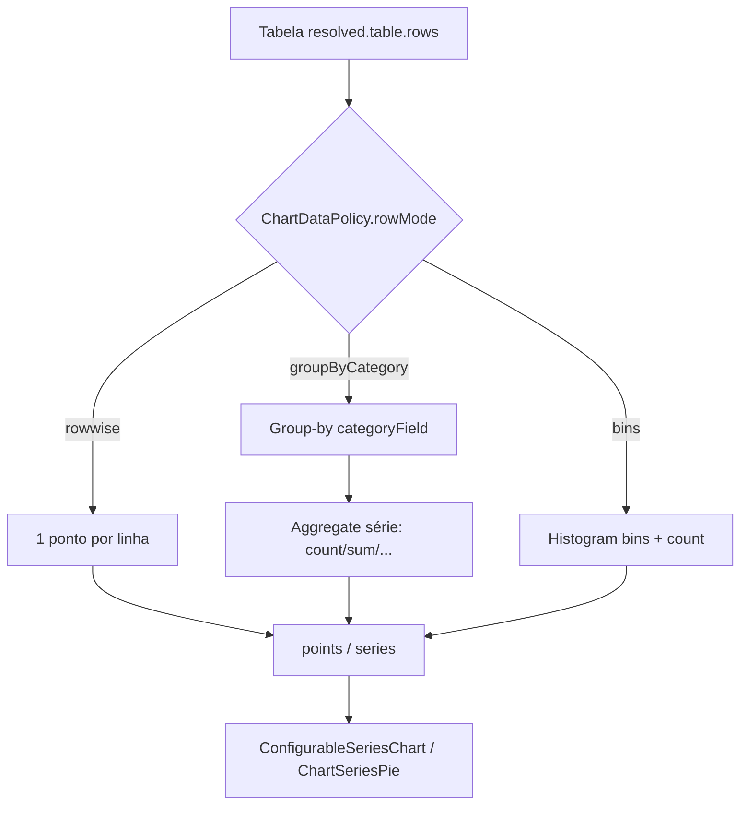

# Playbook — Políticas de dados por tipo de gráfico

> **Status:** P0–P3 implementados no código (jul/2026) — policy + group-by + wells/hints  
> **Pacote canônico:** `@delpi/tv-dashboard-presentation` (`chartDataPolicy` + `viewProjection`)  
> **UI:** `plugins/tv-dashboard` (wells / labels do painel Dados)  
> **Paint:** `@delpi/plugin-ui` (já renderiza pizza/rosca/etc.; não redefine encoding)

Complementa [PLAYBOOK-EXCELENCIA §19](./PLAYBOOK-EXCELENCIA.md#19-gráfico-composto-por-primitivos--edição-no-palco-onda-4g) (primitivos no palco) com a camada que faltava: **como a tabela vira pontos** conforme a classe do gráfico.

---

## 1. Problema

O catálogo de inserção já agrupa tipos em quatro classes (`series` | `comparison` | `distribution` | `special` — ver `chartCatalogTypes.ts`). O paint (SVG) já distingue pizza, colunas, dispersão, etc.

Porém a **projeção** (`buildSeriesFromTable` em `viewProjection.ts`) trata todos os tipos como gráfico de **série Cartesian**:

- 1 ponto por **linha** da tabela;
- `categoryField` só vira rótulo da linha;
- agregação (`first` / `sum` / `count`) roda **por célula**, não por grupo.

Efeito observado: pizza/rosca com **X = Tipo** e **Y = total items** → «Sem série» (campo ausente nas linhas) ou fatias por OV em vez de por TIPO.

---

## 2. Referência de mercado

| Produto | Ideia-chave | Fonte |
|---------|-------------|--------|
| **Power BI** | Wells por visual: pizza = Legend (dimensão) + Values (medida agregada); linha = eixo + medidas; agregação automática (Sum/Count) | [Pie/donut](https://learn.microsoft.com/en-us/power-bi/visuals/power-bi-visualization-pie-donut-chart), [Aggregates](https://learn.microsoft.com/en-us/power-bi/create-reports/service-aggregates) |
| **Tableau** | Mark type muda encodings (pie → Color=dimensão, Angle=medida); Show Me remapeia ao trocar visual | [Pie](https://help.tableau.com/current/pro/desktop/en-us/buildexamples_pie.htm), [Mark types](https://help.tableau.com/current/pro/desktop/en-us/viewparts_marks_marktypes.htm) |
| **Boas práticas** | Pizza ≤ ~5–6 fatias; linhas ≤ ~5 séries; scatter = medida×medida | Chart selection guides (Fabric / Tableau) |

Padrão comum: **encoding depende do tipo**; a engine **agrupa e agrega** quando a categoria se repete.

---

## 3. Princípio DELPI

```text
chartType
  → ChartDataPolicy (wells, rowMode, defaultAgg, caps)
  → buildChartPoints(rows, projection, policy)
  → points[] / series[] (contrato já consumido pelo paint)
```

- **Uma policy por `DelpiChartType`** (ou família), declarativa.
- **Projeção** no presentation package; MFE só exibe wells/labels.
- **Não** criar presenter por rota de API — a fonte entrega tabela; a policy interpreta.
- Trocar `chartType` pode **remapear** slots (como Show Me), sem apagar campos quando compatíveis.

---

## 4. Contrato `ChartDataPolicy` (alvo)

Campos sugeridos (TS canônico, ex. `chartDataPolicy.ts`):

| Campo | Significado |
|-------|-------------|
| `chartType` / `family` | Tipo ou família (`partToWhole`, `cartesian`, `xy`, …) |
| `rowMode` | `rowwise` \| `groupByCategory` \| `bins` |
| `wells` | Lista ordenada: `{ id, role, labelPt, valueKind }` |
| `defaultAggregation` | `count` \| `sum` \| `first` \| … |
| `maxCategories` / `maxSeries` | Soft caps (UX); hard cut opcional depois |
| `remapFrom` | Regras ao converter de outro tipo |

`ChartViewProjection` existente (`categoryField`, `series[]`) continua; a policy diz **como interpretar**.

---

## 5. Matriz por tipo (catálogo atual)

### 5.1 Séries — `line`, `area`

| Well | Papel | Default |
|------|--------|---------|
| Categoria (X) | Data / eixo ordenado | 1º date ou string |
| Séries (Y) | 1..N medidas | Numéricos |

- **rowMode:** `rowwise` (comportamento atual — preservar).
- **Agg default:** `first` se linha já agregada; senão `sum` quando houver duplicata de X (fase 1 opcional).

### 5.2 Comparação — `bar`, `stacked_bar`

| Well | Papel |
|------|--------|
| Categoria (X) | Dimensão discreta (TIPO, filial, …) |
| Séries (Y) | 1 medida (`bar`) ou N (`stacked_bar`) |

- **rowMode:** `groupByCategory`.
- **Agg default:** `sum` (numérico) ou `count` (sem medida útil na linha).

### 5.3 Distribuição

| Tipo | Wells | rowMode | Agg / notas |
|------|-------|---------|-------------|
| `pie`, `doughnut` | Categoria → fatia; Valor → ângulo (**1 série**) | `groupByCategory` | `count` se Y vazio/não numérico; senão `sum` |
| `histogram` | 1 medida contínua | `bins` | Contagem por faixa (N bins auto) |
| `scatter` | X medida, Y medida (, cor opcional) | `rowwise` | Sem group-by categórico |
| `bubble` | X, Y, **Size** (3 medidas) | `rowwise` | |

### 5.4 Especiais

| Tipo | Wells | rowMode |
|------|-------|---------|
| `radar` | Categorias (eixos) + 1..N medidas | `groupByCategory` ou eixos = métricas |
| `combo` | Categoria + séries (`plotOn` primary/secondary) | `groupByCategory` se X repetir |
| `waterfall` | Categoria ordenada + valor (delta) | `groupByCategory` + ordem estável |
| `funnel` | Estágio + valor | `groupByCategory` + ordenar por valor |

---

## 6. Fluxo alvo



---

## 7. Fases de entrega

### P0 — Pizza / Rosca (desbloqueio)

**Objetivo:** fatias por categoria (ex. TIPO em `list_lmps_dashboard`).

1. Introduzir `chartDataPolicy` para `pie` / `doughnut` (`groupByCategory`, 1 série, defaultAgg `count`).
2. Estender builder: se policy = groupBy → colapsar categorias distintas + agregar.
3. `suggestDefaultProjections(resolved, fieldTypes, chartType)` — defaults por tipo.
4. Fallback: Y sem valor finito nas linhas → tratar como `count` (não «Sem série» silencioso).
5. Testes: fixture LMP com TIPO → fatias LMP / AMOSTRA / OUTRO; regressão `line` sem group-by.

**Aceite P0**

- [x] Pizza/rosca + listagem + X=TIPO mostram distribuição por tipo.
- [x] Linha/área com período inalteradas.
- [x] Mensagem clara se faltar categoria.

### P1 — Comparação + funil + cascata

- Mesmo `groupByCategory` para `bar`, `stacked_bar`, `funnel`, `waterfall`.
- Stacked: N séries após group-by.
- Testes com filial/TIPO + 1–2 medidas.

### P2 — Scatter / bubble / histogram

- Policies `xy` / `xySize` / `bins`.
- UI: wells X/Y/(Size) numéricos; histograma = 1 medida.
- Testes com duas medidas contínuas + bins.

### P3 — UX e remapeamento

- Painel Dados: labels dos wells pela policy («Categoria / Valor» na pizza; «X / Y» no scatter).
- Remap ao mudar `chartType` (preservar campos compatíveis).
- Soft caps + bucket «Outros» (opcional).
- Doc no README do plugin + link neste playbook.

---

## 8. Onde implementar

| Camada | Arquivo / módulo |
|--------|------------------|
| Policy | `plugins/tv-dashboard-presentation/src/chartDataPolicy.ts` (novo) |
| Builder | `viewProjection.ts` — `buildSeriesFromTable` → `buildChartPoints(..., chartType)` |
| Defaults | `suggestDefaultProjections` + `syncViewDataLink` |
| Catálogo | `plugin-ui/.../chartCatalogTypes.ts` (já tem `category`) |
| Painel | `ChartAxesProjectionEditor.tsx`, `VisualDataViewInspector.tsx` |
| Testes | `viewProjection.test.ts`, fixtures LMP / OEE |

**Fora de escopo neste playbook:** drill hierárquico (Power BI), small multiples, treemap, conditional formatting de fatias.

---

## 9. Anti-padrões

- `if (chartType === "pie")` espalhado no MFE ou no paint — regra na **policy + builder**.
- Agregar no SQL da api-delpi só para um visual — a tabela detalhada deve continuar utilizável; group-by no chat/TV é da projeção.
- Default `first` em distribuição part-to-whole — preferir `count`/`sum` após group-by.
- Quebrar `rowwise` de linha/área ao “consertar” pizza.

---

## 10. Checklist antes do merge (qualquer fase)

- [ ] Policy cobrindo o(s) `chartType` alterado(s).
- [ ] Teste de regressão **série** (`line`/`area`) + caso novo da fase.
- [ ] `suggestDefaultProjections` ciente do `chartType`.
- [ ] Mensagem de vazio/erro legível (não só «Sem série» genérico quando faltar encoding).
- [ ] Sem CSS de componente do kit no MFE; labels PT no painel TV ou content JSON conforme padrão do plugin.

---

## 11. Ordem sugerida de PRs

1. **P0** — policy + group-by pie/doughnut + testes LMP.  
2. **P1** — bar/stacked/funnel/waterfall.  
3. **P2** — scatter/bubble/histogram.  
4. **P3** — wells dinâmicos + remap + caps.

Atualizar este documento (`Status` + checkboxes) a cada fase concluída.
