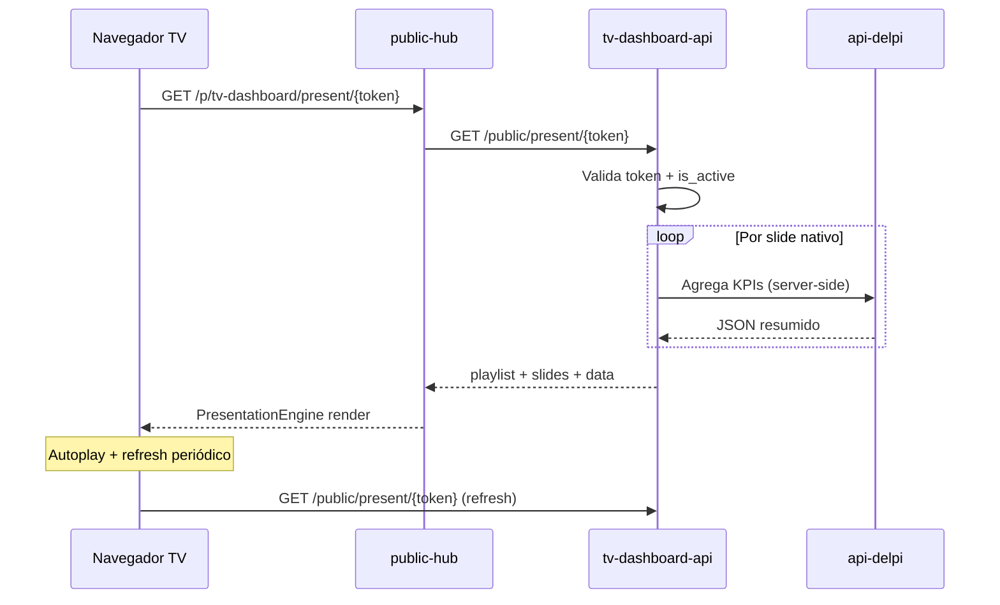

# Playbook de Excelência — TV Dashboard DELPI

> **Arquivo:** `docs/12-roadmap-e-evolucao/tv-dashboard/PLAYBOOK-EXCELENCIA.md`
> **Versão:** 1.0
> **Data:** 2026-07-05
> **Status:** Ondas 0–3 concluídas (v1) — 2026-07-05. Backlog v2: `supplies_stock_alert`, `strategic_indicators_hero`, gráficos Recharts.
> **Base:** requisito «painéis rotativos em TVs corporativas sem login» + convenções do monorepo `delpi-central` (plugins MFE, API dedicada de plugin, `public-hub`, gateway nginx)
>
> **Convenção de nomes:** identificadores técnicos (plugin, API, rotas, schema, env, permissões) em **inglês**; textos voltados ao usuário (rótulo de menu, mensagens, descrições) em **pt-BR**.

**Relacionado:**
- `docs/05-plugin-system/manifesto-plugin.md` — contrato de registro de plugin
- `docs/08-plugins/README.md` — checklist de novo plugin
- `docs/12-roadmap-e-evolucao/customer-experience/PLAYBOOK-EXCELENCIA.md` — padrão admin + página pública
- `plugins/public-hub/README.md` — shell público e contrato `PublicPageDefinition`
- `plugins/strategic-indicators/src/ui/pages/PresentationPage.tsx` — referência de autoplay/fullscreen (autenticado)
- `plugins/dashboard-production/` — referência de KPI cards e auto-refresh
- `.cursor/rules/plugins-visual-design-system.mdc` — UI nativa do portal
- `.cursor/rules/persistent-upload-storage.mdc` — se houver assets em disco
- `.cursor/rules/sql-query-development.mdc` — queries nativas que leem TOTVS

---

## 1. North Star — o que é excelência aqui

Excelência aqui **não** é «um iframe que roda Power BI». É permitir que qualquer área da empresa **monte uma programação de telas para TVs** — dashboards nativos DELPI, links externos e conteúdo misto — e **dispare um link público** que roda em loop **sem login**, estável por dias/semanas, com aparência profissional e **sem scroll** nas telas nativas.

### Jornada do usuário

1. **Gestor** (produção, qualidade, diretoria) acessa o plugin autenticado «Painéis TV».
2. Cria uma **programação** (playlist): nome, resolução alvo, transição entre telas.
3. Adiciona **telas**:
   - **Nativas** — catálogo DELPI (KPI produção, OEE, qualidade, etc.), 100% adaptáveis ao viewport.
   - **Externas** — URL (Power BI publicado, site, vídeo, outro dashboard).
4. Define **ordem**, **duração por tela** (segundos) e opcionalmente **pausa global** / **transição**.
5. **Pré-visualiza** no navegador como ficará na TV (mesmo motor da apresentação pública).
6. **Gera link público** — copia URL ou QR; pode **desativar** ou **excluir** a qualquer momento.
7. **TV de chão de fábrica** abre o link no navegador (modo kiosk); rotação automática, refresh de dados nativos, tela cheia.

### Definição operacional (métricas de sucesso)

| Métrica | Meta | Como medir |
|---|---|---|
| Tempo para criar programação com 3 telas + gerar link | ≤ 5 min | cronometragem usuário piloto |
| Apresentação pública abre sem login | 100% | curl / browser anônimo |
| Telas nativas sem scroll vertical/horizontal involuntário | 100% nos presets 16:9 | inspeção visual 1080p e 4K |
| Uptime de link ativo (TV ligada 8h/dia) | ≥ 99% sem intervenção | monitoramento + logs |
| Link desativado retorna 404 imediato | 100% | teste `is_active=false` |
| Refresh de dados nativos sem recarregar página inteira | ≤ intervalo configurável (default 5 min) | rede / DevTools |
| Token adivinhado | 0 acessos | token opaco ≥ 128 bits |

---

## 2. Escopo e decisões de arquitetura (fechadas)

| Decisão | Escolha | Racional |
|---|---|---|
| **Superfície admin** | MFE `plugins/tv-dashboard` (React 19 + Vite + Module Federation) | Padrão portal; gestão exige login/RBAC |
| **Superfície TV (sem login)** | View `present` no **`public-hub`** → `/p/tv-dashboard/present/{token}` | Padrão consolidado CX / quality-labels; gateway já cobre `/p/` |
| **API** | Serviço dedicado **`tv-dashboard-api`** (FastAPI) | Playlists, slides, tokens e catálogo não pertencem à api-delpi genérica; isolamento de schema |
| **Token público** | `secrets.token_urlsafe(32)` por **programação** | Um link = uma playlist; desativar/excluir no admin |
| **Dados das telas nativas** | Endpoints **`/public/present/{token}`** agregam payload mínimo por slide | TV não usa JWT; escopo limitado ao que o token autoriza |
| **Telas externas** | `<iframe sandbox>` com URL persistida no slide | Power BI, sites, etc.; sem proxy de conteúdo |
| **Pré-visualização** | Rota autenticada no plugin **`/preview/{playlistId}`** | Mesmo componente `PresentationEngine` da view pública; dados via JWT admin |
| **Motor de rotação** | Componente compartilhado **`PresentationEngine`** (pacote ou pasta compartilhada entre plugin + public-hub) | Evita duplicar autoplay entre preview e TV |
| **Resolução / viewport** | Campo `viewportProfile` na playlist + CSS `100dvh`/`100dvw` + escala opcional | Usuário escolhe preset; nativas usam layout fluido |
| **Chrome na TV** | Flag `chrome: "kiosk"` na `PublicPageDefinition` → shell **sem logo** DELPI | `PublicShell` hoje sempre mostra logo — incompatível com TV wall |
| **Banco** | Schema `tv_dashboard` no `postgres-plugins` | Migrations on startup (padrão `maintenance-api`) |

### Nomenclatura adotada

| Componente | Identificador (inglês) | Rótulo/usuário (pt-BR) |
|---|---|---|
| Plugin admin (MFE) | `tv-dashboard` | «Painéis TV» |
| API dedicada | `tv-dashboard-api` | — |
| Shell público (view) | `public-hub` → app `tv-dashboard`, page `present` | — |
| Rota gateway admin | `/apps/tv-dashboard-api/` | — |
| Rota gateway pública | `/p/tv-dashboard/present/{token}` | — |
| Schema Postgres | `tv_dashboard` | — |
| Prefixo CSS admin | `td-` | — |
| Prefixo CSS apresentação | `tdp-` (tv-dashboard presentation) | — |
| Permissões RBAC | `tv-dashboard.read` / `.write` / `.manage` / `.admin` | ver manifesto |

### Fora de escopo (v1)

- Controle remoto de múltiplas TVs (MDM / Chrome Sign Builder).
- Edição colaborativa em tempo real (WebSocket).
- Gravação de sessão ou analytics avançado de audiência.
- Autenticação na TV (modo kiosk anônimo é o alvo).
- Proxy server-side de Power BI (iframe direto).

---

## 3. Arquitetura alvo

```text
┌────────────────────────── PORTAL (login Keycloak) ──────────────────────────┐
│  Gestor                                                                      │
│     │                                                                        │
│     ▼                                                                        │
│  Plugin MFE tv-dashboard ──JWT──► tv-dashboard-api ──► Postgres             │
│  • Programações (CRUD)              /apps/tv-dashboard-api/    tv_dashboard  │
│  • Slides (nativo / externo)                                                 │
│  • Preview (/preview/:id)                                                    │
│  • Gerar / copiar link / QR / desativar                                      │
└──────────────────────────────────────────────────────────────────────────────┘

                    (fora do portal, SEM login)
TV / navegador kiosk ──► GET /p/tv-dashboard/present/{token}
                              │
                              ▼
                         public-hub (chrome kiosk, sem logo)
                              │
                              ▼
                    PresentationEngine (autoplay, transições)
                              │
              ┌───────────────┴───────────────┐
              ▼                               ▼
     slide.type = native              slide.type = external
     NativeScreenRegistry             <iframe src={url} />
     (React, viewport-fit)
              │
              └──► GET /apps/tv-dashboard-api/public/present/{token}
                   (payload: playlist + dados agregados por slide nativo)
```

**Regra de ouro:** o admin **nunca** é servido sem login; a apresentação **só** consome dados por token opaco. Telas nativas **nunca** embutem credenciais TOTVS no browser da TV — a API agrega no servidor com escopo do token.

### Reuso do ecossistema existente

| Peça existente | Como reutilizar |
|---|---|
| `public-hub` + `PublicPageDefinition` | Nova view `present` em `src/apps/tv-dashboard/` |
| Token + QR + URL canônica | Padrão `quality_labels_qr_service` / `customer-experience` QR |
| Autoplay / cenas | Lógica inspirada em `strategic-indicators` `PresentationPage` (intervalos, pause, fullscreen API) |
| KPI / charts nativos | Componentes visuais de `dashboard-production` (escala TV, sem scroll) |
| Auto-refresh | `useAutoRefresh` (5 min default, só quando slide nativo visível) |
| Bypass JWT | `PUBLIC_PREFIXES = ("/public/",)` no middleware da API |

---

## 4. Modelo de dados (schema `tv_dashboard`)

### 4.1 Entidades principais

```sql
CREATE SCHEMA IF NOT EXISTS tv_dashboard;

-- Programação exibida na TV (uma playlist = um link público)
CREATE TABLE tv_dashboard.playlists (
  id                UUID PRIMARY KEY DEFAULT gen_random_uuid(),
  public_token      TEXT NOT NULL UNIQUE,           -- secrets.token_urlsafe(32)
  name              TEXT NOT NULL,
  description       TEXT,
  viewport_profile  TEXT NOT NULL DEFAULT '1080p',  -- ver §6.3
  transition_style  TEXT NOT NULL DEFAULT 'fade',   -- fade | slide | none
  default_duration_sec INTEGER NOT NULL DEFAULT 30, -- fallback por slide
  global_refresh_sec   INTEGER NOT NULL DEFAULT 300,-- refresh dados nativos (5 min)
  is_active         BOOLEAN NOT NULL DEFAULT TRUE,
  view_count        INTEGER NOT NULL DEFAULT 0,
  last_presented_at TIMESTAMPTZ,
  created_by        TEXT,
  created_at        TIMESTAMPTZ NOT NULL DEFAULT now(),
  updated_at        TIMESTAMPTZ NOT NULL DEFAULT now()
);

-- Item da programação (ordem + tipo)
CREATE TABLE tv_dashboard.slides (
  id                UUID PRIMARY KEY DEFAULT gen_random_uuid(),
  playlist_id       UUID NOT NULL REFERENCES tv_dashboard.playlists(id) ON DELETE CASCADE,
  sort_order        INTEGER NOT NULL,
  slide_type        TEXT NOT NULL,                  -- native | external
  duration_sec      INTEGER,                        -- NULL => usa default da playlist
  title             TEXT NOT NULL,                  -- rótulo admin / acessibilidade
  -- Nativo
  native_screen_key TEXT,                           -- ex.: production_oee_overview
  native_config     JSONB NOT NULL DEFAULT '{}',    -- filial, período, etc.
  -- Externo
  external_url      TEXT,
  external_sandbox  TEXT DEFAULT 'allow-scripts allow-same-origin allow-presentation',
  is_active         BOOLEAN NOT NULL DEFAULT TRUE,
  created_at        TIMESTAMPTZ NOT NULL DEFAULT now(),
  updated_at        TIMESTAMPTZ NOT NULL DEFAULT now(),
  CONSTRAINT slides_type_check CHECK (
    (slide_type = 'native' AND native_screen_key IS NOT NULL AND external_url IS NULL)
    OR (slide_type = 'external' AND external_url IS NOT NULL AND native_screen_key IS NULL)
  )
);

CREATE UNIQUE INDEX idx_slides_playlist_order ON tv_dashboard.slides (playlist_id, sort_order);
CREATE INDEX idx_playlists_active ON tv_dashboard.playlists (is_active) WHERE is_active = TRUE;
```

### 4.2 Catálogo de telas nativas (tabela ou JSON versionado)

Opção recomendada v1: **JSON versionado** em `tv-dashboard-api/app/content/native_screens.json` + loader (padrão `assistant-content-json` para metadados declarativos).

```json
{
  "screens": [
    {
      "key": "production_oee_overview",
      "label": "Produção — OEE visão geral",
      "category": "production",
      "defaultDurationSec": 45,
      "configSchema": {
        "branch": { "type": "string", "optional": true },
        "periodDays": { "type": "integer", "default": 7 }
      },
      "dataEndpoint": "production.oee.summary"
    }
  ]
}
```

Cada `native_screen_key` mapeia para:
- componente React registrado em `NativeScreenRegistry` (public-hub + plugin preview);
- agregador de dados no backend (`NativeScreenDataService`) que chama api-delpi **server-side** com credencial de serviço ou cache, filtrado por `native_config`.

---

## 5. Página pública e pré-visualização

### 5.1 View pública no `public-hub`

**Rota:** `/p/tv-dashboard/present/{token}`

Registrar em `src/apps/tv-dashboard/pages.tsx`:

```ts
export const tvDashboardPages: AppPublicPages = {
  present: {
    documentTitle: "Painel TV",
    chrome: "kiosk",  // NOVO no shell — oculta logo, fullscreen-friendly
    notFoundMessage: "Este painel não está mais disponível.",
    load: (ctx) => fetchPresentation(ctx.token),
    render: (data, ctx) => (
      <PresentationEngine mode="public" payload={data} token={ctx.token} />
    ),
  },
};
```

**Extensão necessária no shell (`PublicShell` / `types.ts`):**

```ts
interface PublicPageDefinition {
  chrome?: "default" | "kiosk";  // default = logo DELPI; kiosk = palco 100vh sem chrome
  // ... load, render
}
```

### 5.2 Endpoint público (somente leitura)

```
GET /apps/tv-dashboard-api/public/present/{token}
→ 200 {
     playlist: { name, viewportProfile, transitionStyle, globalRefreshSec, ... },
     slides: [
       { id, sortOrder, slideType, durationSec, title,
         native?: { screenKey, config, data: {...} },
         external?: { url, sandbox }
       }
     ]
   }
→ 404 se token inexistente ou is_active = false
```

- Registrado em `is_public_path()` — sem JWT.
- Incrementa `view_count` e atualiza `last_presented_at` (best effort).
- **Nunca** expõe `created_by`, outros tokens, nem lista de playlists.
- Rate limit no gateway (reuso `limit_req_zone`).
- Dados nativos: payload **mínimo** necessário à tela (KPIs agregados, sem PII).

### 5.3 Pré-visualização autenticada (plugin admin)

**Rota interna do MFE:** `/apps/tv-dashboard/preview/:playlistId`

```
GET /apps/tv-dashboard-api/playlists/{id}/preview-payload
→ 200 { mesmo shape de /public/present/{token}, mas via JWT }
```

- Reutiliza **`PresentationEngine`** com `mode="preview"`.
- Barra superior opcional: controles de pause, slide anterior/próximo, indicador «Pré-visualização».
- Não incrementa `view_count` do token público.
- Permite testar **antes** de ativar o link ou com playlist ainda sem token divulgado.

### 5.4 URL pública e QR

Padrão `build_public_url(token)`:

```
{PUBLIC_BASE_URL}/p/tv-dashboard/present/{token}
```

Admin:
- `GET /playlists/{id}/public-url` → `{ url, qrSvg }`
- `POST /playlists/{id}/regenerate-token` (opcional Onda 2) — invalida link anterior

---

## 6. Telas nativas — design viewport-fit (sem scroll)

### 6.1 Princípio

Telas nativas são **layouts de apresentação**, não páginas de dashboard operacional. Devem preencher **exatamente** o viewport configurado usando:

- Container raiz: `width: 100dvw; height: 100dvh; overflow: hidden;`
- Grid/flex com `minmax(0, 1fr)` — filhos encolhem em vez de estourar.
- Tipografia com `clamp()` — KPIs e títulos escalam entre 720p e 4K.
- Gráficos Recharts com `ResponsiveContainer` e altura **percentual** do grid, não px fixo.
- **Proibido** em telas nativas v1: tabelas com muitas linhas, scroll interno, modais.

### 6.2 Catálogo inicial sugerido (Onda 0–1)

| `native_screen_key` | Conteúdo | Fonte de dados |
|---|---|---|
| `production_oee_overview` | 4 KPIs + gráfico linha OEE | api-delpi production OEE |
| `production_otd_summary` | OTD % + barras por filial | api-delpi production OTD |
| `quality_ppm_summary` | PPM + tendência | api-delpi quality |
| `supplies_stock_alert` | Top itens críticos (máx. 6) | api-delpi supplies |
| `strategic_indicators_hero` | Hero executivo simplificado | strategic-indicators-api (server-side) |
| `custom_message` | Título + subtítulo + logo (comunicados) | só config JSON, sem SQL |

Novas telas = nova entrada no JSON + componente + agregador backend + teste visual nos presets §6.3.

### 6.3 Perfis de viewport (`viewportProfile`)

| Valor | Resolução de referência | Uso |
|---|---|---|
| `1080p` | 1920×1080 (16:9) | TVs padrão |
| `4k` | 3840×2160 (16:9) | TVs 4K |
| `720p` | 1280×720 (16:9) | TVs antigas / teste |
| `1080p_portrait` | 1080×1920 (9:16) | Totens verticais (Onda 2) |

Implementação CSS:

```css
.tdp-stage[data-viewport="1080p"] {
  --tdp-base-w: 1920;
  --tdp-base-h: 1080;
  font-size: clamp(12px, 0.9vw, 22px);
}
.tdp-native-screen {
  width: 100%;
  height: 100%;
  overflow: hidden;
  display: grid;
  grid-template-rows: auto 1fr auto;
}
```

Preview e apresentação aplicam `data-viewport` no container; opcionalmente **letterbox** se a janela do preview não for 16:9 (bordas neutras, conteúdo escala proporcionalmente).

### 6.4 Telas externas

```tsx
function ExternalSlide({ url, sandbox, title }: ExternalSlideProps) {
  return (
    <iframe
      className="tdp-external-frame"
      src={url}
      title={title}
      sandbox={sandbox}
      allow="fullscreen"
      referrerPolicy="no-referrer-when-downgrade"
    />
  );
}
```

- Validação admin: URL `https://` obrigatório (exceto localhost em dev).
- Aviso ao usuário: «Sites de terceiros podem exibir barras ou exigir interação — prefira telas nativas ou Power BI em modo publicado».
- Duração configurável; iframe permanece montado ou remonta por slide (config `keepMounted` — default false para liberar memória).

---

## 7. Plugin admin — telas e fluxos

### 7.1 Rotas do MFE

| Rota | Permissão | Descrição |
|---|---|---|
| `/` | `read` | Lista de programações (ativas/inativas) |
| `/playlists/new` | `write` | Assistente de criação |
| `/playlists/:id` | `read` | Detalhe + editor de slides (drag-and-drop ordem) |
| `/playlists/:id/preview` | `read` | Pré-visualização fullscreen |
| `/playlists/:id/share` | `read` | Link, QR, copiar, desativar |

### 7.2 Editor de slides

- **Adicionar tela nativa:** modal com catálogo (categorias, busca) → form de config (filial, período) conforme `configSchema`.
- **Adicionar tela externa:** URL + título + duração + teste de carga (iframe sandbox no modal).
- **Ordenar:** drag-and-drop (`@dnd-kit` ou equivalente já usado no repo).
- **Duração:** input segundos por slide; herda default da playlist.
- **Ações:** duplicar slide, desativar slide (`is_active`), remover.

### 7.3 Gerenciamento de link

| Ação | API | Efeito |
|---|---|---|
| Copiar link | — | clipboard `{PUBLIC_BASE_URL}/p/tv-dashboard/present/{token}` |
| Baixar QR | `GET .../qr` | PNG/SVG para impressão na TV |
| Desativar | `POST .../deactivate` | `is_active=false` → público 404 |
| Reativar | `POST .../activate` | `is_active=true` |
| Excluir | `DELETE .../playlists/{id}` | CASCADE slides; token deixa de existir |

Textos PT-BR em JSON de conteúdo (`tv_dashboard_content.json`), não hardcoded nos componentes.

---

## 8. Contrato da API admin (JWT)

Envelope padrão `{ success, message, data, meta }`. Mensagens em pt-BR.

| Método | Rota | Permissão | Descrição |
|---|---|---|---|
| `GET` | `/health` | pública | Healthcheck |
| `GET` | `/native-screens` | `read` | Catálogo de telas nativas |
| `POST` | `/playlists` | `write` | Cria playlist + token |
| `GET` | `/playlists` | `read` | Lista paginada |
| `GET` | `/playlists/{id}` | `read` | Detalhe com slides |
| `PATCH` | `/playlists/{id}` | `write` | Nome, viewport, defaults |
| `DELETE` | `/playlists/{id}` | `manage` | Exclui |
| `POST` | `/playlists/{id}/deactivate` | `manage` | Desativa link |
| `POST` | `/playlists/{id}/activate` | `manage` | Reativa link |
| `GET` | `/playlists/{id}/preview-payload` | `read` | Payload para preview |
| `GET` | `/playlists/{id}/qr` | `read` | QR PNG/SVG |
| `POST` | `/playlists/{id}/slides` | `write` | Adiciona slide |
| `PATCH` | `/playlists/{id}/slides/{slideId}` | `write` | Edita slide |
| `DELETE` | `/playlists/{id}/slides/{slideId}` | `write` | Remove slide |
| `POST` | `/playlists/{id}/slides/reorder` | `write` | Body: `[{ id, sortOrder }]` |
| `GET` | `/public/present/{token}` | pública | Payload apresentação TV |

---

## 9. `PresentationEngine` — comportamento

Componente central (sugestão: pacote compartilhado `plugins/tv-dashboard-presentation/` importado pelo MFE e pelo public-hub, ou duplicação mínima com teste de paridade).

| Recurso | Comportamento |
|---|---|
| Autoplay | Avança após `durationSec` do slide atual |
| Transição | `fade` / `slide` / `none` conforme playlist |
| Loop | Ao fim da lista, volta ao slide 0 |
| Pause | Tecla `Space` ou toque (preview); oculto em kiosk produção |
| Fullscreen | Duplo-clique ou `F11`; botão opcional no preview |
| Refresh | Timer `globalRefreshSec` — refetch só `/public/present/{token}` ou preview API |
| Visibilidade | Pausa autoplay se `document.hidden` (economia em TV com overlay) |
| Erro slide nativo | Tela de fallback «Dados indisponíveis» + avança após 10s |
| Erro iframe | Mensagem + avança após duração |

Inspirado em `PresentationPage.tsx` (strategic-indicators): cenas sequenciais, intervalos adaptativos, modo TV compacto.

---

## 10. Segurança

| Risco | Mitigação |
|---|---|
| Enumeração de tokens | `token_urlsafe(32)`; 404 uniforme |
| Exfiltração TOTVS | Agregação server-side; payload mínimo; sem JWT na TV |
| iframe malicioso | Sandbox; whitelist opcional de domínios (Onda 2) |
| XSS em URL externa | Validação `https://`; CSP restritivo na view kiosk |
| Link vazado | Desativar/excluir imediato; regenerar token (Onda 2) |
| Abuso de API pública | Rate limit gateway; cache curto no payload agregado |
| Dados sensíveis em TV | Telas nativas só indicadores agregados; revisão por tela |

Sem PII em logs públicos. Auditoria admin: quem criou/desativou (`created_by`, timestamps).

---

## 11. Roadmap por ondas

Estimativa: **S** ≤ 1 sprint, **M** 2–3 sprints, **L** 1 trimestre.

### Onda 0 — MVP (gestão + link + 1 tela nativa + externa)

**Objetivo:** criar programação, preview, link público funcional.

| # | Entrega | Repo/pasta | Esforço |
|---|---|---|---|
| 0.1 | Scaffold `tv-dashboard-api` (FastAPI, health, migrations) | `tv-dashboard-api/` | M |
| 0.2 | Schema `playlists` + `slides` migration V001 | api | S |
| 0.3 | CRUD playlists + slides + reorder | api | M |
| 0.4 | `GET /public/present/{token}` + agregador 1 tela nativa (`production_oee_overview`) | api | M |
| 0.5 | Extensão `PublicPageDefinition.chrome = kiosk` no public-hub | `plugins/public-hub` | S |
| 0.6 | View `tv-dashboard/present` + `PresentationEngine` básico | `plugins/public-hub` | M |
| 0.7 | Plugin MFE: lista + editor + preview + copiar link | `plugins/tv-dashboard` | L |
| 0.8 | Tela nativa `production_oee_overview` viewport-fit | public-hub + api | M |
| 0.9 | Suporte slide externo (iframe) | public-hub | S |
| 0.10 | Gateway `/apps/tv-dashboard-api/` + compose + manifesto RBAC | infra + plugin | S |

**Critérios de aceite Onda 0:**
- [x] Usuário logado cria programação com 2 slides (nativo + Power BI URL) e define duração.
- [x] Preview mostra rotação igual à TV.
- [x] Link `/p/tv-dashboard/present/{token}` abre **sem login** e roda em loop.
- [x] Desativar programação → link retorna 404.
- [x] Tela nativa OEE em 1920×1080 **sem scroll**.

### Onda 1 — Catálogo nativo + resolução + QR

| # | Entrega | Esforço |
|---|---|---|
| 1.1 | Catálogo JSON + 4 telas nativas adicionais | M |
| 1.2 | Seletor `viewportProfile` no admin + CSS presets | M |
| 1.3 | Geração QR + download PNG | S |
| 1.4 | Transições `fade` / `slide` | S |
| 1.5 | Auto-refresh configurável (`globalRefreshSec`) | S |
| 1.6 | Tela `custom_message` (comunicados internos) | S |

### Onda 2 — Governança e operação

| # | Entrega | Esforço |
|---|---|---|
| 2.1 | Duplicar programação / slide | S |
| 2.2 | Regenerar token (invalida anterior) | S |
| 2.3 | Whitelist domínios iframe | M |
| 2.4 | Histórico `view_count`, `last_presented_at` no admin | S |
| 2.5 | Permissões granulares por área (filial no config) | M |
| 2.6 | Modo retrato `1080p_portrait` | M |

### Onda 3 — Escala e integração

| # | Entrega | Esforço |
|---|---|---|
| 3.1 | Cache agressivo + Saúde SQL para agregadores nativos | M |
| 3.2 | Importar slide a partir de dashboard portal existente | L |
| 3.3 | API leitura «status da TV» (último heartbeat — opcional beacon) | M |
| 3.4 | Pacote compartilhado `tv-dashboard-presentation` publicado no monorepo | M |

---

## 12. Gates e testes (antes do merge)

| Escopo | Comando |
|---|---|
| API | `cd tv-dashboard-api && pytest tests/ -q` |
| Plugin admin | `cd plugins/tv-dashboard && npm run build` |
| Public-hub | `cd plugins/public-hub && npm run build` |
| Público sem login | `curl -s -o /dev/null -w "%{http_code}" /p/tv-dashboard/present/{token}` → 200; sem `Authorization` |
| Token inválido / inativo | → 404 |
| Preview | JWT válido → preview-payload 200 |
| Visual nativo | Checklist manual 1080p + 4K sem scroll |
| SQL (telas nativas) | Medir latência agregadores; cache TTL ≥ 60s |

Testes mínimos API: token único, reorder slides, `is_active=false`, shape do payload público, agregador OEE com mock api-delpi.

Testes mínimos front: `PresentationEngine` avança slides mock, preview ≠ increment view_count.

---

## 13. Checklist de novo plugin

1. Copiar esqueleto de `plugins/dashboard-production` (MFE) + `customer-experience-api` (API dedicada).
2. Manifesto `tv-dashboard.manifest.json` — rotas, permissões pt-BR, `backend: tv-dashboard-api`.
3. Registrar app público em `public-hub/src/shell/registry.ts`.
4. Volume persistente **somente** se QR/assets em disco (padrão CX).
5. `infra/docker-compose.yml` + `.dev.yml`: serviços `delpi-tv-dashboard`, `tv-dashboard-api`.
6. `gateway/nginx.conf`: location `/apps/tv-dashboard-api/` ( `/p/` já existe).
7. `docs/08-plugins/README.md` — entrada no inventário.
8. Conteúdo PT-BR em JSON (`tv_dashboard_content.json`), não strings soltas no React/Python de domínio.

---

## 14. Riscos e mitigações

| Risco | Impacto | Mitigação |
|---|---|---|
| Power BI bloqueia iframe | Slide externo em branco | Documentar «publicar para web»; fallback mensagem |
| Logo DELPI no shell público | Quebra estética TV | `chrome: kiosk` na Onda 0 |
| Payload público pesado | TV trava | Agregação mínima + cache + limite slides |
| Duplicação PresentationEngine | Drift preview vs TV | Pacote compartilhado na Onda 3; teste paridade antes |
| Credencial server-side api-delpi | Vazamento | Conta de serviço read-only; sem segredos no front |
| Scroll em telas nativas | UX ruim em TV | Gate visual CI manual + `overflow: hidden` contract |

---

## 15. Diagrama de sequência (apresentação pública)



---

## 16. Próximo passo imediato (v2)

1. **`supplies_stock_alert`** — top 6 itens críticos (endpoint api-delpi + tela nativa).
2. **`strategic_indicators_hero`** — gateway strategic-indicators-api + componente hero.
3. **Gráficos Recharts** — séries OEE/OTD/PPM no pacote `@delpi/tv-dashboard-presentation`.
4. **Rate limit dedicado** em dev nginx para `GET /public/present/*`.

---

## 16 (histórico v1)

1. Validar com stakeholders o **catálogo inicial** de telas nativas (§6.2).
2. Decidir conta de serviço api-delpi para agregação server-side.
3. Implementar **Onda 0.1–0.2** (scaffold API + schema) em branch dedicada.
4. Prototipar **uma** tela nativa viewport-fit antes do editor completo — prova de layout 16:9.

---

*Documento vivo — atualizar status e critérios de aceite conforme ondas forem concluídas.*
