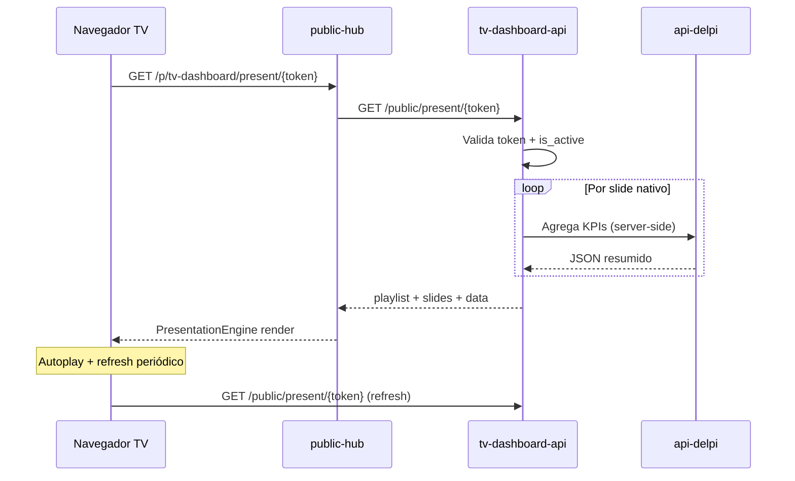

# Playbook de Excelência — TV Dashboard DELPI

> **Arquivo:** `docs/12-roadmap-e-evolucao/tv-dashboard/PLAYBOOK-EXCELENCIA.md`
> **Versão:** 1.5
> **Data:** 2026-07-10
> **Status:** … **v1.5 (jul/2026):** 4E.3–4E.5 ✅ (master slide, build order, export PNG); tipos avançados SVG ✅ (stacked/histogram/scatter/bubble/radar/waterfall/funnel). **Onda 4G/4H** ✅. **Backlog v2:** Recharts em telas nativas OEE/OTD.
> **Base:** requisito «painéis rotativos em TVs corporativas sem login» + convenções do monorepo `delpi-central` (plugins MFE, API dedicada de plugin, `public-hub`, gateway nginx)
>
> **Convenção de nomes:** identificadores técnicos (plugin, API, rotas, schema, env, permissões) em **inglês**; textos voltados ao usuário (rótulo de menu, mensagens, descrições) em **pt-BR**.

**Relacionado:**
- [`README.md`](./README.md) — **documentação operacional** (arquitetura, deploy, troubleshooting)
- `docs/05-plugin-system/manifesto-plugin.md` — contrato de registro de plugin
- `docs/08-plugins/README.md` — checklist de novo plugin
- `docs/12-roadmap-e-evolucao/customer-experience/PLAYBOOK-EXCELENCIA.md` — padrão admin + página pública
- `plugins/public-hub/README.md` — shell público e contrato `PublicPageDefinition`
- `plugins/strategic-indicators/src/ui/pages/PresentationPage.tsx` — referência de autoplay/fullscreen (autenticado)
- `plugins/dashboard-production/` — referência de KPI cards e auto-refresh
- `.cursor/rules/plugins-visual-design-system.mdc` — UI nativa do portal
- `.cursor/rules/persistent-upload-storage.mdc` — se houver assets em disco
- `.cursor/rules/sql-query-development.mdc` — queries nativas que leem TOTVS

---

## 1. North Star — o que é excelência aqui

Excelência aqui **não** é «um iframe que roda Power BI». É permitir que qualquer área da empresa **monte uma programação de telas para TVs** — dashboards nativos DELPI, links externos e conteúdo misto — e **dispare um link público** que roda em loop **sem login**, estável por dias/semanas, com aparência profissional e **sem scroll** nas telas nativas.

### Jornada do usuário

1. **Gestor** (produção, qualidade, diretoria) acessa o plugin autenticado «Painéis TV».
2. Cria uma **programação** (playlist): nome, resolução alvo, transição entre telas.
3. Adiciona **telas**:
   - **Nativas** — catálogo DELPI (KPI produção, OEE, qualidade, etc.), 100% adaptáveis ao viewport.
   - **Externas** — URL (Power BI publicado, site, vídeo, outro dashboard).
4. Define **ordem**, **duração por tela** (segundos) e opcionalmente **pausa global** / **transição**.
5. **Pré-visualiza** no navegador como ficará na TV (mesmo motor da apresentação pública).
6. **Gera link público** — copia URL ou QR; pode **desativar** ou **excluir** a qualquer momento.
7. **TV de chão de fábrica** abre o link no navegador (modo kiosk); rotação automática, refresh de dados nativos, tela cheia.

### Definição operacional (métricas de sucesso)

| Métrica | Meta | Como medir |
|---|---|---|
| Tempo para criar programação com 3 telas + gerar link | ≤ 5 min | cronometragem usuário piloto |
| Apresentação pública abre sem login | 100% | curl / browser anônimo |
| Telas nativas sem scroll vertical/horizontal involuntário | 100% nos presets 16:9 | inspeção visual 1080p e 4K |
| Uptime de link ativo (TV ligada 8h/dia) | ≥ 99% sem intervenção | monitoramento + logs |
| Link desativado retorna 404 imediato | 100% | teste `is_active=false` |
| Refresh de dados nativos sem recarregar página inteira | ≤ intervalo configurável (default 5 min) | rede / DevTools |
| Token adivinhado | 0 acessos | token opaco ≥ 128 bits |

---

## 2. Escopo e decisões de arquitetura (fechadas)

| Decisão | Escolha | Racional |
|---|---|---|
| **Superfície admin** | MFE `plugins/tv-dashboard` (React 19 + Vite + Module Federation) | Padrão portal; gestão exige login/RBAC |
| **Superfície TV (sem login)** | View `present` no **`public-hub`** → `/p/tv-dashboard/present/{token}` | Padrão consolidado CX / quality-labels; gateway já cobre `/p/` |
| **API** | Serviço dedicado **`tv-dashboard-api`** (FastAPI) | Playlists, slides, tokens e catálogo não pertencem à api-delpi genérica; isolamento de schema |
| **Token público** | `secrets.token_urlsafe(32)` por **programação** | Um link = uma playlist; desativar/excluir no admin |
| **Dados das telas nativas** | Endpoints **`/public/present/{token}`** agregam payload mínimo por slide | TV não usa JWT; escopo limitado ao que o token autoriza |
| **Telas externas** | `<iframe sandbox>` com URL persistida no slide | Power BI, sites, etc.; sem proxy de conteúdo |
| **Pré-visualização** | Rota autenticada no plugin **`/preview/{playlistId}`** | Mesmo componente `PresentationEngine` da view pública; dados via JWT admin |
| **Motor de rotação** | Componente compartilhado **`PresentationEngine`** (pacote ou pasta compartilhada entre plugin + public-hub) | Evita duplicar autoplay entre preview e TV |
| **Resolução / viewport** | Campo `viewportProfile` na playlist + CSS `100dvh`/`100dvw` + escala opcional | Usuário escolhe preset; nativas usam layout fluido |
| **Chrome na TV** | Flag `chrome: "kiosk"` na `PublicPageDefinition` → shell **sem logo** DELPI | `PublicShell` hoje sempre mostra logo — incompatível com TV wall |
| **Banco** | Schema `tv_dashboard` no `postgres-plugins` | Migrations on startup (padrão `maintenance-api`) |

### Nomenclatura adotada

| Componente | Identificador (inglês) | Rótulo/usuário (pt-BR) |
|---|---|---|
| Plugin admin (MFE) | `tv-dashboard` | «Painéis TV» |
| API dedicada | `tv-dashboard-api` | — |
| Shell público (view) | `public-hub` → app `tv-dashboard`, page `present` | — |
| Rota gateway admin | `/apps/tv-dashboard-api/` | — |
| Rota gateway pública | `/p/tv-dashboard/present/{token}` | — |
| Schema Postgres | `tv_dashboard` | — |
| Prefixo CSS admin | `td-` | — |
| Prefixo CSS apresentação | `tdp-` (tv-dashboard presentation) | — |
| Permissões RBAC | `tv-dashboard.read` / `.write` / `.manage` / `.admin` | ver manifesto |

### Fora de escopo (v1)

- Controle remoto de múltiplas TVs (MDM / Chrome Sign Builder).
- Gravação de sessão ou analytics avançado de audiência.
- Autenticação na TV (modo kiosk anônimo é o alvo).
- Proxy server-side de Power BI (iframe direto).

### Entregue em v1.1 (jul/2026)

- Comunicados visuais (`custom_message` v2) com blocos, imagens e vídeos.
- Upload de mídia persistente + rota pública de serve.
- WebSocket push (`presentation_updated`) — TV, preview e editor.
- Miniaturas nos cards do editor.

### Entregue em v1.2 (jul/2026) — editor deck

- Layout **PowerPoint-like**: filmstrip, palco central, painel de propriedades, abas Página Inicial / Inserir / Formatar / Tela / Programação.
- Interação canvas: seleção, drag (threshold 5px), resize **8 handles**, duplo-clique para editar texto inline.
- Ribbon **Fonte** (família, A+/A−, negrito, itálico, sublinhado, tachado, realce, cor, limpar formatação).
- Ribbon **Parágrafo** (alinhamento H/V, justificar, entrelinhas, espaçamento entre caracteres).
- Blocos: `heading`, `text`, `image`, `video`, `shape` (6 formas SVG); links em texto; rotação numérica; camadas `zIndex ±1`.
- Filmstrip com thumbnail **ao vivo** (`CustomSlideEditorLayout` + `serializeComunicadoConfig`).
- Pacote compartilhado `@delpi/tv-dashboard-presentation` (`comunicadoTypes`, `comunicadoHelpers`, `ComunicadoBlockView`).

### Entregue em v1.3 (jul/2026) — Onda 4A / 4B / 4D (parcial)

**Produtividade (4A):**

| Item | Entrega |
|---|---|
| 4A.1 | Undo/redo (pilha ~50) + Ctrl+Z / Ctrl+Y |
| 4A.2 | Duplicar bloco + Ctrl+D |
| 4A.3 | Delete, setas nudge (1px / 10px com Shift), atalhos teclado |
| 4A.4 | Opacidade + objectFit (cover/contain) no ribbon |
| 4A.5 | Lock aspect ratio (Shift+resize) |
| 4A.6 | Snap 5% + guias ao centro do palco |
| 4A.7 | Alinhar / distribuir (`comunicadoLayoutAlign.ts`) |
| 4A.8 | Biblioteca de mídia da playlist — `GET /playlists/{id}/media` + `MediaLibraryModal` |

**Visual e templates (4B):**

| Item | Entrega |
|---|---|
| 4B.1 | Painel templates (`ComunicadoSlideTemplatesPanel`) + `GET /content/slide-presets/{preset_key}` |
| 4B.2 | Temas de cor (`comunicadoSlideThemes.ts`) |
| 4B.3 | Fundo gradiente (linear 2 stops) |
| 4B.4 | Sombras, bordas e raio (`boxShadow`, `borderWidth`, `borderRadius`) |
| 4B.5 | Formas `star`, `chevron-right` + bloco `icon` (Lucide) |
| 4B.6 | Crop de imagem (`imageCrop` x/y/w/h % + `comunicadoImageCrop.ts`) |

**Layout avançado (4D):**

| Item | Entrega |
|---|---|
| 4D.1 | Multi-seleção (Shift+click, marquee) |
| 4D.2 | Agrupar / desagrupar (`groupId`, `comunicadoGrouping.ts`) |
| 4D.3 | Painel de camadas com drag-reorder (`ComunicadoLayersPanel`) |
| 4D.4 | Rotação por handle no canvas |
| 4D.5 | Zoom do palco 50–200% |
| 4D.6 | Link em imagem, vídeo, forma e ícone |

**UX editor (transversal):**

- Texto e link editados **no palco** (`ComunicadoEditorTextBlock`, `ComunicadoEditorLinkChrome`) — inspector sem duplicar Conteúdo/Link.
- Aba **Camadas** no painel lateral (`DeckElementSidePanel`).

**Commits de referência (main, jul/2026):** `dec7ded6f` (UX/camadas), `07e68c00e` (templates/temas), `af53f6aa0` (visual/alinhar/zoom/link), `6d968a5f7` (agrupar/rotação/formas), `2b9d122fc` (biblioteca mídia + crop).

**Ainda pendente:** Recharts em telas nativas OEE/OTD (v2). 4E.3–4E.5 e tipos avançados SVG concluídos (v1.5).

---

## 3. Arquitetura alvo

```text
┌────────────────────────── PORTAL (login Keycloak) ──────────────────────────┐
│  Gestor                                                                      │
│     │                                                                        │
│     ▼                                                                        │
│  Plugin MFE tv-dashboard ──JWT──► tv-dashboard-api ──► Postgres             │
│  • Programações (CRUD)              /apps/tv-dashboard-api/    tv_dashboard  │
│  • Slides (nativo / externo)                                                 │
│  • Preview (/preview/:id)                                                    │
│  • Gerar / copiar link / QR / desativar                                      │
└──────────────────────────────────────────────────────────────────────────────┘

                    (fora do portal, SEM login)
TV / navegador kiosk ──► GET /p/tv-dashboard/present/{token}
                              │
                              ▼
                         public-hub (chrome kiosk, sem logo)
                              │
                              ▼
                    PresentationEngine (autoplay, transições)
                              │
              ┌───────────────┴───────────────┐
              ▼                               ▼
     slide.type = native              slide.type = external
     NativeScreenRegistry             <iframe src={url} />
     (React, viewport-fit)
              │
              └──► GET /apps/tv-dashboard-api/public/present/{token}
                   (payload: playlist + dados agregados por slide nativo)
```

**Regra de ouro:** o admin **nunca** é servido sem login; a apresentação **só** consome dados por token opaco. Telas nativas **nunca** embutem credenciais TOTVS no browser da TV — a API agrega no servidor com escopo do token.

### Reuso do ecossistema existente

| Peça existente | Como reutilizar |
|---|---|
| `public-hub` + `PublicPageDefinition` | Nova view `present` em `src/apps/tv-dashboard/` |
| Token + QR + URL canônica | Padrão `quality_labels_qr_service` / `customer-experience` QR |
| Autoplay / cenas | Lógica inspirada em `strategic-indicators` `PresentationPage` (intervalos, pause, fullscreen API) |
| KPI / charts nativos | Componentes visuais de `dashboard-production` (escala TV, sem scroll) |
| Auto-refresh | `useAutoRefresh` (5 min default, só quando slide nativo visível) |
| Bypass JWT | `PUBLIC_PREFIXES = ("/public/",)` no middleware da API |

---

## 4. Modelo de dados (schema `tv_dashboard`)

### 4.1 Entidades principais

```sql
CREATE SCHEMA IF NOT EXISTS tv_dashboard;

-- Programação exibida na TV (uma playlist = um link público)
CREATE TABLE tv_dashboard.playlists (
  id                UUID PRIMARY KEY DEFAULT gen_random_uuid(),
  public_token      TEXT NOT NULL UNIQUE,           -- secrets.token_urlsafe(32)
  name              TEXT NOT NULL,
  description       TEXT,
  viewport_profile  TEXT NOT NULL DEFAULT '1080p',  -- ver §6.3
  transition_style  TEXT NOT NULL DEFAULT 'fade',   -- fade | slide | none
  default_duration_sec INTEGER NOT NULL DEFAULT 30, -- fallback por slide
  global_refresh_sec   INTEGER NOT NULL DEFAULT 300,-- refresh dados nativos (5 min)
  is_active         BOOLEAN NOT NULL DEFAULT TRUE,
  view_count        INTEGER NOT NULL DEFAULT 0,
  last_presented_at TIMESTAMPTZ,
  created_by        TEXT,
  created_at        TIMESTAMPTZ NOT NULL DEFAULT now(),
  updated_at        TIMESTAMPTZ NOT NULL DEFAULT now()
);

-- Item da programação (ordem + tipo)
CREATE TABLE tv_dashboard.slides (
  id                UUID PRIMARY KEY DEFAULT gen_random_uuid(),
  playlist_id       UUID NOT NULL REFERENCES tv_dashboard.playlists(id) ON DELETE CASCADE,
  sort_order        INTEGER NOT NULL,
  slide_type        TEXT NOT NULL,                  -- native | external
  duration_sec      INTEGER,                        -- NULL => usa default da playlist
  title             TEXT NOT NULL,                  -- rótulo admin / acessibilidade
  -- Nativo
  native_screen_key TEXT,                           -- ex.: production_oee_overview
  native_config     JSONB NOT NULL DEFAULT '{}',    -- filial, período, etc.
  -- Externo
  external_url      TEXT,
  external_sandbox  TEXT DEFAULT 'allow-scripts allow-same-origin allow-presentation',
  is_active         BOOLEAN NOT NULL DEFAULT TRUE,
  created_at        TIMESTAMPTZ NOT NULL DEFAULT now(),
  updated_at        TIMESTAMPTZ NOT NULL DEFAULT now(),
  CONSTRAINT slides_type_check CHECK (
    (slide_type = 'native' AND native_screen_key IS NOT NULL AND external_url IS NULL)
    OR (slide_type = 'external' AND external_url IS NOT NULL AND native_screen_key IS NULL)
  )
);

CREATE UNIQUE INDEX idx_slides_playlist_order ON tv_dashboard.slides (playlist_id, sort_order);
CREATE INDEX idx_playlists_active ON tv_dashboard.playlists (is_active) WHERE is_active = TRUE;
```

### 4.2 Catálogo de telas nativas (tabela ou JSON versionado)

Opção recomendada v1: **JSON versionado** em `tv-dashboard-api/app/content/native_screens.json` + loader (padrão `assistant-content-json` para metadados declarativos).

```json
{
  "screens": [
    {
      "key": "production_oee_overview",
      "label": "Produção — OEE visão geral",
      "category": "production",
      "defaultDurationSec": 45,
      "configSchema": {
        "branch": { "type": "string", "optional": true },
        "periodDays": { "type": "integer", "default": 7 }
      },
      "dataEndpoint": "production.oee.summary"
    }
  ]
}
```

Cada `native_screen_key` mapeia para:
- componente React registrado em `NativeScreenRegistry` (public-hub + plugin preview);
- agregador de dados no backend (`NativeScreenDataService`) que chama api-delpi **server-side** com credencial de serviço ou cache, filtrado por `native_config`.

---

## 5. Página pública e pré-visualização

### 5.1 View pública no `public-hub`

**Rota:** `/p/tv-dashboard/present/{token}`

Registrar em `src/apps/tv-dashboard/pages.tsx`:

```ts
export const tvDashboardPages: AppPublicPages = {
  present: {
    documentTitle: "Painel TV",
    chrome: "kiosk",  // NOVO no shell — oculta logo, fullscreen-friendly
    notFoundMessage: "Este painel não está mais disponível.",
    load: (ctx) => fetchPresentation(ctx.token),
    render: (data, ctx) => (
      <PresentationEngine mode="public" payload={data} token={ctx.token} />
    ),
  },
};
```

**Extensão necessária no shell (`PublicShell` / `types.ts`):**

```ts
interface PublicPageDefinition {
  chrome?: "default" | "kiosk";  // default = logo DELPI; kiosk = palco 100vh sem chrome
  // ... load, render
}
```

### 5.2 Endpoint público (somente leitura)

```
GET /apps/tv-dashboard-api/public/present/{token}
→ 200 {
     playlist: { name, viewportProfile, transitionStyle, globalRefreshSec, ... },
     slides: [
       { id, sortOrder, slideType, durationSec, title,
         native?: { screenKey, config, data: {...} },
         external?: { url, sandbox }
       }
     ]
   }
→ 404 se token inexistente ou is_active = false
```

- Registrado em `is_public_path()` — sem JWT.
- Incrementa `view_count` e atualiza `last_presented_at` (best effort).
- **Nunca** expõe `created_by`, outros tokens, nem lista de playlists.
- Rate limit no gateway (reuso `limit_req_zone`).
- Dados nativos: payload **mínimo** necessário à tela (KPIs agregados, sem PII).

### 5.3 Pré-visualização autenticada (plugin admin)

**Rota interna do MFE:** `/apps/tv-dashboard/preview/:playlistId`

```
GET /apps/tv-dashboard-api/playlists/{id}/preview-payload
→ 200 { mesmo shape de /public/present/{token}, mas via JWT }
```

- Reutiliza **`PresentationEngine`** com `mode="preview"`.
- Barra superior opcional: controles de pause, slide anterior/próximo, indicador «Pré-visualização».
- Não incrementa `view_count` do token público.
- Permite testar **antes** de ativar o link ou com playlist ainda sem token divulgado.

### 5.4 URL pública e QR

Padrão `build_public_url(token)`:

```
{PUBLIC_BASE_URL}/p/tv-dashboard/present/{token}
```

Admin:
- `GET /playlists/{id}/public-url` → `{ url, qrSvg }`
- `POST /playlists/{id}/regenerate-token` (opcional Onda 2) — invalida link anterior

---

## 6. Telas nativas — design viewport-fit (sem scroll)

### 6.1 Princípio

Telas nativas são **layouts de apresentação**, não páginas de dashboard operacional. Devem preencher **exatamente** o viewport configurado usando:

- Container raiz: `width: 100dvw; height: 100dvh; overflow: hidden;`
- Grid/flex com `minmax(0, 1fr)` — filhos encolhem em vez de estourar.
- Tipografia com `clamp()` — KPIs e títulos escalam entre 720p e 4K.
- Gráficos Recharts com `ResponsiveContainer` e altura **percentual** do grid, não px fixo.
- **Proibido** em telas nativas v1: tabelas com muitas linhas, scroll interno, modais.

### 6.2 Catálogo inicial sugerido (Onda 0–1)

| `native_screen_key` | Conteúdo | Fonte de dados |
|---|---|---|
| `production_oee_overview` | 4 KPIs + gráfico linha OEE | api-delpi production OEE |
| `production_otd_summary` | OTD % + barras por filial | api-delpi production OTD |
| `quality_ppm_summary` | PPM + tendência | api-delpi quality |
| `supplies_stock_alert` | Top itens críticos (máx. 6) | api-delpi supplies |
| `strategic_indicators_hero` | Hero executivo simplificado | strategic-indicators-api (server-side) |
| `custom_message` | Comunicado visual — blocos (título, texto, imagem, vídeo) + fundo | config JSON + mídia em disco |

Novas telas = nova entrada no JSON + componente + agregador backend + teste visual nos presets §6.3.

### 6.3 Perfis de viewport (`viewportProfile`)

| Valor | Resolução de referência | Uso |
|---|---|---|
| `1080p` | 1920×1080 (16:9) | TVs padrão |
| `4k` | 3840×2160 (16:9) | TVs 4K |
| `720p` | 1280×720 (16:9) | TVs antigas / teste |
| `1080p_portrait` | 1080×1920 (9:16) | Totens verticais (Onda 2) |

Implementação CSS:

```css
.tdp-stage[data-viewport="1080p"] {
  --tdp-base-w: 1920;
  --tdp-base-h: 1080;
  font-size: clamp(12px, 0.9vw, 22px);
}
.tdp-native-screen {
  width: 100%;
  height: 100%;
  overflow: hidden;
  display: grid;
  grid-template-rows: auto 1fr auto;
}
```

Preview e apresentação aplicam `data-viewport` no container; opcionalmente **letterbox** se a janela do preview não for 16:9 (bordas neutras, conteúdo escala proporcionalmente).

### 6.4 Telas externas

```tsx
function ExternalSlide({ url, sandbox, title }: ExternalSlideProps) {
  return (
    <iframe
      className="tdp-external-frame"
      src={url}
      title={title}
      sandbox={sandbox}
      allow="fullscreen"
      referrerPolicy="no-referrer-when-downgrade"
    />
  );
}
```

- Validação admin: URL `https://` obrigatório (exceto localhost em dev).
- Aviso ao usuário: «Sites de terceiros podem exibir barras ou exigir interação — prefira telas nativas ou Power BI em modo publicado».
- Duração configurável; iframe permanece montado ou remonta por slide (config `keepMounted` — default false para liberar memória).

---

## 7. Plugin admin — telas e fluxos

### 7.1 Rotas do MFE

| Rota | Permissão | Descrição |
|---|---|---|
| `/` | `read` | Lista de programações (ativas/inativas) |
| `/playlists/new` | `write` | Assistente de criação |
| `/playlists/:id` | `read` | Detalhe + editor de slides (drag-and-drop ordem) |
| `/playlists/:id/preview` | `read` | Pré-visualização fullscreen |
| `/playlists/:id/share` | `read` | Link, QR, copiar, desativar |

### 7.2 Editor de slides

- **Adicionar tela nativa:** modal com catálogo (categorias, busca) → form de config (filial, período) conforme `configSchema`.
- **Adicionar tela externa:** URL + título + duração + teste de carga (iframe sandbox no modal).
- **Ordenar:** drag-and-drop (`@dnd-kit` ou equivalente já usado no repo).
- **Duração:** input segundos por slide; herda default da playlist.
- **Ações:** duplicar slide, desativar slide (`is_active`), remover.

### 7.3 Gerenciamento de link

| Ação | API | Efeito |
|---|---|---|
| Copiar link | — | clipboard `{PUBLIC_BASE_URL}/p/tv-dashboard/present/{token}` |
| Baixar QR | `GET .../qr` | PNG/SVG para impressão na TV |
| Desativar | `POST .../deactivate` | `is_active=false` → público 404 |
| Reativar | `POST .../activate` | `is_active=true` |
| Excluir | `DELETE .../playlists/{id}` | CASCADE slides; token deixa de existir |

Textos PT-BR em JSON de conteúdo (`tv_dashboard_content.json`), não hardcoded nos componentes.

---

## 8. Contrato da API admin (JWT)

Envelope padrão `{ success, message, data, meta }`. Mensagens em pt-BR.

| Método | Rota | Permissão | Descrição |
|---|---|---|---|
| `GET` | `/health` | pública | Healthcheck |
| `GET` | `/native-screens` | `read` | Catálogo de telas nativas |
| `POST` | `/playlists` | `write` | Cria playlist + token |
| `GET` | `/playlists` | `read` | Lista paginada |
| `GET` | `/playlists/{id}` | `read` | Detalhe com slides |
| `PATCH` | `/playlists/{id}` | `write` | Nome, viewport, defaults |
| `DELETE` | `/playlists/{id}` | `manage` | Exclui |
| `POST` | `/playlists/{id}/deactivate` | `manage` | Desativa link |
| `POST` | `/playlists/{id}/activate` | `manage` | Reativa link |
| `GET` | `/playlists/{id}/preview-payload` | `read` | Payload para preview |
| `GET` | `/playlists/{id}/qr` | `read` | QR PNG/SVG |
| `POST` | `/playlists/{id}/slides` | `write` | Adiciona slide |
| `PATCH` | `/playlists/{id}/slides/{slideId}` | `write` | Edita slide |
| `DELETE` | `/playlists/{id}/slides/{slideId}` | `write` | Remove slide |
| `POST` | `/playlists/{id}/slides/reorder` | `write` | Body: `[{ id, sortOrder }]` |
| `GET` | `/public/present/{token}` | pública | Payload apresentação TV |

---

## 9. `PresentationEngine` — comportamento

Componente central (sugestão: pacote compartilhado `plugins/tv-dashboard-presentation/` importado pelo MFE e pelo public-hub, ou duplicação mínima com teste de paridade).

| Recurso | Comportamento |
|---|---|
| Autoplay | Avança após `durationSec` do slide atual |
| Transição | `fade` / `slide` / `none` conforme playlist |
| Loop | Ao fim da lista, volta ao slide 0 |
| Pause | Tecla `Space` ou toque (preview); oculto em kiosk produção |
| Fullscreen | Duplo-clique ou `F11`; botão opcional no preview |
| Refresh | Timer `globalRefreshSec` — refetch payload (fallback) |
| WebSocket | `WS /public/present/{token}/ws` ou admin `presentation-ws` — refetch imediato em `presentation_updated` |
| Visibilidade | Pausa autoplay se `document.hidden` (economia em TV com overlay) |
| Erro slide nativo | Tela de fallback «Dados indisponíveis» + avança após 10s |
| Erro iframe | Mensagem + avança após duração |

Inspirado em `PresentationPage.tsx` (strategic-indicators): cenas sequenciais, intervalos adaptativos, modo TV compacto.

---

## 10. Segurança

| Risco | Mitigação |
|---|---|
| Enumeração de tokens | `token_urlsafe(32)`; 404 uniforme |
| Exfiltração TOTVS | Agregação server-side; payload mínimo; sem JWT na TV |
| iframe malicioso | Sandbox; whitelist opcional de domínios (Onda 2) |
| XSS em URL externa | Validação `https://`; CSP restritivo na view kiosk |
| Link vazado | Desativar/excluir imediato; regenerar token (Onda 2) |
| Abuso de API pública | Rate limit gateway; cache curto no payload agregado |
| Dados sensíveis em TV | Telas nativas só indicadores agregados; revisão por tela |

Sem PII em logs públicos. Auditoria admin: quem criou/desativou (`created_by`, timestamps).

---

## 11. Roadmap por ondas

Estimativa: **S** ≤ 1 sprint, **M** 2–3 sprints, **L** 1 trimestre.

### Onda 0 — MVP (gestão + link + 1 tela nativa + externa)

**Objetivo:** criar programação, preview, link público funcional.

| # | Entrega | Repo/pasta | Esforço |
|---|---|---|---|
| 0.1 | Scaffold `tv-dashboard-api` (FastAPI, health, migrations) | `tv-dashboard-api/` | M |
| 0.2 | Schema `playlists` + `slides` migration V001 | api | S |
| 0.3 | CRUD playlists + slides + reorder | api | M |
| 0.4 | `GET /public/present/{token}` + agregador 1 tela nativa (`production_oee_overview`) | api | M |
| 0.5 | Extensão `PublicPageDefinition.chrome = kiosk` no public-hub | `plugins/public-hub` | S |
| 0.6 | View `tv-dashboard/present` + `PresentationEngine` básico | `plugins/public-hub` | M |
| 0.7 | Plugin MFE: lista + editor + preview + copiar link | `plugins/tv-dashboard` | L |
| 0.8 | Tela nativa `production_oee_overview` viewport-fit | public-hub + api | M |
| 0.9 | Suporte slide externo (iframe) | public-hub | S |
| 0.10 | Gateway `/apps/tv-dashboard-api/` + compose + manifesto RBAC | infra + plugin | S |

**Critérios de aceite Onda 0:**
- [x] Usuário logado cria programação com 2 slides (nativo + Power BI URL) e define duração.
- [x] Preview mostra rotação igual à TV.
- [x] Link `/p/tv-dashboard/present/{token}` abre **sem login** e roda em loop.
- [x] Desativar programação → link retorna 404.
- [x] Tela nativa OEE em 1920×1080 **sem scroll**.

### Onda 1 — Catálogo nativo + resolução + QR

| # | Entrega | Esforço |
|---|---|---|
| 1.1 | Catálogo JSON + 4 telas nativas adicionais | M |
| 1.2 | Seletor `viewportProfile` no admin + CSS presets | M |
| 1.3 | Geração QR + download PNG | S |
| 1.4 | Transições `fade` / `slide` | S |
| 1.5 | Auto-refresh configurável (`globalRefreshSec`) | S |
| 1.6 | Tela `custom_message` (comunicados internos) | S |

### Onda 2 — Governança e operação

| # | Entrega | Esforço |
|---|---|---|
| 2.1 | Duplicar programação / slide | S |
| 2.2 | Regenerar token (invalida anterior) | S |
| 2.3 | Whitelist domínios iframe | M |
| 2.4 | Histórico `view_count`, `last_presented_at` no admin | S |
| 2.5 | Permissões granulares por área (filial no config) | M |
| 2.6 | Modo retrato `1080p_portrait` | M |

### Onda 3 — Escala e integração

| # | Entrega | Esforço |
|---|---|---|
| 3.1 | Cache agressivo + Saúde SQL para agregadores nativos | M |
| 3.2 | Importar slide a partir de dashboard portal existente | L |
| 3.3 | API leitura «status da TV» (último heartbeat — opcional beacon) | M |
| 3.4 | Pacote compartilhado `tv-dashboard-presentation` publicado no monorepo | M |

---

## 12. Gates e testes (antes do merge)

| Escopo | Comando |
|---|---|
| API | `cd tv-dashboard-api && pytest tests/ -q` |
| Plugin admin | `cd plugins/tv-dashboard && npm run build` |
| Public-hub | `cd plugins/public-hub && npm run build` |
| Público sem login | `curl -s -o /dev/null -w "%{http_code}" /p/tv-dashboard/present/{token}` → 200; sem `Authorization` |
| Token inválido / inativo | → 404 |
| Preview | JWT válido → preview-payload 200 |
| Visual nativo | Checklist manual 1080p + 4K sem scroll |
| SQL (telas nativas) | Medir latência agregadores; cache TTL ≥ 60s |

Testes mínimos API: token único, reorder slides, `is_active=false`, shape do payload público, agregador OEE com mock api-delpi.

Testes mínimos front: `PresentationEngine` avança slides mock, preview ≠ increment view_count.

---

## 13. Checklist de novo plugin

1. Copiar esqueleto de `plugins/dashboard-production` (MFE) + `customer-experience-api` (API dedicada).
2. Manifesto `tv-dashboard.manifest.json` — rotas, permissões pt-BR, `backend: tv-dashboard-api`.
3. Registrar app público em `public-hub/src/shell/registry.ts`.
4. Volume persistente **somente** se QR/assets em disco (padrão CX).
5. `infra/docker-compose.yml` + `.dev.yml`: serviços `delpi-tv-dashboard`, `tv-dashboard-api`.
6. `gateway/nginx.conf`: location `/apps/tv-dashboard-api/` ( `/p/` já existe).
7. `docs/08-plugins/README.md` — entrada no inventário.
8. Conteúdo PT-BR em JSON (`tv_dashboard_content.json`), não strings soltas no React/Python de domínio.

---

## 14. Riscos e mitigações

| Risco | Impacto | Mitigação |
|---|---|---|
| Power BI bloqueia iframe | Slide externo em branco | Documentar «publicar para web»; fallback mensagem |
| Logo DELPI no shell público | Quebra estética TV | `chrome: kiosk` na Onda 0 |
| Payload público pesado | TV trava | Agregação mínima + cache + limite slides |
| Duplicação PresentationEngine | Drift preview vs TV | Pacote compartilhado na Onda 3; teste paridade antes |
| Credencial server-side api-delpi | Vazamento | Conta de serviço read-only; sem segredos no front |
| Scroll em telas nativas | UX ruim em TV | Gate visual CI manual + `overflow: hidden` contract |

---

## 15. Diagrama de sequência (apresentação pública)



---

## 16. Próximo passo imediato

### Telas nativas (v2 restante)

1. **Gráficos Recharts** — séries OEE/OTD/PPM no pacote `@delpi/tv-dashboard-presentation`.
2. **Rate limit dedicado** em dev nginx para `GET /public/present/*`.

### Editor personalizado (Onda 4 — ver §17)

**Concluído v1.3:** 4A.1–4A.8 (exc. 4A.9), 4B.1–4B.6, 4D.1–4D.6 — ver § «Entregue em v1.3».

**Próximo backlog editor:**

1. **Rich text** (4C) — runs ou markdown controlado.
2. **Animações / master slide** (4E).
3. **Indicadores live api-delpi** (4F) — composição mista texto + KPI/gráfico (§18; parcial).

### Concluído v2 (jul/2026)

- **`supplies_stock_alert`** — top 6 itens por valor (`/supplies/stock-value?top_limit=6`) + tela nativa.
- **`strategic_indicators_hero`** — integração `GET /strategic-indicators/integrations/tv-dashboard-hero` + componente hero.

---

## 17. Editor de slides personalizados — paridade Canva / PowerPoint

> **North star:** o gestor monta comunicados visuais na TV com a mesma fluidez de um slide deck — **misturando texto, formas, mídia e indicadores ao vivo da api-delpi** (KPI, gráfico, tabela) no mesmo slide — sem PowerPoint externo, Canva ou designer, mantendo **um único contrato** (`native_config` JSON) consumido pelo admin, preview e TV.

### 17.1 Arquitetura atual (v1.3)

```text
PlaylistEditorPage (slide custom_message)
  └── ComunicadoEditorProvider          ← estado, histórico, upload, biblioteca mídia, drag
        ├── MediaLibraryModal           ← picker assets da playlist (4A.8)
        └── CustomSlideEditorLayout     ← filmstrip ao vivo
              ├── DeckEditorChrome      ← abas + ribbons
              ├── DeckWorkspace
              │     ├── SlideFilmstrip
              │     ├── ComunicadoComposerCanvas (+ marquee, zoom, rotação handle)
              │     └── DeckElementSidePanel
              │           ├── ComunicadoElementInspector (+ crop imagem)
              │           ├── ComunicadoLayersPanel (4D.3)
              │           ├── ComunicadoSlideTemplatesPanel (4B.1)
              │           └── ComunicadoSlideBackgroundPanel
              └── auto-save debounced (~700 ms) → PATCH slide.native_config

Apresentação TV / preview
  └── NativeSlideView → RichComunicadoScreen → ComunicadoBlockView (render-only, crop, links)
```

| Camada | Pacote / pasta | Responsabilidade |
|---|---|---|
| Schema + CSS + parse | `plugins/tv-dashboard-presentation` | `comunicadoTypes`, `comunicadoHelpers`, `comunicadoBlockView` |
| Editor WYSIWYG | `plugins/tv-dashboard` | Composer, ribbons, context, hooks de interação |
| Persistência | `tv-dashboard-api` | `slides.native_config` JSONB; mídia em disco |
| Enriquecimento TV | `comunicado_enrichment_service.py` | URLs de mídia por token; **não** persiste URL no config |

**Regra de ouro (igual chat base):** evoluir comportamento transversal nos módulos canônicos (`comunicadoTypes` + helpers + `ComunicadoBlockView`) — **não** duplicar lógica de layout no ribbon, no composer ou no presenter por rota.

### 17.2 Inventário — o que já temos (v1.3)

| Domínio | Implementado |
|---|---|
| **Blocos** | `heading`, `text`, `image`, `video`, `shape`, `icon`, `data_kpi`, `data_chart`, `data_table`, `data_metric` — frame % (x/y/w/h) |
| **Texto** | 8 fontes, tamanho 12–120, negrito/itálico/sublinhado/tachado, cor, realce, entrelinhas, letter-spacing, alinhamento H (incl. justify) e V; edição inline no palco |
| **Formas** | retângulo, arredondado, elipse, triângulo, seta, chevron, estrela, linha — fill/stroke; texto opcional; link |
| **Ícones** | bloco `icon` com catálogo Lucide (`COMUNICADO_ICON_OPTIONS`) |
| **Mídia** | upload + **biblioteca da playlist**; JPG/PNG/WEBP/GIF/MP4/WEBM; preview autenticado; **crop** (`imageCrop`); link em imagem/vídeo |
| **Fundo** | cor sólida, **gradiente** linear ou imagem full-bleed |
| **Interação** | seleção única e **multi** (Shift+click, marquee); drag; 8 handles; **rotação por handle**; duplo-clique → textarea; **zoom palco 50–200%** |
| **Produtividade** | **undo/redo**, duplicar bloco, atalhos (Del, Ctrl+Z/Y/D, setas nudge), **snap 5%**, **alinhar/distribuir**, **agrupar/desagrupar** |
| **Camadas** | painel ordenável drag-reorder + ±1 no ribbon |
| **Visual bloco** | opacidade, objectFit, box-shadow, borda, border-radius |
| **Templates / temas** | presets de slide + paletas aplicáveis (`ComunicadoSlideTemplatesPanel`) |
| **Links** | URL em heading/text/**image/video/shape/icon** |
| **Chrome** | filmstrip + reorder slides; transição playlist (`fade`/`slide`/`none`); viewport presets |
| **Sync** | WebSocket `presentation_updated`; thumbnail comunicado ao vivo no filmstrip |
| **Versão config** | v2 legado headline/subtitle; v3 formas/links; **v4** icon/crop/group/data (campos opcionais) |
| **Dados live api-delpi** | ⚠ v1.4 (§18) — `data_source` + `chart_view`/`table_view`, catálogo 206 rotas, `chartOptions`, enrichment server-side |

### 17.3 Lacunas vs Canva / PowerPoint

#### Produtividade do editor (prioridade alta)

| Recurso | Canva/PPT | Status | Notas |
|---|---|---|---|
| Undo / redo | ✓ | ✅ v1.3 | Pilha ~50 no `ComunicadoEditorProvider` |
| Duplicar bloco | ✓ | ✅ v1.3 | Ctrl+D + ribbon Organizar |
| Copiar/colar bloco ou estilo | ✓ | ❌ | |
| Multi-seleção | ✓ | ✅ v1.3 | Shift+click, marquee |
| Agrupar / desagrupar | ✓ | ✅ v1.3 | `groupId` + `comunicadoGrouping.ts` |
| Alinhar / distribuir objetos | ✓ | ✅ v1.3 | `comunicadoLayoutAlign.ts` |
| Snap to grid / smart guides | ✓ | ✅ v1.3 | Snap 5% + guias centro palco |
| Lock aspect ratio (Shift+resize) | ✓ | ✅ v1.3 | `useCanvasBlockInteraction` |
| Atalhos (Del, Ctrl+B, setas nudge) | ✓ | ✅ v1.3 | `useComunicadoEditorKeyboard` |
| Zoom do palco (50%–200%) | ✓ | ✅ v1.3 | Ribbon Formatar |
| Painel de camadas ordenável | ✓ | ✅ v1.3 | `ComunicadoLayersPanel` drag-reorder |

#### Texto e tipografia (prioridade alta)

| Recurso | Canva/PPT | Status | Notas |
|---|---|---|---|
| Rich text (runs, negrito parcial) | ✓ | ✅ v1.3.2–4C.2 | `contentRuns` + editor inline |
| Bullets / listas numeradas | ✓ | ✅ v1.3.4 (4C.3) | `style.listType` + ribbon Marcadores/Numerada |
| Estilos nomeados (Título 1, Corpo) | ✓ | ✅ v1.3.5 (4C.4) | `style.namedStyle` + ribbon Estilo |
| Google Fonts / upload de fonte | ✓ | ✅ v1.3.6 (4C.5) | Catálogo curado + lazy load (`comunicadoGoogleFonts.ts`); upload ❌ |
| Sombra / contorno / reflexo texto | ✓ | ❌ | |
| Hiperlink em imagem/forma | ✓ | ✅ v1.3 | Também vídeo e ícone |

#### Visual, mídia e assets (prioridade média)

| Recurso | Canva/PPT | Status | Notas |
|---|---|---|---|
| Opacidade elemento | ✓ | ✅ v1.3 | Ribbon + inspector |
| objectFit cover/contain | ✓ | ✅ v1.3 | Ribbon Organizar |
| Crop / máscara imagem | ✓ | ✅ v1.3 | `imageCrop` % + painel Recorte |
| Sombras e bordas em blocos | ✓ | ✅ v1.3 | `boxShadow`, `borderWidth`, `borderRadius` |
| Gradientes de fundo | ✓ | ✅ v1.3 | `background.type: gradient` |
| Biblioteca de mídia da playlist | ✓ | ✅ v1.3 | `GET …/media` + `MediaLibraryModal` |
| Ícones / stickers | ✓ | ✅ v1.3 | Bloco `icon` (Lucide) |
| Tabelas simples | ✓ | ❌ | |
| Mais formas / conectores | ✓ | ⚠ | 8 formas + ícones; conectores ❌ |
| Paleta / cores recentes / tema marca | ✓ | ⚠ | Temas de slide (4B.2); paleta recente ❌ |

#### Dados operacionais live (prioridade alta — ver §18)

| Recurso | Canva/PPT | Status | Notas |
|---|---|---|---|
| KPI / número vinculado a fonte de dados | ✓ (Power BI) | ⚠ v1.3 | Bloco `data_kpi` + catálogo `/data/routes` |
| Gráfico live no slide misto | ✓ | ⚠ v1.3 | Bloco `data_chart` + preview admin |
| Tabela resumida no compositor | ✓ | ⚠ v1.3 | Bloco `data_table` |
| Parâmetros filial/período por bloco | ✓ | ⚠ | `dataFilters` + `dataDefaults` playlist |
| Refresh automático por indicador | ✓ | ⚠ | `globalRefreshSec` + `dataBinding.refreshSec` |
| Catálogo de rotas permitidas (RBAC) | — | ✅ v1.3 | `tv_data_routes.json` + gate CI |

#### Apresentação e animação (prioridade média-baixa)

| Recurso | Canva/PPT | Status | Notas |
|---|---|---|---|
| Transição **por slide** | ✓ | ✅ v1.3.7 (4E.1) | `slides.transition_style` + painel Tela |
| Animação por objeto | ✓ | ✅ v1.3.8 (4E.2) | `animations[]` fade/slide-in no inspector + TV |
| Build sequencial (aparecer um a um) | ✓ | ❌ | |
| Master slide / layout mestre | ✓ | ❌ | Logo/fundo fixos em todos os custom |
| Modo apresentador / notas | ✓ | ❌ | |

#### Colaboração e export (prioridade baixa)

| Recurso | Canva/PPT | Status |
|---|---|---|
| Export PNG/PDF do slide | ✓ | ❌ |
| Import/export PPTX | ✓ | ❌ |
| Colaboração tempo real | ✓ | ❌ |
| Comentários / histórico de versões | ✓ | ❌ |

### 17.4 Dívida técnica a resolver (pós v1.3)

| Item | Situação | Ação |
|---|---|---|
| `ComunicadoEditorRibbon` | ~~Legado~~ removido v1.3.1 — modal usa `ComunicadoEmbeddedEditorChrome` + `DeckElementSidePanel` | — |
| `opacity`, `objectFit`, `linkTarget` | ✅ expostos na UI v1.3 | Manter paridade editor/TV |
| Enrichment `version` | Sempre retorna `2` em alguns paths | Alinhar com `detectConfigVersion` (v3/v4) |
| Texto em formas | Renderiza se estilo definido | Estender ribbon Fonte quando shape selecionada |
| Bundle admin > 500 KB | Lucide + editor | Code-split futuro (aviso Rollup) |

### 17.5 Contrato `native_config` — evolução planejada

Estrutura atual (v4 — campos opcionais retrocompatíveis):

```json
{
  "version": 4,
  "headline": "…",
  "subtitle": "…",
  "background": { "type": "gradient", "from": "#0f172a", "to": "#1e3a5f", "angle": 180 },
  "blocks": [
    {
      "id": "uuid",
      "type": "heading|text|image|video|shape|icon|data_kpi|…",
      "frame": { "x": 5, "y": 12, "w": 90, "h": 18 },
      "style": {
        "fontSize": 56,
        "textAlign": "center",
        "verticalAlign": "middle",
        "zIndex": 2,
        "opacity": 1,
        "objectFit": "cover",
        "boxShadow": "0 4px 12px rgba(0,0,0,0.25)",
        "borderRadius": 8
      },
      "content": "…",
      "contentRuns": [{ "text": "…", "style": { "fontWeight": "bold", "listType": "bullet", "namedStyle": "title1" } }],
      "href": "https://…",
      "assetId": "…",
      "imageCrop": { "x": 10, "y": 5, "w": 80, "h": 90 },
      "shape": "rectangle",
      "iconName": "Star",
      "groupId": "grp-uuid",
      "dataBinding": { "operationId": "…", "params": {}, "displayMode": "kpi" }
    }
  ]
}
```

Extensões previstas (compatíveis — campos opcionais):

| Campo / entidade | Onda | Status | Uso |
|---|---|---|---|
| `style.opacity`, `style.objectFit` | 4A | ✅ | UI ribbon |
| `style.boxShadow`, `style.borderRadius` (bloco) | 4B | ✅ | Profundidade visual |
| `background.type: "gradient"` | 4B | ✅ | Fundos Canva-like |
| `imageCrop` em bloco `image` | 4B | ✅ | Viewport % dentro do frame |
| `iconName` + bloco `icon` | 4B | ✅ | Lucide |
| `groupId` em blocos | 4D | ✅ | Agrupar |
| `contentRuns[]` ou `contentHtml` sanitizado | 4C | ✅ v1.3.2 (4C.1) | Rich text |
| `contentRuns[].style.namedStyle` | 4C | ✅ v1.3.5 (4C.4) | `title1` \| `subtitle` \| `body` por linha |
| `animations[]` por bloco | 4E | ✅ v1.3.8 | `{ phase, kind, delayMs, durationMs, easing, direction }` |
| `slideTemplateKey` | 4B | ⚠ | Presets via painel templates (sem campo persistido) |
| `masterConfig` (playlist-level) | 4E | ✅ | Logo/fundo compartilhado (`master_config` JSONB) |
| Blocos `data_*` (operationId + params) | 4F | ⚠ | Indicadores api-delpi — §18 |
| `dataBinding.refreshSec` por bloco | 4F | ⚠ | Override do refresh global |
| `dataBinding.displayMode` | 4F | ⚠ | `kpi` \| `chart` \| `table` \| `auto` |

**Regras de serialização:**

- URLs de mídia **nunca** persistidas — só `assetId` (já enforced nos testes).
- Migração legado automática em `parseComunicadoConfig`.
- Bump de `version` só quando breaking; preferir campos opcionais.

### 17.6 Roadmap por ondas — editor

Estimativa: **S** ≤ 1 sprint, **M** 2–3 sprints, **L** 1 trimestre.

#### Onda 4A — Editor «profissional básico»

**Objetivo:** sensação de produto maduro sem mudar o schema de texto.

| # | Entrega | Onde | Esforço | Status |
|---|---|---|---|---|
| 4A.1 | Undo/redo (pilha no provider, limite ~50) | `comunicadoEditorContext.tsx` | M | ✅ v1.3 |
| 4A.2 | Duplicar bloco + Ctrl+D | context + ribbon Organizar | S | ✅ v1.3 |
| 4A.3 | Delete / setas nudge (1px / 10px com Shift) | `useCanvasBlockInteraction` + keyboard hook | S | ✅ v1.3 |
| 4A.4 | Opacidade + objectFit na UI | `ComunicadoFormatRibbon` / inspector | S | ✅ v1.3 |
| 4A.5 | Lock aspect ratio (Shift+resize) | `useCanvasBlockInteraction` | S | ✅ v1.3 |
| 4A.6 | Snap 5% + guias ao centro do palco | `comunicadoSnap.ts` | M | ✅ v1.3 |
| 4A.7 | Alinhar/distribuir (2+ seleção) | `comunicadoLayoutAlign.ts` | M | ✅ v1.3 |
| 4A.8 | Biblioteca de mídia da playlist | API + `MediaLibraryModal` | M | ✅ v1.3 |
| 4A.9 | Unificar ribbon legado / remover painel morto | cleanup | S | ✅ v1.3.1 |

**Critérios de aceite 4A:**

- [x] Ctrl+Z desfaz última alteração de bloco/fundo; Ctrl+Y refaz.
- [x] Duplicar bloco mantém frame deslocado (+2% x/y).
- [x] Imagem com objectFit `cover` preenche frame sem distorção visível na TV.
- [x] Snap evidente ao arrastar perto de 50% horizontal/vertical.
- [x] Testes unitários: undo stack, serialize após duplicar, helpers de snap/alinhar/crop.

#### Onda 4B — Visual e templates (Canva-lite)

| # | Entrega | Esforço | Status |
|---|---|---|---|
| 4B.1 | Templates por preset (`dashboard_slide_presets.json` + blocos default) | M | ✅ v1.3 |
| 4B.2 | Temas de cor (paleta 6 cores aplicável ao slide) | M | ✅ v1.3 |
| 4B.3 | Gradiente de fundo (linear 2 stops) | M | ✅ v1.3 |
| 4B.4 | Sombras/bordas em blocos (box-shadow, border) | S | ✅ v1.3 |
| 4B.5 | Mais formas (estrela, chevron) + ícones Lucide como bloco | M | ✅ v1.3 |
| 4B.6 | Crop imagem (viewport % dentro do frame) | L | ✅ v1.3 |

**Critérios de aceite 4B:**

- [x] Template insere blocos pré-posicionados via painel.
- [x] Fundo gradiente renderiza igual no editor, preview e TV.
- [x] Crop persiste em `imageCrop` e renderiza na TV.

#### Onda 4C — Texto rico (PowerPoint-core)

| # | Entrega | Esforço |
|---|---|---|
| 4C.1 | Modelo `contentRuns: { text, style? }[]` com fallback `content` string | M | ✅ v1.3.2 |
| 4C.2 | Editor inline com toggles parciais (negrito só na seleção) | L | ✅ v1.3.3 |
| 4C.3 | Bullets / listas numeradas | M | ✅ v1.3.4 |
| 4C.4 | Estilos nomeados (Título 1, Subtítulo, Corpo) | M | ✅ v1.3.5 |
| 4C.5 | Catálogo Google Fonts (subset curado + lazy load) | M | ✅ v1.3.6 |

**Critérios de aceite 4C:**

- [x] Slide legado (string plana) abre e salva sem perda.
- [x] Lista com 3 itens renderiza na TV com marcadores.
- [x] Negrito parcial visível no editor e na apresentação.
- [x] Estilo nomeado (Título 1 / Subtítulo / Corpo) aplicável por parágrafo no ribbon e renderizado na TV.
- [x] Fonte Google do catálogo carrega sob demanda no editor e na TV; famílias sistema permanecem sem rede extra.

#### Onda 4D — Layout avançado

| # | Entrega | Esforço | Status |
|---|---|---|---|
| 4D.1 | Multi-seleção (Shift+click, marquee) | M | ✅ v1.3 |
| 4D.2 | Agrupar / desagrupar (`groupId`) | M | ✅ v1.3 |
| 4D.3 | Painel de camadas (lista drag-reorder z-index) | M | ✅ v1.3 |
| 4D.4 | Rotação por handle (cantos) | M | ✅ v1.3 |
| 4D.5 | Zoom palco 50–200% | S | ✅ v1.3 |
| 4D.6 | Link em imagem e forma | S | ✅ v1.3 |

#### Onda 4E — Apresentação e master

| # | Entrega | Esforço | Status |
|---|---|---|---|
| 4E.1 | Transição por slide (override playlist) | M | ✅ v1.3.7 |
| 4E.2 | Animações entrada por bloco (fade/slide-in) | L | ✅ v1.3.8 |
| 4E.3 | Master slide playlist (logo + fundo fixos) | M | ✅ v1.5 |
| 4E.4 | Build order (timeline simples no inspector) | L | ✅ v1.5 |
| 4E.5 | Export PNG do slide (`html-to-image`) | M | ✅ v1.5 |

#### Onda 4F — Indicadores live api-delpi no slide personalizado (§18)

**Objetivo:** slide `custom_message` com **composição mista** — título, texto, logo **e** KPI/gráfico/tabela alimentados por rotas da api-delpi.

| # | Entrega | Repo | Esforço |
|---|---|---|---|
| 4F.1 | Catálogo TV de rotas (`tv_data_routes.json` + OpenAPI import) | `tv-dashboard-api` | M |
| 4F.2 | Tipos `data_kpi`, `data_chart`, `data_table` em `comunicadoTypes` | `tv-dashboard-presentation` | M |
| 4F.3 | UI «Inserir indicador» (busca por domínio, preview params) | `plugins/tv-dashboard` | L |
| 4F.4 | `ComunicadoDataEnrichmentService` — resolve blocos server-side | `tv-dashboard-api` | L |
| 4F.5 | Render schema-driven TV (Recharts + tabela genérica por `meta.shape`) | `tv-dashboard-presentation` | L |
| 4F.6 | Allowlist RBAC + escopo filial no token público | `tv-dashboard-api` | M |
| 4F.7 | Cache por `(operationId, params, branch)` | `native_screen_cache_service` | S |
| 4F.8 | Placeholder / erro amigável no editor quando API falha | MFE + presentation | S |

**Critérios de aceite 4F:** ver §18.6.

### 17.7 Priorização recomendada

```text
  Impacto UX × esforço (jul/2026, pós v1.4)

  Concluído v1.3 / v1.4           → 4A–4D, 4C, 4E.1–4E.2, 4F parcial (§18)
  Próximo (edição de gráfico)     → 4G composição + subseleção no palco (§19)
  Próximo (PPT)                   → 4E.3 master slide playlist
  Diferencial PowerPoint          → 4E.3–4E.5 master / build order / export
  Diferencial DELPI (dados live)  → 4F tipos avançados + Recharts nativas
  Longo prazo                     → export PPTX; 4G.8 partes em table_view
```

### 17.8 Gates de teste — editor

| Escopo | Comando / critério |
|---|---|
| Helpers comunicado | `cd plugins/tv-dashboard-presentation && npm test -- --run` |
| Estilos nomeados (4C.4) | `npm test -- --run comunicadoNamedTextStyles` |
| Crop imagem | `npm test -- --run comunicadoImageCrop` |
| Layout editor | `cd plugins/tv-dashboard && npm test -- --run comunicadoLayoutAlign comunicadoGrouping comunicadoSnap` |
| Preview filmstrip | `cd plugins/tv-dashboard && npm test -- --run slideCardPreview` |
| Build admin | `cd plugins/tv-dashboard && npm run build` |
| Build TV | `cd plugins/public-hub && npm run build` |
| Paridade editor/TV | Fixture JSON: mesmo visual admin (`ComunicadoEditorBlockView`) vs `ComunicadoBlockView` |
| Regressão mídia | `pytest tv-dashboard-api/tests/test_comunicado_media.py tests/test_media_list_route.py -q` |
| Regressão enrichment dados | `pytest tv-dashboard-api/tests/test_comunicado_data_enrichment.py -q` (Onda 4F) |
| Catálogo rotas TV | Gate `--check-tv-data-routes` (Onda 4F) |

### 17.9 Referências de código (v1.3)

| Área | Arquivo |
|---|---|
| Tipos | `plugins/tv-dashboard-presentation/src/comunicadoTypes.ts` |
| Parse/CSS | `plugins/tv-dashboard-presentation/src/comunicadoHelpers.ts` |
| Crop imagem | `plugins/tv-dashboard-presentation/src/comunicadoImageCrop.ts` |
| Render TV | `plugins/tv-dashboard-presentation/src/comunicadoBlockView.tsx` |
| Estado editor | `plugins/tv-dashboard/src/components/comunicadoEditorContext.tsx` |
| Biblioteca mídia | `plugins/tv-dashboard/src/components/MediaLibraryModal.tsx` |
| Crop UI | `plugins/tv-dashboard/src/components/deck/ComunicadoImageCropPanel.tsx` |
| Camadas | `plugins/tv-dashboard/src/components/deck/ComunicadoLayersPanel.tsx` |
| Templates / temas | `ComunicadoSlideTemplatesPanel.tsx`, `content/comunicadoSlideThemes.ts` |
| Canvas | `plugins/tv-dashboard/src/components/ComunicadoComposer.tsx` |
| Ribbons | `ComunicadoFormatRibbon.tsx`, `ComunicadoInsertRibbon.tsx` |
| Alinhar / agrupar / snap | `utils/comunicadoLayoutAlign.ts`, `comunicadoGrouping.ts`, `comunicadoSnap.ts` |
| Filmstrip ao vivo | `CustomSlideEditorLayout.tsx`, `slideCardPreview.ts` |
| Drag/resize/rotação | `useCanvasBlockInteraction.ts` |
| API mídia list | `tv-dashboard-api/.../routes/media_routes.py`, `media_repository.py` |
| Presets | `tv-dashboard-api/tv_app/content/dashboard_slide_presets.json` |
| Catálogo nativo | `tv-dashboard-api/tv_app/content/native_screens.json` |
| Catálogo dados TV | `tv-dashboard-api/tv_app/content/tv_data_routes.json` |

---

## 18. Indicadores live api-delpi em slides personalizados

> **North star desta onda:** o gestor compõe um slide «Personalizado» como no Canva/PowerPoint — título, texto, logo, faixa colorida — e **arrasta indicadores** (KPI, gráfico, tabela) escolhidos de um catálogo de rotas **api-delpi**, com dados **sempre atualizados** na TV via agregação server-side (sem JWT nem SQL no browser).

### 18.1 Problema que resolve

| Hoje | Limitação |
|---|---|
| Slide **nativo** (`production_oee_overview`, etc.) | Layout fixo em código; não mistura texto livre + gráfico no mesmo palco |
| Slide **personalizado** (`custom_message`) | Rico em texto/formas/mídia, mas **100% estático** — sem dados operacionais |
| Slide **externo** (iframe Power BI) | Funciona, mas depende de terceiros, login/publicação externa, scroll involuntário |

**Meta:** unificar o melhor dos dois mundos — **compositor livre** + **dados DELPI nativos** — reutilizando o contrato OpenAPI já existente (`meta.operationId`, `meta.entity`, `meta.shape`).

### 18.2 Jornada do usuário (v1.4 — fonte + visual)

1. No editor do slide **Personalizado**, aba **Inserir** → **Dados** (ou painel lateral **Dados**).
2. Catálogo filtrável por domínio (Produção, Qualidade, Suprimentos, …) — **206 rotas GET** sincronizadas com OpenAPI.
3. Usuário escolhe rota (ex.: «OTD — série temporal») → configura parâmetros (`paramSchema`) → **Inserir fonte de dados** (`data_source`).
4. **Inserir** → **Gráficos** ou **Tabelas** → posiciona visual no palco (`chart_view` / `table_view`).
5. Seleciona o visual → aba **Elemento** → **Conexão de dados** → dropdown **Fonte de dados** (`dataSourceId`).
6. Opcional: **Elementos do gráfico** — título, legenda, eixos, rótulos, grade, tabela de dados, marcadores (`chartOptions`).
7. Preview admin e TV exibem dados reais via enrichment server-side; refresh por `refreshSec` do bloco ou `globalRefreshSec` da playlist.

**Atalhos:** botão **Abrir fontes de dados** no inspetor; com visual sem fonte, **clique no bloco `data_source`** no palco conecta automaticamente.

**Exemplo de composição (v1.4):**

```text
┌─────────────────────────────────────────────────────────┐
│  [heading] Produção — Filial 01                         │
│  [data_source] OTD série (oculto no palco quando link)  │
│  ┌──────────────────────┐  ┌──────────────────────────┐ │
│  │ chart_view (linhas)  │  │ table_view (grade)       │ │
│  │ + chartOptions       │  │ dataSourceId → fonte     │ │
│  └──────────────────────┘  └──────────────────────────┘ │
└─────────────────────────────────────────────────────────┘
```

### 18.3 Arquitetura alvo (v1.4 implementada)

```text
Editor (MFE)
  data_source.dataBinding = { operationId, params, refreshSec? }
  chart_view = { chartType, chartOptions?, dataSourceId }
  table_view = { tablePreset, maxRows?, dataSourceId }
       │
       │  PATCH native_config (sem resolved — só binding + chartOptions)
       ▼
tv-dashboard-api
  ComunicadoDataEnrichmentService
       │  1. resolve data_source → HTTP api-delpi (allowlist)
       │  2. _link_view_blocks_to_sources → chart_view/table_view herdam resolved
       │  3. séries sem items → tabela derivada de points (OTD/OEE)
       ▼
tv-dashboard-presentation
  ChartViewBlockView → ConfigurableSeriesChart (SVG + chartOptions)
  TableViewBlockView → tabela compacta
  DataSourceBlockView → oculto no palco se vinculado (shouldHideDataSourceOnStage)
       ▼
TV / preview (render-only, sem scroll interno)
```

**Legado:** blocos `data_kpi` / `data_chart` / `data_table` com `dataBinding` direto continuam suportados via `TvDataBlockView`.

**Regras de arquitetura (obrigatórias):**

| Regra | Motivo |
|---|---|
| **Nunca** chamar api-delpi direto do browser da TV | Token público não carrega credencial TOTVS |
| **Nunca** persistir payload de dados no `native_config` | Dados envelhecem; só `operationId` + params |
| **Sempre** usar `meta.shape` + `meta.fields` para render | Schema-first — alinhado ao Playbook 22 do chat |
| **Allowlist** explícita de `operationId` para TV | Nem toda rota chat-critical é adequada à TV (PII, paginação grande) |
| Presenter **genérico** por shape — **sem** `if /products/` no MFE | Mesmo princípio `schema-first-presentation-delivered` |

### 18.4 Contrato — blocos de dados (v4)

Tipos principais (jul/2026):

| Tipo | Campos persistidos | Notas |
|---|---|---|
| `data_source` | `dataBinding` | Fonte única; enrichment com kpi + chart + table |
| `chart_view` | `chartType`, `chartOptions?`, `dataSourceId?` | Visual desacoplado |
| `table_view` | `tablePreset`, `maxRows?`, `dataSourceId?` | Visual desacoplado |
| `data_kpi` / `data_chart` / `data_table` | `dataBinding` | Legado — binding direto |

Exemplo v4 (fonte + gráfico):

```json
{
  "version": 4,
  "blocks": [
    {
      "id": "src-1",
      "type": "data_source",
      "frame": { "x": 8, "y": 30, "w": 12, "h": 12 },
      "dataBinding": {
        "operationId": "get_production_otd_series",
        "params": { "branch": "01", "periodDays": 30 },
        "displayMode": "auto",
        "refreshSec": 60
      }
    },
    {
      "id": "chart-1",
      "type": "chart_view",
      "chartType": "line",
      "dataSourceId": "src-1",
      "frame": { "x": 10, "y": 20, "w": 85, "h": 75 },
      "chartOptions": {
        "title": "ROL",
        "showLegend": true,
        "legendPosition": "bottom",
        "showGrid": true,
        "valueFormat": "currency",
        "showDataLabels": false
      }
    }
  ]
}
```

Exemplo legado (`data_kpi` / `data_chart`):

**Payload enriquecido (runtime — não persistido):**

```json
{
  "blocks": [
    {
      "id": "uuid-2",
      "type": "data_kpi",
      "dataBinding": { "operationId": "get_production_oee_overview", "params": { "..." } },
      "resolved": {
        "meta": { "operationId": "...", "entity": "production_oee", "shape": "scalar" },
        "data": { "oeePct": 78.4, "meta": { "..." } },
        "error": null
      }
    }
  ]
}
```

Tipos de bloco ↔ `meta.shape` (mapeamento inicial):

| `type` bloco | `meta.shape` api-delpi | Widget TV |
|---|---|---|
| `chart_view` | série (`points`) via `dataSourceId` | `ConfigurableSeriesChart` + `chartOptions` |
| `table_view` | `paged_list` ou série derivada | Tabela compacta (`tablePreset`, `maxRows`) |
| `data_kpi` | `scalar`, KPI em `playbook_report` | Card numérico + label |
| `data_chart` / `data_table` (legado) | conforme shape | `TvDataBlockView` |
| `data_metric` | fallback | Automático por shape |

### 18.5 Catálogo de rotas TV (`tv_data_routes.json`)

Arquivo em `tv-dashboard-api/tv_app/content/tv_data_routes.json` — allowlist sincronizada com **todas** as operações GET do OpenAPI baseline (~206 rotas, jul/2026).

**Scripts de manutenção (raiz do monorepo):**

```bash
python3 scripts/generate_tv_data_routes_from_openapi.py --write   # regenerar catálogo
python3 scripts/generate_tv_data_routes_from_openapi.py --check   # gate CI
python3 scripts/check_tv_data_routes.py --check                   # validação allowlist
python3 scripts/enrich_tv_data_routes_pt.py --write               # label + description PT
```

Enriquecimentos manuais por `operationId` são **preservados** na regeneração (`label`, `description`, `category`, `seriesField`, `paramSchema`, `valueFields`, `tvConstraints`). O picker do editor (`DataRouteCatalogPanel`) exibe **título PT + descrição + path** e filtros por categoria/forma (KPI/Série/Tabela).

```json
{
  "routes": [
    {
      "operationId": "get_production_oee_overview",
      "label": "OEE — visão geral",
      "category": "production",
      "allowedDisplayModes": ["kpi", "auto"],
      "defaultParams": { "periodDays": 7 },
      "paramSchema": {
        "branch": { "type": "string", "optional": true, "label": "Filial" },
        "periodDays": { "type": "integer", "default": 7, "label": "Período (dias)" }
      },
      "tvConstraints": {
        "maxRows": 1,
        "requiresBranchPermission": true
      }
    }
  ]
}
```

**Processo para nova rota no catálogo TV:**

1. Rota já existe na **api-delpi** com `meta.operationId` + `meta.shape` (checklist `new-api-route-checklist.mdc`).
2. Revisão UX: payload cabe em bloco % sem scroll; sem PII.
3. Entrada em `tv_data_routes.json` + smoke `test_tv_data_route_*.py`.
4. Gate CI: operationId do JSON ⊆ OpenAPI exportado.

**Relação com telas nativas atuais:** telas como `production_oee_overview` continuam como atalhos «slide inteiro». Indicadores no compositor **reutilizam as mesmas rotas** por `operationId`, evitando duplicar gateways (`DelpiProductionGateway` → chamada genérica por operationId).

### 18.5.1 Filtros personalizados (parâmetros — não modelador BI)

**Sim** — cada indicador aceita **filtros personalizados**, mas no sentido DELPI: **parâmetros declarativos da rota api-delpi** (`branch`, `periodDays`, `top_limit`, código de produto, intervalo de datas, etc.), configurados **no editor** pelo gestor. **Não** é um segundo modelador de filtros estilo Power BI (relações, DAX, slicers dinâmicos sobre modelo arbitrário).

| Camada | Onde configura | Exemplo | Efeito |
|---|---|---|---|
| **Programação** | Aba Programação / defaults da playlist | Filial padrão, refresh global | Herança para todos os slides |
| **Slide** | Painel «Filtros do slide» (novo) | `branch: "01"`, `periodDays: 30` | Aplica a **todos** os blocos `data_*` do slide que não sobrescreverem |
| **Bloco** | Inspector do indicador | KPI OEE com `periodDays: 7`; tabela com `top_limit: 5` | Sobrescreve filtro do slide **só naquele bloco** |

**Ordem de merge (prioridade crescente):**

```text
playlist.dataDefaults  →  slide.dataFilters  →  block.dataBinding.params
                              (herança)              (mais específico ganha)
```

Exemplo no `native_config` (v4):

```json
{
  "version": 4,
  "dataFilters": {
    "branch": "01",
    "periodDays": 30
  },
  "blocks": [
    {
      "type": "data_kpi",
      "dataBinding": {
        "operationId": "get_production_oee_overview",
        "params": { "periodDays": 7 }
      }
    },
    {
      "type": "data_table",
      "dataBinding": {
        "operationId": "get_supplies_stock_value",
        "params": { "top_limit": 5 }
      }
    }
  ]
}
```

→ KPI usa filial **01** (slide) + **7 dias** (bloco). Tabela usa filial **01** + **top 5** (bloco); `periodDays` do slide é ignorado se a rota não aceitar.

**De onde vêm os filtros disponíveis**

- **`paramSchema`** em `tv_data_routes.json` (espelho do OpenAPI / `configSchema` das telas nativas).
- UI gerada automaticamente: select filial, número, date range, produto (quando a rota expõe o parâmetro).
- Rotas novas na api-delpi → novos filtros **sem código no MFE**, desde que estejam no schema.

**O que o usuário vê no editor**

| Controle | Comportamento |
|---|---|
| Filtros do slide | Seção no painel lateral (aba Tela ou Filtros) — «vale para todos os indicadores deste slide» |
| Filtros do indicador | Inspector ao selecionar bloco `data_*` — «só este gráfico/KPI/tabela» |
| Herança visual | Badge «Filial: herdada do slide» vs valor explícito no bloco |
| Preview | Chama enrichment com merge real; gestor vê dados filtrados antes de publicar |

**TV / link público — filtros são fixos**

- A TV **não** exibe slicers clicáveis (modo kiosk, autoplay).
- Filtros são **congelados** na configuração salva; mudança = editar no admin + WebSocket atualiza a TV.
- **Fora de escopo v1:** totem touch com filtro interativo para visitante (possível Onda futura).

**Comparação rápida com Power BI**

| Power BI | DELPI TV (§18) |
|---|---|
| Slicer na tela para o viewer | Filtros definidos pelo **gestor no editor** |
| Modelo semântico + relações | **Rota api-delpi** + params |
| Filtros visuais cruzados entre visuais | **Herança slide** + override por bloco |
| Medida calculada no modelo | Agregação na **api-delpi** (SQL/use case) |

**Segurança:** filtro `branch` (e demais escopos sensíveis) validado no **tv-dashboard-api** contra RBAC do token público / JWT — o gestor não pode publicar filial que a programação não autoriza.

### 18.6 Critérios de aceite (Onda 4F)

- [x] Usuário insere bloco KPI de OEE no slide personalizado e posiciona ao lado de um título.
- [x] Preview admin e TV pública exibem **o mesmo valor** após refresh.
- [x] `native_config` salvo **não contém** arrays de linhas SQL nem tokens — só binding.
- [x] Rota fora da allowlist → bloqueada no editor; no runtime → bloco «Indicador indisponível».
- [x] Filial sem permissão no token → 403 server-side; bloco de erro sem vazar dados.
- [x] Cache reduz chamadas repetidas no polling de 5 min (mesma chave que telas nativas).
- [x] Tabela com TOP 5 renderiza **sem scroll** em 1080p.
- [x] WebSocket `presentation_updated` após editar slide recarrega indicadores no payload.
- [x] Filtro no **slide** (`dataFilters.branch`) aplica a todos os blocos; bloco com `params` próprio sobrescreve.
- [x] UI de filtros gerada a partir de `paramSchema` — sem hardcode por rota no React.
- [x] Gate CI `--check-tv-data-routes` (script `scripts/check_tv_data_routes.py`).
- [x] Catálogo GET completo sincronizado com OpenAPI (`generate_tv_data_routes_from_openapi.py`).
- [x] Arquitetura `data_source` + `chart_view` / `table_view` com `dataSourceId`.
- [x] Painel lateral **Dados** + `DataRouteCatalogPanel` (busca por categoria).
- [x] Gráfico com **elementos configuráveis** (`chartOptions` / `CHART_ELEMENT_CATALOG`) — título, legenda, eixos, grade, tabela de dados, marcadores.
- [x] Séries temporais renderizam tabela derivada de `points` quando não há `items`.
- [x] Filmstrip com prévia centralizada (`CenteredScaledPreview`) e menu de contexto nas telas.
- [x] Tipos de gráfico avançados (pizza, área, combo, empilhado, histograma, dispersão, bolhas, radar, cascata, funil) — paint SVG nativo com `chartParts` (4H.7 + v1.5).
- [ ] Recharts em telas nativas fixas (OEE/OTD dashboard) — backlog v2.
- [x] `native_config` sanitizado no save — sem `resolved` nem URLs de mídia runtime.
- [x] Limite de blocos `data_*` por slide (settings `comunicadoDataBlocks.maxPerSlide`).

### 18.7 UI do editor (MFE)

| Peça | Descrição |
|---|---|
| **DataRoutesSidePanel** | Painel lateral aba **Dados** — catálogo + parâmetros da fonte |
| **DataRouteCatalogPanel** (`@delpi/plugin-ui`) | Busca, categorias, badge GET + path |
| **ChartTypeCatalogPanel** / **TableInsertCatalogPanel** | Inserir `chart_view` / `table_view` |
| **VisualDataViewInspector** | Conexão `dataSourceId`; onboarding + **Abrir fontes de dados** |
| **ChartViewOptionsInspector** | **Elementos do gráfico** (estilo Excel) + aparência (formato, cor) |
| **FormatPaneShell** | Painel lateral estilo PowerPoint (Elemento / Dados / Camadas) |
| **DataBindingInspector** | Params da fonte; badge herança vs `dataFilters` do slide |
| **SlideFilmstripContextMenu** | Copiar/colar tela, duplicar, ocultar, excluir |
| **CenteredScaledPreview** | Miniatura filmstrip com escala uniforme |
| **Preview ao vivo** | `POST /data/preview-block` + payload enriquecido na playlist |

Atalhos de produto:

- «Duplicar indicador» copia binding + frame.
- «Trocar rota» mantém frame; atualiza operationId.
- Templates (§4B) podem incluir blocos `data_*` pré-configurados.

### 18.8 Backend (`tv-dashboard-api`)

| Serviço | Responsabilidade |
|---|---|
| `ComunicadoDataEnrichmentService` | Walk em `blocks`; resolve `data_*`; merge `resolved` |
| `TvDataRouteCatalogService` | Load + validate `tv_data_routes.json` |
| `DelpiOperationalGateway` (genérico) | HTTP → api-delpi por `operationId` + query/body |
| Reuso `native_screen_cache_service` | Chave `(operationId, params, branch, screen=custom)` |
| `presentation_payload_service` | Orquestra comunicado mídia + data enrichment |

Endpoints admin novos (sugestão):

| Método | Rota | Uso |
|---|---|---|
| `GET` | `/data-routes` | Catálogo allowlist para o picker |
| `POST` | `/playlists/{id}/slides/{slideId}/preview-data-block` | Preview de um binding (dev UX) |

Endpoint público: enrichment transparente dentro de `GET /public/present/{token}` — TV não muda contrato de URL.

### 18.9 Apresentação (`tv-dashboard-presentation`)

| Componente | Função |
|---|---|
| `ConfigurableSeriesChart` | Gráfico linhas/colunas — título, legenda, eixos, grade H/V, rótulos, tabela de dados |
| `ChartViewBlockView` | Dispatch `chartType` + `chartOptions` + `resolved` |
| `TableViewBlockView` | Tabela compacta; `maxRows`; colunas de `meta.fields` ou derivadas |
| `DataSourceBlockView` | Ícone BD no editor; oculto no palco quando vinculado |
| `TvDataBlockView` | Legado `data_kpi` / `data_chart` / `data_table` |
| `comunicadoDataArchitecture` | Vínculo `dataSourceId`, helpers de inspector |
| `chartElementCatalog` | `CHART_ELEMENT_CATALOG` — elementos configuráveis do gráfico |

Estilo: prefixo `tdp-*` e `tdp-series-chart*`; respeitar viewport-fit; **proibido scroll** interno (contrato §6.1).

### 18.10 Segurança e governança

| Risco | Mitigação |
|---|---|
| Exfiltração via token público | Allowlist + payload mínimo por rota; revisão DPO por rota nova |
| Usuário aponta rota arbitrária | Editor só lista catálogo; API valida operationId |
| Sobrecarga api-delpi / TOTVS | Cache TTL; limite de blocos `data_*` por slide (ex.: 6); timeout por chamada |
| Dados de filial não autorizada | Mesmo modelo RBAC `tv-dashboard.view.filial-*` + branch no binding |
| Drift OpenAPI vs catálogo TV | Gate CI `--check-tv-data-routes` |

### 18.11 Gates de teste — indicadores live

| Escopo | Comando / critério |
|---|---|
| Allowlist | `pytest tv-dashboard-api/tests/test_tv_data_routes_catalog.py` |
| Enrichment | `pytest tv-dashboard-api/tests/test_comunicado_data_enrichment.py` |
| Serialize v4 | `comunicado.test.tsx` — binding round-trip sem `resolved` |
| Render widgets | `ConfigurableSeriesChart.test.tsx`, `chartElementCatalog.test.ts`, `test_comunicado_data_enrichment.py` |
| E2E manual | Slide misto 1080p — zero scroll; refresh 5 min atualiza KPI |
| Nova rota api-delpi | Checklist `new-api-route-checklist.mdc` **+** entrada em `tv_data_routes.json` |

### 18.12 Referências cruzadas

| Documento | Relação |
|---|---|
| `new-api-route-checklist.mdc` | Nova rota → HTTP + registry + perfil |
| `api-delpi-response-contract.mdc` | `meta.operationId`, `meta.shape`, envelope |
| Playbook 22 (chat) | Schema-driven presentation — **reutilizar shapes**, não o pipeline LLM |
| §6.1 viewport-fit | Tabelas/gráficos no compositor obedecem overflow hidden |
| §9 PresentationEngine | Refresh + WebSocket recarregam payload enriquecido |
| `NativeScreenDataService` | Padrão atual de agregação server-side — evoluir para gateway genérico |
| **§19** | Gráfico como composição de primitivos + subseleção no palco (Onda 4G) |

---

## 19. Gráfico composto por primitivos — edição no palco (Onda 4G)

> **North star:** o gráfico **não** é um bitmap configurável por checkboxes. É um **agregado** de componentes canônicos (ponto → linha → forma/área + texto) que **herdam** estilo e interação do mesmo núcleo usado pelo canvas de formas. Clique no título, na série, num marcador ou na legenda seleciona **aquele** subelemento — inspector e atalhos atuam sobre ele, sem duplicar lógica de drag/estilo/hit-test.

### 19.1 Problema (estado v1.4)

| Aspecto | Hoje | Efeito |
|---|---|---|
| Modelo | `chartOptions` flat (`showTitle`, `seriesColor`, …) | «Elementos» = feature flags, não identidade |
| Render | Compostos no `plugin-ui` (`ChartTitle`, `ChartSeriesLine`, `ChartDataPoints`…) | Peças paint-only, sem `onSelect` / `data-chart-part` |
| Seleção no editor | Só `selectedId` do bloco `chart_view` | Clique move o frame inteiro; não edita título/linha/pontos |
| Edição | `ChartViewOptionsInspector` (lateral) | UX PowerPoint incompleta |
| Estilo | `seriesColor` paralelo a `ComunicadoBlockStyle` | Duplicação; forms e charts não compartilham fill/stroke/marker |

**Causa raiz:** composição existe só na camada de paint; o **scene-graph de edição** para no bloco. Formas do canvas (`comunicadoVisualPrimitive`: `point` → `line` → `area`) já têm geometria, estilo e interação — o gráfico **não** as reutiliza.

### 19.2 Princípios (obrigatórios)

1. **Uma fonte de verdade por primitivo** — estilo, hit-test e defaults de `point` / `line` / `area` vivem em `comunicadoVisualPrimitive` + `comunicadoShapeGeometry` + `ComunicadoBlockStyle` (ou módulo derivado compartilhado no `plugin-ui`). Proibido reinventar `markerRadius` / `strokeWidth` só no chart.
2. **Gráfico = compositor** — `chart_view` orquestra filhos tipados; não embute paint monolítico no editor.
3. **Herança de propriedades** — série herda stroke/cor do primitivo `line`; marcador herda fill/stroke/radius do primitivo `point`; área (futuro pizza/área) herda fill do primitivo `area`; título/legenda reusam tipografia de texto (`contentRuns` / named styles) quando couber.
4. **Subseleção no palco** — estado `selectedChartPart: { blockId, partKind, partKey }` (ou equivalente) no editor; pointer no filho **não** inicia drag do frame (salvo handle do bloco / clique no fundo do chart).
5. **Sem duplicação API↔MFE↔TV** — contrato de partes no pacote canônico (`plugin-ui` charts + `tv-dashboard-presentation` types); admin e TV consomem o mesmo render; TV ignora handlers de edição (`interactive={false}`).
6. **Segurança / persistência** — `native_config` salva só binding + opções/estilo das partes; **nunca** `resolved.points` como geometria editável persistida (pontos de dados continuam vindos do enrichment). Part keys estáveis (`title`, `series:0`, `marker:3`, `legend`, `xAxisTitle`…) — sem HTML/user scripts.
7. **Compatibilidade** — `chartOptions` flat v1.4 permanece como **projeção** (leitura/escrita via adapter) até migração completa; novos campos em `chartParts` / estilo por parte.

### 19.3 Hierarquia de componentes

```text
ComunicadoVisualPrimitive (canvas)
  point  → marcador / vértice
  line   → série (polyline) / eixo
  area   → fill sob a série, pizza, barras (faces)

Chart (agregado chart_view)
  ├── ChartTitlePart          → tipografia (texto)
  ├── ChartLegendPart         → tipografia + swatch (cor herdada da série)
  ├── ChartAxisPart           → line + labels
  ├── ChartGridPart           → line (decorativo)
  ├── ChartSeriesLinePart     → primitive line  + style herdado
  ├── ChartSeriesAreaPart     → primitive area  (quando chartType exigir)
  ├── ChartDataPointPart[]    → primitive point + style herdado (posição = layout dos dados)
  ├── ChartDataLabelPart[]    → tipografia ancorada ao ponto
  └── ChartDataTablePart      → tabela compacta (já §18)
```

| Parte | Primitivo / base | Propriedades herdadas (não redefinir) |
|---|---|---|
| Marcador | `point` | `fill`, `stroke`, `strokeWidth`, `markerRadius` / hit size |
| Série (linha) | `line` | `stroke`, `strokeWidth`, opacidade |
| Faixa / barra / pizza | `area` | `fill`, `stroke`, `opacity` |
| Título, eixos, rótulos | texto | `fontFamily`, `fontSize`, `color`, namedStyle, contentRuns |
| Legenda | texto + swatch | tipografia + cor da série vinculada |

**Dados vs geometria de canvas:** a **posição** dos marcadores/série vem do layout (`toX`/`toY` + `resolved.points`). O **estilo** e a **seleção** vêm dos primitivos. Não transformar cada ponto de KPI em bloco `shape` independente no filmstrip — são **partes internas** do `chart_view`.

### 19.4 Contrato de modelo (evolução)

```ts
/** Parte endereçável dentro do chart_view — identidade estável para seleção e estilo. */
type ChartPartRef =
  | { kind: "title" }
  | { kind: "legend" }
  | { kind: "series"; seriesIndex: number }
  | { kind: "marker"; seriesIndex: number; pointIndex: number }
  | { kind: "dataLabel"; seriesIndex: number; pointIndex: number }
  | { kind: "axis"; axis: "x" | "y" }
  | { kind: "axisTitle"; axis: "x" | "y" }
  | { kind: "grid" }
  | { kind: "dataTable" };

type ChartPartStyle = Pick<
  ComunicadoBlockStyle,
  "fill" | "stroke" | "strokeWidth" | "opacity" | "fontFamily" | "fontSize" | "color" | "fontWeight"
  // … subset tipado; defaults via primitive
>;

type ComunicadoChartViewBlockV2 = {
  type: "chart_view";
  chartType: ComunicadoChartType;
  dataSourceId?: string;
  /** Preferencial: estilo/visibilidade por parte. */
  chartParts?: Partial<Record<string /* serialized ChartPartRef */, {
    visible?: boolean;
    style?: ChartPartStyle;
    content?: string; // título, axisTitle, seriesName…
  }>>;
  /** Legado v1.4 — adapter bidirecional com chartParts. */
  chartOptions?: ComunicadoChartOptions;
  frame: ComunicadoFrame;
  style?: ComunicadoBlockStyle; // chrome do bloco (fundo do card)
};
```

Regras:

- Adapter `chartOptionsToParts` / `partsToChartOptions` no **módulo canônico** (`plugin-ui`), único — MFE e presentation não implementam merge paralelo.
- Remover um marcador da série **não** apaga o ponto de dados; só `visible: false` na parte (dados continuam no enrichment).
- Cor da série: escrever em `chartParts[series:0].style.stroke` (e fill do ponto) — `seriesColor` legado espelha via adapter.

### 19.5 Interação no editor

```text
Pointer down no palco
  ├─ hit parte do chart? → selectChartPart(ref); NÃO startDrag(move) do bloco
  │     ├─ double-click título / axisTitle / dataLabel → editingChartPart (inline)
  │     └─ inspector → ChartPartInspector (estilo do primitivo + conteúdo)
  ├─ hit fundo / margem do chart_view? → selectBlock(chart); drag/resize frame
  └─ hit outro bloco → fluxo atual
```

| Gesto | Comportamento |
|---|---|
| Clique título | Seleciona `title`; ribbon Formatar / inspetor editam texto e tipografia |
| Clique linha da série | Seleciona `series:0`; stroke/cor/espessura (primitivo `line`) |
| Clique marcador | Seleciona `marker:i`; fill/stroke/radius (primitivo `point`) |
| Clique legenda | Seleciona `legend`; tipografia + toggle |
| Esc / clique fora | Limpa `selectedChartPart`; mantém bloco selecionado se ainda no chart |
| Del com parte selecionada | `visible: false` na parte (não remove o bloco) |
| Del com só o bloco | fluxo atual (exclui slide element) |

**Pointer-events:** no modo editor, filhos do chart com `pointer-events: auto` e `data-chart-part="…"`; no modo TV/preview kiosk, `pointer-events: none` no miolo (só o engine de slides).

### 19.6 Onde implementar (sem espalhar)

| Camada | Módulo canônico | Não fazer |
|---|---|---|
| Primitivos + estilo | `comunicadoVisualPrimitive`, `ComunicadoBlockStyle`, geometry | Copiar defaults em `ChartDataPoints` |
| Partes + adapter options↔parts | `plugin-ui` (`seriesChartParts.ts` novo) | Adapter só no MFE |
| Render interativo | `ChartTitle`, `ChartSeriesLine`, `ChartDataPoints` + prop `selection` / `onPartPointerDown` | Fork do chart no `tv-dashboard` |
| Estado seleção | `comunicadoEditorContext` (`selectedChartPart`) | `useState` local no `ConfigurableSeriesChart` |
| Hit / pointer | `ComunicadoComposer` + composer chart wrapper | `if chart` espalhado em `useCanvasBlockInteraction` sem API clara |
| Inspector | `ChartPartInspector` (reusa campos de forma/texto) + deprecar toggles soltos do `ChartViewOptionsInspector` gradualmente | Segundo inspetor paralelo com as mesmas props |
| TV | mesmo render, `interactive={false}` | Lógica de seleção na view pública |

### 19.7 Roadmap Onda 4G

| # | Entrega | Esforço | Status |
|---|---|---|---|
| 4G.1 | Contrato `ChartPartRef` + adapter `chartOptions` ↔ `chartParts` + testes | M | ✅ |
| 4G.2 | Props de seleção/hit nos filhos canônicos (`plugin-ui` seriesChart/*) | M | ✅ |
| 4G.3 | Estado `selectedChartPart` + pointer no compositor (sem drag do frame) | L | ✅ |
| 4G.4 | Herança de estilo: série←`line`, marcador←`point` (unificar `seriesColor`) | M | ✅ |
| 4G.5 | Edição inline do título (e axis titles) no palco | M | ✅ |
| 4G.6 | `ChartPartInspector` unificado (reusa campos de forma/texto) | M | ✅ |
| 4G.7 | Migração UI: catálogo de elementos vira seleção/visibilidade de partes | S | ✅ |
| 4G.8 | Extensão a `table_view` (célula/cabeçalho) — mesmo padrão de part ref | L | ✅ |

### 19.8 Aceite rápido (4G)

- Clique em título/série/marcador seleciona a parte (não só o frame do bloco).
- Inspetor e catálogo de elementos operam sobre `chartParts`.
- Estilos de série/marcador seguem primitivos `line`/`point`.

### 19.9 Fora de escopo 4G

- Arraste livre de marcadores (posição = dados).
- Transformar partes em blocos do filmstrip.

### 19.10 Gráfico como grupo de objetos — paridade Excel (Onda 4H)

> **Feedback produto (jul/2026):** seleção/estilo de partes ainda é insuficiente. O gráfico deve comportar-se como **conjunto de objetos agrupados** (como um grupo PowerPoint / gráfico Excel): mover itens soltos, formatar todos os pontos, excluir um ponto ou elemento — sem apagar o `chart_view` inteiro.

#### Modelo mental (Excel)

| Ação no Excel | Equivalente DELPI (`chart_view`) |
|---|---|
| Clique no título / legenda / série / ponto | `selectedChartPart` |
| Arrastar título ou legenda | `chartParts[…].frame` % relativo ao bloco |
| Redimensionar área de plotagem | `chartParts.plotArea.frame` % relativo ao `__plot-host` (viewBox) |
| Format Data Series | estilo do primitivo `line` / `area` na parte `series` |
| Format Data Point | estilo do primitivo `point` em `marker:i:j` |
| Format Data Point → Apply to all | `applyMarkerStyleToAll` |
| Delete ponto / elemento do gráfico | `visible: false` na parte (Del) — **não** remove o bloco |
| Format Chart Area | `style` / fundo do bloco `chart_view` |
| Não vira shape solta na slide | Partes **permanecem internas** ao grupo (sem `ComunicadoBlock` por ponto) |

**Regra de posição:** marcadores e série **não** têm frame livre — posição vem dos dados + layout. Título, legenda e tabela **podem** ter `frame` relativo ao bloco. `plotArea` tem `frame` relativo ao host do SVG; eixos **não** têm frame próprio — ganham/perdem espaço ao redimensionar a plotagem. Excluir marcador oculta o ponto (série continua; valor some do traço se `visible: false` filtrar no render).

#### Contrato extra

```ts
type ChartPartFrame = { x: number; y: number; w?: number; h?: number }; // % (bloco ou plot-host)

type ChartPartState = {
  visible?: boolean;
  style?: ChartPartStyle;
  content?: string;
  frame?: ChartPartFrame; // title | legend | dataTable | plotArea
};
```

#### Roadmap 4H

| # | Entrega | Status |
|---|---|---|
| 4H.1 | Del/Backspace exclui parte selecionada (não o bloco) | ✅ |
| 4H.2 | «Aplicar a todos os pontos» + editar estilo em lote | ✅ |
| 4H.3 | Arrastar título/legenda (`frame` relativo) + setas quando parte selecionada | ✅ |
| 4H.4 | Painel Formatar (Excel): preenchimento, contorno, tamanho do marcador, espessura da série | ✅ parcial (inspetor) |
| 4H.5 | Filtrar pontos ocultos no path da série / labels | ✅ (série + marcadores) |
| 4H.6 | Plot area / eixos com resize relativo | ✅ (`plotArea.frame` → margens; eixos via inset) |
| 4H.7 | Tipos pizza/área/combo + avançados com as mesmas partes | ✅ (area/pie/doughnut/combo/stacked/histogram/scatter/bubble/radar/waterfall/funnel) |

### 19.11 Visual Office — área do gráfico como formas (Onda 4I)

> **Feedback produto (jul/2026):** o gráfico ainda herdava o chrome escuro/arredondado de `.tdp-data-block` (TV). Deve seguir o **padrão Office**: fundo branco, cantos retos, série no azul das formas (`#089bdb`), e **Format Chart Area / Plot Area** (preenchimento + borda + espessura + cantos).

| Excel | DELPI |
|---|---|
| Format Chart Area | parte `chartArea` (fill/stroke/strokeWidth/borderRadius) |
| Format Plot Area | parte `plotArea` |
| Cor da série padrão | `OFFICE_CHART_SERIES_COLOR` = fill das formas |
| Cantos arredondados | **proibido** por default (`borderRadius: 0`) |

| # | Entrega | Status |
|---|---|---|
| 4I.1 | Remover chrome TV do `tdp-data-block--chart` (branco, `border-radius: 0`) | ✅ |
| 4I.2 | Defaults Office (`#089bdb`, tema light, fundo `#fff`) | ✅ |
| 4I.3 | Partes `chartArea` / `plotArea` + inspetor de bordas | ✅ |
| 4I.4 | CSS `tdp-series-chart` alinhado a tokens claros | ✅ |

### 19.12 Aba contextual Gráfico — Excel Online (Onda 4J)

| # | Entrega | Status |
|---|---|---|
| 4J.1 | Aba **Gráfico** ao selecionar `chart_view` (Dados · Tipo · Rótulos · Eixos · Formato) | ✅ |
| 4J.2 | Hit-test em eixos, grade, rótulos de dados, área de plotagem | ✅ |
| 4J.3 | Clique no gráfico / parte abre a aba Gráfico | ✅ |

#### Anti-padrões 4H/4I/4J

- Transformar cada marcador em bloco do filmstrip.
- Del no teclado apagar o gráfico quando há `selectedChartPart`.
- Permitir arrastar marcador para fora da série (quebra semântica de dados).
- Reaplicar chrome escuro/`border-radius` de card TV em `chart_view`.

### 19.13 Biblioteca de formas + aba Forma — PowerPoint Online (Onda 4K)

| # | Entrega | Status |
|---|---|---|
| 4K.1 | Catálogo categorizado (linhas, retângulos, básicas, setas, equação, fluxograma, estrelas/faixas, balões) | ✅ |
| 4K.2 | SVG de preview/render para os kinds do catálogo | ✅ |
| 4K.3 | Menu Inserir → Formas com grade densa estilo Office | ✅ |
| 4K.4 | Aba contextual **Forma** ao selecionar forma (Alterar · Estilos · Preench. · Contorno · Organizar · Tamanho) | ✅ |
| 4K.5 | Auto-switch da aba ao inserir/selecionar forma (`requestRibbonTab("shape")`) | ✅ |

#### Anti-padrões 4K

- Duplicar controles de forma só no inspetor sem ribbon contextual.
- Hardcode de lista de formas fora de `comunicadoShapeCatalog.ts`.
- `re.compile` / textos PT de UI no pacote presentation (labels ficam no catálogo).

### 19.14 Frame do gráfico + print do filmstrip + partes (Onda 4L)

| # | Entrega | Status |
|---|---|---|
| 4L.1 | Remover letterbox `CenteredScaledPreview` do `chart_view`; viewBox dinâmico (ResizeObserver) | ✅ |
| 4L.2 | Rótulos X sem empilhar (`resolveVisibleXLabelIndices`) | ✅ |
| 4L.3 | Borda: plotArea strokeWidth 0 por default (sem moldura dupla) | ✅ |
| 4L.4 | Filmstrip = print exato (viewport canônico + scale uniforme) | ✅ |
| 4L.5 | Partes do gráfico só com **duplo clique**; clique simples = grupo | ✅ (fix: `interaction` só com grupo selecionado) |
| 4L.6 | Parte geométrica usa aba **Forma** (paridade primitivo point/line/area) | ✅ |
| 4L.7 | Mover título/legenda/tabela só com parte selecionada; inset do plot + âncora X nas bordas | ✅ |

### 19.15 Contrato de partes + layout declarativo (pós-4L)

| # | Entrega | Status |
|---|---|---|
| 4L.8 | Capacidades `movable` / `editable` / `deletable` por kind (`chartPartCapabilities`) | ✅ |
| 4L.9 | Hit-test unificado `bindChartPartPointer` (Title/Legend/DataTable/Plot/Series/Markers) | ✅ |
| 4L.10 | Fixture golden OTD (`seriesChart/__fixtures__/otdSeriesLayout.golden.json`) | ✅ |
| 4L.11 | Handles de resize do bloco só no grupo (`selectedChartPart == null`) | ✅ |
| 4L.12 | `normalizeChartPartsForLoad` — `plotArea.strokeWidth: 1` legado → `0` | ✅ |
| 4L.13 | `categoryPaddingPercent` em `SeriesChartOptions` → `buildSeriesChartLayout` | ✅ |
| 4L.14 | Handles de resize nas partes `resizable` (título/legenda/tabela) | ✅ |

#### Anti-padrões 4L

- Forçar último rótulo X sem checar colisão com o step.
- Reintroduzir `CenteredScaledPreview` com viewBox fixo dentro do bloco de gráfico.
- Miniatura do filmstrip em 320×180 com reflow (quebrando a escala do slide).
- Expor `onPartPointerDown` / `stopPropagation` com o `chart_view` **ainda não selecionado** (obriga vários cliques para selecionar o grupo).
- Hit-test SVG de forma em `visiblePainted` sem bounding box (linhas/setas exigem vários cliques).
- Chamar `onPartMovePointerDown` em todo `pointerdown` (arrasta sem ter selecionado a parte).
- Plotar 1º/último ponto em `x = margem` (corta marcador e rótulo X).
- Grade nos ticks extremos (moldura fantasma / “eixos vazando”).
- Duplicar `if (kind === "title")` para move/edit/delete — usar `chartPartCapabilities`.
- Boilerplate de `stopPropagation` + handlers em cada `Chart*` — usar `bindChartPartPointer`.
- Persistir `plotArea.strokeWidth: 1` legado sem normalizar no `parseComunicadoConfig`.
- Hardcode de inset em px no layout sem `categoryPaddingPercent`.

### 19.16 Painel «Definir elemento» — Formatar por seleção (Onda 4M)

> **Problema:** a aba Elemento empilhava seções L1 abertas + cards L2 (`<details>`) com hints em inglês Office e `Tipo: chart_view` cru — scroll longo e chevrons confusos.  
> **North star:** painel Formatar focado na **parte selecionada** (`ChartPartInspector`); catálogo = lista compacta de visibilidade; máx. 2 níveis de hierarquia.

| # | Entrega | Status |
|---|---|---|
| 4M.1 | Plano documentado (§19.16) + labels PT (`comunicadoBlockTypeLabel`) | ✅ |
| 4M.2 | Hints do catálogo 100% PT (sem «Format Chart Area — Office») | ✅ |
| 4M.3 | Achatar L1: Conexão / Parte / Elementos / Aparência **irmãos**, não aninhados em «Elemento selecionado» | ✅ |
| 4M.4 | Seções Animação / Posição / Ações com `defaultOpen={false}` no pane | ✅ |
| 4M.5 | Lista de elementos = linhas compactas; expandir detalhes só com parte focada (sem `open \|\| enabled`) | ✅ |
| 4M.6 | Com `selectedChartPart`: Parte em destaque; Elementos/Aparência recolhidos | ✅ |
| 4M.7 | Enxugar toggles duplicados ribbon↔inspector (residual) | ✅ |

#### IA alvo (chart_view)

```text
Cabeçalho (tipo PT)          defaultOpen
Conexão de dados             open se sem fonte
Parte: …                     open se subseleção  ← formato (único lugar)
Elementos do gráfico         só se sem parte; lista de visibilidade (sem campos inline)
Aparência (valores / cor)    só se sem parte
Animação / Posição / Ações   fechados
```

Ribbon Gráfico = atalhos de visibilidade/tipo; FormatPane = detalhe da parte.
#### Anti-padrões 4M

- `Tipo: {selected.type}` cru na UI (usar `comunicadoBlockTypeLabel`).
- `FormatPaneSection` aninhado dentro de outro (Conexão/Elementos dentro de «Elemento selecionado»).
- `open={enabled}` forçando todos os cards ligados abertos.
- Hints em inglês voltados ao gestor (manter jargão Office só no playbook técnico).

### 19.17 Controles básicos canônicos — plugin-ui (Onda 4N)

> **Problema:** gatilho «Cor da série» sem modifiers `--ribbon`/`--inline` (className caía no popover); `<select>` nativo na animação; inputs/checkboxes crus misturados com `NativeSelectControl`.  
> **North star:** selects, inputs, checkboxes e color picker do FormatPane/ribbon vêm de `@delpi/plugin-ui`; TV só encapsula (`TvRibbonColorPicker`, `TdNative*`, `DeckField`).

| # | Entrega | Status |
|---|---|---|
| 4N.1 | Plano (§19.17) | ✅ |
| 4N.2 | `triggerClassName` em `ColorPickerPopoverTrigger` + `RibbonColorPicker` | ✅ |
| 4N.3 | Popup densificado (`min-width` = grade) + «Cores Padrão» sem overlap branco/preto | ✅ |
| 4N.4 | Animação de entrada → `NativeSelectControl` | ✅ |
| 4N.5 | `NativeCheckboxControl` + `NativeTextControl` no plugin-ui; uso nos inspetores chart/table/elemento | ✅ |
| 4N.6 | Context menu só `TvRibbonColorPicker` | ✅ |
| 4N.7 | Gate CI estrito a input/checkbox no `tv-dashboard` (+ migração residual ribbon/painéis) | ✅ |
| 4N.8 | Gate STRICT expandido: `minha-delpi-chat`, `transformometro`, `strategic-indicators` (+ NativeSwitch) | ✅ |

#### Anti-padrões 4N

- Passar modifiers do gatilho (`--ribbon`, `--inline`) via `className` do **popover**.
- `<select>` / `<textarea>` nativos no TV (gate `audit_plugin_ui_native_form_controls`).
- Misturar `RibbonColorPicker` e `TvRibbonColorPicker` na mesma superfície sem motivo.

---

## 20. Histórico — kickoff v1

1. Validar com stakeholders o **catálogo inicial** de telas nativas (§6.2).
2. Decidir conta de serviço api-delpi para agregação server-side.
3. Implementar **Onda 0.1–0.2** (scaffold API + schema) em branch dedicada.
4. Prototipar **uma** tela nativa viewport-fit antes do editor completo — prova de layout 16:9.

---

*Documento vivo — atualizar status e critérios de aceite conforme ondas forem concluídas.*
