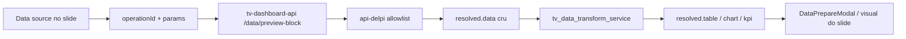
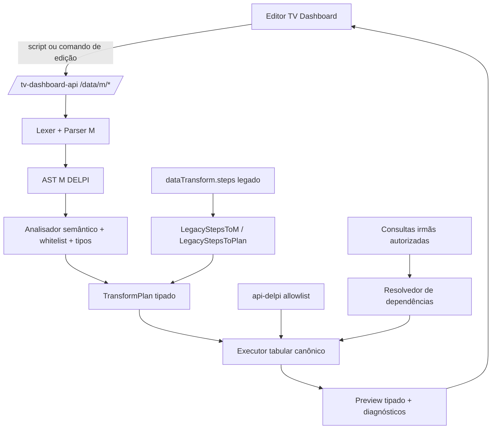

# Playbook de Implementação — Power Query M no TV Dashboard

> **Produto:** Minha DELPI — plugin Painéis TV  
> **Repositório:** `roberiooliveiradev/delpi-central`  
> **Escopo:** `plugins/tv-dashboard`, `plugins/tv-dashboard-presentation`, `plugins/plugin-ui` e `tv-dashboard-api`  
> **Baseline inspecionada:** branch `main`, commit `095dabdbad44dbdb000f165a9fe0cdc13c6ee334`  
> **Versão deste playbook:** 1.0  
> **Data:** 2026-07-16  
> **Status:** Fases 0–3 concluídas em 2026-07-16; Fases 4–7 não iniciadas

---

## 1. Decisão executiva

O projeto **não parte do zero**. O TV Dashboard já possui uma fundação relevante de preparação de dados:

- modal **Preparar dados** com aparência inspirada no Power Query;
- consultas à esquerda, prévia tabular, barra `fx`, ribbon e etapas aplicadas;
- transformações persistidas como `dataTransform.steps`;
- execução e prévia no backend;
- engine Python com operações de tabela;
- espelho TypeScript para tipos, formatação e testes;
- testes para transformações, fórmulas e operações avançadas;
- integração parcial com `@delpi/plugin-ui`.

Entretanto, o contrato atual **não é Power Query M**. Hoje existe:

1. uma IR JSON própria, baseada em `steps`;
2. uma sintaxe visual pseudo-M, por exemplo `RenameColumns(Fonte, a → b)`;
3. uma DSL própria para coluna calculada;
4. parsers duplicados em TypeScript e Python;
5. execução canônica em Python.

A direção recomendada é implementar um **perfil seguro e versionado da linguagem M**, chamado neste documento de **M DELPI v1**:

```text
M digitado pelo usuário
  → lexer/parser no backend
  → AST M
  → análise semântica e whitelist
  → plano de transformação tipado
  → executor tabular canônico existente/evoluído
  → preview e apresentação
```

Não será implantado um runtime completo e irrestrito do Power Query. O produto deve suportar um subconjunto M explícito, com compatibilidade sintática real nas funções liberadas, sem acesso a filesystem, rede, bancos, credenciais, reflexão ou avaliação dinâmica.

### Princípios irrevogáveis

- **Backend é a única autoridade de compilação e execução.**
- **Frontend não interpreta nem executa M.**
- **Não usar `eval`, `exec`, `Expression.Evaluate` ou transpilar M para Python.**
- **Persistir script/configuração, nunca linhas retornadas pela fonte.**
- **Uma fonte de verdade para cada regra.**
- **Sem parser M duplicado entre TypeScript e Python.**
- **Toda UI compartilhável usa ou evolui `@delpi/plugin-ui`.**
- **CSS de componentes compartilhados fica exclusivamente no `plugin-ui`.**
- **Compatibilidade com configurações legadas deve ser testada e mensurável.**

---

## 2. Escopo e não escopo

### 2.1 Escopo

Este playbook cobre:

- editor M com `let … in`;
- barra de fórmulas com expressões M reais;
- etapas nomeadas;
- compilador M seguro;
- transformação tabular no servidor;
- tipos de coluna;
- diagnóstico com linha e coluna;
- prévia até a etapa selecionada;
- migração de `dataTransform.steps` legado;
- operações semelhantes ao Power Query;
- componentes compartilhados e padrões visuais;
- testes, segurança, limites e rollout.

### 2.2 Não escopo inicial

Não fazem parte do M DELPI v1:

- `Web.Contents`, `File.Contents`, `Folder.Files`, `Sql.Database` ou conectores M;
- credenciais ou data sources definidos pelo script;
- `Value.NativeQuery`;
- `Expression.Evaluate`;
- `#shared`, sections e extensões customizadas do Power Query;
- funções arbitrárias definidas pelo usuário;
- recursão;
- query folding;
- DAX, modelo semântico, relacionamentos ou medidas Power BI;
- execução de binários ou manipulação de arquivos;
- compatibilidade total com todos os detalhes do runtime Microsoft.

A fonte continua sendo uma rota GET aprovada no catálogo da `api-delpi`, com JWT, RBAC e parâmetros controlados pela plataforma.

---

## 3. Estado atual auditado

## 3.1 Fluxo atual



O fluxo correto de segurança já está estabelecido: o navegador envia apenas a configuração do bloco; a `tv-dashboard-api` busca e transforma os dados; o browser consome a prévia calculada no servidor.

## 3.2 Frontend atual

### Componentes existentes

| Componente | Responsabilidade atual |
|---|---|
| `DataPrepareModal.tsx` | Orquestra modal, consulta ativa, etapa ativa, preview, grid, ribbon e persistência |
| `DataPrepareRibbon.tsx` | Abas e formulários para criar operações |
| `DataPrepareFormulaBar.tsx` | Mostra/edita a pseudo-fórmula da etapa |
| `DataPrepareContextMenu.tsx` | Ações de consulta, etapa e coluna |
| `previewTransformTableOnServer.ts` | Chama `/data/preview-block` e lê `resolved.table` |
| `dataTransformFormula.ts` | Formata e interpreta a sintaxe pseudo-M no browser |
| `dataTransform.ts` | Tipos, normalização, labels e executor espelho para testes |

### Capacidades já entregues

- consulta ativa por fonte `data_source`;
- seleção de coluna no grid;
- seleção de etapa e prévia até aquele ponto;
- adicionar, substituir, mover e remover etapas;
- atualização forçada da prévia;
- highlight cruzado grid ↔ série de gráfico;
- preset de transformação por rota;
- menu de contexto;
- aplicar/descartar texto na barra `fx` com Enter/Escape;
- uso de `HintAction`, `SectionHintLabel`, `ContextMenu`, controles de formulário e modal do `plugin-ui`.

### Problemas arquiteturais e funcionais observados

1. **O modal persiste alterações enquanto o usuário edita.**  
   `persistSteps()` chama `updateBlock()` imediatamente. O botão **Cancelar** apenas fecha o modal; portanto, o comportamento transacional esperado de “descartar tudo” não está garantido.

2. **`DataPrepareModal.tsx` e `DataPrepareRibbon.tsx` concentram responsabilidades demais.**  
   São componentes extensos e misturam composição visual, estado de domínio, manipulação de etapas e chamadas assíncronas.

3. **A barra de fórmulas interpreta a linguagem no frontend.**  
   Isso cria uma segunda autoridade semântica e exige sincronização manual com Python.

4. **Etapas são selecionadas por índice.**  
   Reordenação, exclusão e inserção podem deslocar a seleção. O modelo alvo deve usar nome/identificador lógico da etapa.

5. **A prévia retorna basicamente nome de coluna e valor.**  
   Falta contrato de tipo, nulabilidade, erro, qualidade e informação de amostragem.

6. **Erros da expressão calculada podem virar `null` silenciosamente.**  
   Não há distinção clara entre um `null` legítimo e falha de avaliação.

## 3.3 Backend atual

### Endpoints existentes

| Método | Rota | Papel |
|---|---|---|
| `GET` | `/data/routes` | catálogo de fontes liberadas |
| `GET` | `/data/routes/{operationId}` | detalhe de uma fonte |
| `GET` | `/data/openapi/candidates` | curadoria de rotas GET |
| `POST` | `/data/preview-block` | busca, transforma e devolve preview do bloco |
| `POST` | `/data/validate-config` | valida configuração antes de salvar |

Todos os fluxos administrativos permanecem sob JWT e permissões do TV Dashboard.

### Engine existente

`tv_data_transform_service.py` já suporta:

- `rename`;
- `select`;
- `filter`;
- `addColumn`;
- `replace`;
- `sort`;
- `keepRows` e `removeRows`;
- `changeType` para `number|string`;
- `fillDown`;
- `firstRowAsHeader`;
- `groupBy`;
- `pivot`;
- `unpivot`;
- `merge` left join entre fontes do slide.

A engine também possui uma DSL de expressão baseada em AST Python com whitelist para:

- aritmética;
- comparação;
- `if` reescrito como `iff`;
- `concat`;
- `abs`, `min`, `max`;
- `coalesce`;
- `len`;
- `lower`, `upper`, `trim`.

### Pontos fortes

- cálculo no backend;
- funções de transformação isoladas em serviço de aplicação;
- dados crus mantidos em `resolved.data`;
- resultado transformado usado antes das projeções de View;
- testes de transformação e paridade;
- merge com tabelas irmãs;
- prévia reaproveita o fluxo de enrichment real.

### Lacunas para M real

1. O serviço recebe IR JSON, não código M.
2. O parser atual da barra é regex e não reconhece gramática M.
3. O parser Python de pseudo-fórmula aparenta não estar conectado ao fluxo de preview/runtime.
4. O frontend possui outro parser equivalente.
5. A semântica atual não é a semântica M:
   - `if` é avaliado de forma eager na implementação atual;
   - nomes de colunas são limitados a identificadores simples;
   - tipos são limitados;
   - `merge` mantém apenas uma correspondência por chave no lado direito;
   - headers são sanitizados para identificadores;
   - erros de linha são convertidos em `null`;
   - opções `MissingField`, cultura e tipos M não existem.
6. Não há diagnóstico estruturado com range de código.
7. Não há limites específicos de script, AST, joins e tempo de execução.
8. `/data/validate-config` ainda não compila o script de transformação.

## 3.4 Contrato persistido atual

```ts
type DataTransform = {
  steps: DataTransformStep[];
};
```

O contrato possui uma boa característica: persiste apenas a transformação, nunca as linhas. Ele será preservado como formato legado de leitura.

## 3.5 Testes e gates existentes

- testes Python do transformador;
- testes TypeScript de transformação e pseudo-fórmula;
- `npm test`, lint, circular dependency check, CSS scope e build do TV Dashboard;
- script canônico `bash scripts/ci/build-tv-dashboard.sh`;
- testes e build próprios do `plugin-ui`.

---

## 4. Causa raiz

> **Causa raiz:** a experiência visual evoluiu mais rápido que o contrato da linguagem. O sistema possui um bom executor tabular e uma boa UI inicial, mas a “linguagem” é representada simultaneamente por IR JSON, pseudo-fórmula TypeScript, pseudo-fórmula Python e DSL de expressão Python.

A correção não deve ser adicionar mais regex ou mais funções em dois arquivos. O módulo canônico precisa ser:

```text
Compilador M server-side → plano tipado → executor server-side
```

O frontend deve consumir:

- script canônico;
- etapas compiladas;
- catálogo de funções;
- diagnósticos;
- preview.

Ele não deve decidir o significado da linguagem.

---

## 5. Arquitetura alvo

## 5.1 Visão macro



## 5.2 Responsabilidades

| Camada | Responsabilidade |
|---|---|
| Domain | AST, tipos, diagnósticos, plano de transformação, regras puras |
| Application | compilar, formatar, mutar script, resolver dependências, executar plano |
| Interface HTTP | request/response, JWT/RBAC, status HTTP, envelope da API |
| Infrastructure | cache, relógio/deadline, logging, acesso à `api-delpi` |
| Frontend data | client HTTP e adaptação do envelope |
| Frontend state | draft transacional, requests, seleção e undo local |
| Frontend UI | renderização, eventos e acessibilidade |
| `plugin-ui` | componentes visuais genéricos, sem regra M, sem HTTP e sem texto de domínio fixo |

## 5.3 Uma fonte de verdade

| Conceito | Fonte canônica |
|---|---|
| sintaxe e semântica M | compilador Python da `tv-dashboard-api` |
| execução | executor tabular Python |
| script persistido | `dataTransform.version=2` |
| etapas exibidas | resultado do compilador |
| catálogo de funções | registry server-side exposto pela API |
| estilo de componentes compartilhados | `plugins/plugin-ui/src/styles/**` |
| textos de ajuda do TV | conteúdo do próprio plugin |

---

## 6. Contrato `dataTransform` v2

## 6.1 Formato alvo

```json
{
  "dataTransform": {
    "version": 2,
    "language": "m-delpi-v1",
    "script": "let\n    #\"Tipo alterado\" = Table.TransformColumnTypes(Fonte, {{\"periodo\", type date}, {\"oee\", type number}}),\n    #\"Linhas filtradas\" = Table.SelectRows(#\"Tipo alterado\", each [oee] <> null)\nin\n    #\"Linhas filtradas\""
  }
}
```

### Regras

- `Fonte` é um identificador reservado, ligado à tabela bruta da rota ativa.
- O script é a fonte persistida de verdade.
- AST, plano compilado, preview e linhas não são persistidos.
- O output do `in` precisa ser uma tabela.
- Cada nome de etapa precisa ser único.
- O profile `m-delpi-v1` é versionado; expansão incompatível gera novo profile.

## 6.2 Compatibilidade legada

| Cenário | Comportamento |
|---|---|
| configuração com `steps` v1 | ler via adapter e executar sem regressão |
| abrir v1 no editor novo | converter para script M canônico em memória |
| salvar após edição | persistir v2 |
| apresentação pública de v1 | continuar executando pelo adapter |
| rollback de versão | manter leitor v1 durante janela definida |

### Regra de migração

Adotar **dual-read / single-write**:

```text
leitura: v1 steps OU v2 script
escrita: somente v2 após ativação da feature flag
```

Não persistir `script` e `steps` como duas autoridades permanentes.

---

## 7. Perfil M DELPI v1

## 7.1 Objetivo de compatibilidade

O script deve usar sintaxe M real nas funções suportadas. Exemplos:

```powerquery
let
    #"Tipo alterado" = Table.TransformColumnTypes(
        Fonte,
        {{"periodo", type date}, {"oee", type number}, {"meta", type number}},
        "pt-BR"
    ),
    #"Linhas filtradas" = Table.SelectRows(
        #"Tipo alterado",
        each [oee] <> null and [oee] >= 0
    ),
    #"Gap adicionado" = Table.AddColumn(
        #"Linhas filtradas",
        "gap",
        each [meta] - [oee],
        type number
    ),
    #"Ordenado" = Table.Sort(
        #"Gap adicionado",
        {{"periodo", Order.Ascending}}
    )
in
    #"Ordenado"
```

## 7.2 Elementos sintáticos do MVP

- `let … in`;
- identificadores simples;
- identificadores cotados `#"Nome da etapa"`;
- strings, números, `true`, `false`, `null`;
- listas `{…}`;
- registros `[campo = valor]` somente quando exigidos por opção liberada;
- chamadas de função qualificadas `Table.*`, `Text.*`, `Number.*`, `Date.*`;
- `each`;
- acesso de coluna `[coluna]` e `[ #"coluna com espaço" ]` conforme gramática adotada;
- `if … then … else`;
- operadores aritméticos;
- comparação;
- `and`, `or`, `not` com curto-circuito;
- concatenação `&`;
- tipos `type text`, `number`, `logical`, `date`, `datetime`, `duration` e `any` controlado;
- comentários `//` e `/* … */` quando o parser estiver estável.

## 7.3 Funções de tabela — MVP de paridade

| Ação do editor | Função M alvo | Fase |
|---|---|---|
| Renomear coluna | `Table.RenameColumns` | MVP |
| Escolher colunas | `Table.SelectColumns` | MVP |
| Remover colunas | `Table.RemoveColumns` | MVP |
| Filtrar linhas | `Table.SelectRows` | MVP |
| Ordenar | `Table.Sort` | MVP |
| Substituir valor | `Table.ReplaceValue` | MVP |
| Manter topo/base | `Table.FirstN` / `Table.LastN` | MVP |
| Remover topo/base | `Table.Skip` / `Table.RemoveLastN` | MVP |
| Alterar tipo | `Table.TransformColumnTypes` | MVP |
| Preencher para baixo | `Table.FillDown` | MVP |
| Promover cabeçalho | `Table.PromoteHeaders` | MVP |
| Coluna personalizada | `Table.AddColumn` | MVP |
| Agrupar | `Table.Group` | MVP |
| Pivot | `Table.Pivot` | MVP |
| Unpivot | `Table.Unpivot` / `Table.UnpivotOtherColumns` | MVP |
| Mesclar consultas | `Table.NestedJoin` + `Table.ExpandTableColumn` | MVP controlado |
| Acrescentar consultas | `Table.Combine` | Onda 2 |
| Remover duplicatas | `Table.Distinct` | Onda 2 |
| Índice | `Table.AddIndexColumn` | Onda 2 |
| Duplicar coluna | `Table.DuplicateColumn` | Onda 2 |
| Dividir coluna | `Table.SplitColumn` | Onda 2 |
| Transpor | `Table.Transpose` | Onda 2 |
| Inverter linhas | `Table.ReverseRows` | Onda 2 |
| Contar linhas | `Table.RowCount` | Onda 2 |
| Remover linhas com erro | `Table.RemoveRowsWithErrors` | Onda 3 |

## 7.4 Funções escalares liberadas

### Texto

- `Text.Trim`, `Text.Clean`;
- `Text.Upper`, `Text.Lower`, `Text.Proper`;
- `Text.Length`;
- `Text.Contains`, `Text.StartsWith`, `Text.EndsWith`;
- `Text.BeforeDelimiter`, `Text.AfterDelimiter`, `Text.BetweenDelimiters`;
- `Text.Combine` com limites.

### Número

- `Number.Abs`;
- `Number.Round`, `RoundUp`, `RoundDown`;
- `Number.Mod`;
- `Number.From` controlado por cultura.

### Data e hora

- `Date.From`, `Date.Year`, `Date.Month`, `Date.Day`;
- `Date.StartOfMonth`, `Date.EndOfMonth`;
- `Date.AddDays`, `Date.AddMonths`;
- `DateTime.From`;
- `Duration.Days`.

### Lista, em contexto limitado

- `List.Sum`, `List.Average`, `List.Min`, `List.Max`, `List.Count`, `List.First`;
- somente listas geradas por operações liberadas;
- sem geração ilimitada.

## 7.5 Funções proibidas

O analisador semântico deve rejeitar por código estável:

- qualquer família de I/O;
- qualquer conector de banco;
- qualquer função de credencial;
- `Expression.Evaluate`;
- `Value.NativeQuery`;
- `#shared`;
- `Diagnostics.Trace` na primeira versão;
- funções desconhecidas;
- funções definidas pelo usuário;
- recursão;
- acesso dinâmico a campos/funções fora da whitelist.

Exemplo de diagnóstico:

```json
{
  "code": "m.function_not_allowed",
  "severity": "error",
  "message": "A função Web.Contents não é permitida no M DELPI v1.",
  "range": {
    "startLine": 4,
    "startColumn": 13,
    "endLine": 4,
    "endColumn": 25
  },
  "hint": "Use uma fonte cadastrada no catálogo da api-delpi."
}
```

---

## 8. Modelo de compilação

## 8.1 Pipeline

```text
script
  → tokenize
  → parse
  → AST
  → resolver nomes/etapas/consultas
  → validar funções e argumentos
  → inferir/validar tipos
  → validar dependências/ciclos
  → compilar TransformPlan
  → executar
```

## 8.2 AST mínima

```python
MDocument
MLetExpression
MBinding
MIdentifier
MCallExpression
MEachExpression
MIfExpression
MBinaryExpression
MUnaryExpression
MFieldAccess
MListExpression
MRecordExpression
MLiteral
MTypeExpression
```

Cada nó precisa carregar `SourceRange`.

## 8.3 Plano compilado

O executor atual pode ser preservado e evoluído por meio de uma IR tipada:

```json
{
  "version": 1,
  "profile": "m-delpi-v1",
  "steps": [
    {
      "name": "Tipo alterado",
      "op": "changeTypes",
      "input": "Fonte",
      "transformations": [
        {"column": "periodo", "type": "date"},
        {"column": "oee", "type": "number"}
      ]
    },
    {
      "name": "Linhas filtradas",
      "op": "filter",
      "input": "Tipo alterado",
      "predicate": {"kind": "compiledExpression", "id": "expr-1"}
    }
  ],
  "output": "Linhas filtradas",
  "referencedQueries": [],
  "planHash": "sha256:..."
}
```

### Importante

- O plano é interno e não é editado diretamente pelo usuário.
- O plano pode ser devolvido à UI para inspeção, mas não deve ser persistido como segunda fonte de verdade.
- O executor não recebe código M bruto.

## 8.4 Parser

A Fase 0 deve registrar ADR comparando:

1. gramática declarativa com parser generator maduro;
2. lexer + parser recursivo próprio.

Recomendação: usar gramática declarativa, desde que:

- suporte ranges precisos;
- tenha dependência pequena e fixada;
- não execute ações arbitrárias;
- passe pelo security review;
- tenha corpus de regressão M DELPI.

Regex isolada não é aceitável como parser de linguagem.

---

## 9. Arquitetura backend proposta

## 9.1 Organização

```text
tv-dashboard-api/tv_app/
  domain/
    data_query/
      m_ast.py
      m_diagnostics.py
      m_types.py
      transform_plan.py
      query_dependency.py

  application/services/data/
    m_query/
      m_lexer.py
      m_parser.py
      m_semantic_analyzer.py
      m_function_registry.py
      m_compiler.py
      m_formatter.py
      m_mutation_service.py
      m_legacy_adapter.py
      m_compile_cache.py
    tv_data_transform_service.py
    tv_data_preview_service.py

  interface/http/routes/
    data_api_routes.py
```

### Regra de centralização

`tv_data_transform_service.py` continua sendo a fachada canônica de execução. O compilador produz o plano consumido por essa fachada. Não criar uma engine paralela chamada “M engine” com operações duplicadas.

## 9.2 Destino dos módulos atuais

| Atual | Destino |
|---|---|
| `tv_data_transform_service.py` | evoluir para executor de `TransformPlan`; manter adapter legado |
| `tv_data_transform_formula_service.py` | deprecar após migração; não ampliar regex |
| `dataTransformFormula.ts` | remover parser após UI server-driven; manter apenas tipos temporários |
| executor TS em `dataTransform.ts` | testes/fixtures de compatibilidade; não runtime |
| `DataTransformStep` | passa a representar DTO/IR compilada, não fonte persistida v2 |

## 9.3 Dependências entre consultas

No M DELPI, uma consulta pode referenciar outra consulta do mesmo slide.

### Contrato

- cada `data_source` precisa de `queryName` único;
- nomes podem ser cotados;
- o compilador resolve `queryName → blockId`;
- é criado um DAG de dependências;
- ciclos são rejeitados;
- fontes brutas são buscadas uma vez por request;
- transformações são executadas em ordem topológica;
- RBAC é validado antes de disponibilizar uma consulta no ambiente.

Isso substitui gradualmente a montagem ad hoc de `siblingTables` e elimina dependência da ordem dos blocos.

## 9.4 Semântica de erros

Não converter erro automaticamente em `null`.

Adotar três classes:

1. **erro de compilação** — script não executa;
2. **erro estrutural de execução** — etapa falha e preview é interrompido;
3. **erro por célula** — valor de erro rastreável, tratável futuramente por `try … otherwise`.

Resposta de preview deve incluir:

```json
{
  "diagnostics": [],
  "runtimeErrors": {
    "count": 3,
    "sample": [
      {
        "stepName": "Coluna gap",
        "rowIndex": 7,
        "column": "gap",
        "code": "m.division_by_zero",
        "message": "Divisão por zero."
      }
    ]
  }
}
```

## 9.5 Tipos

Tipos mínimos:

```text
any
null
text
number
logical
date
datetime
duration
table
list
record
error
```

A coluna deve informar:

```json
{
  "key": "oee",
  "label": "OEE",
  "type": "number",
  "nullable": true,
  "typeSource": "declared"
}
```

`typeSource` pode ser `declared`, `inferred` ou `unknown`.

## 9.6 Cultura

- default configurável em `tv_dashboard_settings.json`;
- recomendação inicial: `pt-BR`;
- conversão de número/data respeita cultura;
- o script pode informar cultura apenas nas funções liberadas;
- não manter conversão global simplista de vírgula para ponto.

---

## 10. Contratos HTTP

A API deve manter o envelope existente:

```json
{
  "success": true,
  "message": "OK",
  "data": {}
}
```

## 10.1 Compilar

```http
POST /data/m/compile
Authorization: Bearer <token>
```

Request:

```json
{
  "profile": "m-delpi-v1",
  "script": "let ... in ...",
  "sourceSchema": [
    {"key": "periodo", "type": "text", "nullable": false},
    {"key": "oee", "type": "number", "nullable": true}
  ],
  "queryBindings": [
    {"name": "OEE série temporal", "sourceId": "uuid"}
  ],
  "targetStepName": null,
  "culture": "pt-BR"
}
```

Response:

```json
{
  "success": true,
  "message": "Consulta M válida.",
  "data": {
    "profile": "m-delpi-v1",
    "canonicalScript": "let\n    ...\nin\n    ...",
    "scriptHash": "sha256:...",
    "outputStepName": "Ordenado",
    "steps": [
      {
        "name": "Tipo alterado",
        "operation": "Table.TransformColumnTypes",
        "label": "Tipo alterado",
        "formula": "Table.TransformColumnTypes(...)"
      }
    ],
    "diagnostics": [],
    "referencedQueries": []
  }
}
```

O `sourceSchema` enviado pelo cliente é apenas hint de edição. A validação definitiva ocorre no preview/runtime com a fonte real.

## 10.2 Mutar script por comando

```http
POST /data/m/mutate
```

Request:

```json
{
  "script": "let ... in ...",
  "action": {
    "type": "insert_step",
    "afterStepName": "Tipo alterado",
    "operation": "filter_rows",
    "arguments": {
      "column": "oee",
      "operator": "greater_or_equal",
      "value": 80
    }
  }
}
```

Ações iniciais:

- `insert_step`;
- `replace_step_expression`;
- `rename_step`;
- `move_step`;
- `remove_step`;
- `rename_query` com atualização de referências;
- `format_script`.

O backend deve gerar script canônico. O frontend não concatena M manualmente.

## 10.3 Catálogo de funções

```http
GET /data/m/functions?profile=m-delpi-v1
```

Resposta inclui:

- nome;
- categoria;
- assinatura;
- descrição pt-BR;
- parâmetros;
- exemplos;
- versão de introdução;
- se está disponível na barra/ribbon/editor avançado.

## 10.4 Preview

Evoluir o endpoint atual:

```http
POST /data/preview-block
```

Campos adicionais:

```json
{
  "targetStepName": "Linhas filtradas",
  "previewOptions": {
    "maxRows": 200,
    "includeColumnProfile": false
  }
}
```

Resposta adicional:

```json
{
  "query": {
    "profile": "m-delpi-v1",
    "scriptHash": "sha256:...",
    "selectedStepName": "Linhas filtradas",
    "diagnostics": [],
    "executionMs": 18,
    "cacheHit": false
  },
  "preview": {
    "columns": [],
    "rows": [],
    "returnedRows": 200,
    "availableRows": 834,
    "truncated": true,
    "isSample": true
  }
}
```

## 10.5 Validar configuração

`POST /data/validate-config` deve:

- validar binding e RBAC existentes;
- compilar todo script M;
- resolver referências entre consultas;
- rejeitar ciclo;
- validar profile;
- aplicar limites;
- devolver todos os diagnósticos, não apenas o primeiro.

---

## 11. Segurança, limites e desempenho

## 11.1 Limites configuráveis

Adicionar a `tv_dashboard_settings.json`, sem constantes espalhadas:

```json
{
  "mQuery": {
    "profile": "m-delpi-v1",
    "defaultCulture": "pt-BR",
    "maxScriptBytes": 65536,
    "maxSteps": 100,
    "maxAstNodes": 5000,
    "maxExpressionDepth": 40,
    "maxPreviewRows": 200,
    "maxPreviewColumns": 200,
    "maxPreviewCells": 40000,
    "maxJoinInputRows": 5000,
    "executionTimeoutMs": 2000,
    "diagnosticSampleLimit": 20
  }
}
```

Os valores acima são defaults propostos e devem ser validados por teste de carga.

## 11.2 Regras de execução

- checar deadline entre etapas e em loops pesados;
- limitar cardinalidade de pivot;
- limitar expansão de join;
- rejeitar scripts acima dos limites antes de buscar dados;
- não registrar script completo se houver conteúdo sensível;
- não registrar token;
- logs usam hash do script e códigos de operação;
- queries irmãs só entram no ambiente após autorização;
- cache não usa token bruto como chave.

## 11.3 Cache

### Cache de compilação

Chave:

```text
profile + scriptHash + compilerVersion
```

### Cache de preview

Chave conceitual:

```text
operationId + params + RBAC scope + scriptHash + targetStepName + previewOptions
```

Nunca compartilhar resultado entre contextos de autorização incompatíveis.

---

## 12. Arquitetura frontend proposta

## 12.1 Organização

```text
plugins/tv-dashboard/src/features/data-query/
  domain/
    dataQueryTypes.ts
    dataQueryCapabilities.ts
  data/
    dataQueryApi.ts
    dataQueryApiAdapters.ts
  state/
    useDataQueryWorkbench.ts
    dataQueryDraftReducer.ts
    dataQuerySelection.ts
  ui/
    DataPrepareModal.tsx
    DataPrepareRibbon.tsx
    DataPrepareFormulaBar.tsx
    DataPrepareQueryList.tsx
    DataPreparePreviewGrid.tsx
    DataPrepareAppliedSteps.tsx
    DataPrepareDiagnostics.tsx
    DataPrepareAdvancedEditor.tsx
  content/
    dataQueryLabels.ts
```

### Regras

- `ui` não chama `fetch` diretamente;
- `ui` não parseia M;
- `state` não conhece CSS;
- `data` adapta o envelope HTTP;
- reducer de draft é puro e testável;
- texto M canônico sempre volta do backend.

## 12.2 Draft transacional

Ao abrir:

```text
config persistida → draft local imutável
```

Durante edição:

```text
mutação server-side → novo script no draft → preview
```

Ao clicar **Fechar e aplicar**:

```text
validar → atualizar bloco uma única vez → refresh → fechar
```

Ao clicar **Cancelar**:

```text
descartar draft → não alterar bloco → fechar
```

Critério obrigatório: teste deve demonstrar que Cancelar restaura o estado anterior.

## 12.3 Estado recomendado

```ts
type DataQueryWorkbenchState = {
  activeQueryId: string | null;
  draftByQueryId: Record<string, DataQueryDraft>;
  selectedStepName: string | null;
  selectedColumnKey: string | null;
  compile: AsyncState<CompileResult>;
  preview: AsyncState<PreviewResult>;
  dirty: boolean;
  advancedEditorOpen: boolean;
};
```

Usar `AbortController` e request sequence para impedir resposta antiga de sobrescrever preview novo.

## 12.4 Barra `fx`

- mostra expressão M real da etapa selecionada;
- edição local é apenas texto draft;
- Aplicar envia `replace_step_expression`;
- Escape descarta o texto da barra;
- erro aparece com range e código;
- não commit no blur;
- autocomplete vem do catálogo da API;
- nomes de coluna vêm do schema da prévia;
- edição de etapa não suportada na barra abre editor avançado, sem fallback ad hoc.

## 12.5 Etapas aplicadas

Cada item mostra:

- nome da etapa;
- ícone da operação;
- status válido/erro/aviso;
- botão editar;
- mover;
- excluir;
- menu de contexto;
- dependentes, quando exclusão quebrar referências.

A lista usa `stepName`, não índice.

## 12.6 Grid

O grid deve suportar:

- coluna de índice visual;
- cabeçalho com ícone de tipo;
- seleção de coluna;
- menu de contexto no cabeçalho;
- scroll horizontal e vertical intencional;
- estado loading/erro/vazio;
- indicação “prévia/amostra”; 
- limite de linhas;
- destaque de coluna ligada à série;
- acessibilidade por teclado;
- futuramente qualidade/distribuição/perfil.

---

## 13. Estratégia `@delpi/plugin-ui`

## 13.1 Componentes compartilhados já obrigatórios

Continuar usando:

- `createModalShell` / `ModalShell`;
- `ContextMenu`, `ContextMenuItem`, `ContextMenuDivider`;
- `HintAction`, `SectionHintLabel`, `TabHintCell`;
- `FormSelectControl`, `NativeTextControl` e controles equivalentes;
- estados de loading/empty/error do kit;
- `DataTable` quando o contrato for suficiente.

## 13.2 Regra de extração

Um novo componente entra no `plugin-ui` somente quando:

1. tem pelo menos dois consumidores reais; ou
2. o mesmo PR migra uma duplicata existente; e
3. não contém regra M, rota, HTTP, textos fixos do TV ou domínio de dashboard.

O catálogo visual não conta como segundo consumidor de produto.

## 13.3 Evolução compartilhada proposta

### Opção preferencial: evoluir `DataTable`

Adicionar APIs genéricas, sem acoplamento M:

- `onHeaderClick`;
- `onHeaderContextMenu`;
- `onCellClick`;
- `onCellContextMenu`;
- `getHeaderClassName`;
- `getCellClassName`;
- `headerPrefix` / slot de ícone;
- `selectedColumnKey`;
- `aria-selected`;
- coluna de índice opcional;
- modo `grid-preview`.

Isso aproveita um componente já compartilhado e evita criar uma segunda tabela canônica.

### Criar `DataGrid` somente se necessário

Se a API acima tornar `DataTable` incoerente, criar `DataGrid` em `plugin-ui`, mas no mesmo ciclo migrar um segundo consumidor real. O ADR deve registrar por que `DataTable` não atende.

### Manter local no primeiro momento

- `DataPrepareRibbon`;
- `DataPrepareFormulaBar` M-específica;
- `DataPrepareAppliedSteps`;
- `DataPrepareQueryList`;
- `DataPrepareDiagnostics` se o formato for específico de compilador.

Podem ser extraídos depois, quando houver segundo uso comprovado.

## 13.4 CSS

- visual do componente compartilhado: somente `plugins/plugin-ui/src/styles/**`;
- classes canônicas `.delpi-ui-*` com dual-class;
- MFE apenas mapeia tokens `--delpi-ui-*` e define layout entre regiões;
- nenhum override `.delpi-ui-*` no `tv-dashboard/src/index.css`;
- sem `body`, `:root` global ou `*` global;
- dark mode via `data-theme` do portal;
- testar portal federado em claro/escuro;
- desktop completo e fallback responsivo.

## 13.5 Entregas obrigatórias ao alterar `plugin-ui`

- componente/prop em TSX;
- teste;
- export público;
- CSS canônico;
- entrada em `visualComponents.ts` quando visual;
- demo do catálogo;
- documentação em `component-catalog.md`;
- atualização de `migration-catalog.md`;
- teste e build do `plugin-ui`;
- build do TV Dashboard consumidor.

---

## 14. Roadmap de implementação

## Fase 0 — Baseline, ADR e proteção contra regressão

**Status:** ✅ concluída em 2026-07-16. Evidências: [ADR M DELPI v1](./ADR-M-DELPI-V1.md), [baseline e gaps](./FASE-0-BASELINE-M-DELPI.md), fixtures compartilhadas em `fixtures/tv-dashboard/m-query/`, testes Python/TypeScript e flags inertes. Nenhum parser/runtime M foi implementado.

### Entregas

- criar ADR “M DELPI v1”;
- congelar fixtures de todas as operações atuais;
- criar corpus de scripts M válidos e inválidos;
- testar comportamento Cancelar vs Aplicar;
- inventariar segundo consumidor para qualquer novo componente do `plugin-ui`;
- decidir parser por POC documentada;
- adicionar settings de limites sem ativar M;
- documentar métricas baseline de preview.

### Aceite

- nenhuma regressão nas configurações v1;
- fixtures cobrem rename/select/filter/addColumn/replace/sort/rows/type/fill/header/group/pivot/unpivot/merge;
- decisão de parser registrada;
- causa raiz e módulos canônicos documentados.

---

## Fase 1 — Contratos v2 e adapter legado

**Status:** ✅ concluída em 2026-07-16. Evidências: [status da Fase 1](./FASE-1-STATUS-M-DELPI.md).

### Entregas

- tipos Python e TypeScript para `dataTransform.version=2`;
- `LegacyStepsAdapter`;
- formatter legado → M canônico;
- dual-read;
- feature flag para single-write v2;
- diagnóstico e ranges de fonte;
- estrutura de `TransformPlan`.

### Aceite

- uma configuração v1 e a conversão v2 produzem a mesma tabela;
- reabrir e salvar v1 não perde operação;
- nenhum payload de linhas é persistido;
- reader público continua aceitando v1.

---

## Fase 2 — Compilador M MVP

**Status:** ✅ concluída em 2026-07-16. Evidências: [status da Fase 2](./FASE-2-STATUS-M-DELPI.md), gramática Lark declarativa, registry JSON, testes golden/corpus/adversariais e endpoints protegidos por `TV_READ`. O compilador produz `TransformPlan`, mas não executa M.

### Entregas

- lexer/parser;
- AST com ranges;
- `let/in`;
- identificadores cotados;
- literais/listas/calls/`each`/`if`/operadores;
- registry de funções;
- analisador semântico;
- formatter canônico;
- `/data/m/compile`;
- `/data/m/functions`;
- testes de segurança.

### Funções mínimas

- `Table.RenameColumns`;
- `Table.SelectColumns` e `RemoveColumns`;
- `Table.SelectRows`;
- `Table.Sort`;
- `Table.ReplaceValue`;
- `Table.FirstN`, `LastN`, `Skip`, `RemoveLastN`;
- `Table.TransformColumnTypes`;
- `Table.FillDown`;
- `Table.PromoteHeaders`;
- `Table.AddColumn`.

### Aceite

- exemplos M padrão das funções liberadas compilam;
- função proibida gera `m.function_not_allowed` com range;
- coluna/etapa desconhecida gera diagnóstico específico;
- nenhuma função M é executada no browser;
- compilador não usa regex como parser principal.

---

## Fase 3 — Execução, joins e validação real

**Status:** ✅ concluída em 2026-07-16. Evidências: [status da Fase 3](./FASE-3-STATUS-M-DELPI.md), executor de `TransformPlan` na fachada canônica, DAG com pré-autorização, preview tipado e testes unitários/HTTP. `mQuery.enabled` controla o runtime e `writeV2Enabled` permanece desligado.

### Entregas

- executor consome `TransformPlan`;
- tipos ampliados;
- `if`, `and` e `or` com avaliação lazy/curto-circuito;
- `Table.Group`, Pivot e Unpivot;
- `Table.NestedJoin` preservando múltiplos matches;
- `Table.ExpandTableColumn`;
- DAG de consultas e detecção de ciclos;
- preview por `targetStepName`;
- `/data/validate-config` compila scripts;
- runtime errors estruturados;
- deadline e limites.

### Aceite

- join 1:N não perde linhas;
- ciclos são rejeitados antes de executar;
- erros não viram `null` silenciosamente;
- preview de etapa e apresentação final usam o mesmo executor;
- RBAC é validado antes de resolver query irmã.

---

## Fase 4 — Workbench M no frontend

### Entregas

- refatorar para `features/data-query`;
- draft transacional;
- reducer/hook;
- barra `fx` server-driven;
- etapas nomeadas;
- diagnósticos inline;
- grid tipado;
- preview por etapa;
- mutações pelo endpoint `/data/m/mutate`;
- loading/empty/error compartilhados;
- evolução do `DataTable`/`DataGrid` no `plugin-ui` conforme ADR.

### Aceite

- Cancelar não altera o bloco;
- Fechar e aplicar faz uma alteração atômica;
- toda fórmula exibida é M real;
- frontend não contém parser M;
- erro aponta linha/coluna;
- claro/escuro e teclado validados;
- sem CSS de kit no MFE.

---

## Fase 5 — Paridade funcional Power Query essencial

### Página Inicial

- nova fonte pelo catálogo da `api-delpi`;
- parâmetros da fonte;
- editor avançado;
- escolher/remover colunas;
- manter/remover linhas;
- mesclar/acrescentar consultas;
- atualizar preview.

### Transformar

- detectar tipo com confirmação;
- tipos completos;
- substituir;
- preencher para cima/baixo;
- transpor;
- inverter linhas;
- contagem de linhas;
- split/merge de colunas;
- operações de texto;
- estatísticas e arredondamento;
- data/hora;
- pivot/unpivot;
- remover duplicados/erros.

### Adicionar coluna

- coluna personalizada;
- coluna condicional;
- índice;
- duplicar coluna;
- texto/número/data por função;
- exemplos e autocomplete.

### Combinar

- left inner/right/full somente quando a semântica e limites estiverem testados;
- expandir colunas após join;
- append com schema compatível;
- preview de cardinalidade.

### Aceite

Cada botão da ribbon deve:

1. criar um comando tipado;
2. ser convertido em M pelo backend;
3. retornar script canônico;
4. aparecer como etapa;
5. gerar preview;
6. possuir teste unitário e de integração.

---

## Fase 6 — Editor avançado e produtividade

### Entregas

- editor multiline com syntax highlight;
- autocomplete de funções, etapas e colunas;
- assinatura/tooltip de função;
- formatação;
- navegar para diagnóstico;
- renomear etapa com atualização de referências;
- duplicar/referenciar consulta;
- dependências visuais;
- busca de etapa;
- undo/redo do draft;
- copiar/colar script.

### Aceite

- script grande continua responsivo;
- autocomplete vem do registry da API;
- formatter é idempotente;
- rename não quebra referências;
- undo/redo não persiste até Aplicar.

---

## Fase 7 — Qualidade, profiling e otimização

### Entregas

- qualidade de coluna: válida/erro/vazia;
- distribuição e perfil sob demanda;
- min/max/distinct;
- amostragem explícita;
- aviso de operação cara;
- cache de compilação e preview;
- métricas de tempo por etapa;
- explain plan simplificado;
- limites adaptados por telemetria.

### Aceite

- profiling não roda automaticamente em toda mudança;
- operação cara é cancelável;
- métricas não expõem valores sensíveis;
- p95 de preview dentro da meta definida pelo produto.

---

## 15. Backlog funcional detalhado

| Capacidade | Status atual | Destino | Prioridade |
|---|---|---|---|
| Rename | IR própria | M real | P0 |
| Select columns | IR própria | M real | P0 |
| Remove columns | simulado por select | função própria | P0 |
| Filter | comparadores limitados | predicado M | P0 |
| Add column | DSL própria | `each` M | P0 |
| Sort | 1 coluna | lista multi-coluna | P0 |
| Replace | string simples | replacers liberados | P0 |
| Type | number/string | tipos M + cultura | P0 |
| Keep/remove rows | topo/base | funções M correspondentes | P0 |
| FillDown | disponível | M real | P0 |
| PromoteHeaders | disponível | M real sem destruir nomes | P0 |
| Group | 1+ agregações | `Table.Group` | P1 |
| Pivot | disponível simplificado | semântica M | P1 |
| Unpivot | disponível | semântica M | P1 |
| Merge | 1 match por chave | nested join + expand | P1 |
| Append | ausente | `Table.Combine` | P1 |
| Conditional column | DSL if | `if then else` | P1 |
| Index | ausente | `Table.AddIndexColumn` | P1 |
| Split column | ausente | `Table.SplitColumn` | P1 |
| Text transforms | parcial na DSL | família `Text.*` | P1 |
| Date/time transforms | ausente | `Date.*` / `DateTime.*` | P1 |
| Remove duplicates | ausente | `Table.Distinct` | P1 |
| Error values | null silencioso | error model | P0 |
| `try otherwise` | ausente | Onda 3 | P2 |
| Advanced Editor | ausente | M multiline | P1 |
| Column profiling | ausente | sob demanda | P2 |
| Query dependencies | merge ad hoc | DAG | P0 |
| Transactional Cancel | não garantido | draft local | P0 |

---

## 16. Plano de testes

## 16.1 Backend unitário

- lexer tokens e ranges;
- parser AST golden files;
- formatter idempotente;
- nomes cotados e acentos;
- precedência de operadores;
- lazy `if`;
- curto-circuito;
- tipos e cultura;
- whitelist;
- funções proibidas;
- limite de profundidade;
- limite de steps;
- ciclos;
- join 1:1, 1:N, sem match e chaves nulas;
- pivot cardinality limit;
- erro de célula;
- legacy adapter.

## 16.2 Backend integração

- `/data/m/compile` com JWT e RBAC;
- `/data/m/mutate`;
- `/data/m/functions`;
- `/data/preview-block` com target step;
- `/data/validate-config` com múltiplos diagnósticos;
- preview e apresentação produzem mesma saída;
- fonte fora da allowlist;
- filial sem permissão;
- query irmã não autorizada;
- timeout e payload grande.

## 16.3 Paridade

Criar fixtures compartilhadas:

```text
tv-dashboard-api/tests/fixtures/m_query/
plugins/tv-dashboard-presentation/src/fixtures/mQuery/
```

Cada fixture:

```json
{
  "name": "filter-and-add-column",
  "input": {"columns": [], "rows": []},
  "legacySteps": [],
  "script": "let ... in ...",
  "expected": {"columns": [], "rows": []}
}
```

O objetivo não é manter dois executores de produção, mas provar migração e contrato.

## 16.4 Frontend

- Cancelar descarta draft;
- Aplicar persiste uma vez;
- erro da API aparece no range correto;
- request antiga não sobrescreve nova;
- seleção por step name após reorder;
- teclado na formula bar;
- menu de contexto;
- grid com type icon;
- loading/error/empty;
- acessibilidade;
- claro/escuro;
- largura reduzida.

## 16.5 `plugin-ui`

- render;
- eventos de header/célula;
- seleção;
- aria;
- demo no catálogo;
- classes dual;
- nenhum texto de domínio hardcoded.

## 16.6 Comandos de validação

```bash
cd tv-dashboard-api
pytest tests/test_tv_data_transform_service.py tests/test_tv_data_transform_formula_service.py -q
pytest tests/test_m_*.py -q

cd ../plugins/plugin-ui
npm test
npm run build

cd ../tv-dashboard-presentation
npm test

cd ../tv-dashboard
npm test
npm run lint
npm run check:circular
npm run build

cd ../..
python3 scripts/ci/check_plugin_docker_shared_libraries.py --check
bash scripts/ci/build-tv-dashboard.sh
```

Executar somente os testes relevantes durante desenvolvimento; executar gates completos antes de concluir a fase.

---

## 17. Migração e rollout

## 17.1 Feature flags

Proposta:

```json
{
  "mQuery": {
    "enabled": false,
    "writeV2Enabled": false,
    "advancedEditorEnabled": false,
    "profilingEnabled": false
  }
}
```

## 17.2 Etapas

1. deploy do reader v1+v2 com flags desligadas;
2. habilitar compile/preview para superadmin/ambiente dev;
3. testar playlists existentes;
4. habilitar editor M para grupo piloto;
5. habilitar escrita v2;
6. observar erros e p95;
7. expandir rollout;
8. manter reader v1 pela janela de rollback;
9. remover parser pseudo-M somente após telemetria e inventário zerado.

## 17.3 Rollback

- desligar `writeV2Enabled`;
- reader v2 permanece;
- configurações v2 não podem ser abertas por frontend antigo; por isso API e MFE devem ser implantados em ordem segura;
- rebuild do `plugin-ui` precede consumidor quando houver mudança compartilhada;
- usar scripts sequenciais da infraestrutura.

---

## 18. Observabilidade

Métricas recomendadas:

```text
m_compile_total{result,profile}
m_compile_duration_ms
m_execution_total{result,operation}
m_execution_duration_ms{step_operation}
m_preview_duration_ms
m_preview_rows_returned
m_runtime_error_total{code}
m_limit_rejection_total{limit}
m_legacy_transform_read_total
m_v2_transform_write_total
m_query_cache_hit_total{kind}
```

Logs estruturados:

```json
{
  "event": "tv.m_query.preview",
  "playlistId": "uuid",
  "blockId": "uuid",
  "operationId": "get_production_oee_series",
  "scriptHash": "sha256:...",
  "targetStepName": "Linhas filtradas",
  "executionMs": 18,
  "rows": 200,
  "truncated": true,
  "diagnosticCodes": []
}
```

Nunca logar JWT, dados completos, credenciais ou script contendo valores sensíveis sem sanitização.

---

## 19. Riscos e mitigação

| Risco | Impacto | Mitigação |
|---|---|---|
| chamar subset de “M completo” | expectativa incorreta | profile explícito `m-delpi-v1` + catálogo |
| parser baseado em regex | bugs e insegurança | gramática/AST + corpus |
| duplicação TS/Python | divergência | compilação apenas no backend |
| regressão em playlists antigas | produção | dual-read + fixtures + flag |
| join explosivo | memória/latência | limites, cardinality preview e deadline |
| erro silencioso | dado incorreto | error values + diagnostics |
| CSS duplicado no MFE | regressão visual | fonte única `plugin-ui` |
| componente compartilhado sem reuso | kit inflado | regra de 2 consumidores |
| Cancelar persistir mudanças | perda de confiança | draft transacional + teste |
| query circular | loop/timeout | DAG e cycle detection |
| cultura inconsistente | valores errados | cultura explícita e testada |
| nomes de coluna com espaço | script inválido | quoted identifiers |

---

## 20. Definition of Done por fase

- [ ] causa raiz e módulo canônico documentados;
- [ ] sem regra duplicada API/MFE;
- [ ] sem execução M no browser;
- [ ] sem `eval`/`exec`;
- [ ] contrato versionado;
- [ ] compatibilidade legada coberta;
- [ ] erros estruturados;
- [ ] limites configuráveis;
- [ ] RBAC e allowlist preservados;
- [ ] testes unitários e integração verdes;
- [ ] build `plugin-ui` verde quando alterado;
- [ ] build TV Dashboard verde;
- [ ] CSS compartilhado somente no kit;
- [ ] claro/escuro validado;
- [ ] README e playbook atualizados;
- [ ] status da fase atualizado neste documento;
- [ ] nenhum commit criado sem solicitação explícita.

---

## 21. Diretrizes obrigatórias para o Cursor

Copiar estas regras para a execução:

1. Leia antes de alterar:
   - `documentos/instrucoes_oficiais_gpt_arquiteto_delpi_central.md`;
   - `.cursor/rules/development-standards-index.mdc`;
   - `.cursor/rules/root-cause-generalized-fix.mdc`;
   - `.cursor/rules/centralized-rules-first.mdc`;
   - `.cursor/rules/clean-code-architecture-guardrails.mdc`;
   - `.cursor/rules/plugins-reusable-components.mdc`;
   - `.cursor/rules/plugins-visual-design-system.mdc`;
   - `.cursor/rules/plugins-frontend-build.mdc`;
   - `.cursor/rules/plugins-documentation.mdc`;
   - `.cursor/rules/test-and-commit.mdc`.

2. Não iniciar pela UI. Primeiro congele contratos, fixtures e ADR.
3. Não ampliar `dataTransformFormula.ts` nem `tv_data_transform_formula_service.py` com novas regex.
4. Não criar segundo executor M.
5. O compilador backend produz plano para o executor canônico.
6. O frontend não valida semântica M localmente.
7. O frontend só mantém draft de texto e consome compile/mutate/preview.
8. Não persistir AST, plan ou rows como fonte de verdade.
9. Implementar dual-read/single-write.
10. Toda função M precisa estar no registry com assinatura, categoria, exemplos e testes.
11. Toda função não registrada é proibida por padrão.
12. Toda transformação deve ter limites e deadline.
13. Não usar token em cache/log.
14. Preservar `TV_READ`, `TV_MANAGE`, acesso à playlist e branch policy.
15. Não permitir source connector no M.
16. Antes de criar UI local, consultar o catálogo do `plugin-ui`.
17. Não copiar CSS/componente do kit para o MFE.
18. Novo componente do kit exige segundo consumidor real, teste, docs, demo e migration catalog.
19. `DataPrepareModal` deve virar compositor fino; regra vai para state/application.
20. Cancelar precisa ser transacional.
21. Etapa é endereçada por nome/ID lógico, nunca por índice persistente.
22. Erro de cálculo não pode virar `null` silenciosamente.
23. Corrigir causa raiz; não criar `if` por rota ou operação específica.
24. Atualizar o playbook ao concluir cada fase.
25. Rodar os testes da fase; corrigir antes de declarar concluído.
26. Não criar commit ou push sem pedido explícito do usuário.

---

## 22. Ordem de execução recomendada para o Cursor

```text
Tarefa 1 — somente Fase 0
  → inventário
  → ADR
  → fixtures
  → testes de baseline
  → relatório de gaps
  → nenhum código M de produção ainda

Tarefa 2 — Fase 1
  → contratos v2
  → adapter legado
  → dual-read
  → feature flags

Tarefa 3 — Fase 2
  → parser/compiler MVP
  → compile/functions API

Tarefa 4 — Fase 3
  → executor + preview + validação + DAG

Tarefa 5 — Fase 4
  → frontend transacional + plugin-ui

Tarefas seguintes
  → ondas funcionais e editor avançado
```

Cada tarefa deve terminar com:

- arquivos alterados;
- decisões tomadas;
- contratos criados/alterados;
- testes executados e resultado;
- riscos remanescentes;
- próxima fase;
- diff documental correspondente.

---

## 23. Referências internas obrigatórias

- `docs/12-roadmap-e-evolucao/tv-dashboard/PLAYBOOK-EXCELENCIA.md`, especialmente §19.5.1;
- `tv-dashboard-api/README.md`;
- `plugins/tv-dashboard/README.md`;
- `plugins/tv-dashboard/src/components/DataPrepareModal.tsx`;
- `plugins/tv-dashboard/src/components/DataPrepareRibbon.tsx`;
- `plugins/tv-dashboard/src/components/DataPrepareFormulaBar.tsx`;
- `plugins/tv-dashboard-presentation/src/dataTransform.ts`;
- `plugins/tv-dashboard-presentation/src/dataTransformFormula.ts`;
- `tv-dashboard-api/tv_app/application/services/data/tv_data_transform_service.py`;
- `tv-dashboard-api/tv_app/application/services/data/tv_data_transform_formula_service.py`;
- `tv-dashboard-api/tv_app/application/services/comunicado_data_enrichment_service.py`;
- `tv-dashboard-api/tv_app/interface/http/routes/data_api_routes.py`;
- `plugins/plugin-ui/docs/component-catalog.md`;
- `plugins/plugin-ui/docs/contributing.md`;
- `plugins/plugin-ui/docs/migration-catalog.md`.

## 24. Referências externas de semântica

Usar a documentação oficial Microsoft Learn como referência de sintaxe e assinatura para:

- Power Query M language specification;
- `Table.AddColumn`;
- `Table.SelectRows`;
- `Table.TransformColumnTypes`;
- `Table.NestedJoin`;
- `Table.RenameColumns`;
- `Table.SelectColumns`;
- `Table.Sort`;
- `Table.ReplaceValue`;
- `Table.FillDown`;
- `Table.PromoteHeaders`;
- `Table.Group`;
- `Table.Pivot`;
- `Table.Unpivot`.

A documentação Microsoft define a linguagem de referência; o profile DELPI define o subconjunto autorizado e suas restrições operacionais.

---

## 25. Resultado esperado

Ao concluir este playbook, o gestor deverá conseguir:

1. selecionar uma fonte aprovada;
2. abrir **Preparar dados**;
3. criar etapas pela ribbon;
4. ver M real na barra `fx`;
5. editar a fórmula ou o script completo;
6. receber erro com linha/coluna e sugestão;
7. visualizar tipos e preview por etapa;
8. cancelar sem alterar a configuração;
9. aplicar atomicamente;
10. usar o mesmo resultado no editor, preview e TV pública;
11. manter segurança, RBAC, performance e compatibilidade com playlists existentes.

