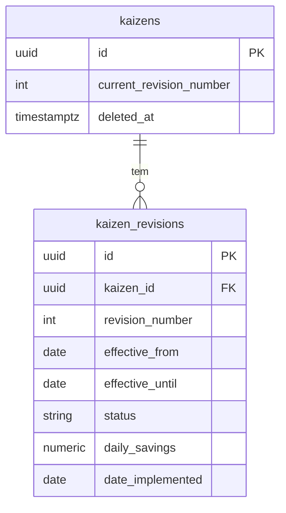

# Especificação — Revisões temporais de Kaizens

> **Arquivo:** `docs/12-roadmap-e-volucao/cadastro-kaizen/ESPECIFICACAO-REVISOES.md`  
> **Status:** proposta de design (não implementado)  
> **Relacionado:** [ROADMAP.md](./ROADMAP.md) · Fase 6 (summary Postgres) · [DOCUMENTACAO.md](../../../plugins/cadastro-kaizen/docs/DOCUMENTACAO.md)

---

## 1. Problema

Hoje `quality.kaizens` guarda **apenas o estado atual** do kaizen. Qualquer `PUT` sobrescreve campos como `status`, `daily_savings` e `date_implemented`.

Isso quebra análises **retrospectivas**:

| Cenário | Comportamento atual (incorreto para o passado) |
|---------|------------------------------------------------|
| Kaizen implantado em jan/2026; em mar/2026 passa a `descontinuado` | Dashboard de jan/2026 deixaria de contar ganhos se consultado hoje |
| Correção de `daily_savings` em jun/2026 | Meses anteriores seriam recalculados com valor novo |
| Contagem «ideias implantadas no mês» | Não distingue implantação histórica de estado atual |

A planilha Google Sheets tinha o mesmo limite (uma linha = um snapshot implícito). O cadastro em Postgres precisa **versionamento explícito** para o dashboard e o Strategic Indicators confiarem no passado.

---

## 2. Objetivo

Introduzir **revisões** por kaizen: cada alteração relevante grava um snapshot imutável com **vigência temporal**, permitindo:

1. Consultar «como estava o kaizen em 15/03/2026»
2. Calcular ganhos financeiros por competência usando `daily_savings` e status **válidos em cada dia** do intervalo
3. Contar implantações no mês pela **primeira revisão** com `status = implantado` naquela data
4. Auditar quem alterou o quê (trilha de revisões na UI)

---

## 3. Princípios de design

| Princípio | Regra |
|-----------|--------|
| **Append-only** | Revisões não são editadas nem apagadas; correção = nova revisão |
| **Vigência explícita** | Cada revisão tem `effective_from`; a anterior recebe `effective_until` |
| **Snapshot completo** | A revisão copia todos os campos de negócio usados no cálculo (não só diff) |
| **Cabeça operacional** | `quality.kaizens` permanece registro «atual» para listagem/CRUD rápido (espelho da última revisão) |
| **Uma fonte para analytics** | `GET /quality/kaizens/summary` (Fase 6 Postgres) lê **revisões**, não só a cabeça |
| **Mudança mínima na UI** | Formulário continua editando o kaizen; API cria revisão automaticamente no `PUT` |

---

## 4. Modelo de dados (proposta)

### 4.1 Tabela existente `quality.kaizens`

Mantida como **registro mestre** (identidade estável, soft delete, FK de submódulo). Campos mutáveis continuam espelhando a **revisão corrente** (`effective_until IS NULL`).

Campos adicionais sugeridos na cabeça:

| Coluna | Tipo | Uso |
|--------|------|-----|
| `current_revision_number` | `INT` | Último número de revisão (começa em 1 na criação) |
| `legacy_sheet_id` | `VARCHAR(500)` | ID legado da planilha (opcional, rastreio) |

### 4.2 Nova tabela `quality.kaizen_revisions`

Migration proposta: `V028__create_kaizen_revisions.sql`

```sql
CREATE TABLE quality.kaizen_revisions (
    id UUID PRIMARY KEY DEFAULT gen_random_uuid(),
    kaizen_id UUID NOT NULL REFERENCES quality.kaizens(id),
    revision_number INT NOT NULL,

    effective_from DATE NOT NULL,
    effective_until DATE,  -- NULL = revisão corrente

    -- Snapshot (mesmos campos de negócio de quality.kaizens)
    branch_code VARCHAR(10) NOT NULL,
    title VARCHAR(500) NOT NULL,
    accountable VARCHAR(200),
    sector VARCHAR(200),
    investment NUMERIC(14, 2),
    savings_type VARCHAR(30) NOT NULL,
    seconds_per_occurrence NUMERIC(14, 4),
    occurrences_per_day NUMERIC(14, 4),
    hourly_cost NUMERIC(14, 4),
    quantity_saved_per_day NUMERIC(14, 4),
    unit_material_cost NUMERIC(14, 4),
    fixed_daily_savings NUMERIC(14, 2),
    daily_savings NUMERIC(14, 2),
    annual_savings NUMERIC(14, 2),
    status VARCHAR(30) NOT NULL,
    date_implemented DATE,
    date_discontinued DATE,
    notes TEXT,

    change_summary TEXT,  -- ex.: "status: em_andamento → implantado"
    created_by_user_id VARCHAR(100) NOT NULL,
    created_at TIMESTAMPTZ NOT NULL DEFAULT NOW(),

    CONSTRAINT uq_kaizen_revision_number UNIQUE (kaizen_id, revision_number),
    CONSTRAINT ck_kaizen_revision_dates CHECK (
        effective_until IS NULL OR effective_until >= effective_from
    )
);

CREATE INDEX ix_kaizen_revisions_kaizen_effective
    ON quality.kaizen_revisions (kaizen_id, effective_from, effective_until);
```

**Regras de vigência**

- **Criação (`POST`):** revisão `1`, `effective_from = date_implemented` ou `CURRENT_DATE`, `effective_until = NULL`
- **Atualização (`PUT`):** fecha revisão corrente (`effective_until = effective_from_da_nova - 1 dia` ou mesma data se mudança intradiária — ver § 6.2); insere revisão `N+1`
- **Exclusão lógica:** revisão final com `status` preservado + flag na cabeça `deleted_at`; revisões históricas intactas

### 4.3 Diagrama



---

## 5. Quando criar revisão

| Evento | Cria revisão? | `effective_from` sugerido |
|--------|---------------|---------------------------|
| `POST` (novo kaizen) | Sim — rev. 1 | `date_implemented` ou data do cadastro |
| `PUT` altera `status` | **Obrigatório** | Data informada pelo usuário ou `date_implemented` / hoje |
| `PUT` altera campos de economia | **Obrigatório** | Data da vigência da nova economia |
| `PUT` só `notes` / `accountable` | Configurável | Opcional: revisão só se «campos de cálculo» mudarem |
| `import-from-sheet` | Sim — rev. 1 por kaizen novo | `date_implemented` da planilha |
| `DELETE` lógico | Revisão de encerramento opcional | Data da exclusão |

**Campos que disparam revisão (conjunto `REVISION_TRIGGER_FIELDS`):**

- `status`, `date_implemented`, `date_discontinued`
- `savings_type`, `seconds_per_occurrence`, `occurrences_per_day`, `hourly_cost`
- `quantity_saved_per_day`, `unit_material_cost`, `fixed_daily_savings`
- `branch_code`, `title` (identidade do indicador)

Campos cosméticos (`notes`, `accountable`, `sector`, `investment`) podem atualizar só a cabeça **sem** nova revisão, se negócio aceitar — documentar na implementação.

---

## 6. Cálculo do dashboard (com revisões)

Substitui a lógica atual da planilha (`_days_active_in_range` + `daily_savings` único) por **soma dia a dia** ou **soma por segmentos de vigência**.

### 6.1 Ganhos financeiros no período `[date_start, date_end]`

Para cada kaizen e cada revisão cuja vigência intersecta o período:

```
segment_start = max(revision.effective_from, date_implemented, date_start)
segment_end   = min(revision.effective_until ?? date_end, date_end)

Se revision.status == 'implantado' e segment_start <= segment_end:
    ganho += revision.daily_savings × dias_úteis_ou_corridos(segment_start, segment_end)
```

- Kaizen **nunca implantado** (`status != implantado` em todas as revisões no intervalo): ganho = 0
- **`descontinuado`:** última revisão com `effective_until` limita ganho após descontinuação
- Alinhar com SI: [QUALITY_INDICATORS.md](../../../strategic-indicators-api/docs/QUALITY_INDICATORS.md) — ganho por dias ativos no mês

### 6.2 Contagem «ideias Kaizen implantadas no mês»

Contar kaizens cuja **primeira revisão** com `status = implantado` tem `effective_from` dentro do mês filtrado (equivalente à regra atual «data de implantação no período»).

### 6.3 Consulta «estado em uma data»

```sql
SELECT *
  FROM quality.kaizen_revisions r
 WHERE r.kaizen_id = :id
   AND r.effective_from <= :as_of
   AND (r.effective_until IS NULL OR r.effective_until >= :as_of)
 ORDER BY r.revision_number DESC
 LIMIT 1;
```

---

## 7. API (proposta)

Base: `/quality/kaizens/records`

| Método | Rota | Descrição |
|--------|------|-----------|
| GET | `/{id}/revisions` | Lista revisões (mais recente primeiro) |
| GET | `/{id}/revisions/{revision_number}` | Snapshot de uma revisão |
| GET | `/{id}/at?date=YYYY-MM-DD` | Estado vigente na data (atalho) |
| PUT | `/{id}` | Atualiza cabeça + cria revisão se campos gatilho mudarem |

Body estendido no `PUT` / `POST`:

```json
{
  "status": "implantado",
  "date_implemented": "2026-01-16",
  "effective_from": "2026-01-16",
  "change_reason": "Implantação em produção"
}
```

| Campo | Obrigatório | Uso |
|-------|-------------|-----|
| `effective_from` | Quando muda status/economia | Início de vigência da nova revisão |
| `change_reason` | Opcional | Texto livre / auditoria |

**operationIds** (registrar em `route_contract_registry`):

- `list_kaizen_revisions` → `paged_list`
- `get_kaizen_revision` → `scalar`
- `get_kaizen_at_date` → `scalar`

### 7.1 Impacto em `import-from-sheet`

- Primeira importação: revisão `1` por registro
- Reimportação: **não** sobrescrever se já existir; opcional modo `sync` futuro

---

## 8. Backend — módulos canônicos (implementação futura)

| Camada | Responsabilidade |
|--------|------------------|
| `KaizenRevisionRepository` | CRUD revisões, fechar vigência, resolver `at_date` |
| `KaizenRevisionService` | Orquestra PUT: diff → nova revisão → sync cabeça |
| `KaizenTemporalSavingsCalculator` | Ganhos por período usando revisões (substitui lógica Sheets) |
| `PostgresKaizenSummaryRepository` | Implementa `KaizenQueryRepositoryPort` para Fase 6 |
| `kaizen_records_router` | Endpoints `/revisions` |

Testes de regressão obrigatórios:

- Kaizen implantado jan, descontinuado mar → ganho jan/fev ok, mar parcial, abr zero
- Correção de `daily_savings` com `effective_from` em jun → jan–mai inalterados
- Contagem implantações no mês usa primeira rev. `implantado`

Fixtures: `tests/fixtures/kaizen_revision_regression_cases.py`

---

## 9. Frontend (MFE)

| Tela | Entrega |
|------|---------|
| Formulário edição | Campo **«Vigente a partir de»** quando status ou economia mudam |
| Detalhe / edição | Aba ou seção **«Histórico de revisões»** (timeline) |
| Listagem | Sem mudança obrigatória (cabeça = estado atual) |

Componente sugerido: `KaizenRevisionTimeline` (padrão `LmpHistoryTimeline` / auditoria 5S).

---

## 10. Migração de dados existentes

Kaizens já em `quality.kaizens` (ex.: 21 importados):

1. Migration `V028` cria tabela de revisões
2. Script ou migration DML: `INSERT INTO kaizen_revisions ... SELECT ...` — revisão `1` por registro
   - `effective_from = COALESCE(date_implemented, created_at::date)`
   - `effective_until = NULL`
   - `revision_number = 1`
3. Atualizar `current_revision_number = 1` na cabeça

Sem revisão retroativa fabricada: não inventar histórico pré-import; apenas snapshot inicial = estado no momento da migração.

---

## 11. Fases no roadmap

| Fase | Entrega |
|------|---------|
| **6a** | Schema `kaizen_revisions` + revisão automática no POST/PUT + API list/get |
| **6b** | `KaizenTemporalSavingsCalculator` + testes fixtures |
| **6c** | `GET /quality/kaizens/summary` lendo Postgres com revisões |
| **6d** | UI timeline + campo `effective_from` |
| **6e** | SI / dashboard-quality validados contra cenários históricos |

A Fase 6 original do [ROADMAP.md](./ROADMAP.md) deve ser **desdobrada** em 6a–6e; não implementar summary Postgres **sem** revisões.

---

## 12. Decisões em aberto

| # | Pergunta | Opção recomendada |
|---|----------|-------------------|
| 1 | Granularidade `effective_from` | **DATE** (dia); hora só se necessário depois |
| 2 | Dias no cálculo de ganho | Calendário corridos (igual Sheets hoje); parametrizar depois |
| 3 | Revisão em mudança só de `notes` | Não criar revisão |
| 4 | `PUT` sem mudança de campos gatilho | 200 sem nova revisão |
| 5 | Permissão leitura revisões | Mesma de `cadastro-kaizen.view` |

---

## 13. Referências

- Cálculo atual Sheets: `api-delpi/.../google_sheets/kaizen/kaizen_repository.py` (`_days_active_in_range`, `_calculate_kaizen_total_savings`)
- Cadastro Postgres: `V027__create_kaizens.sql`, `PostgresKaizenRepository`
- Indicadores SI: `strategic-indicators-api/docs/QUALITY_INDICATORS.md`
- Roadmap geral: [ROADMAP.md](./ROADMAP.md)
