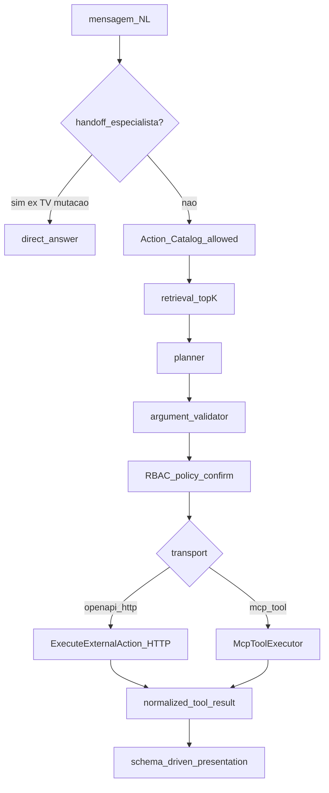

# Playbook — Chat AI como consumidor de Actions OpenAPI e MCP

**Status:** vigente (procedimento de refatoração; **não** substitui regras `.cursor`)

**Escopo:** epics futuros em `minha-delpi-ai-api` para o Chat consumir **dois transportes** de tools — OpenAPI Actions (já canônico) e remote MCP (novo) — sem virar DAVI/TÉO/VISTA

**Não é:** implementação de cutover, unificação Chat=especialista, cópia de matrices/Instructions GPT, nem autorização de writes TV no chat

**Artifact class:** `PLAYBOOK_NOT_RUNTIME_AUTHORITY`

**Relação com outros docs:**

| Doc | Papel |
|-----|--------|
| [`chat-openapi-first-refactor-playbook.md`](./chat-openapi-first-refactor-playbook.md) | Higiene OpenAPI-first F1–F5 (pré-requisito) |
| [`openapi-first-universal-tool-routing.md`](./openapi-first-universal-tool-routing.md) | Motor de routing OpenAPI |
| Este playbook | Estende o cold path para **transport-agnostic Action Catalog** + adapter MCP |
| [`custom-gpt-actions-integration.mdc`](../../../.cursor/rules/custom-gpt-actions-integration.mdc) | Bridge GPT Actions (externo; não dono do Chat) |
| [`openai-plugin-mcp-integration.mdc`](../../../.cursor/rules/openai-plugin-mcp-integration.mdc) | Contrato MCP/Plugin (server side dos owners) |

**Autoridades (ordem):**

| Ordem | Fonte |
|------:|-------|
| 1 | Constituição mínima `.cursor` + 8 responsabilidades transversais |
| 2 | [`openapi-first-universal-tool-routing.mdc`](../../../.cursor/rules/openapi-first-universal-tool-routing.mdc) |
| 3 | [`ai-external-tools-security.mdc`](../../../.cursor/rules/ai-external-tools-security.mdc) |
| 4 | [`platform-security-identity-authorization.mdc`](../../../.cursor/rules/platform-security-identity-authorization.mdc) |
| 5 | [`openai-plugin-mcp-integration.mdc`](../../../.cursor/rules/openai-plugin-mcp-integration.mdc) |
| 6 | [`chat-intelligence-base.mdc`](../../../.cursor/rules/chat-intelligence-base.mdc) + [`chat-intelligence-base.md`](./chat-intelligence-base.md) |
| 7 | [`ai-intelligence-evaluation.mdc`](../../../.cursor/rules/ai-intelligence-evaluation.mdc) + [`../testing/chat-ai-flow-families.md`](../testing/chat-ai-flow-families.md) |
| 8 | Matrizes owner: DAVI / TÉO / VISTA (só boundary; Chat não copia) |

Em conflito, a regra `.cursor` / doc canônico do owner vence este playbook.

---

## 0. Ledger de requisitos (pedido original)

| ID | Requisito | Estado no playbook |
|----|-----------|--------------------|
| RQ-01 | Chat consumir Actions OpenAPI (já existente) | ATENDIDO_NO_PLANO (baseline) |
| RQ-02 | Chat consumir remote MCP (novo transporte) | ATENDIDO_NO_PLANO (arquitetura + epics) |
| RQ-03 | Suportar especialistas DAVI / TÉO / VISTA como **providers**, sem o Chat virar o especialista | ATENDIDO_NO_PLANO |
| RQ-04 | Uma única autoridade de seleção (catalog + retrieval + planner) para ambos os transportes | ATENDIDO_NO_PLANO |
| RQ-05 | AuthZ continua no owner; user-parity; sem service token como “usuário DAVI” | ATENDIDO_NO_PLANO |
| RQ-06 | Não duplicar allowlist/capability matrices no Chat | ATENDIDO_NO_PLANO |
| RQ-07 | Handoff VISTA de mutação TV permanece até decisão explícita de Architecture | ATENDIDO_NO_PLANO |
| RQ-08 | Evals R1–R11 + positive/sibling/negative por transporte | ATENDIDO_NO_PLANO |
| RQ-09 | Feature flag default-OFF; produção MCP Chat só após evidência | ATENDIDO_NO_PLANO |
| RQ-10 | Implementação deste arquivo | FORA_DO_ESCOPO_COM_JUSTIFICATIVA (só documentação) |

---

## 1. Objetivo

Permitir que o Chat AI interno orquestre tools vindas de:

```text
A) Providers OpenAPI  → HTTP executor (CANÔNICO hoje)
B) Providers MCP      → MCP Streamable HTTP client (TARGET)
```

com **um** pipeline de inteligência:

```text
NL
→ handoff? (se dono do write for especialista e política do Chat for handoff)
→ Action Catalog (allowed)
→ retrieval top-K
→ planner estruturado
→ validator (schema do descriptor)
→ policy / confirmation
→ transport adapter (openapi_http | mcp_tool)
→ resultado normalizado
→ schema-driven presentation
→ síntese
```

### Não é objetivo

- Substituir o OpenAPI-first pelo MCP como única verdade.
- Fazer o Chat ser DAVI, TÉO ou VISTA (branding, Instructions, Knowledge).
- Reintroduzir registry/selectors/`if path` no core.
- Habilitar writes TV no Chat sem reverter a matriz VISTA.
- Usar `API_DELPI_INTERNAL_SERVICE_TOKEN` / service account como identidade do usuário.
- Importar OpenAPI monólito e chamar isso de “MCP DAVI”.
- Criar terceiro catálogo semântico paralelo à allowlist DAVI / matrices TÉO/VISTA.

---

## 2. Princípio de dual-transport

```text
Action Catalog = projeção técnica de tools permitidas ao agente
Transport     = como a tool é executada (HTTP OpenAPI | MCP tools/call)
Capability    = domínio no owner (não no Chat)
```



**Invariante:** retrieval/planner **não** escolhem transporte por nome de especialista. Escolhem `action_id` do catalog; o descriptor carrega `transport` + binding.

---

## 3. Inventário atual (CONFIRMADO)

### 3.1 Chat (`minha-delpi-ai-api`)

| Capacidade | Status |
|------------|--------|
| Provider OpenAPI + import/index | **PROVEN** |
| Action Catalog + agent binding | **PROVEN** |
| Retrieval / planner / OpenAPI validator | **PROVEN** |
| `ExecuteExternalActionUseCase` + HTTP gateway + `user_token` | **PROVEN** |
| Schema-driven presentation | **PROVEN** |
| Handoff TV→VISTA | **PROVEN** (sem mutation tool) |
| Cliente MCP / tools/list / tools/call | **ABSENT** |
| Provider type `mcp` na UI de actions | **ABSENT** |
| Audience/resource OAuth MCP no chat | **ABSENT** |

### 3.2 Especialistas (owners — Chat não é dono)

| Especialista | Owner | Superfície externa | Chat hoje |
|--------------|-------|--------------------|-----------|
| **DAVI** | `api-delpi` | MCP (3 tools + allowlist) | Action OpenAPI **API DELPI** (schema completo ≠ DAVI) |
| **TÉO** | `transformometro-api` | MCP + `/gpt-actions/v1` | Provider OpenAPI opcional; writes só em TÉO |
| **VISTA** | `tv-dashboard-api` | `/gpt-actions/v1` (MCP = TARGET) | Handoff only |

Referências:

- DAVI: `api-delpi/docs/integrations/openai-plugin-mcp.md`
- TÉO: `transformometro-api/docs/integrations/openai-plugin-mcp.md`
- VISTA: `tv-dashboard-api/docs/integrations/vista-capability-matrix.md`

---

## 4. Arquitetura-alvo

### 4.1 Modelo de provider unificado

Estender o conceito de provider (conceitual — nomes finais seguem English identifiers no código):

| Campo | OpenAPI | MCP |
|-------|---------|-----|
| `providerKind` | `openapi` | `mcp` |
| Discovery | `openapiUrl` → import | `mcpResourceUrl` → `initialize` + `tools/list` (+ resources se política permitir) |
| Auth mode | `user_token` (forward JWT) | `mcp_oauth_user` **ou** `user_token_if_owner_accepts` (ver §5) |
| Catalog entry | 1 action / operationId | 1 action / MCP tool name (+ schema input) |
| Execute | HTTP method+path | `tools/call` |
| Result shape | HTTP JSON → normalizer existente | MCP content blocks → normalizer MCP→catalog result |

**Proibido:** um provider `openapi` que “também é DAVI” só porque o host é api-delpi. Se o agente quiser a semântica DAVI, o binding deve ser ao provider MCP DAVI (ou a uma façade OpenAPI **derivada** da allowlist — §8).

### 4.2 Descriptor canônico (camada comum)

Todo item do Action Catalog deve expor, no mínimo:

```text
action_id                 # estável no agent binding
provider_key
transport                 # openapi_http | mcp_tool
name / title / description  # retrieval
input_schema              # JSON Schema (OpenAPI params/body OU MCP tool inputSchema)
auth_requirements
sensitivity / allow_write / confirmation_policy
owner_api                 # api-delpi | transformometro-api | tv-dashboard-api | ...
semantic_source           # openapi_operation | mcp_tool | openapi_facade_projection
```

Retrieval e planner operam **só** sobre esses campos. Sem `if provider_key == "davi"`.

### 4.3 Camadas (Clean Architecture)

```text
domain          ActionDescriptor, ToolResult, TransportKind
application     retrieve / plan / validate / policy / ExecuteToolUseCase (genérico)
adapters        OpenApiHttpExecutor | McpClientExecutor
infrastructure  httpx MCP Streamable HTTP, OAuth token exchange helpers, persistence
interface       agent provider UI (kind openapi|mcp), admin import jobs
```

Dependências apontam para dentro. Domain **não** importa FastMCP SDK nem httpx.

### 4.4 O que permanece OpenAPI-first

Para providers `openapi`, **nada muda** no cold path já cutover (F1–F5 do playbook OpenAPI-first).

MCP entra como **segundo importer + segundo executor**, não como fork do planner.

---

## 5. Identidade e autorização

### 5.1 Invariantes

```text
Chat orquestra
Owner autoriza
Usuário final = ator
JWT/OAuth ≠ permissão de negócio final
```

### 5.2 Modos de auth por transporte

| Modo | Quando | Notas |
|------|--------|-------|
| `user_token` | OpenAPI interno (api-delpi, etc.) | Já proven; `forward_user_bearer` |
| `mcp_oauth_user` | Remote MCP com resource audience (padrão ChatGPT Plugin) | Chat precisa obter token com `aud` = resource MCP **exato**; client dedicado **do Chat**, não reutilizar `mcp-api-delpi` de produção ChatGPT sem decisão de Architecture |
| `user_token_as_mcp_bearer` | Só se o MCP owner **provar** aceitar o mesmo JWT Portal/`delpi-central` no transport MCP | Hoje DAVI MCP exige audience do resource — **não assumir** |

**Hipótese a validar em G1 (não travar como fato):**

```text
H1: Chat pode chamar MCP DAVI com JWT do usuário Minha DELPI se aud incluir resource MCP
H2: Chat precisa de OAuth Authorization Code próprio (client chat-mcp-*) por resource
H3: Chat só importa façade OpenAPI e nunca fala MCP wire protocol
```

G1 deve eliminar H1–H3 com evidência. Preferência arquitetural se H1 falhar: **H2** (parity com Plugin) ou **H3** (menor superfície; perde resources MCP).

### 5.3 Proibido

- Service account / `API_DELPI_INTERNAL_SERVICE_TOKEN` como ator do usuário.
- Anonymous MCP.
- Hardcoded bearer.
- Expandir audience do client ChatGPT `mcp-api-delpi` para o Chat.
- Colocar audience DAVI no scope compartilhado `mcp:tools` (já corrigido no Keycloak; não reintroduzir).

### 5.4 Isolation multi-MCP

Tokens/audiences de DAVI, TÉO (e futuro VISTA MCP) permanecem **isolados**. Um provider MCP no Chat = um `MCP_RESOURCE_URL` / audience. Cross-audience = deny no owner.

---

## 6. Matriz de produto Chat × especialista (após este playbook)

| Domínio | Provider no Chat | Transport | Read | Write | Handoff |
|---------|------------------|-----------|------|-------|---------|
| API DELPI ( Broad) | `api-delpi` OpenAPI | `openapi_http` | Sim | Conforme policy | Não |
| **DAVI** semântico | `davi-mcp` (novo) **ou** façade OpenAPI allowlist | `mcp_tool` / `openapi_http` | Sim (allowlist) | Não (DAVI READ-only) | Não |
| Transformômetro snapshot | OpenAPI atual | `openapi_http` | Sim | Não | Não |
| **TÉO** governado | `teo-mcp` ou gpt-actions OpenAPI | `mcp_tool` / `openapi_http` | Sim | PREPARE/ACT só se Architecture autorizar no Chat | Opcional |
| TV / **VISTA** | — | — | Intent → handoff | **Não** (default) | **Sim** até ADR reverter |
| PAC / outros | OpenAPI | `openapi_http` | Sim | confirm | Não |

Writes VISTA no Chat = **BLOQUEADO** neste playbook. Requer ADR + alteração explícita da matriz VISTA.

---

## 7. Façade OpenAPI vs MCP — quando usar cada um

| Cenário | Preferir | Motivo |
|---------|----------|--------|
| Owner já tem OpenAPI estável e Chat já importa | OpenAPI | Zero wire MCP |
| Semântica = allowlist/broker (DAVI) e façade derivada existe | OpenAPI façade **derivada** | Mesma SoT; Chat não muda motor |
| Capability só no MCP (tools tipados, ResourceLink, EmbeddedResource) | MCP | OpenAPI não expressa o primitivo |
| ChatGPT Plugin já é MCP e Chat quer parity de tools | MCP | Um catalog técnico no owner |
| Mutação TV | Nem um nem outro no Chat | Handoff VISTA |

**Regra:** se existir façade OpenAPI **derivada** da mesma capability source do MCP, o Chat **pode** usar só OpenAPI (H3) e este playbook reduz-se a “segundo provider OpenAPI”. MCP no Chat só se houver primitivo ou auth path que OpenAPI não cubre.

Para DAVI hoje: façade OpenAPI allowlist **não** existe como produto → opções = (a) criar façade no `api-delpi` **ou** (b) MCP client no Chat. Ambas exigem Architecture; (a) é menor mudança no Chat, (b) desbloqueia resources/PDF spike no futuro se LEVEL 5 for proven.

---

## 8. Import / sync MCP

### 8.1 Fluxo

```text
Admin cria provider kind=mcp
→ mcpResourceUrl + auth config
→ job: initialize + tools/list
→ map tools → ActionDescriptors
→ persist catalog version
→ agent bind allowed_action_ids
→ retrieval index update
```

### 8.2 Regras de mapeamento

- `action_id` estável: preferir `mcp:{provider_key}:{tool_name}` (English identifiers).
- `input_schema` = tool `inputSchema` MCP.
- Description = tool description (sanitizada; não é system prompt).
- Resources MCP: **fora do Action Catalog de tools** na v1; fase posterior (G5) se presentation/resources forem necessários.
- Não indexar PDF blob no catalog metadata (leak / budget).

### 8.3 Reimport

Mesmo padrão de jobs OpenAPI: job assíncrono, poll, diff de tools added/removed, bind review se removed tools ainda allowed.

---

## 9. Execução MCP

```text
planner escolhe action_id
→ load descriptor transport=mcp_tool
→ validate args vs input_schema
→ policy (allow_write / confirm)
→ McpClientExecutor.tools_call(name, arguments)
→ map CallToolResult.content → ToolResult normalizado
→ presentation pipeline existente
```

### 9.1 Normalização de resultado

| MCP content | Mapeamento Chat |
|-------------|-----------------|
| `text` | text / markdown block |
| `structuredContent` / JSON em text | payload estruturado (se parse seguro) |
| `ResourceLink` | referência tipada; **não** expandir bytes no planner |
| `EmbeddedResource` (pdf/blob) | só se policy + budget; default **reject** até spike LEVEL 5 + ADR |
| Error isError | erro tipado ao usuário; sem stack/token |

### 9.2 Timeouts / retries

Herdar [`http-integration-resilience.mdc`](../../../.cursor/rules/http-integration-resilience.mdc): timeout obrigatório, retry só em idempotent reads, sem retry cego em PREPARE/ACT.

### 9.3 SSRF / Origin

Chamada MCP é **server-side** do Chat → aplicar allowlist de hosts MCP configurados no provider (não URL livre do LLM). Ver `ai-external-tools-security.mdc`.

---

## 10. UI / produto (agente)

Estender a tela “Editar action” / providers:

1. **Tipo de provider:** OpenAPI | MCP.
2. OpenAPI: campos atuais (`openapiUrl`, `baseUrl`, auth).
3. MCP: `mcpResourceUrl`, auth mode, scopes/resource metadata (read-only display após probe).
4. Status: tools descobertas, última sync, erros de OAuth.
5. Binding: checkboxes/allowed ids **iguais** aos de OpenAPI.
6. Test action: chama executor do transporte correto com JWT do admin/tester.

Copy/Ajuda in-app: atualizar quando a UI mudar (`feature-help-sync.mdc`).

---

## 11. Epics de implementação (G0–G6)

Pré-condição: F1–F5 OpenAPI-first estáveis (já ATENDIDOS no playbook irmão).

| Epic | Objetivo | DoD |
|------|----------|-----|
| **G0 Architecture freeze** | ADR curto: dual-transport; Chat ≠ especialista; auth H1/H2/H3 decisão; VISTA writes ainda handoff | ADR merged; este playbook referenciado |
| **G1 Auth spike** | Provar com evidência se JWT Portal basta no MCP DAVI/TÉO ou se client OAuth Chat é obrigatório | Evidence MD/JSON; `IDENTITY_MODE` travado; sem token em log |
| **G2 Domain + ports** | `TransportKind`, ports `ToolExecutor`, normalizer MCP→ToolResult; sem wire ainda | Unit tests ports; zero regressão OpenAPI |
| **G3 MCP client + importer** | Streamable HTTP client; import job tools/list; persist descriptors | Integration test vs mock MCP; flag `CHAT_MCP_PROVIDERS_ENABLED` default false |
| **G4 Planner/executor wiring** | Router por `transport`; policy/confirm iguais; observability `transport=` | Positive OpenAPI + positive MCP mock; negative wrong audience; sibling second provider |
| **G5 First real provider** | Um de: DAVI MCP **ou** DAVI OpenAPI façade **ou** TÉO MCP — **só um** no primeiro go-live | Live eval R1–R11 subset; agent bind documentado |
| **G6 Hardening** | Budgets, resource/blob policy, multi-provider isolation, CI anti `if provider==davi`, help UI | Gates CI verdes; production flag still OFF until release train |

**Ordem não negociável:** G0 → G1 → G2 → G3 → G4 → G5. G6 pode sobrepor G5 parcialmente.

### G5 — escolha do primeiro provider (decidir em G0)

| Opção | Prós | Contras |
|-------|------|---------|
| A — Façade OpenAPI DAVI allowlist | Menor mudança Chat; reusa executor HTTP | Não prova MCP no Chat; facade nova no api-delpi |
| B — MCP DAVI | Parity Plugin; 3 tools | Auth G1; resources/PDF ainda NOT_PROVEN |
| C — MCP TÉO | Mais tools; prepare/act claros | Writes no Chat = risco; começar READ-only |
| D — VISTA OpenAPI gpt-actions | Já existe façade | Conflita handoff; **não** G5 default |

**Default sugerido para G5:** **A** se Architecture quiser valor rápido no chat; **B** se o objetivo explícito for “Chat consome MCP”. Não fazer A+B+C no mesmo epic.

---

## 12. Feature flags e runtime

| Flag / config | Default | Onde |
|---------------|---------|------|
| `CHAT_MCP_PROVIDERS_ENABLED` | `false` | Chat API env |
| `CHAT_MCP_BLOB_EMBEDDED_ENABLED` | `false` | Chat API |
| `CHAT_VISTA_MUTATION_VIA_ACTIONS_ENABLED` | `false` | Chat API — **não ligar** sem ADR |

Compose produção: **não** habilitar até release train. Homolog isolado preferível (mesmo princípio do spike DAVI document transport).

---

## 13. Observabilidade

Logs estruturados (sem secrets):

```text
transport
provider_key
action_id
mcp_tool_name?
outcome success|denied|error
latency_ms
bytes_in / bytes_out (cap)
auth_mode
resource_audience_present (bool, não o valor completo se sensível)
```

Proibido logar: access/refresh token, JWT, PDF/base64, Authorization header.

---

## 14. Testes e evidência

### 14.1 Matriz mínima por epic material

| Caso | OpenAPI | MCP |
|------|---------|-----|
| Positive | action allowed executa | tools/call allowed executa |
| Sibling | segundo provider OpenAPI | segundo MCP resource isolado |
| Negative | action não bound | tool não listada / audience errada |
| Auth | sem bearer → 401 path | sem/invalid token → deny |
| Write | confirm gate | confirm gate (se ACT permitido) |
| Handoff | TV intent sem tool | TV intent sem tool MCP |

### 14.2 Evals

Estender famílias em [`../testing/chat-ai-flow-families.md`](../testing/chat-ai-flow-families.md):

- R1–R4 routing com candidates mistos OpenAPI+MCP.
- R9 outcome: sucesso MCP ≠ resposta correta de negócio.
- R10 write linkage se ACT no Chat.
- Corpus metamórfico: rename tool description não deve quebrar se `action_id` estável.

### 14.3 Evidence artifacts (por go-live)

```text
minha-delpi-ai-api/docs/integrations/evidence/chat-mcp-consumer-g{N}-*.md
minha-delpi-ai-api/docs/integrations/evidence/chat-mcp-consumer-g{N}-*.json
```

`EVIDENCE_NOT_RUNTIME_AUTHORITY`.

---

## 15. Anti-padrões (não reintroduzir)

| Errado | Certo |
|--------|-------|
| `if provider_key == "davi"` no planner | Descriptor + retrieval |
| Copiar allowlist DAVI para JSON no Chat | Import MCP/façade do owner |
| ChatGPT client `mcp-api-delpi` compartilhado com Chat | Client Chat dedicado ou façade OpenAPI |
| Service token “para facilitar MCP” | User OAuth / user JWT |
| MCP como desculpa para registry paralelo | Catalog unificado |
| Embedded PDF no prompt | Policy reject até ADR + LEVEL 5 |
| Mutation VISTA via MCP no Chat | Handoff |
| Enumerar tools MCP no system prompt | Candidates do retrieval |
| Um provider “especialistas” com 3 MCP URLs | Um provider por resource |

---

## 16. Impacto transversal

| Responsabilidade | Impacto |
|------------------|---------|
| Arquitetura | Dual transport; ports; Chat ≠ owner |
| Segurança | OAuth/audience MCP; SSRF allowlist hosts |
| Contratos | Descriptor + MCP import contract |
| Dados | Persistência provider kind + catalog version |
| Frontend | UI provider OpenAPI\|MCP + Ajuda |
| Qualidade | Evals + CI anti-hardcode |
| Delivery | Flags default OFF; homolog antes de prod |
| Reliability | Timeouts/retries MCP; budgets blob |

---

## 17. Definition of Done deste playbook (documental)

- [x] Ledger RQ-01…RQ-10
- [x] Inventário Chat vs especialistas
- [x] Arquitetura dual-transport + diagrama
- [x] Auth modes + hipóteses G1
- [x] Matriz produto pós-playbook
- [x] Façade OpenAPI vs MCP decision table
- [x] Epics G0–G6 com DoD
- [x] Flags, observability, testes, anti-padrões
- [x] Zero implementação neste arquivo
- [x] Links para autoridades `.cursor` e playbook OpenAPI-first

---

## 18. Próximo passo operacional

1. Architecture/Coordination: escolher opção G5 (A/B/C) e travar H1/H2/H3 em ADR G0.
2. Abrir epic G1 (auth spike) **sem** ligar flag em produção.
3. Não alterar providers DAVI/TÉO/VISTA no ChatGPT como parte deste trabalho.
4. Não implementar `product.drawing.document` / PDF MCP no Chat até LEVEL 5 + ADR.

---

## 19. Referências

- [`chat-intelligence-base.md`](./chat-intelligence-base.md)
- [`chat-openapi-first-refactor-playbook.md`](./chat-openapi-first-refactor-playbook.md)
- [`openapi-first-universal-tool-routing.md`](./openapi-first-universal-tool-routing.md)
- [`new-api-route-checklist.md`](./new-api-route-checklist.md)
- [`../api/04-actions-openapi.md`](../api/04-actions-openapi.md)
- [`../testing/chat-ai-flow-families.md`](../testing/chat-ai-flow-families.md)
- [`../../../api-delpi/docs/integrations/openai-plugin-mcp.md`](../../../api-delpi/docs/integrations/openai-plugin-mcp.md)
- [`../../../transformometro-api/docs/integrations/openai-plugin-mcp.md`](../../../transformometro-api/docs/integrations/openai-plugin-mcp.md)
- [`../../../tv-dashboard-api/docs/integrations/vista-capability-matrix.md`](../../../tv-dashboard-api/docs/integrations/vista-capability-matrix.md)
- [`../../../docs/12-roadmap-e-evolucao/davi/README.md`](../../../docs/12-roadmap-e-evolucao/davi/README.md)
- [`.cursor/rules/openapi-first-universal-tool-routing.mdc`](../../../.cursor/rules/openapi-first-universal-tool-routing.mdc)
- [`.cursor/rules/openai-plugin-mcp-integration.mdc`](../../../.cursor/rules/openai-plugin-mcp-integration.mdc)
- [`.cursor/rules/custom-gpt-actions-integration.mdc`](../../../.cursor/rules/custom-gpt-actions-integration.mdc)
- [`.cursor/rules/ai-external-tools-security.mdc`](../../../.cursor/rules/ai-external-tools-security.mdc)
- [`.cursor/rules/http-integration-resilience.mdc`](../../../.cursor/rules/http-integration-resilience.mdc)
