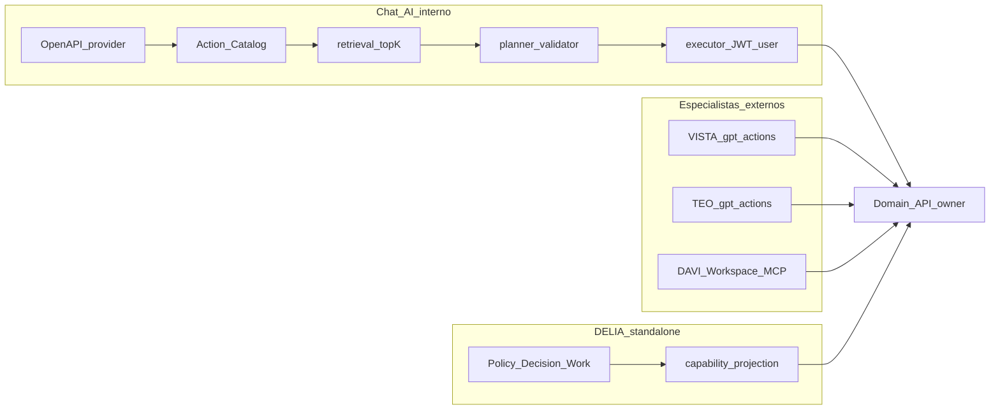
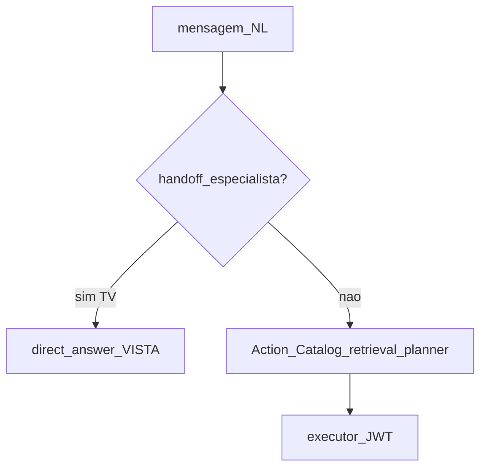

# Playbook — refatoração OpenAPI-first do Chat AI

**Status:** vigente (procedimento de refatoração; **não** substitui regras `.cursor`)  
**Escopo:** documentação acionável para epics futuros de código em `minha-delpi-ai-api`  
**Não é:** implementação de cutover, unificação Chat=DÉLIA, nem cópia de arquivos de `delia-api` / `gpt-actions`

**Autoridades:**

| Ordem | Fonte |
|------:|-------|
| 1 | Constituição mínima `.cursor` + 8 responsabilidades transversais |
| 2 | [`.cursor/rules/openapi-first-universal-tool-routing.mdc`](../../../.cursor/rules/openapi-first-universal-tool-routing.mdc) |
| 3 | [`.cursor/rules/new-api-route-checklist.mdc`](../../../.cursor/rules/new-api-route-checklist.mdc) + [`new-api-route-checklist.md`](./new-api-route-checklist.md) |
| 4 | [`.cursor/rules/chat-intelligence-base.mdc`](../../../.cursor/rules/chat-intelligence-base.mdc) + [`chat-intelligence-base.md`](./chat-intelligence-base.md) |
| 5 | [`.cursor/rules/schema-first-presentation-delivered.mdc`](../../../.cursor/rules/schema-first-presentation-delivered.mdc) |
| 6 | [`.cursor/rules/ai-intelligence-evaluation.mdc`](../../../.cursor/rules/ai-intelligence-evaluation.mdc) + [`../testing/chat-ai-flow-families.md`](../testing/chat-ai-flow-families.md) |
| 7 | Boundary Chat ≠ gpt-actions: [`.cursor/rules/custom-gpt-actions-integration.mdc`](../../../.cursor/rules/custom-gpt-actions-integration.mdc) |
| 8 | Boundary Chat ≠ DÉLIA: [`.cursor/rules/delia-execution-protocol.mdc`](../../../.cursor/rules/delia-execution-protocol.mdc) *(só boundary; não dono do Chat)* |

Este playbook **referencia** as fontes acima. Não as reescreve. Em conflito, a regra `.cursor` / doc canônico vence.

---

## 1. Objetivo

Eliminar a pressão de “conhecer todas as rotas da API” e as práticas ruins que competem com o cold path OpenAPI-first.

```text
Nova API = OpenAPI válido + import/index + bind no agente + NL
→ sem registry/selector/marker novo
→ sem if path no core
→ writes com confirmation ou handoff ao especialista dono
→ evals R1–R11
```

**Não** é objetivo deste documento:

- portar `delia-api` / capability catalog DÉLIA para o Chat;
- fazer o Chat chamar `gpt_*` / façade `/gpt-actions/v1` como caminho canônico;
- copiar Instructions GPT, matrices VISTA/TÉO ou adapters DÉLIA para `minha-delpi-ai-api`.

---

## 2. Chat ≠ DÉLIA ≠ especialistas externos



| Produto | Papel | Path canônico de tools |
|---------|-------|------------------------|
| **Chat AI** | Inteligência interna Minha DELPI | OpenAPI → Action Catalog → retrieval → planner → JWT user |
| **VISTA / TÉO / Custom GPT** | Superfície externa / bridge | Façade compacta `/gpt-actions/v1` no owner |
| **DAVI / Workspace Agent** | Orquestração UX/MCP | Plugin MCP; não owner de domínio |
| **DÉLIA** | App standalone industrial | Policy/Decision/Work + gates próprios |

### 2.1 O que NÃO herdar da DÉLIA

Do protocolo standalone (`delia-execution-protocol.mdc`):

- ciclo C0–C7, `DÉLIA EXECUTION BRIEF/REPORT`, ledger `CP-*` como DoD do Chat;
- namespaces `minha-delpi-copilot*`;
- C0 “não criar NEW RUNTIME…” como freio genérico do Chat (é gate de fase DÉLIA);
- preferência Action Gate `API → RPA → computer-use → Human Task` como pipeline de tools do Chat;
- autonomia C5/C6/C7 / Watch industrial / safety PLC-OT;
- handoff GPT↔Cursor com veredito `ACCEPT|REWORK` exclusivo DÉLIA;
- dependência de tabelas/agents/prompts do Chat como runtime DÉLIA — e o inverso: **não** tornar o Chat implementação canônica DÉLIA.

### 2.2 Princípios transferíveis (técnicas, sem stack)

| Princípio | Origem | Tradução no Chat |
|-----------|--------|------------------|
| Capability ≠ path/opId | DÉLIA | Routing por Action Catalog + retrieval; path só dado técnico do descriptor |
| Catalog projeta; não inventa domínio | VISTA / Contract Gate | Import OpenAPI; heurísticas em content/`x-delpi`, não registry paralelo |
| User-parity + AuthZ no owner | VISTA/TÉO/DAVI | `forward_user_bearer`; backend decide; JWT ≠ permissão final |
| PREPARE ≠ ACT | VISTA/TÉO / Action Gate | confirmation / sensitivity; não tool “apply” inventada |
| Handoff se outro dono do write | TV→VISTA | Direct answer + orientação; não skill tipada de mutação no Chat |
| Adapter sem ownership | DÉLIA / matrizes | Chat orquestra; Domain API é SoT |
| Abstraction Gate (espírito) | DÉLIA | Não criar `UniversalToolEngine` especulativo “para depois” |
| Evidência antes de PASS | DÉLIA / evals | R1–R11 + live; sucesso HTTP ≠ outcome de negócio (R9) |

### 2.3 Não copiar arquivos — alinhar padrão

```text
Fonte canônica .cursor / docs owner
→ este playbook referencia por link
→ implementação futura no módulo canônico do Chat
```

**Proibido:**

- copiar `capability_catalog_adapter.py`, matrices VISTA/TÉO, `vista_agent_intelligence.json`, Instructions GPT para o Chat;
- duplicar o texto integral de `openapi-first-universal-tool-routing.mdc` em outro `.mdc`;
- criar terceira fonte de routing “inspirada” em DÉLIA.

---

## 3. Estado atual vs arquitetura-alvo

### 3.1 Cold path canônico (manter)

```text
OpenAPI provider
→ import/index
→ Action Catalog
→ agent binding + allowed_action_ids
→ hybrid retrieval top-K
→ structured planner
→ OpenAPI argument validator
→ RBAC/policy/confirmation
→ ExecuteExternalActionUseCase
→ schema-driven presentation
```

Módulos de referência (não remover no epic futuro):

| Papel | Módulo |
|-------|--------|
| Import OpenAPI | `app/infrastructure/external_actions/openapi_action_importer.py` |
| Action descriptor / catalog | `app/domain/models/action_descriptor.py` + repositório/catalog loaders |
| Retrieval | `app/application/services/retrieve_action_candidates_service.py` |
| Planner | `openapi_llm_action_planner_service.py`, `plan_external_actions_service.py` |
| Bridge OpenAPI-first | `openapi_first_selection_bridge_service.py` |
| Binder + validator | `schema_driven_argument_binder_service.py`, `validate_action_arguments_service.py` |
| Executor | `ExecuteExternalActionUseCase` + `http_external_action_gateway.py` (`user_token`) |
| Presentation | `chat_schema_driven_presentation_service.py` |

### 3.2 Autoridade residual que compete (problema)



**F1 (2026-09-22):** cutover de autoridade de seleção concluído. ActionId user-facing = OpenAPI-first (`OpenApiFirstSelectionBridgeService` / `ExternalActionSelectionService`). Registry/`OperationalRoute*`/`customPredicate` de rota / selectors path-OID / follow-up `preferredRouteId`/`routeSegment` **não** são mais autoridade de seleção.

**F2 (2026-09-22):** apresentação schema-first — KPI/no-chart sem path tokens; `column_labels.operationIdContains` casa OID real (senão keys-only); SQL present prefere payload; `entityPathHints` = FALLBACK.

### 3.3 Alvo (desenho — epics F2–F5)

```text
NL → (handoff se especialista dono do write)
  → Action Catalog allowed
  → retrieval top-K → planner → validate OpenAPI
  → policy READ | WRITE+confirm
  → executor JWT
  → schema-driven presentation
  → evals R1–R11
```

Registry/selectors/presenters path-aware deixam de ser **autoridade**. Remanescentes só com tombstone documentado ou delete autorizado.

---

## 4. Inventário de anti-padrões (higiene)

Legenda: **VIVO** = afeta runtime/content; **SHADOW** = observe/compare sem authority; **RETIRADO** = tombstone/cleanup.

| Anti-padrão | Evidência | Status | Nota |
|-------------|-----------|--------|------|
| `operational_route_registry.json` como catálogo paralelo | `operational_route_registry.json`; `cleanupMeta.customPredicateAuthorityRemovedAt=F1` | **RETIRADO** *(seleção)* | Arquivo pode restar para facets/narrative/CI; **não** authority de actionId |
| Consumers `OperationalRoute*` | stack selection + facade `select_operational_registry` → `None` | **RETIRADO** *(seleção user-facing)* | Suggest admin = COLD; hot path = OpenAPI |
| `customPredicate` tipado no **registry match** | registry scrub + lint F1 + vocabulary matcher refuse | **RETIRADO** | `matches_custom_predicate` pode restar para **intent/UX language** fora do registry de rotas |
| `route.operationIds` manuais | `cleanupMeta.operationIdsEmptiedAt=J-R8`, `operationIdsRuntimeAuthority=false` | **RETIRADO** | Arrays esvaziados; não reintroduzir |
| `pathMarkers` / `parameterStrategy` / `routeSegment` no registry | `cleanupMeta.*DeletedAt=E9.S12.*` | **RETIRADO** | Tombstones; não reintroduzir |
| `registrySelectionShadow` / `parameterStrategyShadow` | `openapi_tool_routing.json`; product/registry `legacyRemovedAt=F1` | **SHADOW**→observabilidade residual | Cutover ligado; legacy hot select **removido** |
| OpenAPI-first bridge primary | `openapi_first_selection_bridge_service.py`; orchestration `selectionMode=openapi_first` | **CANÔNICO** | Always-on planner path |
| `pathContains` em content lateral | E10 smoke; `pathRulesDeletedAt` | **RETIRADO** | Keys laterais removidas |
| `pathContains` residual em **seleção**/priorização | prioritization `apply()` noop; group-by path match → None | **RETIRADO** *(F1)* | Presenters path = F2 |
| `routeSegment` / `preferredRouteId` follow-up | `operational_follow_up_routing.json`; APIs retornam `None` | **RETIRADO** *(F1)* | Continuidade via `follow_up_type` + grants |
| `paginatedPathFragments` | registry vocabulary vazio; pagination por params/coverage | **RETIRADO** *(F1)* | |
| Presenters KPI/SQL path-aware | `presenters/kpi_chart/*`, `presenters/sql_presenter.py` | **RETIRADO** *(F2)* | KPI = entity/shape; SQL present = payload first; path markers só capability |
| Profile `entityPathHints` | `chat_presentation_profile_path_service.py`; `presentation_profiles.json` | **FALLBACK** *(F2)* | `meta.entity` first; hints só sem entity; `entityPathHintsAuthority=false` |
| Gate `if path` no motor genérico | `scripts/audit_presentation_path_ifs.py` → 0 | **RETIRADO** | Não reabrir condicionais no core |
| TV Copilot / mutation tools no Chat | skill flag stripped; `/data/copilot/*` 410 | **RETIRADO** | Substituído por handoff VISTA |
| Handoff TV→VISTA | `chat_tv_dashboard_handoff_service.py`; `tv_dashboard_handoff.json` | **VIVO** *(padrão correto)* | Direct answer; zero mutation tool |
| Skills tipadas restantes | `chat_skill_registry.py` (sql, drawing, document-vision, PAC, …) | **VIVO** | Flags/policies; não recriar skill de mutação TV |
| S2S como execute user-facing | internals suggest/sync only; gateway `user_token` | **RETIRADO** | S2S ≠ autoridade de action do usuário |
| Selectors `operationIdContains*` de **seleção** | `siblingDisambiguation=[]`; group-by JSON scrub | **RETIRADO** *(F1)* | `column_labels.operationIdContains` casa **OID real** ou keys-only *(F2)* |
| Hardcode `operationId` em skill policy | `quality-action-plans-delpi-skill.md`, `drawing-analysis-delpi-skill.md` | **VIVO** | Enumeração em policy de skill (fora do planner universal) |
| Planner enumerando rotas no prompt | `openapi_tool_routing.json` — “Never invent operationIds outside the catalog” | **RETIRADO** *(anti-padrão)* | Comportamento correto; preservar |
| Mirror CI `autoTierCRoutes` | lint demoted to warnings (non-authority) | **SHADOW**/CI | Drift de cobertura; não authority user-facing |
| Fast-path `intentBinding` registry | `ChatOperationalIntentFastPathService` — elegibilidade canônica sem registry list | **RETIRADO** *(F1)* | |
| Copiar façade gpt-actions / Instructions para o Chat | — | **PROIBIDO** | Alinhar por link; nunca por cópia |

Evidence histórica (não autoridade): [`../roadmap/llm-json-decoupling/`](../roadmap/llm-json-decoupling/) — J-R8 OID paralelo ✅. Gate residual F1: `tests/unit/application/services/test_f1_residual_selection_authority.py`. Gate residual F2: `tests/unit/domain/services/test_f2_residual_presentation_authority.py`. Gate residual F3: `tests/unit/domain/services/test_f3_residual_write_confirmation_authority.py`.

---

## 5. Matriz Chat × especialistas (handoff vs execute)

| Domínio | Especialista | Read no Chat? | Write no Chat? | Handoff? | Owner |
|---------|--------------|---------------|----------------|----------|-------|
| TV Dashboard | **VISTA** | Não (intent → direct answer) | Não (`/data/copilot/*` 410) | **Sim** — `ChatTvDashboardHandoffService` + `tv_dashboard_handoff.json` | `tv-dashboard-api` |
| Transformômetro | **TÉO** | Sim (provider `transformometro-api`, `allowWrite: false`) | Não; writes só em TÉO (prepare→commit) | Não (superfícies **paralelas**) | `transformometro-api` |
| Dados operacionais | **DAVI** (Workspace/MCP) | Sim via Action Catalog | Conforme `allowWrite` + sensitivity do provider; DAVI é READ-only | Não (Chat ≠ DAVI) | `api-delpi` |
| PAC Qualidade | — (sem Custom GPT) | Sim — skill `quality-action-plans-delpi` | Sim se `allowWrite` + **confirmação** | Não (orientação a plugin/agente, não GPT) | `api-delpi` |
| Production Pulse | — | Fora do inventário de handoff atual | — | Não encontrado | `production-pulse-api` |

### Regra de decisão

1. **Handoff** quando o domínio tem especialista externo dono da mutação e o Chat retirou tools de write (padrão TV→VISTA): detectar intent/surface → direct answer → nunca mintar mutation tool.
2. **Execute no Chat** quando a capability está no Action Catalog do agente e o provider permite (reads api-delpi / snapshot Transformômetro / PAC GET).
3. **Write no Chat** só com `allowWrite` + sensitivity write + **confirmação** (ex.: PAC). Confirmação conversacional ≠ AuthZ.
4. **Não misturar superfícies**: TÉO/DAVI/MCP são consumidores paralelos do mesmo owner; ausência de `*HandoffService` = usuário vai ao especialista, o pipeline Chat não faz bridge automático.
5. **Soft agent handoff** (`ChatSoftAgentHandoffService`) troca agente interno do workspace — **não** substitui handoff VISTA/TÉO/DAVI.

Boundaries: [`custom-gpt-actions-integration.mdc`](../../../.cursor/rules/custom-gpt-actions-integration.mdc), [`openai-workspace-agent-integration.mdc`](../../../.cursor/rules/openai-workspace-agent-integration.mdc).

---

## 6. Como conectar uma API nova (sem enumerar rotas)

Procedimento detalhado: [`new-api-route-checklist.md`](./new-api-route-checklist.md) e [`.cursor/rules/new-api-route-checklist.mdc`](../../../.cursor/rules/new-api-route-checklist.mdc).

### Checklist operacional (resumo)

1. **OpenAPI** do provider: `operationId` estável, schemas, segurança, erros — em inglês nos identifiers.
2. **Import/index** → Action Catalog persistido (não JSON de paths no assistente).
3. **Bind** no agente: `allowed_action_ids` + policies (`allowWrite`, sensitivity).
4. **Auth**: forward JWT do usuário; AuthZ no backend owner.
5. **NL**: descrição/`x-delpi`/content de UX — **não** lista de rotas no prompt.
6. **Presentation**: schema-driven genérico; presenter dedicado só se o genérico falhar com evidência.
7. **Writes**: confirmation ou handoff ao especialista dono (matriz §5).
8. **Evals**: R1–R11 no corpus vigente; API desconhecida + metamórfico se tocar o motor.

### Anti-exemplos (não fazer)

| Errado | Certo |
|--------|-------|
| Nova entrada em `operational_route_registry.json` | Só OpenAPI + catalog + bind |
| `customPredicate` / `pathContains` / selector por provider | Retrieval + planner sobre candidates |
| `if "/stock" in path` no core | Profile/schema/`x-delpi` no owner |
| Skill tipada de mutação no Chat para domínio com especialista | Handoff (padrão VISTA) |
| Copiar OpenAPI compacto de gpt-actions para o Chat | Chat importa o OpenAPI **do provider** (não a façade) |
| Enumerar `operationId` no system prompt do planner | “Somente IDs do catalog/candidates” |
| S2S para executar action do usuário | `user_token` / `forward_user_bearer` |

Uma página mental: **OpenAPI bom + import + bind + NL → pronto**. Se alguém pedir “cadastre a rota no registry”, a resposta do padrão é **não**.

---

## 7. Roadmap de implementação futura (fora deste documento)

Pré-condição de cada epic: este playbook aprovado como referência. **Não executar cutover neste arquivo.**

| Epic futuro | Objetivo | DoD sugerido |
|-------------|----------|--------------|
| **F1 Cutover authority** | Registry/selectors deixam de selecionar; shadow só observe ou remove | **ATENDIDO (2026-09-22)** — seleção user-facing catalog/retrieval/planner; residual gate `test_f1_residual_selection_authority.py` |
| **F2 Presentation schema-first** | Remover heurísticas path em KPI/SQL/profile hints que forem autoridade | **ATENDIDO (2026-09-22)** — entity/shape + payload; `entityPathHints` FALLBACK; gate `test_f2_residual_presentation_authority.py` |
| **F3 Writes + handoff** | Confirmation uniforme; matriz §5 aplicada | **PARCIAL (2026-09-22)** — `should_block` ≡ bridge; sql/export allowlist; `allowWrite` create default False; TV handoff CANÔNICO; flags agent/provider + executor HTTP ainda DEAD/GAP |
| **F4 Evals** | R1–R11 + smoke provider OpenAPI-only (API nunca vista) | Baseline×candidate; R9 outcome; sem dimensão INCONCLUSIVE em release |
| **F5 CI anti-reintrodução** | Gate residual: registry predicates novos, pathContains, selector por provider | CI vermelho ao reintroduzir anti-padrão **VIVO** listado |

Programa histórico relacionado (não reabrir como SoT): [`../roadmap/llm-json-decoupling/`](../roadmap/llm-json-decoupling/).

---

## 8. Definition of Done deste playbook (documental)

- [x] Hierarquia de autoridades e Chat ≠ DÉLIA / ≠ gpt-actions explícitos
- [x] Princípios transferíveis sem importar stack DÉLIA
- [x] Anti-padrões com path + status VIVO|SHADOW|RETIRADO
- [x] Arquitetura atual vs alvo (diagramas)
- [x] Matriz Chat × VISTA/TÉO/DAVI/PAC
- [x] Checklist “nova API sem enumerar rotas” + anti-exemplos
- [x] Roadmap F1–F5 referenciado, não implementado
- [x] Zero cópia de arquivos DÉLIA/gpt-actions; só links
- [x] Ponte a partir de [`chat-intelligence-base.md`](./chat-intelligence-base.md)

---

## 9. Referências

- [`chat-intelligence-base.md`](./chat-intelligence-base.md)
- [`new-api-route-checklist.md`](./new-api-route-checklist.md)
- [`presentation-intelligence.md`](./presentation-intelligence.md)
- [`../testing/chat-ai-flow-families.md`](../testing/chat-ai-flow-families.md)
- [`../api/04-actions-openapi.md`](../api/04-actions-openapi.md)
- [`.cursor/rules/openapi-first-universal-tool-routing.mdc`](../../../.cursor/rules/openapi-first-universal-tool-routing.mdc)
- [`.cursor/rules/new-api-route-checklist.mdc`](../../../.cursor/rules/new-api-route-checklist.mdc)
- [`.cursor/rules/custom-gpt-actions-integration.mdc`](../../../.cursor/rules/custom-gpt-actions-integration.mdc)
- [`.cursor/rules/delia-execution-protocol.mdc`](../../../.cursor/rules/delia-execution-protocol.mdc)
- [`.cursor/rules/centralized-rules-first.mdc`](../../../.cursor/rules/centralized-rules-first.mdc)
